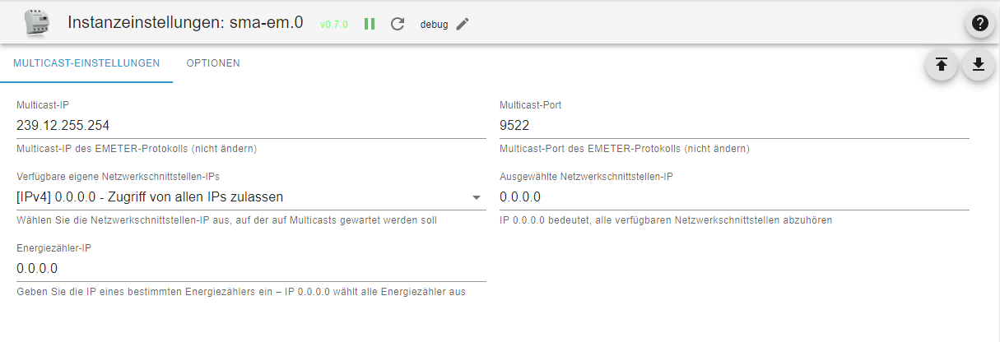

# SMA Energy Meter Adapter Dokumentation

## Allgemeine Informationen

Der SMA Energy Meter Adapter empfängt die Multicast Datagramme des Energy-Meters bzw. des Sunny Home Managers. Diese senden jede Sekunde oder öfter Datenpakete mit ihren Messwerten ins Netzwerk. Das Sendeintervall von 200ms, 600ms oder 1000ms ist einstellbar im Sunny Portal.

## Administration / Admin-Seite

- Reiter Multicast-Einstellungen
  - Multicast IP: Standardmäßig eingestellt und von SMA vorgegeben ist die IP-Adresse 239.12.255.254.
  - Multicast Port: Standardmäßig eingestellt und von SMA vorgegeben ist der UDP Port: 9522.
  - Eigene Netzwerkschnittstellen-IPs: Ein Auswahlfeld, das alle verfügbaren Netzwerkschnittstellen-IPv4s auf dem ioBroker-Server anzeigt. Wählen Sie hier die Netzwerkschnittstellen-IP aus, auf der auf Multicasts gewartet werden soll.
  - Ausgewählte Netzwerkschnittstellen-IP: Derzeit ausgewählte Netzwerkschnittstellen-IP, die auf Multicast-Nachrichten wartet. IP 0.0.0.0 bedeutet, dass der Adapter auf alle verfügbaren Netzwerkschnittstellen lauscht. Diese Einstellung wird nicht empfohlen, da sie in manchen Netzwerken zu Problemen führen kann.
  - Energiezähler-IP: IP Adresse eines bestimmten Energiezählers. Wird diese eingegeben, werden die Daten nur dieses einen Energiezählers in einer Instanz des Adapters erfasst. Sind mehrere Energiezähler vorhanden, so können diese jeweils einzeln in weiteren Instanzen des Adapters konfiguriert werden. Vereinfacht wird dieses Verfahren über die ioBroker discovery, die die im Netzwerk erreichbaren SMA Energiezähler detektiert und die Erstellungen von einer Instanz je gefundenem Energiezähler anbietet.
  IP 0.0.0.0 wählt alle Energiezähler aus. Alle vorhandenen Energiezähler werden von einer Instanz des Adapters erfasst. Dies ist die Standardeinstellung und bietet die Kompatibilität mit früheren Versionen des Adapters.

- Reiter Optionen
  - Details L1 - L3: Über diese Auswahlpunkte können Details zu jeder einzelnen Phase angezeigt werden.
  - Erweiterter Modus: Bietet detailiertere Information wie Blindleistung, Scheinleistung, cosphi, Spannungen, Stromstärke usw. Diese Einstellung ist standardmäßig deaktiviert.
  - Echtzeit-Aktualisierungsintervall: Hier wird das Update-Intervall für Echzeitdaten wie z.B Momentanleistung oder Netzfrequenz eingestellt. Dies dient der Verminderung der Systemlast. Beispiel: Bei einer Datenpaktrate von 5/s (200ms Sendeintervall) werden während eines Echtzeit-Aktualisierungsintervalls von einer Sekunde alle Werte aufsummiert und erst am Ende des Intervalls der Mittelwert bzw. bei Frequenz und Phase der Median im entsprechenden ioBroker Datenpunkt aktualisiert.
  - Nicht-Echtzeit-Aktualisierungsintervall: Hier wird das Update-Intervall für Nicht-Echzeitdaten wie z.B Zählerstände eingestellt. Hier wird erst am Ende des Intervalls der letzte empfangene Wert im entsprechenden ioBroker Datenpunkt aktualisiert.

## Ordnerstruktur / Objekte

Nach Installation und Start des Adapters wird die auf dem Bild gezeigte Ordnerstruktur angelegt. Im Stammverzeichnis befinden sich die Gesamtdaten des Energy Meters. Sofern sie konfiguriert wurden, befinden sich in den Unterordnern L1-L3 jeweils die Werte der einzelnen Phasen.

## Erklärung der Objekt-IDs

Die Buchstaben p, q und s und stehen für folgende Begriffe aus der Elektrotechnik:

- P - Wirkleistung
- Q - Blindleistung
- S - Scheinleistung

- Das Wort "regard" bedeutet hier soviel wie Netzbezug. (Strom, der vom Netz bezogen wird)
- Das Wort "surplus" bedeutet Überschuss und hier soviel wie Netzeinspeisung. (Strom, der ins Netz eingespeist wird)
- Das Wort "counter" bedeutet Zähler.

Daraus setzen sich die Objektnamen zusammen z.B.

- pregard - Wirkleistung Netzbezug
- psurplus - Wirkleistung Einspeisung
- pregardcounter - Zähler der Wirkleistung Netzbezug
- qregard - Blindleistung Netzbezug
- ...

## Changelog
### 1.0.0 (2023-08-19)

- (pdbjjens) Change: node>=16, js-contoller>=4 and admin>=6 required
- (pdbjjens) Change: Configurable Energy Meters per adapter instance
- (pdbjjens) Change: Selectable own network device IP to listen for multicast messages
- (pdbjjens) Change: Objects "last_message" and "TimeTick" were removed
- (pdbjjens) New: Support ioBroker discovery
- (pdbjjens) New: Detect SMA-EM 1.0 (SUSy 270)
- (arteck) New: Detect new SHM 2.0 with SUSy 501
- (ticaki) Fix: Catch interface errors

### 0.7.0 (2023-03-14)

- (pdbjjens) New: Configurable data point update intervals to reduce system load
- (pdbjjens) New: Use JSON config

### 0.6.6 (2023-02-28)  2023 maintenance release

- (pdbjjens) Updated dependencies
- (pdbjjens) New: Use adapter-dev instead of gulp translate

### 0.6.5 (2022-02-19)

- Updated dependencies
- Compatibility check for js-controller 4.0
- Prevent onUnload warnings

### 0.6.4 (2021-08-19)

- (TGuybrush) Bug fixes
- Prevent warnings regarding non-existent objects upon adapter instance creation and start-up under js-controller 3.2.x
- Improved check of SMA Energy Meter multicast messages to prevent ghost devices and warnings regarding unknown OBIS values.

## License

The MIT License (MIT)

Copyright (c) 2023 IoBroker-Community

Permission is hereby granted, free of charge, to any person obtaining a copy
of this software and associated documentation files (the "Software"), to deal
in the Software without restriction, including without limitation the rights
to use, copy, modify, merge, publish, distribute, sublicense, and/or sell
copies of the Software, and to permit persons to whom the Software is
furnished to do so, subject to the following conditions:

The above copyright notice and this permission notice shall be included in
all copies or substantial portions of the Software.

THE SOFTWARE IS PROVIDED "AS IS", WITHOUT WARRANTY OF ANY KIND, EXPRESS OR
IMPLIED, INCLUDING BUT NOT LIMITED TO THE WARRANTIES OF MERCHANTABILITY,
FITNESS FOR A PARTICULAR PURPOSE AND NONINFRINGEMENT. IN NO EVENT SHALL THE
AUTHORS OR COPYRIGHT HOLDERS BE LIABLE FOR ANY CLAIM, DAMAGES OR OTHER
LIABILITY, WHETHER IN AN ACTION OF CONTRACT, TORT OR OTHERWISE, ARISING FROM,
OUT OF OR IN CONNECTION WITH THE SOFTWARE OR THE USE OR OTHER DEALINGS IN
THE SOFTWARE.