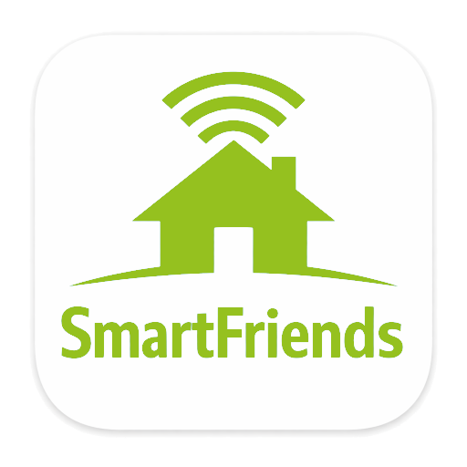

# ioBroker.smartfriends

## Smartfriends-Adapter für ioBroker

Dieser Adapter ermöglicht die direkte **lokale Integration** der **SmartFriends Box** (z. B. Smart Friends Box von Schellenberg, ABUS, Paulmann, STEINEL usw.) in ioBroker – **ohne die offizielle Cloud zu nutzen** .

Der Adapter stellt eine direkte Verbindung zum Gateway her, um Geräte lokal zu steuern und abzufragen.

## Dokumentation:

- [Englische Beschreibung](https://github.com/Black-Thunder/ioBroker.smartfriends/tree/master/docs/en/smartfriends.md)
- [Deutsche Beschreibung](https://github.com/Black-Thunder/ioBroker.smartfriends/tree/master/docs/de/smartfriends.md)

## Diskussion:

- [ioBroker-Forum](https://forum.iobroker.net/topic/83202)

## Danksagungen

Besonderer Dank und Anerkennung gebührt [LoPablo](https://github.com/LoPablo/SchellenbergApi) für das Reverse Engineering der API!

## Changelog

<!--
	Placeholder for the next version (at the beginning of the line):
	### __WORK IN PROGRESS__
-->

### 2.1.0 (2026-08-26)

- (Black-Thunder) Adapter requires js-controller >=7.2.2 and admin >=7.9.0 now
- (Black-Thunder) Support for the central ioBroker credentials store was added, while legacy username/password configuration remains supported for backwards compatibility
- (Black-Thunder) Automatic reconnection is now stopped when the gateway rejects the configured login parameters

### 2.0.0 (2026-06-01)

- (copilot) Adapter requires node.js >= 22 now
- (Black-Thunder) Additional irrelevant gateway messages are now ignored
- (Black-Thunder) Dependencies were updated

### 1.3.6 (2026-03-13)

- (Black-Thunder) Connection and reconnection logic to the gateway was refactored
- (Black-Thunder) Additional irrelevant gateway messages are now ignored
- (Black-Thunder) Adapter requires admin version >=7.6.20 now

### 1.3.5 (2026-02-24)

- (Black-Thunder) Additional logging when connection parameters are incorrect was added
- (Black-Thunder) Validation of the adapter configuration in the GUI was added

### 1.3.4 (2026-01-21)

- (Black-Thunder) Additional irrelevant gateway messages are now ignored
- (Black-Thunder) Unknown gateway messages are now logged as warning instead of error

[Older changelogs can be found there](https://github.com/Black-Thunder/ioBroker.smartfriends/blob/master/CHANGELOG_OLD.md)

## License

MIT License

Copyright (c) 2025-2026 Black-Thunder <glwars@aol.de>

Permission is hereby granted, free of charge, to any person obtaining a copy
of this software and associated documentation files (the "Software"), to deal
in the Software without restriction, including without limitation the rights
to use, copy, modify, merge, publish, distribute, sublicense, and/or sell
copies of the Software, and to permit persons to whom the Software is
furnished to do so, subject to the following conditions:

The above copyright notice and this permission notice shall be included in all
copies or substantial portions of the Software.

THE SOFTWARE IS PROVIDED "AS IS", WITHOUT WARRANTY OF ANY KIND, EXPRESS OR
IMPLIED, INCLUDING BUT NOT LIMITED TO THE WARRANTIES OF MERCHANTABILITY,
FITNESS FOR A PARTICULAR PURPOSE AND NONINFRINGEMENT. IN NO EVENT SHALL THE
AUTHORS OR COPYRIGHT HOLDERS BE LIABLE FOR ANY CLAIM, DAMAGES OR OTHER
LIABILITY, WHETHER IN AN ACTION OF CONTRACT, TORT OR OTHERWISE, ARISING FROM,
OUT OF OR IN CONNECTION WITH THE SOFTWARE OR THE USE OR OTHER DEALINGS IN THE
SOFTWARE.