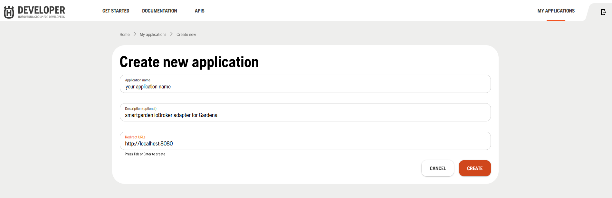
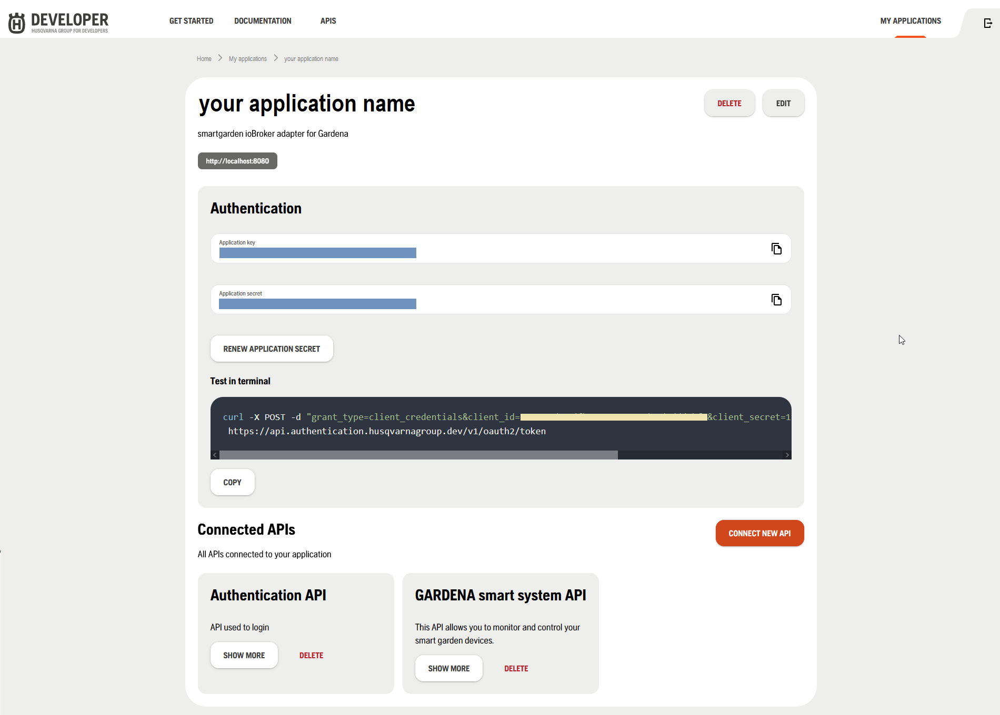
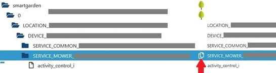

# IoBroker.smartgarden
## IoBroker Smartgarden-Adapter für das GARDENA Smart-System
Ein Adapter für das GARDENA Smart-System unter Verwendung des offiziellen [GARDENA Smart System API](https://developer.husqvarnagroup.cloud/apis/GARDENA+smart+system+API#/general) und Dienstes.

Der Adapter ermöglicht die Entwicklung einer Anwendung (z. B. mit VIS), die parallel zur offiziellen GARDENA-App genutzt werden kann. Der Adapter und seine Zusatzfunktionen beeinträchtigen keine der Basisfunktionen der GARDENA-App und umgekehrt.

Der Adapter ist kein vollständiger Ersatz für die GARDENA App, sondern eine Ergänzung zur Integration von GARDENA Geräten in ein Smart Home mit ioBroker.
Die wichtigsten Funktionen lassen sich mit dem Adapter steuern. Er bietet außerdem die Möglichkeit, eigene Ideen umzusetzen, die mit der GARDENA App nicht realisierbar sind.

## Unterstützte Geräte
- GARDENA smart SILENO Mähroboter
- GARDENA intelligente Bewässerungssteuerung
- GARDENA smarte Druckpumpe
- GARDENA intelligente Wassersteuerung
- GARDENA Smart-Netzteil
- GARDENA intelligenter Sensor

Weitere Informationen zu den Geräten finden Sie unter [GARDENA Deutsche Website](https://www.gardena.com/de/produkte/smart/smartsystem/) und [hier auf Englisch](https://www.gardena.com/uk/products/smart/smart-system/).

## Anforderungen
Für die Verwendung dieses Adapters benötigen Sie Folgendes:

1. ein GARDENA Smart-Systemkonto
1. ein GARDENA-Anwendungsschlüssel
1. Ein Anwendungsgeheimnis von GARDENA

Um diese Dinge zu erhalten, besuchen Sie bitte das Husqvarna Developer Portal unter [https://developer.husqvarnagroup.cloud/](https://developer.husqvarnagroup.cloud/).

Bitte registrieren Sie sich oder melden Sie sich an, falls Sie bereits ein Konto besitzen, und erstellen Sie eine neue Anwendung, um Ihren *Anwendungsschlüssel* und Ihr *Anwendungsgeheimnis* zu erhalten.

Aktuell sieht die Website wie in den folgenden Screenshots aus.

---


Drücken Sie die Schaltfläche **NEUE ANWENDUNG**

---



Bearbeiten Sie das Formular mit Ihren eigenen Daten. Das Feld *Weiterleitungs-URLs* wird derzeit nicht verwendet. Daher können Sie momentan beliebige Werte eingeben. Klicken Sie auf die Schaltfläche **ERSTELLEN**.

---



Auf der nächsten Seite erhalten Sie den *Anwendungsschlüssel* und das *Anwendungsgeheimnis*.

Diese Werte benötigen Sie für die Konfiguration Ihrer Adapterinstanz.

Anschließend müssen Sie die APIs verbinden.

- Authentifizierungs-API ***und***
- GARDENA Smart System API.

Drücken Sie dazu die Schaltfläche **NEUE API VERBINDEN** und wählen Sie die erste API aus. Wiederholen Sie den Vorgang für die zweite API.

---

**Notiz:**

- Wenn Sie bereits einen Husqvarna Automower® Connect oder einen

Mit Ihrem GARDENA Smart System-Konto können Sie sich anmelden und anschließend die Anwendung erstellen, um den Anwendungsschlüssel und das Anwendungsgeheimnis zu erhalten.

	---

***Und es ist nahezu sicher, dass Sie bereits ein Konto besitzen.*** *Bitte verwenden Sie dasselbe Konto wie für die GARDENA App, in dem Ihre GARDENA Geräte registriert sind. Andernfalls erhalten Sie keinen Zugriff auf Ihre Geräte.*

	---

- Stellen Sie sicher, dass Sie die Anwendung mit den APIs verbunden haben.
- Authentifizierungs-API ***und***
- GARDENA Smart System API.

Und natürlich benötigen Sie eine laufende ioBroker-Installation (zumindest mit der admin5-Benutzeroberfläche) und Sie sollten mindestens eine funktionierende [GARDENA Smart-Gerät](#supported-devices) besitzen.

## Inhaltsverzeichnis
* [ioBroker Smartgarden-Adapter für GARDENA Smart-System](#iobroker-smartgarden-adapter-for-gardena-smart-system)
* [Unterstützte Geräte](#supported-devices)
* [Anforderungen](#requirements)
* [Inhaltsverzeichnis](#table-of-contents)
* [Installation](#installation)
* [Setup-Adapter](#setup-adapter)
* [Unterstützung anfordern](#getting-support)
* [Datenpunkte des Adapters](#data-points-of-the-adapter)
* [Allgemeine Informationen zu Datenpunkten](#general-things-to-know-about-data-points)
* [Für SERVICE_MOWER](#for-service_mower)
* [Für SERVICE_VALVE_SET](#for-service_valve_set)
* [Für SERVICE_VALVE](#for-service_valve)
* [Für SERVICE_POWER_SOCKET](#for-service_power_socket)
* [Für SERVICE_SENSOR](#for-service_sensor)
* [Für SERVICE_COMMON](#for-service_common)
* [Ratenbegrenzungen](#rate-limits)
* [Bewässerung während des Mähens nicht erlaubt](#Bewässerung-während-des-Mähens-nicht-erlaubt)
* [Was ist das Problem?](#whats-the-problem)
* [Was wird getan?](#was-wird-getan)
* [Grundlegendes Verhalten -- WARNUNG](#basic-behaviour----warning)
* [Wünsche für Datenpunkte](#Wünsche-für-Datenpunkte)
* [Hinweis](#Hinweis)
* [Änderungsprotokoll](#changelog)
* [2.0.1](#201)
* [2.0.0](#200)
* [vorherige Versionen](#106)
* [Credits](#credits)
* [Lizenz](#license)

## Installation
Ein Adapter ist verfügbar

- bei npm: Installieren Sie mit `npm install iobroker.smartgarden`
- auf GitHub unter https://github.com/jpgorganizer/ioBroker.smartgarden.

Eine Beschreibung zur Installation von GitHub finden Sie unter [Hier](https://www.iobroker.net/docu/index-235.htm?page_id=5379&lang=de#3_Adapter_aus_eigener_URL_installieren) (deutsche Sprache).

## Adapter einrichten
1. Installieren Sie den Adapter.
2. Erstellen Sie eine Instanz des Adapters.
3. Instanzkonfiguration prüfen und abschließen

**Wenn Sie einen dieser Einstellungen ändern, starten Sie bitte Ihren Adapter neu.**

3.1 Bearbeiten Sie den Anwendungsschlüssel und das Anwendungsgeheimnis und/oder optional den Benutzernamen und das Passwort in der Hauptinstanzkonfiguration.

| Parameter | Beschreibung |
      | - | - |
|***obligatorisch***||
| Anwendungsschlüssel | Anwendungsschlüssel (API-Schlüssel), z. B. unter [Anforderungen](#requirements) |
| entweder *Anwendungsgeheimnis* <br> oder *Benutzername und Passwort* \*) \**\*)||
| Anwendungsgeheimnis \*)| Anwendungsgeheimnis, z. B. unter [Anforderungen](#requirements) - nur wenn *Benutzername* und *Passwort* leer sind (neu in v2.0.0)*|
| Anwendungsgeheimnis \*)| Anwendungsgeheimnis, z. B. unter [Anforderungen](#Anforderungen) - nur wenn *Benutzername* und *Passwort* leer sind (neu in v2.0.0)*|
|***Nicht empfohlen***||
| Benutzername \*) \**\*)| Benutzername für das GARDENA Smart-System - nur wenn *Anwendungsgeheimnis* leer ist|
| Passwort \*) \**\*)| entsprechendes Passwort - nur wenn *Benutzername* angegeben ist|

**HINWEISE:** *)

- Ab Version 2.0.0 **ist die bevorzugte Anmeldeprozedur die Verwendung des *Anwendungsschlüssels* und

*Anwendungsschlüssel***, da das frühere Anmeldeverfahren mit *Benutzername* und *Passwort* von Gardena nicht mehr unterstützt wird, aber dennoch für viele Benutzer funktioniert.
Aus diesem Grund ist es hier weiterhin verfügbar, bietet aber im Fehlerfall keinen Support mehr.
Daher wird empfohlen, *Anwendungsschlüssel* und *Anwendungsschlüssel* zu verwenden!

- *Anwendungsschlüssel*, *Anwendungsgeheimnis* und *Passwort* werden verschlüsselt und gespeichert innerhalb

Der Adapter wird lediglich zur Authentifizierung mit dem GARDENA-Anwendungshost entschlüsselt.

   \*\*)

Dieser Parameter wird nicht mehr verwendet und ist in einer zukünftigen Version möglicherweise nicht mehr verfügbar.

3.2 Überprüfen Sie die Standardwerte der verschiedenen Einstellungen und der Ein-/Ausschaltoptionen in der Instanzkonfiguration. Für die meisten Benutzer sind die Standardwerte ausreichend.

| Parameter | Beschreibung |
      | - | - |
| Prognose | Prognose für Ladezeit und verbleibende Mähzeit verwenden; Prognose für Lade- und Mähzeit des Mähers ein-/ausschalten; Standard: aus; *(neu in Version 0.5.0)*|
| Zyklen | Anzahl der Mähzyklen im Verlauf; Sie können eine beliebige Zahl ab 3 (Minimum) verwenden, aber 10 (Standard) scheint ein guter Wert zu sein; nur relevant, wenn die oben genannte *'Vorhersage'* aktiviert ist; *(neu in Version 0.5.0)*|
| Bewässerungsprüfung | Prüfen, ob die Bewässerung während des Mähens erlaubt ist; Ein-/Ausschalten; Standard: Aus; *(neu in Version 0.6.0)* |
| Überwachungslimit | Überwachung der Ratenbegrenzungen der Gardena Smart System API verwenden; Ein-/Ausschalten; Standard: Aus; *(Neu in Version 1.0.2)*|

3.3 Überprüfen Sie die Standardwerte der Systemeinstellungen und die Optionen zum Ein-/Ausschalten in der Instanzkonfiguration. **Die meisten Benutzer müssen auf dieser Registerkarte keine Änderungen vornehmen.**

| Parameter | Beschreibung |
      | - | - |
| Protokollierungsstufe | Protokollierungsstufe: 0 = keine Protokolleinträge, 1 = einige Protokolleinträge, 2 = einige weitere Protokolleinträge, 3 = alle Protokolleinträge; Standard: 0 - keine Protokolleinträge|
| Protokoll formatieren | Status-IDs im Protokoll kürzen; Ein-/Ausschalten; Standard: Ein; *(Neu in Version 1.0.5)*|
| Verbindungswiederholungsintervall | Intervall für den erneuten Verbindungsversuch zum Gardena-Webservice im Fehlerfall (in Sekunden); Standard: 300, Minimum: 60; *(neu in Version 1.0.3)*|
| Ping-Intervall | Intervall für das Senden von Pings an den Gardena-Webdienst (in Sekunden); Standard: 150, Minimum: 1, Maximum: 300|
| Authentifizierungsfaktor | Faktor für die Gültigkeit des Authentifizierungstokens; Standardwert: 0,999 |
| Auth-URL| URL des Authentifizierungshosts; Standard: [https://api.authentication.husqvarnagroup.dev](https://api.authentication.husqvarnagroup.dev)|
| Basis-URL| Webservice-Basis-URL; Standard: [https://api.smart.gardena.dev](https://api.smart.gardena.dev)|

## Unterstützung erhalten
Um Hilfe zu erhalten, lesen Sie bitte Abschnitt [README](/#/adapters/smartgarden) und die [FAQ]](/#/docs/adapterref/iobroker.smartgarden/FAQ.md) sorgfältig durch.
Wenn Sie weitere Unterstützung benötigen, treten Sie bitte Abschnitt [ioBroker-Forumsthread](https://forum.iobroker.net/topic/31289/neuer-adapter-smartgarden-adapter-for-gardena-smart-system) bei.

## Datenpunkte des Adapters
Der Adapter dient zur Überwachung und Steuerung von GARDENA Smart-Systemgeräten.
Dafür gibt es ein `LOCATION` und ein oder mehrere `DEVICE`.
Für jedes `DEVICE` gibt es

- ein `SERVICE_COMMON_<id>` und
- ein oder mehrere `SERVICE_<servicelink_type>_<id>`.

Dabei ist `<servicelink_type>` eine Typbeschreibung für das Gerät, z. B. Mäher oder Ventil, und `<id>` ist eine (kodierte) GARDENA-Geräte-ID, die von der API verwendet wird.
Siehe Beschreibung für ServiceLink unter [https://developer.husqvarnagroup.cloud/apis/GARDENA+smart+system+API#/swagger](https://developer.husqvarnagroup.cloud/apis/GARDENA+smart+system+API#/swagger).

Die Steuerung/Überwachung jedes Geräts ist über die in der folgenden Tabelle aufgeführten `SERVICE_<servicelink_type>` möglich. `SERVICE_COMMON` liefert allgemeine Informationen zum Gerät.

| Gerät | SERVICE_<servicelink_type> |
  | - | - |
| intelligenter SILENO Mähroboter | SERVICE_MOWER und SERVICE_COMMON |
| Intelligente Bewässerungssteuerung | SERVICE_VALVE_SET, SERVICE_VALVE und SERVICE_COMMON |
| Intelligente Druckpumpe | SERVICE_VALVE und SERVICE_COMMON |
| Intelligente Wassersteuerung | SERVICE_VALVE und SERVICE_COMMON |
| Intelligentes Netzteil | SERVICE_POWER_SOCKET und SERVICE_COMMON |
| intelligenter Sensor | SERVICE_SENSOR und SERVICE_COMMON |

Weitere Informationen zu den Datenpunkten finden Sie unter [https://developer.husqvarnagroup.cloud/apis/GARDENA+smart+system+API#/swagger](https://developer.husqvarnagroup.cloud/apis/GARDENA+smart+system+API#/swagger).
Dort finden Sie eine Beschreibung für jeden Datenpunkt, außer jenen, die als Datenpunkte des Adapters und nicht der GARDENA smart system API gekennzeichnet sind.

Der Adapter erstellt beim Auswählen einer Funktion/Option eigene Datenpunkte. Diese Datenpunkte werden nicht automatisch gelöscht, wenn die Funktion abgewählt wird. Falls Sie diese Datenpunkte nicht mehr benötigen, können Sie sie manuell löschen.

### Allgemeines Wissenswertes über Datenpunkte
Der Adapter ändert keine Werte, die von der GARDENA Smart System API übertragen werden.
Die einzige Änderung (ab Version 1.0.0) besteht darin, den Typ von *Zeitstempeln* und *Zahlen* zu überprüfen.

| prüfen auf | Beschreibung |
| - | - |
| Zeitstempel | Alle Zeitstempel werden in UTC angegeben; falls ein empfangener Zeitstempel ungültig ist, wird stattdessen `01 Jan 1970 00:00:00Z` (Unix-Zeit Null) verwendet. Sollten Sie dieses Datum/diese Uhrzeit sehen, melden Sie dies bitte. |
| Zahlen | Wenn eine Zahl ungültig ist, wird stattdessen `-1` verwendet. Bitte melden Sie diese Zahl, falls Sie sie sehen. |

Anfragen zur Gerätesteuerung werden erfolgreich ausgeführt, sobald der Befehl vom Smart Gateway akzeptiert wurde. Die erfolgreiche Ausführung des Befehls auf dem Gerät selbst lässt sich an einer entsprechenden Statusänderung erkennen.

*Beispiel:* Das Senden eines Befehls zum Starten des VALVE-Dienstes einer intelligenten Wassersteuerung führt dazu, dass der Datenpunkt `activity_value` des Dienstes geändert wird, nachdem das Gerät den Befehl verarbeitet hat.

**Anmerkungen:**

- Anfragen zur Steuerung eines Geräts können nicht gesendet werden, solange der Smartgarden-Adapter nicht angeschlossen ist.

Verbindung zur GARDENA Smart System API hergestellt.

Bitte prüfen Sie, ob Sie den Wert für einen Befehl mit `ack=false` festgelegt haben. Siehe [Kapitel „Befehle und Status“ im Leitfaden für Adapterentwickler](https://github.com/ioBroker/ioBroker.docs/blob/master/docs/en/dev/adapterdev.md#commands-and-statuses)

### Für SERVICE_MOWER
#### Kontrolle
Zur Steuerung des Geräts verwenden Sie einen Datenpunkt.

- `activity_control_i`: Typ `string`

*Dieser Datenpunkt wird vom Adapter generiert und ist aufgrund der GARDENA Smart System API nicht erforderlich.*

Ändern Sie diesen Datenpunkt, um den Rasenmäher zu starten.

- Um für eine bestimmte Zeit zu starten, stellen Sie den Wert auf die geplante Dauer ein.

Sekunden (bitte Vielfache von 60 verwenden; Minimum ist 60); Datentyp `string` beachten

- für automatischen Betrieb die Zeichenkette `START_DONT_OVERRIDE` setzen
- um den aktuellen Vorgang abzubrechen und zur Ladestation zurückzukehren

Zeichenkette `PARK_UNTIL_NEXT_TASK`

- Um den aktuellen Vorgang abzubrechen, kehren Sie zur Ladestation zurück und ignorieren Sie die Meldung.

Zeitplan verwenden Zeichenkette `PARK_UNTIL_FURTHER_NOTICE`

**Hinweis:** Der Rasenmäher startet nur mit einem vollständig geladenen Akku.

#### Überwachung
Alle anderen Datenpunkte dienen lediglich der Überwachung und Information.

Besondere Datenpunkte:

- `activity_mowing_i`

*Dieser Datenpunkt wird vom Adapter generiert und ist aufgrund der GARDENA Smart System API nicht erforderlich.*

Dieser Datenpunkt zeigt zwei verschiedene Zustände des Rasenmähers an:

- `true`: Mähen oder
- `false`: Mähen wird nicht durchgeführt.

Dieser Datenpunkt kann für weitere Maßnahmen genutzt werden, bei denen es wichtig ist zu wissen, ob sich der Rasenmäher sicher auf dem Rasen befindet oder nicht.

Dieser Datenpunkt wird abhängig vom Wert des Datenpunkts `activity_value` festgelegt.
Weitere Details entnehmen Sie bitte der folgenden Tabelle.

| `activity_value` | `activity_mowing_i` |
|`OK_CHARGING` Der Rasenmäher muss mähen, aber der unzureichende Ladestand hält ihn an der Ladestation. | false |
|`PARKED_TIMER` Der Rasenmäher ist zeitgesteuert geparkt und startet zur konfigurierten Zeit wieder. | false |
|`PARKED_PARK_SELECTED` Der Rasenmäher ist bis auf Weiteres abgestellt. | false |
|`PARKED_AUTOTIMER` Der Rasenmäher überspringt das Mähen aufgrund unzureichender Grashöhe. | false |
|`PAUSED` Der Mäher befindet sich im Wartezustand mit geschlossener Klappe. | false |
|`OK_CUTTING` Der Rasenmäher mäht im AUTO-Modus (Zeitplan). | wahr |
|`OK_CUTTING_TIMER_OVERRIDDEN` Der Rasenmäher mäht außerhalb des Zeitplans. | wahr |
|`OK_SEARCHING` Der Rasenmäher sucht die Ladestation. | wahr |
|`OK_LEAVING` Der Rasenmäher verlässt die Ladestation. | wahr |
|`NONE` Es findet keine Aktivität statt, möglicherweise aufgrund eines Fehlers. | wahr |
|`NONE` Es findet keine Aktivität statt, möglicherweise aufgrund eines Fehlers. | true |
|alle anderen Werte | wahr |

- `batteryState_chargingTime_remain_i` *(unter SERVICE_COMMON...)* und <br/>

`activity_mowingTime_remain_i` *(unter SERVICE_MOWER...)*

*Beide Datenpunkte werden vom Adapter generiert und sind aufgrund der GARDENA Smart System API nicht erforderlich.*

Diese Datenpunkte zeigen eine Prognose der verbleibenden Lade- und Mähzeit des Rasenmähers in Sekunden.
Sie werden nur erstellt, wenn die Funktion in der Instanzkonfiguration ausgewählt ist.

Zur Vorhersage eines Wertes wird die Historie der letzten Lade- und Mähzyklen in zwei Zuständen `info.saveMowingHistory` und `info.saveChargingHistory` gespeichert.

Diese Funktion kann in der Adapterinstanzkonfiguration zusammen mit der Anzahl der gespeicherten Lade- und Mähzyklen im Verlauf ein- und ausgeschaltet werden.

Um diese Funktion zu aktivieren, **stellen Sie bitte sicher, dass mindestens ein Mäh- und Ladezyklus fehlerfrei abläuft (z. B. nicht manuell oder per Sensor unterbrochen wird).** Optimalerweise sollten mindestens drei Durchläufe fehlerfrei abgeschlossen werden.
Diese Funktion versucht, den Normalfall zu erkennen und geht zunächst davon aus, dass der nächste Prozess ebenfalls ein Normalfall ist. Im Fehlerfall wird dieser fehlerhafte Durchlauf als Normalfall und alle darauf folgenden, fehlerfrei durchlaufenden Durchläufe als Fehlerfall gewertet. Sollte während des Laufs ein Fehler auftreten, stoppen Sie bitte den Adapter, löschen Sie die beiden Messwerte und starten Sie den Vorgang neu.

Weitere Informationen zu allgemeinen Prognosemechanismen finden Sie in [FORECAST.md](/#/docs/adapterref/iobroker.smartgarden/FORECAST.md).

**Anmerkungen:**

1. Prognosewerte sind nur verfügbar, wenn mindestens ein vollständiger Datensatz vorliegt.

Der Lade- und Mähzyklus wird im Verlauf gespeichert.

2. Der Verlauf wird unter `info` gespeichert, sodass er bei Bedarf für den `LOCATION` verfügbar ist.

Sollte eine Datei beispielsweise im Zuge eines zukünftigen Updates gelöscht werden, geht sie nicht verloren.

3. Wenn Sie Ihren Rasenmäher vom GARDENA Smart-System trennen und

Wenn Sie das Gerät erneut verbinden, geht der Verlauf verloren, da Ihr Rasenmäher im GARDENA Smart-System eine neue ID erhält. Das bedeutet, dass der Adapter den Rasenmäher nicht mehr als den vorherigen erkennt - möglicherweise handelt es sich um ein zweites Gerät.
In diesem Fall empfiehlt es sich, diese beiden Datenpunkte zu löschen und den Adapter neu zu starten, damit die vorherigen (nun veralteten) Verlaufsdatensätze nicht ständig gelesen und geschrieben werden. Der Adapter beginnt dann, einen neuen Verlauf zu erstellen.

4. Diese Funktion sollte für mehr als einen Rasenmäher funktionieren, aber sie ist

Nicht getestet (ich kann das nicht, da ich nur einen Rasenmäher habe).
Falls Sie mehrere Rasenmäher besitzen, testen Sie diese bitte und melden Sie Fehler. Teilen Sie uns natürlich auch mit, ob alles wie gewünscht funktioniert. Vielen Dank im Voraus.

- `lastErrorCode_value`

Bitte beachten Sie insbesondere den Datenpunkt `lastErrorCode_value`.
Eine Beschreibung der möglichen Werte finden Sie unter https://developer.husqvarnagroup.cloud/apis/GARDENA+smart+system+API#/swagger, siehe „MowerService - lastErrorCode“.

### Für SERVICE_VALVE_SET
#### Kontrolle
Zur Steuerung des Geräts verwenden Sie einen Datenpunkt.

- `stop_all_valves_i`: Typ `string`

*Dieser Datenpunkt wird vom Adapter generiert und ist aufgrund der GARDENA Smart System API nicht erforderlich.*

Ändern Sie diesen Datenpunkt, um alle Ventile zu stoppen.

- Um alle Ventile sofort zu stoppen, verwenden Sie die Zeichenkette `STOP_UNTIL_NEXT_TASK`.

**Hinweis:** Zeigen Sie den Wert dieses Datenpunkts nicht in Ihrer Anwendung an, da er größtenteils undefiniert ist. Außerdem kann dieser Datenpunkt nicht als Auslöser für eigene Aktionen dienen, da er nach Auslösung des Befehls auf den Wert *null* gesetzt wird.

#### Überwachung
Alle anderen Datenpunkte dienen lediglich der Überwachung und Information.

### Für SERVICE_VALVE
#### Kontrolle
Zur Steuerung des Geräts verwenden Sie einen Datenpunkt.

- `duration_value`: Typ `string`

Ändern Sie diesen Datenpunkt, um das Ventil zu starten.

- Um die Startzeit auf einen bestimmten Zeitraum festzulegen, geben Sie den Wert in Sekunden ein.

(Bitte verwenden Sie Vielfache von 60; Minimum ist 60); berücksichtigen Sie den Datentyp `string`.

**Hinweis:** Es gibt Einschränkungen hinsichtlich der zulässigen Werte.
Bitte melden Sie uns weitere Einschränkungen.

| Gerät | Limit |
    | - | - |
|GARDENA smarte Bewässerungssteuerung| 5400 Sekunden (90 Minuten) |
|GARDENA smarte Pumpe | 36000 (10 Stunden) |
|GARDENA smarte Wassersteuerung | 36000 (10 Stunden) |

Um die aktuelle Bewässerung abzubrechen und mit dem Bewässerungsplan fortzufahren, verwenden Sie die Schnur.

`STOP_UNTIL_NEXT_TASK`

- Um den automatischen Betrieb bis zu einem bestimmten Zeitpunkt zu überspringen, wird die aktuell aktive

Der Vorgang kann abgebrochen werden oder nicht (abhängig vom Gerätemodell). Verwenden Sie die Zeichenkette `PAUSE_<number_of_seconds>`, z. B. `PAUSE_86400`, um den Vorgang für 24 Stunden zu pausieren (bitte verwenden Sie Vielfache von 60; das Minimum beträgt 60).

- Um den automatischen Betrieb wiederherzustellen, falls er pausiert wurde, verwenden Sie die Zeichenkette `UNPAUSE`.

- `irrigationWhileMowing_allowed_i` und `irrigationWhileMowing_mowerDefinition_i`

*Diese Datenpunkte werden vom Adapter generiert und sind aufgrund der GARDENA Smart System API nicht erforderlich.*

Diese Datenpunkte steuern die Funktion „Bewässerung während des Mähens nicht erlaubt“.
Sie werden nur erstellt, wenn die Funktion in der Instanzkonfiguration ausgewählt ist.
Eine Beschreibung dieser Funktion finden Sie in Kapitel [Bewässerung während des Mähens nicht erlaubt](#Irrigation-not-allowed-while-mowing).

#### Überwachung
Alle anderen Datenpunkte dienen lediglich der Überwachung und Information.

Besonderer Datenpunkt:

- `duration_leftover_i`

*Dieser Datenpunkt wird vom Adapter generiert und ist aufgrund der GARDENA Smart System API nicht erforderlich.*

Der Wert beschreibt die Anzahl der Minuten, bis das Ventil geschlossen wird und die Bewässerung aufhört.

- Eine ganze Zahl, eins (`1`) oder mehr.
- `null` falls nicht definiert

### Für SERVICE_POWER_SOCKET
#### Kontrolle
Zur Steuerung des Geräts verwenden Sie einen Datenpunkt.

- `duration_value`: Typ `string`

Ändern Sie diesen Datenpunkt, um die Steckdose zu starten.

- Um die Startzeit auf einen bestimmten Zeitraum festzulegen, geben Sie den Wert in Sekunden ein.

(Bitte verwenden Sie Vielfache von 60; Mindestwert ist 60); berücksichtigen Sie den Datentyp `string`

- Um das Gerät dauerhaft einzuschalten, verwenden Sie bitte die Zeichenkette `START_OVERRIDE`.
- Um das Gerät anzuhalten, verwenden Sie `STOP_UNTIL_NEXT_TASK`.
- Automatischen Betrieb bis zum angegebenen Zeitpunkt überspringen. Der aktuell aktive Betrieb

wird NICHT abgebrochen. Verwenden Sie die Zeichenkette `PAUSE_<number_of_seconds>`, z. B. `PAUSE_86400`, um die Anwendung für 24 Stunden zu pausieren (bitte verwenden Sie Vielfache von 60; Mindestdauer: 60 Stunden).

- Um den automatischen Betrieb wiederherzustellen, falls er pausiert wurde, verwenden Sie die Zeichenkette `UNPAUSE`.

#### Überwachung
Alle anderen Datenpunkte dienen lediglich der Überwachung und Information.

Besonderer Datenpunkt:

- `duration_leftover_i`

*Dieser Datenpunkt wird vom Adapter generiert und ist aufgrund der GARDENA Smart System API nicht erforderlich.*

Der Wert beschreibt die Anzahl der Minuten, bis die Steckdose abgeschaltet wird.

- Eine ganze Zahl, eins (`1`) oder mehr.
- `null` falls nicht definiert

### Für SERVICE_SENSOR
#### Kontrolle
Es sind keine Steuerungsfunktionen verfügbar.

#### Überwachung
Alle Datenpunkte dienen lediglich der Überwachung und Information.

### Für SERVICE_COMMON
Der Abschnitt `SERVICE_COMMON` enthält allgemeine Informationen zum Gerät.
Die Beschreibung ist gegebenenfalls in die Beschreibung anderer SERVICE_... integriert.

## Ratenbegrenzungen
Es gibt einige Einschränkungen, die Sie beachten sollten.
Bitte lesen Sie das Kapitel *Ratenbegrenzungen* in Abschnitt [*README*](https://developer.husqvarnagroup.cloud/apis/GARDENA+smart+system+API#/readme) der API-Beschreibung des GARDENA Smart Systems.

Um Ihnen dabei zu helfen, festzustellen, ob Sie diese Ratenbegrenzungen erreichen, können Sie die Überwachung in der Instanzkonfiguration mit dem Parameter *monitoring Rate Limits* aktivieren.

Wenn Sie die Überwachung aktiviert haben, wird der Status `info.RateLimitCounter` bei jeder Anfrage aktualisiert.
Dieser Status speichert eine Datenstruktur mit der Anzahl der Anfragen pro Monat, Tag, Stunde sowie der letzten 30 und 31 Tage.

Die Struktur befindet sich in [JSON](https://en.wikipedia.org/wiki/JSON) und sieht folgendermaßen aus:

```
{
  "2020": {                          <<< year
    "2020-08": {                     <<< month
      "count": 21,                   <<< number of requests for month
      "2020-08-27": {                <<< day
        "11": {                      <<< hour
          "count": 3                 <<< number of requests for hour
        },
        "12": {                      <<< hour
          "count": 13                <<< number of requests for hour
        },
        "count": 16                  <<< number of requests for day
      },
      "2020-08-28": {                <<< day
        "14": {                      <<< hour
          "count": 5                 <<< number of requests for hour
        },
        "count": 5                   <<< number of requests for day
      }
    }
  },
     ...
  "last30days": {
    "count": 2021                    <<< number of requests in last 30 days
  },
  "last31days": {
    "count": 2098                    <<< number of requests in last 31 days
  }
}
```

**Notiz:**

Diese Stunde ist eine Stunde in UTC.
Dass die tatsächliche Anzahl der Anfragen höher sein könnte. Insbesondere da

solange der jeweilige Zeitraum nicht vollständig von der Überwachung abgedeckt ist.

- Dass diese Struktur sehr groß wird und niemals von der

Adapter. Löschen Sie ihn daher bitte von Zeit zu Zeit manuell oder deaktivieren Sie die Überwachung - zumindest, wenn Sie keine Probleme mit den Ratenbegrenzungen haben.

## Bewässerung während des Mähens nicht erlaubt
### Was ist das Problem?
Wenn Sie sowohl einen Rasenmäher als auch eine Bewässerungsanlage mit Versenkregnern besitzen, besteht die Gefahr, dass Ihr Rasenmäher während des Betriebs der Bewässerungsanlage gegen einen Versenkregner fährt und diesen beschädigt oder selbst Schaden verursacht.

Um dies zu verhindern, sollte die Bewässerungsanlage oder besser noch einzelne Ventile abgeschaltet werden, wenn der Rasenmäher läuft.

### Was wird getan?
Mit dieser Funktion kann die Bewässerung gestoppt werden, sobald sich der Rasenmäher auf dem Rasen befindet. Dies lässt sich für jedes Ventil separat einstellen.

Für jedes Ventil können ein oder mehrere Mähwerke definiert werden. Das Ventil darf nicht geöffnet sein, solange ein Mähwerk mäht.
Grundsätzlich hat das Mähwerk Vorrang vor der Bewässerung. Das heißt, wenn ein Konflikt entsteht, weil das Mähwerk mäht und ein Ventil geöffnet ist, wird das Ventil geschlossen und eine entsprechende Warnung ausgegeben.

Zusätzlich kann festgelegt werden, dass sich ein Ventil unabhängig vom Mähwerk niemals öffnen soll. Dies kann beispielsweise angewendet werden, wenn ein Ventil oder das dahinterliegende Rohr beschädigt ist.

Die gesamte Überprüfung kann in der Instanzkonfiguration mit dem Parameter *Bewässerungsprüfung* ein- oder ausgeschaltet werden.

Für jedes `SERVICE_VALVE` stehen drei Datenpunkte zur Verfügung.

Diese werden zur Konfiguration und zur Meldung von Warnungen verwendet.

| Datenpunkt | beschreibbar | Beschreibung der Datenpunkte |
  | - | - | - |
|`irrigationWhileMowing_allowed_i` | ja | auf `false` setzen, wenn geprüft werden soll, ob die Bewässerung während des Mähvorgangs erlaubt ist, andernfalls auf `true` |
|`irrigationWhileMowing_warningCode_i`| Nein | Es wird ein Warncode gesetzt, wenn das Ventil öffnet. Mögliche Warncodes siehe nächste Tabelle. Wenn mehrere Warnungen gesetzt werden, werden die Codes mit `+` verkettet (z. B. `STOPPED+UNKNOWN_MOWER`).|
|`irrigationWhileMowing_warningCode_i`| no | Ein Warncode wird gesetzt, wenn sich das Ventil öffnet. Mögliche Warncodes siehe nächste Tabelle. Wenn mehrere Warnungen gesetzt sind, werden die Codes mit `+` verkettet (z. B. `STOPPED+UNKNOWN_MOWER`).|

* ***Mäher-ID-Format***

`smartgarden.0.LOCATION_xxxxxxxx-xxxxxx-xxxxxx-xxxxxx-xxxxxxxxxxxxxx.DEVICE_xxxxxxxx-xxxxxx-xxxxxx-xxxxxx-xxxxxxxxxxxxxx.SERVICE_MOWER_xxxxxxxx-xxxxxx-xxxxxx-xxxxxxxxxxxxxxxxxxxxx`

Sie können diese Mäher-ID aus dem Objekt-Tab von ioBroker kopieren, siehe roter Pfeil im folgenden Bild.

    

* ***Warncodes***

| Warncode | Beschreibung |
  | - | - |
| `NO_WARNING` |Keine Warnung, Ventil geöffnet |
| `STOPPED` |Ventil automatisch geschlossen, da der Rasenmäher mäht |
| `FORBIDDEN` |Ventil geschlossen, da im Datenpunkt `irrigationWhileMowing_mowerDefinition_i` der Sondercode `IRRIGATION_FORBIDDEN` gesetzt ist|
| `FORBIDDEN` |Ventil geschlossen, da im Datenpunkt `irrigationWhileMowing_mowerDefinition_i` der spezielle Code `IRRIGATION_FORBIDDEN` gesetzt ist|

Diese Funktion wird jedes Mal ausgeführt, wenn

- ein Ventil öffnet sich oder
- ein Rasenmäher beginnt zu mähen

Das Programm wird nicht ausgeführt, wenn Sie die Werte der oben aufgeführten Datenpunkte ändern.

Das bedeutet: Besteht ein Konflikt und ändern Sie beispielsweise `irrigationWhileMowing_allowed_i` von `true` auf `false`, wird der Konflikt nicht erkannt und besteht fort. Dasselbe gilt für eine Änderung von `irrigationWhileMowing_mowerDefinition_i`.

### Grundlegendes Verhalten -- WARNUNG
Diese Funktion kann nicht verhindern, dass sich ein Ventil während des Mähvorgangs öffnet. Dies kann beispielsweise manuell über die GARDENA App oder automatisch über einen Zeitplan erfolgen.

Diese Funktion kann das Ventil im Konfliktfall nur so schnell wie möglich schließen. Ein Konflikt wird möglicherweise auch nicht erkannt.

Daher kann es vorkommen, dass Wasser durchgelassen wird.

**Beispielsweise lässt sich nicht verhindern, dass die Versenkregner ausfahren und der Rasenmäher diese berührt.** Die Wahrscheinlichkeit dafür wurde jedoch minimiert.

**Ihre Anwendung muss daher sicherstellen, dass dieser Konflikt niemals auftritt.**

## Wünsche nach Datenpunkten
Dieser Adapter meldet **jeden Wert** als Datenpunkt, der über die GARDENA Smart System API bereitgestellt wird. Falls Sie weitere Werte benötigen, kontaktieren Sie bitte GARDENA und teilen Sie ihnen mit, dass dieser Wert ebenfalls in die API aufgenommen werden soll. Gehen Sie dazu bitte auf ***Kontakt & Feedback*** in der Fußzeile von [GARDENA Entwicklerportal](https://developer.husqvarnagroup.cloud).

## Notiz
Dies ist ein privates Projekt. Ich stehe in keiner Verbindung zu GARDENA oder Husqvarna.

## Credits
Vielen Dank an GARDENA/Husqvarna für die Bereitstellung dieses [öffentliche API](https://developer.husqvarnagroup.cloud/apis/GARDENA+smart+system+API#/general) und ein besonderer Dank gilt Ihrem Support-Team für die sehr gute und sehr schnelle Unterstützung.

Smartgarden-Logo: http://www.freepik.com Design von Freepik

## Changelog
### 2.0.1
* (jpgorganizer) 2024-May-25
  - fixed warning `smartgarden has an invalid jsonConfig`, e.g. 
  [Issue 72](https://github.com/jpgorganizer/ioBroker.smartgarden/issues/72)
  - fixed [Issue 64](https://github.com/jpgorganizer/ioBroker.smartgarden/issues/64)
    `Connection == true` when adapter is stopped
  - Fix comparison with `NaN` in api.js, e.g. [Pull request 67](https://github.com/jpgorganizer/ioBroker.smartgarden/pull/67)
  - some further minor changes

### 2.0.0
* (jpgorganizer) 2022-Jun-13
  - support for new login procedure to Gardena webservice: using *Application secret* and *Application key* 
    instead of *username* and *password*. 
    [Issue 47](https://github.com/jpgorganizer/ioBroker.smartgarden/issues/47)
  
    Procedure with *username* and *password* is still available, as it's still working for some users.
	
    **TODO** for all existing users: please re-enter your login data, even if you will still use *username* and *password*!
  - **support for admin4 UI removed; at least admin5 is needed!**
  - new configuration page
  - function and configuration parameter `pre-define states` removed. All Gardena data points get deleted and created again.
  - documentation has been adjusted


### 1.0.6
* (jpgorganizer) 2022-May-04
  - some minor changes in documentation, including [Issue 41](https://github.com/jpgorganizer/ioBroker.smartgarden/issues/41)
and new limit for SERVICE_VALVE (just smart Irrigation Control)
  - bug fix in error handling
  - changes due to new Gardena API v1.1.0
  - necessary changes due to changed behavior Gardena Service [Issue 43](https://github.com/jpgorganizer/ioBroker.smartgarden/issues/43)
  - tests against js-controller 4.x, [Issue 40](https://github.com/jpgorganizer/ioBroker.smartgarden/issues/40)
  
### 1.0.5
* (jpgorganizer) 2021-May-13
  - necessary adjustments due to js-controller v3.3; e.g. [Issue 29](https://github.com/jpgorganizer/ioBroker.smartgarden/issues/29)
    - nearly all data points get deleted and created again with intended role/unit
    - data types for following data points changed from `string` to `number`: 
	  - for all devices: `rfLinkLevel_value` 
      - for mower: `batteryLevel_value`, `operatingHours_value` 
      - for sensor: `batteryLevel_value`, `soilHumidity_value`, `soilTemperature_value`, `lightIntensity_value`, `ambientTemperature_value`
  - compatibility test with node.js v14 and node.js v16 and added to Travis CI test; 
    compatibility test with the upcoming Admin 5 React UI;
    e.g. [Issue 30](https://github.com/jpgorganizer/ioBroker.smartgarden/issues/30)
  - new parameter *beautify log* in instance configuration; makes state ids a little bit shorter in log if switched on

### 1.0.4
* (jpgorganizer) 2021-Feb-22
  - necessary adjustments due to js-controller v3.2
  - option `useTestVariable` in adapter/instance configuration removed

### 1.0.3
* (jpgorganizer) 2021-Jan-26
  - improved error handling
  - new parameter `connection retry interval`
  - axios vulnerability solved, using version `>=0.21.1`
  
### 1.0.2
* (jpgorganizer) 2020-Aug-30
  - monitoring rate limits, see chapter [Rate Limits](#rate-limits) and discussion at 
  [Issue 18](https://github.com/jpgorganizer/ioBroker.smartgarden/issues/18)


### 1.0.1
* (jpgorganizer) 2020-Aug-17
  - better reconnection to GARDENA smart system server in case of your internet connection was broken
  - textual changes in io-package.json
  - improved README and FAQ
  
### 1.0.0
* (jpgorganizer) 2020-Jun-13
  - code rework, no functional change expected
  - support `PAUSE` for SERVICE_VALVE, SERVICE_POWER_SOCKET. e.g. 
	[Issue 14](https://github.com/jpgorganizer/ioBroker.smartgarden/issues/14)
  - internal representation for all timestamps changed from format like 
    `2020-05-26T05:03:47.613+0000` to `2020-05-26T05:03:47.613Z` to 
    support Safari browser e.g. 
	[Issue 12](https://github.com/jpgorganizer/ioBroker.smartgarden/issues/12).
  - support forecast values for mower id's in format with suffix, 
    e.g. `d8a1faef-2ee3-421d-a3f8-f8ed577c2ad3:suffix`, e.g. 
	[Issue 12](https://github.com/jpgorganizer/ioBroker.smartgarden/issues/12)
  - making the adapter more fault tolerant at startup, e.g. trimming 
    whitespaces from username, etc.
  - README: new chapter *Getting support*, 
  - README: chapter *Known Errors* deleted, should be resolved by GARDENA 
  - README: links to GARDENA/Husqvarna developer portal adjusted to the new address

### 0.6.0
* (jpgorganizer) 2020-May-03
  - new feature *Irrigation not allowed while mowing*, 
    for detailed description see 
	[Irrigation not allowed while mowing](#Irrigation-not-allowed-while-mowing); 
    e.g. 
	[Issue 5](https://github.com/jpgorganizer/ioBroker.smartgarden/issues/5)
  - rework instance config dialog
  - improvement of documentation

### 0.5.1
* (jpgorganizer) 2020-Apr-26
  - some corrections (sensor, typo)
  - integration of travis-ci
  
### 0.5.0
* (jpgorganizer)  2020-Apr-25
  - MOWER: forecast for remaining charging time and remaining mowing time 
  integrated, e.g. [Issue 1](https://github.com/jpgorganizer/ioBroker.smartgarden/issues/1)
  - **IMPORTANT CHANGE** for existing users: the id for LOCATION, all 
    DEVICE's and all SERVICE's has changed due to support of History adapter. 
	(History adapter cannot handle id's with `%` (percent) character 
	within id's, although the `%` is not forbidden in id's in ioBroker), e.g. 
	[Issue 8](https://github.com/jpgorganizer/ioBroker.smartgarden/issues/8). 
  
    So you **must delete all states** of the adapter instance to 
    install this release and please check your application carefully for 
    necessary adjustments regarding the change of the id names.

  - devices *Water Control* and *Smart Pump* tested (many thanks to user 
    gammler2003 and xengosam at 
    [ioBroker Forum](https://forum.iobroker.net/topic/31289/neuer-adapter-smartgarden-adapter-for-gardena-smart-system/) for testing)
  - some code rework and improvement of documentation
  - dependency corrected, important for js-controller v3, e.g. 
    [Issue 7](https://github.com/jpgorganizer/ioBroker.smartgarden/issues/7)
  - adapter now available at npm
  
### 0.4.2
* (jpgorganizer) 2020-Apr-01
  - error *missing SENSOR data* fixed (many thanks to user dslraser and 
  muckel at 
  [ioBroker Forum](https://forum.iobroker.net/topic/31289/neuer-adapter-smartgarden-adapter-for-gardena-smart-system/) for testing)

### 0.4.1
* (jpgorganizer) 2020-Mar-31
  - Dependency get's resolved now
  
### 0.4.0 
* (jpgorganizer) 2020-Mar-31
  - **NOTE:** with this version an additional dependency is necessary at runtime. 
  If it does not get installed together with the installation of this adapter, 
  please install seperately with 
  `npm install https://github.com/jpgorganizer/ioBroker.utils` or 
  `npm i @jpgorganizer/utils`
  - **NOTE:** you **must delete all states** of the adapter instance to 
  install this release and please check your application carefully for 
  necessary adjustments regarding type/role changes (see below) 
  - data types of (nearly) all data points adjusted for compliance with 
  ioBroker guidance: 
    * states now have special ioBroker type and role instead of former 
	`string`/`text` where applicable, e.g. `number`/`value.battery` for 
	`batteryLevel_value`, see 
	[Issue 3](https://github.com/jpgorganizer/ioBroker.smartgarden/issues/3)
  - data point `activity_value_i` replaced by `activity_mowing_i` with 
    type/role `boolean`/`indicator.working`: `true` means *mowing*, `false` 
  means *not mowing*
  - possibility to pre-define states integrated, see new switch 
  `PreDefine States` in adapter/instance configuration, see 
  [Issue 2](https://github.com/jpgorganizer/ioBroker.smartgarden/issues/2)
  - states are readonly now; except states for commands, see 
  [Issue 4](https://github.com/jpgorganizer/ioBroker.smartgarden/issues/4)
  - input field for `useTestVariable` in adapter/instance configuration 
  switched to a *checkbox* (former: *text*); please check your settings
  - error in command  `stop_all_valves_i` in VALVE_SET fixed
  
### 0.3.0
* (jpgorganizer) 2020-Mar-25
  - create all states read/write 
  - error TypeError: Cannot read property 'val' of null with useTestVariable 
  fixed


### 0.2.0
* (jpgorganizer) 2020-Mar-24
  - **IMPORTANT** : data point for MOWER control (command) changed from  
  `duration_value` to `activity_control_i`
  - rework leftovertimer 
  - improved error handling
  - improved logging (see  loglevel in adapter configurations)

### 0.0.1 
* (jpgorganizer) 2020-Mar-01
  - initial release

## License

Copyright (c) 2020 - 2026 jpgorganizer, https://github.com/jpgorganizer 

smartgarden by jpgorganizer is licensed under a 
Creative Commons Attribution-NonCommercial-ShareAlike 4.0 International License 
[(CC-BY-NC-SA-4.0)](https://creativecommons.org/licenses/by-nc-sa/4.0/) 
Based on a work at https://github.com/jpgorganizer/ioBroker.smartgarden. 
 

<!--- SVN: $Rev: 3209 $ $Date: 2024-05-25 12:16:16 +0200 (Sa, 25 Mai 2024) $ --->