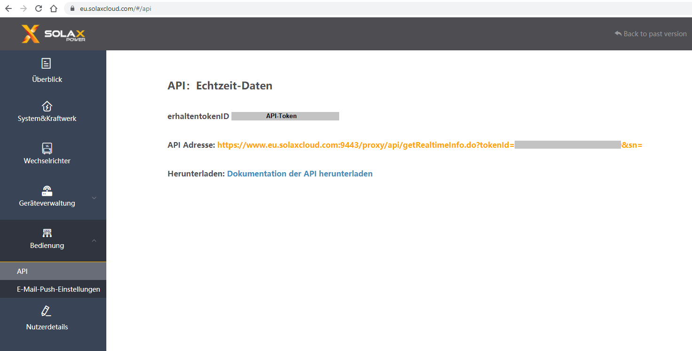

# IoBroker.solax

## Solax-Adapter für ioBroker
Solax Inverter API Cloud-Verbindung

Dieser Adapter ruft die Daten Ihres Wechselrichters vom Hersteller Solax in den iobroker ab.

Dafür benötigen Sie einen Account bei Solax, Ihre Token-ID und die Seriennummer Ihres WLAN-Moduls.

### Ihr API-Token

### Deine Seriennummer

**************************************************************************************************************

### Was ist Sentry.io und was wird an die Server dieses Unternehmens gemeldet?
Sentry.io ist ein Dienst für Entwickler, um sich einen Überblick über Fehler ihrer Anwendungen zu verschaffen. Und genau das ist in diesem Adapter implementiert.

Wenn der Adapter abstürzt oder ein anderer Codefehler auftritt, wird diese Fehlermeldung, die auch im ioBroker-Protokoll angezeigt wird, an Sentry gesendet. Wenn Sie der iobroker GmbH erlaubt haben, Diagnosedaten zu sammeln, dann ist auch Ihre Installations-ID (dies ist nur eine eindeutige ID **ohne** zusätzliche Informationen über Sie, E-Mail, Name oder dergleichen) enthalten. Auf diese Weise kann Sentry Fehler gruppieren und anzeigen, wie viele eindeutige Benutzer von einem solchen Fehler betroffen sind. All dies hilft mir, fehlerfreie Adapter bereitzustellen, die im Grunde nie abstürzen.

**************************************************************************************************************

**Wenn es Ihnen gefällt, denken Sie bitte über eine Spende nach:**

**************************************************************************************************************

## Changelog
<!--
	Placeholder for the next version (at the beginning of the line):
	### __WORK IN PROGRESS__
-->

### 0.3.6 (2021-08-04)
* (simatec) deps fixed

### 0.3.5 (31.07.2021)
* (simatec) await/async functions fixed

### 0.3.4 (30.07.2021)
* (simatec) code cleanig
* (simatec) await functions fixed

### 0.3.3 (29.07.2021)
* (simatec) Formatted objects
* (simatec) await functions fixed
* (simatec) query interval changed
* (simatec) Dependencies updated

### 0.3.2 (28.07.2021)
* (simatec) fix for latest repo

### 0.3.1 (11.06.2021)
* (simatec) fix for latest repo
* (simatec) API-Token encrypted

### 0.3.0 (09.06.2021)
* (simatec) state settings changed
* (simatec) sentry plugin added
* (simatec) readme added
* (simatec) sunposition added
* (simatec) nightmode added

### 0.2.0 (07.06.2021)
* (simatec) powerdc 1-4 added
* (simatec) battPower added
* (simatec) many small bugfixes

### 0.1.1 (02.06.2021)
* (simatec) small Bugfixes

### 0.1.0 (02.06.2021)
* (simatec) first beta

## License
MIT License

Copyright (c) 2021 simatec

Permission is hereby granted, free of charge, to any person obtaining a copy
of this software and associated documentation files (the "Software"), to deal
in the Software without restriction, including without limitation the rights
to use, copy, modify, merge, publish, distribute, sublicense, and/or sell
copies of the Software, and to permit persons to whom the Software is
furnished to do so, subject to the following conditions:

The above copyright notice and this permission notice shall be included in all
copies or substantial portions of the Software.

THE SOFTWARE IS PROVIDED "AS IS", WITHOUT WARRANTY OF ANY KIND, EXPRESS OR
IMPLIED, INCLUDING BUT NOT LIMITED TO THE WARRANTIES OF MERCHANTABILITY,
FITNESS FOR A PARTICULAR PURPOSE AND NONINFRINGEMENT. IN NO EVENT SHALL THE
AUTHORS OR COPYRIGHT HOLDERS BE LIABLE FOR ANY CLAIM, DAMAGES OR OTHER
LIABILITY, WHETHER IN AN ACTION OF CONTRACT, TORT OR OTHERWISE, ARISING FROM,
OUT OF OR IN CONNECTION WITH THE SOFTWARE OR THE USE OR OTHER DEALINGS IN THE
SOFTWARE.