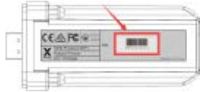

# IoBroker.solax

**************************************************************************************************************

**Wenn es Ihnen gefällt, denken Sie bitte über eine Spende nach:**

**************************************************************************************************************

## Solax-Adapter für ioBroker
Solax Wechselrichter-API-Cloud-Verbindung

Dieser Adapter ruft die Daten Ihres Wechselrichters vom Hersteller Solax in den iobroker.

Was Sie dazu benötigen, ist ein Konto bei Solax, Ihre Token-ID und die Seriennummer Ihres WLAN-Moduls.

### Ihr API-Token

### Ihre Seriennummer

**************************************************************************************************************

### Was ist Sentry.io und was wird an die Server dieser Firma gemeldet?
Sentry.io ist ein Dienst für Entwickler, um sich einen Überblick über Fehler in ihren Anwendungen zu verschaffen. Und genau das ist in diesem Adapter umgesetzt.

Wenn der Adapter abstürzt oder ein anderer Codefehler auftritt, wird diese Fehlermeldung, die auch im ioBroker-Protokoll erscheint, an Sentry übermittelt. Wenn Sie der iobroker GmbH erlaubt haben, Diagnosedaten zu sammeln, dann ist auch Ihre Installations-ID (dies ist nur eine eindeutige ID **ohne** zusätzliche Informationen über Sie, E-Mail, Name oder ähnliches) enthalten. Dadurch kann Sentry Fehler gruppieren und anzeigen, wie viele einzelne Benutzer von einem solchen Fehler betroffen sind. All dies hilft mir, fehlerfreie Adapter bereitzustellen, die im Grunde nie abstürzen.

**************************************************************************************************************

## Changelog
<!-- ### __WORK IN PROGRESS__ -->

### __WORK IN PROGRESS__
* (simatec) local request for Wifi Pocket Stick added
* (simatec) Dependencies updated
* (simatec) test and release updated
* (simatec) Number of days of history data added
* (simatec) Expert-Mode added
* (simatec) Docu updated
* (simatec) Bugfixes

### 0.3.7 (2021-11-17)
* (simatec) Dependencies updated
* (simatec) test and release updated

### 0.3.6 (2021-08-04)
* (simatec) deps fixed

### 0.3.5 (31.07.2021)
* (simatec) await/async functions fixed

### 0.3.4 (30.07.2021)
* (simatec) code cleanig
* (simatec) await functions fixed

### 0.3.3 (29.07.2021)
* (simatec) Formatted objects
* (simatec) await functions fixed
* (simatec) query interval changed
* (simatec) Dependencies updated

### 0.3.2 (28.07.2021)
* (simatec) fix for latest repo

### 0.3.1 (11.06.2021)
* (simatec) fix for latest repo
* (simatec) API-Token encrypted

### 0.3.0 (09.06.2021)
* (simatec) state settings changed
* (simatec) sentry plugin added
* (simatec) readme added
* (simatec) sunposition added
* (simatec) nightmode added

### 0.2.0 (07.06.2021)
* (simatec) powerdc 1-4 added
* (simatec) battPower added
* (simatec) many small bugfixes

### 0.1.1 (02.06.2021)
* (simatec) small Bugfixes

### 0.1.0 (02.06.2021)
* (simatec) first beta

## License
MIT License

Copyright (c) 2021 - 2022 simatec

Permission is hereby granted, free of charge, to any person obtaining a copy
of this software and associated documentation files (the "Software"), to deal
in the Software without restriction, including without limitation the rights
to use, copy, modify, merge, publish, distribute, sublicense, and/or sell
copies of the Software, and to permit persons to whom the Software is
furnished to do so, subject to the following conditions:

The above copyright notice and this permission notice shall be included in all
copies or substantial portions of the Software.

THE SOFTWARE IS PROVIDED "AS IS", WITHOUT WARRANTY OF ANY KIND, EXPRESS OR
IMPLIED, INCLUDING BUT NOT LIMITED TO THE WARRANTIES OF MERCHANTABILITY,
FITNESS FOR A PARTICULAR PURPOSE AND NONINFRINGEMENT. IN NO EVENT SHALL THE
AUTHORS OR COPYRIGHT HOLDERS BE LIABLE FOR ANY CLAIM, DAMAGES OR OTHER
LIABILITY, WHETHER IN AN ACTION OF CONTRACT, TORT OR OTHERWISE, ARISING FROM,
OUT OF OR IN CONNECTION WITH THE SOFTWARE OR THE USE OR OTHER DEALINGS IN THE
SOFTWARE.