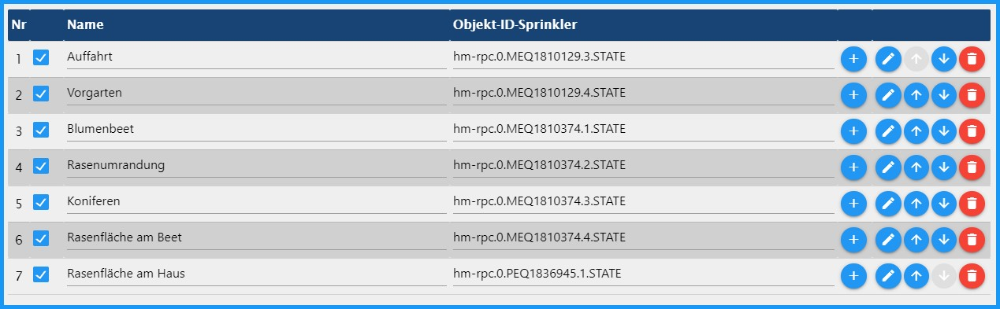

# SprinkleControl
### *Der Adapter zur individuellen automatischen Gartenbewässerung. << So wie es jeder mag >> :)*

---

# Inhaltsverzeichnis 
* [1 Grundlegendes](#1-grundlegendes)
* [2 Installation](#2-installation)
* [3 Konfiguration](#3-konfiguration)
* [4 Haupteinstellungen - Startseite](#4-haupteinstellungen) 
  * [4.1 Aufbau der Tabelle](#41-aufbau-der-tabelle) 
  * [4.2 individuelle Konfiguration eines Bewässerungskreises](#42-individuelle-konfiguration-eines-bewsserungskreises) 
    * [4.2.1 Haupteinstellungen des Ventils](#421-haupteinstellungen-des-ventils)
      * [4.2.1.1 Bewässerungseinstellungen](#4211-bewasserungseinstellungen)
      * [4.2.1.2 Einschaltpunkt zum Gießen](#4212-einschaltpunkt)
        * [Berechnung der Verdunstung](#einschaltpunkt-berechnung)
        * [Bodenfeuchte-Sensor bistabil](#einschaltpunkt-bistabil)
        * [Bodenfeuchte-Sensor analog](#einschaltpunkt-analog)  
        * [Start an festen Wochentagen (ohne Sensoren)](#einschaltpunkt-feste-tage)
    * [4.2.2 Pumpeneinstellungen des Ventils](#422-pumpeneinstellungen-des-ventils) 
* [5 Pumpen-Einstellungen](#5-pumpen-einstellungen) 
* [6 Zeit-Einstellungen](#6-zeit-einstellungen) 
* [7 Zusätzliche-Einstellungen](#7-zustzliche-einstellungen) 
  * [7.1 Astro-Einstellungen](#71-astro-einstellungen) 
  * [7.2 Debug-Einstellungen](#72-debug-einstellungen)
  * [7.3 Zusätzliche Benachrichtigungseinstellung](#73-zustzliche-benachrichtigungseinstellungen) 
  * [7.4 Sensoren zur Berechnung der Verdunstung](#74-sensoren-zur-berechnung-der-verdunstung) 
  * [7.5 Wettervorhersage](#75-wettervorhersage) 
* [8 Benachrichtigungen](#8-benachrichtigungen) 
  * [8.1 Telegram](#81-telegram) 
  * [8.2 Pushover](#82-pushover) 
  * [8.3 E-Mail](#83-e-mail) 
  * [8.4 WhatsApp](#84-whatsapp)
* [9 Objekte](#9-objekte)
  * [9.1 control](#91-control)
  * [9.2 evaporation](#92-evaporation)
  * [9.3 info](#93-info)
  * [9.4 sprinkle](#94-sprinkle)
* [9 Was ist für die Zukunft geplant](#9-was-ist-fr-die-zukunft-geplant) 

---

# 1. Grundlegendes 

In SprinkleControl werden die Umweltdaten (Temperatur, Luftfeuchtigkeit, Helligkeit, Windgeschwindigkeit, Regenmenge) ausgewertet.
Die so ermittelte Verdunstung dient der Ermittlung der theoretischen Bodenfeuchte, der einzelnen Bewässerungskreise.
Zu einer unter "Zeit-Einstellungen" festgelegten Zeit, werden die Bewässerungskreise aktiviert die einen festgelegten prozentualen Wert unterschreiten.
Diese verschiedenen Bewässerungskreise werden dann so angesteuert, das die max. Pumpenleistung (l/h) und die max. Anzahl der Bewässerungskreise nicht überschritten wird.
Beides ist individuell anpassbar.

**Beispiel eines Schaltverhaltens an einem Tag (Startzeit aller Ventile: 6:00)**      

Meine Bewässerung arbeitet mit dem Homematic IP Wettersensor plus (HmIP-SWO-PL) und **wurde nur mit dieser** getestet.
Im ioBroker Forum laufen aber auch einige Tests mit Wetterstationen über den Sainlogic Adapter.

---
* [zurück zum Inhaltsverzeichnis](#inhaltsverzeichnis)

---

# 2. Installation 
Der Adapter befindet sich im "stable“ Verwahrungsort von ioBroker. Von hier kann er heruntergeladen werden. 
Um ihn installieren zu können muss man in den Adapter von ioBroker gehen und dort "VON GITHUB" anklicken. 
Unter "Adapter auswählen" wählt man dann "sprinkleControl [Dirk-Peter-md]" aus und drückt dann installieren.

Spätestens nach Refresh der Adapterliste steht der Adapter **Sprinkle Control** zur Verfügung.

Nach anklicken des (+) wird eine Instanz angelegt und die notwendigen Daten des Adapters vom Repository geladen:

---
* [zurück zum Inhaltsverzeichnis](#inhaltsverzeichnis)

---

# 3. Konfiguration 
Sollte in dem Installationsfenster die Checkbox "***schließen, wenn fertig***" nicht angehakt sein muss man dieses natürlich noch schließen.

Das Konfigurationsfenster besteht aus den Reitern:
* [4. Haupteinstellungen](#4-haupteinstellungen)
* [5. Pumpeneinstellungen](#5-pumpen-einstellungen)
* [6. Zeit-Einstellungen](#6-zeit-einstellungen)
* [7. Zusätzliche-Einstellungen](#7-zustzliche-einstellungen)
* [8. Benachrichtigungen ](#8-benachrichtigungen) (nur sichtbar, wenn Benachrichtigungen unter Zusätzliche-Einstellungen aktiviert ist)

---
* [zurück zum Inhaltsverzeichnis](#inhaltsverzeichnis)

---

# 4. Haupteinstellungen 
Das Konfigurationsfenster öffnet sich automatisch mit den Haupteinstellungen

Auf dieser Seite ist eine Beispiel-ID abgelegt.
Diese bitte löschen und anschließend die eigenen IDs durch anklicken des (+) links oben über der Tabelle die eigenen Sprinkleraktoren hinzufügen.

Dabei bitte die Datenpunkte mit STATE (o. ä.) auswählen. NICHT das Gerät als solches.

Nach Abschluss der ID-Auswahl ist der Adapter bereits betriebsbereit, aber noch nicht an die eigenen Wünsche angepasst.

---

## 4.1. Aufbau der Tabelle 

**Nr** – fortlaufende Nummer der gelisteten Bewässerungskreise

**aktiv** – Checkbox zur Aktivierung der Steuerung des entsprechenden Bewässerungskreises

**Name** – Name des Ventilkreises; (Dieser wird bei der Auswahl der ID automatisch aus den Objekten eingelesen. Dieser Name kann individuell angepasst werden. Es dürfen aber keine Duplikate vorkommen.)

**Objekt-ID-Sprinkler** – eindeutige ID des zu steuernden Datenpunkts in den Objekten

**(+)** – Hinzufügen/Ändern der ID

**Bleistift** – spezifische Konfiguration des jeweiligen Bewässerungskreises

**Pfeile** – verändern der Reihenfolge der verschiedenen Bewässerungskreise in der Tabelle

**Mülleimer** – Löschen der ID mit allen konfigurierten Daten!

---

## 4.2. individuelle Konfiguration eines Bewässerungskreises 
Diese Konfigurationsebene besteht aus zwei Reitern: [**Haupteinstellungen**](#421-haupteinstellungen-des-ventils) und [**Pumpeneinstellungen**](#422-pumpeneinstellungen-des-ventils)

---

### 4.2.1. Haupteinstellungen des Ventils 

---

#### 4.2.1.1 Bewässerungseinstellungen  
* **Bewässerungszeit in min** – Einstellung der Zeit zum Bewässern in Minuten
   > **Information** → Unter "Berechnung der Verdunstung“ und "Bodenfeuchte-Sensor analog“ wird die Bewässerungszeit verlängert je weiter der Trigger "niedrigster Prozentsatz der Bodenfeuchte“ unterschritten wurde.
   > Bei **Start an festen Wochentagen (ohne Sensoren)** und **Bodenfeuchte-Sensor bistabil** erfolgt die Verlängerung proportional der extraterrestrische Strahlung ihrer Region.
* **maximale Bewässerungsverlängerung in %** – Begrenzung der Bewässerungsdauer in Prozent (100 % = Bewässerungsdauer wird nicht verlängert)
  > **Information** → Bei **Start an festen Wochentagen (ohne Sensoren)** und **Bodenfeuchte-Sensor bistabil** wird hier die Verlängerung der Bewässerungszeit angegeben. Wobei am 21.12.
    die Bewässerungszeit gleich der Eingabe und am 21.6. gleich der maximalen Verlängerung entspricht. Dazwischen wird die Bewässerungszeit proportional der extraterrestrische Strahlung ihrer Region angepasst.
* **Bewässerungsintervall in min** – Die Bewässerungsdauer wird in einem Intervall aufgeteilt. (z. B. 5 min an, mindestens 5 min aus, 5 min an, usw.)
    > **Tipp** –> Ich habe bei der Autoauffahrt ein Rasengitter verlegt. Hier läuft das Wasser beim Bewässern einfach nur die Schräge herunter. Durch die Bewässerung in Intervallen konnte ich dem entgegenwirken.

---

#### 4.2.1.2 Einschaltpunkt zum Gießen 

* Über **Methode zur Kontrolle der Bodenfeuchtigkeit** werden die verschiedenen Sensoren, zur Steuerung der Bewässerung und deren verhalten, festgelegt.
> **Information** → Über [**„Zusätzliche Einstellungen" → „Wettervorhersage"**](#75-wettervorhersage) kann der Startvorgang verschoben werden, wenn es Regen soll. 

---

+ **Berechnung der Verdunstung** 
        
    

    + **Einschaltpunkt (Bodenfeuchte) der Bewässerungsventile in %** – Auslösetrigger: Wenn dieser Wert unterschritten wird, so beginnt zum Startzeitpunkt die Bewässerung.
    + **Bodenfeuchte = 100 % nach der Bewässerung** – bei Aktivierung, wird die Bodenfeuchte nach der Bewässerung auf 100 % gesetzt. Ansonsten bleibt sie knapp darunter Aufgrund der Verdunstung während der Bewässerung.

    ***maximale Bodenfeuchtigkeit***

    * **maximale Bodenfeuchte nach der Bewässerung in (mm)** – Max. Wassergehalt im Boden nach der Bewässerung.
        > **Tipp** –> Rasengitter: 5; Blumenbeet: 10; Rasenfläche: 14
    * **maximale Bodenfeuchte nach einem Regen in (mm)** – Max. Wassergehalt im Boden nach einem kräftigen Regen.
        > **Tipp** –> Rasengitter: 6; Blumenbeet: 15; Rasenfläche: 19

---

+ **Bodenfeuchte-Sensor bistabil** 

    

    + **Einschaltpunkt zum Gießen (Bodenfeuchte-Sensor → bistabil true(Bewässerung ein), false(Bewässerung aus))**

    + **Bodenfeuchte-Sensor** Auswahl des Sensors über das PLUS-Zeichen
    + **Sensor im Gewächshaus** bei true (Auswahl) wird die Regenvorhersage nicht berücksichtigt

---

+ **Bodenfeuchte-Sensor analog** 

    

    **Einschaltpunkt zum Gießen (Berechnung der Verdunstung → analog interne Umrechnung in 0 - 100 %)**
    + **Methode zur Kontrolle der Bodenfeuchtigkeit** → Bodenfeuchte-Sensor analog
    + **Bodenfeuchte-Sensor** → Auswahl des Sensors über das PLUS-Zeichen
    + **Sensor im Gewächshaus** → bei true (Auswahl) wird die Regenvorhersage nicht berücksichtigt
    + **Einschaltpunkt (Bodenfeuchte) der Bewässerungsventile in %** → Auslösetrigger: Wenn dieser Wert unterschritten wird, so beginnt zum Startzeitpunkt die Bewässerung.
    #### Konfiguration des analogen Bodenfeuchte-Sensors
    * **analoger Bodenfeuchte-Sensor bei 0 Prozent (Sensor in der Luft)** → Wert des Sensors an der Luft hier eingeben! Sollte dieser unterschritten werden erfolgt eine Warnung im Protokoll(Debug)
    * **analoger Bodenfeuchte-Sensor bei 100 Prozent (Sensor im Wasser)** → Wert des Sensors im Wasser hier eingeben! Sollte dieser überschritten werden erfolgt eine Warnung im Protokoll(Debug)

---

+ **Start an festen Wochentagen (ohne Sensoren)** 

    
    **Auswahl der Bewässerungstage in der Woche**
    + **Drei Tage Rhythmus** → Der 1. Tag der Bewässerung ist der Folgetag, nach dem Speichern der Konfiguration, und dann jeden 3. Tag in Folge.
    + **Jeden zweiten Tag** → Der 1. Tag der Bewässerung ist der Folgetag, nach dem Speichern der Konfiguration, und dann jeden 2. Tag in Folge.
    + **An festen Tagen starten** → Die Bewässerungstage werden individuell nach Wochentagen bestimmt.
    > **Info** → Die Bewässerungsdauer wird Verlängert siehe [Bewässerungseinstellungen](#4211-bewasserungseinstellungen)
    
---

### 4.2.2. Pumpeneinstellungen des Ventils 

* **Durchflussmenge** → ermittelte Durchflussmenge des aktuellen Bewässerungskreises
    > **Tipp** → steht oft in der Bedienungsanleitung bzw. im Internet
* **Booster** → nimmt alle aktiven Bewässerungskreise für 30 s vom Netz und schaltet sie danach wieder zu
    > **Tipp** → Meine Pumpe liefert max. 1800 l/h und meine Rasensprenger benötigen 1400 l/h, aber den vollen Druck zum Herausfahren. Mit der Booster Funktion kann ich nebenbei noch die Koniferen bewässern die nur 300 l/h benötigen.
    >> **Achtung** → Mit dieser Funktion sollte man sehr sparsam umgehen, da immer nur ein Bewässerungskreis mit aktiven Booster bewässern kann.    

---

* [zurück zum Inhaltsverzeichnis](#inhaltsverzeichnis)

---

# 5. Pumpen-Einstellungen 
Hier werden die Einstellung der Hauptpumpe (Grundwasser), einer zweiten Pumpe (Zisterne) und der Spannungsversorgung der Regelkreise vorgenommen.

* **Einstellung der Ventile**

    * **Steuerspannung der Ventile** → Durch anklicken des (+) Symbols öffnet sich das Select-ID State Fenster. Hier können sie das STATE für die Steuerspannung der Ventile auswählen.
    Dieser Ausgang ist aktive, so wie eines der Ventile aktive ist.
    * **maximaler Parallelbetrieb der Ventile** → Hier kann die Anzahl der aktiven Ventile begrenzt werden. z. B. wenn die Leistung des Steuertrafos nicht ausreicht, mehrere Ventile parallel zu schalten. 
    * **Schaltabstand zwischen den Ventilen in ms** – Eingabe einer Zeit in Millisekunden. Diese ist die Wartezeit, bis zum Schalten des nächsten Ventils damit nicht z. B. 6 Ausgänge auf einmal schalten.
    
* **Einstellung der Pumpe**
    * **Hauptpumpe: ** → Durch anklicken des (+) Symbols öffnet sich das Select-ID State Fenster. Hier wird das STATE der Pumpe hinterlegt, welche für die Wasserversorgung zuständig ist.
    * **maximale Pumpenleistung der Hauptpumpe in l/h: ** → Hier wird die maximale Pumpenleistung hinterlegt. Diese begrenzt dann die Bewässerungskreise, damit noch genügend Druck an den Ventilen ansteht.
        > **Achtung** → Hier muss die tatsächliche Pumpenleistung angegeben werden, nicht die vom Typenschild. Ich habe z. B. eine "Gardena 5000/5 LCD" diese schafft aber nur 1800l auf grund der Leitungslänge und nicht 4500l/h, wie auf dem Typenschild angegeben.  

* **Zisternenpumpe in Vorrangschaltung hinzufügen**
    * **Zisternenpumpe** → Hier wird die Pumpe der Zisterne eingetragen. Diese wird deaktiviert, so wie der Füllstand der Zisterne zu gering ist. Wobei die Hauptpumpe, in diesem Fall, die Bewässerung fortsetzt.
    * **maximale Pumpenleistung der Zisterne in l / h** → Hier wird die maximale Pumpenleistung hinterlegt. Diese begrenzt dann die Bewässerungskreise, damit noch genügend Druck an den Ventilen ansteht.
        > **Achtung** → Hier muss die tatsächliche Pumpenleistung angegeben werden, nicht die vom Typenschild. Ich habe z. B. eine "Gardena 5000/5 LCD" diese schafft aber nur 1800l auf grund der Leitungslänge und nicht 4500l/h, wie auf dem Typenschild angegeben. 
    * **Füllhöhe der Zisterne** → Angabe des Füllstandsensors für die Ermittlung der Füllhöhe in %.
        > **eingebaut** → Hm-Sen-Wa-Od kapazitiver Füllstandmesser von HomeMatic.
    * **Mindestfüllstand der Zysten in %** → Schaltpunkt, bei dessen Unterschreitung wird auf die Hauptpumpe umgeschaltet und bei laufender Bewässerung die Ventile je Verbrauchsmenge angepasst.
    
---

* [zurück zum Inhaltsverzeichnis](#inhaltsverzeichnis)

---

# 6. Zeit-Einstellungen 
In diesem Abschnitt wird die Startzeiten von SprinkleControl festgelegt.

## Einstellungen für die Startzeit
* **Beginnen Sie mit einer festen Startzeit** – Bei dieser Auswahl startet die Bewässerung zu einer festgelegten, unter "Startzeit in der Woche" festgelegten Zeit.
    * **Startzeit in der Woche** – Angabe der Startzeit in der Woche.
* **Startzeit bei Sonnenaufgang** – Wenn sie diese Option auswählen, so startet die Bewässerung bei Sonnenaufgang. Diese Zeit kann aber noch unter Zeitverschiebung variiert werden.
    * **Zeitverschiebung** – Eingabe der Zeitverschiebung bei Sonnenaufgang. (+/- 120 min)
* **Startzeit am Ende der goldenen Stunde** – Hier startet die Bewässerung zum Ende der Golden Hour.

---

## Einstellungen für die Startzeit am Wochenende
* **andere Startzeit am Wochenende** – Soll die Bewässerung am Wochenende zu einer anderen Zeit starten (um z. B. den Nachbarn nicht zu verärgern), so kann man es hier aktivieren.
    * **Startzeit am Wochenende** – Startzeit für das Wochenende.

---

## Einstellung für die Startzeit an Feiertagen
* **Startzeit der Feiertage wie am Wochenende** – Wenn an Feiertagen auch wie am Wochenende die Bewässerung starten soll, so kann es hier aktiviert werden.
    * **Feiertage Instanz** – Hier muss dann aber noch die externe Feiertagsinstanz ausgewählt werden. (z. B. der Adapter "Deutsche Feiertage")
    
---

* [zurück zum Inhaltsverzeichnis](#inhaltsverzeichnis)

---

# 7. Zusätzliche-Einstellungen 

In den Extra-Einstellungen werden verschiedene Einstellungen eingegeben, die bei der Berechnung der Verdunstung unerlässlich sind.

---

## 7.1 Astro-Einstellungen 
* **Breiten- und Längengrad**
  Breiten- und Längengrad übernimmt SprinkleControl aus den ioBroker Systemeinstellungen.
  SprinkleControl berechnet anhand dieser Werte den Sonnenstand.

---

## 7.2 Debug-Einstellungen 

* **debuggen**
  Durch Aktivierung werden im Log zusätzliche Informationen angezeigt, wodurch Fehler schneller ermittelt werden können.

---

## 7.3 Zusätzliche Benachrichtigungseinstellungen 

* **Benachrichtigungen aktivieren / deaktivieren**
  Einschalten des Reiters Benachrichtigungen. Hier werden dann die Einstellungen zur Kommunikation vorgenommen.

---

## 7.4. Sensoren zur Berechnung der Verdunstung 
> **Achtung** → Das Program ist auf die Sensoren der Homematic HmIP-SWO-PL zur Berechnung der Verdunstung abgestimmt!
> > **Andere mir bekannte verwendete Wetterstationen** → Eurochron Funk-Wetterstation EFWS 2900 mit Sainlogic Adapter.

Über die Sensoren wird die max. mögliche Verdunstung der pot. Evapotranspiration nach Penman ETp berechnet und zur Steuerung der Bewässerungsanlage genutzt.
Dies geschieht jedes Mal, wenn die Temperatur sich ändert.
> **Achtung** → Zur Berechnung werden der Verdunstung Werden die Sensoren der Temperatur, der Feuchtigkeit, der Windgeschwindigkeit und der Helligkeit herangezogen. 
Diese müssen unbedingt für die Steuerung der Bewässerung über die „Berechnung der Verdunstung" verfügbar sein.

* **Temperatursensor** – Durch anklicken des (+) Symbols öffnet sich das Select-ID State Fenster. Hier können sie die ID des Luftsensors in °C auswählen.
* **Feuchtigkeitssensor** – Durch anklicken des (+) Symbols öffnet sich das Select-ID State Fenster. Hier können sie die ID des Feuchtigkeitssensors in % auswählen.
* **Windgeschwindigkeitssensor** – Durch anklicken des (+) Symbols öffnet sich das Select-ID State Fenster. Hier können sie die ID des Windgeschwindigkeitssensors in km/h auswählen.
* **Helligkeitssensor** – Durch anklicken des (+) Symbols öffnet sich das Select-ID State Fenster. Hier können sie die ID des Helligkeitssensors auswählen.
* **Regensensor** – Durch anklicken des (+) Symbols öffnet sich das Select-ID State Fenster. Hier können sie die ID des Zählers der Regenmenge in mm auswählen.

---

## 7.5 Wettervorhersage 

Beim Aktivieren des Feldes "Wettervorhersage verwenden", erscheint ein Auswahlfeld. In diesem muss die Instanz vom Adapter "Das Wetter" ausgewählt werden.
Im Adapter "Das Wetter“ muss der "Pfad 2: XML-Datei mit 5-Tage-Wettervorhersage und detaillierten Informationen für alle 3 Stunden" ausgefüllt sein, 
damit SprinkleControl auf das Objekt **„daswetter.0.NextDaysDetailed.Location_1.Day_1.rain_value"** zugreifen kann. Dieser Wert wird dann bei jedem Start im Automatikmodus zur Entscheidung einer Beregnung verwendet.
* **Niederschlags-Schwellwert in mm** → Erst wenn dieser Wert von der Regenvorhersage überschritten wird, so wird diese berücksichtigt.

---

* [zurück zum Inhaltsverzeichnis](#inhaltsverzeichnis)

---

# 8 Benachrichtigungen 

## Auswahl der Benachrichtigung
* **Benachrichtigungstyp** → Auswahl des Benachrichtigungsweges
  * [Telegram](#81-telegram) 
  * [Pushover](#82-pushover) 
  * [E-Mail](#83-e-mail) 
  * [Whatsapp](#84-whatsapp)
    
---

* [zurück zum Inhaltsverzeichnis](#inhaltsverzeichnis)

--- 

### 8.1 Telegram 
 

* **Telegraminstanz** – Instanz des Telegram-Adapters auswählen 
* **Telegramempfänger** – Telegram Empfänger auswählen
  > **Achtung** → Der Adapter muss laufen, damit ein Empfänger angezeigt und ausgewählt werden kann.
* **Benachrichtigungsstil** Umfang des Benachrichtigungstextes 
    + kurze Benachrichtigung → nur Startvorgänge 
    + Lange Benachrichtigung → umfangreiche Benachrichtigungen 
* **Warten auf den Versand (Sekunden)** – warten bis zum Versand 
* **Stille Nachricht** – Benachrichtigungston aus 
* **Benachrichtigung nur bei Fehlern** – noch nicht in Benutzung  

---

* [zurück zum Inhaltsverzeichnis](#inhaltsverzeichnis)

---

### 8.2 Pushover 
 

* **Pushover-Instanz** – Instanz des Pushover-Adapters auswählen
* **Benachrichtigungsstil** Umfang des Benachrichtigungstextes
    + kurze Benachrichtigung → nur Startvorgänge
    + Lange Benachrichtigung → umfangreiche Benachrichtigungen
* **Warten auf den Versand (Sekunden)** – warten bis zum Versand
* **Geräte-ID (optional)** Geräte-ID eingeben (optional)
* **Benachrichtigungston** – Benachrichtigungston auswählen
* **Stille Nachricht** – Benachrichtigungston aus
* **Benachrichtigung nur bei Fehlern** – noch nicht in Benutzung

---

* [zurück zum Inhaltsverzeichnis](#inhaltsverzeichnis)

---

### 8.3 E-Mail 
 

* **E-Mail-Empfänger** – Empfänger der E-Mail
* **E-Mail-Absender** – Absender der E-Mail
* **E-Mail-Instanz** – Instanz des E-Mail-Adapters auswählen
* **Benachrichtigungsstil** Umfang des Benachrichtigungstextes
    + kurze Benachrichtigung → nur Startvorgänge
    + Lange Benachrichtigung → umfangreiche Benachrichtigungen
* **Warten auf den Versand (Sekunden)** warten bis zum Versand
* **Benachrichtigung nur bei Fehlern** – noch nicht in Benutzung

---

* [zurück zum Inhaltsverzeichnis](#inhaltsverzeichnis)

---

### 8.4 WhatsApp 
 

* **WhatsApp-Instanz** – Instanz des WhatsApp-Adapters auswählen
* **Benachrichtigungsstil** Umfang des Benachrichtigungstextes
    + kurze Benachrichtigung → nur Startvorgänge
    + Lange Benachrichtigung → umfangreiche Benachrichtigungen
* **Warten auf den Versand (Sekunden)** – warten bis zum Versand
* **Benachrichtigung nur bei Fehlern** – noch nicht in Benutzung

---

* [zurück zum Inhaltsverzeichnis](#inhaltsverzeichnis)

---

# 9 Objekte 

---

## 9.1 control 
* **Holiday** - Wenn Holiday auf true gesetzt wird, so wird die Bewässerung wie am Wochenende gestartet. Falls die Wochenendeinstellung aktiviert wurde. Die Verbindung mit einem Kalender wäre hier auch möglich.
* **autoOnOff** – Bei Einstellung "off“ ist der Automatikbetrieb der Bewässerungsanlage deaktiviert.
* **parallelOfMax** – z. B. (3 : 4) Drei Bewässerungskreise sind von vier möglichen aktive. (Dies ist nur eine Anzeige!)
* **restFlow** – Anzeige der noch möglichen Restfördermenge der Pumpe. (Dies ist nur eine Anzeige!)

---

## 9.2 evaporation 
Ich habe mich zur Berechnung der Verdunstung nach der Formel für die Berechnung der mittleren monatlichen Verdunstung nach Penman gerichtet. Dies ist für mich ausreichend, obwohl sie nicht zu 100 % umgesetzt wurde.
* **ETpCurrent** – Dies ist dei aktuelle Verdunstung als Tageswert.
* **ETpToday** – Hier wird die aktuelle Tagesverdunstung angezeigt. Diese wird in der Nacht um 0:05 zur ETpYesterday verschoben und dann wieder auf 0 gesetzt.
* **ETpYesterday** – ist die Anzeige der Verdunstung des gestrigen Tages.

---

## 9.3 info 
* **cisternState** – Anzeige vom Status der Zisterne und deren Zustände, wenn sie vorhanden ist.
* **nextAutoStart** – Anzeige des nächsten Starts der Bewässerungsanlage.
* **rainToday** – aktueller Niederschlag des heutigen Tages
* **rainTomorrow** – Niederschlagsmenge des morgigen Tages

---

## 9.4 sprinkle 
* **Auffahrt** – Ort des Geschehens (wurde in der Config unter Haupteinstellung → Name so individuell benannt)
  * **history**
    * **curCalWeekConsumed** – aktueller wöchentlicher Verbrauch in Liter des Beregnungskreises
    * **curCalWeekRunningTime** – aktuelle wöchentliche Gesamtlaufzeit des Beregnungskreises
    * **lastCalWeekConsumed** – letzter wöchentlicher Verbrauch in Liter des Beregnungskreises
    * **lastCalWeekRunningTime** – letzte wöchentliche Gesamtlaufzeit des Beregnungskreises
    * **lastConsumed** – Wasserverbrauch bei der letzten Bewässerung in Liter
    * **lastOn** – letzter Start des Beregnungskreises (05.07 14:14)
    * **lastRunningTime** – letzte Bewässerungsdauer
  * **actualSoilMoisture** – aktuelle virtuelle Bodenfeuchte in % (max. 100 % nach der Beregnung, >100 % nach einem kräftigen Regen) (hat mit der tatsächlichen nichts zu tun)
  * **autoOn** - Automatik ein (Hier könnt ihr die automatische Bewässerung dieses Kreises ausschalten, z. B. bei einer Reparatur, wobei manuelles Bewässern jederzeit möglich ist.)
  * **countdown** – Restzeit des Beregnungskreises
  * **runningTime** – Laufzeit des Beregnungskreises
    - wenn hier eine Zahl > 0 eingegeben wird, so startet der Beregnungskreises für die angegebene Zeit in Minuten
    - bei eingabe einer 0 wird die Bewässerung des Beregnungskreises beendet
  * **sprinklerState** – Anzeige des Zustandes des Beregnungskreises
    - 0:off; => Beregnungskreis aus
    - 1: wait; → Beregnungskreis wartet auf eine frei werdende Kapazität der Pumpe
    - 2: on; → Beregnungskreis ein
    - 3: break; → Beregnungskreis wurde unterbrochen (Configuration, Intervall Beregnung)
    - 4: Boost; → Boost-Funktion des aktuellen Beregnungskreises ist aktiv (Configuration, Booster ein)
    - 5: off(Boost) → Beregnungskreis für 30 s unterbrochen, da eine Boost-Funktion aktive ist

---

* [zurück zum Inhaltsverzeichnis](#inhaltsverzeichnis)

---

# Was ist für die Zukunft geplant 
+ Das wichtigste haben wir jetzt erst einmal. Mal sehen, was mir noch so einfällt.
+ Die Visualisierung, die ich früher noch plante, werde ich nicht weiter verfolgen. 

---

* [zurück zum Inhaltsverzeichnis](#inhaltsverzeichnis)

---

## Changelog
<!--
	Placeholder for the next version (at the beginning of the line):
	### **WORK IN PROGRESS**
-->

### 0.2.0 (03.07.2021)
* (Dirk-Peter-md) Bodenfeuchte-Sensor hinzugefügt
* (Dirk-Peter-md) Schwellwert für Wettervorhersage hinzugefügt

### 0.1.7 (22.05.2021)
* (Dirk-Peter-md) Beschreibung in englischer Sprache hinzugefügt
* (Dirk-Peter-md) bereit für stable

### 0.1.6 (18.05.2021)
* (Dirk-Peter-md) AutoOn-Schalter pro Bewässerungskreis hinzugefügt
* (Dirk-Peter-md) weitere Fehler beseitigt (js-Controller)
* (Dirk-Peter-md) Niederschlagszähler von der Verdunstung gelöst

### 0.1.5 (05.05.2021)
* (Dirk-Peter-md) Zurücksetzen der Regenmenge im 24-Stunden-Modus hinzugefügt

### 0.1.4 (21.04.2021)
* (Dirk-Peter-md) Fehler bei deaktivierter Wettervorhersage behoben

### 0.1.3 (18.04.2021)
* (Dirk-Peter-md) Schaltabstand zwischen den Ventilen eingebaut, main.js aufgeteilt

### 0.1.2 (30.12.2020)
* (Dirk-Peter-md) Beschreibung von SprinkleControl überarbeitet

### 0.1.1 (08.11.2020)
* (Dirk-Peter-md) Integration von Nachrichten per Telegramm, E-Mail, Pushover und WhatsApp

### 0.0.12 (10.10.2020)
* (Dirk-Peter-md) Bewässerung über eine 2. Pumpe (Zisterne mit Vorrangschaltung) in abhängigkeit vom Füllstand hinzugefügt.

### 0.0.11 (30.08.2020)
* (Dirk-Peter-md) Bug in der Verarbeitung der Regenvorhersage vom Adapter "Das Wetter"
* (Dirk-Peter-md) Bug auf Travis CI

*************************************************************************************************************************************

## License
MIT License

Copyright (c) 2021 Dirk Peter <dirk.peter@freenet.de>

Permission is hereby granted, free of charge, to any person obtaining a copy
of this software and associated documentation files (the "Software"), to deal
in the Software without restriction, including without limitation the rights
to use, copy, modify, merge, publish, distribute, sublicense, and/or sell
copies of the Software, and to permit persons to whom the Software is
furnished to do so, subject to the following conditions:

The above copyright notice and this permission notice shall be included in all
copies or substantial portions of the Software.

THE SOFTWARE IS PROVIDED "AS IS", WITHOUT WARRANTY OF ANY KIND, EXPRESS OR
IMPLIED, INCLUDING BUT NOT LIMITED TO THE WARRANTIES OF MERCHANTABILITY,
FITNESS FOR A PARTICULAR PURPOSE AND NON INFRINGEMENT. IN NO EVENT SHALL THE
AUTHORS OR COPYRIGHT HOLDERS BE LIABLE FOR ANY CLAIM, DAMAGES OR OTHER
LIABILITY, WHETHER IN AN ACTION OF CONTRACT, TORT OR OTHERWISE, ARISING FROM,
OUT OF OR IN CONNECTION WITH THE SOFTWARE OR THE USE OR OTHER DEALINGS IN THE
SOFTWARE.