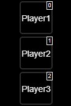
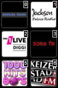
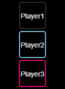
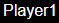
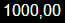

# IoBroker Logitech Squeezebox Adapter über JSON/RPC-Protokoll
**Tests:** 

Dies ist ein alternativer Adapter, der das `JSON/RPC`-Protokoll verwendet, um Daten abzurufen und Befehle an den Logitech Media Server ([LMS](https://de.wikipedia.org/wiki/Logitech_Media_Server)) zu senden und damit angeschlossene Geräte zu steuern, wie

- native [Squeezebox](https://de.wikipedia.org/wiki/Squeezebox),
- Raspberry Pi mit zusätzlichem Audiomodul und kleinen Linux-basierten Firmwares

wie [picoreplayer](https://picoreplayer.org/) oder [max2play](https://www.max2play.com).

- mit Plugins Chromecast, Airplay oder `UPnP/DLNA`-Geräte

Der `LMS`-Server kann sehr große Musiksammlungen auf Festplatten oder `NAS` verwalten/bereitstellen, eine Verbindung zu verschiedenen Streaming-Anbietern wie `Spotify`, `Deezer`, `Soundcloud`, `shoutcast`, `tunein`, `napster`, `pandora`, `tidal` und mehr herstellen.

Warum noch ein `Squeezebox`-Adapter?

Der vorhandene Adapter verwendet `telnet`, um auf `LMS` zuzugreifen. Telnet hat einige Nachteile.
Die eigentliche Hauptweboberfläche von `LMS` verwendet ebenfalls das RPC/JSON-Protokoll, um alle erforderlichen Informationen abzurufen oder Befehle an den Server/die Spieler zu senden.

## Merkmale
- die meisten [Daten](#Server), die der `LMS`-Dienst bereitstellt, sind im Adapter verfügbar
- detaillierte [Informationen](#players) über den Player-Status, Songtitel, Künstler,

Album, Cover, Playlist

- [viele Bedienfunktionen](#provided-states) zum Abspielen, Anhalten, Stoppen, Vorspulen,\

Zurückspulen, Wiederholen, Zufallswiedergabe, Favoriten abspielen, Zur Zeit springen (absolut und relativ), Zum Playlist-Index springen (absolut und relativ), Ein-/Ausschalten und Voreinstellungstasten

- alle [Favoriten](#Favoriten) und alle Unterebenen vom Server
- viele [widgets](#widgets) für die iobroker-vis Komponente sind enthalten\

Erstellen Sie eigene Bedienoberflächen (Player auswählen, Favoriten auswählen, Synchronisierungsgruppen verwalten, Schaltflächen für Wiedergabe/Pause, Vor- und Zurückspulen, Wiederholungsmodus und Auswahl des Zufallsmodus).

## Installation
- Installieren Sie das Paket
- Erstellen Sie eine Instanz
- Konfigurieren Sie die Instanz mit der IP des Logitech-Medienservers

und den Port (normalerweise 9000)

- Starten/Neustarten der Instanz

## Aktualisieren
- Nach der Installation oder Aktualisierung kann es manchmal notwendig sein\

um den folgenden Befehl auszuführen, wenn Probleme in vis-1 aufgetreten sind

`iobroker upload squeezeboxpc`

## Bereitgestellte Staaten
### Server
| Staat | Beschreibung |
| ------------------ | ----------------------------- |
| `LastScan` | Zeitstempel des letzten Musikscans |
| `PlayerCountOther` | Anzahl bekannter anderer Spieler |
| `PlayerCountSN` | Anzahl bekannter SN-Spieler |
| `TotalAlbums` | Anzahl aller bekannten Alben |
| `TotalArtists` | Anzahl aller bekannten Interpreten |
| `TotalDuration` | Summe der Spieldauer aller Songs |
| `TotalGenres` | Anzahl aller bekannten Genres |
| `TotalSongs` | Anzahl aller bekannten Lieder |
| `SyncGroups` | Vorhandene Syncgroups |
| `Version` | Version von `LMS` |
| `mac` | MAC-ID des Servers |
| `uuid` | UUID der `LMS`-Instanz |
| `uuid` | UUID der `LMS`-Instanz |

zusätzlich ein definierter Button zum Aktualisieren der Favoriten

| Schaltfläche | Beschreibung |
| -------------- | --------------------------------- |
| `getFavorites` | alle Favoriten vom Server anfordern |

### Favoriten
Für jeden Favoriten sind alle Attribute schreibgeschützt.

| Staat | Beschreibung |
| ---------- | ------------------------------------------ |
| `Name` | Name des Favoriten |
| `id` | ID des Favoriten |
| `image` | Bild/Symbol für Favorit, sofern verfügbar |
| `isaudio` | isaudio |
| `type` | Beispieltypen: Link, Text, Audio, Wiedergabeliste |
| `url` | URL des Titels |
| `URL` | URL des Titels |

Es sind sämtliche Unterebenen (Unterverzeichnisse) der Favoriten verfügbar.

### Spieler
für jeden Spieler Der Modus zeigt an, ob du den Wert ändern kannst. Die ausgeführte Aktion wird beim Attribut beschrieben.

| Status | Modus | Beschreibung |
| ---------------------- | ---- | -------------------------------------------------------------------------------------------------------------------- |
| `Alarms` | R/- | Alle registrierten Alarme für diesen Spieler als JSON |
| `Artist` | R/- | Name des Künstlers |
| `ArtworkUrl` | R/- | URL zum Kunstwerk |
| `Bitrate` | R/- | Bitrate des Titels |
| `Connected` | R/- | Verbindungsstatus des Spielers (0/1) |
| `Duration` | R/- | Dauer des Titels |
| `Genre` | R/- | Genre des Titels |
| `IP` | R/- | IP des Spielers |
| `Mode` | R/- | Wiedergabe / Pause / Stopp |
| `Playername` | R/- | Name des Spielers |
| `PlayerID` | R/- | Spieler-ID |
| `Playlist` | R/- | Die aktuelle Playlist als JSON |
| `PlaylistCurrentIndex` | R/W | gehe zu einer absoluten Position, indem du den Trackindex angibst, oder gehe relativ, indem du am Anfang ein + oder - eingibst. Beispiel 10,-3,+2 |
| `PlaylistRepeat` | R/W | Lied(1)/Playlist(2) wiederholen/Nicht wiederholen(0) |
| `PlaylistShuffle` | R/W | Zufallswiedergabe der Wiedergabeliste (1)/Zufallswiedergabe des Albums (2)/Nicht zufällige Wiedergabe (0) |
| `Power` | R/W | Energiestatus des Players abrufen/einstellen aus(0)/an(1) |
| `RadioName` | R/- | Name des Radiosenders |
| `Rate` | R/- | Bewertung des Songs |
| `Remote` | R/- | Wenn Remote-Stream (1) |
| `SyncMaster` | R/- | ID/MAC von Syncmaster |
| `SyncSlaves` | R/- | ID/Mac von Spielern in der Sync-Gruppe |
| `Time` | R/- | verstrichene Songzeit |
| `Title` | R/- | Songtitel |
| `Type` | R/- | Medientyp (zB MP3-Radio) |
| `Url` | R/- | URL des Titels/Streams |
| `Volume` | R/W | Lautstärke des Players abrufen/einstellen (0-100) |
| `state` | R/W | Wiedergabestatus abrufen/einstellen: Pause(0), Wiedergabe(1), Stopp(2) |
| `Status` | R/W | Wiedergabestatus abrufen/festlegen: Pause(0), Wiedergabe(1), Stopp(2) |

Die Playlist bietet aktuell die folgenden Attribute, sofern sie in `LMS` verfügbar sind.
Einige Attribute hängen von der Art der Songs ab (Stream/Datei/...). Alle Attribute sind schreibgeschützt.

| Attribut | Beschreibung |
| ------------ | --------------------------------- |
| `Album` | Name des aktuellen Albums |
| `ArtworkUrl` | URL zum Kunstwerk |
| `Bitrate` | Bitrate des Titels |
| `Duration` | Dauer des Titels |
| `RadioName` | Name des Radiosenders |
| `Rate` | Bewertung des Songs |
| `title` | Liedtitel |
| `Type` | Medientyp (zB MP3-Radio) |
| `url` | URL des Titels/Streams |
| `index` | Index des Songs in der Playlist |
| `id` | ID des Liedes |
| `id` | ID des Liedes |

zusätzlich definierte Schaltflächen:

| Schaltfläche | Beschreibung |
| ----------------- | ----------------------------------------------------------------------------------------------------------------------------------------------------------------- |
| `btnForward` | Nächstes Lied |
| `btnPreset\_\*` | 1–6 im Player oder Server zu definierende Schaltflächen |
| `cmdGeneral` | ein allgemeines Befehlsfeld um Befehle an den Spieler zu senden. Jedes Feld muss in Anführungszeichen gesetzt werden. Parameter müssen durch Kommas getrennt werden. Beispiel: "play","1" |
| `cmdPlayFavorite` | um einen Favoriten abzuspielen, legen Sie die ID des Favoriten fest |
| `cmdPlayUrl` | um eine URL abzuspielen, Beispiel "<http://50.7.77.114:8101/>;" |
| `cmdGoTime` | springe zu einer absoluten Position durch Angabe einer Sekundenzahl oder springe relativ mit einem + oder - am Anfang der Sekunden. Beispiel 100,-50,+50 |
| `cmdGoTime` | springe zu einer absoluten Position durch Angabe einer Sekundenzahl oder springe relativ mit einem + oder - am Anfang der Sekunden. Beispiel 100,-50,+50 |

#### Anmerkungen zu Datenpunkten in Abhängigkeit von der Einstellung TPE2 im LMS
Je nach Einstellung werden den Datenpunkten unterschiedliche MP3-Tags übergeben.
Die großgeschriebenen Namen sind die Namen der MP3-Tags

| TPE2 in LMS einstellen | Künstler | Albumkünstler | Trackkünstler | Band |
| ------------------------------ | ----------- | ----------- |  ----------- | ----------- |
| als Band | KÜNSTLER | leer | TRACKARTIST | ALBUMARTIST |
| als Interpreten des Albums | ALBUMARTIST | ALBUMARTIST | leer | leer |

Zu beachten ist außerdem, dass nach einer Änderung im LMS die komplette Bibliothek erneut durchsucht und indexiert werden muss, sowie ein Song gestoppt und neu gestartet werden muss, bevor das LMS andere Daten ausliefert.

### Weitere API-Dokumentation
Weitere Informationen finden Sie in der CLI-Dokumentation:

<https://github.com/oweitman/LMS-CLI-Documentation/blob/master/LMS-CLI.md>

## Widgets
### Player-Schaltflächenleiste

Über dieses Widget können alle Player ausgewählt werden, die in Ihren Logitech Media Server eingebunden sind. Nach Auswahl einer `squeezerpc.?`-Instanz werden im Widget die verfügbaren Player angezeigt.

#### Attribute
| Gruppe | Attribut | Beschreibung |
| ----------------------- | --------------- | ---------------------------------------------------------------------------------------------------------------------------------------------------------------------------------------------------------------------------------------------------------------------------------- |
| SqueezeboxRPC-Instanz | Allgemeine Gruppe | Wählen Sie eine Instanz des SqueezeboxRPC-Adapters aus. Nur diese werden hier als gültig erkannt. |
| Widgetformat | Allgemeine Gruppe | Hier kann der Widgettyp ausgewählt werden. Der Typ „formatbutton“ verfügt über den vollen Funktionsumfang und funktioniert auch mit dem SyncGroup-Widget. Der Typ „formatselect“ ist eine einfache Auswahlbox. Als Name wird der Spielername oder ein individueller Text verwendet. |
| Index anzeigen | Gruppe Allgemein | Einzelne Schaltflächen können ausgeblendet oder in anderer Reihenfolge angezeigt werden, indem der Index der Schaltfläche gelöscht wird. Zum Ausblenden löscht man einfach die jeweilige Indexstelle inklusive Komma. Indexnummern werden im Editiermodus auf der jeweiligen Schaltfläche angezeigt, wenn die Editiermodus-Hilfe aktiviert ist. |
| Zeilenumbruch in CamelCase | Gruppe Allgemein | Wenn der Spielername in CamelCase geschrieben ist, kann hier ein Zeilenumbruch aktiviert werden, damit der Spielername größer auf dem Button erscheint. |
| Hilfe zum Editiermodus | Gruppe „Allgemein“ | Ist diese Hilfe aktiviert, werden Indexnummern auf dem jeweiligen Button angezeigt und die Einstellung „Transparenz“ in den Buttoneinstellungen hat keinen Einfluss. |
| Bildbreite | Button-Einstellungen | Bildbreite eines Buttons |
| Bildhöhe | Button-Einstellungen | Bildhöhe eines Buttons |
| Transparenz | Buttoneinstellungen | Wenn der Button nicht aktiviert ist, wird er vor dem Hintergrund verborgen. 0 = Unsichtbar, 1 = Vollständig sichtbar |
| Rahmenbreite | Button-Einstellungen | Rahmenbreite in Pixeln um den Button |
| Rahmendarstellung | Schaltflächeneinstellungen | Art der Rahmendarstellung, zB durchgezogen, gestrichelt. |
| Normale Rahmenfarbe | Schaltflächeneinstellungen | Wenn die Schaltfläche nicht aktiviert ist, wird sie in dieser Farbe angezeigt. |
| Rahmenfarbe aktiv | Buttoneinstellungen | Wenn der Button aktiviert ist, wird er durch diese Farbe dargestellt. |
| Rahmenradius | Buttoneinstellungen | Für abgerundete Rahmenecken kann hier ein Radius in Pixeln eingegeben werden. |
| Hintergrundfarbe | Schaltflächeneinstellungen | Hintergrundfarbe für Text |
| Bild | button[x] | Hier kann individuell ein Bild definiert werden. Das Bild hat Vorrang vor dem Text. |
| Text | button[x] | Text kann hier individuell definiert werden. Das Bild hat Vorrang vor dem Text. |

### Favoriten-Schaltflächenleiste

Mit diesem Widget können Sie alle Favoriten auswählen, die in Ihrem Logitech Media Server erstellt wurden.
Nach Auswahl des Player-Widgets werden die verfügbaren Favoriten im Widget angezeigt.

| Gruppe | Attribut | Beschreibung |
| ------------------- | --------------- | ----------------------------------------------------------------------------------------------------- |
| Spieler-Widget | Allgemeine Gruppe | Wählen Sie das Spieler-Widget aus. |
| Index anzeigen | Gruppe allgemein | Über den Index können einzelne Schaltflächen ausgeblendet oder in anderer Reihenfolge angezeigt werden. |
| Hilfe zum Bearbeitungsmodus | Gruppe „Allgemein“ | Wenn diese Hilfe aktiviert ist, werden auf den jeweiligen Schaltflächen Indexnummern angezeigt. |
| Bildbreite | Button-Einstellungen | Bildbreite eines Buttons |
| Bildhöhe | Button-Einstellungen | Bildhöhe eines Buttons |
| Transparenz | Buttoneinstellungen | Wenn der Button nicht aktiviert ist, wird er vor dem Hintergrund verborgen. 0 = Unsichtbar, 1 = Vollständig sichtbar |
| Rahmenbreite | Button-Einstellungen | Rahmenbreite in Pixeln um den Button |
| Rahmendarstellung | Schaltflächeneinstellungen | Art der Rahmendarstellung, zB durchgezogen, gestrichelt. |
| Normale Rahmenfarbe | Buttoneinstellungen | Wenn der Button nicht aktiviert ist, wird er mit dieser Farbe angezeigt. |
| Rahmenfarbe aktiv | Buttoneinstellungen | Ist der Button aktiviert wird er mit dieser Farbe angezeigt. |
| Rahmenradius | Buttoneinstellungen | Für abgerundete Rahmenecken kann hier ein Radius in Pixeln eingegeben werden. |
| Hintergrundfarbe | Schaltflächeneinstellungen | Hintergrundfarbe für Text |
| Bild | button[x] | Hier kann ein Bild individuell definiert werden. Das Bild hat Vorrang vor dem Text. |
| Text | button[x] | Hier kann der Text individuell definiert werden. Das Bild hat Vorrang vor dem Text. |

### Wiedergabetaste

Der Playbutton startet bzw. stoppt die Musik auf dem ausgewählten Player.\ Zur Vorbereitung musst Du den Button mit dem Player-Widget verbinden.\ Der Button verfügt über eine eigene Grafik (SVG),\ alternativ kannst Du auch eine eigene Grafik auswählen.

#### Attribute für die Wiedergabetaste
| Gruppe | Attribut | Beschreibung |
| ------------- | ------------------ | ------------------------------- |
| Spieler-Widget | Allgemeine Gruppe | Auswahl des Spieler-Widgets. |
| Bild anhalten | Allgemeine Gruppe | Bild für Pause |
| Bild abspielen | Allgemeine Gruppe | Bild zum Abspielen |
| Haltestellenbild | Allgemeine Gruppe | Bild für Haltestelle |
| Füllfarbe | SVG-Einstellungsgruppe | Füllfarbe der Schaltfläche |
| Strichfarbe | SVG-Einstellungsgruppe | Farbe für den Rahmen |
| Strichbreite | SVG-Einstellungsgruppe | Breite des Rahmens in Pixeln |

### Nach vorne

Mit dem Vorwärts-Widget können Sie im aktuellen Titel vorwärts springen. Die Schaltfläche kann so konfiguriert werden, dass sie eine bestimmte Zeitspanne vorwärts springt, wenn der Player diese Funktion unterstützt.

#### Attribute für die Schaltfläche „Weiter“
| Gruppe | Attribut | Beschreibung |
| ------------- | ------------- | ---------------------------------------------------------------- |
| Player-Widget | Allgemeine Gruppe | Auswahl des Player-Widgets. |
| Schrittweite | Allgemeine Gruppe | Gibt die Zeit in Sekunden an, um vorwärts zu springen. |
| Schaltflächenbeschriftung | Allgemeine Gruppe | Anpassbare Beschriftung für die Schaltfläche. |
| Schaltflächensymbol | Gruppe Allgemein | Auswahl eines Symbols für die Schaltfläche, z. B. zum Weiterspringen. |

### Zurückspulen

Mit dem Widget „Zurückspulen“ können Sie im aktuellen Titel zurückspringen.\ Ähnlich wie beim Widget „Vorspulen“ kann eine Zeitspanne eingestellt werden.

#### Attribute für die Schaltfläche „Zurückspulen“
| Gruppe | Attribut | Beschreibung |
| ------------- | ------------- | ------------------------------------------------------------- |
| Player-Widget | Allgemeine Gruppe | Auswahl des Player-Widgets. |
| Schrittweite | Gruppe „Allgemein“ | Gibt die Zeitspanne in Sekunden an, um die zurückgesprungen werden soll. |
| Schaltflächenbeschriftung | Allgemeine Gruppe | Anpassbare Beschriftung für die Schaltfläche. |
| Schaltflächensymbol | Gruppe Allgemein | Auswahl eines Symbols für die Schaltfläche, z. B. zum Zurückspringen. |

### Wiederholen

Mit dem Repeat-Widget können Sie die Wiederholungsfunktion für den aktuellen Titel oder die aktuelle Playlist aktivieren bzw. deaktivieren, sofern diese Funktion vom Player unterstützt wird.

#### Attribute für die Schaltfläche „Wiederholen“
| Gruppe | Attribut | Beschreibung |
| ------------- | ------------- | ------------------------------------------------------------------------------------------- |
| Player-Widget | Allgemeine Gruppe | Auswahl des Player-Widgets. |
| Schaltflächenbeschriftung | Allgemeine Gruppe | Anpassbare Beschriftung für die Schaltfläche. |
| Schaltflächensymbol | Gruppe Allgemein | Auswahl eines Symbols für die Schaltfläche, zB für Wiederholen. |
| Wiederholungsmodus | Gruppe Allgemein | Hier kann der Modus ausgewählt werden, zum Beispiel Einzelwiederholung (Titel) oder Listenwiederholung (Playlist). |

### Mischen

Das Shuffle-Widget aktiviert oder deaktiviert die Zufallswiedergabe für die aktuelle Wiedergabeliste, sofern diese Funktion vom Player unterstützt wird.

#### Attribute für die Schaltfläche „Shuffle“
| Gruppe | Attribut | Beschreibung |
| ------------- | ------------- | ------------------------------------------------------- |
| Player-Widget | Allgemeine Gruppe | Auswahl des Player-Widgets. |
| Schaltflächenbeschriftung | Allgemeine Gruppe | Anpassbare Beschriftung für die Schaltfläche. |
| Schaltflächensymbol | Gruppe „Allgemein“ | Auswahl eines Symbols für die Schaltfläche, z. B. für Shuffle. |
| Aktivierter Status | Allgemeine Gruppe | Farbe oder Stil der Schaltfläche, wenn die Zufallswiedergabe aktiviert ist. |

### Lautstärke

Das Lautstärke-Widget zeigt die aktuelle Lautstärke des Players an und ermöglicht Ihnen, die Lautstärke anzupassen.

#### Attribute für die Lautstärketaste
| Gruppe | Attribut | Beschreibung |
| --------------------------- | ------------- | ----------------------------------------------------------------- |
| Player-Widget | Allgemeine Gruppe | Auswahl des Player-Widgets. |
| Lautstärkeschrittweite | Gruppe „Allgemein“ | Gibt die Schrittweite zum Erhöhen oder Verringern der Lautstärke an. |
| Maximale Lautstärke | Gruppe „Allgemein“ | Legt den Maximalwert für die Lautstärke fest, z. B. 100. |
| Hauptfarbe der Lautstärkeleiste | Gruppe „Allgemein“ | Farbe für den Bereich der Leiste, der die aktuelle Lautstärke darstellt. |
| Hintergrundfarbe der Lautstärkeleiste | Gruppe „Allgemein“ | Farbe für den Bereich der Leiste, der nicht von der Lautstärke abgedeckt wird. |
| Schaltflächensymbol | Gruppe Allgemein | Auswahl eines Symbols für die Lautstärkeregelung. |

### SyncGroup-Schaltflächenleiste

Dieses Widget kann in Verbindung mit dem Player-Widget verwendet werden, um die Synchronisation der Player untereinander zu steuern.
Die meisten Einstellungen zu Anzahl der Buttons, Labels oder Bilder werden vom Player-Widget übernommen.
Vorbereitend muss der Button mit dem Player-Widget verbunden werden.
Nach Auswahl eines Players im Player-Widget ist die aktuelle Synchronisation im SyncGroup-Widget sichtbar.
Der Sync-Status wird anhand der verschiedenen einstellbaren Farben angezeigt.
Der im Player-Widget ausgewählte Player kann nicht im SyncGroup-Widget ausgewählt werden.
Wird im SyncGroup-Widget ein Player ausgewählt, der sich bereits in einer anderen Gruppe befindet, wird er automatisch aus dieser Gruppe entfernt.

#### Attribute für die Schaltfläche „SyncGroup“
| Gruppe | Attribut | Beschreibung |
| ----------------------------- | --------------- | ---------------------------------------------------------------------------------------------- |
| Spieler-Widget | Allgemeine Gruppe | Auswahl des Spieler-Widgets. |
| Rahmenbreite | Schaltflächeneinstellungen | Rahmenbreite/Rahmenbreite in Pixeln um die Schaltfläche herum. |
| Rahmendarstellung | Schaltflächeneinstellungen | Art der Rahmendarstellung, zB durchgezogen, gestrichelt. |
| Rahmenfarbe - Nicht in Gruppe | Buttoneinstellungen | Der Button bekommt einen Rahmen mit dieser Farbe, wenn der Spieler nicht in einer Gruppe ist. |
| Rahmenfarbe - In Gruppen | Buttoneinstellungen | Der Button bekommt einen Rahmen in dieser Farbe, wenn sich der Spieler mit dem ausgewählten Spieler in einer Gruppe befindet. |
| Rahmenfarbe - In anderer Gruppe | Buttoneinstellungen | Der Button bekommt einen Rahmen mit dieser Farbe, wenn sich der Spieler in einer anderen Gruppe befindet. |
| Rahmenradius | Buttoneinstellungen | Für abgerundete Rahmenecken kann hier ein Radius in Pixeln eingegeben werden. |
| Hintergrundfarbe | Schaltflächeneinstellungen | Hintergrundfarbe für Text. |

### Spielzeitleiste

Die Spielzeitleiste zeigt optisch den Fortschritt des aktuell gespielten Songs an, sofern eine Gesamtlaufzeit (Dauer) vom Server bereitgestellt wird. Dies ist bei Online-Streams in der Regel nicht der Fall. Die Breite der Leiste entspricht 100% der Spielzeit des Songs. Durch Klicken auf einen Punkt auf der Leiste können Sie an die gewünschte Stelle im Song springen. Zur Vorbereitung müssen Sie den Button mit dem Player-Widget verbinden.

#### Attribute für die Spielzeitleiste
| Gruppe | Attribut | Beschreibung |
| -------------- | ------------- | --------------------------------------------------------------- |
| Spieler-Widget | Allgemeine Gruppe | Auswahl des Spieler-Widgets. |
| Hauptfarbe der Leiste | Gruppe „Allgemein“ | Die Hintergrundfarbe der Leiste für noch nicht gespielte Zeiten. |
| Spielzeitfarbe | Gruppe „Allgemein“ | Die Farbe des Balkens für die Spielzeiten. |
| Rahmenbreite | Gruppe „Allgemein“ | Rahmenbreite/Randbreite in Pixeln um die Schaltfläche herum. |
| Rahmendarstellung | Gruppe „Allgemein“ | Art der Rahmendarstellung, zB durchgezogen, gestrichelt. |
| Rahmenfarbe | Gruppe „Allgemein“ | Farbe des Rahmens um die Leiste. |
| Randradius | Gruppe „Allgemein“ | Für abgerundete Kantenecken kann hier ein Radius in Pixeln eingegeben werden. |

### String/Zeichenfolge

Anzeige von Player-spezifischen Zeichenfolgen. Zur Vorbereitung müssen Sie den Button mit dem Player-Widget verbinden.

#### Attribute für String
| Gruppe | Attribut | Beschreibung |
| ---------------- | ------------- | ----------------------------------------------------------------- |
| Spieler-Widget | Allgemeine Gruppe | Auswahl des Spieler-Widgets. |
| Spielerattribut | Allgemeine Gruppe | Auswahlliste aller verfügbaren Attribute eines Spielers. |
| Testtext | Gruppe „Allgemein“ | Text, der zu Testzwecken im Editor angezeigt werden soll. |

### Nummer

Anzeige von Zahlen mit zusätzlichen Formatierungsoptionen. Zur Vorbereitung müssen Sie die Schaltfläche mit dem Player-Widget verbinden.

#### Attribute für Nummer
| Gruppe | Attribut | Beschreibung |
| --------------------- | ----------------- | ----------------------------------------------------------------- |
| Spieler-Widget | Allgemeine Gruppe | Auswahl des Spieler-Widgets. |
| Spielerattribut | Allgemeine Gruppe | Auswahlliste aller verfügbaren Attribute eines Spielers. |
| HTML voranstellen | Gruppe „Allgemein“ | Text oder HTML-Code, der vor die Nummer gesetzt wird. |
| HTML anhängen | Gruppe „Allgemein“ | Text oder HTML-Code, der an die Nummer angehängt wird. |
| Testtext | Gruppe „Allgemein“ | Text, der zu Testzwecken im Editor angezeigt werden soll. |
| Zeichen nach dem Komma | Erweiterte Einstellungen | Anzahl der Dezimalstellen. |
| Komma als Trennzeichen | Erweiterte Einstellungen | Die Nachkommastellen werden durch ein Komma getrennt. |
| Tausendertrennzeichen | Erweiterte Einstellungen | Bei großen Zahlen wird alle 3 Stellen ein Trennzeichen eingefügt. |

## Aufgaben
- mehr Tests/Korrekturen
- Abhängigkeiten zu anderen Paketen reduzieren (Squeezenode)
- mehr Konfigurationsmöglichkeiten zum optionalen Ein- und Ausschalten von Features zur Verbesserung von Speicher und Leistung
- Playlist-Widget hinzufügen
- Browse-Widget zum Browsen im „LMS“-Menü hinzufügen
- Spielergesteuertes Kreisknopf-Widget hinzufügen
- Die Wiedergabe wird gestoppt, wenn die Favoritentaste erneut gedrückt wird.
- cmdGeneral für Server.
- ~~Telnet-Kommunikation hinzufügen, um Push-Ereignisse vom Server zu erhalten\

Optimieren Sie die Umfrage ~~

- ~~Implementieren Sie einen Befehlsstatus, um benutzerindividuelle Befehle zu platzieren (über JSON)\

für Server und Spieler~~

- ~~weitere Steuerungsfunktionen implementieren (Playlist-Position zum Abspielen auswählen, vorspulen, vorspulen, \

zu einer Zeitposition im Lied springen, Lied wiederholen, Lied zufällig auswählen)~~

- ~~Fügen Sie die Wiedergabeliste den Spielerdaten als JSON-Array hinzu~~
- ~~Grafiken (Senderlogo/Playlist-Cover) für Favoriten hinzufügen~~
- ~~mehr Ebenen (Unterverzeichnisse) von Favoriten implementieren~~
- ~~Logitech-Medienserver automatisch erkennen~~

## Changelog

<!--
  Placeholder for the next version (at the beginning of the line):
   ### **WORK IN PROGRESS**

-->
### 1.4.0-alpha.1 (2024-10-27)

- move widget documentation from html to markdown
- adjust responsive tab style
- improve attribute widgets
- change TPE2 handling once more

### 1.4.0-alpha.0 (2024-10-24)

- jsonConfig add sizing options for differenz screen sizes
- test implementation of TPE2 handling. switch in settings
- add datapoints album_artist, track_artist, artistOriginal

### 1.3.17 (2024-10-23)

- add edit button to the vie index field of favorites widget

### 1.3.16 (2024-10-23)

- fixed icons of the favorites widget

### 1.3.15 (2024-08-09)

- due to a adapter checker issue i have to remove the release 1.3.13 from npm.
    but changes from 1.3.13 are included in 1.3.14

### 1.3.14 (2024-08-05)

- fix formatting

### 1.3.13 (2024-08-05)

- revert the fix for artist handling due to negative effect of spotify

### 1.3.12 (2024-08-05)

- improve cmdGoto handling by kairauer, close PR #74
- fix issues from adapter checker
- integrate squeezenode lib

### 1.3.11 (2024-08-05)

- update adapter structure and switch to jsonconfig

### 1.3.10

- getalbumartist as artist if setting of TPE2/TPE3 in `LMS` are changed"

### 1.3.9

- fix error with deleting favorites
- fix wrong type for datapoint

### 1.3.8

- fix forward button widget

### 1.3.7

- fix object creation of states in player modul

### 1.3.6

- fix object creation of states

### 1.3.5

- fix object creation for favorites

### 1.3.4

- fix object creation for favorites / \* center widgets in sidebar

### 1.3.3

- repair imageproxy for image datapoints of favorites

### 1.3.2

- fix for Alarm contains only enabled Alarms

### 1.3.1

- fix problem with git dependency url

### 1.3.0

- fix problem wit setting own icon in player widget / \* add infos about\
     alarms to a player datapoint

### 1.2.1

- fix small issue in last version

### 1.2.0

- improve handling of imageproxy artwork

### 1.1.0

- make request of favorites configurable

### 1.0.1

- change setstate/createobject logic
- fix role and type for Mode-state
- update tests
- update dependency versions
- improve io-package.json

### 1.0.0

- prepare for stable repository

### 0.8.32

- the adapter function iobroker.deleteChannel didnt works as expected.\
     It didnt delete the whole subtree of states. now i implement my own delete function

### 0.8.31

- change behaviour of deleting favorites

### 0.8.30

- change from the issue of the adapter checker

### 0.8.29

- optimize handling of player state power and connected

### 0.8.28

- add advanced signaling function with telnet and fix some more authorization\
     issues with `LMS`

### 0.8.27

- initialization for the new calctype property if empty in volumebar

### 0.8.26

- more improvement and fixing at volumebar / remove playlist widget from\
     master. not ready yet

### 0.8.25

- fixing css-settings on volumebar

### 0.8.24

- volumebar didnt get events between the segments, change clickevent and calculation

### 0.8.23

- adjust dependencies to remove vulnerabilities in dependend packages.\
     also remove travis due of unresolvable build-failures for win+node10/12

### 0.8.22

- due to iobroker.controller 2.0 a command in the api changed (socket to vis.conn.\_socket)

### 0.8.21

- add command für playing urls

### 0.8.20

- remove node v6 test setting

### 0.8.19

- shorten news history

### 0.8.18 (2019-06-27)

- last minute changes.

### 0.8.17 (2019-06-26)

- add more widges: playtime bar, string, number, datetime, image.\
     add button margin to player and favorite widget, improve editing of viewindex.\
     do some refactoring.

### 0.8.16 (2019-06-24)

- resolve a cross browser issue for firefox. the style.\
     font attribute is empty and you have to construct the font string by yourself

### 0.8.15 (2019-06-19)

- minor issue with not ready states

### 0.8.14 (2019-06-19)

- add syncgroups as new server-datapoint,add syncgroup widget,/
    change some jquery event logic

### 0.8.13 (2019-06-16)

- rename widgetset from squeezeboxrpcwidgets to squeezeboxrpc

### 0.8.12 (2019-06-16)

- sync version with npm

### 0.8.11 (2019-06-15)

- try to integrate the widgets into the main adapter

### 0.8.10 (2019-05-15)

- another try to fix the EADDRINUSE error of the server discovery

### 0.8.9 (2019-05-15)

- try to fix the EADDRINUSE error of the server discovery

### 0.8.8 (2019-05-14)

- make discover configurable

### 0.8.7 (2019-05-11)

- more control features (select playlist pos to play,ffwd,frew,jump to/
    a time position in song,repeat song,random song)

### 0.8.6 (2019-05-10)

- move some configuration options into seperate tabs

### 0.8.5 (2019-05-08)

- change serverdiscovery interval method, remove some double cmd lines,/
    additional minor changes advised from eslint

### 0.8.4

- move some files to lib directory

### 0.8.3

- close port for discovery on unload

### 0.8.2

- sync version with npm

### 0.8.1

- set compact mode flag

### 0.8.0

- implementation of compact mode, change version to represent a realistic/
    feature completness

### 0.0.9

- debug options are now configurable

### 0.0.8

- More playlist attributes + remove trailing and leading spaces from source

### 0.0.7

- Add the playlist to each player as json

### 0.0.6

- More config options

### 0.0.5

- All levels/subdirectories of favorites are now available in iobroker

### 0.0.4

- added the cmdPlayFavorite for each player

### 0.0.3

- repair the no-data symbols for buttons in vis

### 0.0.2

- added autodiscovery

### 0.0.1

- initial release

## License

MIT License

Permission is hereby granted, free of charge, to any person obtaining a copy
of this software and associated documentation files (the "Software"), to deal
in the Software without restriction, including without limitation the rights
to use, copy, modify, merge, publish, distribute, sublicense, and/or sell
copies of the Software, and to permit persons to whom the Software is
furnished to do so, subject to the following conditions:

The above copyright notice and this permission notice shall be included in all
copies or substantial portions of the Software.

THE SOFTWARE IS PROVIDED "AS IS", WITHOUT WARRANTY OF ANY KIND, EXPRESS OR
IMPLIED, INCLUDING BUT NOT LIMITED TO THE WARRANTIES OF MERCHANTABILITY,
FITNESS FOR A PARTICULAR PURPOSE AND NONINFRINGEMENT. IN NO EVENT SHALL THE
AUTHORS OR COPYRIGHT HOLDERS BE LIABLE FOR ANY CLAIM, DAMAGES OR OTHER
LIABILITY, WHETHER IN AN ACTION OF CONTRACT, TORT OR OTHERWISE, ARISING FROM,
OUT OF OR IN CONNECTION WITH THE SOFTWARE OR THE USE OR OTHER DEALINGS IN THE
SOFTWARE.

Copyright (c) 2019-2024 oweitman