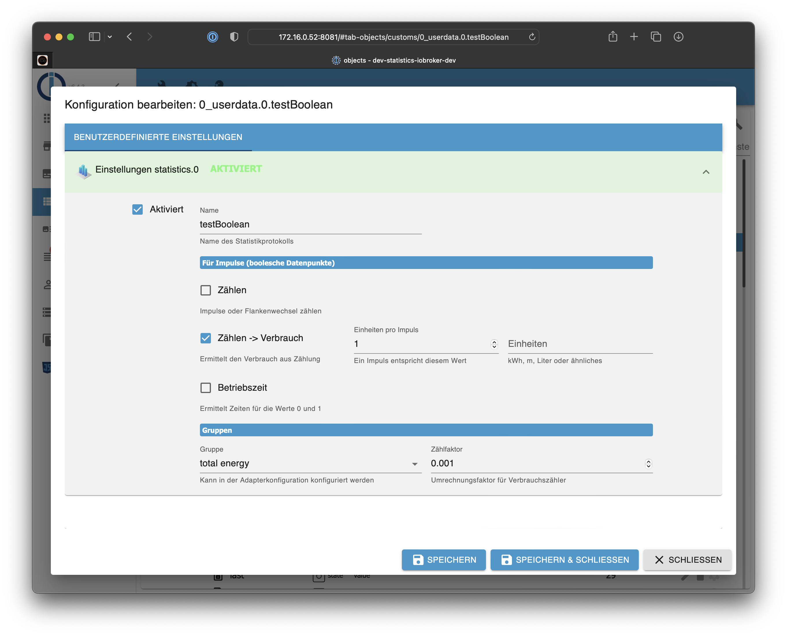
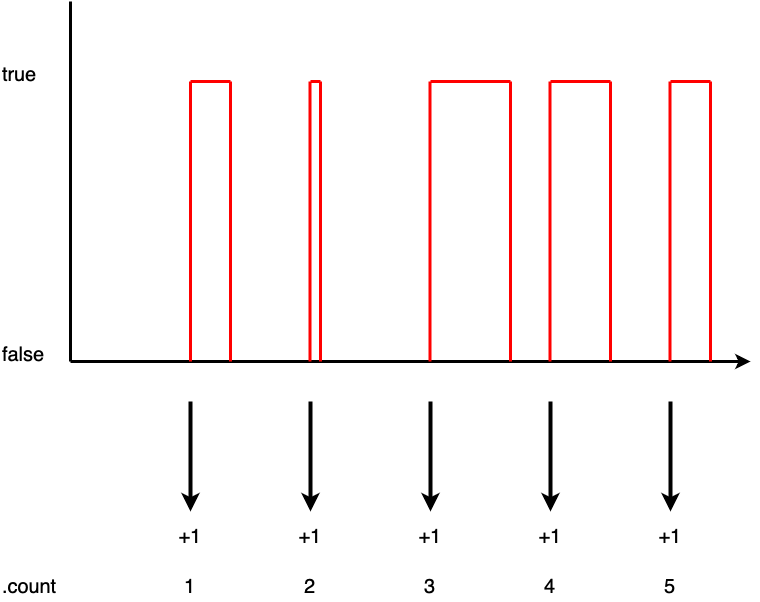
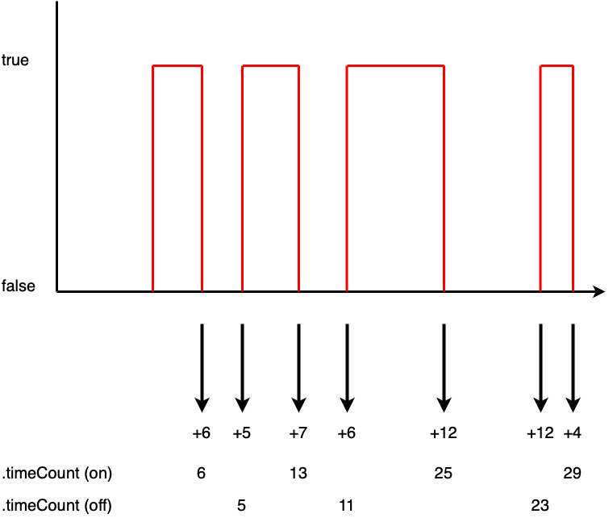
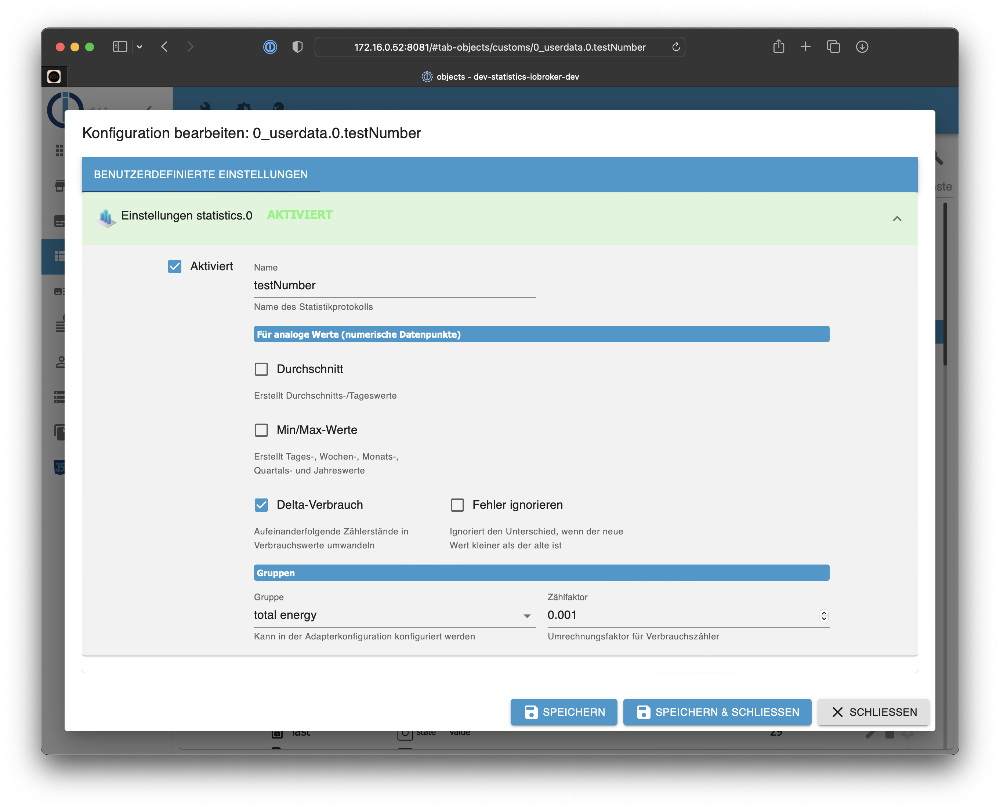
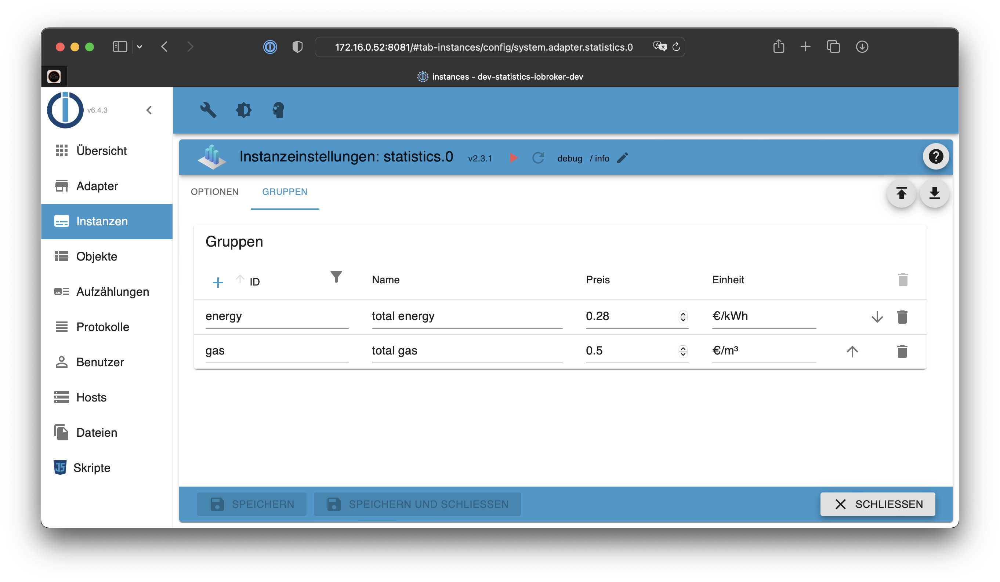

---
---


# ioBroker.statistics

Der Adapter speichert für jedes aktive Objekt die Werte temporär in ``statistics.x.temp`` für die fortlaufende Bewertung.

Zu vorgegebenen Zeiten (Tag, Woche, Monat, Quartal, Jahr) erfolgt die Übernahme der temporären Werte in die Struktur ``statistics.x.save``.

Je nach Datentyp des Datenpunktes (``boolean`` oder ``number``) werden unterschiedliche Optionen angeboten.

Für bestimmte Werte werden auch 5min Zwischenwerte ermittelt, wie es z.B. bei den 433MHz Steckdosen von ELV der Fall ist, die einen Verbrauchswert alle 5min übermitteln.

**Der Adapter reagiert nur auf bestätigte Werte (state.ack = true), nicht auf Befehle (steuere)!**

## Boolean Zustände



### Zählen

Speichert Werte in ``statistics.x.temp.count.*`` bzw. ``statistics.x.save.count.*``.

Bei einer steigenden Flanke wird der Zählerwert um 1 erhöht. Es muss ein Flankenwechesel von 0 zu 1 vorliegen, damit gezählt wird:



### Zählen -> Verbrauch

Speichert Werte in ``statistics.x.temp.sumCount.*`` bzw. ``statistics.x.save.sumCount.*``.

Bei einer steigenden Flanke wird der Zählerwert um x erhöht. Die Wertigkeit kann frei definiert werden (beispielsweise 3):


### Betriebszeit

Speichert Werte in ``statistics.x.temp.timeCount.*`` bzw. ``statistics.0.save.timeCount.*``.

Zählt die Zeit zwischen den Flankenwechseln. Es werden jeweils Werte für an und aus getrennt gezählt. So kann beispielsweise ermittelt werden, wie lange ein Fenster pro Tag, Woche, Monat, Jahr geöffnet war oder wie lange eine schaltbare Steckdose eingeschaltet war.



## Number Zustände



### Durchschnitt

Speichert Werte in ``statistics.x.temp.avg.*`` bzw. ``statistics.x.save.avg.*``.

Ermittelt den Durchschnitt aller Werte im jeweiligen Zeitraum.

### Min/Max-Werte

Speichert Werte in ``statistics.x.temp.minmax.*`` bzw. ``statistics.x.save.minmax.*``.

Ermittelt den Minimal- und Maximalwert im jeweiligen Zeitraum.

### Delta-Verbrauch

Speichert Werte in ``statistics.x.temp.sumDelta.*`` bzw. ``statistics.x.save.sumDelta.*``.

## Gruppen



## Optionen

| Attribute         | Type    | State-Type |
|-------------------|---------|------------|
| enabled           | boolean | -          |
| count             | boolean | boolean    |
| fiveMin           | boolean | boolean    |
| sumCount          | boolean | boolean    |
| impUnitPerImpulse | number  | boolean    |
| impUnit           | string  | boolean    |
| timeCount         | boolean | boolean    |
| avg               | boolean | number     |
| minmax            | boolean | number     |
| sumDelta          | boolean | number     |
| sumIgnoreMinus    | boolean | number     |
| groupFactor       | number  | boolean    |
| logName           | string  | -          |
| sumGroup          | string  | -          |

```json
"custom": {
    "statistics.0": {
        "enabled": true,
        "count": false,
        "fiveMin": false,
        "sumCount": false,
        "impUnitPerImpulse": 1,
        "impUnit": "",
        "timeCount": false,
        "avg": true,
        "minmax": true,
        "sumDelta": true,
        "sumIgnoreMinus": true,
        "groupFactor": 2,
        "logName": "mynumber",
        "sumGroup": "energy"
    }
}
```

## sendTo

```javascript
sendTo('statistics.0', 'enableStatistics', {
    id: '0_userdata.0.manual'
}, (data) => {
    if (data.success) {
        console.log(`Added statistics`);
    } else {
        console.error(data.err);
    }
});
```

```javascript
sendTo('statistics.0', 'enableStatistics', {
    id: '0_userdata.0.mynumber',
    options: {
        avg: true,
        minmax: true,
        sumDelta: true,
        sumIgnoreMinus: true
    }
}, (data) => {
    if (data.success) {
        console.log(`Added statistics`);
    } else {
        console.error(data.err);
    }
});
```