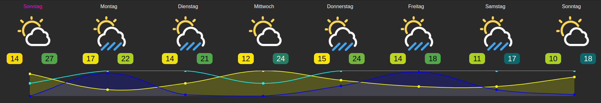

# IoBroker.swiss-weather-api
# Swiss-weather-api-Adapter für ioBroker
Verbindet sich mit der großartigen SRF-Wetter-API – Version 2 (https://developer.srgssr.ch/api-catalog/srf-weather/srf-weather-description).
Mit der SRF-Wetter-REST-API können Sie Wettervorhersagen und -berichte von über 25.000 Standorten in der ganzen Schweiz abrufen. Mit einem „Freemium“-Abonnement erhalten Sie 50 Anfragen pro Tag.

## **Bitte beachten:**
1. Dieser Adapter unterstützt nur Standorte innerhalb der Schweiz.
1. Dieser Adapter unterstützt SRF Weather API V2.

## **Aktualisierungsvorgang Version 1.x.x auf 2.0.x**
- Entfernen Sie den Adapter (löschen Sie alle Adapter-Objekte im ioBroker!)
- Adapter komplett neu installieren => Neue Objekte werden generiert
- Da SRF die Pfadnamen geändert hat, aktualisieren Sie Ihre Visu: [Importieren Sie die Ansichten einfach erneut](https://github.com/baerengraben/ioBroker.swiss-weather-api/tree/master/views).

## Erste Schritte
1. Holen Sie sich einen kostenlosen Account auf https://developer.srgssr.ch/
1. Gehen Sie zu „Apps“ und fügen Sie eine neue App hinzu. Hier können Sie ein API-Produkt auswählen. „SRF-MeteoProductFreemium“ ist ihr kostenloses Produkt. Wenn Sie nur eine Vorhersage für einen Standort wünschen und nur 50 Anfragen pro Tag (alle 30 Minuten) erhalten und/oder nicht für mehr Anfragen pro Tag bezahlen möchten, sollten Sie „SRF-MeteoProductFreemium“ wählen. Dadurch werden nun ein spezifischer ConsumerKey und ein ConsumerSecret erstellt.
1. Ermitteln Sie Längen- und Breitengrad (Dezimalgrad) des gewählten Standorts, für den die Prognose benötigt wird. Diese Angabe ist optional, wenn Sie Ihren Standort in den ioBroker-Einstellungen (Haupteinstellungen) (über die Karte) festgelegt haben. In diesem Fall können Sie die Felder für Längen- und Breitengrad leer lassen. Der Adapter verwendet dann die Einstellungen des ioBrokers. In der Adapterkonfiguration eingegebene Längen- und Breitengrade überschreiben die ioBroker-Einstellungen.
1. Freemium-Nutzer: Bitte beachten Sie, dass sich die SRG API den verwendeten Standort merkt. Ab der ersten Anfrage und für einen gewissen Zeitraum kann das verwendete Abonnement nur noch Anfragen für diesen einen Standort ausliefern.
1. Installieren Sie diesen Adapter auf ioBroker => Dies kann mehrere Minuten dauern (~7 Minuten auf einem Raspberry Pi 3).
1. Füllen Sie bei Adapterkonfiguration
1. Name der App
1. ConsumerKey der App
1. Verbrauchergeheimnis der App
1. Längengrad / Breitengrad des gewählten Schweizer Standorts, für den eine Prognose benötigt wird. => Bitte verwenden Sie Dezimalgrade (Beispiel: Zürich: 47,36667 / 8,5)
1. Abfrageintervall in Minuten (Standardmäßig 60 Minuten – 25 Anfragen/Tag)

Die erste Abfrage erfolgt 10 Sekunden nach dem Start des Adapters. Nach dem ersten Start wird die Abfrage regelmäßig gemäß dem Konfigurationsparameter (Abfrageintervall in Minuten) ausgeführt.
Die Objekte in forecast.current_hour werden 30 Sekunden nach dem ersten Start erstellt und stündlich aktualisiert, indem die entsprechenden Werte aus forecast.hours kopiert werden.

### Visualisierungsbeispiel
###### Voraussetzung:
* Adapter [Material Design Widgets](https://github.com/Scrounger/ioBroker.vis-materialdesign) >= 0.5.7
* Adapter [Vis](https://github.com/iobroker/iobroker.vis/blob/master/README.md)
* [Ansichten in Vis importieren](https://github.com/baerengraben/ioBroker.swiss-weather-api/tree/master/views)

###### Beispiel
Einfaches Beispiel: 

Erweitertes Beispiel: 

Beispiel für die Wochenansicht: 

## Changelog
### 2.2.2 (2024-11-01)
* (baerengraben) Fix for https://github.com/baerengraben/ioBroker.swiss-weather-api/issues/125

### 2.2.1 (2024-11-01)
* (baerengraben) Fix for https://github.com/baerengraben/ioBroker.swiss-weather-api/issues/78

### 2.2.0 (2024-10-30)
* (baerengraben) [Wochensicht_reduziert neu als View und mit Legende](https://github.com/baerengraben/ioBroker.swiss-weather-api/issues/112)

### 2.1.1 (2024-10-29)
* (baerengraben) Fix for https://github.com/baerengraben/ioBroker.swiss-weather-api/issues/124
* (baerengraben) Fix for https://github.com/baerengraben/ioBroker.swiss-weather-api/issues/123
* (baerengraben) Fix for https://github.com/baerengraben/ioBroker.swiss-weather-api/issues/122
* (baerengraben) Fix for https://github.com/baerengraben/ioBroker.swiss-weather-api/issues/121

### 2.1.0 (2024-01-10)
* (baerengraben) Added additional Week-View. Credits goes to https://github.com/pingus01

## License
MIT License

Copyright (c) 2024 baerengraben <baerengraben@intelli.ch>

Permission is hereby granted, free of charge, to any person obtaining a copy
of this software and associated documentation files (the "Software"), to deal
in the Software without restriction, including without limitation the rights
to use, copy, modify, merge, publish, distribute, sublicense, and/or sell
copies of the Software, and to permit persons to whom the Software is
furnished to do so, subject to the following conditions:

The above copyright notice and this permission notice shall be included in all
copies or substantial portions of the Software.

THE SOFTWARE IS PROVIDED "AS IS", WITHOUT WARRANTY OF ANY KIND, EXPRESS OR
IMPLIED, INCLUDING BUT NOT LIMITED TO THE WARRANTIES OF MERCHANTABILITY,
FITNESS FOR A PARTICULAR PURPOSE AND NONINFRINGEMENT. IN NO EVENT SHALL THE
AUTHORS OR COPYRIGHT HOLDERS BE LIABLE FOR ANY CLAIM, DAMAGES OR OTHER
LIABILITY, WHETHER IN AN ACTION OF CONTRACT, TORT OR OTHERWISE, ARISING FROM,
OUT OF OR IN CONNECTION WITH THE SOFTWARE OR THE USE OR OTHER DEALINGS IN THE
SOFTWARE.