#  Synology-Chat-Adapter für ioBroker


[![Donate][donate-badge2]][donate-link]

## Was ist das?
Dieser Adapter stellt eine Schnittstelle zwischen Synology Chat und ioBroker bereit. Hierfür werden die Standardintegrationsfunktionen von Synology Chat und die entsprechenden REST-API-Endpunkte genutzt.
Mithilfe von eingehenden und ausgehenden Integrationen können Sie Nachrichten an den Synology-Chat-Server senden oder ein Nachrichtenobjekt in Ihrer ioBroker-Instanz aktualisieren, um Nachrichten zu empfangen.

---

# Handbuch
## 1. Installation
Der Adapter kann im Adapterabschnitt Ihrer ioBroker-Installation instanziiert werden.
Weitere Informationen finden Sie in der offiziellen Dokumentation [ioBroker-Dokumentation](https://www.iobroker.net/#de/documentation/admin/adapter.md).

## 2. Konfiguration
<div id="synology-chat-configuration"></div>

### 2.1. Synology-Chat-Konfiguration
Der Synology Chat bietet die Möglichkeit, eingehende und ausgehende Nachrichten zu verwalten. Im Folgenden werden beide Optionen genauer erläutert.

- Um Nachrichten über die Synology Chat-Oberfläche zu erstellen, muss eine Integration in Synology Chat erstellt werden:

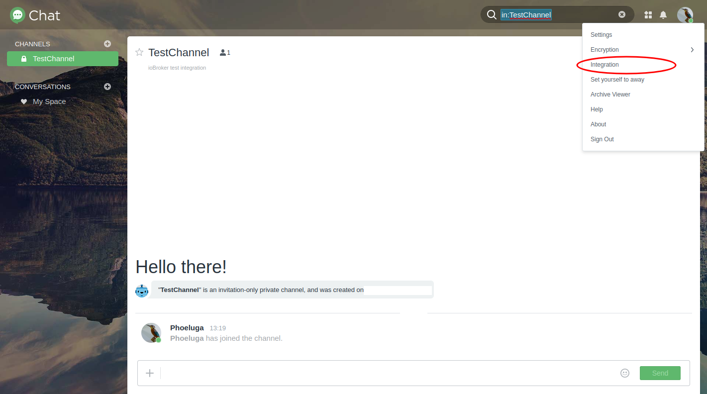 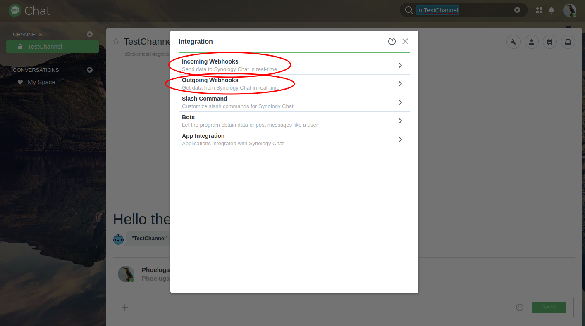

#### 2.1.1. Eingehende Integration
Für die Integration einer eingehenden Nachricht in den Synology-Chat wird ein Token benötigt, der aus der bei der Erstellung generierten URL entnommen werden kann.

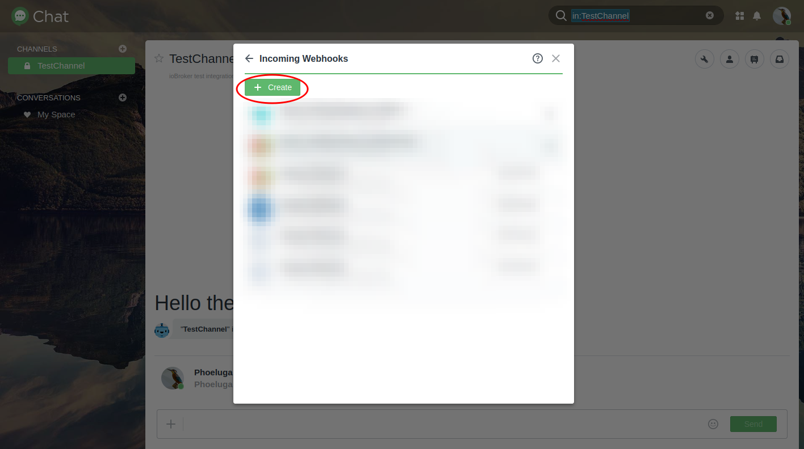 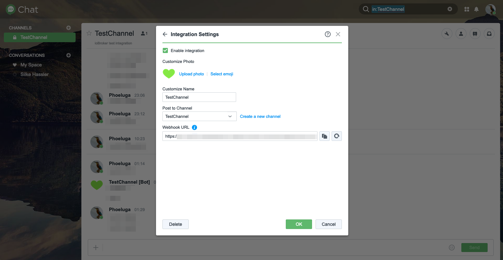

<div id="synologyChatConfigurationOutgoingIntegration"></div>

#### 2.1.2. Ausgehende Integration
Für die Integration ausgehender Nachrichten in den Synology-Chat ist eine Webhook-URL erforderlich. Diese erhalten Sie von den Instanzobjekten nach der Instanziierung des Adapters `synochat`. Weitere Details finden Sie in [3. Verwendung > 3.1 Allgemeines](#web-hook-location) 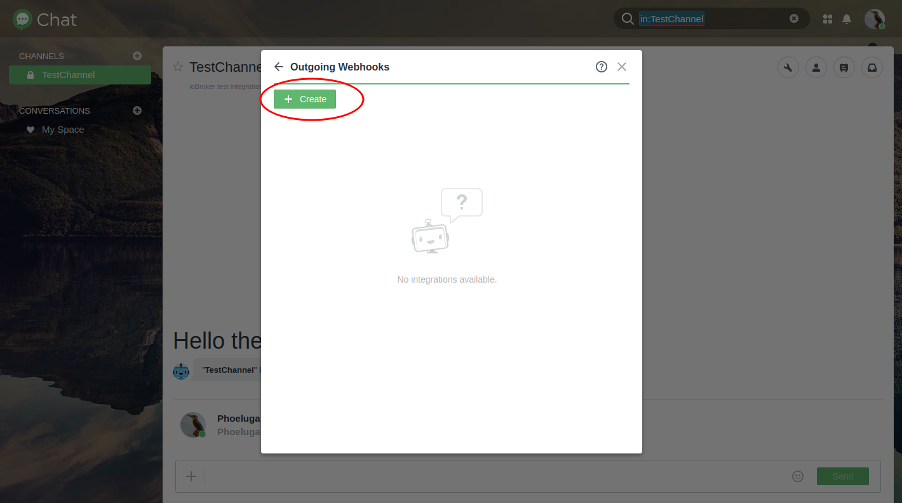 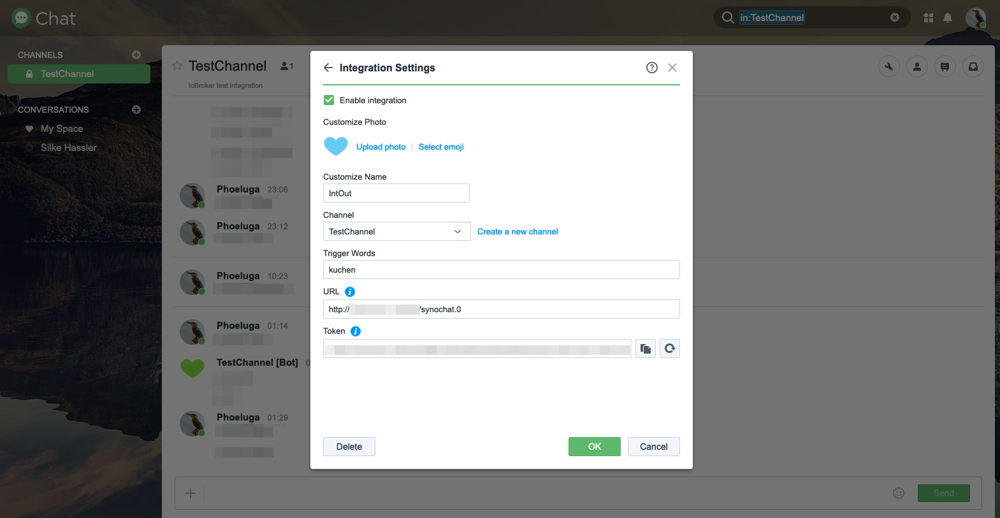.

***HINWEIS:*** *Der Kanaltyp (eingehend; ausgehend) wird aus der Perspektive des Synology-Chats angegeben. Beispielsweise bedeutet „eingehend“, dass die Nachrichten an den Synology-Chatserver gesendet werden.*

Weitere Informationen zur Handhabung von Integrationen in Synology Chat finden Sie in der offiziellen Dokumentation von Synology [HIER](https://kb.synology.com/DSM/help/Chat/chat_integration)

### 2.2. Konfiguration der ioBroker-Adapterinstanz
Die Konfiguration dieses Adapters kann in den Instanzeinstellungen vorgenommen werden.

#### 2.2.1. Haupteinstellungen:
	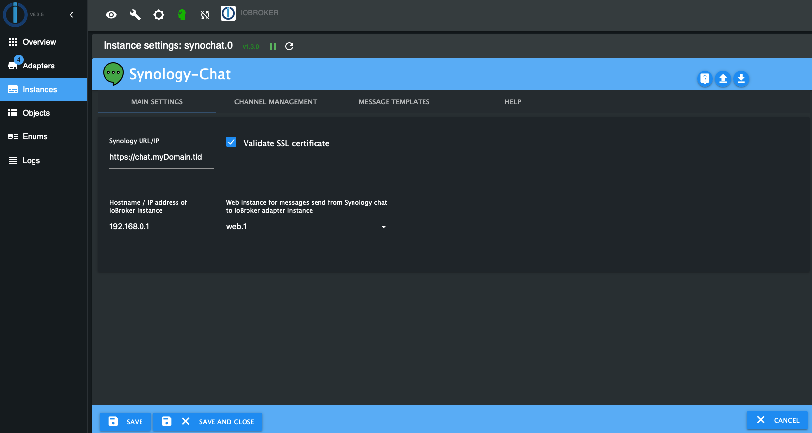

* **Synology URL/IP**

Mit dieser Eigenschaft wird eine URL zu Ihrer Synology-Chat-App bereitgestellt. Bitte verwenden Sie eine absolute URL mit `http://` oder `https://` und kein Suffix wie `/`.
Ein bestimmter Port kann wie gewohnt hinter der URL mit `:` angegeben werden.

***Beispiel für gültige Werte:***

- https://mychat.mydomain.tld
- https://192.168.1.1:8080

* **SSL-Zertifikat validieren**

Es wird selbstverständlich immer empfohlen, Datenübertragungen zu verschlüsseln.
Häufig werden in Heimnetzwerken selbstsignierte Zertifikate für verschlüsselte Verbindungen verwendet. In diesem Fall kann es erforderlich sein, die SSL-Zertifikatsprüfung einer HTTP-Verbindung zu deaktivieren.
Deaktivieren Sie diese Eigenschaft, um die Zertifikatsvalidierung abzuschalten.

* **Hostname / IP-Adresse der ioBroker-Instanz**

Diese Eigenschaft ermöglicht es Ihnen, den Hostnamen oder die IP-Adresse anzugeben, unter der Ihre ioBroker-Instanz per URL erreichbar ist. Dieser Wert wird nach der ersten Instanziierung des Adapters automatisch auf die aktuelle IP-Adresse des Host-Betriebssystems Ihrer ioBroker-Installation gesetzt.

Falls ioBroker als Docker-Instanz verwendet wird, muss dieser Wert möglicherweise geändert werden, z. B. wenn ein Reverse-Proxy oder Ähnliches verwendet wird, um Ihre ioBroker-Instanz zu erreichen.

Dieser Wert wird verwendet, um die Webhook-URL für Kanäle zu generieren, die Nachrichten vom Synology-Chatserver empfangen.

<div id="configurationAdapterWebInstance"></div>

* **Webinstanz für Nachrichten, die vom Synology-Chat an die ioBroker-Adapterinstanz gesendet werden**

Der Adapter `synochat` verwendet einen Adapter `web`, um Webhooks bereitzustellen. Sie müssen eine spezifische Instanz des Adapters `web` auswählen, um einen dedizierten Webhook für die Synology-Chat-Integration bereitzustellen.

<div id="channel-configuration"></div>

#### 2.2.2. Kanalverwaltung / -konfiguration:
	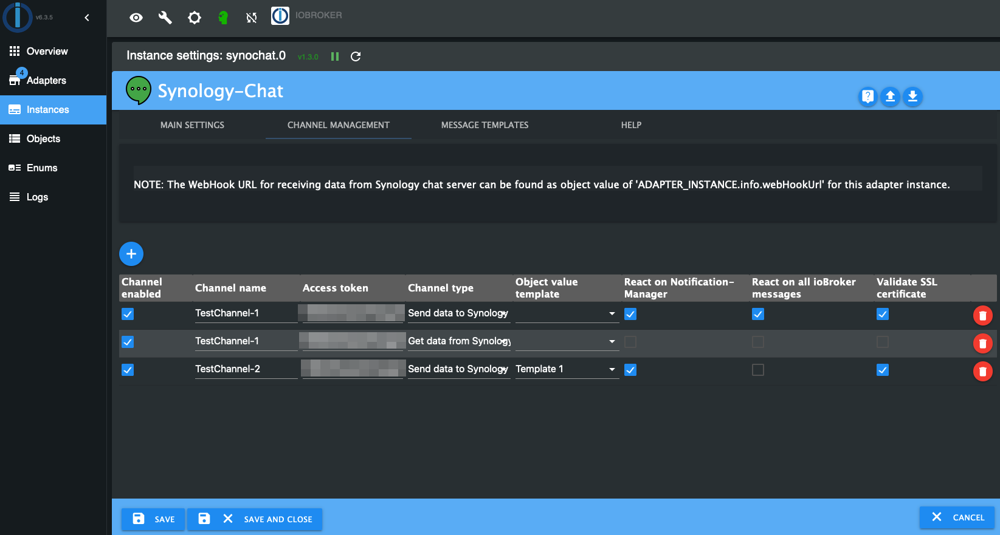

* **Kanal aktiviert**

Mit dieser Option kann die Verarbeitung eingehender oder ausgehender Nachrichten deaktiviert werden.

Dies kann nützlich sein, wenn z. B. der Benutzer die Nutzung eines Kanals nur vorübergehend deaktivieren und die Einstellungen wie das Zugriffstoken oder Ähnliches beibehalten möchte, um zu verhindern, dass diese erneut erfasst werden.

* **Kanalname**

Diese Einstellung legt den Namen des Kanals fest, von dem/an den Nachrichten gesendet werden. Bei Kanälen des Typs `Send data to Synology chat server - Incoming integration` kann dieser Name frei gewählt werden und dient lediglich der Referenzierung.

Der hier zu konfigurierende Kanalname muss mit dem Kanalnamen des Synology-Chats identisch sein.

Für Kanäle vom Typ `Get data from Synology chat server - Outgoing integration` muss der Name mit dem Kanalnamen des Synology-Chatkanals übereinstimmen, damit Nachrichten empfangen werden können.
Bei der Zuordnung der Kanalnamen wird zwischen Groß- und Kleinschreibung unterschieden.

* **Kanal-Token**

Diese Einstellung stellt das Zugriffstoken für den Synology-Chatkanal bereit. Die Erstellung dieses Tokens variiert je nach Kanaltyp.
Weitere Details finden Sie in Kapitel [Synology-Chat-Konfiguration](#synology-chat-configuration).

***HINWEIS:*** *Je nach Integration erhalten Sie beim Erstellen der Synology-Chat-Integration einen Link, der dem folgenden Beispiel ähnelt:*

https://mychat.mydomain.tld/webapi/entry.cgi?api=SYNO.Chat.External&method=incoming&version=2&token=%22QF5DWyG7M47Ls3cv%22

*In diesem Beispiel ist das Token in der URL enthalten. Kodierte Steuerzeichen - `%22` - werden hier am Anfang und Ende der Einstellung angegeben.\ **Diese müssen entfernt werden!**\ In diesem Beispiel wäre das einzugebende Token `QF5DWyG7M47Ls3cv`.*

* **Kanaltyp**

***HINWEIS:*** *Der Kanaltyp muss aus der Perspektive des Synology-Chats angegeben werden. Wenn Sie beispielsweise in den Einstellungen „Eingehend“ auswählen, werden die Nachrichten an den Synology-Chat gesendet.*

Diese Einstellung legt den Typ des Synology-Chatkanals fest, der je nach der in Synology Chat ausgewählten Integration verwendet wird.

* **Daten an den Synology-Chatserver senden - Neue Integration**

Diese Option ermöglicht es dem Kanal, den neuen Wert des ioBroker-Nachrichtenobjekts ([siehe Kapitel zur Verwendung](#usage)) zu senden, sobald sich der Objektwert ändert.

* **Daten vom Synology-Chatserver abrufen - Ausgehende Integration**

Diese Option ermöglicht es dem Kanal, Nachrichten vom Synology-Chatserver zu empfangen und den neuen Wert des ioBroker-Nachrichtenobjekts ([siehe Kapitel zur Verwendung](#usage)) zu aktualisieren.

Bitte beachten Sie, dass bei Verwendung dieses Kanaltyps der Kanalname der ioBroker-Adapterinstanzkonfiguration mit dem Kanalnamen des Synology-Chatkanals übereinstimmen muss, um Nachrichten empfangen zu können. Die Zuordnung der Kanalnamen unterscheidet zwischen Groß- und Kleinschreibung.

Hinweis: Bitte wählen Sie für ausgehende Kanäle nicht die Option „*reagieren auf*“ aus.

Soll ein Kanal sowohl zum Senden als auch zum Empfangen von Nachrichten konfiguriert werden, fügen Sie einfach einen zweiten Kanal mit dem gleichen Namen hinzu und wählen Sie den anderen Kanaltyp aus.

* **Objektwertvorlage**

Wenn der Wert eines Kanalnachrichtenobjekts einen JSON-Wert enthält, können Sie eine Vorlage auswählen, die diesen Objektwert in einen für Menschen lesbaren Wert umwandelt, bevor er an den Synology-Chatkanal gesendet wird.

Die zugehörige Nachrichtenvorlage kann im Abschnitt [Nachrichtenvorlagen](#message-templates) konfiguriert werden.

* **Reagiere auf den Benachrichtigungsmanager**

Der Kanal `synochat` kann Nachrichten von [ioBroker Benachrichtigungsmanager](https://github.com/foxriver76/ioBroker.notification-manager) empfangen. Mit dieser Option können Sie festlegen, ob der entsprechende Kanal auf Nachrichten des Notification Managers reagieren und diese gegebenenfalls an Synology Chat weiterleiten soll.

Die zugehörige Nachrichtenvorlage kann im Abschnitt [Nachrichtenvorlagen](#messageTemplates) konfiguriert werden.

* **Auf alle ioBroker-Nachrichten reagieren**

Neben den Nachrichten von [ioBroker Benachrichtigungsmanager](https://github.com/foxriver76/ioBroker.notification-manager) `synochat` kann der entsprechende Kanal auch Nachrichten von anderen Adaptern empfangen. Mit dieser Option können Sie festlegen, ob der Kanal auf Nachrichten aller anderen Absender reagieren und diese gegebenenfalls an Synology Chat weiterleiten soll.

Eine Adapterinstanz kann Nachrichten empfangen. Diese Nachrichten bestehen aus einem Objekt mit mehreren Attributen, die als Parameter in eine Nachrichtenvorlage eingefügt werden können. Diese Parameter werden vor dem Senden der Nachricht entsprechend ersetzt.

Die zugehörige Nachrichtenvorlage kann im Abschnitt [Nachrichtenvorlagen](#message-templates) konfiguriert werden.

* **SSL-Zertifikat validieren - Für nicht-textuelle Nachrichten**

Soll für einen eingehenden Kanaltyp ein anderer Inhalt als Text, beispielsweise ein Bild, gesendet werden, wird dies über eine URL in der HTTP-Quelle angegeben. Falls dieser Inhalt mit einem selbstsignierten Zertifikat bereitgestellt wird, kann die Zertifikatsprüfung über diese Einstellung aktiviert oder deaktiviert werden.
Weitere Informationen zum Senden von Nicht-Text-Inhalten finden Sie in Kapitel [Synology-Chat-Konfiguration](#synology-chat-configuration).

<div id="message-templates"></div>

#### 2.2.3. Nachrichtenvorlagen:
Es ist möglich, Nachrichtenvorlagen zu definieren, die vor dem Senden einer Nachricht an den Synology Chat Server verarbeitet werden. Diese Vorlagen können Muster enthalten, die während des Sendevorgangs ersetzt werden.

	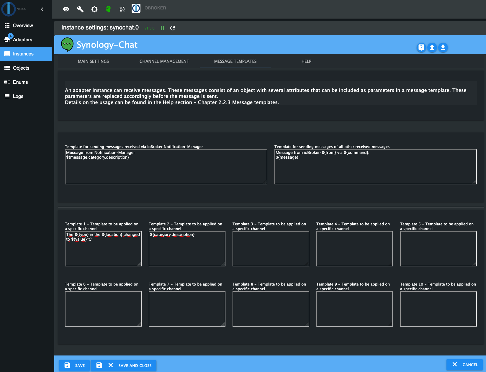

Muster müssen stets mit `${` beginnen und mit `}` enden, z. B. `${foo}`. Bei der Verarbeitung der Nachricht wird das Muster `${foo}` durch den entsprechenden JSON-Wert des Attributs `foo` ersetzt.

	**Probe:**

Wenn ein Kanal, der für das Senden von Daten an Synology Chat konfiguriert ist, eine Objektänderung an seinem Nachrichtenobjekt empfängt, kann dieses einen JSON-Wert wie den folgenden enthalten:

	```json
    {
        "sensor": {
            "id": "temp0815",
            "name": "Temperature - Living room",
            "type": "temperature",
            "location": "living room",
            "value": "23.4"
        }
    }
	```

Sie können auf die inneren Attribute dieses Wertes zugreifen, indem Sie sie in einem Pfad wie `${sensor.value}` angeben.

Wenn Sie eine Nachricht wie diese senden möchten: > Die Temperatur im Wohnzimmer hat sich auf 23,4 °C geändert

Ihre Nachrichtenvorlage würde folgendermaßen aussehen:

`The ${sensor.type} in the ${sensor.location} changed to ${sensor.value}°C`

**HINWEIS UND EINSCHRÄNKUNGEN:**

1. Wenn Sie auf ein Attribut mit einem Schlüssel zugreifen möchten, der Punkte (`.`) enthält, müssen Sie diese mit den Zeichen `/-` maskieren!

z. B. wenn Ihr Nachrichtenobjektwert so aussieht:

```JSON
{
       "category": {
           "instances": {
               "system.adapter.notification-manager.0": {
                   "notification": "Test notification",
               }
           }
       }
   }
```

und Sie möchten auf das Attribut `notification` zugreifen, Ihr Muster lautet `${category.instances.system/-adapter/-notification-manager/-0.notification}`

2. Es ist nicht möglich, auf bestimmte Elemente in Arrays zuzugreifen.

z. B. wenn Ihr Nachrichtenobjektwert so aussieht:

```JSON
{
       "messages": [
           {
           "text": "Lorem"
           },
           {
           "text": "Ipsum"
           }
       ]
   }
```

Sie können nicht auf das Attribut `text` im Objekt `message` zugreifen. In diesem Fall müssen Sie den Objektwert außerhalb dieses Adapters vorbereiten, bevor Sie ihn an das Kanalnachrichtenobjekt `synochat` übergeben.

* **Vorlage zum Senden von Nachrichten, die über den ioBroker Notification-Manager empfangen werden**

Diese Vorlage definiert die Nachrichten, die vom Benachrichtigungsmanager empfangen werden. Als Parameter in Ihrer Vorlage können Sie Attributnamen des Objekts `iobroker.Message` und des eingebetteten Benachrichtigungsmanager-Nachrichtenobjekts verwenden.

Das intern empfangene Objekt ist vom Typ `iobroker.Message`:

		```javascript
		/** A message being passed between adapter instances */
        interface Message {
            /** The command to be executed */
            command: string;
            /** The message payload */
            message: MessagePayload;
            /** The source of this message */
            from: string;
            /** ID of this message */
            _id: number;
            /** Callback information. This is set when the source expects a response */
            callback: MessageCallbackInfo;
        }
		```

Gemäß der Beschreibung stellt der Notification-Manager sein eigenes Nachrichtenobjekt bereit, das im Attribut `message` als Teil des Attributs `iobroker.Message` eingebettet ist.

Sie können auf diese Daten über das Attribut `message` zugreifen, indem Sie das Muster `${message.NOTIFICATION_MANAGER_ATTRIBUTES}` verwenden.

**Verfügbare Muster:**

* `${command}` - Muster im Zusammenhang mit dem `iobroker.Message`-Objekt
* `${message}` - Muster im Zusammenhang mit dem `iobroker.Message`-Objekt
* `${from}` - Muster im Zusammenhang mit dem `iobroker.Message`-Objekt
* `${_id}` - Muster im Zusammenhang mit dem `iobroker.Message`-Objekt
* `${instances}` - Das Muster wird durch eine Liste von Instanzen ersetzt, die mit der empfangenen Benachrichtigung des Notification-Managers verknüpft sind.
* `${contextData}` - Muster, das zusätzliche Kontextdaten bereitstellt, die ebenfalls mit den Benachrichtigungsinformationen gespeichert werden.

Weitere Informationen zur Struktur der [Das Nachrichtenobjekt des Notification-Managers (https://github.com/foxriver76/ioBroker.notification-manager) finden Sie in der [README].](https://github.com/foxriver76/ioBroker.notification-manager).

Hinweis: Bitte wählen Sie für ausgehende Kanäle nicht die Option „*reagieren auf*“ aus.

* **Vorlage zum Versenden von Nachrichten über alle anderen empfangenen Nachrichten**

Das gleiche `iobroker.Message`-Objekt wie oben beschrieben wird zum Senden aller Arten von Nachrichten an eine Adapterinstanz verwendet.

		```javascript
		/** A message being passed between adapter instances */
        interface Message {
            /** The command to be executed */
            command: string;
            /** The message payload */
            message: MessagePayload;
            /** The source of this message */
            from: string;
            /** ID of this message */
            _id: number;
            /** Callback information. This is set when the source expects a response */
            callback: MessageCallbackInfo;
        }
		```

Ausgehend von diesem Objekt selbst ist es möglich, mithilfe der folgenden Muster auf die Werte der zugehörigen Attribute zuzugreifen.

**Verfügbare Muster:**

* `${command}` - Muster im Zusammenhang mit dem `iobroker.Message`-Objekt
* `${message}` - Muster im Zusammenhang mit dem `iobroker.Message`-Objekt
* `${from}` - Muster im Zusammenhang mit dem `iobroker.Message`-Objekt
* `${_id}` - Muster im Zusammenhang mit dem `iobroker.Message`-Objekt

Das Muster `${message}` enthält stets die Informationen des jeweiligen Absenders. Enthält die Nachricht nur `String`, genügt die Angabe des Musters `${message}`. Bei JSON-Werten können Sie auch auf die inneren Attribute zugreifen, indem Sie den Pfad zum Wert angeben, z. B. `${message.foo.bar}`.

Hinweis: Bitte wählen Sie für ausgehende Kanäle nicht die Option „*reagieren auf*“ aus.

* **Vorlage 1-10 - Vorlage, die auf einem bestimmten Kanal angewendet werden soll**

Sie können einem Nachrichtenobjekt eines bestimmten Kanals auch einen JSON-Wert zuweisen. In diesem Fall können Sie bis zu zehn benutzerdefinierte Vorlagen definieren, die vor dem Senden der Nachricht an den Synology Chat-Server angewendet werden.

Auf die JSON-Attribute kann zugegriffen werden, indem der Pfad zum Wert als Muster wie `${foo.bar}` angegeben wird.

Eine Vorlage kann einem Kanal im [Kanalkonfiguration](#channel-configuration) zugeordnet werden.

**Verfügbare Muster:**

Die verfügbaren Muster beziehen sich auf den Kunden-JSON-Wert, der dem Kanalnachrichtenobjekt bereitgestellt wird.

#### 2.2.4. Hilfe:
* Dieser Tab leitet normalerweise zur offiziellen GitHub-Seite dieses Projekts weiter, wo detaillierte Hilfestellungen und Nutzungshinweise zu finden sind.
* Sollten Sie offene Fragen, Änderungsvorschläge, unerwünschtes Verhalten oder Fehler haben, erstellen Sie bitte ein [GitHub-Issue](https://github.com/phoeluga/ioBroker.synochat/issues/new/choose), um die Qualität dieses Projekts zu gewährleisten.

<div id="configurationWebInstance"></div>

### 2.3. Konfiguration der `web`-Instanz
Zum Empfangen von Nachrichten vom Synology-Chatserver muss eine ausgehende Integration konfiguriert werden - Siehe [Ausgehende Integration](#synologyChatConfigurationOutgoingIntegration).

Hierfür ist es erforderlich, dass eine Instanz des `web`-Adapters ausgeführt wird und in [`synochat`-Adapterinstanz konfiguriert](#configurationAdapterWebInstance) konfiguriert ist.

Wenn die verwendete `web`-Instanz für eine sichere HTTPS-Verbindung konfiguriert ist, **stellen Sie sicher, dass Sie ein gültiges Zertifikat verwenden oder Ihr eigenes Zertifikat in die vertrauenswürdigen Zertifikate Ihrer Synology importieren**. Andernfalls werden keine Nachrichten vom Synology-Chatserver an Ihre ioBroker-Adapterinstanz gesendet.
Die Kommunikation kann nicht hergestellt werden, und der Benutzer erhält leider auf beiden Seiten keine direkte Benachrichtigung darüber, dass die Nachricht aufgrund eines ungültigen Zertifikats abgelehnt wurde.

<div id="usage"></div>

## 3. Verwendung
### 3.1 Allgemeines
* Nach der Konfiguration der Adapterinstanz wird für jeden konfigurierten Kanal in den Objekten der jeweiligen Adapterinstanz ein Ordner mit dem Kanalnamen erstellt.

	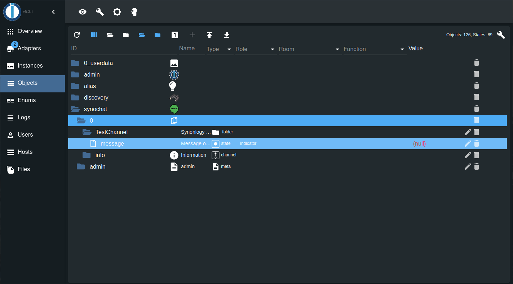

* In diesem Ordner befindet sich ein Nachrichtenobjekt des jeweiligen Kanals, das die gesendete oder empfangene Nachricht darstellt.

***HINWEIS:*** *Achten Sie beim Senden einer Nachricht oder beim Ändern des Nachrichtenobjekts durch den Benutzer darauf, dass das Ack-Flag nicht gesetzt ist. Das Ack-Flag wird vom Adapter gesetzt, nachdem der Synology-Chatserver den erfolgreichen Empfang der Nachricht bestätigt hat.* **Wenn das Ack-Flag vom Benutzer beim Ändern des Nachrichtenwerts in der ioBroker-Objektansicht gesetzt wird, wird die Nachricht nicht verarbeitet!***

	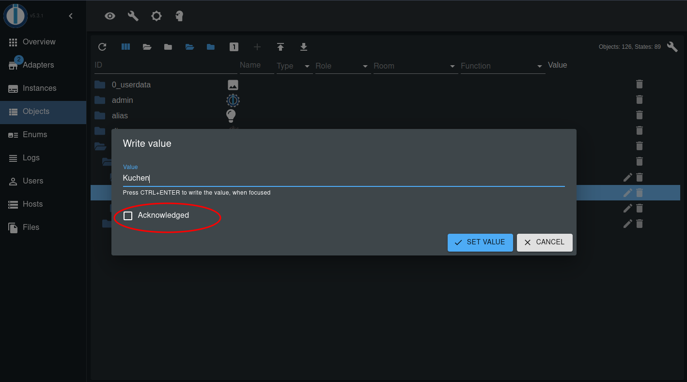

* Wenn das Nachrichtenobjekt geändert wird und der Kanaltyp auf „Daten an Synology-Chatserver senden“ eingestellt ist, wird diese Nachricht an den Synology-Chat weitergeleitet.

	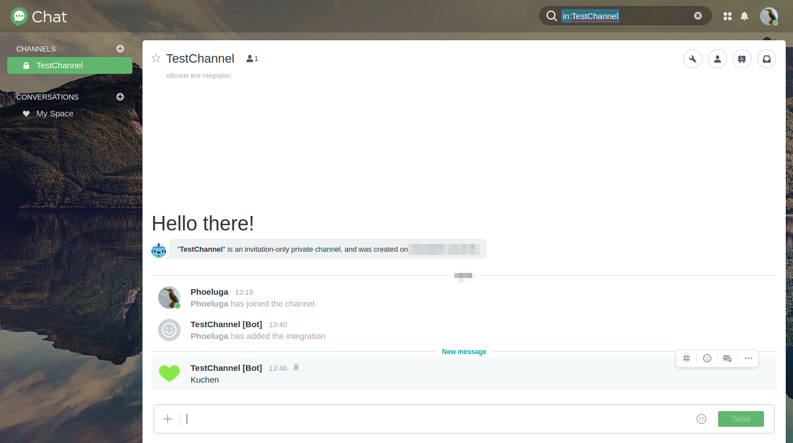

Damit Nachrichten vom Synology Chat Server empfangen und das Nachrichtenobjekt entsprechend aktualisiert wird, muss das konfigurierte Auslösewort (siehe [Synology Chat-Konfiguration](#synology-chat-configuration)) ohne Satzzeichen in der Nachricht enthalten sein. Es muss also allein stehen.

**Beispiel:** Wenn `Trigger word` zu `Alarm` würde, sollte die Nachricht im Synology-Chat folgendermaßen aussehen: `An alarm was triggered in the hallway.`

Bitte beachten Sie, dass bei `Trigger word` zwischen Groß- und Kleinschreibung unterschieden wird.

<div id="web-hook-location"></div>

* Die Webhook-URL / -Adresse wird als Objektwert im Info-Ordner der Adapterinstanz bereitgestellt und ist für alle Kanäle innerhalb einer Adapterinstanz gültig.

	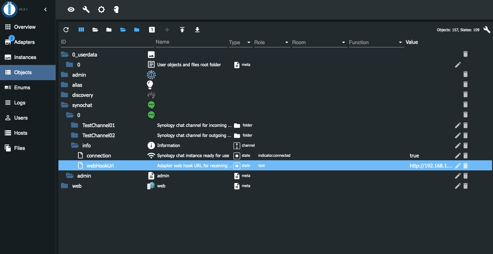

### 3.2 Nachrichteninhaltstyp
Neben reinen Textnachrichten können auch andere Inhaltstypen wie Bilder an einen eingehenden Kanal gesendet werden. Dafür muss der Inhalt als Webressource verfügbar sein. Um ein Bild zu senden, legen Sie einfach die URL als Wert des Nachrichtenobjekts der in Abschnitt [3. Verwendung > 3.1 Allgemeines](#usage) erwähnten Syno-Chat-Adapterinstanz fest.

**Beispiel für einen Anwendungsfall einer Überwachungskamera:** Viele Überwachungskameras bieten einen Stream oder eine Schnittstelle zum Abrufen eines Bildes, das in einem festgelegten Zeitintervall oder bei Bewegungserkennung aktualisiert wird. Diese URL liefert das Bild, das als Wert des Nachrichtenobjekts festgelegt werden muss.

### 3.3 Fehlersuche bei Problemen
Um detailliertere Informationen über das Verhalten des Adapters im Problemfall zu erhalten, können Sie den Protokollierungsgrad der Adapterinstanz `synochat` auf `debug` erhöhen.

Da dieser Adapter eine `web`-Adapterinstanz verwendet, um Webhooks an den Synology-Chatserver zu senden, führt die konfigurierte `web`-Instanz einige Funktionen aus. Um bei Problemen mit dem Nachrichtenempfang detailliertere Informationen zu erhalten, müssen Sie den Protokollierungsgrad der konfigurierten `web`-Instanz ebenfalls auf `debug` erhöhen. Protokollmeldungen des `synochat`-Adapters sind am Präfix `synochat.<INSTANCE_NUMBER>` erkennbar.

---

## Sonstige Offenlegungen
#### Quellenangabe
- [Chat-Icons erstellt von Pixel perfect - Flaticon](https://www.flaticon.com/free-icons/chat)

[donate-badge]:https://img.shields.io/static/v1?label=Treat%20a%20coffee&message=donate%20a%20tip&color=2a9cde&logo=

[donate-badge2]:https://img.shields.io/static/v1?label=Treat%20a%20coffee&message=donate%20a%20tip&color=2a9cde&logo=

[donate-link]: https://www.paypal.com/donate/?hosted_button_id=9MLB29CKX5674

## Changelog
<!--
    Placeholder for the next version (at the beginning of the line):
    ### **WORK IN PROGRESS**
-->
### **WORK IN PROGRESS**
- *[@phoeluga]* Updated outdated devDependencies (`@alcalzone/release-script*` to v5.x, `@iobroker/testing` to 5.2.2)
- *[@phoeluga]* Bumped `admin` globalDependency requirement to `>=7.6.20`
- *[@phoeluga]* Migrated CI/CD to NPM Trusted Publishing (OIDC) — removed long-lived `NPM_TOKEN`
- *[@phoeluga]* Split monolithic `test-and-release.yml` workflow into reusable `test.yml` and `release.yml`
- *[@phoeluga]* Added `node:` prefix to all Node.js built-in `require()` calls
- *[@phoeluga]* Removed `JSON.parse(JSON.stringify(...))` anti-pattern in REST API client
- *[@phoeluga]* Fixed loose equality comparisons (`==` → `===`) throughout codebase
- *[@phoeluga]* Removed dead commented-out code and unreachable branches
- *[@phoeluga]* Fixed typos in log messages and variable names (`maxItter` → `maxIter`)
- *[@phoeluga]* Added optional chaining for safer template interpolation
- *[@phoeluga]* Updated copyright year to 2025-2026

### 1.4.2 (2025-10-04)
- *[@phoeluga]* Adding channelToken and channels properties to protectedNative and encryptedNative object type
- *[@phoeluga]* Enhanced template handling to properly ignore non-JSON objects, preventing them from being processed as JSON objects
- *[@OlliMartin]* Allow to be used in message templates - #34
- *[@phoeluga]* Adding compatibility check and testing for node.js 24 - #35
- *[@phoeluga]* Updated dependencies to the current minimum versions and according to - #36 ; #38 ; #39

### 1.3.3 (2025-01-26)
- *[@phoeluga]* Updated admin UI to fix responsive design (mobile view) - #28

### 1.3.2 (2025-01-04)
- *[@phoeluga]* Fixed issue with 5 digit port number when using a IP for property Synology URL/IP - #20
- *[@phoeluga]* Addressed W[171],W[105],W[109] - #18
- *[@phoeluga]* Updated admin style.css and classes to support scrolling on mobile device view - #24
- *[@phoeluga]* Updated several dependencies to met the current overall config - #21
- *[@phoeluga]* Update test-workflow to be prepared for Node.js v22 - #22
- *[@phoeluga]* Bumped min. Node.js version to v18 - #22
- *[@phoeluga]* Bumped @iobroker/adapter-core to version >= 3.x.x - #23
- *[@phoeluga]* Updated ESLint usage and config - Migration to ESLint 9 - #25

### 1.3.1 (2023-08-13)
- *[@phoeluga]* Fixed TypeError issue with empty initial value of outgoing channels - #13
- *[@phoeluga]* Updated information about handling of outgoing channels - #14
- *[@phoeluga]* Fixed special character escaping issue - #16
- *[@phoeluga]* Added text mapping for 'human readable' descriptions of the message parent objects - #14

### 1.3.0 (2023-07-23)
- *[@phoeluga]* Added feature to react on messages from Notification-Manager - #9
- *[@phoeluga]* Added feature to react on general received messages sent to the `synochat` adapter instance.
- *[@phoeluga]* Added message templates for received messages from other adapters.
- *[@phoeluga]* Added message templates for object values related to an associated channel.

### 1.2.1 (2022-05-18)
- *[@phoeluga]* The IP family check to determine the local IP address of the ioBroker instance has been adjusted.

### 1.2.0 (2022-05-17)

- *[@phoeluga]* Added enhancement #6 - Delayed sending of messages has been added to work around the limitations of messages sent to the Synology Chat Server in a certain time interval.
- *[@phoeluga]* Regarding #6, a message queue has been added to ensure that the order of messages to be sent is respected when the sending of messages is delayed.
- *[@phoeluga]* Implementation of the [requirements](https://github.com/ioBroker/ioBroker.repositories/pull/1759#issuecomment-1127520995) for adding the adapter in the ioBroker repository - Adding MIT license hint to the Readme.
- *[@phoeluga]* Implementation of the [requirements](https://github.com/ioBroker/ioBroker.repositories/pull/1759#issuecomment-1127520995) for adding the adapter in the ioBroker repository - Moved adapter instance object subscription after initial connectivity check.
- *[@phoeluga]* Implementation of the [requirements](https://github.com/ioBroker/ioBroker.repositories/pull/1759#issuecomment-1127520995) for adding the adapter in the ioBroker repository - Added exception handling to cover https://github.com/nodejs/node/issues/43014 in Nodejs 18
- *[@phoeluga]* Implementation of the [requirements](https://github.com/ioBroker/ioBroker.repositories/pull/1759#issuecomment-1127527703) for adding the adapter in the ioBroker repository - Added axios as dependency in package.json

### 1.1.1 (2022-04-16)

- *[@phoeluga]* Fixed issue #4 - Issue while migrating data from version < 1.1.0
- *[@phoeluga]* Added collecting and loading of default values when loading the initial configuration of the adapter instance
- *[@phoeluga]* The channel search behavior has been adjusted to react accordingly to deactivated channels and to query the remaining channels.

### 1.1.0 (2022-04-14)

- *[@phoeluga]* Added the ability to manage multiple channels in one adapter instance per Synology chat server.
- *[@phoeluga]* A possibility of ioBroker hostname / IP address configuration has been introduced.\
(May be helpful when using an ioBroker Docker instance).
- *[@phoeluga]* A functionality to receive incoming messages from the Synology chat server using WebHooks has been added.\
(An instance of the web adapter is required to use this feature)
- *[@phoeluga]* The translation of the UI properties was added.
- *[@phoeluga]* Added function to migrate channel data from an older version to a new channel object in the list approach.
- *[@phoeluga]* Added possibility for a user to disable dedicated channels from being processed.

### 1.0.1 (2022-04-06)

- *[@phoeluga]* Resolved #1 - Unable to send messages with special characters
- *[@phoeluga]* Resolved #2 - Send images


### 1.0.0 (2022-04-05)

- *[@phoeluga]* Initial release


### 0.0.1 (2022-04-03) - ALPHA

- *[@phoeluga]* Start of development

## License

This code is licensed under 'The MIT License (MIT)' license specified in the [LICENSE](https://github.com/phoeluga/ioBroker.synochat/blob/master/LICENSE) file.

Copyright (c) 2025-2026 phoeluga <phoeluga@gmail.com>