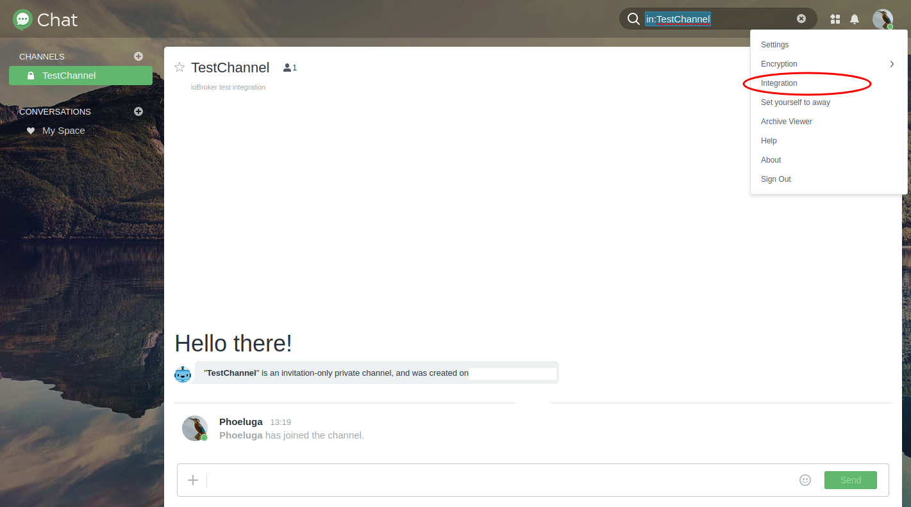

# Synology-Chat-Adapter für ioBroker


[![Spenden][donate-badge2]][donate-link]

## Was ist es?
Dieser Adapter stellt eine Schnittstelle zwischen Synology Chat und ioBroker bereit. Zu diesem Zweck werden die von Synology Chat bereitgestellten Standard-Integrationsfunktionen und die entsprechenden REST-API-Endpunkte verwendet.
Eingehende und ausgehende Integrationen können verwendet werden, um Nachrichten an den Synology-Chatserver zu senden oder ein Nachrichtenobjekt in Ihrer ioBroker-Instanz zu aktualisieren, um Nachrichten zu empfangen.

---

# Handbuch
## 1. Installation
Der Adapter kann über den Adapterabschnitt in Ihrer ioBroker-Installation instanziiert werden.
Weitere Informationen finden Sie in den offiziellen [ioBroker-Dokumentation](https://www.iobroker.net/#de/documentation/admin/adapter.md).

## 2. Konfiguration
<div id="synology-chat-configuration"></div>

### 2.1. Synology-Chat-Konfiguration
- Der Synology Chat bietet die Möglichkeit, ein- und ausgehende Nachrichten zu verwalten. Im Folgenden werden beide Möglichkeiten näher beleuchtet.

- Um Nachrichten über die Synology Chat-Schnittstelle zu erstellen, muss eine Integration in Synology Chat erstellt werden:

 

  #### 2.1.1. Eingehende Integration
Für die Einbindung einer eingehenden Nachricht in den Synology-Chat wird ein Token benötigt, der der bei der Erstellung generierten URL entnommen werden kann.
 

<div id="synologyChatConfigurationOutgoingIntegration"></div>

  #### 2.1.1. Ausgehende Integration
Für die Einbindung einer ausgehenden Nachricht in den Synology-Chat muss eine Web-Hook-URL angegeben werden. Sie erhalten diese Web-Hook-URL von den Instanzobjekten, nachdem Sie den `synochat`-Adapter instanziiert haben. Weitere Details finden Sie in [3. Nutzung > 3.1 Allgemeines](#webHookLocation)  

***HINWEIS:*** *Der Kanaltyp (eingehend; ausgehend) wird aus der Perspektive des Synology-Chats angegeben. „Eingehend“ bedeutet beispielsweise, dass die Nachrichten an den Synology-Chatserver gesendet werden.*

Weitere Einzelheiten zum Umgang mit Integrationen im Synology-Chat finden Sie in der offiziellen Dokumentation von Synology [HIER](https://kb.synology.com/DSM/help/Chat/chat_integration)

### 2.2. Konfiguration der ioBroker-Adapterinstanz
- Die Konfiguration dieses Adapters kann in den Instanzeinstellungen vorgenommen werden.

    #### 2.2.1. Haupteinstellungen:
	

* **Synology-URL/IP**

Mit dieser Eigenschaft wird eine URL zu Ihrer Synology-Chat-App bereitgestellt. Bitte beachten Sie, dass Sie eine absolute URL einschließlich `http://` oder `https://` verwenden und kein Postfix wie `/` angeben.
Hinter der URL kann wie gewohnt mit `:` ein bestimmter Port angegeben werden.

***Beispiel für gültige Werte:***

- https://mychat.mydomain.tld
- https://192.168.1.1:8080

    * **SSL-Zertifikat validieren**

Es empfiehlt sich natürlich immer, Datenübertragungen zu verschlüsseln.
Für verschlüsselte Verbindungen in Heimumgebungen werden häufig selbstsignierte Zertifikate verwendet. In diesem Fall kann es erforderlich sein, die SSL-Zertifikatsüberprüfung einer HTTP-Verbindung zu deaktivieren.
Deaktivieren Sie diese Eigenschaft, um die Zertifikatsvalidierung zu deaktivieren.

* **Hostname/IP-Adresse der ioBroker-Instanz**

        Mit dieser Eigenschaft können Sie den Hostnamen oder die IP-Adresse angeben, unter der Ihre ioBroker-Instanz per URL erreichbar ist. Dieser Wert wird nach der ersten Adapterinstanziierung automatisch auf die aktuelle IP-Adresse des Host-Betriebssystems Ihrer ioBroker-Installation gesetzt.

Bei der Verwendung von ioBroker als Docker-Instanz kann es erforderlich sein, diesen Wert zu ändern, z.B. wenn ein Reverse-Proxy oder ähnliches verwendet wird, um Ihre ioBroker-Instanz zu erreichen.

Dieser Wert wird verwendet, um die Web-Hook-URL für Kanäle zu generieren, die Nachrichten vom Synology-Chatserver empfangen.

<div id="configurationAdapterWebInstance"></div>

* **Webinstanz für Nachrichten, die vom Synology-Chat an die ioBroker-Adapterinstanz gesendet werden**

        Der `synochat`-Adapter verwendet einen `web`-Adapter, um Web-Hooks verfügbar zu machen. Sie müssen eine bestimmte Instanz des `web`-Adapters auswählen, um einen dedizierten Web-Hook für die Synology-Chat-Integration bereitzustellen.

<div id="channel-configuration"></div>

    #### 2.2.2. Kanalverwaltung/-konfiguration:
	

* **Kanal aktiviert**

Mit dieser Option kann die Behandlung eingehender oder ausgehender Nachrichten deaktiviert werden.

Dies kann nützlich sein, wenn z.B. Der Benutzer möchte die Nutzung eines Kanals nur vorübergehend deaktivieren und möchte die Einstellungen wie das Zugriffstoken oder ähnliches beibehalten, um zu verhindern, dass sie erneut erfasst werden.

    * **Kanal Name**

Diese Einstellung gibt den Namen des Kanals an, von dem/an den Nachrichten gesendet werden. Dieser Name ist frei wählbar und dient der Referenzierung.

Der hier zu konfigurierende Kanalname sollte mit dem Kanalnamen des Synology-Chats identisch sein.

* **Kanal-Token**

Diese Einstellung stellt das Zugriffstoken für den Synology-Chat-Kanal bereit. Je nach Kanaltyp ist die Erstellung unterschiedlich.
Weitere Details finden Sie im Kapitel [Synology-Chat-Konfiguration](#synology-chat-configuration).

***HINWEIS:***\ *Abhängig von der Integration erhalten Sie beim Erstellen der Synology-Chat-Integration einen Link ähnlich dem folgenden Beispiel:*

https://mychat.mydomain.tld/webapi/entry.cgi?api=SYNO.Chat.External&method=incoming&version=2&token=%22QF5DWyG7M47Ls3cv%22

*In diesem Beispiel ist das Token in der URL enthalten. Am Anfang und Ende der Einstellung werden hier codierte Steuerzeichen - `%22` - angegeben.\ **Diese müssen entfernt werden!**\ In diesem Beispiel wäre das einzugebende Token `QF5DWyG7M47Ls3cv`. *

* **Kanaltyp**

***HINWEIS:***\ *Der Kanaltyp muss aus Sicht des Synology-Chats angegeben werden. Wenn Sie beispielsweise in der Konfiguration „Eingehend“ auswählen, werden die Nachrichten an den Synology-Chat gesendet.*

Diese Einstellung legt den Typ des Synology-Chat-Kanals fest, der abhängig von der im Synology-Chat ausgewählten Integration verwendet wird.

* **Daten an den Synology-Chatserver senden – Eingehende Integration**\

Diese Option ermöglicht es dem Kanal, den neuen Wert des ioBroker-Nachrichtenobjekts ([siehe Kapitel „Verwendung“.](#usage)) zu senden, sobald sich der Objektwert ändert.

        * **Daten vom Synology-Chatserver abrufen – Ausgehende Integration**\

Mit dieser Option kann der Kanal Nachrichten vom Synology-Chatserver empfangen und den neuen Wert des ioBroker-Nachrichtenobjekts ([siehe Kapitel „Verwendung“.](#usage)) aktualisieren.

Bitte beachten Sie, dass bei Verwendung dieses Kanaltyps der Kanalname der ioBroker-Adapter-Instanzkonfiguration mit dem Kanalnamen des Synology-Chat-Kanals identisch sein muss, um Nachrichten zu empfangen.

> Hinweis: Bitte stellen Sie sicher, dass Sie für ausgehende Kanäle nicht die Option „*Reagieren auf*“ auswählen

Wenn ein Kanal sowohl zum Senden als auch zum Empfangen von Nachrichten konfiguriert werden soll, fügen Sie einfach einen zweiten Kanal mit demselben Namen hinzu und wählen Sie den anderen Kanaltyp aus.

    * **Objektwertvorlage**

Wenn der Wert eines Kanalnachrichtenobjekts einen JSON-Wert enthält, können Sie eine Vorlage auswählen, die diesen Objektwert in einen für Menschen lesbaren Wert analysiert, bevor er an den Synology-Chat-Kanal gesendet wird.

Die zugehörige Nachrichtenvorlage kann im Abschnitt [Nachrichtenvorlagen](#message-templates) konfiguriert werden.

    * **Reagieren Sie auf Notification-Manager**

        Der `synochat` ist in der Lage, Nachrichten von [ioBroker Notification-Manager](https://github.com/foxriver76/ioBroker.notification-manager) zu empfangen. Mit dieser Option können Sie auswählen, ob der entsprechende Kanal auf Nachrichten vom Notification Manager reagieren und diese entsprechend an Synology Chat weiterleiten soll.

Die zugehörige Nachrichtenvorlage kann im Abschnitt [Nachrichtenvorlagen](#messageTemplates) konfiguriert werden.

    * **Reagieren Sie auf alle ioBroker-Nachrichten**

Neben den Nachrichten vom [ioBroker Notification-Manager](https://github.com/foxriver76/ioBroker.notification-manager) kann `synochat` auch andere Nachrichten von anderen Adaptern empfangen. Mit dieser Option können Sie auswählen, ob der entsprechende Kanal auf Nachrichten aller anderen Absender reagieren und diese entsprechend an Synology Chat weiterleiten soll.

Eine Adapterinstanz kann Nachrichten empfangen. Diese Nachrichten bestehen aus einem Objekt mit mehreren Attributen, die als Parameter in eine Nachrichtenvorlage eingebunden werden können. Diese Parameter werden vor dem Versenden der Nachricht entsprechend ersetzt.

Die zugehörige Nachrichtenvorlage kann im Abschnitt [Nachrichtenvorlagen](#message-templates) konfiguriert werden.

* **SSL-Zertifikat validieren – Für Nicht-Textnachrichten**

Falls für einen eingehenden Kanaltyp ein anderer Inhalt als ein Text, beispielsweise ein Bild, gesendet werden soll, wird dieser von einer HTTP-Quelle über eine URL angegeben. Wenn dieser Inhalt mit einem selbstsignierten Zertifikat versehen ist, kann mit dieser Einstellung die Zertifikatsprüfung aktiviert oder deaktiviert werden.
Einzelheiten zum Senden von Nicht-Text-Inhalten finden Sie im Kapitel [Synology-Chat-Konfiguration](#synology-chat-configuration).

<div id="message-templates"></div>

#### 2.2.3. Nachrichtenvorlagen:
    Es ist möglich, Nachrichtenvorlagen zu definieren, die verarbeitet werden, bevor eine Nachricht an Synology Chat Server gesendet wird. Diese Vorlagen können Muster enthalten, die während des Sendevorgangs ersetzt werden.

	

Muster müssen immer mit `${` beginnen und mit `}` enden. z.B. `${foo}`. Während der Verarbeitung der Nachricht wird das Muster `${foo}` durch den entsprechenden JSON-Wert des Attributs `foo` ersetzt.

**Probe:**

Wenn ein Kanal, der zum Senden von Daten an Synology Chat konfiguriert ist, eine Objektänderung an seinem Nachrichtenobjekt empfängt, kann dieser einen JSON-Wert wie den folgenden enthalten:

	```json
    {
        "sensor": {
            "id": "temp0815",
            "name": "Temperature - Living room",
            "type": "temperature",
            "location": "living room",
            "value": "23.4"
        }
    }
	```

Sie können auf die inneren Attribute dieses Werts zugreifen, indem Sie sie in einem Pfad wie `${sensor.value}` bereitstellen.

Wenn Sie eine SMS senden möchten wie > Die Temperatur im Wohnzimmer hat sich auf 23,4 °C geändert

Ihre Nachrichtenvorlage würde so aussehen:

`The ${type} in the ${location} changed to ${value}°C`

**HINWEIS UND EINSCHRÄNKUNGEN:**

    1. Wenn Sie versuchen, auf ein Attribut mit einem Schlüssel zuzugreifen, der Punkte (`.`) enthält, müssen Sie diese mit den Zeichen `/-` maskieren!

    z.B. Wenn Ihr Nachrichtenobjektwert so aussieht:

```JSON
{
       "category": {
           "instances": {
               "system.adapter.notification-manager.0": {
                   "notification": "Test notification",
               }
           }
       }
   }
```

    und Sie möchten auf das Attribut `notification` zugreifen, Ihr Muster lautet `${category.instances.system/-adapter/-notification-manager/-0.notification}`

2. Es ist nicht möglich, auf bestimmte Elemente in Arrays zuzugreifen.

z.B. Wenn Ihr Nachrichtenobjektwert so aussieht:

```JSON
{
       "messages": [
           {
           "text": "Lorem"
           },
           {
           "text": "Ipsum"
           }
       ]
   }
```

Sie können nicht auf das `text`-Attribut im `message`-Objekt zugreifen. In diesem Fall müssen Sie den Objektwert außerhalb dieses Adapters vorbereiten, bevor Sie ihn an das Kanalnachrichtenobjekt `synochat` übergeben.

* **Vorlage zum Versenden von Nachrichten, die über den ioBroker Notification-Manager empfangen wurden**

        Diese Vorlage definiert die Nachricht der vom Notification-Manager empfangenen Nachrichten. Als Parameter in Ihrer Vorlage können Sie Attributnamen des `iobroker.Message`-Objekts und des eingebetteten Notification-Manager-Nachrichtenobjekts verwenden.

Das interne Empfangsobjekt ist vom Typ `iobroker.Message`:

		```javascript
		/** A message being passed between adapter instances */
        interface Message {
            /** The command to be executed */
            command: string;
            /** The message payload */
            message: MessagePayload;
            /** The source of this message */
            from: string;
            /** ID of this message */
            _id: number;
            /** Callback information. This is set when the source expects a response */
            callback: MessageCallbackInfo;
        }
		```

Gemäß der Beschreibung stellt der Notification-Manager ein eigenes Nachrichtenobjekt bereit, das im Attribut `message` als Teil des `iobroker.Message` eingebettet ist.

Auf diese Daten können Sie über das Attribut `message` zugreifen, indem Sie das Muster `${message.NOTIFICATION_MANAGER_ATTRIBUTES}` verwenden.

**Verfügbare Muster:**

* „${command}“ – Muster im Zusammenhang mit dem „iobroker.Message“-Objekt
* „${message}“ – Muster im Zusammenhang mit dem „iobroker.Message“-Objekt
* „${from}“ – Muster im Zusammenhang mit dem „iobroker.Message“-Objekt
* „${_id}“ – Muster im Zusammenhang mit dem „iobroker.Message“-Objekt
* „${instances}“ – Muster wird durch eine Liste von Instanzen ersetzt, die sich auf die empfangene Benachrichtigung des Notification-Managers beziehen

        Weitere Informationen zum Aufbau der [Das Nachrichtenobjekt Notification-Manager](https://github.com/foxriver76/ioBroker.notification-manager) finden Sie in der [README](https://github.com/foxriver76/ioBroker.notification-manager).

> Hinweis: Bitte stellen Sie sicher, dass Sie für ausgehende Kanäle nicht die Option „*Reagieren auf*“ auswählen

    * **Vorlage zum Senden von Nachrichten aller anderen empfangenen Nachrichten**

        Das gleiche `iobroker.Message`-Objekt wie oben beschrieben wird zum Senden aller Arten von Nachrichten an eine Adapterinstanz verwendet.

		```javascript
		/** A message being passed between adapter instances */
        interface Message {
            /** The command to be executed */
            command: string;
            /** The message payload */
            message: MessagePayload;
            /** The source of this message */
            from: string;
            /** ID of this message */
            _id: number;
            /** Callback information. This is set when the source expects a response */
            callback: MessageCallbackInfo;
        }
		```

Von diesem Objekt selbst aus ist es möglich, mit den folgenden Mustern auf die Werte der zugehörigen Attribute zuzugreifen.

**Verfügbare Muster:**

* „${command}“ – Muster im Zusammenhang mit dem „iobroker.Message“-Objekt
* „${message}“ – Muster im Zusammenhang mit dem „iobroker.Message“-Objekt
* „${from}“ – Muster im Zusammenhang mit dem „iobroker.Message“-Objekt
* „${_id}“ – Muster im Zusammenhang mit dem „iobroker.Message“-Objekt

        Das Muster `${message}` ist immer dasjenige, das die Informationen des entsprechenden Absenders enthält. Wenn die Nachricht nur einen `String` enthält, müssen Sie nur das Muster `${message}` angeben. Stellt es einen JSON-Wert bereit, können Sie auch auf die inneren Attribute zugreifen, indem Sie den Pfad zum Wert wie `${message.foo.bar}` angeben.

> Hinweis: Bitte stellen Sie sicher, dass Sie für ausgehende Kanäle nicht die Option „*Reagieren auf*“ auswählen

    * **Vorlage 1–10 – Vorlage zur Anwendung auf einem bestimmten Kanal**

        Sie können einem Nachrichtenobjekt eines bestimmten Kanals auch einen JSON-Wert bereitstellen. In diesem Fall können Sie bis zu zehn benutzerspezifische Vorlagen definieren, die angewendet werden können, bevor die Nachricht an den Synology Chat-Server gesendet wird.

Auf die JSON-Attribute kann zugegriffen werden, indem der Pfad zum Wert als Muster wie `${foo.bar}` angegeben wird.

Eine Vorlage kann einem Kanal im [Kanalkonfiguration](#channel-configuration) zugeordnet werden.

**Verfügbare Muster:**

Die verfügbaren Muster beziehen sich auf den JSON-Wert des Kunden, der dem Kanalnachrichtenobjekt bereitgestellt wird.

#### 2.2.4. Hilfe:
   * Dieser Tab leitet normalerweise zur offiziellen GitHub-Seite dieses Projekts weiter, wo detaillierte Hilfe und Nutzungsanweisungen gegeben werden.
* Wenn es offene Fragen, Änderungsvorschläge, unerwünschtes Verhalten oder Fehler gibt, erstellen Sie bitte ein [GitHub-Problem](https://github.com/phoeluga/ioBroker.synochat/issues/new/choose), um die Qualität sicherzustellen dieses Projekt.

<div id="configurationWebInstance"></div>

### 2.3. Konfiguration der `web`-Instanz
Für den Empfang von Nachrichten vom Synology-Chatserver muss eine ausgehende Integration konfiguriert werden – siehe [Ausgehende Integration](#synologyChatConfigurationOutgoingIntegration).

Hierzu muss eine Instanz des `web`-Adapters ausgeführt und im [„synochat“-Adapterinstanz konfiguriert](#configurationAdapterWebInstance) konfiguriert werden.

Wenn die verwendete `web`-Instanz für die Verwendung einer sicheren Verbindung über HTTPS konfiguriert ist, **stellen Sie sicher, dass Sie ein gültiges Zertifikat bereitstellen oder Ihr eigenes Zertifikat in die vertrauenswürdigen Zertifikate in Ihrer Synology importieren**.\ Andernfalls werden keine Nachrichten gesendet vom Synology-Chatserver zu Ihrer ioBroker-Adapterinstanz.
Die Kommunikation kommt nicht zustande und leider gibt es auf beiden Seiten keinen direkten Hinweis für den Nutzer, dass die Nachricht aufgrund eines ungültigen Zertifikats abgelehnt wurde.

<div id="usage"></div>

## 3. Verwendung
### 3.1 Allgemeines
* Nach der Konfiguration der Adapterinstanz wird für jeden konfigurierten Kanal in den Objekten der jeweiligen Adapterinstanz ein Ordner mit dem Kanalnamen angelegt.

	

* In diesem Ordner befindet sich ein Nachrichtenobjekt des jeweiligen Kanals, das die gesendete oder empfangene Nachricht repräsentiert.

***HINWEIS:***\ *Stellen Sie beim Senden einer Nachricht oder beim Ändern des Nachrichtenobjekts durch den Benutzer sicher, dass das Ack-Flag nicht gesetzt ist. Das Ack-Flag wird vom Adapter gesetzt, nachdem der erfolgreiche Empfang der Nachricht vom Synology-Chatserver bestätigt wurde.*\ **Wenn das Ack-Flag vom Benutzer gesetzt wird, während er den Nachrichtenwert in der ioBroker-Objektansicht ändert, wird die Nachricht gesetzt nicht verarbeitet werden!***

	

* Wenn das Nachrichtenobjekt geändert wird und der Kanaltyp auf „Daten an Synology-Chat-Server senden“ eingestellt ist, wird diese Nachricht – abhängig vom Kanaltyp – an den Synology-Chat weitergeleitet.

	

<div id="webHookLocation"></div>

* Die Web-Hook-URL/Adresse wird als Objektwert im Info-Ordner der Adapterinstanz bereitgestellt und ist für alle Kanäle innerhalb einer Adapterinstanz gültig.

	

### 3.2 Nachrichteninhaltstyp
Neben dem Versenden von reinen Textnachrichten können auch andere Inhaltstypen wie Bilder an einen eingehenden Kanal gesendet werden. Um dies zu realisieren, muss der Inhalt als Webressource verfügbar sein. Um ein Bild zu senden, legen Sie einfach die URL als Wert des Nachrichtenobjekts der Syno-Chat-Adapterinstanz fest, die in [3. Nutzung > 3.1 Allgemeines](#usage) erwähnt wird.

**Beispiel für einen Anwendungsfall einer Überwachungskamera:**\ Viele Überwachungskameras bieten einen Stream oder eine Schnittstelle zum Abrufen eines Bildes, das in einem bestimmten Zeitintervall oder bei Bewegungserkennung aktualisiert wird.\ Diese URL stellt das Bild bereit, das sein muss als Wert des Nachrichtenobjekts festgelegt.

### 3.3 Debuggen bei Problemen
Um detailliertere Informationen über das Adapterverhalten bei Problemen zu erhalten, können Sie die Protokollebene der `synochat`-Adapterinstanz auf `debug` erhöhen.

Da dieser Adapter eine `web`-Adapterinstanz verwendet, um Web-Hooks für den Synology-Chatserver bereitzustellen, führt die konfigurierte `web`-Instanz einige Funktionen aus. Um detailliertere Informationen im Falle von Nachrichtenempfangsproblemen zu erhalten, müssen Sie die Protokollebene der konfigurierten `web`-Instanz ebenfalls auf `debug` erhöhen. Protokollnachrichten im Zusammenhang mit dem `synochat`-Adapter können durch das Protokollnachrichten-Präfix `synochat.<INSTANCE_NUMBER>` identifiziert werden.

---

## Sonstige Offenlegungen
#### Ressourcenzuordnung
- [Chat-Symbole erstellt von Pixel Perfect – Flaticon](https://www.flaticon.com/free-icons/chat)

[donate-badge]:https://img.shields.io/static/v1?label=Treat%20a%20coffee&message=donate%20a%20tip&color=2a9cde&logo=data:image/svg+xml;base64,PHN2ZyB2aWV3Qm94PSIwIDAgMjQgMjQiIHhtbG5zPSJodHRwOi8vd3d3LnczLm9yZy8yMDAwL3N2ZyI+PHBhdGggZD0iTTcgMjJoMTBhMSAxIDAgMCAwIC45OS0uODU4TDE5Ljg2NyA4SDIxVjZoLTEuMzgybC0xLjcyNC0zLjQ0N0EuOTk4Ljk5OCAwIDAgMCAxNyAySDdjLS4zNzkgMC0uNzI1LjIxNC0uODk1LjU1M0w0LjM4MiA2SDN2MmgxLjEzM0w2LjAxIDIxLjE0MkExIDEgMCAwIDAgNyAyMnptMTAuNDE4LTExSDYuNTgybC0uNDI5LTNoMTEuNjkzbC0uNDI4IDN6bS05LjU1MSA5LS40MjktM2g5LjEyM2wtLjQyOSAzSDcuODY3ek03LjYxOCA0aDguNzY0bDEgMkg2LjYxOGwxLTJ6IiBmaWxsPSIjZWRmMmZhIiBjbGFzcz0iZmlsbC0wMDAwMDAiPjwvcGF0aD48L3N2Zz4=

[donate-badge2]:https://img.shields.io/static/v1?label=Treat%20a%20coffee&message=donate%20a%20tip&color=2a9cde&logo=data:image/svg+xml;base64,PHN2ZyBkYXRhLW5hbWU9IkxheWVyIDEiIHZpZXdCb3g9IjAgMCAzMiAzMiIgeG1sbnM9Imh0dHA6Ly93d3cudzMub3JnLzIwMDAvc3ZnIj48cGF0aCBkPSJNMjYuNSAxNUgyNnYtMWEyIDIgMCAwIDAtMi0ySDJhMiAyIDAgMCAwLTIgMnY2YTEwLjY0IDEwLjY0IDAgMCAwIDExIDExaDRhMTAuNzkgMTAuNzkgMCAwIDAgOS4zMS01aDIuMTlhNS41IDUuNSAwIDAgMCAwLTExWk0xNSAyN2gtNGE2LjcgNi43IDAgMCAxLTctN3YtNGgxOHY0YTYuNzcgNi43NyAwIDAgMS03IDdabTExLjQ0LTQuNzdoLS43OGExMy43NSAxMy43NSAwIDAgMCAuMi0yLjMxdi0xLjE1aC41OGExLjczIDEuNzMgMCAwIDEgMCAzLjQ2Wk0xMyAxMGEyIDIgMCAwIDAgMi0yVjJhMiAyIDAgMSAwLTQgMHY2YTIgMiAwIDAgMCAyIDJaTTIwIDEwYTIgMiAwIDAgMCAyLTJWN2EyIDIgMCAwIDAtNCAwdjFhMiAyIDAgMCAwIDIgMlpNNiAxMGEyIDIgMCAwIDAgMi0yVjZhMiAyIDAgMCAwLTQgMHYyYTIgMiAwIDAgMCAyIDJaIiBmaWxsPSIjZjBmNWZhIiBjbGFzcz0iZmlsbC1iYTYzYzYiPjwvcGF0aD48L3N2Zz4=

[donate-link]: https://www.paypal.com/donate/?hosted_button_id=9MLB29CKX5674

## Changelog
<!--
    Placeholder for the next version (at the beginning of the line):
    ### **WORK IN PROGRESS**
-->
### 1.3.0 (2023-07-23)
- *[@phoeluga]* Added feature to react on messages from Notification-Manager - #9
- *[@phoeluga]* Added feature to react on general received messages sent to the `synochat` adapter instance.
- *[@phoeluga]* Added message templates for received messages from other adapters.
- *[@phoeluga]* Added message templates for object values related to an associated channel.

### 1.2.1 (2022-05-18)
- *[@phoeluga]* The IP family check to determine the local IP address of the ioBroker instance has been adjusted.

### 1.2.0 (2022-05-17)

- *[@phoeluga]* Added enhancement #6 - Delayed sending of messages has been added to work around the limitations of messages sent to the Synology Chat Server in a certain time interval.
- *[@phoeluga]* Regarding #6, a message queue has been added to ensure that the order of messages to be sent is respected when the sending of messages is delayed.
- *[@phoeluga]* Implementation of the [requirements](https://github.com/ioBroker/ioBroker.repositories/pull/1759#issuecomment-1127520995) for adding the adapter in the ioBroker repository - Adding MIT license hint to the Readme.
- *[@phoeluga]* Implementation of the [requirements](https://github.com/ioBroker/ioBroker.repositories/pull/1759#issuecomment-1127520995) for adding the adapter in the ioBroker repository - Moved adapter instance object subscription after initial connectivity check.
- *[@phoeluga]* Implementation of the [requirements](https://github.com/ioBroker/ioBroker.repositories/pull/1759#issuecomment-1127520995) for adding the adapter in the ioBroker repository - Added exception handling to cover https://github.com/nodejs/node/issues/43014 in Nodejs 18
- *[@phoeluga]* Implementation of the [requirements](https://github.com/ioBroker/ioBroker.repositories/pull/1759#issuecomment-1127527703) for adding the adapter in the ioBroker repository - Added axios as dependency in package.json

### 1.1.1 (2022-04-16)

- *[@phoeluga]* Fixed issue #4 - Issue while migrating data from version < 1.1.0
- *[@phoeluga]* Added collecting and loading of default values when loading the initial configuration of the adapter instance
- *[@phoeluga]* The channel search behavior has been adjusted to react accordingly to deactivated channels and to query the remaining channels.

### 1.1.0 (2022-04-14)

- *[@phoeluga]* Added the ability to manage multiple channels in one adapter instance per Synology chat server.
- *[@phoeluga]* A possibility of ioBroker hostname / IP address configuration has been introduced.\
(May be helpful when using an ioBroker Docker instance).
- *[@phoeluga]* A functionality to receive incoming messages from the Synology chat server using WebHooks has been added.\
(An instance of the web adapter is required to use this feature)
- *[@phoeluga]* The translation of the UI properties was added.
- *[@phoeluga]* Added function to migrate channel data from an older version to a new channel object in the list approach.
- *[@phoeluga]* Added possibility for a user to disable dedicated channels from being processed.

### 1.0.1 (2022-04-06)

- *[@phoeluga]* Resolved #1 - Unable to send messages with special characters
- *[@phoeluga]* Resolved #2 - Send images


### 1.0.0 (2022-04-05)

- *[@phoeluga]* Initial release


### 0.0.1 (2022-04-03) - ALPHA

- *[@phoeluga]* Start of development

## License

This code is licensed under 'The MIT License (MIT)' license specified in the [LICENSE](./LICENSE) file.

Copyright (c) 2023 phoeluga <phoeluga@gmail.com>