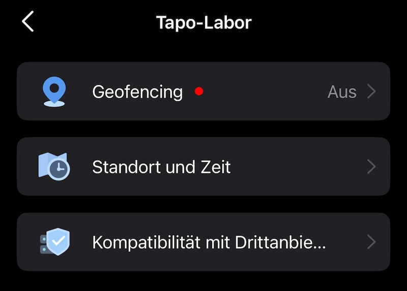
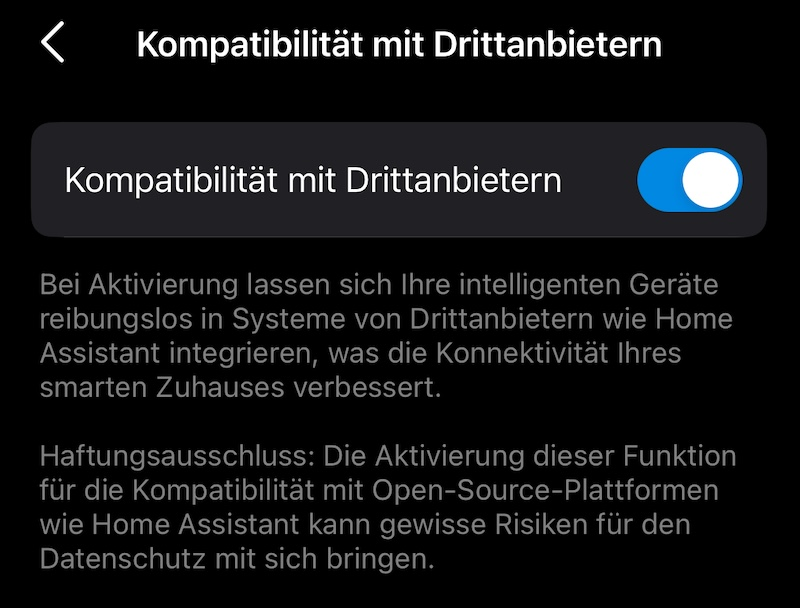

# ioBroker.tapo

## tapo-Adapter für ioBroker

Adapter für TP-Link Tapo

basiert auf <https://github.com/apatsufas/homebridge-tapo-p100>

## Anmeldeablauf

Die Tapo-Mail und das Passwort eingeben. Es werden die Geräte über die Cloud abgerufen, aber lokal gesteuert. Wenn die IP nicht gefunden wird, muss sie manuell unter tapo.0.id.ip gesetzt werden.

## Status-Werte (eingehend)

Alle Geräte werden regelmäßig abgefragt. Die Werte werden automatisch unterschritten`tapo.0.id.*` angelegt.

### Alle Geraete

Beispiel:`tapo.0.80A5897B21C7.nickname` ,`tapo.0.80A5897B21C7.device_on`

| Wert            | Typ             | Beschreibung               |
| --------------- | --------------- | -------------------------- |
| Spitzname       | Zeichenkette    | Geraetename                |
| Geräte-ID       | Zeichenkette    | Geraete-ID                 |
| Modell          | Zeichenkette    | Modellbezeichnung          |
| fw\_ver         | Zeichenkette    | Firmware-Version           |
| Hardwareversion | Zeichenkette    | Hardwareversion            |
| Mac             | Zeichenkette    | MAC-Adresse                |
| Gerät\_ein      | boolescher Wert | Geraet ein/aus             |
| pünktlich       | Nummer          | Einschaltdauer in Sekunden |
| RSSI            | Nummer          | WLAN-Signalsteerke         |
| Signalpegel     | Nummer          | Signalstaerke (1-3)        |
| ssid            | Zeichenkette    | WLAN-Name                  |
| IP-Adresse      | Zeichenkette    | IP-Adresse                 |
| überhitzt       | boolescher Wert | Überhitzungsstatus         |

### Lampen (zusaetzlich)

Beispiel:`tapo.0.80A5897B21C7.brightness` ,`tapo.0.80A5897B21C7.hue`

| Wert           | Typ    | Beschreibung                     |
| -------------- | ------ | -------------------------------- |
| Helligkeit     | Nummer | Helligkeit (0-100)               |
| Farbtemperatur | Nummer | Farbtemperatur in Kelvin         |
| Farbton        | Nummer | Farbton (0-360, nur L530/L630)   |
| Sättigung      | Nummer | Sättigung (0-100, nur L530/L630) |

### P110/P115 Energiedaten (zusätzlich)

Beispiel:`tapo.0.80A5897B21C7.current_power` ,`tapo.0.80A5897B21C7.voltage_mv`

| Wert                | Typ    | Beschreibung                     |
| ------------------- | ------ | -------------------------------- |
| aktuelle Leistung   | Nummer | Aktuelle Leistung (mW)           |
| heutige\_Energie    | Nummer | Energieverbrauch heute (Wh)      |
| Monatsenergie       | Nummer | Verbrauch Monat (Wh)             |
| Spannung\_mV        | Nummer | Spannung (mV)                    |
| current\_ma         | Nummer | Strom (mA)                       |
| Leistung\_mw        | Nummer | Leistung (mW)                    |
| aktueller Verbrauch | Nummer | Aktuelle Leistung (W, berechnet) |
| Gesamtverbrauch     | Nummer | Energie heute (kWh, berechnet)   |

### Hub-Sensoren (Child Devices)

Beispiel:`tapo.0.80A5897B21C7.child_SENSOR_ID.current_temp`

| Sensor                   | Werte                                                                    | Beschreibung                    |
| ------------------------ | ------------------------------------------------------------------------ | ------------------------------- |
| T100 (Bewegung)          | erkannt                                                                  | Bewegung erkannt                |
| T110 (Kontakt)           | offen                                                                    | Tür/Fenster offen               |
| T300 (Wasserleck)        | Wasserleckstatus, Alarm ausgelöst                                        | Wasserleck-Status               |
| T310/T315 (Temp/Feuchte) | aktuelle\_Temperatur, aktuelle\_Luftfeuchtigkeit, Temperatureinheit      | Temperatur und Luftfeuchtigkeit |
| KE100 (Thermostat)       | Zieltemperatur, aktuelle Temperatur, Frostschutz aktiviert, trv-Zustände | Thermostatstatus                |

Alle Sensoren werden zuverlässig geliefert`battery_percentage` ,`at_low_battery` und`signal_level` Die

### Kamera-Status

Beispiel:`tapo.0.80A5897B21C7.alarm` ,`tapo.0.80A5897B21C7.personDetection`

| Wert                   | Typ             | Beschreibung                                    |
| ---------------------- | --------------- | ----------------------------------------------- |
| Alarm                  | boolescher Wert | Alarm aktiv                                     |
| Augen                  | boolescher Wert | Privacy-Modus (invertiert: true = Kamera sieht) |
| Benachrichtigungen     | boolescher Wert | Push-Benachrichtigungen aktiv                   |
| Bewegungserkennung     | boolescher Wert | Bewegungserkennung aktiv                        |
| geführt                | boolescher Wert | LED aktiv                                       |
| Autotrack              | boolescher Wert | Auto-Tracking aktiv                             |
| Personenerkennung      | boolescher Wert | Personenerkennung aktiv                         |
| Fahrzeugerkennung      | boolescher Wert | Fahrzeugerkennung aktiv                         |
| Haustiererkennung      | boolescher Wert | Tiererkennung aktiv                             |
| Babyschreierkennung    | boolescher Wert | Baby-Schrei-Erkennung aktiv                     |
| Bellerkennung          | boolescher Wert | Bellen-Erkennung aktiv                          |
| Miauenerkennung        | boolescher Wert | Miauen-Erkennung aktiv                          |
| Glasbrucherkennung     | boolescher Wert | Glasbruch-Erkennung aktiv                       |
| Manipulationserkennung | boolescher Wert | Manipulations-Erkennung aktiv                   |
| Bildumdrehen           | boolescher Wert | Bild vertikal gespiegelt                        |
| ldc                    | boolescher Wert | Linsenverzerrungskorrektur aktiv                |
| Audio aufnehmen        | boolescher Wert | Audio-Aufnahme aktiv                            |
| automatisches Upgrade  | boolescher Wert | Automatische Firmware-Aktualisierung aktiviert  |

Nicht jedes Gerät liefert alle Werte. Felder die das Gerät nicht unterstützt werden nicht angelegt.

### Kamera-Erkennungsereignisse

Beispiel:`tapo.0.80A5897B21C7.detection.active` ,`tapo.0.80A5897B21C7.detection.events.0.alarm_type`

Die Kamera wird lokal gepollt und liefert Erkennungs-Events (Bewegung, Personen, etc.). Die letzten 10 Events werden abgerufen (`searchDetectionList` ), neuestes Event zuerst.

| Wert                           | Typ             | Beschreibung                                    |
| ------------------------------ | --------------- | ----------------------------------------------- |
| Erkennung aktiv                | boolescher Wert | wahr, wenn Erkennung in den letzten 30 Sekunden |
| detection.eventCount           | Nummer          | Anzahl Ereignisse in den letzten 10 Minuten     |
| detection.events.0.start\_time | Nummer          | Unix-Zeitstempel Start des neuesten Events      |
| detection.events.0.end\_time   | Nummer          | Unix-Timestamp Ende des neuesten Events         |
| detection.events.0.alarm\_type | Nummer          | Erkennungstyp (siehe Tabelle unten)             |
| detection.events.1.start\_time | Nummer          | Zweitneuestes Event (usw. bis 9)                |
| Bewegungsereignis              | boolescher Wert | ONVIF Echtzeit-Bewegungserkennung               |

#### Alarmtyp-Werte

| AUSWEIS | Beschreibung                       |
| ------- | ---------------------------------- |
| 2       | Bewegung (motion)                  |
| 3       | Manipulation (Störung)             |
| 4       | Linienüberquerung                  |
| 5       | Bereichsintrusion (area intrusion) |
| 6       | Person (Mensch)                    |
| 7       | Baby-Schrei (Babyschrei)           |
| 8       | Fahrzeug (vehicle)                 |
| 9       | Tier (Haustier)                    |
| 11      | Bellen (Rinde)                     |
| 12      | Miauen (miau)                      |
| 13      | Glasbruch                          |
| 14      | Rauch (Rauch)                      |
| 15      | Paket abgelegt                     |
| 16      | Paket abgeholt                     |
| 20      | Gesichtserkennung                  |
| 32      | Herumlungern (herumlungern)        |

Nicht jede Kamera liefert alle Typen. Die verfügbaren Werte hängen von Modell und Firmware ab.

### Alarmkonfiguration

Beispiel:`tapo.0.80A5897B21C7.alarmInfo.enabled` ,`tapo.0.80A5897B21C7.alarmInfo.alarm_volume`

| Wert                            | Typ          | Beschreibung                |
| ------------------------------- | ------------ | --------------------------- |
| alarmInfo.enabled               | Zeichenkette | Alarm aktiv (ein/aus)       |
| alarmInfo.alarm\_mode           | gemischt     | Alarmmodus (zB-Ton, Licht)  |
| alarmInfo.alarm\_volume         | Zeichenkette | Lautstaerke                 |
| alarmInfo.alarm\_duration       | Zeichenkette | Dauer in Sekunden           |
| alarmInfo.alarm\_type           | Zeichenkette | Sirenen-Typ                 |
| alarmInfo.light\_type           | Zeichenkette | Licht-Typ                   |
| alarmInfo.light\_alarm\_enabled | Zeichenkette | Licht-Alarm aktiv (ein/aus) |
| alarmInfo.sound\_alarm\_enabled | Zeichenkette | Tonalarm aktiv (ein/aus)    |

### Alarm-Event-Typen (welche Erkennungen lösen Alarm aus)

Beispiel:`tapo.0.80A5897B21C7.alertEventTypes.motion` ,`tapo.0.80A5897B21C7.alertEventTypes.person`

| Wert                    | Typ             | Beschreibung       |
| ----------------------- | --------------- | ------------------ |
| alertEventTypes.motion  | boolescher Wert | Alarm bei Bewegung |
| alertEventTypes.person  | boolescher Wert | Alarm bei Person   |
| alertEventTypes.vehicle | boolescher Wert | Alarm bei Fahrzeug |
| alertEventTypes.pet     | boolescher Wert | Alarm bei Tier     |

### Röhren einrichten

Für Benachrichtigungen bei Erkennung ein ioBroker-Skript auf`detection.events.0.start_time` Auslöser:

```javascript
const alarmTypen = {
  2: "Bewegung",
  3: "Manipulation",
  4: "Linienueberquerung",
  5: "Bereichsintrusion",
  6: "Person",
  7: "Baby-Schrei",
  8: "Fahrzeug",
  9: "Tier",
  11: "Bellen",
  12: "Miauen",
  13: "Glasbruch",
  14: "Rauch",
  15: "Paket abgelegt",
  16: "Paket abgeholt",
  20: "Gesicht",
  32: "Herumlungern",
};

on({ id: "tapo.0.DEVICE_ID.detection.events.0.start_time", change: "ne" }, (obj) => {
  const typ = getState("tapo.0.DEVICE_ID.detection.events.0.alarm_type").val;
  sendTo("telegram.0", {
    text: (alarmTypen[typ] || "Typ " + typ) + " um " + new Date(obj.state.val * 1000).toLocaleString(),
  });
});
```

Blockly-Beispiel (als XML importierbar):

```xml
<xml xmlns="https://developers.google.com/blockly/xml">
  <block type="on_ext" x="38" y="13">
    <mutation xmlns="http://www.w3.org/1999/xhtml" items="1"></mutation>
    <field name="CONDITION">ne</field>
    <field name="ACK_CONDITION"></field>
    <value name="OID0">
      <shadow type="field_oid">
        <field name="oid">tapo.0.DEVICE_ID.detection.events.0.start_time</field>
      </shadow>
    </value>
    <statement name="STATEMENT">
      <block type="telegram">
        <field name="INSTANCE">.0</field>
        <field name="LOG"></field>
        <value name="MESSAGE">
          <block type="text_join">
            <mutation items="3"></mutation>
            <value name="ADD0">
              <block type="text">
                <field name="TEXT">Tapo Erkennung: Typ </field>
              </block>
            </value>
            <value name="ADD1">
              <block type="get_value">
                <field name="ATTR">val</field>
                <field name="OID">tapo.0.DEVICE_ID.detection.events.0.alarm_type</field>
              </block>
            </value>
            <value name="ADD2">
              <block type="text">
                <field name="TEXT"> erkannt</field>
              </block>
            </value>
          </block>
        </value>
      </block>
    </statement>
  </block>
</xml>
```

Das Polling-Intervall ist in den Adaptereinstellungen konfigurierbar (Standard: 10 Sekunden). Alles lokal, kein Cloud-Zugriff noetig.

## Steuern

tapo.0.id.remote auf true/false setzen steuert den jeweiligen Befehl. Der Befehl wird lokal an das Gerät gesendet.

### Stecker / Schalter (P100, P110, P115, ...)

| Fernbedienung               | Typ             | Beschreibung                                               |
| --------------------------- | --------------- | ---------------------------------------------------------- |
| Aktualisieren               | boolescher Wert | Manueller Status-Refresh                                   |
| setPowerState               | boolescher Wert | Ein/Aus                                                    |
| setPowerStateChild          | Zeichenkette    | Kindersicherung steuern:`childId,true` Oder`childId,false` |
| setLEDEnabled               | boolescher Wert | LED-Indikator ein/aus                                      |
| setAutoOff                  | boolescher Wert | Auto-Off Timer ein/aus                                     |
| setAutoOffDelay             | Nummer          | Auto-Off-Verzögerung in Minuten                            |
| setChildProtection          | boolescher Wert | Tastensperre ein/aus                                       |
| setPowerProtection          | boolescher Wert | Überlastschutz ein/aus                                     |
| setPowerProtectionThreshold | Nummer          | Überlast-Schwellwert in Watt                               |
| setAutoUpdate               | boolescher Wert | Firmware Auto-Update ein/aus                               |

P110/P115 liefern zusätzlich Energiedaten (Leistung, Spannung, Strom).

### Lampen (L510E, L520E, L530, L630, L900, L920, ...)

Alle Plug-Remotes plus:

| Fernbedienung            | Typ             | Beschreibung                   |
| ------------------------ | --------------- | ------------------------------ |
| Helligkeit einstellen    | Nummer          | Helligkeit setzen              |
| Farbtemperatur festlegen | Nummer          | Farbtemperatur (2500-6500K)    |
| Farbe setzen             | Zeichenkette    | Farbe setzen:`hue, saturation` |
| Lichteffekt setzen       | Zeichenkette    | Lichteffekt ID oder`off`       |
| setGradualOnOff          | boolescher Wert | Sanftes Ein-/Ausschalten       |

### Fans (F1xx)

| Fernbedienung                    | Typ             | Beschreibung                  |
| -------------------------------- | --------------- | ----------------------------- |
| Lüftergeschwindigkeit einstellen | Nummer          | Geschwindigkeit 0-4 (0 = aus) |
| Lüfterschlafmodus einstellen     | boolescher Wert | Schlafmodus ein/aus           |

### Hub (H100, H200)

| Fernbedienung              | Typ             | Beschreibung                               |
| -------------------------- | --------------- | ------------------------------------------ |
| Wecker spielen             | boolescher Wert | Alarm abspielen                            |
| Alarm stoppen              | boolescher Wert | Alarm gestoppt                             |
| Alarmlautstärke einstellen | Zeichenkette    | Alarmlautstärke: stumm/niedrig/normal/hoch |
| setAlarmDauer              | Nummer          | Alarmdauer in Sekunden                     |

### Thermostat / TRV (KE100)

| Fernbedienung            | Typ             | Beschreibung                   |
| ------------------------ | --------------- | ------------------------------ |
| setZieltemperature       | Nummer          | Zieltemperatur setzen          |
| Temperaturversatz setzen | Nummer          | Temperatur-Offset (-10 bis 10) |
| Frostschutz einstellen   | boolescher Wert | Frostschutz ein/aus            |

### Hub-Sensoren (T100, T110, T300, T310, T315)

Sensordaten (Temperatur, Luftfeuchtigkeit, Bewegung, Kontakt, Wasserleck) werden automatisch über`getChildDeviceList` abgerufen und als Status angezeigt.

### Kameras (C200, C310, C520, TC70, ...)

| Fernbedienung                                | Typ             | Beschreibung                                  |
| -------------------------------------------- | --------------- | --------------------------------------------- |
| Aktualisieren                                | boolescher Wert | Manueller Status-Refresh                      |
| setAlertConfig                               | boolescher Wert | Alarm ein/aus                                 |
| setLensMaskConfig                            | boolescher Wert | Privacy (Eyes) ein/aus                        |
| setForceWhitelampState                       | boolescher Wert | Weisslicht ein/aus                            |
| setLedStatus                                 | boolescher Wert | LED ein/aus                                   |
| setMsgPushConfig                             | boolescher Wert | Benachrichtigungen ein/aus                    |
| setDetectionConfig                           | boolescher Wert | Bewegungserkennung ein/aus                    |
| setAutoTrackTarget                           | boolescher Wert | Auto-Tracking ein/aus                         |
| Personenerkennung setzen                     | boolescher Wert | Personenerkennung ein/aus                     |
| Fahrzeugerkennung einstellen                 | boolescher Wert | Fahrzeugerkennung ein/aus                     |
| Haustiererkennung einrichten                 | boolescher Wert | Tiererkennung ein/aus                         |
| Babyweinerkennung einstellen                 | boolescher Wert | Baby-Schrei-Erkennung ein/aus                 |
| Bellerkennung einstellen                     | boolescher Wert | Bellen-Erkennung ein/aus                      |
| setMeowDetection                             | boolescher Wert | Miauen-Erkennung ein/aus                      |
| setGlassBreakDetection                       | boolescher Wert | Glasbruch-Erkennung ein/aus                   |
| Manipulationserkennung einstellen            | boolescher Wert | Manipulations-Erkennung ein/aus               |
| setImageFlipVertical                         | boolescher Wert | Bild vertikal spiegeln                        |
| setLensDistortionCorrection                  | boolescher Wert | Linsenverzerrungskorrektur ein/aus            |
| setRecordAudio                               | boolescher Wert | Audio aufnehmen ein/aus                       |
| setAutoUpgrade                               | boolescher Wert | Firmware Auto-Update ein/aus                  |
| setHDR                                       | boolescher Wert | HDR ein/aus                                   |
| setCoverConfig                               | boolescher Wert | Datenschutzzonen ein/aus                      |
| setRecordPlan                                | boolescher Wert | SD-Karten Aufnahme ein/aus                    |
| Motor bewegen                                | Zeichenkette    | Kamera bewegen:`x, y` (-360..360, -45..45)    |
| moveMotorStep                                | Zeichenkette    | Schrittwinkel (0-360)                         |
| moveToPreset                                 | Zeichenkette    | Zu Preset fahren (ID)                         |
| Motor kalibrieren                            | boolescher Wert | Motor kalibrieren                             |
| Voreinstellung speichern                     | Zeichenkette    | Voreinstellung speichern (Name)               |
| Voreinstellung löschen                       | Zeichenkette    | Voreinstellung Loeschen (ID)                  |
| setCruise                                    | Zeichenkette    | Patrouille: x/y/aus                           |
| manuellen Alarm starten                      | boolescher Wert | Manuellen Alarm starten                       |
| manuellen Alarm stoppen                      | boolescher Wert | Manueller Alarm stoppen                       |
| Alarmmodus setzen                            | Zeichenkette    | Alarmmodus: beides/Licht/Ton/aus              |
| Tag-Nacht-Modus einstellen                   | Zeichenkette    | Tag-/Nacht-Modus: Auto/Ein/Aus                |
| setLightFrequencyMode                        | Zeichenkette    | Lichtfrequenz: auto/50/60                     |
| Lautsprecherlautstärke einstellen            | Nummer          | Lautsprecher-Lautstärke (0-100)               |
| Mikrofonlautstärke einstellen                | Nummer          | Mikrofon-Lautstärke (0-100)                   |
| Bewegungserkennungsempfindlichkeit festlegen | Zeichenkette    | Bewegungsempfindlichkeit: hoch/normal/niedrig |
| setPersonDetectionSensitivity                | Zeichenkette    | Personen-Sensibilität: hoch/normal/niedrig    |
| setOsd                                       | Zeichenkette    | OSD-Beschreibungstext                         |
| Neustart                                     | boolescher Wert | Kamera neustarten                             |
| formatSDCard                                 | boolescher Wert | SD-Karte formatieren                          |

Nicht jede Kamera unterstützt alle Funktionen. Nicht unterstütze Befehle werden mit einer Fehlermeldung im Log quittiert.

## Kamerasteuerung aktivieren



## Diskussion und Fragen

<https://forum.iobroker.net/topic/57336/test-adapter-tp-link-tapo/>

## Changelog
### 0.6.12 (2026-08-11)

- Fix intermittent "Expected double-quoted property name in JSON" on KLAP/TPAP devices: requests per device are now serialized, so rapid commands (or a poll racing a command) no longer corrupt the AES sequence counter and garble the decrypted response

### 0.6.11 (2026-08-11)

- Fix: L530 name variants (e.g. "L530 Series", hw 1.0) are now detected as color bulbs, so `setColor`/`setColorTemp` are available (match by prefix instead of exact "L530")

### 0.6.10 (2026-08-11)

- Fix `setColorTemp` for L530/L530E: send the value directly in Kelvin (it was wrongly converted from mired, e.g. 6000 became 2500) and send only `color_temp` (no hue/saturation), which made the lamp briefly apply the temperature and then revert to a warm hue

### 0.6.9 (2026-08-11)

- Publish the configured PTZ presets as a state (`presets`: id -> name), refreshed after save/delete, so you can see which names/ids `moveToPreset` accepts

### 0.6.8 (2026-08-11)

- PTZ move-to-preset now accepts the preset name (not just the numeric id) and reports success correctly
- Camera connect/reconnect log messages now show the IP instead of `undefined`

### 0.6.7 (2026-08-11)

- Doorbell ring now also works for hub-paired battery doorbells (e.g. D210 + H200): the ring UDP packet (port 20005) is sent from the hub IP, so any packet on the doorbell port now triggers the `ringEvent` (matches Home Assistant)

### 0.6.6 (2026-08-11)

- Fix: an unreachable camera/doorbell (ONVIF/EHOSTUNREACH) no longer aborts init, so the `ringEvent` state and doorbell UDP listener are set up even for battery/hub-paired doorbells (D210)

### 0.6.5 (2026-08-11)

- Log all incoming doorbell UDP (port 20005) packets at debug level to help diagnose hub-paired doorbells (e.g. D210 + H200)

### 0.6.4 (2026-08-11)

- Camera ONVIF port (2020) unreachable is now an info hint, not an error (EHOSTUNREACH/ETIMEDOUT)
- Capture onvif socket errors so they no longer surface as uncaught errors

### 0.6.3 (2026-08-10)

- Camera line crossing detection (on/off toggle + status), ported from python-kasa
- List dynamic light effects (`getLightEffects`) for L530/L630
- Battery status exposed for battery-powered cameras via device info

### 0.6.2 (2026-08-10)

- Fix camera PTZ move-to-preset (the request was missing the `preset` wrapper)
- Support for Tapo smart chime D100C (play/stop chime, volume, ring type) - uses the plug/TPAP protocol

### 0.6.1 (2026-08-09)

- Support for Tapo video doorbells (D-series, e.g. D235) - initialized as camera devices
- Fetch SMART.TAPODOORBELL / SMART.TAPOCHIME device types from the cloud (doorbells were missing from the device list)
- Also fetch SMART.TAPOLOCK / SMART.TAPOROBOVAC / SMART.TAPONVR device types
- Doorbell ring event (`ringEvent` state) via UDP broadcast (port 20005) and alarm polling fallback

### 0.6.0 (2026-07-30)

- Fix camera login for newer firmware (FW 1.4.3+, e.g. C200 1.4.4)
- Use the Camera Account credentials (Stream Username/Password) for local camera login
- Try camera default credentials (admin, LV3 built-in) when the password is rejected
- TPAP/SPAKE2+ fallback for cameras that no longer use the stok login
- Stop amplifying device lockouts: no repeated login attempts while a camera is suspended
- Actionable, rate-limited camera log messages (Camera Account / Third-Party Compatibility hints)

### 0.5.5 (2026-05-25)

- added udp detection for better device detection

### 0.5.4 (2026-04-02)

- Support for TPAP/SPAKE2+ protocol (P100 FW 1.4.3+ and newer devices)
- Support for KLAP v1 (md5) handshake
- Fix camera connection for firmware 1.9.1+ (C310 etc.)
- 30+ new camera remotes (detection, motor, alarm, cruise, presets, image/audio, OSD)
- New data points for camera status and detection events
- New remotes for plugs, lamps, fans, hubs and thermostats
- Device-specific remotes (only relevant controls per device type)
- Energy data (voltage, current) for P110/P115
- Automatic reconnect for devices that go offline and come back
- Less log spam for unreachable devices

### 0.4.8 (2025-02-04)

- disable sentry to prevent crashes

### 0.4.7 (2025-01-14)

- disable battery devices
- improved wrong formatted mail adresses

### 0.4.6 (2025-01-10)

- add checks for battery devices

### 0.4.5 (2024-12-16)

- fix camera remotes

### 0.4.4 (2024-12-12)

- improve handshake if e-mail is not entered in lowercase

### 0.4.3 (2024-12-09)

- fix handshake for device with HW v1.20

### 0.4.1 (2024-11-29)

- fixed Get Device Info failed error

### 0.3.4 (2024-11-10)

- update Tapo local lib

### 0.3.3 (2024-06-17)

- ignore ssl legacy error
-

### 0.3.2 (2024-05-27)

update onvif lib to fix issues with newer cameras

### 0.2.9 (2024-01-30)

- fix tapo Plugs and setLensMask

### 0.0.2

- (TA2k) initial release

## License

MIT License

Copyright (c) 2024-2030 TA2k <tombox2020@gmail.com>

Permission is hereby granted, free of charge, to any person obtaining a copy
of this software and associated documentation files (the "Software"), to deal
in the Software without restriction, including without limitation the rights
to use, copy, modify, merge, publish, distribute, sublicense, and/or sell
copies of the Software, and to permit persons to whom the Software is
furnished to do so, subject to the following conditions:

The above copyright notice and this permission notice shall be included in all
copies or substantial portions of the Software.

THE SOFTWARE IS PROVIDED "AS IS", WITHOUT WARRANTY OF ANY KIND, EXPRESS OR
IMPLIED, INCLUDING BUT NOT LIMITED TO THE WARRANTIES OF MERCHANTABILITY,
FITNESS FOR A PARTICULAR PURPOSE AND NONINFRINGEMENT. IN NO EVENT SHALL THE
AUTHORS OR COPYRIGHT HOLDERS BE LIABLE FOR ANY CLAIM, DAMAGES OR OTHER
LIABILITY, WHETHER IN AN ACTION OF CONTRACT, TORT OR OTHERWISE, ARISING FROM,
OUT OF OR IN CONNECTION WITH THE SOFTWARE OR THE USE OR OTHER DEALINGS IN THE
SOFTWARE.