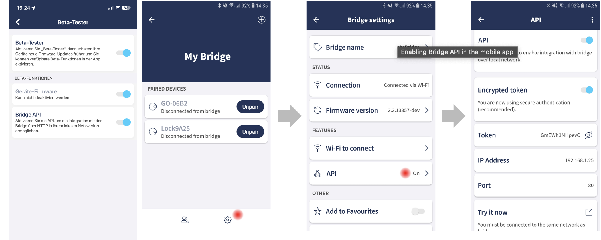

# ioBroker.tedee

**Dieser Adapter nutzt die Sentry-Bibliotheken, um Ausnahmen und Codefehler automatisch an die Entwickler zu melden.** Weitere Details und Informationen zum Deaktivieren der Fehlerberichterstattung finden Sie in [der Sentry-Plugin-Dokumentation](https://github.com/ioBroker/plugin-sentry#plugin-sentry) ! Die Sentry-Berichterstattung wird ab js-controller 3.0 verwendet.

## tedee-Adapter für ioBroker

Adapter für Tedee-Schlösser

Dieser Adapter verwendet die lokale Bridge-API zur Steuerung eines Tedee-Schlosses.

Alle Schließsysteme von Tedee werden unterstützt.

1. Aktivieren Sie den Betatest in Ihrem Benutzerprofil
2. Aktivieren Sie die API in den Bridge-Einstellungen.
3. Kopieren Sie die IP-Adresse und das Token in die Instanzeinstellungen.

Der Adapter empfängt alle Statusaktualisierungen umgehend über Webhooks. Das in den Einstellungen festgelegte Intervall dient lediglich als Backup für kontinuierliche Aktualisierungen.

Aktueller Status einer Sperre: tedee.0.id.state

- 0 Nicht kalibriert
- 1\. Kalibrierung
- 2 freigeschaltet
- 3 Halbverriegelt
- 4 Entsperren
- 5 Verriegelung
- 6 gesperrt
- 7 gezogen
- 8 Ziehen
- 9 Unbekannt
- 18 Aktualisierung

## Verwendung

Sie können das tedee-Schloss über tedee.0.id.remote steuern.

- Sperren zum Sperren/Entsperren
- Ziehen zum Ziehen
- Entsperren

Freischaltmodi:

- 0 – (oder kein Parameter eingestellt) – Normal. Aus der geschlossenen Position: Nur entriegeln oder, falls aktiviert, mit automatischer Entriegelung. Aus der geöffneten Position: Keine Aktion.
- 2 - Kraft. Führe die Bewegung mit Gewalt aus, bis die Verriegelung auf Widerstand stößt.
- 3 – Ohne Ziehen. Aus der geschlossenen Position: Nur entriegeln, ohne automatisches Ziehen. Aus der geöffneten Position: Nichts.
- 4 – Entriegeln oder Ziehen. Aus der geschlossenen Position: Nur entriegeln oder, falls aktiviert, mit automatischer Entriegelung. Aus der geöffneten Position: Ziehen.

## Haftungsausschluss

Tedee ist eine Marke von tedee. Ich stehe in keiner Verbindung zu tedee oder deren Tochtergesellschaften, Logos oder Marken und werde von diesen auch nicht unterstützt.

## Changelog

<!--
    Placeholder for the next version (at the beginning of the line):
    ### **WORK IN PROGRESS**
-->
### 0.3.2 (2024-04-10)

- add retry when request fails

### 0.3.1 (2023-12-16)

- (TA2k) initial release

## License

MIT License

Copyright (c) 2024-2025 TA2k <tombox2020@gmail.com>

Permission is hereby granted, free of charge, to any person obtaining a copy
of this software and associated documentation files (the "Software"), to deal
in the Software without restriction, including without limitation the rights
to use, copy, modify, merge, publish, distribute, sublicense, and/or sell
copies of the Software, and to permit persons to whom the Software is
furnished to do so, subject to the following conditions:

The above copyright notice and this permission notice shall be included in all
copies or substantial portions of the Software.

THE SOFTWARE IS PROVIDED "AS IS", WITHOUT WARRANTY OF ANY KIND, EXPRESS OR
IMPLIED, INCLUDING BUT NOT LIMITED TO THE WARRANTIES OF MERCHANTABILITY,
FITNESS FOR A PARTICULAR PURPOSE AND NONINFRINGEMENT. IN NO EVENT SHALL THE
AUTHORS OR COPYRIGHT HOLDERS BE LIABLE FOR ANY CLAIM, DAMAGES OR OTHER
LIABILITY, WHETHER IN AN ACTION OF CONTRACT, TORT OR OTHERWISE, ARISING FROM,
OUT OF OR IN CONNECTION WITH THE SOFTWARE OR THE USE OR OTHER DEALINGS IN THE
SOFTWARE.