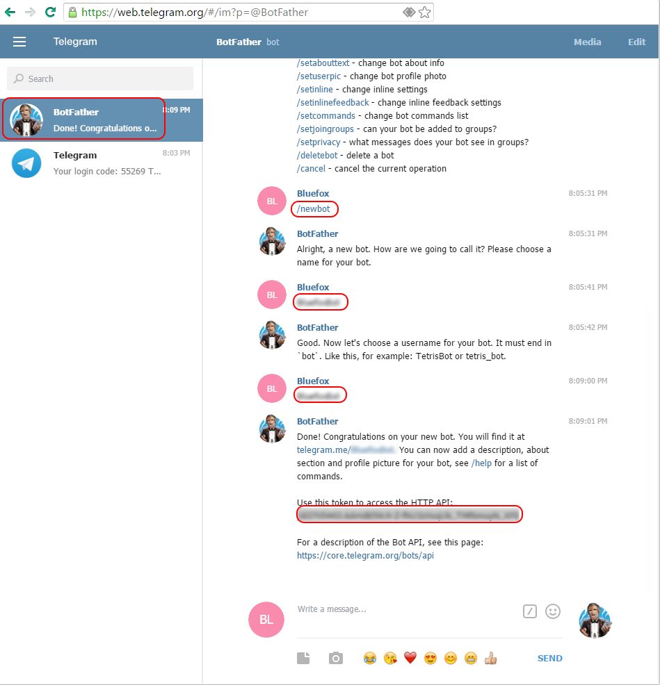

# IoBroker.telegram
## Konfiguration
Bitten Sie [@BotFather](https://telegram.me/botfather), einen neuen Bot `/newbot` zu erstellen.

Sie werden aufgefordert, den Namen des Bots und anschließend den Benutzernamen einzugeben.
Danach erhalten Sie das Token.



Sie sollten das Kommunikationspasswort im Konfigurationsdialog festlegen. Starten Sie anschließend den Adapter.

Um eine Konversation mit Ihrem Bot zu starten, müssen Sie sich mit `/password phrase` authentifizieren, wobei **`phrase`** Ihr konfiguriertes Passwort ist. Öffnen Sie also eine neue Konversation mit Ihrem generierten Bot in Telegram und geben Sie dann das Passwort als ersten Befehl ein.

**Hinweis:** Sie können die Kurzform `/p phrase` verwenden.

Um ein schönes Avatarbild hinzuzufügen, gib `/setuserpic` im Chat von **BotFather** ein und lade ihm das gewünschte Bild (512x512 Pixel) hoch, zum Beispiel dieses hier: [Logo](img/logo.png).

Sie können die Nachricht über messageBox `sendTo('telegram', 'Test message')` an alle authentifizierten Benutzer oder über messageBox `sendTo('telegram', '@userName Test message')` an einen bestimmten Benutzer senden.
Der Benutzer muss zuvor authentifiziert werden.

Sie können einen Benutzer auch auf diese Weise angeben:

```javascript
sendTo('telegram', {user: 'UserName', text: 'Test message'}, function (res) {
    console.log('Sent to ' + res + ' users');
});
```

Wenn Sie das obige Beispiel verwenden, beachten Sie bitte, dass Sie „UserName“ entweder durch den Vornamen oder den öffentlichen Telegram-Benutzernamen des Empfängers ersetzen müssen. (Dies hängt davon ab, ob die Option „Benutzernamen statt Vornamen speichern“ in den Adaptereinstellungen aktiviert ist.) Ist diese Option aktiviert und der Benutzer hat in seinem Telegram-Konto keinen öffentlichen Benutzernamen angegeben, verwendet der Adapter weiterhin den Vornamen. Beachten Sie, dass der gespeicherte Vorname beim nächsten Senden einer Nachricht an den Bot durch den Benutzernamen ersetzt wird, sobald der Benutzer einen öffentlichen Benutzernamen festlegt (nach der Authentifizierung bei Ihrem Bot).

Es können mehrere Empfänger angegeben werden (trennen Sie die Benutzernamen einfach durch Kommas).
Beispiel: Empfänger: „User1,User4,User5“

Sie können auch eine Nachricht über den Status senden, indem Sie einfach den Status *"telegram.INSTANCE.communicate.response"* mit dem Wert *"@userName Testnachricht"* oder mit einem JSON-Objekt festlegen:

```json
{
    "text": "Test message"
}
```

Die JSON-Syntax erlaubt auch das Hinzufügen von Optionen aus [Telegram-Bots-API](https://core.telegram.org/bots/api) sowie das Festlegen des Benutzers oder der Chat-ID:

```json
{
    "text": "Test message, but with *bold*",
    "parse_mode": "Markdown",
    "chatId": "1234567890",
    "user": "UserName"
}
```

Sie können `parse_mode` auch im Text festlegen:

```
sendTo('telegram', {user: 'UserName', text: '<MarkdownV2>Test message, but with *bold*</MarkdownV2>'}, function (res) {
   console.log('Sent to ' + res + ' users');
});
```

oder

```
setState('telegram.0.communicate.response', '<MarkdownV2>Test message, but with *bold*</MarkdownV2>');
```

Um Nachrichten an Gruppen zu senden, müssen Sie den Bot zu der gewünschten Gruppe einladen. Durch Hinzufügen des Parameters `chat_id` zur JSON-Nachrichtennutzlast können Sie Nachrichten an diese Gruppen senden.

Um die Chat-ID `chat_id` zu ermitteln, müssen Sie den Protokollierungsgrad des Adapters auf `debug` setzen.

Anschließend können Sie Ihren Bot in den Gruppen anpingen, an die er Nachrichten senden soll.

Stellen Sie sicher, dass Sie `/` vor die Nachricht setzen, damit der Bot die Nachricht ([wenn die Bot-Privatsphäre aktiviert ist](#How-to-receive-messages-in-group-chats-using-telegram-adapter)) empfangen kann.

Die Chat-ID wird Ihnen dann im iobroker-Protokoll angezeigt.

## Verwendung
Sie können Telegram mit dem Adapter [text2command](https://github.com/ioBroker/ioBroker.text2command) verwenden. Es gibt ein vordefiniertes Kommunikationsschema, und Sie können Befehle in Textform an Ihr Zuhause senden.

Um ein Foto zu senden, senden Sie einfach einen Dateipfad anstelle von Text oder einer URL: `sendTo('telegram', 'absolute/path/file.png')` oder `sendTo('telegram', 'https://telegram.org/img/t_logo.png')`.

Beispiel, wie man einen Screenshot von der Webcam an Telegram sendet:

```javascript
function sendImage() {
    httpGet('https://raw.githubusercontent.com/ioBroker/ioBroker.javascript/master/admin/javascript.png', { responseType: 'arraybuffer' }, async (err, response) => {
        if (err) {
            console.error(err);
        } else {
            const tempFilePath = createTempFile('telegram-image.png', response.data);

            sendTo('telegram.0', 'send', {
                text: tempFilePath,
                caption: 'A wonderful adapter',
                user: 'yourUserName1,yourUserName2',
            });
        }
    });
}

on('0_userdata.0.someState', (obj) => {
    if (obj.state.val) {
        // send 4 images: immediately, in 5, 15 and 30 seconds
        sendImage();
        setTimeout(sendImage, 5000);
        setTimeout(sendImage, 15000);
        setTimeout(sendImage, 30000);
    }
});
```

Die folgenden Meldungen sind für Aktionen reserviert:

- *tippt* - für Textnachrichten,
- *upload_photo* - für Fotos,
- *upload_video* - für Videos,
- *record_video* - für Videos,
- *record_audio* - für Audioaufnahmen,
- *upload_audio* - für Audio,
- *upload_document* - für Dokumente,
- *find_location* - für Standortdaten

In diesem Fall wird der Aktionsbefehl gesendet.

Die Beschreibung der Telegram-API finden Sie unter [Hier](https://core.telegram.org/bots/api). Sie können alle in dieser API definierten Optionen nutzen, indem Sie sie einfach in das Sendeobjekt einfügen. Beispiel:

```javascript
sendTo('telegram.0', 'send', {
    text:                   '/tmp/snap.jpg',
    caption:                'Snapshot',
    disable_notification:   true
});
```

**Mögliche Optionen**:

- *disable_notification*: Sendet die Nachricht stumm. iOS-Nutzer erhalten keine Benachrichtigung, Android-Nutzer erhalten eine Benachrichtigung ohne Ton. (Alle Typen)
- *parse_mode*: Senden Sie Markdown oder HTML, wenn Telegram-Apps fett, kursiv, mit fester Breite oder eingebettete URLs in der Nachricht Ihres Bots anzeigen sollen. Mögliche Werte: "Markdown", "MarkdownV2", "HTML" (Nachricht)
- *disable_web_page_preview*: Deaktiviert die Linkvorschau für Links in dieser Nachricht (Nachricht)
- *Bildunterschrift*: Bildunterschrift für das Dokument, Foto oder Video, 0-200 Zeichen (Video, Audio, Foto, Dokument)
- *Dauer*: Dauer des gesendeten Video- oder Audiomaterials in Sekunden (Audio, Video)
- *Interpret*: Interpret der Audiodatei (Audio)
- *Titel*: Name des Titels der Audiodatei (Audio)
- *Breite*: Videobreite (Video)
- *Höhe*: Videohöhe (Video)

Der Adapter versucht, den Nachrichtentyp (Foto, Video, Audio, Dokument, Sticker, Aktion, Standort) anhand des Nachrichtentextes zu erkennen. Wenn der Text ein Pfad zu einer vorhandenen Datei ist, wird diese entsprechend dem Nachrichtentyp gesendet.

Der Standort wird anhand der Attribute Breitengrad und Längengrad ermittelt:

```javascript
sendTo('telegram.0', 'send', {
    latitude:               52.522430,
    longitude:              13.372234,
    disable_notification:   true
});
```

Der Veranstaltungsort wird anhand der Attribute Breitengrad, Längengrad, Titel und Adresse ermittelt:

```javascript
sendTo('telegram.0', 'send', {
    latitude:               52.51630462381893,
    longitude:              13.37770039691943,
    title:                  'Brandenburger Tor',
    address:                'Pariser Platz 8, 10117 Berlin',
});
```

### Explizite Nachrichtentypen
Sie haben die Möglichkeit, zusätzlich den Nachrichtentyp zu definieren, falls Sie die Daten als Puffer senden möchten.

Folgende Typen sind möglich: *Aufkleber*, *Video*, *Dokument*, *Audio*, *Foto*.

```javascript
sendTo('telegram.0', 'send', {
    text: fs.readFileSync('/opt/path/picture.png'),
    type: 'photo'
});
```

### Senden von Dateien aus dem ioBroker-Dateispeicher oder aus Zuständen (iob://-URIs)
Neben einem lokalen Dateipfad oder einer Web-URL kann `text` auch eine **ioBroker-URI** sein. Der Adapter löst die URI auf, liest den Inhalt und sendet ihn mit dem automatisch erkannten Medientyp (Foto, Video, Audio, Dokument usw.). Dies ist besonders nützlich, wenn die Datei im ioBroker-Dateispeicher hinter Redis/jsonl abgelegt ist und **nicht** im lokalen Dateisystem existiert, sodass ein einfacher Pfad nicht funktionieren würde.

Folgende Programme werden unterstützt:

- `iobfile://<adapter.instance>/<path>` — eine Datei aus dem ioBroker-Dateispeicher.
- `iobstate://<state.id>` — der Wert eines Bundesstaates (siehe unten, wie der Wert interpretiert wird).
- `iobobject://<object.id> /<path> ` — ein Wert, der in einem ioBroker-Objekt verschachtelt ist (der `Pfad` navigiert über `/` in das Objekt).

```javascript
// send a snapshot that another adapter has written into the file storage
sendTo('telegram.0', 'send', {
    user: 'UserName',
    text: 'iobfile://cameras.0/snapshots/front_door.jpg',
    caption: 'Someone is at the front door',
});

// send a file whose full path is stored in a state
sendTo('telegram.0', 'send', {
    text: 'iobstate://0_userdata.0.lastReport',
});

// take a value out of an object
sendTo('telegram.0', 'send', {
    text: 'iobobject://0_userdata.0.myObject/native/document',
});
```

Der Medientyp wird aus der Dateiendung abgeleitet (`.jpg`/`.png` → Foto, `.mp4` → Video, `.mp3`/`.ogg`/`.wav` → Audio, `.gif` → Animation, `.webp` → Sticker, `.pdf`/`.csv`/`.docx`/... → Dokument). Ist die Dateiendung unbekannt, wird der Typ aus dem gespeicherten MIME-Typ übernommen; andernfalls wird der Inhalt als Dokument gesendet. Sie können dies weiterhin explizit mit der Option `type` überschreiben.

**Wie ein Zustands-/Objektwert interpretiert wird** (`iobstate://` und `iobobject://`):

- eine **Daten-URL** (`data:image/png;base64,...`) wird dekodiert und als der entsprechende Medientyp gesendet;
- ein Wert, der selbst eine `iob*://` URI oder eine `http(s)://` URL ist, wird weiter aufgelöst (bis zu 5 Verschachtelungsebenen);
- jede andere Zeichenkette wird als Dateipfad / URL behandelt;
- Zahlen, boolesche Werte und Objekte werden als Text gesendet (Objekte werden in JSON-Strings umgewandelt).

### Tastatur
Sie können die **ReplyKeyboardMarkup**-Tastatur im Client anzeigen:

```javascript
sendTo('telegram.0', 'send', {
    text: 'Press button',
    reply_markup: {
        keyboard: [
            ['Line 1, Button 1', 'Line 1, Button 2'],
            ['Line 2, Button 3', 'Line 2, Button 4']
        ],
        resize_keyboard:   true,
        one_time_keyboard: true
    }
});
```

Sie können mehr dazu in [hier](https://core.telegram.org/bots/api#replykeyboardmarkup) und [hier]](https://core.telegram.org/bots#keyboards) lesen.

Sie können die **InlineKeyboardMarkup**-Tastatur im Client anzeigen:

```javascript
sendTo('telegram', 'send', {
    user: 'my_username;username2', // optional. Separator could be ";" or "," or space
    text: 'Click the button',
    reply_markup: {
        inline_keyboard: [
            [{ text: 'Button 1_1', callback_data: '1_1' }],
            [{ text: 'Button 1_2', callback_data: '1_2' }]
        ]
    }
});
```

Sie können mehr dazu in [hier](https://core.telegram.org/bots/api#inlinekeyboardmarkup) und [hier]](https://core.telegram.org/bots#inline-keyboards-and-on-the-fly-updating) lesen.

**HINWEIS:** *Nachdem der Nutzer eine Rückruftaste gedrückt hat, zeigen Telegram-Clients einen Fortschrittsbalken an, bis Sie `answerCallbackQuery` aufrufen. Daher ist es notwendig, mit dem Aufruf von `answerCallbackQuery` zu reagieren, selbst wenn keine Benachrichtigung an den Nutzer erforderlich ist (z. B. ohne Angabe optionaler Parameter).*

### AnswerCallbackQuery
Mit dieser Methode können Sie Antworten auf Rückrufanfragen senden, die über die Inline-Tastatur gestellt werden. Die Antwort wird dem Benutzer als Benachrichtigung am oberen Rand des Chatfensters oder als Warnmeldung angezeigt. Im Erfolgsfall wird *True* zurückgegeben.

```javascript
if (command === '1_2') {
    sendTo('telegram', 'send', {
     user: 'my_username username2', // optional. Separator could be ";" or "," or space
        answerCallbackQuery: {
            text: 'Pressed!',
            showAlert: false, // Optional parameter
        },
   });
}
```

Sie können mehr dazu in [Hier](https://github.com/yagop/node-telegram-bot-api/blob/release/doc/api.md#telegrambotanswercallbackquerycallbackqueryid-text-showalert-options--promise) lesen.

### Frage
Sie können die Nachricht per Telegram senden, und die nächste Antwort wird in einer Callback-Funktion zurückgegeben.
Das Antwort-Timeout kann in der Instanzkonfiguration festgelegt werden (Standardwert: 60 Sekunden). Antwortet der Benutzer nicht innerhalb dieser Zeit, wird die Callback-Funktion mit der Zeichenkette `'__timeout__'` aufgerufen (sodass `msg.data` `undefined` entspricht).

```javascript
sendTo('telegram.0', 'ask', {
    user: user, // optional
    text: 'Are you sure?',
    reply_markup: {
        inline_keyboard: [
            // two buttons could be on one line too, but here they are on different
            [{ text: 'Yes!',  callback_data: '1' }], // first line
            [{ text: 'No...', callback_data: '0' }]  // second line
        ]
    }
}, msg => {
    if (msg === '__timeout__') {
        console.log('no answer within the configured timeout');
    } else if (msg.data === '1') {
        console.log('user pressed Yes');
    } else {
        console.log('user pressed No');
    }
});
```

**Wichtig – der Aufrufer hat sein eigenes Timeout für `sendTo`:** Der Adapter, der `ask` sendet (z. B. der JavaScript-Adapter), wendet sein **eigenes** Timeout auf den `sendTo`-Callback an. Im JavaScript-Adapter beträgt dieses standardmäßig etwa **20 Sekunden**. Ist Ihr konfiguriertes Antwort-Timeout länger, wird der Callback vom *Aufrufer* vorzeitig mit einem Timeout-Ergebnis ausgelöst – was so aussieht, als hätte der Benutzer mit „Nein“ geantwortet. Erhöhen Sie das Timeout des Aufrufers, sodass es **größer** als das Antwort-Timeout ist, z. B. im JavaScript-Adapter, indem Sie es als letztes Argument übergeben.

```javascript
sendTo('telegram.0', 'ask', {
    text: 'Are you sure?',
    reply_markup: { inline_keyboard: [[{ text: 'Yes!', callback_data: '1' }], [{ text: 'No...', callback_data: '0' }]] }
}, msg => {
    // ... handle msg (see above)
}, { timeout: 65000 }); // must be > the configured answer timeout (here 60 s)
```

## Chat-ID
Ab Version 0.4.0 können Sie die Chat-ID verwenden, um Nachrichten an den Chat zu senden.

```javascript
sendTo('telegram.0', 'send', {
    text: 'Message to chat',
    chatId: 'SOME-CHAT-ID-123'
});
```

## Thread-ID
Sie können auch eine Thread-ID für Supergruppen festlegen.

```javascript
sendTo('telegram.0', 'send', {
    text: 'Message to chat',
    chatId: 'SOME-CHAT-ID-123',
    message_thread_id: 7,
});
```

## Empfangen eines Standorts
Wenn ein Nutzer seinen Standort mit dem Bot teilt (Büroklammer → Standort) oder einen Veranstaltungsort sendet, werden die Koordinaten als Zeichenkette `telegram.INSTANCE.communicate.requestLocation` im Status `latitude;longitude` (Rolle `value.gps`) gespeichert. Die Metadaten-Status (`requestChatId`, `requestMessageId`, `requestUserId`) werden ebenfalls aktualisiert, sodass Sie wissen, wer die Information gesendet hat.

```javascript
on({ id: 'telegram.0.communicate.requestLocation', change: 'any' }, obj => {
    const [latitude, longitude] = obj.state.val.split(';').map(parseFloat);
    const user = getState('telegram.0.communicate.requestUserId').val;
    console.log(`User ${user} is at ${latitude}, ${longitude}`);
    // e.g. forward the coordinates to a map widget
});
```

## Empfangen von Kanalbeiträgen
Ist der Bot Administrator eines Kanals, werden auch die in diesem Kanal veröffentlichten Beiträge empfangen und in `telegram.INSTANCE.communicate.request` in der Form `[channel title]text` (zusammen mit `communicate.requestChatId` und `communicate.requestMessageId`) gespeichert. Kanalbeiträge sind anonym (sie haben keinen Absender), daher gelten die Authentifizierungs- und Befehlsverarbeitungsmechanismen nicht für sie – sie werden lediglich als Anfrage übermittelt. Angehängte Medien werden wie normale Nachrichten gespeichert, und der Kanal wird zu `communicate.chats` hinzugefügt.

## Bekannte Chats und Gruppen
Jeder Chat oder jede Gruppe, von der der Bot eine Nachricht empfängt, wird im Zustand `telegram.INSTANCE.communicate.chats` als JSON-Objekt `id => { title, type }` gespeichert (wobei `type` einer der Werte `private`, `group`, `supergroup` oder `channel` ist). Dies ist hilfreich, um die Chat-ID einer Gruppe nachzuschlagen (z. B. damit ein anderer Adapter die Gruppe zum Senden auswählen kann). Fügen Sie den Bot der Gruppe hinzu und senden Sie eine Nachricht, damit die Gruppe angezeigt wird.

```json
{
    "1234567": { "title": "John Doe", "type": "private" },
    "-1001234567890": { "title": "My smart home group", "type": "supergroup" }
}
```

Die Liste wird gespeichert und bleibt daher auch nach einem Neustart des Adapters erhalten. Verwenden Sie beim Senden die Chat-ID als `chatId`:

```javascript
sendTo('telegram.0', 'send', { text: 'Hello group', chatId: '-1001234567890' });
```

## Nachrichten werden aktualisiert
Die folgenden Methoden ermöglichen es Ihnen, eine bestehende Nachricht im Nachrichtenverlauf zu ändern, anstatt als Ergebnis einer Aktion eine neue Nachricht zu senden. Dies ist besonders nützlich für Nachrichten mit *Inline-Tastaturen*, die Callback-Abfragen verwenden, kann aber auch dazu beitragen, die Übersichtlichkeit von Konversationen mit herkömmlichen Chatbots zu verbessern.

### EditMessageText
Mit dieser Methode können Sie vom Bot oder über den Bot (bei Inline-Bots) gesendete Texte bearbeiten. Im Erfolgsfall wird, falls eine bearbeitete Nachricht vom Bot gesendet wurde, diese bearbeitete Nachricht zurückgegeben; andernfalls wird *True* zurückgegeben.

```javascript
if (command === '1_2') {
    sendTo('telegram', {
        user: user,
        text: 'New text before buttons',
        editMessageText: {
            options: {
                chat_id: getState('telegram.0.communicate.requestChatId').val,
                message_id: getState('telegram.0.communicate.requestMessageId').val,
                reply_markup: {
                    inline_keyboard: [
                        [{ text: 'Button 1', callback_data: '2_1' }],
                        [{ text: 'Button 2', callback_data: '2_2' }]
                    ],
                }
            }
        }
    });
}
```

*oder neuer Text für die letzte Nachricht:*

```javascript
if (command === '1_2') {
    sendTo('telegram', {
        user: user,
        text: 'New text message',
        editMessageText: {
            options: {
                chat_id: getState('telegram.0.communicate.requestChatId').val,
                message_id: getState('telegram.0.communicate.requestMessageId').val,
            }
        }
    });
}
```

Sie können mehr dazu in [Hier](https://github.com/yagop/node-telegram-bot-api/blob/release/doc/api.md#telegramboteditmessagetexttext-options--promise) lesen.

### EditMessageCaption
Mit dieser Methode können Sie die Bildunterschrift der vom Bot oder über den Bot (bei Inline-Bots) gesendeten Nachricht bearbeiten.
Im Erfolgsfall wird, falls der Bot eine bearbeitete Nachricht gesendet hat, diese zurückgegeben; andernfalls wird *True* zurückgegeben.

```javascript
if (command === '1_2') {
    sendTo('telegram', {
        user, // optional
        text: 'New caption',
        editMessageCaption: {
            options: {
                chat_id: getState('telegram.0.communicate.requestChatId').val,
                message_id: getState('telegram.0.communicate.requestMessageId').val
            }
        }
    });
}
```

Sie können mehr dazu in [Hier](https://github.com/yagop/node-telegram-bot-api/blob/release/doc/api.md#telegramboteditmessagetexttext-options--promise) lesen.

### EditMessageMedia
Mit dieser Methode können Sie das Bild der vom Bot gesendeten Nachricht bearbeiten (bei Inline-Bots).
Im Erfolgsfall wird, falls der Bot eine bearbeitete Nachricht gesendet hat, diese zurückgegeben; andernfalls wird *True* zurückgegeben.

```javascript
if (command === '1_2') {
    sendTo('telegram', {
        user, // optional
        text: 'picture.jpg',
        editMessageMedia: {
            options: {
                chat_id: (await getStateAsync('telegram.0.communicate.botSendChatId')).val,
                message_id: (await getStateAsync('telegram.0.communicate.botSendMessageId')).val
            }
        }
    });
}
```

Folgende Medientypen werden unterstützt: `photo`, `animation`, `audio`, `document`, `video`.

Sie können mehr dazu in [Hier](https://core.telegram.org/bots/api#editmessagemedia) lesen.

### EditMessageReplyMarkup
Mit dieser Methode können Sie ausschließlich die Antwortformatierung von Nachrichten bearbeiten, die vom Bot oder über den Bot (bei Inline-Bots) gesendet werden. Im Erfolgsfall wird die bearbeitete Nachricht zurückgegeben, sofern der Bot eine bearbeitete Nachricht gesendet hat; andernfalls wird *True* zurückgegeben.

```javascript
if (command === '1_2') {
    sendTo('telegram', {
        user: user,
        text: 'New text before buttons',
        editMessageReplyMarkup: {
            options: {
                chat_id: (await getStateAsync('telegram.0.communicate.botSendChatId')).val,
                message_id: (await getStateAsync('telegram.0.communicate.botSendMessageId')).val,
                reply_markup: {
                    inline_keyboard: [
                        [{ text: 'Button 1', callback_data: '2_1' }],
                        [{ text: 'Button 2', callback_data: '2_2' }]
                    ],
                }
            }
        }
    });
}
```

Sie können mehr dazu in [Hier](https://github.com/yagop/node-telegram-bot-api/blob/release/doc/api.md#telegramboteditmessagereplymarkupreplymarkup-options--promise) lesen.

### Nachricht löschen
Verwenden Sie diese Methode zum Löschen von Nachrichten, einschließlich Servicemeldungen, unter Berücksichtigung der folgenden Einschränkungen:

Eine Nachricht kann nur dann gelöscht werden, wenn sie vor weniger als 48 Stunden gesendet wurde.

Gibt bei Erfolg *True* zurück.

```javascript
if (command === 'delete') {
    sendTo('telegram', {
        user: user,
        deleteMessage: {
            options: {
                chat_id: getState('telegram.0.communicate.requestChatId').val,
                message_id: getState('telegram.0.communicate.requestMessageId').val
            }
        }
    });
}
```

Sie können mehr dazu in [Hier](https://github.com/yagop/node-telegram-bot-api/blob/master/doc/api.md#TelegramBot+deleteMessage) lesen.

## Auf Benutzerantworten/Nachrichten reagieren
Angenommen, Sie verwenden ausschließlich JavaScript ohne `text2command`.
Sie haben bereits, wie oben beschrieben, mithilfe von `sendTo()` eine Nachricht/Frage an Ihren Benutzer gesendet.
Der Benutzer antwortet darauf durch Drücken einer Schaltfläche oder durch Schreiben einer Nachricht.
Sie können den Befehl extrahieren und Ihrem Benutzer Feedback geben, Befehle ausführen oder Zustände in iobroker ändern.

- telegram.0 ist Ihre iobroker Telegram-Instanz, die Sie verwenden möchten.
- Der Benutzer ist der bei Ihrem TelegramBot registrierte Benutzer, der die Nachricht gesendet hat.
- command ist der Befehl, den Ihr TelegramBot empfangen hat.

```javascript
on({id: 'telegram.0.communicate.request', change: 'any'}, function (obj) {
    var stateval = getState('telegram.0.communicate.request').val;              // save Statevalue received from your Bot
    var user = stateval.substring(1,stateval.indexOf(']'));                 // extract user from the message
    var command = stateval.substring(stateval.indexOf(']') + 1,stateval.length);   // extract command/text from the message

    switch (command) {
        case '1_2':
            //... see example above ...
            break;
        case 'delete':
            //... see example above
            break;
        //.... and so on ...
    }
});

```

## Spezialbefehle
### /state stateName - Bundesstaatswert lesen
Sie können den Statuswert anfordern, wenn Sie die ID kennen:

```
/state system.adapter.admin.0.memHeapTotal
> 56.45
```

### /state stateName value - Zustandswert festlegen
Sie können den Wert des Status festlegen, wenn Sie die ID kennen:

```
/state hm-rpc.0.JEQ0ABCDE.3.STOP true
> Done
```

## Polling- oder Servermodus
Im Polling-Modus fragt der Adapter standardmäßig alle 300 ms den Telegram-Server nach Aktualisierungen ab. Dies beansprucht Datenverkehr, und Nachrichten können sich bis zum Polling-Intervall verzögern. Das Polling-Intervall kann in der Adapterkonfiguration festgelegt werden.

Um den Servermodus nutzen zu können, muss Ihre ioBroker-Instanz aus dem Internet erreichbar sein (z. B. mit dem dynamischen DNS-Dienst `noip.com`).

Telegram funktioniert nur mit HTTPS-Servern, aber Sie können **Let's Encrypt**-Zertifikate verwenden.

Für den Servermodus müssen folgende Einstellungen vorgenommen werden:

- URL - im Format https://yourdomain.com:8443.
- IP – Die IP-Adresse, an die der Server gebunden wird. Standardwert: 0.0.0.0. Ändern Sie diese nicht, wenn Sie sich nicht sicher sind.
- Port - Telegram unterstützt tatsächlich nur die Ports 443, 80, 88 und 8443, aber Sie können Ports über Ihren Router an beliebige Empfänger weiterleiten.
- Öffentliches Zertifikat - erforderlich, wenn **Let's Encrypt** deaktiviert ist.
- Privater Schlüssel - erforderlich, wenn **Let's Encrypt** deaktiviert ist.
- Kettenzertifikat (optional)
- Let's Encrypt-Optionen - Die Einrichtung von Let's Encrypt-Zertifikaten ist sehr einfach. Weitere Informationen finden Sie [hier](https://github.com/ioBroker/ioBroker.admin#lets-encrypt-certificates).

## Erweiterte Sicherheit
Die Benutzerauthentifizierung könnte deaktiviert werden. Daher kann sich niemand mehr authentifizieren.

Um eine Liste vertrauenswürdiger Benutzer zu erstellen, deaktivieren Sie zunächst die Option „Neue Benutzer nicht authentifizieren“ und authentifizieren Sie anschließend alle Benutzer, die in der Liste der vertrauenswürdigen Benutzer enthalten sein sollen, indem Sie die Nachricht `/password <PASSWORD>` senden.

Die Benutzer, die ein gültiges Passwort gesendet haben, werden in der Liste der vertrauenswürdigen Benutzer gespeichert.

Anschließend kann die Option „Neue Benutzer nicht authentifizieren“ aktiviert werden, sodass sich keine neuen Benutzer mehr authentifizieren können.

Um diese Option nutzen zu können, muss die Option „Authentifizierte Benutzer merken“ aktiviert sein.

## Anrufe über Telegram
Dank der [Callmebot](https://www.callmebot.com/) API können Sie einen Aufruf an Ihr Telegram-Konto tätigen, und ein Text wird über die TTS-Engine vorgelesen.

Um dies mit dem JavaScript-Adapter zu tun, rufen Sie einfach Folgendes auf:

```javascript
sendTo('telegram.0', 'call', 'Some text');
```

oder

```javascript
sendTo('telegram.0', 'call', {
    text: 'Some text',
    user: '@Username', // optional and the call will be done to the first user in telegram.0.communicate.users.
    lang: 'de-DE-Standard-A', // optional and the system language will be taken
    repeats: 0, // number of repeats
});
```

oder

```javascript
sendTo('telegram.0', 'call', {
    text: 'Some text',
    users: ['@Username1', '+49xxxx'] // Array of `users' or telephone numbers.
});
```

oder

```javascript
sendTo('telegram.0', 'call', {
    file: 'url of mp3 file that is accessible from internet',
    users: ['@Username1', '@Username2'] // Array of `users' or telephone numbers.
});
```

Mögliche Werte für Sprache:

- `ar-XA-Standard-A` - Arabisch (weibliche Stimme)
- `ar-XA-Standard-B` - Arabisch (Männliche Stimme)
- `ar-XA-Standard-C` - Arabisch (Männlich, 2 Stimmen)
- `cs-CZ-Standard-A` - Tschechisch (Tschechische Republik) (weibliche Stimme)
- `da-DK-Standard-A` - Dänisch (Dänemark) (weibliche Stimme)
- `nl-NL-Standard-A` - Niederländisch (Niederlande) (Weibliche Stimme - wird verwendet, wenn die Systemsprache NL ist und keine andere Sprache angegeben wurde)
- `nl-NL-Standard-B` - Niederländisch (Niederlande) (Männliche Stimme)
- `nl-NL-Standard-C` - Niederländisch (Niederlande) (Männlich, 2 Stimmen)
- `nl-NL-Standard-D` - Niederländisch (Niederlande) (Weiblich, 2 Stimmen)
- `nl-NL-Standard-E` - Niederländisch (Niederlande) (Weiblich, 3 Stimmen)
- `en-AU-Standard-A` - Englisch (Australien) (weibliche Stimme)
- `en-AU-Standard-B` - Englisch (Australien) (Männliche Stimme)
- `en-AU-Standard-C` - Englisch (Australien) (Weiblich, 2 Stimmen)
- „en-AU-Standard-D“ – Englisch (Australien) (männlich, 2 Stimmen)
- `en-IN-Standard-A` - Englisch (Indien) (weibliche Stimme)
- `en-IN-Standard-B` - Englisch (Indien) (Männliche Stimme)
- `en-IN-Standard-C` - Englisch (Indien) (Männlich, 2 Stimmen)
- `en-GB-Standard-A` - Englisch (UK) (Weibliche Stimme - wird verwendet, wenn die Systemsprache EN ist und keine andere Sprache angegeben wurde)
- `en-GB-Standard-B` - Englisch (UK) (Männliche Stimme)
- `en-GB-Standard-C` - Englisch (UK) (Weiblich, 2 Stimmen)
- `en-GB-Standard-D` - Englisch (UK) (Männlich, 2 Stimmen)
- `en-US-Standard-B` - Englisch (USA) (Männliche Stimme)
- `en-US-Standard-C` - Englisch (USA) (weibliche Stimme)
- `en-US-Standard-D` - Englisch (USA) (Männlich, 2 Stimmen)
- `en-US-Standard-E` - Englisch (USA) (Weiblich, 2 Stimmen)
- `fil-PH-Standard-A` - Filipino (Philippinen) (weibliche Stimme)
- `fi-FI-Standard-A` - Finnisch (Finnland) (weibliche Stimme)
- `fr-CA-Standard-A` - Französisch (Kanada) (weibliche Stimme)
- `fr-CA-Standard-B` - Französisch (Kanada) (Männliche Stimme)
- `fr-CA-Standard-C` - Französisch (Kanada) (Weiblich, 2 Stimmen)
- `fr-CA-Standard-D` - Französisch (Kanada) (Männlich, 2 Stimmen)
- `fr-FR-Standard-A` - Französisch (Frankreich) (Weibliche Stimme - wird verwendet, wenn die Systemsprache FR ist und keine andere Sprache angegeben wurde)
- `fr-FR-Standard-B` - Französisch (Frankreich) (Männliche Stimme)
- `fr-FR-Standard-C` - Französisch (Frankreich) (Weiblich, 2 Stimmen)
- `fr-FR-Standard-D` - Französisch (Frankreich) (Männlich, 2 Stimmen)
- `de-DE-Standard-A` - Deutsch (Deutschland) (Weibliche Stimme - wird verwendet, wenn die Systemsprache DE ist und keine andere Sprache angegeben wurde)
- `de-DE-Standard-B` - Deutsch (Deutschland) (Männliche Stimme)
- `el-GR-Standard-A` - Griechisch (Griechenland) (weibliche Stimme)
- `hi-IN-Standard-A` - Hindi (Indien) (weibliche Stimme)
- `hi-IN-Standard-B` - Hindi (Indien) (Männliche Stimme)
- `hi-IN-Standard-C` - Hindi (Indien) (Männlich, 2 Stimmen)
- `hu-HU-Standard-A` - Ungarisch (Ungarn) (weibliche Stimme)
- `id-ID-Standard-A` - Indonesisch (Indonesien) (Weibliche Stimme)
- `id-ID-Standard-B` - Indonesisch (Indonesien) (Männliche Stimme)
- `id-ID-Standard-C` - Indonesisch (Indonesien) (Männlich, 2 Stimmen)
- `it-IT-Standard-A` - Italienisch (Italien) (Weibliche Stimme - wird verwendet, wenn die Systemsprache IT ist und keine andere Sprache angegeben wurde)
- `it-IT-Standard-B` - Italienisch (Italien) (Weiblich, 2 Stimmen)
- `it-IT-Standard-C` - Italienisch (Italien) (Männliche Stimme)
- `it-IT-Standard-D` - Italienisch (Italien) (Männlich, 2 Stimmen)
- `ja-JP-Standard-A` - Japanisch (Japan) (weibliche Stimme)
- `ja-JP-Standard-B` - Japanisch (Japan) (Weiblich, 2 Stimmen)
- `ja-JP-Standard-C` - Japanisch (Japan) (Männliche Stimme)
- `ja-JP-Standard-D` - Japanisch (Japan) (Männlich, 2 Stimmen)
- `ko-KR-Standard-A` - Koreanisch (Südkorea) (weibliche Stimme)
- `ko-KR-Standard-B` - Koreanisch (Südkorea) (Weiblich, 2 Stimmen)
- „ko-KR-Standard-C“ – Koreanisch (Südkorea) (männliche Stimme)
- „ko-KR-Standard-D“ – Koreanisch (Südkorea) (männlich, 2 Stimmen)
- `cmn-CN-Standard-A` - Mandarin-Chinesisch (weibliche Stimme)
- `cmn-CN-Standard-B` - Mandarin-Chinesisch (Männliche Stimme)
- `cmn-CN-Standard-C` - Mandarin-Chinesisch (Männlich, 2 Stimmen)
- `nb-NO-Standard-A` - Norwegisch (Norwegen) (weibliche Stimme)
- `nb-NO-Standard-B` - Norwegisch (Norwegen) (Männliche Stimme)
- `nb-NO-Standard-C` - Norwegisch (Norwegen) (Weiblich, 2 Stimmen)
- `nb-NO-Standard-D` - Norwegisch (Norwegen) (Männlich, 2 Stimmen)
- `nb-no-Standard-E` - Norwegisch (Norwegen) (Weiblich, 3 Stimmen)
- `pl-PL-Standard-A` - Polnisch (Polen) (Weibliche Stimme - wird verwendet, wenn die Systemsprache PL ist und keine andere Sprache angegeben wurde)
- `pl-PL-Standard-B` - Polnisch (Polen) (Männliche Stimme)
- `pl-PL-Standard-C` - Polnisch (Polen) (Männlich, 2 Stimmen)
- `pl-PL-Standard-D` - Polnisch (Polen) (Weiblich, 2 Stimmen)
- `pl-PL-Standard-E` - Polnisch (Polen) (Weiblich, 3 Stimmen)
- `pt-BR-Standard-A` - Portugiesisch (Brasilien) (Weibliche Stimme - wird verwendet, wenn die Systemsprache PT ist und keine andere Sprache angegeben wurde)
- `pt-PT-Standard-A` - Portugiesisch (Portugal) (weibliche Stimme)
- `pt-PT-Standard-B` - Portugiesisch (Portugal) (Männliche Stimme)
- `pt-PT-Standard-C` - Portugiesisch (Portugal) (Männlich, 2 Stimmen)
- `pt-PT-Standard-D` - Portugiesisch (Portugal) (Weiblich, 2 Stimmen)
- `ru-RU-Standard-A` - Russisch (Russland) (Weibliche Stimme - wird verwendet, wenn die Systemsprache RU ist und keine andere Sprache angegeben wurde)
- `ru-RU-Standard-B` - Russisch (Russland) (Männliche Stimme)
- `ru-RU-Standard-C` - Russisch (Russland) (Weiblich, 2 Stimmen)
- `ru-RU-Standard-D` - Russisch (Russland) (Männlich, 2 Stimmen)
- `sk-SK-Standard-A` - Slowakisch (Slowakei) (weibliche Stimme)
- `es-ES-Standard-A` - Spanisch (Spanien) (Weibliche Stimme - wird verwendet, wenn die Systemsprache ES ist und keine andere Sprache angegeben wurde)
- `sv-SE-Standard-A` - Schwedisch (Schweden) (weibliche Stimme)
- `tr-TR-Standard-A` - Türkisch (Türkei) (weibliche Stimme)
- `tr-TR-Standard-B` - Türkisch (Türkei) (Männliche Stimme)
- `tr-TR-Standard-C` - Türkisch (Türkei) (Weiblich, 2 Stimmen)
- `tr-TR-Standard-D` - Türkisch (Türkei) (Weiblich, 3 Stimmen)
- `tr-TR-Standard-E` - Türkisch (Türkei) (Männliche Stimme)
- `uk-UA-Standard-A` - Ukrainisch (Ukraine) (weibliche Stimme)
- `vi-VN-Standard-A` - Vietnamesisch (Vietnam) (weibliche Stimme)
- `vi-VN-Standard-B` - Vietnamesisch (Vietnam) (Männliche Stimme)
- `vi-VN-Standard-C` - Vietnamesisch (Vietnam) (Weiblich, 2 Stimmen)
- `vi-VN-Standard-D` - Vietnamesisch (Vietnam) (Männlich, 2 Stimmen)

TODO:

- Veranstaltungsort

## Automatische Tastatureinblendung basierend auf den Einstellungen im Adminbereich (Easy-Keyboard)
Für jeden Bundesstaat konnten die zusätzlichen Einstellungen aktiviert werden:


Durch Eingabe von `/cmds` wird die folgende Tastatur in Telegram angezeigt:


`/cmds` könnte im Konfigurationsdialog des Telegram-Adapters durch einen beliebigen Text (z. B. "?") ersetzt werden.

Wenn die Option **Räume in Tastaturbefehlen verwenden** im Konfigurationsdialog des Telegram-Adapters aktiviert ist, wird im ersten Schritt die Raumliste angezeigt. ***Noch nicht implementiert***

### Einstellungen im Zustand
Als erstes muss die Konfiguration aktiviert werden.

#### Alias
Name des Geräts. Ist das Feld leer, wird der Name eines Objekts übernommen.

Bei Eingabe von „Türlampe“ wird das folgende Menü für den booleschen Status angezeigt.


Sie können das Gerät ein- oder ausschalten oder den Status abfragen.
Wenn Sie auf `Door lamp ?` klicken, erhalten Sie `Door lamp  => switched off`.

### Nur lesbar
Wenn diese Funktion aktiviert ist, werden keine EIN/AUS-Tasten angezeigt, sondern nur ein `Door lamp ?`.

### Änderungen melden
Wenn sich der Status des Geräts ändert (z. B. wenn jemand die Lampe manuell eingeschaltet hat), wird der neue Status per Telegram übermittelt.

Beispiel: `Door lamp  => switched on`.

### Schaltflächen in der Reihe
Wie viele Schaltflächen müssen für ein Gerät in der Zeile angezeigt werden? Aufgrund des langen Namens wäre es vielleicht besser, nur zwei (oder sogar nur eine) Schaltfläche in der Zeile anzuzeigen.


### Schreibgeschützt
Wenn diese Option aktiviert ist, wird die Schaltfläche für die Statusabfrage (`Door lamp ?`) nicht angezeigt.


### ON Command
Welcher Text wird auf dem Button `ON` angezeigt?
Zum Beispiel hier: 

Erzeugt die folgende Tastatur: 

### ON Text
Der Text, der im Statusbericht angezeigt wird.

Beispiel: `Door lamp => activated`, wenn sich der Gerätestatus auf „true“ geändert hat und der **EIN-Text** `activated` lautet.

Die EIN/AUS-Texte werden nur angezeigt, wenn **Änderungen melden** aktiviert ist.

### AUS-Befehl
Gleiches gilt für den **EIN-Befehl**, jedoch für AUS.

### AUS Text
Gleiches gilt für **EIN-Text**, jedoch für AUS.

Beispiel: `Door lamp => deactivated`, wenn der Gerätestatus auf „false“ geändert wurde und der **AUS-Text** `deactivated` lautet.

### Nur wahr
Beispielsweise haben Schaltflächen keinen AUS-Zustand. In diesem Fall wird die AUS-Schaltfläche nicht angezeigt.


## So empfangen Sie Nachrichten in Gruppenchats mithilfe des Telegram-Adapters
Wenn der Telegram-Bot Nachrichten von Nutzern in privaten Chats empfängt, aber keine Nachrichten aus Gruppenchats,

dann müssen Sie mit `@botfather` sprechen und den Datenschutzmodus deaktivieren.

BotFather-Chat:

```
You: /setprivacy

BotFather: Choose a bot to change group messages settings.

You: @your_name_bot

BotFather: 'Enable' - your bot will only receive messages that either start with the '/' symbol or mention the bot by username.

'Disable' - your bot will receive all messages that people send to groups.

Current status is: ENABLED

You: Disable

BotFather: Success! The new status is: DISABLED. /help
```

## Wie man Nachrichten über Node-RED sendet
Für einfache Textnachrichten an alle Benutzer fügen Sie den Text einfach in die Nutzlast der Nachricht ein und senden Sie diese an den ioBroker-Zustand `telegram.INSTANCE.communicate.response`.

Wenn Sie zusätzliche Optionen festlegen möchten, füllen Sie die Nutzdaten mit einem JSON-Objekt, zum Beispiel:

```javascript
msg.payload = {
    // text is the only mandatory field here
    "text": "*bold _italic bold ~italic bold strikethrough~ __underline italic bold___ bold*",
    // optional chatId or user, the recipient of the message
    "chatId": "1234567890",
    // optional settings from the telegram bots API
    "parse_mode": "MarkdownV2"
}
```

Bevor es an `telegram.INSTANCE.communicate.responseJson you need to stringify the object!` gesendet wird

## Changelog
<!--
	Placeholder for the next version (at the beginning of the line):
	### **WORK IN PROGRESS**
-->
### 5.0.0-alpha.0 (2026-07-10)
- (@GermanBluefox) Channel posts (from a channel where the bot is an admin) are now received and written to `communicate.request`/`communicate.requestChatId` (previously ignored)
- (@GermanBluefox) Robustness: all `setState` calls now catch their errors (via a `setStateSafe` helper), so a failing state write can no longer cause an unhandled promise rejection
- (@GermanBluefox) Added the state `communicate.chats`: every chat/group the bot receives a message from is remembered as JSON (`id => {title, type}`), so other adapters can offer a chat/group picker
- (@GermanBluefox) Outgoing messages that fail because telegram is unreachable are now queued in memory and resent automatically once the connection is back (bounded queue, permanent errors like "chat not found" are not retried)
- (@GermanBluefox) Documented that an unanswered `ask` returns the string `'__timeout__'`, and that the calling adapter's own `sendTo` timeout (JavaScript adapter defaults to ~20 s) must be larger than the configured answer timeout - otherwise the callback fires early (looks like a "No" answer)
- (@GermanBluefox) A received location or venue is now written to the new state `communicate.requestLocation` as `latitude;longitude` (role `value.gps`), so it can be shown e.g. on a map
- (@GermanBluefox) Fixed: recipients can now be mixed by username and first name in one list - a recipient without a public telegram username is matched by first name even when "store username" is active
- (@GermanBluefox) Added the missing translations for the configuration labels (API URL, port, certificates, media quality, ...) in all languages
- (@GermanBluefox) Robustness: all telegram API calls now catch their errors, so a failing call can no longer terminate the adapter with an unhandled promise rejection
- (@GermanBluefox) The inline keyboard of a broadcast `ask` question is now removed for the user who answered (taken from the pressed callback message)
- (@GermanBluefox) Fixed: the adapter no longer crashes (unhandled promise rejection) when the inline keyboard of an answered/timed-out `ask` question cannot be removed (e.g. "message to edit not found")
- (@GermanBluefox) Fixed: `deleteMessage`/`editMessage*` without an explicit `user`/`chatId` is now executed once for the chat given in its options instead of being broadcast to every user (which made the other users fail)
- (@GermanBluefox) The caption of a received photo/video/document is now written to `communicate.request` (like a normal text message), so image captions are no longer lost
- (@GermanBluefox) Added a "Parsemode" option to the "ask via Telegram" Blockly block, so questions can be formatted with HTML/MarkdownV2
- (@GermanBluefox) Added support for sending files directly from the ioBroker file storage via `iobfile://`, `iobobject://` and `iobstate://` URIs (works with Redis/jsonl where the file is not on the local filesystem)
- (@GermanBluefox) The `/password` message is now deleted from the chat after a successful authentication
- (@GermanBluefox) Fixed: `requestChatId`/`requestMessageId`/`requestUserId` are now set when receiving a photo, document or other media
- (@GermanBluefox) Fixed: sending to a recipient by numeric user id (`{ user: "12345" }`) now works
- (@GermanBluefox) Fixed: no longer crashes when a system notification contains an empty messages list
- (@GermanBluefox) Added an optional `ioBroker.assistant` instance: messages that no internal rule/command matched are forwarded to it and its answer is sent back to the chat
- (@GermanBluefox) Migrated the adapter backend to TypeScript; texts are now provided as `i18n` JSON files loaded via `I18n`
- (@GermanBluefox) The target instance is now checked to be alive before a message is forwarded (text2command/assistant)
- (@GermanBluefox) States without a value are now reported as "uncertain" instead of showing an unset boolean as "ON"
- (@GermanBluefox) Timers are now managed by the adapter and cleared on unload (including pending question timeouts)
- (@GermanBluefox) Fixed: the "allow states" option could not be disabled
- (@GermanBluefox) Fixed: a question timeout could drop other pending questions
- (@GermanBluefox) Fixed: `communicate.responseSilentJson` acknowledged the wrong state
- (@GermanBluefox) Fixed: removed a stray empty entry from the generated command keyboard
- (copilot) Adapter requires node.js >= 22 now
- (copilot) Adapter requires admin >= 7.7.22 now
* (@klein0r) admin 7.6.17 and js-controller 6.0.11 (or later) are required
* (@klein0r) Updated dependencies

### 4.1.0 (2025-03-19)
* (bluefox) Admin component was migrated to TypeScript
* (bluefox) Node.js >= 20.x and js-controller >= 6 and admin >= 7 are required now.

### 4.0.0 (2025-01-13)
* NodeJS >= 20.x and js-controller >= 6 are required
* (simatec) Responsive Design added
* (klein0r) Allow async function calls in ask callback function

### 3.9.0 (2024-07-22)
* (klein0r) Added option to send venue (with title and address)

### 3.8.2 (2024-07-16)
* (bluefox) Username can consist of more than one user. The separator is comma, semicolon or space.

[Older changelogs can be found there](CHANGELOG_OLD.md)

## License

The MIT License (MIT)

Copyright (c) 2024-2026 iobroker-community-adapters <iobroker-community-adapters@gmx.de>  
Copyright (c) 2016-2023, bluefox <dogafox@gmail.com>

Permission is hereby granted, free of charge, to any person obtaining a copy
of this software and associated documentation files (the "Software"), to deal
in the Software without restriction, including without limitation the rights
to use, copy, modify, merge, publish, distribute, sublicense, and/or sell
copies of the Software, and to permit persons to whom the Software is
furnished to do so, subject to the following conditions:

The above copyright notice and this permission notice shall be included in
all copies or substantial portions of the Software.

THE SOFTWARE IS PROVIDED "AS IS", WITHOUT WARRANTY OF ANY KIND, EXPRESS OR
IMPLIED, INCLUDING BUT NOT LIMITED TO THE WARRANTIES OF MERCHANTABILITY,
FITNESS FOR A PARTICULAR PURPOSE AND NONINFRINGEMENT. IN NO EVENT SHALL THE
AUTHORS OR COPYRIGHT HOLDERS BE LIABLE FOR ANY CLAIM, DAMAGES OR OTHER
LIABILITY, WHETHER IN AN ACTION OF CONTRACT, TORT OR OTHERWISE, ARISING FROM,
OUT OF OR IN CONNECTION WITH THE SOFTWARE OR THE USE OR OTHER DEALINGS IN
THE SOFTWARE.