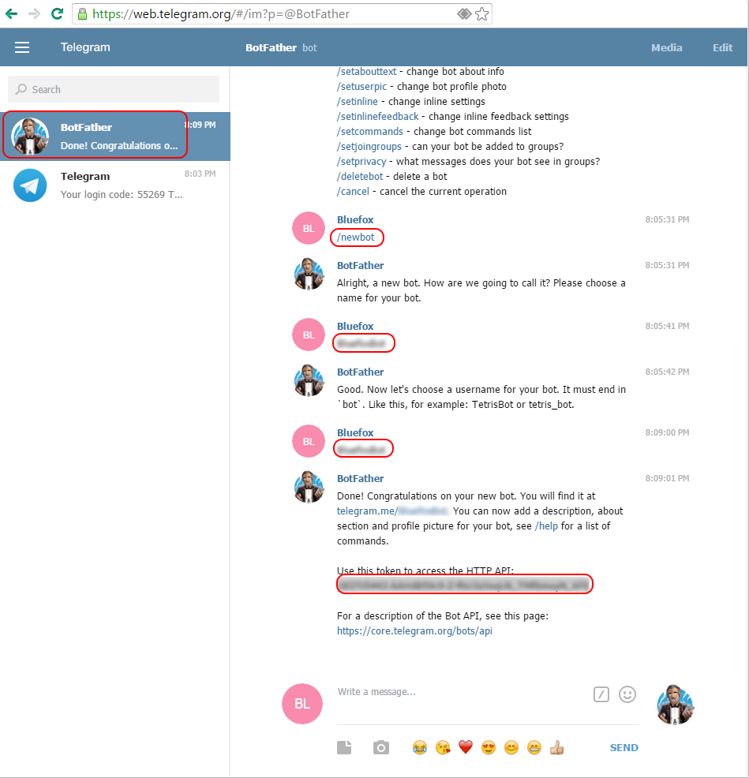

# ioBroker.telegram

## Konfiguration

Bitten Sie [@BotFather](https://telegram.me/botfather) , einen neuen Bot zu erstellen.`/newbot` Die

Sie werden aufgefordert, den Namen des Bots und anschließend den Benutzernamen einzugeben. Danach erhalten Sie das Token.



Sie sollten das Kommunikationspasswort im Konfigurationsdialog festlegen. Starten Sie anschließend den Adapter.

Um eine Konversation mit Ihrem Bot zu starten, müssen Sie den Benutzer authentifizieren mit`/password phrase` , W&#x6F;**`phrase`** Das ist Ihr konfiguriertes Passwort. Öffnen Sie also eine neue Konversation mit Ihrem generierten Bot in Telegram und geben Sie dann das Passwort als ersten Befehl ein.

**Hinweis:** Sie können die Kurzform verwenden.`/p phrase` Die

Um ein schönes Avatarbild hinzuzufügen, geben Sie Folgendes ein:`/setuserpic` Im **BotFather** -Chat kannst du ihm das gewünschte Bild (512x512 Pixel) hochladen, zum Beispiel dieses [Logo](https://github.com/iobroker-community-adapters/ioBroker.telegram/blob/master/docs/en/img/logo.png) .

Sie können die Nachricht über MessageBox an alle authentifizierten Benutzer senden.`sendTo('telegram', 'Test message')` oder an einen bestimmten Benutzer`sendTo('telegram', '@userName Test message')` Der Benutzer muss zuvor authentifiziert werden.

Sie können einen Benutzer auch auf diese Weise angeben:

```javascript
sendTo('telegram', {user: 'UserName', text: 'Test message'}, function (res) {
    console.log('Sent to ' + res + ' users');
});
```

Wenn Sie das obige Beispiel verwenden, beachten Sie bitte, dass Sie „UserName“ entweder durch den Vornamen oder den öffentlichen Telegram-Benutzernamen des Empfängers ersetzen müssen. (Dies hängt davon ab, ob die Option „Benutzernamen statt Vornamen speichern“ in den Adaptereinstellungen aktiviert ist.) Ist diese Option aktiviert und der Benutzer hat in seinem Telegram-Konto keinen öffentlichen Benutzernamen angegeben, verwendet der Adapter weiterhin den Vornamen. Beachten Sie, dass der gespeicherte Vorname beim nächsten Senden einer Nachricht an den Bot durch den Benutzernamen ersetzt wird, sobald der Benutzer einen öffentlichen Benutzernamen festlegt (nach der Authentifizierung bei Ihrem Bot).

Es können mehrere Empfänger angegeben werden (trennen Sie die Benutzernamen einfach durch Kommas). Beispiel: Empfänger: „User1,User4,User5“

Sie können auch eine Nachricht über den Status senden, indem Sie einfach den Status _"telegram.INSTANCE.communicate.response"_ mit dem Wert _"@userName Testnachricht"_ oder mit einem JSON-Objekt festlegen:

```json
{
    "text": "Test message"
}
```

Die JSON-Syntax ermöglicht außerdem das Hinzufügen von Optionen aus der [Telegram-Bots-API](https://core.telegram.org/bots/api) sowie das Festlegen des Benutzers oder der Chat-ID:

```json
{
    "text": "Test message, but with *bold*",
    "parse_mode": "Markdown",
    "chatId": "1234567890",
    "user": "UserName"
}
```

Sie können die`parse_mode` auch im Text:

```
sendTo('telegram', {user: 'UserName', text: '<MarkdownV2>Test message, but with *bold*</MarkdownV2>'}, function (res) {
   console.log('Sent to ' + res + ' users');
});
```

oder

```
setState('telegram.0.communicate.response', '<MarkdownV2>Test message, but with *bold*</MarkdownV2>');
```

Um Nachrichten an Gruppen zu senden, müssen Sie den Bot zu der Gruppe einladen, in der er posten soll.`chat_id` Mit der JSON-Nachrichtennutzlast können Sie tatsächlich Nachrichten an diese Gruppen senden.

Um das herauszufinden`chat_id` Sie müssen den Protokollierungsgrad des Adapters auf Folgendes einstellen:`debug` Anschließend können Sie Ihren Bot einfach in den Gruppen anpingen, an die er Nachrichten senden soll. Stellen Sie sicher, dass Sie ein`/` Um die Nachricht für den Bot sichtbar zu machen ( [sofern die Bot-Privatsphäre aktiviert ist](#How-to-receive-messages-in-group-chats-using-telegram-adapter) ), muss ein Platzhalter vor der Nachricht eingefügt werden. Anschließend wird die Chat-ID im iobroker-Protokoll angezeigt.

## Verwendung

Sie können Telegram mit [dem Text2Command-](https://github.com/ioBroker/ioBroker.text2command) Adapter verwenden. Es gibt ein vordefiniertes Kommunikationsschema, und Sie können Befehle in Textform an Ihr Zuhause senden.

Um ein Foto zu senden, senden Sie einfach den Dateipfad anstelle von Text oder einer URL:`sendTo('telegram', 'absolute/path/file.png')` oder`sendTo('telegram', 'https://telegram.org/img/t_logo.png')` Die

Beispiel, wie man einen Screenshot von der Webcam an Telegram sendet:

```javascript
function sendImage() {
    httpGet('https://raw.githubusercontent.com/ioBroker/ioBroker.javascript/master/admin/javascript.png', { responseType: 'arraybuffer' }, async (err, response) => {
        if (err) {
            console.error(err);
        } else {
            const tempFilePath = createTempFile('telegram-image.png', response.data);

            sendTo('telegram.0', 'send', {
                text: tempFilePath,
                caption: 'A wonderful adapter',
                user: 'yourUserName1,yourUserName2',
            });
        }
    });
}

on('0_userdata.0.someState', (obj) => {
    if (obj.state.val) {
        // send 4 images: immediately, in 5, 15 and 30 seconds
        sendImage();
        setTimeout(sendImage, 5000);
        setTimeout(sendImage, 15000);
        setTimeout(sendImage, 30000);
    }
});
```

Die folgenden Meldungen sind für Aktionen reserviert:

- _Tippen_ - für Textnachrichten,
- _upload\_photo_ - für Fotos,
- _upload\_video_ - für Videos,
- _record\_video_ - für Videos,
- _record\_audio_ - für Audio,
- _upload\_audio_ - für Audio,
- _upload\_document_ - für Dokumente,
- _find\_location_ - für Standortdaten

In diesem Fall wird der Aktionsbefehl gesendet.

Die Beschreibung der Telegram-API finden Sie [hier](https://core.telegram.org/bots/api) . Sie können alle in dieser API definierten Optionen nutzen, indem Sie sie einfach in das Sendeobjekt einfügen. Beispiel:

```javascript
sendTo('telegram.0', 'send', {
    text:                   '/tmp/snap.jpg',
    caption:                'Snapshot',
    disable_notification:   true
});
```

**Mögliche Optionen** :

- _disable\_notification_ : Sendet die Nachricht stumm. iOS-Nutzer erhalten keine Benachrichtigung, Android-Nutzer erhalten eine Benachrichtigung ohne Ton. (Alle Typen)
- _parse\_mode_ : Markdown oder HTML senden, wenn Telegram-Apps in den Nachrichten Ihres Bots fett, kursiv, mit fester Breite oder eingebettete URLs anzeigen sollen. Mögliche Werte: "Markdown", "MarkdownV2", "HTML" (Nachricht)
- _disable\_web\_page\_preview_ : Deaktiviert die Linkvorschau für Links in dieser Nachricht (Nachricht)
- _Bildunterschrift_ : Beschriftung für das Dokument, Foto oder Video, 0-200 Zeichen (Video, Audio, Foto, Dokument)
- _Dauer_ : Dauer des gesendeten Video- oder Audiomaterials in Sekunden (Audio, Video)
- _Interpret_ : Derjenige, der die Audiodatei (Audio) erstellt hat
- _Titel_ : Name der Audiodatei (Audio)
- _Breite_ : Videobreite (Video)
- _Höhe_ : Videohöhe (Video)

Der Adapter versucht, den Nachrichtentyp (Foto, Video, Audio, Dokument, Sticker, Aktion, Standort) anhand des Nachrichtentextes zu erkennen. Wenn der Text ein Pfad zu einer vorhandenen Datei ist, wird diese entsprechend dem Nachrichtentyp gesendet.

Der Standort wird anhand der Attribute Breitengrad und Längengrad ermittelt:

```javascript
sendTo('telegram.0', 'send', {
    latitude:               52.522430,
    longitude:              13.372234,
    disable_notification:   true
});
```

Der Veranstaltungsort wird anhand der Attribute Breitengrad, Längengrad, Titel und Adresse ermittelt:

```javascript
sendTo('telegram.0', 'send', {
    latitude:               52.51630462381893,
    longitude:              13.37770039691943,
    title:                  'Brandenburger Tor',
    address:                'Pariser Platz 8, 10117 Berlin',
});
```

### Explizite Arten von Nachrichten

Sie haben die Möglichkeit, zusätzlich den Nachrichtentyp zu definieren, falls Sie die Daten als Puffer senden möchten.

Folgende Typen sind möglich: _Aufkleber_ , _Video_ , _Dokument_ , _Audio_ , _Foto_ .

```javascript
sendTo('telegram.0', 'send', {
    text: fs.readFileSync('/opt/path/picture.png'),
    type: 'photo'
});
```

### Senden von Dateien aus dem ioBroker-Dateispeicher oder aus Zuständen (iob://-URIs)

Neben einem lokalen Dateipfad oder einer Web-URL,`text` Es kann sich um eine **ioBroker-URI** handeln. Der Adapter löst die URI auf, liest den Inhalt und sendet ihn mit dem automatisch erkannten Medientyp (Foto, Video, Audio, Dokument usw.). Dies ist besonders nützlich, wenn die Datei im ioBroker-Dateispeicher hinter Redis/jsonl abgelegt ist und somit **nicht** im lokalen Dateisystem existiert, da ein einfacher Pfad in diesem Fall nicht funktionieren würde.

Folgende Programme werden unterstützt:

- `iobfile://<adapter.instance>/<path>`— eine Datei aus dem ioBroker-Dateispeicher.
- `iobstate://<state.id>` — der Wert eines Zustands (siehe unten, wie der Wert interpretiert wird).
- `iobobject://<object.id>/<path>` — ein Wert, der in einem ioBroker-Objekt verschachtelt ist (dem`path` navigiert in das Objekt durch`/` ).

```javascript
// send a snapshot that another adapter has written into the file storage
sendTo('telegram.0', 'send', {
    user: 'UserName',
    text: 'iobfile://cameras.0/snapshots/front_door.jpg',
    caption: 'Someone is at the front door',
});

// send a file whose full path is stored in a state
sendTo('telegram.0', 'send', {
    text: 'iobstate://0_userdata.0.lastReport',
});

// take a value out of an object
sendTo('telegram.0', 'send', {
    text: 'iobobject://0_userdata.0.myObject/native/document',
});
```

Der Medientyp wird aus der Dateierweiterung abgeleitet (`.jpg` /`.png` → Foto,`.mp4` → Video,`.mp3` /`.ogg` /`.wav` → Audio,`.gif` → Animation,`.webp` → Aufkleber,`.pdf` /`.csv` /`.docx` /... → Dokument). Ist die Dateiendung unbekannt, wird der Typ aus dem gespeicherten MIME-Typ übernommen; andernfalls wird der Inhalt als Dokument gesendet. Sie können dies weiterhin explizit mit dem`type` Option.

**Wie ein Zustands-/Objektwert interpretiert wird** (`iobstate://` Und`iobobject://` ):

- eine **Daten-URL** (`data:image/png;base64,...` ) wird dekodiert und als der entsprechende Medientyp gesendet;
- ein Wert, der selbst ein`iob*://` URI oder ein`http(s)://` Die URL wird weiter aufgelöst (bis zu 5 Verschachtelungsebenen);
- Jede andere Zeichenkette wird als Dateipfad / URL behandelt;
- Zahlen, boolesche Werte und Objekte werden als Text gesendet (Objekte werden in JSON-Strings umgewandelt).

### Tastatur

Sie können die Tastatur- **ReplyKeyboardMarkup-Option** im Client anzeigen:

```javascript
sendTo('telegram.0', 'send', {
    text: 'Press button',
    reply_markup: {
        keyboard: [
            ['Line 1, Button 1', 'Line 1, Button 2'],
            ['Line 2, Button 3', 'Line 2, Button 4']
        ],
        resize_keyboard:   true,
        one_time_keyboard: true
    }
});
```

Mehr dazu können Sie [hier](https://core.telegram.org/bots/api#replykeyboardmarkup) und [hier](https://core.telegram.org/bots#keyboards) lesen.

Sie können die Tastaturbelegung **(InlineKeyboardMarkup)** im Client anzeigen:

```javascript
sendTo('telegram', 'send', {
    user: 'my_username;username2', // optional. Separator could be ";" or "," or space
    text: 'Click the button',
    reply_markup: {
        inline_keyboard: [
            [{ text: 'Button 1_1', callback_data: '1_1' }],
            [{ text: 'Button 1_2', callback_data: '1_2' }]
        ]
    }
});
```

Mehr dazu können Sie [hier](https://core.telegram.org/bots/api#inlinekeyboardmarkup) und [hier](https://core.telegram.org/bots#inline-keyboards-and-on-the-fly-updating) lesen.

**HINWEIS:** _Nachdem der Nutzer eine Rückruftaste gedrückt hat, zeigen Telegram-Clients einen Fortschrittsbalken an, bis Sie \`answerCallbackQuery\` aufrufen. Daher ist es notwendig, mit dem Aufruf von \`answerCallbackQuery\` zu reagieren, selbst wenn keine Benachrichtigung an den Nutzer erforderlich ist (z. B. ohne Angabe optionaler Parameter)._

### answerCallbackQuery

Mit dieser Methode können Sie Antworten auf Rückruf-Anfragen senden, die über die Inline-Tastatur übermittelt werden. Die Antwort wird dem Benutzer als Benachrichtigung am oberen Rand des Chatfensters oder als Warnmeldung angezeigt. Bei Erfolg wird _„True“_ zurückgegeben.

```javascript
if (command === '1_2') {
    sendTo('telegram', 'send', {
     user: 'my_username username2', // optional. Separator could be ";" or "," or space 
        answerCallbackQuery: {
            text: 'Pressed!',
            showAlert: false, // Optional parameter
        },
   });
}                      
```

Mehr dazu können Sie [hier](https://core.telegram.org/bots/api#answercallbackquery) lesen.

### Frage

Sie können die Nachricht per Telegram senden, und die nächste Antwort wird über eine Callback-Funktion zurückgegeben. Das Antwort-Timeout kann in der Instanzkonfiguration festgelegt werden (Standardwert: 60 Sekunden). Wenn der Benutzer nicht rechtzeitig antwortet, wird die Callback-Funktion mit der **Zeichenkette** aufgerufen.`'__timeout__'` (Also`msg.data` Ist`undefined` ).

```javascript
sendTo('telegram.0', 'ask', {
    user: user, // optional
    text: 'Are you sure?',
    reply_markup: {
        inline_keyboard: [
            // two buttons could be on one line too, but here they are on different
            [{ text: 'Yes!',  callback_data: '1' }], // first line
            [{ text: 'No...', callback_data: '0' }]  // second line
        ]
    }
}, msg => {
    if (msg === '__timeout__') {
        console.log('no answer within the configured timeout');
    } else if (msg.data === '1') {
        console.log('user pressed Yes');
    } else {
        console.log('user pressed No');
    }
});
```

**Wichtig – der Anrufer hat seine eigene`sendTo` Timeout:** der Adapter, der das sendet`ask` (z. B. der JavaScript-Adapter) wendet sein **eigenes** Timeout auf die`sendTo` Der Callback ist im JavaScript-Adapter standardmäßig auf etwa **20 Sekunden** eingestellt. Ist das konfigurierte Antwort-Timeout länger, wird der Callback vom _Aufrufer_ vorzeitig mit einem Timeout-Ergebnis ausgelöst – was so aussieht, als hätte der Benutzer mit „Nein“ geantwortet. Erhöhen Sie das Timeout des Aufrufers, sodass es **größer** als das Antwort-Timeout ist, z. B. im JavaScript-Adapter, indem Sie es als letztes Argument übergeben.

```javascript
sendTo('telegram.0', 'ask', {
    text: 'Are you sure?',
    reply_markup: { inline_keyboard: [[{ text: 'Yes!', callback_data: '1' }], [{ text: 'No...', callback_data: '0' }]] }
}, msg => {
    // ... handle msg (see above)
}, { timeout: 65000 }); // must be > the configured answer timeout (here 60 s)
```

## Chat-ID

Ab Version 0.4.0 können Sie die Chat-ID verwenden, um Nachrichten an den Chat zu senden.

```javascript
sendTo('telegram.0', 'send', {
    text: 'Message to chat',
    chatId: 'SOME-CHAT-ID-123'
});
```

## Thread-ID

Sie können auch eine Thread-ID für Supergruppen festlegen.

```javascript
sendTo('telegram.0', 'send', {
    text: 'Message to chat',
    chatId: 'SOME-CHAT-ID-123',
    message_thread_id: 7,
});
```

## Empfang eines Standorts

Wenn ein Nutzer seinen Standort mit dem Bot teilt (Büroklammer → Standort) oder einen Veranstaltungsort sendet, werden die Koordinaten im Zustand gespeichert.`telegram.INSTANCE.communicate.requestLocation` als`latitude;longitude` Zeichenkette (Rolle`value.gps` Die Metadaten geben an (`requestChatId` ,`requestMessageId` ,`requestUserId` ) werden ebenfalls aktualisiert, sodass Sie wissen, wer es gesendet hat.

```javascript
on({ id: 'telegram.0.communicate.requestLocation', change: 'any' }, obj => {
    const [latitude, longitude] = obj.state.val.split(';').map(parseFloat);
    const user = getState('telegram.0.communicate.requestUserId').val;
    console.log(`User ${user} is at ${latitude}, ${longitude}`);
    // e.g. forward the coordinates to a map widget
});
```

Live-Standorte (Büroklammer → Standort → „Meinen Live-Standort teilen“) werden ebenfalls unterstützt: Telegram übermittelt jede Positionsaktualisierung und`requestLocation` wird jedes Mal aktualisiert. Drei weitere Statusangaben beschreiben den zuletzt empfangenen Standort:

- `communicate.requestLocationLive` -`true` Der Standort ist also ein Live-Standort, der noch geteilt wird. Telegram sendet ein letztes Update ohne das Live-Flag, sobald die Freigabe beendet wird oder abläuft, sodass der Status auf „Live“ zurückgesetzt wird.`false` Zu diesem Zeitpunkt. Für einen normalen (statischen) Standort oder einen Veranstaltungsort gilt Folgendes:`false` Die
- `communicate.requestLocationHeading` - Bewegungsrichtung in Grad (1-360). Nur für aktive Live-Standorte verfügbar und nur, wenn das Gerät diese meldet, andernfalls`null` Die
- `communicate.requestLocationAccuracy` - Unsicherheitsradius der Position in Metern (0-1500), falls angegeben, andernfalls`null` Die

```javascript
on({ id: 'telegram.0.communicate.requestLocationLive', change: 'ne' }, obj => {
    if (!obj.state.val) {
        console.log('Live location sharing has ended');
    }
});
```

## Beiträge im Empfangskanal

Wenn der Bot Administrator eines Kanals ist, werden auch die in diesem Kanal veröffentlichten Beiträge empfangen und in die Adresszeile geschrieben.`telegram.INSTANCE.communicate.request` in der Form`[channel title]text` (zusammen mit`communicate.requestChatId` Und`communicate.requestMessageId` Kanalbeiträge sind anonym (sie haben keinen Absender), daher gelten die Authentifizierungs- und Befehlsverarbeitungsmechanismen nicht für sie – sie werden lediglich als Anfrage übermittelt. Angehängte Medien werden wie bei normalen Nachrichten gespeichert, und der Kanal wird hinzugefügt.`communicate.chats` Die

## Bekannte Chats und Gruppen

Jeder Chat oder jede Gruppe, von der der Bot eine Nachricht erhält, wird im Zustand gespeichert.`telegram.INSTANCE.communicate.chats` als JSON-Objekt`id => { title, type }` (Wo`type` ist eines von`private` ,`group` ,`supergroup` oder`channel` Dies ist praktisch, um die Chat-ID einer Gruppe zu ermitteln (z. B. damit ein anderer Adapter eine Gruppe zum Senden auswählen kann). Fügen Sie den Bot der Gruppe hinzu und senden Sie eine Nachricht, damit die Gruppe angezeigt wird.

```json
{
    "1234567": { "title": "John Doe", "type": "private" },
    "-1001234567890": { "title": "My smart home group", "type": "supergroup" }
}
```

Die Liste wird gespeichert und bleibt daher auch nach einem Neustart des Adapters erhalten. Verwenden Sie die Chat-ID als`chatId` beim Senden:

```javascript
sendTo('telegram.0', 'send', { text: 'Hello group', chatId: '-1001234567890' });
```

## Nachrichten werden aktualisiert

Die folgenden Methoden ermöglichen es Ihnen, eine bestehende Nachricht im Nachrichtenverlauf zu ändern, anstatt als Ergebnis einer Aktion eine neue Nachricht zu senden. Dies ist besonders nützlich für Nachrichten mit _integrierten Tastaturen_ und Callback-Abfragen, kann aber auch dazu beitragen, die Übersichtlichkeit von Konversationen mit herkömmlichen Chatbots zu verbessern.

### editMessageText

Mit dieser Methode können Sie vom Bot oder über den Bot (bei Inline-Bots) gesendete Texte bearbeiten. Im Erfolgsfall wird, falls eine bearbeitete Nachricht vom Bot gesendet wurde, diese bearbeitete Nachricht zurückgegeben; andernfalls wird _„True“_ zurückgegeben.

```javascript
if (command === '1_2') {
    sendTo('telegram', {
        user: user,
        text: 'New text before buttons',
        editMessageText: {
            options: {
                chat_id: getState('telegram.0.communicate.requestChatId').val,
                message_id: getState('telegram.0.communicate.requestMessageId').val,
                reply_markup: {
                    inline_keyboard: [
                        [{ text: 'Button 1', callback_data: '2_1' }],
                        [{ text: 'Button 2', callback_data: '2_2' }]
                    ],
                }
            }
        }
    });
}
```

_oder neuer Text für die letzte Nachricht:_

```javascript
if (command === '1_2') {
    sendTo('telegram', {
        user: user,
        text: 'New text message',
        editMessageText: {
            options: {
                chat_id: getState('telegram.0.communicate.requestChatId').val,
                message_id: getState('telegram.0.communicate.requestMessageId').val,
            }
        }
    });
}
```

Mehr dazu können Sie [hier](https://core.telegram.org/bots/api#editmessagetext) lesen.

### editMessageCaption

Mit dieser Methode können Sie die Bildunterschrift der vom Bot oder über den Bot (bei Inline-Bots) gesendeten Nachricht bearbeiten. Im Erfolgsfall wird, falls eine bearbeitete Nachricht vom Bot gesendet wurde, diese bearbeitete Nachricht zurückgegeben; andernfalls wird _„True“_ zurückgegeben.

```javascript
if (command === '1_2') {
    sendTo('telegram', {
        user, // optional
        text: 'New caption',
        editMessageCaption: {
            options: {
                chat_id: getState('telegram.0.communicate.requestChatId').val,
                message_id: getState('telegram.0.communicate.requestMessageId').val
            }
        }
    });
}
```

Mehr dazu können Sie [hier](https://core.telegram.org/bots/api#editmessagecaption) lesen.

### editMessageMedia

Mit dieser Methode können Sie das Bild der vom Bot gesendeten Nachricht bearbeiten (bei Inline-Bots). Im Erfolgsfall wird, falls der Bot eine bearbeitete Nachricht gesendet hat, diese zurückgegeben; andernfalls wird _„True“_ zurückgegeben.

```javascript
if (command === '1_2') {
    sendTo('telegram', {
        user, // optional
        text: 'picture.jpg',
        editMessageMedia: {
            options: {
                chat_id: (await getStateAsync('telegram.0.communicate.botSendChatId')).val,
                message_id: (await getStateAsync('telegram.0.communicate.botSendMessageId')).val
            }
        }
    });
}
```

Folgende Medientypen werden unterstützt:`photo` ,`animation` ,`audio` ,`document` ,`video` Die

Mehr dazu können Sie [hier](https://core.telegram.org/bots/api#editmessagemedia) lesen.

### editMessageReplyMarkup

Mit dieser Methode können Sie ausschließlich die Antwortformatierung von Nachrichten bearbeiten, die vom Bot oder über den Bot (bei Inline-Bots) gesendet werden. Im Erfolgsfall wird die bearbeitete Nachricht zurückgegeben, sofern der Bot eine bearbeitete Nachricht gesendet hat; andernfalls wird _„True“_ zurückgegeben.

```javascript
if (command === '1_2') {
    sendTo('telegram', {
        user: user,
        text: 'New text before buttons',
        editMessageReplyMarkup: {
            options: {
                chat_id: (await getStateAsync('telegram.0.communicate.botSendChatId')).val,
                message_id: (await getStateAsync('telegram.0.communicate.botSendMessageId')).val,
                reply_markup: {
                    inline_keyboard: [
                        [{ text: 'Button 1', callback_data: '2_1' }],
                        [{ text: 'Button 2', callback_data: '2_2' }]
                    ],
                }
            }
        }
    });
}
```

Mehr dazu können Sie [hier](https://core.telegram.org/bots/api#editmessagereplymarkup) lesen.

### Nachricht löschen

Verwenden Sie diese Methode zum Löschen von Nachrichten, einschließlich Servicemeldungen, unter Berücksichtigung der folgenden Einschränkungen:

- Eine Nachricht kann nur gelöscht werden, wenn sie vor weniger als 48 Stunden gesendet wurde. Gibt bei Erfolg _„True“_ zurück.

```javascript
if (command === 'delete') {
    sendTo('telegram', {
        user: user,
        deleteMessage: {
            options: {
                chat_id: getState('telegram.0.communicate.requestChatId').val,
                message_id: getState('telegram.0.communicate.requestMessageId').val
            }
        }
    });
}
```

Mehr dazu können Sie [hier](https://core.telegram.org/bots/api#deletemessage) lesen.

## Auf Nutzerantworten/Nachrichten reagieren

Angenommen, Sie verwenden ausschließlich JavaScript ohne`text2command` Sie haben Ihrem Benutzer bereits eine Nachricht/Frage gesendet.`sendTo()` Wie oben beschrieben, antwortet der Benutzer darauf durch Drücken einer Schaltfläche oder durch Verfassen einer Nachricht. Sie können den Befehl extrahieren und dem Benutzer Feedback geben, Befehle ausführen oder Zustände in iobroker ändern.

- telegram.0 ist Ihre iobroker Telegram-Instanz, die Sie verwenden möchten.
- Der Benutzer ist derjenige, der bei Ihrem TelegramBot registriert ist und die Nachricht gesendet hat.
- Der Befehl ist der Befehl, den Ihr TelegramBot empfangen hat.

```javascript
on({id: 'telegram.0.communicate.request', change: 'any'}, function (obj) {
    var stateval = getState('telegram.0.communicate.request').val;              // save Statevalue received from your Bot
    var user = stateval.substring(1,stateval.indexOf(']'));                 // extract user from the message
    var command = stateval.substring(stateval.indexOf(']') + 1,stateval.length);   // extract command/text from the message

    switch (command) {
        case '1_2':
            //... see example above ...
            break;
        case 'delete':
            //... see example above
            break;
        //.... and so on ...
    }
});

```

## Spezialbefehle

### /state stateName - liest den Status

Sie können den Statuswert anfordern, wenn Sie die ID kennen:

```
/state system.adapter.admin.0.memHeapTotal
> 56.45
```

### /state stateName value - Statuswert festlegen

Sie können den Wert des Status festlegen, wenn Sie die ID kennen:

```
/state hm-rpc.0.JEQ0ABCDE.3.STOP true
> Done
```

## Proxy

Kann der ioBroker-Host die Telegram-Server nicht direkt erreichen, aktivieren Sie in den Haupteinstellungen **die Option „Proxy verwenden“** und geben Sie den Proxy-Typ (HTTP(S) oder SOCKS5), Host, Port und – falls der Proxy eine Authentifizierung erfordert – Benutzername und Passwort an. Alle Anfragen an Telegram (API-Aufrufe und Mediendownloads) werden über den Proxy geleitet. Ein HTTPS-Proxy kann durch Angabe des Hosts mit seinem Schema adressiert werden, z. B. 192.168.1 ...`https://proxy.example.com` Beachten Sie, dass die SOCKS5-Unterstützung des zugrunde liegenden HTTP-Clients (undici) noch als experimentell gekennzeichnet ist; Node.js gibt beim Start eine entsprechende Warnung aus.

## Abfrage- oder Servermodus

Im Polling-Modus hält der Adapter eine Long-Polling-Anfrage an den Telegram-Server offen (bis zu 30 Sekunden pro Anfrage, danach wird sie erneuert). Aktualisierungen werden sofort zugestellt, und es entsteht praktisch kein Datenverkehr, solange nichts passiert. Daher muss kein Polling-Intervall konfiguriert werden. Polling funktioniert auch hinter NAT/Firewalls ohne Portweiterleitung.

Um den Servermodus zu verwenden, muss Ihre ioBroker-Instanz aus dem Internet erreichbar sein (z. B. über HTTPS).`noip.com` dynamischer DNS-Dienst).

Telegram funktioniert nur mit HTTPS-Servern, aber Sie können **Let's Encrypt-** Zertifikate verwenden.

Für den Servermodus müssen folgende Einstellungen vorgenommen werden:

- URL - im Format <https://yourdomain.com:8443> .
- IP – Die IP-Adresse, an die der Server gebunden wird. Standardwert: 0.0.0.0. Ändern Sie diese Adresse nur, wenn Sie sich sicher sind.
- Port - Telegram unterstützt tatsächlich nur die Ports 443, 80, 88 und 8443, aber Sie können Ports über Ihren Router an beliebige Empfänger weiterleiten.
- Öffentliches Zertifikat – erforderlich, wenn **Let's Encrypt** deaktiviert ist.
- Privater Schlüssel – erforderlich, wenn **Let's Encrypt** deaktiviert ist.
- Kettenzertifikat (optional)
- Optionen für Let's Encrypt – Die Einrichtung **von Let's Encrypt-** Zertifikaten ist sehr einfach. Weitere Informationen finden Sie [hier](https://github.com/ioBroker/ioBroker.admin#lets-encrypt-certificates) .

## Erweiterte Sicherheit

Die Benutzerauthentifizierung könnte deaktiviert werden. Daher kann sich niemand mehr authentifizieren.

Um eine Liste vertrauenswürdiger Benutzer zu erstellen, deaktivieren Sie zunächst die Option „Neue Benutzer nicht authentifizieren“ und authentifizieren Sie anschließend alle Benutzer, die in der Liste der vertrauenswürdigen Benutzer enthalten sein sollen, indem Sie die E-Mail senden.`/password <PASSWORD>` Nachricht.

Die Benutzer, die ein gültiges Passwort gesendet haben, werden in der Liste der vertrauenswürdigen Benutzer gespeichert.

Anschließend kann die Option „Neue Benutzer nicht authentifizieren“ aktiviert werden, sodass sich keine neuen Benutzer mehr authentifizieren können.

Um diese Option nutzen zu können, muss die Option „Authentifizierte Benutzer merken“ aktiviert sein.

## Anrufe per Telegramm

Dank der [CallMeBot-](https://www.callmebot.com/) API können Sie einen Anruf an Ihr Telegram-Konto tätigen, und ein Text wird Ihnen über eine TTS-Engine vorgelesen.

Um dies mit dem JavaScript-Adapter zu tun, rufen Sie einfach Folgendes auf:

```javascript
sendTo('telegram.0', 'call', 'Some text');
```

oder

```javascript
sendTo('telegram.0', 'call', {
    text: 'Some text',
    user: '@Username', // optional and the call will be done to the first user in telegram.0.communicate.users.
    lang: 'de-DE-Standard-A', // optional and the system language will be taken
    repeats: 0, // number of repeats 
});
```

oder

```javascript
sendTo('telegram.0', 'call', {
    text: 'Some text',
    users: ['@Username1', '+49xxxx'] // Array of `users' or telephone numbers.
});
```

oder

```javascript
sendTo('telegram.0', 'call', {
    file: 'url of mp3 file that is accessible from internet',
    users: ['@Username1', '@Username2'] // Array of `users' or telephone numbers.
});
```

Mögliche Werte für Sprache:

- `ar-XA-Standard-A` - Arabisch (weibliche Stimme)
- `ar-XA-Standard-B` - Arabisch (Männliche Stimme)
- `ar-XA-Standard-C` - Arabisch (Männlich, 2 Stimmen)
- `cs-CZ-Standard-A` - Tschechisch (Tschechische Republik) (weibliche Stimme)
- `da-DK-Standard-A` - Dänisch (Dänemark) (weibliche Stimme)
- `nl-NL-Standard-A` - Niederländisch (Niederlande) (Weibliche Stimme - wird verwendet, wenn die Systemsprache NL ist und keine andere Sprache angegeben wurde)
- `nl-NL-Standard-B` - Niederländisch (Niederlande) (Männliche Stimme)
- `nl-NL-Standard-C` - Niederländisch (Niederlande) (Männlich, 2 Stimmen)
- `nl-NL-Standard-D` - Niederländisch (Niederlande) (Weibliche 2-Stimmen)
- `nl-NL-Standard-E` - Niederländisch (Niederlande) (Weiblich, 3 Stimmen)
- `en-AU-Standard-A` - Englisch (Australien) (weibliche Stimme)
- `en-AU-Standard-B` - Englisch (Australien) (Männliche Stimme)
- `en-AU-Standard-C` - Englisch (Australien) (Weiblich, 2 Stimmen)
- `en-AU-Standard-D` - Englisch (Australien) (Männlich, 2 Stimmen)
- `en-IN-Standard-A` - Englisch (Indien) (weibliche Stimme)
- `en-IN-Standard-B` - Englisch (Indien) (Männliche Stimme)
- `en-IN-Standard-C` - Englisch (Indien) (Männlich, 2 Stimmen)
- `en-GB-Standard-A` - Englisch (UK) (Weibliche Stimme - wird verwendet, wenn die Systemsprache EN ist und keine andere Sprache angegeben wurde)
- `en-GB-Standard-B` - Englisch (GB) (Männliche Stimme)
- `en-GB-Standard-C` - Englisch (GB) (Weiblich, 2 Stimmen)
- `en-GB-Standard-D` - Englisch (GB) (Männlich, 2 Stimmen)
- `en-US-Standard-B` - Englisch (USA) (Männliche Stimme)
- `en-US-Standard-C` - Englisch (USA) (weibliche Stimme)
- `en-US-Standard-D` - Englisch (USA) (Männlich, 2 Stimmen)
- `en-US-Standard-E` - Englisch (USA) (Weibliche Stimme 2)
- `fil-PH-Standard-A` - Filipino (Philippinen) (weibliche Stimme)
- `fi-FI-Standard-A` - Finnisch (Finnland) (weibliche Stimme)
- `fr-CA-Standard-A` - Französisch (Kanada) (weibliche Stimme)
- `fr-CA-Standard-B` - Französisch (Kanada) (Männliche Stimme)
- `fr-CA-Standard-C` - Französisch (Kanada) (Weiblich, 2 Stimmen)
- `fr-CA-Standard-D` - Französisch (Kanada) (Männlich, 2 Stimmen)
- `fr-FR-Standard-A` - Französisch (Frankreich) (Weibliche Stimme - wird verwendet, wenn die Systemsprache FR ist und keine andere Sprache angegeben wurde)
- `fr-FR-Standard-B` - Französisch (Frankreich) (Männliche Stimme)
- `fr-FR-Standard-C` - Französisch (Frankreich) (Weiblich, 2 Stimmen)
- `fr-FR-Standard-D` - Französisch (Frankreich) (Männlich, 2 Stimmen)
- `de-DE-Standard-A` - Deutsch (Deutschland) (weibliche Stimme - wird verwendet, wenn die Systemsprache DE ist und keine andere Sprache angegeben wurde)
- `de-DE-Standard-B` - Deutsch (Deutschland) (Männliche Stimme)
- `el-GR-Standard-A` - Griechisch (Griechenland) (weibliche Stimme)
- `hi-IN-Standard-A` - Hindi (Indien) (weibliche Stimme)
- `hi-IN-Standard-B` - Hindi (Indien) (Männliche Stimme)
- `hi-IN-Standard-C` - Hindi (Indien) (männlich, 2 Stimmen)
- `hu-HU-Standard-A` - Ungarisch (Ungarn) (weibliche Stimme)
- `id-ID-Standard-A` - Indonesisch (Indonesien) (weibliche Stimme)
- `id-ID-Standard-B` - Indonesisch (Indonesien) (Männliche Stimme)
- `id-ID-Standard-C` - Indonesisch (Indonesien) (Männlich, 2 Stimmen)
- `it-IT-Standard-A` - Italienisch (Italien) (Weibliche Stimme - wird verwendet, wenn die Systemsprache IT ist und keine andere Sprache angegeben wurde)
- `it-IT-Standard-B` - Italienisch (Italien) (Weiblich, 2 Stimmen)
- `it-IT-Standard-C` - Italienisch (Italien) (Männliche Stimme)
- `it-IT-Standard-D` - Italienisch (Italien) (Männlich, 2 Stimmen)
- `ja-JP-Standard-A` - Japanisch (Japan) (weibliche Stimme)
- `ja-JP-Standard-B` - Japanisch (Japan) (Weiblich, 2 Stimmen)
- `ja-JP-Standard-C` - Japanisch (Japan) (Männliche Stimme)
- `ja-JP-Standard-D` - Japanisch (Japan) (Männlich, 2 Stimmen)
- `ko-KR-Standard-A` - Koreanisch (Südkorea) (weibliche Stimme)
- `ko-KR-Standard-B` - Koreanisch (Südkorea) (Weiblich, 2 Stimmen)
- `ko-KR-Standard-C` - Koreanisch (Südkorea) (Männliche Stimme)
- `ko-KR-Standard-D` - Koreanisch (Südkorea) (Männlich, 2 Stimmen)
- `cmn-CN-Standard-A` - Mandarin-Chinesisch (weibliche Stimme)
- `cmn-CN-Standard-B` - Mandarin-Chinesisch (männliche Stimme)
- `cmn-CN-Standard-C` - Mandarin-Chinesisch (Männlich, 2 Stimmen)
- `nb-NO-Standard-A` - Norwegisch (Norwegen) (weibliche Stimme)
- `nb-NO-Standard-B` - Norwegisch (Norwegen) (Männliche Stimme)
- `nb-NO-Standard-C` - Norwegisch (Norwegen) (Weiblich, 2 Stimmen)
- `nb-NO-Standard-D` - Norwegisch (Norwegen) (Männlich, 2 Stimmen)
- `nb-no-Standard-E` - Norwegisch (Norwegen) (Weiblich, 3 Stimmen)
- `pl-PL-Standard-A` - Polnisch (Polen) (Weibliche Stimme - wird verwendet, wenn die Systemsprache PL ist und keine andere Sprache angegeben wurde)
- `pl-PL-Standard-B` - Polnisch (Polen) (Männliche Stimme)
- `pl-PL-Standard-C` - Polnisch (Polen) (Männlich, 2 Stimmen)
- `pl-PL-Standard-D` - Polnisch (Polen) (Weibliche 2 Stimmen)
- `pl-PL-Standard-E` - Polnisch (Polen) (Weiblich, 3 Stimmen)
- `pt-BR-Standard-A` - Portugiesisch (Brasilien) (Weibliche Stimme - wird verwendet, wenn die Systemsprache PT ist und keine andere Sprache angegeben wurde)
- `pt-PT-Standard-A` - Portugiesisch (Portugal) (weibliche Stimme)
- `pt-PT-Standard-B` - Portugiesisch (Portugal) (Männliche Stimme)
- `pt-PT-Standard-C` - Portugiesisch (Portugal) (Männlich, 2 Stimmen)
- `pt-PT-Standard-D`- Portugiesisch (Portugal) (Weiblich, 2 Stimmen)
- `ru-RU-Standard-A` - Russisch (Russland) (Weibliche Stimme - wird verwendet, wenn die Systemsprache RU ist und keine andere Sprache angegeben wurde)
- `ru-RU-Standard-B` - Russisch (Russland) (Männliche Stimme)
- `ru-RU-Standard-C` - Russisch (Russland) (Weibliche Stimme 2)
- `ru-RU-Standard-D` - Russisch (Russland) (Männlich, 2 Stimmen)
- `sk-SK-Standard-A` - Slowakisch (Slowakei) (weibliche Stimme)
- `es-ES-Standard-A` - Spanisch (Spanien) (Weibliche Stimme - wird verwendet, wenn die Systemsprache ES ist und keine andere Sprache angegeben wurde)
- `sv-SE-Standard-A` - Schwedisch (Schweden) (weibliche Stimme)
- `tr-TR-Standard-A` - Türkisch (Türkei) (weibliche Stimme)
- `tr-TR-Standard-B` - Türkisch (Türkei) (Männliche Stimme)
- `tr-TR-Standard-C` - Türkisch (Türkei) (Weiblich, 2 Stimmen)
- `tr-TR-Standard-D` - Türkisch (Türkei) (Weiblich, 3 Stimmen)
- `tr-TR-Standard-E` - Türkisch (Türkei) (Männliche Stimme)
- `uk-UA-Standard-A` - Ukrainisch (Ukraine) (weibliche Stimme)
- `vi-VN-Standard-A` - Vietnamesisch (Vietnam) (weibliche Stimme)
- `vi-VN-Standard-B` - Vietnamesisch (Vietnam) (Männliche Stimme)
- `vi-VN-Standard-C` - Vietnamesisch (Vietnam) (Weiblich, 2 Stimmen)
- `vi-VN-Standard-D` - Vietnamesisch (Vietnam) (Männlich, 2 Stimmen)

TODO:

- Veranstaltungsort

## Automatische Tastatureinbettung basierend auf den Einstellungen im Adminbereich (Easy-Keyboard)

Für jeden Bundesstaat konnten die zusätzlichen Einstellungen aktiviert werden:


Durch Eingabe`/cmds` Folgende Tastatur wird in Telegram angezeigt:


`/cmds` könnte im Konfigurationsdialog des Telegram-Adapters durch einen beliebigen Text (z. B. "?") ersetzt werden.

Wenn die Option **„Räume in Tastaturbefehlen verwenden“** im Konfigurationsdialog des Telegram-Adapters aktiviert ist, wird im ersten Schritt die Raumliste angezeigt. _**(Noch nicht implementiert)**_

### Einstellungen im Zustand

Als erstes muss die Konfiguration aktiviert werden.

#### Alias

Name des Geräts. Ist das Feld leer, wird der Name eines Objekts übernommen. Bei Eingabe von „Türlampe“ wird das folgende Menü für den booleschen Status angezeigt.

Sie können das Gerät ein- oder ausschalten oder den Status abfragen. Wenn Sie klicken`Door lamp ?` Sie werden erhalten`Door lamp  => switched off` Die

### Nur lesbar

Wenn diese Option aktiviert ist, werden die Ein-/Ausschalter nicht angezeigt, sondern nur ein`Door lamp ?` Die

### Änderungen melden

Wenn sich der Status des Geräts ändert (z. B. wenn jemand die Lampe manuell eingeschaltet hat), wird der neue Status an Telegram übermittelt.`Door lamp  => switched on` Die

### Knöpfe in einer Reihe

Wie viele Schaltflächen müssen für ein Gerät in der Zeile angezeigt werden? Aufgrund des langen Namens wäre es vielleicht besser, nur zwei (oder sogar nur eine) Schaltfläche in der Zeile anzuzeigen.


### Schreibgeschützt

Falls aktiviert, wird die Statusabfrage (`Door lamp ?` Die Schaltfläche ) wird nicht angezeigt.

### EIN Befehl

Welcher Text wird angezeigt auf`ON` Schaltfläche. Wie hier:

Erzeugt die folgende Tastatur:

### Text einschalten

Der Text, der im staatlichen Bericht angezeigt wird. Z.B.`Door lamp => activated` Wenn sich der Status des Geräts auf „wahr“ ändert und der **Text „EIN“** angezeigt wird`activated`

Die EIN/AUS-Texte werden nur angezeigt, wenn **die Option „Änderungen melden“** aktiviert ist.

### AUS-Befehl

Gleiches gilt für **den Befehl EIN** , jedoch für AUS.

### Text ausschalten

Dasselbe wie bei **EIN-Text** , aber für AUS. Z. B.`Door lamp => deactivated` Wenn sich der Gerätestatus auf „false“ ändert und der **Text „AUS“** angezeigt wird`deactivated`

### Nur wahr

Beispielsweise haben Schaltflächen keinen AUS-Zustand. In diesem Fall wird die AUS-Schaltfläche nicht angezeigt.


## Wie man mit dem Telegram-Adapter Nachrichten in Gruppenchats empfängt

Wenn der Telegram-Bot Nachrichten von Nutzern in privaten Chats empfängt, aber keine Nachrichten aus Gruppenchats, müssen Sie sich an den Support wenden.`@botfather` und den Datenschutzmodus deaktivieren.

BotFather-Chat:

```
You: /setprivacy

BotFather: Choose a bot to change group messages settings.

You: @your_name_bot

BotFather: 'Enable' - your bot will only receive messages that either start with the '/' symbol or mention the bot by username.

'Disable' - your bot will receive all messages that people send to groups.

Current status is: ENABLED

You: Disable

BotFather: Success! The new status is: DISABLED. /help
```

## Wie man Nachrichten über Node-RED versendet

Für einfache Textnachrichten an alle Benutzer fügen Sie einfach den Text in die Nutzdaten der Nachricht ein und senden Sie diese an den ioBroker-Zustand.`telegram.INSTANCE.communicate.response` Die

Wenn Sie zusätzliche Optionen festlegen möchten, füllen Sie die Nutzdaten mit einem JSON-Objekt, zum Beispiel:

```javascript
msg.payload = {
    // text is the only mandatory field here
    "text": "*bold _italic bold ~italic bold strikethrough~ __underline italic bold___ bold*",
    // optional chatId or user, the recipient of the message
    "chatId": "1234567890",
    // optional settings from the telegram bots API
    "parse_mode": "MarkdownV2"
}
```

Bevor Sie es senden an`telegram.INSTANCE.communicate.responseJson you need to stringify the object!`

## Changelog
<!--
	Placeholder for the next version (at the beginning of the line):
	### **WORK IN PROGRESS**
-->
### 6.0.0 (2026-09-02)
- (@GermanBluefox) Adapter requires Node.js >= 22.19 now (required by undici 8)
- (@GermanBluefox) The connection to the telegram servers can be routed through an HTTP(S) or SOCKS5 proxy (new "Use proxy" settings; the old proxy fields had been without function for years)
- (@GermanBluefox) Migrated to `node-telegram-bot-api` v2. Updates are now received via long polling, so the "Polling interval" setting became obsolete and was removed from the configuration dialog. Errors thrown while processing an update are logged by the adapter instead of ending up on the console
- (@GermanBluefox) An empty "API URL" field no longer breaks every API call with "EFATAL: Failed to parse URL" - the default `https://api.telegram.org` is used again (#1371)
- (@GermanBluefox) A `text2command`/`assistant` instance stored in the long form (`system.adapter.text2command.0`, written by the config UI before v1.12.6) is migrated to the short form on startup, so the config dialog shows the selected instance again (#1365)
- (@GermanBluefox) Added the states `communicate.requestLocationLive` (live location is still being shared), `communicate.requestLocationHeading` and `communicate.requestLocationAccuracy` for received (live) locations

### 5.0.4 (2026-09-01)
- (@GermanBluefox) Blockly migrated to TypeScript
- (@bjoernjaeschke87-beep) Live location updates (delivered by Telegram as `edited_message`) now update `communicate.requestLocation` while the location is being shared

### 5.0.3 (2026-08-10)
- (@GermanBluefox) Fixed: the configured `text2command`/`assistant` instance may now also be stored in the long form (`system.adapter.text2command.0`) - the alive check no longer fails with "instance is not running"

### 5.0.2 (2026-08-03)
- (copilot) Adapter requires node.js >= 22 now
- (copilot) Adapter requires admin >= 8.0.0 now
- (@klein0r) admin 8.0.0 and js-controller 6.0.11 (or later) are required
- (@klein0r) Updated dependencies

### 5.0.0-alpha.0 (2026-07-10)
- (@GermanBluefox) Channel posts (from a channel where the bot is an admin) are now received and written to `communicate.request`/`communicate.requestChatId` (previously ignored)
- (@GermanBluefox) Robustness: all `setState` calls now catch their errors (via a `setStateSafe` helper), so a failing state write can no longer cause an unhandled promise rejection
- (@GermanBluefox) Added the state `communicate.chats`: every chat/group the bot receives a message from is remembered as JSON (`id => {title, type}`), so other adapters can offer a chat/group picker
- (@GermanBluefox) Outgoing messages that fail because telegram is unreachable are now queued in memory and resent automatically once the connection is back (bounded queue, permanent errors like "chat not found" are not retried)
- (@GermanBluefox) Documented that an unanswered `ask` returns the string `'__timeout__'`, and that the calling adapter's own `sendTo` timeout (JavaScript adapter defaults to ~20 s) must be larger than the configured answer timeout - otherwise the callback fires early (looks like a "No" answer)
- (@GermanBluefox) A received location or venue is now written to the new state `communicate.requestLocation` as `latitude;longitude` (role `value.gps`), so it can be shown e.g. on a map
- (@GermanBluefox) Fixed: recipients can now be mixed by username and first name in one list - a recipient without a public telegram username is matched by first name even when "store username" is active
- (@GermanBluefox) Added the missing translations for the configuration labels (API URL, port, certificates, media quality, ...) in all languages
- (@GermanBluefox) Robustness: all telegram API calls now catch their errors, so a failing call can no longer terminate the adapter with an unhandled promise rejection
- (@GermanBluefox) The inline keyboard of a broadcast `ask` question is now removed for the user who answered (taken from the pressed callback message)
- (@GermanBluefox) Fixed: the adapter no longer crashes (unhandled promise rejection) when the inline keyboard of an answered/timed-out `ask` question cannot be removed (e.g. "message to edit not found")
- (@GermanBluefox) Fixed: `deleteMessage`/`editMessage*` without an explicit `user`/`chatId` is now executed once for the chat given in its options instead of being broadcast to every user (which made the other users fail)
- (@GermanBluefox) The caption of a received photo/video/document is now written to `communicate.request` (like a normal text message), so image captions are no longer lost
- (@GermanBluefox) Added a "Parsemode" option to the "ask via Telegram" Blockly block, so questions can be formatted with HTML/MarkdownV2
- (@GermanBluefox) Added support for sending files directly from the ioBroker file storage via `iobfile://`, `iobobject://` and `iobstate://` URIs (works with Redis/jsonl where the file is not on the local filesystem)
- (@GermanBluefox) The `/password` message is now deleted from the chat after a successful authentication
- (@GermanBluefox) Fixed: `requestChatId`/`requestMessageId`/`requestUserId` are now set when receiving a photo, document or other media
- (@GermanBluefox) Fixed: sending to a recipient by numeric user id (`{ user: "12345" }`) now works
- (@GermanBluefox) Fixed: no longer crashes when a system notification contains an empty messages list
- (@GermanBluefox) Added an optional `ioBroker.assistant` instance: messages that no internal rule/command matched are forwarded to it and its answer is sent back to the chat
- (@GermanBluefox) Migrated the adapter backend to TypeScript; texts are now provided as `i18n` JSON files loaded via `I18n`
- (@GermanBluefox) The target instance is now checked to be alive before a message is forwarded (text2command/assistant)
- (@GermanBluefox) States without a value are now reported as "uncertain" instead of showing an unset boolean as "ON"
- (@GermanBluefox) Timers are now managed by the adapter and cleared on unload (including pending question timeouts)
- (@GermanBluefox) Fixed: the "allow states" option could not be disabled
- (@GermanBluefox) Fixed: a question timeout could drop other pending questions
- (@GermanBluefox) Fixed: `communicate.responseSilentJson` acknowledged the wrong state
- (@GermanBluefox) Fixed: removed a stray empty entry from the generated command keyboard

[Older changelogs can be found there](CHANGELOG_OLD.md)

## License

The MIT License (MIT)

Copyright (c) 2024-2026 iobroker-community-adapters <iobroker-community-adapters@gmx.de>  
Copyright (c) 2016-2023, bluefox <dogafox@gmail.com>

Permission is hereby granted, free of charge, to any person obtaining a copy
of this software and associated documentation files (the "Software"), to deal
in the Software without restriction, including without limitation the rights
to use, copy, modify, merge, publish, distribute, sublicense, and/or sell
copies of the Software, and to permit persons to whom the Software is
furnished to do so, subject to the following conditions:

The above copyright notice and this permission notice shall be included in
all copies or substantial portions of the Software.

THE SOFTWARE IS PROVIDED "AS IS", WITHOUT WARRANTY OF ANY KIND, EXPRESS OR
IMPLIED, INCLUDING BUT NOT LIMITED TO THE WARRANTIES OF MERCHANTABILITY,
FITNESS FOR A PARTICULAR PURPOSE AND NONINFRINGEMENT. IN NO EVENT SHALL THE
AUTHORS OR COPYRIGHT HOLDERS BE LIABLE FOR ANY CLAIM, DAMAGES OR OTHER
LIABILITY, WHETHER IN AN ACTION OF CONTRACT, TORT OR OTHERWISE, ARISING FROM,
OUT OF OR IN CONNECTION WITH THE SOFTWARE OR THE USE OR OTHER DEALINGS IN
THE SOFTWARE.