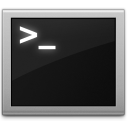
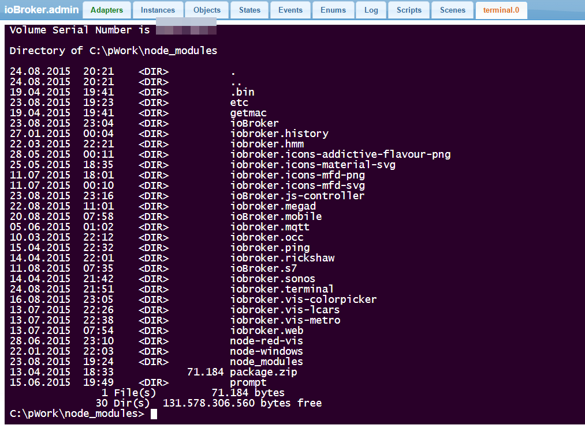

# ioBroker.terminal

**Dieser Adapter nutzt die Sentry-Bibliotheken, um Ausnahmen und Codefehler automatisch an die Entwickler zu melden.** Weitere Details und Informationen zum Deaktivieren der Fehlerberichterstattung finden Sie in [der Sentry-Plugin-Dokumentation](https://github.com/ioBroker/plugin-sentry#plugin-sentry) ! Die Sentry-Berichterstattung wird ab js-controller 3.0 verwendet.

Basierend auf [dem Web-Terminal](https://github.com/rabchev/web-terminal) von rabchev.

Terminalserver zum Öffnen der Befehlszeilenschnittstelle. Bitte verwenden Sie ihn nur für administrative Zwecke.

## Changelog
### 1.0.0 (2022-10-08)
* (bluefox) Check only port of the interface and not of all interfaces
* (Apollon77) Fix some crash cases reported by Sentry
* (Apollon77) Prepare for future js-controller versions

### 0.2.6 (2022-05-12)
* (Apollon77) Fix crash cases as reported by Sentry

### 0.2.5 (2022-04-25)
* (Apollon77/GottZ) Optimize process kill behaviour when using CTRL-C

### 0.2.4 (2022-04-23)
* (Apollon77) Fix pot crash cases reported by Sentry

### 0.2.3 (2022-04-19)
* (Apollon77) Prevent crash when initializing web server with invalid configuration

### 0.2.2 (2022-04-07)
* (Apollon77) Fix initialization of ports

### 0.2.1 (2022-03-13)
* (Apollon77) Fix pot crash cases reported by Sentry (IOBROKER-TERMINAL-1)

### 0.2.0 (2022-03-12)
* (Apollon77) add info-connection state
* (Apollon77) General update and optimizations

### 0.1.2
* (bluefox) show connection state

### 0.1.1
* (bluefox) add command ll

### 0.1.0
* (bluefox) add css style selector

### 0.0.1
* (bluefox) initial commit

## License
The MIT License (MIT)

Copyright (c) 2014-2022 bluefox

Permission is hereby granted, free of charge, to any person obtaining a copy
of this software and associated documentation files (the "Software"), to deal
in the Software without restriction, including without limitation the rights
to use, copy, modify, merge, publish, distribute, sublicense, and/or sell
copies of the Software, and to permit persons to whom the Software is
furnished to do so, subject to the following conditions:

The above copyright notice and this permission notice shall be included in
all copies or substantial portions of the Software.

THE SOFTWARE IS PROVIDED "AS IS", WITHOUT WARRANTY OF ANY KIND, EXPRESS OR
IMPLIED, INCLUDING BUT NOT LIMITED TO THE WARRANTIES OF MERCHANTABILITY,
FITNESS FOR A PARTICULAR PURPOSE AND NONINFRINGEMENT. IN NO EVENT SHALL THE
AUTHORS OR COPYRIGHT HOLDERS BE LIABLE FOR ANY CLAIM, DAMAGES OR OTHER
LIABILITY, WHETHER IN AN ACTION OF CONTRACT, TORT OR OTHERWISE, ARISING FROM,
OUT OF OR IN CONNECTION WITH THE SOFTWARE OR THE USE OR OTHER DEALINGS IN
THE SOFTWARE.