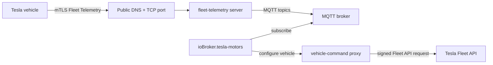

# Einrichtungsanleitung für die Flottentelemetrie

Diese Anleitung erklärt, wie man Tesla Fleet Telemetry zusammen mit dem`ioBroker.tesla-motors` MQTT-Brücke.

Die Flottentelemetrie ist optional. Wenn Sie sie nicht aktivieren, arbeitet der Adapter weiterhin im normalen Abfragemodus der Flotten-API.

> \[!WICHTIG] Für die Flottentelemetrie wird ein Server benötigt, der über das öffentliche Internet erreichbar ist, sowie grundlegende Docker-/Netzwerkkenntnisse. Der Adapter selbst betreibt **keinen** Tesla-Flottentelemetrie-Server. Er empfängt lediglich die MQTT-Nachrichten und konfiguriert das Fahrzeug über die MQTT-Nachrichten.`vehicle-command` Proxy.

## Was Sie aufbauen



Die wichtige Unterscheidung ist:

- **Flotten-Telemetrie-Server** : Empfängt Live-Daten direkt vom Fahrzeug.
- **MQTT-Broker** : Überträgt dekodierte Telemetrienachrichten an ioBroker.
- **vehicle-command proxy** : signiert die Flottentelemetrie-Konfigurationsanfrage.
- **ioBroker-Adapter** : Abonniert MQTT und schreibt Werte in den bestehenden Tesla-Zustandsbaum.

## Bevor Sie beginnen

Sie benötigen:

1. Eine Tesla-Entwickleranwendung, die bereits mit diesem Adapter funktioniert.
2. Der bei Tesla registrierte öffentliche Anwendungsschlüssel.
3. Der virtuelle Schlüssel ist mit dem Fahrzeug gekoppelt.
4. Ein Tesla-Fahrzeug mit Flottentelemetrie-Unterstützung:
   - Firmware`2024.26` oder neuer für normale Flottentelemetrie-Unterstützung,
   - Fahrzeuge des Modells S/X mit Intel Atom-Computern benötigen laut der aktuellen Flottentelemetrie-Dokumentation von Tesla eine neuere Firmware.
5. Ein Server oder eine VM/ein Container, auf dem Docker ausgeführt werden kann.
6. Ein öffentlicher DNS-Name, zum Beispiel`tesla-telemetry.example.com` Die
7. Eine öffentliche TCP-Route vom Internet zum Fleet Telemetry-Server.
8. Ein MQTT-Broker, der vom ioBroker-Host aus erreichbar ist.

## Wichtiger Hinweis zur Netzwerktechnik: Verwenden Sie TCP-Passthrough.

Tesla-Fahrzeuge verbinden sich über Mutual TLS (mTLS) mit dem Fleet Telemetry-Server. Ein herkömmlicher HTTPS-Reverse-Proxy beendet üblicherweise die TLS-Verschlüsselung und baut anschließend eine neue TLS-Verbindung zum Backend auf. Dadurch wird die mTLS-Verbindung unterbrochen, sofern der Proxy nicht speziell konfiguriert ist.

Für eine erste Konfiguration ist folgende Vorgehensweise empfehlenswert:

```text
Internet TCP 443 -> router/firewall/NPM stream/TCP proxy -> fleet-telemetry:443
```

Dies sollte für den Fleet Telemetry-Endpunkt vermieden werden:

```text
Internet HTTPS 443 -> normal HTTPS reverse proxy -> fleet-telemetry:443
```

Die Verwendung des Nginx Proxy Managers ist unproblematisch, wenn Sie einen **Stream-/TCP-Host** und keinen normalen Proxy-Host konfigurieren. Der öffentliche DNS-Name im Adapter muss vom Internet aus zu dieser TCP-Route aufgelöst werden.

## Beispielhaftes Dateilayout

Auf dem Docker-Host:

```text
/opt/tesla-telemetry/
├── docker-compose.yml
├── config/
│   └── fleet-telemetry.json
├── certs/
│   ├── telemetry-ca.crt
│   ├── telemetry-server.crt
│   ├── telemetry-server.key
│   ├── proxy-tls-cert.pem
│   └── proxy-tls-key.pem
└── secrets/
    └── fleet-key.pem
```

Niemals binden`secrets/` oder private Schlüssel zu Git.

## Schritt 1: Zertifikate vorbereiten

Fleet Telemetry benötigt ein Serverzertifikat für den öffentlichen Telemetrie-Hostnamen. Das Fahrzeug muss dieses Zertifikat mithilfe der CA-PEM-Datei, die Sie in den Adaptereinstellungen hinterlegt haben, validieren können.

Die einfachste selbstgehostete Lösung ist eine kleine private Zertifizierungsstelle für den Telemetrieserver. Ersetzen`tesla-telemetry.example.com` mit Ihrem echten öffentlichen Hostnamen:

```sh
mkdir -p /opt/tesla-telemetry/certs /opt/tesla-telemetry/secrets
cd /opt/tesla-telemetry

# Private CA for the telemetry endpoint.
openssl genrsa -out certs/telemetry-ca.key 4096
openssl req -x509 -new -nodes \
  -key certs/telemetry-ca.key \
  -sha256 -days 3650 \
  -out certs/telemetry-ca.crt \
  -subj "/CN=Tesla Fleet Telemetry local CA"

# Server certificate for the public telemetry hostname.
openssl genrsa -out certs/telemetry-server.key 2048
cat > certs/telemetry-server.cnf <<'CERTCONF'
[req]
default_bits = 2048
prompt = no
default_md = sha256
distinguished_name = dn
req_extensions = req_ext

[dn]
CN = tesla-telemetry.example.com

[req_ext]
subjectAltName = @alt_names

[alt_names]
DNS.1 = tesla-telemetry.example.com
CERTCONF

openssl req -new \
  -key certs/telemetry-server.key \
  -out certs/telemetry-server.csr \
  -config certs/telemetry-server.cnf

openssl x509 -req \
  -in certs/telemetry-server.csr \
  -CA certs/telemetry-ca.crt \
  -CAkey certs/telemetry-ca.key \
  -CAcreateserial \
  -out certs/telemetry-server.crt \
  -days 825 -sha256 \
  -extfile certs/telemetry-server.cnf \
  -extensions req_ext
```

Der Inhalt von`certs/telemetry-ca.crt` wird später in das Adapterfeld **Telemetrie-Server CA / vollständige Kette PEM** eingefügt.

Der`vehicle-command` Der Proxy benötigt ebenfalls ein TLS-Zertifikat. Für einen reinen LAN-Proxy ist in der Regel ein selbstsigniertes Zertifikat ausreichend, wenn Sie die Adapteroption **„Unsicheres Fahrzeugbefehls-Proxy-TLS zulassen“** aktivieren.

```sh
openssl req -x509 -newkey rsa:2048 -nodes \
  -keyout certs/proxy-tls-key.pem \
  -out certs/proxy-tls-cert.pem \
  -days 3650 \
  -subj "/CN=vehicle-command.local"
```

## Schritt 2: Platzieren Sie den privaten Schlüssel der Tesla-Anwendung.

Der`vehicle-command` Der Proxy benötigt denselben privaten Schlüssel wie der registrierte öffentliche Schlüssel der Tesla-Anwendung.

Speichern Sie es unter:

```text
/opt/tesla-telemetry/secrets/fleet-key.pem
```

Beispiel:

```sh
nano /opt/tesla-telemetry/secrets/fleet-key.pem
chmod 600 /opt/tesla-telemetry/secrets/fleet-key.pem
```

Diesen Schlüssel dürfen Sie nicht in Problembeschreibungen, Protokolle oder Screenshots einfügen.

## Schritt 3: Erstellen der Flotten-Telemetrie-Serverkonfiguration

Erstellen`/opt/tesla-telemetry/config/fleet-telemetry.json` :

```json
{
  "host": "0.0.0.0",
  "port": 443,
  "status_port": 8080,
  "log_level": "info",
  "json_log_enable": false,
  "namespace": "tesla_telemetry",
  "transmit_decoded_records": true,
  "mqtt": {
    "broker": "192.168.1.10:1883",
    "client_id": "fleet-telemetry",
    "topic_base": "tesla-telemetry",
    "qos": 0,
    "retained": false,
    "connect_timeout_ms": 30000,
    "publish_timeout_ms": 2500,
    "keep_alive_seconds": 30
  },
  "records": {
    "V": ["mqtt"],
    "connectivity": ["mqtt"],
    "errors": ["mqtt"],
    "alerts": ["mqtt"]
  },
  "monitoring": {
    "prometheus_metrics_host": "0.0.0.0",
    "prometheus_metrics_port": 9090
  },
  "tls": {
    "server_cert": "/etc/tesla/certs/server/telemetry-server.crt",
    "server_key": "/etc/tesla/certs/server/telemetry-server.key"
  }
}
```

Anpassen:

- `mqtt.broker` : Ihr MQTT-Broker als`host:port` Die
- `mqtt.topic_base` : muss mit der Adaptereinstellung übereinstimmen. Der Standardwert ist`tesla-telemetry` Die
- Hinzufügen`mqtt.username` Und`mqtt.password` falls Ihr MQTT-Broker eine Anmeldung erfordert.

`transmit_decoded_records=true` Dies ist wichtig, da der Adapter JSON-Nutzdaten auf MQTT erwartet, keine Protobuf-Nutzdaten.

## Schritt 4: Docker Compose erstellen

Erstellen`/opt/tesla-telemetry/docker-compose.yml` :

```yaml
services:
  fleet-telemetry:
    image: tesla/fleet-telemetry:latest
    container_name: fleet-telemetry
    restart: unless-stopped
    command:
      - /fleet-telemetry
      - -config=/etc/fleet-telemetry/config.json
    environment:
      SUPPRESS_TLS_HANDSHAKE_ERROR_LOGGING: "true"
    volumes:
      - ./config/fleet-telemetry.json:/etc/fleet-telemetry/config.json:ro
      - ./certs:/etc/tesla/certs/server:ro
    ports:
      # Public Fleet Telemetry endpoint. Forward your public TCP port to this.
      - "443:443"
      # Optional local status/metrics ports. Do not expose these publicly.
      - "127.0.0.1:8080:8080"
      - "127.0.0.1:9090:9090"

  vehicle-command:
    image: tesla/vehicle-command:latest
    container_name: vehicle-command
    restart: unless-stopped
    command:
      - -tls-key
      - /config/proxy-tls-key.pem
      - -cert
      - /config/proxy-tls-cert.pem
      - -key-file
      - /run/secrets/fleet-key.pem
      - -host
      - 0.0.0.0
      - -port
      - "4443"
    volumes:
      - ./certs:/config:ro
      - ./secrets:/run/secrets:ro
    ports:
      # If ioBroker runs on the same host, keep this on 127.0.0.1.
      # If ioBroker runs on another LAN host, bind this to the LAN IP instead.
      - "127.0.0.1:4443:4443"
```

Wenn Ihr ioBroker-Host nicht der Docker-Host ist, ändern Sie die letzte Zeile in eine reine LAN-Bindung, zum Beispiel:

```yaml
      - "192.168.1.20:4443:4443"
```

Nicht aussetzen`vehicle-command` zum öffentlichen Internet.

Starten Sie die Dienste:

```sh
cd /opt/tesla-telemetry
docker compose up -d
docker compose ps
```

Protokolle prüfen:

```sh
docker logs --tail 100 fleet-telemetry
docker logs --tail 100 vehicle-command
```

## Schritt 5: Den Flotten-Telemetrie-Endpunkt freigeben

Erstellen Sie DNS- und Routing-Einstellungen für Ihren öffentlichen Hostnamen, zum Beispiel:

```text
tesla-telemetry.example.com -> your public IP
```

Leite den öffentlichen TCP-Port an den Docker-Host weiter:

```text
public tesla-telemetry.example.com:443 -> docker-host:443
```

Wenn Sie den Nginx Proxy Manager verwenden, nutzen Sie **Streams** / **TCP-Weiterleitung** und keinen normalen HTTPS-Proxy-Host.

Validieren Sie anschließend den öffentlichen Endpunkt von außerhalb Ihres Netzwerks. Tesla stellt hierfür eine Funktion bereit.`check_server_cert.sh` Das Skript befindet sich im Fleet Telemetry-Repository. Führen Sie es mit demselben Hostnamen und Port aus, die Sie im Adapter eingeben werden.

## Schritt 6: Adapter konfigurieren

Öffnen Sie die Adapterinstanzkonfiguration in ioBroker.

### Registerkarte Flottentelemetrie

Satz:

| Adaptereinstellung                            | Beispiel                                        | Anmerkungen                                                                   |
| --------------------------------------------- | ----------------------------------------------- | ----------------------------------------------------------------------------- |
| Flottentelemetrie-Modus aktivieren            | ermöglicht                                      | Aktiviert die MQTT-Datenerfassung.                                            |
| Fahrzeugbefehls-Proxy-URL                     | `https://192.168.1.20:4443`                     | LAN/interne URL des Proxys.                                                   |
| Unsicheres Proxy-TLS zulassen                 | Für selbstsigniertes Proxy-Zertifikat aktiviert | Deaktivieren, wenn das Proxy-Zertifikat als vertrauenswürdig eingestuft wird. |
| Hostname des Telemetrieservers                | `tesla-telemetry.example.com`                   | Öffentlicher Hostname, der vom Auto aus erreichbar ist.                       |
| Telemetrie-Server-Port                        | `443`                                           | Muss mit der öffentlichen TCP-Route übereinstimmen.                           |
| Telemetrie-Server CA / vollständige Kette PEM | Inhalt von`telemetry-ca.crt`                    | Zertifizierungsstelle, die das Serverzertifikat validiert.                    |
| MQTT-Broker                                   | `192.168.1.10:1883`                             | Der Broker ist über ioBroker erreichbar.                                      |
| MQTT-Themenbasis                              | `tesla-telemetry`                               | Muss übereinstimmen`mqtt.topic_base` Die                                      |
| Normales Aktualisierungsintervall             | z.B`7200` oder`0`                               | Periodische Fleet-API-Synchronisierung;`0` deaktiviert es.                    |

### Registerkarte „Flottentelemetrie“

Beginnen Sie mit der Standardeinstellung. Diese ist für gängige Anwendungsfälle im Zusammenhang mit Ladevorgängen und Fahrzeugstatus optimiert. Die Felder sind in der Admin-Oberfläche in ausklappbare Kategorien unterteilt, sodass nur die Kategorie geöffnet sein muss, die Sie bearbeiten.

Nützliche Standardeinstellungen:

- `Soc` : Intervall`1` , minimales Delta`1` Prozent.
- `Location` : Intervall`10` , minimales Delta`100 m` Die
- Lade-/Sperr-/Kabelfelder: kurze Intervalle, da sie sich selten ändern, aber schnell abgebildet werden sollten.

Tesla sendet weiterhin nur dann Werte, wenn beide Bedingungen erfüllt sind:

1. die konfigurierte`interval_seconds` verstrichen, und
2. Der Wert hat sich so weit verändert, dass er ausgegeben werden musste.

Für numerische Felder mit`minimum_delta` Kleinere Änderungen werden unterdrückt, bevor sie zu abrechnungsrelevanten Signalen führen.

## Schritt 7: Führen Sie die Administratoraktionen aus

Verwenden Sie die Schaltflächen auf der Adapter-Administrationsseite in dieser Reihenfolge:

1. **Flottenstatus prüfen**
   - bestätigt, dass Tesla den Status Ihres Fahrzeugs und Ihres Schlüssels meldet.
2. **Flottentelemetrie konfigurieren**
   - sendet die generierte Konfiguration an das Fahrzeug über`vehicle-command` Die
3. **Flottenkonfiguration lesen**
   - überprüft, ob Tesla die Konfiguration meldet und`synced=true` Die

Erwartete Adapterzustände:

```text
tesla-motors.0.info.telemetryConfigured = true
tesla-motors.0.info.telemetrySynced     = true
tesla-motors.0.info.telemetryConnected  = true
```

## Schritt 8: Eingehende Daten überprüfen

Abonnieren Sie auf dem MQTT-Broker das Thema „base“:

```sh
mosquitto_sub -h 192.168.1.10 -p 1883 -t 'tesla-telemetry/#' -v
```

Sie sollten Themen wie die folgenden sehen:

```text
tesla-telemetry/<VIN>/connectivity {...}
tesla-telemetry/<VIN>/v/Soc 57.2
tesla-telemetry/<VIN>/v/DetailedChargeState "DetailedChargeStateCharging"
```

Überprüfen Sie in ioBroker die aktualisierten Tesla-Status, zum Beispiel:

```text
tesla-motors.0.<VIN>.charge_state.battery_level
tesla-motors.0.<VIN>.charge_state.charging_state
tesla-motors.0.<VIN>.charge_state.conn_charge_cable
tesla-motors.0.<VIN>.vehicle_state.locked
tesla-motors.0.<VIN>.telemetry.connectivity
```

Nicht zugeordnete, aber ausgewählte Felder sind als Rohtelemetriezustände unter folgender Adresse verfügbar:

```text
tesla-motors.0.<VIN>.telemetry.fields.<FieldName>
```

## Fehlerbehebung

| Symptom / Fehler                                      | Wahrscheinliche Ursache                                                                                                  | Was zu überprüfen ist                                                                                                                                                                           |
| ----------------------------------------------------- | ------------------------------------------------------------------------------------------------------------------------ | ----------------------------------------------------------------------------------------------------------------------------------------------------------------------------------------------- |
| `missing_key`                                         | Der virtuelle Schlüssel ist nicht mit dem Fahrzeug gekoppelt.                                                            | Offen`https://tesla.com/_ak/<your-domain>` auf einem Smartphone mit der Tesla-App den Schlüssel koppeln.                                                                                        |
| `unsupported_firmware`                                | Die Fahrzeug-Firmware ist zu alt für die Flottentelemetrie.                                                              | Aktualisieren Sie die Fahrzeug-Firmware und prüfen Sie die aktuellen Voraussetzungen von Tesla.                                                                                                 |
| `streaming_toggle_disabled`                           | Fahrzeugmeldungen: Telemetrie-Streaming deaktiviert.                                                                     | Fahrzeug-/Flotteneinstellungen und Firmware-Unterstützung prüfen.                                                                                                                               |
| `max_configs`                                         | Das Fahrzeug verfügt bereits über zu viele Flottentelemetrie-Konfigurationen.                                            | Entferne eine nicht verwendete Konfiguration aus einer anderen App oder verwende **die Funktion "Fleet-Konfiguration für diese App löschen** ".                                                 |
| `telemetrySynced=false`                               | Tesla hat die Konfiguration akzeptiert, aber das Fahrzeug hat sie noch nicht synchronisiert.                             | Das Auto aktivieren, einige Minuten warten und dann **die Funktion "Flottenkonfiguration lesen"** erneut verwenden.                                                                             |
| MQTT-Verbindung hergestellt, aber keine Fahrzeugdaten | Fahrzeug im Ruhemodus, Konfiguration nicht synchronisiert, falsche öffentliche Route oder falsche Zertifizierungsstelle. | Überprüfen`fleet-telemetry` Protokolle, Teslas Zertifikatsprüfungsskript ausführen, öffentliche TCP-Passthrough-Verbindung überprüfen.                                                          |
| Keine Standortfelder                                  | OAuth-Bereich`vehicle_location` fehlt.                                                                                   | Fügen Sie den Bereich in der Tesla Developer App hinzu, setzen Sie die Anmelde-/Token-Informationen im Adapter zurück, autorisieren Sie erneut und konfigurieren Sie die Flottentelemetrie neu. |
| TLS-Handshake-Fehler in den Protokollen               | Häufig liegt es an zufälligen Internet-Scannern oder am falschen Proxy-Modus.                                            | Wenn weiterhin Daten eintreffen, können Scannergeräusche ignoriert werden; andernfalls überprüfen Sie die TCP-Passthrough-Funktion und die Zertifikatskette.                                    |
| Adapter zeigt`telemetryLastError`                     | Letzter MQTT/Proxy/Konfigurationsfehler.                                                                                 | Weitere Einzelheiten finden Sie im Statuswert und im Adapterprotokoll.                                                                                                                          |

## Sicherer Rollback

Falls etwas nicht funktioniert, deaktivieren Sie **den Flotten-Telemetrie-Modus** im Adapter und starten Sie die Instanz neu. Der Adapter kehrt dann zu seinem normalen Abfrageverhalten zurück.

Um die fahrzeugseitige Telemetriekonfiguration für diese Anwendung zu entfernen, verwenden Sie die Administratoraktion **"Flottenkonfiguration löschen"** .

## Sicherheitscheckliste

- Nicht aussetzen`vehicle-command` öffentlich.
- Halten`fleet-key.pem` Privat.
- Bevorzugen Sie Firewall-Regeln, damit nur der ioBroker-Host erreichen kann`vehicle-command` Die
- Nur den Fleet Telemetry mTLS-Port sollen dem Internet zugänglich gemacht werden.
- Halten Sie Docker-Images auf dem neuesten Stand.
- Verwenden Sie eine dedizierte Subdomain für die Flottentelemetrie.

## Referenzen

- Tesla-Flottentelemetrie-Dokumentation: <https://developer.tesla.com/docs/fleet-api/fleet-telemetry>
- Tesla Flottentelemetrie-Referenzserver: <https://github.com/teslamotors/fleet-telemetry>
- Tesla Flotten-Telemetrie-MQTT-Datenspeicher: <https://github.com/teslamotors/fleet-telemetry/tree/main/datastore/mqtt>
- Tesla Fahrzeugbefehls-Proxy: <https://github.com/teslamotors/vehicle-command>