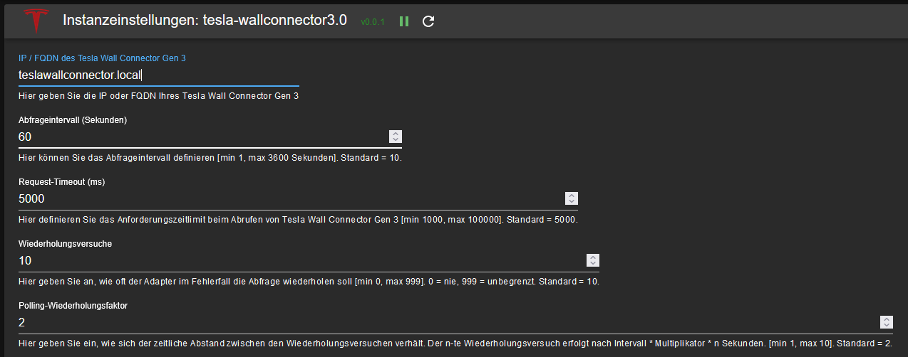

#  ioBroker.tesla-wallconnector3

## Tesla Wall Connector Gen 3 Adapter für ioBroker

Liest Live-Daten eines Tesla Wall Connector Gen 3 im lokalen Netzwerk aus. Alle Datenpunkte sind schreibgeschützt (die API der Wallbox unterstützt keinen Schreibzugriff).

## Konfiguration

### Einstellungen

| Feld | Beschreibung |
|:-----|:-------------|
| Tesla Wall Connector Gen 3 | IP-Adresse oder Hostname der Wallbox (z. B. `192.168.1.50` oder `wallbox.local`). Nur die reine Adresse eingeben — kein Schema (`http://`), kein Port, kein Pfad, keine Zugangsdaten, kein IPv6 in eckigen Klammern. Ein leeres Feld oder `0.0.0.0` wird als nicht konfiguriert behandelt und verhindert die Abfrage. |
| Abfrageintervall | Wie oft der Adapter Daten von der Wallbox liest, in Sekunden. Standard: 10. Bereich: 1 - 3600. |
| Request-Timeout | Maximale Wartezeit auf eine Antwort der Wallbox, in Millisekunden. Standard: 5000. Bereich: 1000 - 10000. |
| Wiederholungsversuche | Wie oft nach einem fehlgeschlagenen Abruf erneut versucht wird. Der Wert bedeutet Wiederholungen nach dem initialen Fehlversuch. 0 = keine Wiederholungen, 999 = unbegrenzt. Standard: 10. |
| Polling-Wiederholungsfaktor | Vergrößert den Abstand zwischen Wiederholungen. Der n-te Versuch erfolgt nach Intervall x Faktor x n Sekunden. Beispiel mit Standardwerten: 1. Wiederholung nach 20 s, 2. nach 40 s. Wird nach einem erfolgreichen Abruf zurückgesetzt. Standard: 2. Bereich: 1 - 10. |
| Split-Phase-Leistungsberechnung | Für nordamerikanische Split-Phase-Installationen aktivieren. Verwendet grid_v x vehicle_current_a anstelle der phasenweisen V x A Summe. Standard: deaktiviert (Dreiphasen-Berechnung). |

Nach dem Speichern startet der Adapter neu und beginnt sofort mit der Abfrage.

## Datenpunkte

Alle Datenpunkte sind schreibgeschützt. Der Adapter fragt die Wallbox-API ab und erstellt für jeden zurückgegebenen Wert einen Datenpunkt.

### info

| Datenpunkt | Typ | Beschreibung |
|:-----------|:---:|:-------------|
| info.connection | boolean | `true` wenn der Adapter die Wallbox erreichen kann und gültige Antworten erhält. |

### vitals

Live-Betriebsdaten, bei jedem Abfrageintervall aktualisiert.

| Datenpunkt | Typ | Beschreibung |
|:-----------|:---:|:-------------|
| evse_state | number | Ladezustand (siehe Tabelle unten) |
| vehicle_connected | boolean | Ob ein Fahrzeug angeschlossen ist |
| vehicle_current_a | number | Vom Fahrzeug gezogener Strom (A) |
| session_energy_wh | number | In der aktuellen Sitzung gelieferte Energie (Wh) |
| power_w | number | Ladeleistung (W), vom Adapter berechnet. Dreiphasen-Modus: Summe aus V x A pro Phase. Split-Phase-Modus: grid_v x vehicle_current_a. |
| session_s | number | Dauer der aktuellen Ladesitzung (s) |
| contactor_closed | boolean | Ob das Laderelais geschlossen ist |
| grid_v | number | Netzspannung (V) |
| grid_hz | number | Netzfrequenz (Hz) |
| voltageA_v, voltageB_v, voltageC_v | number | Spannung pro Phase (V) |
| currentA_a, currentB_a, currentC_a, currentN_a | number | Strom pro Phase (A) |
| pcba_temp_c, mcu_temp_c, handle_temp_c | number | Temperaturwerte (°C) |
| relay_coil_v | number | Relais-Spulenspannung (V) |
| relay_k1_v | number | Relais K1 Spannung (V) |
| relay_k2_v | number | Relais K2 Spannung (V) |
| prox_v | number | Proximity-Pilot-Spannung (V) |
| pilot_high_v | number | Control-Pilot High Spannung (V) |
| pilot_low_v | number | Control-Pilot Low Spannung (V) |
| input_thermopile_uv | number | Thermopile-Sensorwert |
| config_status | number | Konfigurationsstatus |
| uptime_s | number | Betriebszeit der Wallbox (s) |
| current_alerts | string (JSON) | Aktive Alarme als JSON-Array (z. B. `"[]"`). Numerische Kind-Datenpunkte (`.0`, `.1`, ...) werden aus Kompatibilitätsgründen beibehalten und bei Verkleinerung des Arrays automatisch bereinigt. |
| evse_not_ready_reasons | string (JSON) | Gründe für Nicht-Bereitschaft als JSON-Array. Kind-Datenpunkte wie bei current_alerts. |

**EVSE-State-Codes:**

| Code | Bedeutung |
|:----:|:----------|
| 0 | Wallbox startet |
| 1 | Idle |
| 2 | Fahrzeug angeschlossen, aber nicht ladebereit |
| 4 | Fahrzeug angeschlossen und ladebereit |
| 6 | Fahrzeug angeschlossen, Handshake läuft |
| 8 | Laden beendet oder unterbrochen |
| 9 | Ladebereit, wartet auf Fahrzeug |
| 10 | Laden mit reduzierter Leistung (< 3 Phasen je 16 Ampere) |
| 11 | Laden mit voller Leistung (3 Phasen, je 16 A) |

*Die States 3, 5, 7 und 12 sind undokumentiert. Falls Sie deren Bedeutung kennen, sind Pull-Requests willkommen!*

### lifetime

Kumulative Statistiken über die Lebensdauer der Wallbox. Wird maximal alle 60 Sekunden abgefragt.

| Datenpunkt | Typ | Beschreibung |
|:-----------|:---:|:-------------|
| energy_wh | number | Gesamte gelieferte Energie (Wh) |
| charge_starts | number | Anzahl gestarteter Ladevorgänge |
| charging_time_s | number | Gesamte Ladezeit (s) |
| uptime_s | number | Gesamte Betriebszeit (s) |
| contactor_cycles | number | Anzahl der Relais-Schaltzyklen |
| connector_cycles | number | Anzahl der Ein-/Aussteck-Zyklen |
| alert_count | number | Gesamtanzahl der Alarme |

### version

Firmware- und Hardware-Identifikation. Wird beim Start, nach Wiederverbindung und maximal einmal pro Stunde abgefragt.

| Datenpunkt | Typ | Beschreibung |
|:-----------|:---:|:-------------|
| firmware_version | string | Firmware-Version |
| serial_number | string | Seriennummer |
| part_number | string | Teilenummer |

Weitere Datenpunkte wie `git_branch`, `web_service` und IEEE 1547 CRC-Prüfsummen können je nach Firmware-Version vorhanden sein.

### wifi_status

WLAN-Verbindungsdaten. Wird maximal alle 60 Sekunden abgefragt.

| Datenpunkt | Typ | Beschreibung |
|:-----------|:---:|:-------------|
| wifi_connected | boolean | Ob die Wallbox mit dem WLAN verbunden ist |
| internet | boolean | Ob die Wallbox Internetzugang hat |
| wifi_ssid | string | Verbundene SSID |
| wifi_infra_ip | string | IP-Adresse im WLAN |
| wifi_mac | string | MAC-Adresse |
| wifi_signal_strength | number | Signalstärke (einheitenloser Qualitätswert, höher = besser) |
| wifi_rssi | number | RSSI-Wert (dBm) |
| wifi_snr | number | Signal-Rausch-Verhältnis (dB) |

*Der Adapter erstellt dynamisch Datenpunkte für alle von der API zurückgegebenen Werte. Je nach Firmware-Version kann Ihre Wallbox weitere, hier nicht aufgeführte Datenpunkte liefern.*

## Abfrageverhalten

Der Adapter verteilt die Anfragen zeitlich, um den eingebetteten Webserver der Wallbox nicht zu überlasten:

| Endpunkt | Häufigkeit |
|:---------|:-----------|
| vitals | Bei jedem Abfrageintervall |
| lifetime | Maximal alle 60 Sekunden |
| wifi_status | Maximal alle 60 Sekunden |
| version | Beim Start, nach Wiederverbindung und maximal einmal pro Stunde |

Anfragen werden nacheinander (sequentiell) gesendet. Wenn ein einzelner Endpunkt fehlschlägt, werden die anderen Endpunkte trotzdem normal verarbeitet. Fehlgeschlagene Endpunkte werden beim nächsten fälligen Zyklus erneut abgefragt.

Der Adapter repariert automatisch bekannte Tesla-Firmware-JSON-Fehler (bare `nan`-Werte, fehlende schließende Klammer) vor dem Parsen der Antworten.

## Haftungsausschluss

**Alle Produkt- und Firmennamen oder Logos sind Marken™ oder eingetragene® Marken der jeweiligen Inhaber. Ihre Verwendung impliziert keine Zugehörigkeit zu oder Billigung durch diese oder deren Tochtergesellschaften! Dieses persönliche Projekt wird in der Freizeit gepflegt und verfolgt kein geschäftliches Ziel.**

**Die Standardeinstellungen sollten für den normalen Betrieb sicher sein.** Ein zu kurzes Abfrageintervall kann den eingebetteten Webserver des Wall Connectors überlasten. Falls die Wallbox nicht mehr reagiert, erhöhen Sie das Intervall oder stoppen Sie den Adapter.

**Keine Garantie und keine Haftung.** Dieser Adapter ist ein Freizeitprojekt, bereitgestellt unter der MIT-Lizenz. Er liest Daten eines Tesla Wall Connectors über eine lokale, nicht dokumentierte API aus. Der Autor übernimmt keinerlei Haftung für Folgen der Nutzung und kann keine Aussage darüber treffen, ob die Nutzung Ihre Garantie- oder Supportvereinbarungen mit Tesla oder Ihrem Installateur beeinflusst. Wenn das für Sie nicht akzeptabel ist, verwenden Sie diesen Adapter bitte nicht.

## Changelog
<!--
  Placeholder for the next version (at the beginning of the line):
  ### **WORK IN PROGRESS**
-->
### 1.3.1 (2026-08-14)
- Dependency updates

### 1.3.0 (2026-08-04)
- Added North American split-phase power calculation mode (splitPhase setting)
- Added recovery for malformed wallbox responses (bare nan, Infinity, and truncated data)
- Added address validation: clearer error messages for misconfigured wallbox addresses
- Added 2 MiB response size limit
- Fixed connection status flapping when the wallbox was partially reachable
- Fixed charging power (power_w) sometimes showing a stale value after charging stops — now always 0 when not charging
- Fixed handling of additional malformed sensor readings from certain firmware versions
- Fixed unavailable sensor readings showing as empty instead of 0
- Fixed state types sometimes changing unexpectedly, including after adapter restart
- Fixed alerts and not-ready reasons not updating correctly when the list changes
- Fixed all data refreshing immediately after connection loss recovery
- Fixed retry count being off by one compared to the configured value
- Fixed rare state updates still happening briefly after adapter shutdown
- Fixed timeout help text showing wrong maximum (now correctly shows 10000 ms)
- Fixed wallbox requests failing on systems with an HTTP proxy configured
- Corrected WiFi signal strength metadata
- Fixed database errors no longer triggering unnecessary reconnection attempts
- Reduced load on wallbox: version data polled hourly, WiFi and lifetime data every 60 seconds
- Expanded and corrected documentation

### 1.2.0 (2026-07-20)
- (copilot) Adapter requires node.js >= 22 now
- Added IEEE 1547 CRC state attributes
- Fixed adapter checker warnings (jsonConfig, pollingTimeout)
- Replaced plain setTimeout with adapter-managed timers
- Added calculated charging power state (vitals.power_w)
- Added specific ioBroker roles for all states
- Simplified state attribute definitions
- Fixed startup recovery: adapter now retries if wallbox is unreachable at start
- Capped retry delay at 1 hour
- Fixed state attribute typos and placeholder names
- Updated documentation

### 1.1.0 (2026-03-30)
- (iobroker-bot) Adapter requires node.js >= 20 now.
- Added state attributes (and moved notifications to debug from info)
- Code optimization
- Migration to i18n

### 1.0.6 (NoBl)
* Maintenance update (dependencies, ...)

[Older changelogs can be found there](CHANGELOG_OLD.md)

## License
MIT License

Copyright (c) 2024-2026 Norbert Bluemle <github@bluemle.org>

Permission is hereby granted, free of charge, to any person obtaining a copy
of this software and associated documentation files (the "Software"), to deal
in the Software without restriction, including without limitation the rights
to use, copy, modify, merge, publish, distribute, sublicense, and/or sell
copies of the Software, and to permit persons to whom the Software is
furnished to do so, subject to the following conditions:

The above copyright notice and this permission notice shall be included in all
copies or substantial portions of the Software.

THE SOFTWARE IS PROVIDED "AS IS", WITHOUT WARRANTY OF ANY KIND, EXPRESS OR
IMPLIED, INCLUDING BUT NOT LIMITED TO THE WARRANTIES OF MERCHANTABILITY,
FITNESS FOR A PARTICULAR PURPOSE AND NONINFRINGEMENT. IN NO EVENT SHALL THE
AUTHORS OR COPYRIGHT HOLDERS BE LIABLE FOR ANY CLAIM, DAMAGES OR OTHER
LIABILITY, WHETHER IN AN ACTION OF CONTRACT, TORT OR OTHERWISE, ARISING FROM,
OUT OF OR IN CONNECTION WITH THE SOFTWARE OR THE USE OR OTHER DEALINGS IN THE
SOFTWARE.