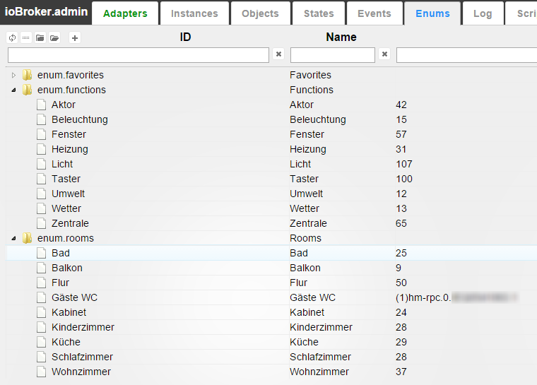

# IoBroker.text2command
## Beschreibung
Dieser Adapter kann normale Sätze, wie `Switch light in kitchen on`, in bestimmte Befehle umwandeln und setzt den Zustand `adapter.0.device.kitchenLight` auf `true`.

Dieser Adapter macht keinen Sinn, um eigenständig aktiviert zu werden. Es sollte mit anderen Adaptern wie Telegram oder Android App **`iobroker.vis`** verwendet werden.

## Verwendung
Um den Befehl auszuführen, schreiben Sie den Zustand **`text2command.<INSTANCE>.text`** mit dem Satz. Die Antwort erhalten Sie immer in `text2command.<INSTANCE>.response`.

Wenn Sie **Antwort auf ID** definieren, wird die Antwort auch in diese ID geschrieben. Dies wird z.B. um zu erkennen, dass die Stimme bestätigt.

Sie können eine Nachricht über `sendTo` aus Javascript senden. Die Antwort kommt in der Nachricht zurück:

```
sendTo('text2command', 'Switch light in kitchen on', function (err, response) {
    console.log('Response is: ' + response);
});
```

Reguläre Ausdrücke können verwendet werden, wie: `/^light\son|^lamp\son/`. Bei regulären Ausdrücken wird immer zwischen Groß- und Kleinschreibung unterschieden.

Um "Ein-/Ausschalten nach Funktion" zu verwenden, sollten Sie sich um die Funktionen kümmern.

Schlüsselwörter funktionieren wie folgt:

- Schlüsselwörter werden durch Leerzeichen getrennt
- Alle Schlüsselwörter müssen in einem Satz vorhanden sein, um eine Regel auszulösen: z. Schlüsselwort: "Licht an" wird auf "Licht anschalten", "Überall Licht anmachen" auslösen und nicht auf "Anschalten", "Licht machen".
- Ein Schlüsselwort kann viele Formen haben. Variationen des Schlüsselworts müssen durch "/" geteilt werden. Z.B. Schlüsselwörter: `switch/make/do light on/true` triggert auf: `do light true`, `make please light on`.
- Wenn Schlüsselwörter in vielen Fällen vorkommen können (Nom, Gen, Akkusativ, Plural, ...), müssen sie alle als Variationen aufgeführt werden, z. B.: `Licht/Lichter einschalten`.

Folgende Funktionen werden interpretiert als

`enum.functions`:

**`enum.functions.light`** (Licht | Свет):

- Rollen - `level.dimmer`
- Rollen - `switch.light`

**`enum.functions.backlight`** (Beleuchtung | Подсветка):

- Rollen - `level.backlight`
- Rollen - `switch.backlight`

**`enum.functions.blinds/shutter`** (Rollladen | Жалюзи/окна)

- Rollen - `level.blind`
- Rollen - `switch.blind`

**`enum.functions.curtain`** (Vorhänge | Шторы)

- Rollen - `level.curtain`
- Rollen - `switch.curtain`

**`enum.functions.heating`** (Heizung | Отопление/Подогрев)

- Rollen - `level.temperature`
- Rollen - `switch.temperature`

**`enum.functions.music`** (Musik | Музыка)

- Rollen - `button.play`
- Rollen - `button.stop` / `button.pause`

**`enum.functions.alarm/security`** (Alarmanlage / Alarm | Охрана)

- Rollen - `switch.security`

**`enum.functions.lock`** (Schloß / Schloss | Замок)

- Rollen - `switch.open`
- Rollen - `switch.lock`

Folgende Räume werden unterstützt:

| Schlüsselwort in Phrase | Mögliche enum.rooms in englisch | auf deutsch | auf russisch |
|-----------------------|---------------------------------|--------------------------|------------------|
| überall | überall | - | - |
| leben | Wohnzimmer | Wohnzimmer | зал |
| Schlafzimmer | Schlafzimmer/Schlafzimmer | Schlafzimmer | спальня |
| Bad | Badezimmer/Badewanne | badezimmer/bad | ванная |
| Arbeiten/Büro | Büro | Arbeitszimmer | кабинет |
| Kinder/Kind/Kindergarten | Kindergarten | Kinderzimmer | детская |
| Gäste-WC/Gästeschrank | Gäste-WC | gästewc | гостевой туалет |
| WC/Schrank | Toilette | Toilette | туалет |
| Etage/eintreten | Etage | diele/gang/flur | коридор/прихожая |
| Küche | Küche | küche/küche | кухня |
| Balkon/Terrasse/Patio | Terrasse | Balkon/Terrasse | терраса/балкон |
| Abendessen | Esszimmer | esszimmer | столовая |
| Garage | Garage | Garage | гараж |
| Treppe | Treppe | Trepe/Treppenhaus | лестница |
| Garten | Garten | Garten | сад |
| Hof/Hof | Gericht | Hof | двор |
| Gästezimmer | Gästezimmer | Gästezimmer | гостевая |
| Dachboden | Dachboden | Speicher | кладовка |
| Dach | Dach | dachstuhl | крыша |
| Klemme | Klemme | Anschlussraum | сени |
| Waschraum | Waschraum | Waschraum | прачечная |
| Wärmeraum | Heizraum | heizungsraum/heizungsraum | котельная |
| Hütte | Hütte | schuppen/scheune | сарай |
| Sommerhaus | Sommerhaus | gartenhaus | теплица |

Sie können Muster in Bestätigungen verwenden:

- `%s`: Wert
- `%u`: Einheit
- `%n`: Name (geplant!)
- `{objectId}`: Der Status dieser Objekt-ID wird hier abgelegt

Folgende Befehle werden unterstützt:

### Wie spät ist es?
Antwort: 14:56 (aktuelle Zeit)

### Wie heissen Sie?
Die Antwort ist anpassbar. Standard: `My name is Alpha`

### Wie ist die Außentemperatur?
Der Benutzer muss die Status-ID angeben, wo die Außentemperatur abzulesen ist.
Die Antwort ist anpassbar. Default: `Outside temperature is %s %u` **`%s`** wird durch Temperatur ersetzt, auf Ganzzahl gerundet. **`%u`** wird durch Einheiten dieses Zustands oder durch Systemtemperatureinheiten ersetzt.

### Wie hoch ist die Innentemperatur?
Der Benutzer muss die Status-ID angeben, wo die Innentemperatur abzulesen ist.
Die Antwort ist anpassbar. Default: `Inside temperature is %s %u` **`%s`** wird durch Temperatur ersetzt, auf Ganzzahl gerundet. **`%u`** wird durch Einheiten dieses Zustands oder durch Systemtemperatureinheiten ersetzt.

### Ein-/Ausschalten nach Funktion
Dieser Befehl liest Informationen aus Aufzählungen. Es verwendet `enum.functions`, um den Gerätetyp zu finden (z. B. Licht, Wecker, Musik) und `enum.rooms`, um den Raumnamen zu erkennen.

Beispiel auf Deutsch: 

Schlüsselwörter zum Einschalten sind: *einschalten*, z.B. `switch rear light in bath on`

Schlüsselwörter zum Ausschalten sind: *ausschalten*, z.B. `switch light in living room off`

Antwort wird auf Wunsch automatisch generiert: `Switch off %function% in %room%`, wobei `%function%` und `%room%` durch gefundenen Gerätetyp und Standort ersetzt werden.

Der Befehl akzeptiert auch den numerischen Wert. Es hat Vorrang, z.B. im Befehl `switch light off in living room on 15%` wird das Licht auf 15% gesetzt und nicht in *aus* Zustand.

Sie können Standardraum in [] definieren. Z.B. `switch the light on[sleepingroom]`

### Jalousien öffnen/schließen
Dieser Befehl liest Informationen aus Aufzählungen. Es verwendet **`enum.functions.blind`**, um den Typ Jalousien oder Rollläden zu finden, und **`enum.rooms`**, um den Raumnamen zu erkennen.

Schlüsselwörter zum Hochfahren der Jalousien sind: *Jalousien hoch*, z. `set blinds up in sleeping room`

Stichworte zum Herunterfahren der Jalousie sind: *Jalousie runter*, z.B. `move blinds down in office`

Sie können die genaue Jalousieposition in Prozent angeben, z. `move blinds to 40 percent in office`

Antwort wird auf Wunsch automatisch generiert: ` in %room%`, wobei %room% durch gefundenen Gerätetyp und Standort ersetzt wird.

### Etwas ein-/ausschalten
Der Benutzer muss die Zustands-ID des zu steuernden Geräts und den zu schreibenden Wert angeben.

Sie sollten eine Regel für jede Position erstellen (z. B. für `on` und für `off`).

Die Antwort ist anpassbar. Standard: `Switched on`

Z.B.:

- `Alarm deaktivieren`, Objekt-ID: `hm-rpc.0.alarm`, Wert: `false`, Antwort: `Alarm ist deaktiviert/Deaktiviert`. In diesem Fall wird die Antwort zwischen *Alarm ist deaktiviert* und *Deaktiviert* randomisiert.
- `Alarm aktivieren`, Objekt-ID: `hm-rpc.0.alarm`, Wert: `true`, Antwort: `Alarm ist aktiviert/Aktiviert/Fertig` . In diesem Fall wird die Antwort zwischen *Alarm ist aktiviert*, *Aktiviert* und *Fertig* gemischt.

*Deaktivieren* muss in der Liste an erster Stelle stehen, da es länger ist.

Sie können Float-Werte in den Steuerbefehlen verwenden. Wenn im Text ein numerischer Wert enthalten ist, wird dieser als Kontrollwert verwendet und der vordefinierte Wert wird ignoriert.

Z.B. für Regel:

- `Set light level`, Object ID: `hm-rpc.0.light.STATE`, Value: `10`, Antwort: `Level set to %s%`.

Wenn der Befehl wie `Set light level to 50%` ist, dann wird in `hm-rpc.0.light.STATE` 50 geschrieben und die Antwort wird `Level set to 50%` sein.

Wenn der Befehl wie `Set light level` ist, wird in `hm-rpc.0.light.STATE` eine 10 geschrieben und die Antwort wird `Level set to 10%` sein.

### Nach etwas fragen
Der Benutzer muss die Status-ID des Geräts angeben, dessen Wert gelesen wird.
Diese Vorlage antwortet mit Informationen aus einem bestimmten Staat.

Z.B.:

- `Fenster geöffnet`, Objekt-ID: `javascript.0.countOpenedWindows`, Bestätigung: `Tatsächlich %s Fenster geöffnet`
- `Temperatur Schlafraum`, Objekt-ID: `hm-rpc.0.sleepingRoomSensor.TEMPERATURE`, Bestätigung: `Aktuelle Temperatur im Schlafraum ist %s %u/%s %u`. In diesem Fall wird die Antwort randomisiert zwischen *Aktuelle Temperatur im Schlafzimmer ist %s %u* und *%s %u*.

### Text an Staat senden
Sie können einen Text in den Zustand schreiben. Der Benutzer muss die Status-ID angeben, um Text darin zu schreiben.

Z.B. Regel: `email [to] wife`, Objekt-ID: `javascript.0.emailToWife`, Bestätigung: `Email sent` Text: `Send email to my wife: I will be late`. Adapter sucht nach dem letzten Wort von Schlüsselwörtern (in diesem Fall `wife`), extrahiert Text aus dem nächsten Wort (in diesem Fall `I will be late`) und schreibt diesen Text in `javascript.0.emailToWife`.
Das Wort `to` ist nicht erforderlich, um die Regel auszulösen, wird aber aus dem Text entfernt.

### Du bist gut (Nur zum Spaß)
Die Antwort ist anpassbar. Standard: `Thank you` oder `You are welcome`

### Danke (Nur so zum Spaß)
Die Antwort ist anpassbar. Standard: `No problem` oder `You are welcome`

### Antwort erstellen
Sie können eine Antwort mit Bindungen {objectId} in Bestätigung generieren. Wird für Alexa verwendet.

Z.B.:

- `Fenster geöffnet`, Bestätigung: `Tatsächliche {javascript.0.countOpenedWindows} Fenster geöffnet`
- `Temperatur Schlafraum`, Bestätigung: `Aktuelle Temperatur im Schlafraum ist {t: hm-rpc.0.sleepingRoomSensor.TEMPERATURE; Math.round(t)}/{hm-rpc.0.sleepingRoomSensor.TEMPERATURE; round(1)} Grad'. In diesem Fall wird die Antwort randomisiert zwischen *Aktuelle Temperatur im Schlafzimmer ist <WERT>* und *<WERT>*.

Hier können Sie mehr über Bindungen lesen: (Bindungen von Objekten)[https://github.com/ioBroker/ioBroker.vis#bindings-of-objects]

Zusätzlich können Sie die bisherige Zeit durch `{hm-rpc.0.light.STATE.lc;dateinterval}` (2 Minuten und 12 Sekunden) oder `{hm-rpc.0.light.STATE.lc;dateinterval(true)}` (2 Minuten und 12 Sekunden vor **) abrufen.

## Externe Regeln mit Javascript
Es besteht die Möglichkeit, die Javascript-Engine zu verwenden, um Befehle in `text2command` zu verarbeiten.
Dazu müssen Sie einen Status in "Prozessorstatus-ID" (Erweiterte Einstellungen) angeben und diesen Status in einem JS- oder Blockly-Skript überwachen.
Sie können einige Zustände manuell im Administrator oder im Skript erstellen. Das Verarbeitungsskript kann wie folgt aussehen:

```
createState("textProcessor", '', function () {
    // text2command writes the value with ack=false. Change "any" is important too, to process repeated commands.
    on({id: "javascript.0.textProcessor", ack: false, change: 'any'}, function (obj) {
         var task = JSON.parse(obj.state.val);
         // value looks like
         // {
         //     "command":      "text to process", // command that was received by text2command
         //     "language":     "en",              // language in command or system language
         //     "withLanguage": false              // indicator if language was defined in command (true) or used default language (false)
         // }
         // response to text2command with ack=true
         if (task.command === 'switch light on') {
            setState("hm-rpc.0.light", true);
            setState("javascript.0.textProcessor", 'light is on', true);
         } else {
            // let it process with predefined rules
            setState("javascript.0.textProcessor", '', true);
         }
    });
});
```

Setzen Sie in den Einstellungen von `text2command` **Prozessorstatus-ID** als *`javascript.0.textProcessor`*, damit dieses Beispiel funktioniert.

Zuerst wird der Befehl mit Ihrem Javascript verarbeitet und wenn Javascript mit '' antwortet oder nicht in der vordefinierten Zeit (standardmäßig 1 Sekunde) antwortet, wird der Befehl nach Regeln verarbeitet.

### Option: Antwort bei jedem Befehl schreiben
Bei Aktivierung durch jeden Befehl (egal ob die Anfrage über state oder sendTo kam) wird die `text2command.X.response` mit der Antwort geschrieben.

# Machen
- auf Russisch männliche und weibliche Antworten.
- ReactDnD von 14 auf 16 migrieren

<!-- Platzhalter für die nächste Version (am Zeilenanfang):

### **IN ARBEIT** -->

## Changelog
### 2.3.1 (2023-02-03)
* (bluefox) Migrated GUI to v5

### 2.2.2 (2022-06-17)
* (Apollon77) Fix crash cases reported by Sentry

### 2.2.1 (2022-02-21)
* (bluefox) Checked the existence of `sayit` instance before output
* (bluefox) Added the decimal places settings to temperature  
* (bluefox) Added the second object ID to user queries
* (bluefox) Added the option: "No negative answer"

### 2.1.6 (2022-02-16)
* (bluefox) Corrected GUI

### 2.1.4 (2022-02-16)
* (bluefox) Some errors will be caught at start

### 2.1.2 (2022-02-13)
* (bluefox) Updated GUI.
* (bluefox) Updated releaser

### 2.1.1 (2021-06-15)
* (PeterVoronov) Corrected usage of regex

### 2.1.0 (2021-05-24)
* (bluefox) Updated GUI.

### 2.0.7 (2020-12-12)
* (Apollon77) Prevent crash case (Sentry IOBROKER-TEXT2COMMAND-J)

### 2.0.6 (2020-12-03)
* (Apollon77) Prevent crash case (Sentry IOBROKER-TEXT2COMMAND-D, IOBROKER-TEXT2COMMAND-C)

### 2.0.5 (2020-09-5)
* (bluefox) Updated the select ID dialog.

### 2.0.3 (2020-07-14)
* (bluefox) Fixed GUI errors

### 2.0.2 (2020-07-13)
* (bluefox) Fixed GUI errors

### 2.0.1 (2020-07-08)
* (bluefox) Fixed select ID dialog

### 2.0.0 (2020-07-06)
* (bluefox) New GUI

### 1.3.1 (2019-07-18)
* (unltdnetworx) changed copyright year to 2019, according to issue #41
* (unltdnetworx) additional words for blinds and functions in english and german
* (unltdnetworx) fixed typo

### 1.3.0 (2019-07-18)
* (bluefox) Using the defined language by words

### 1.2.5 (2019-02-12)
* (unltdnetworx) description in german corrected
* (unltdnetworx) added percent to true/false rules

### 1.2.4 (2018-05-05)
* (Apollon77) Fix

### 1.2.3 (2018-05-01)
* (bluefox) Support of bindings in answer {objId}

### 1.2.0 (2018-04-23)
* (bluefox) Support of Admin3 (but not materialize style)

### 1.1.7 (2018-04-04)
* (bluefox) The parsing error was fixed

### 1.1.6 (2017-10-05)
* (bluefox) Check if units are undefined

### 1.1.5 (2017-08-14)
* (bluefox) Support of iobroker.pro

### 1.1.4 (2017-03-27)
* (bluefox) translations

### 1.1.3 (2016-08-30)
* (bluefox) russian translations

### 1.1.2 (2016-08-29)
* (bluefox) fix the russian temperature text
* (bluefox) extend rule "control device" with option 0/1
* (bluefox) use by control of devices min/max values if set

### 1.1.1 (2016-08-19)
* (bluefox) add additional info for external text processor

### 1.1.0 (2016-08-16)
* (bluefox) add text processor state ID

### 1.0.2 (2016-07-22)
* (bluefox) fix error with detection of numeric values

### 1.0.1 (2016-06-01)
* (bluefox) fix: send text command

### 1.0.0 (2016-05-05)
* (bluefox) replace special chars in input text: #'"$&/\!?.,;:(){}^

### 0.1.10 (2016-03-20)
* (bluefox) fix double pronunciation of some answers

### 0.1.9 (2016-03-20)
* (bluefox) ignore spaces

### 0.1.8 (2016-03-15)
* (bluefox) fix error with enums

### 0.1.7 (2016-03-12)
* (bluefox) implement "say something"

### 0.1.6 (2016-02-24)
* (bluefox) fix temperature

### 0.1.5 (2016-02-23)
* (bluefox) fix russian outputs

### 0.1.4 (2016-02-22)
* (bluefox) fix russian outputs

### 0.1.3 (2016-02-21)

* (bluefox) round temperature in answers

### 0.1.2 (2016-02-21)
* (bluefox) implement russian time

### 0.1.1 (2016-02-19)
* (bluefox) check invalid commands

### 0.1.0 (2016-02-19)
* (bluefox) fix problem with controlling of channels
* (bluefox) enable write JSON as argument

### 0.0.3 (2016-02-14)
* (bluefox) remove unused files

### 0.0.2 (2016-02-10)
* (bluefox) extend readme

### 0.0.1 (2016-02-09)
* (bluefox) initial commit

## License

The MIT License (MIT)

Copyright (c) 2014-2023, bluefox <dogafox@gmail.com>

Permission is hereby granted, free of charge, to any person obtaining a copy
of this software and associated documentation files (the "Software"), to deal
in the Software without restriction, including without limitation the rights
to use, copy, modify, merge, publish, distribute, sublicense, and/or sell
copies of the Software, and to permit persons to whom the Software is
furnished to do so, subject to the following conditions:

The above copyright notice and this permission notice shall be included in
all copies or substantial portions of the Software.

THE SOFTWARE IS PROVIDED "AS IS", WITHOUT WARRANTY OF ANY KIND, EXPRESS OR
IMPLIED, INCLUDING BUT NOT LIMITED TO THE WARRANTIES OF MERCHANTABILITY,
FITNESS FOR A PARTICULAR PURPOSE AND NONINFRINGEMENT. IN NO EVENT SHALL THE
AUTHORS OR COPYRIGHT HOLDERS BE LIABLE FOR ANY CLAIM, DAMAGES OR OTHER
LIABILITY, WHETHER IN AN ACTION OF CONTRACT, TORT OR OTHERWISE, ARISING FROM,
OUT OF OR IN CONNECTION WITH THE SOFTWARE OR THE USE OR OTHER DEALINGS IN
THE SOFTWARE.