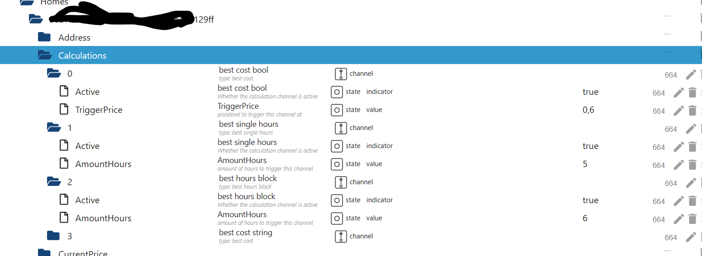
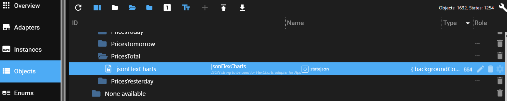

# IoBroker.tibberlink
[](https://github.com/hombach/ioBroker.tibberlink/actions/workflows/codeql-analysis.yml)

## Versionen
## Wächter
**Dieser Adapter verwendet Sentry-Bibliotheken, um Ausnahmen und Codefehler automatisch an die Entwickler zu melden.** Weitere Details und Informationen zum Deaktivieren der Fehlerberichterstattung finden Sie in <a href="https://github.com/ioBroker/plugin-sentry#plugin-sentry">der Sentry-Plugin-Dokumentation</a> !

## Adapter zur Nutzung von Tibber-Energiedaten in ioBroker
Dieser Adapter verbindet die API-Daten Ihres Tibber-Kontos mit ioBroker, egal ob für ein einzelnes Haus oder mehrere Wohneinheiten. Er unterstützt außerdem das direkte lokale Auslesen des Tibber Pulse-Sensors über Ihr Heimnetzwerk und ermöglicht so Echtzeitüberwachung und Datenerfassung, ohne ausschließlich auf die Cloud-API angewiesen zu sein.

Falls Sie derzeit kein Tibber-Nutzer sind, würde ich mich sehr freuen, wenn Sie meinen Empfehlungslink verwenden könnten: [Tibber-Empfehlungslink](https://invite.tibber.com/mu8c82n5).

## Standardkonfiguration
- Beginnen Sie mit dem Erstellen einer neuen Instanz des Adapters.
Sie benötigen außerdem ein API-Token von Tibber, das Sie hier erhalten können: [Tibber Developer API](https://developer.tibber.com).
- Geben Sie Ihren Tibber-API-Token in den Standardeinstellungen ein und konfigurieren Sie mindestens eine Zeile für Live-Feed-Einstellungen (wählen Sie „Keine verfügbar“).
- Speichern Sie die Einstellungen und beenden Sie die Konfiguration, um den Adapter neu zu starten; dieser Schritt ermöglicht es, dass Ihre Home-Server zum ersten Mal vom Tibber-Server abgefragt werden.
Kehren Sie zum Konfigurationsbildschirm zurück und wählen Sie die Haushalte aus, von denen Sie mit Ihrem Tibber Pulse Echtzeitdaten abrufen möchten. Sie können auch Haushalte auswählen und den Datenfeed deaktivieren (Hinweis: Dies funktioniert nur, wenn die Hardware installiert ist und der Tibber-Server die Verbindung zu Pulse bestätigt hat).
Hinweis: Falls Sie in Ihrem Tibber-Konto mehrere Häuser haben, müssen Sie alle hinzufügen, um Fehlermeldungen durch möglicherweise unnötige Häuser zu vermeiden. Fügen Sie alle Häuser hinzu und deaktivieren Sie die nicht benötigten.
- Sie haben die Möglichkeit, den Abruf von Preisdaten für heute und morgen zu deaktivieren, beispielsweise wenn Sie nur den Pulse-Live-Feed nutzen möchten.
Optional können Sie den Abruf historischer Verbrauchsdaten aktivieren. Bitte geben Sie die Anzahl der Datensätze für Stunden, Tage, Wochen, Monate und Jahre an. Sie können „0“ verwenden, um ein oder mehrere dieser Intervalle je nach Ihren Präferenzen zu deaktivieren.
Hinweis: Die Größe des Datensatzes ist entscheidend, da zu große Anfragen dazu führen können, dass der Tibber-Server nicht antwortet. Wir empfehlen, mit der Datensatzgröße zu experimentieren, um eine optimale Funktionalität zu gewährleisten. Durch Anpassen der Intervalle und der Datensatzanzahl lässt sich ein optimales Gleichgewicht zwischen aussagekräftigen Daten und Serverleistung erzielen. Beispielsweise ist 48 ein empfohlener Wert für Stunden.
- Einstellungen speichern.

## Dokumentation der Verbrauchsdaten
Wenn die tägliche historische Verbrauchsanzeige aktiviert ist, liefert der Adapter einen aggregierten Status für den aktuellen Monat:

- `Homes.<HOME-ID>.Consumption.currentMonthConsumption`

Dieser Wert entspricht dem Gesamtverbrauch für den aktuellen Kalendermonat in `kWh`, berechnet aus den von Tibber zurückgegebenen täglichen Verbrauchsdaten. Sind zu wenige Tage konfiguriert, spiegelt der Wert nur diese Anzahl an Tagen wider – nicht einen vollständigen Monat.

## Rechnerkonfiguration
- Nachdem die Tibber-Verbindung nun eingerichtet und betriebsbereit ist, können Sie den Calculator auch nutzen, um zusätzliche Automatisierungsfunktionen in den TibberLink-Adapter zu integrieren.
Der Rechner arbeitet mit Kanälen, wobei jeder Kanal mit einem ausgewählten Haushalt verknüpft ist.
- Diese Zustände sind so konzipiert, dass sie als externe, dynamische Eingaben für TibberLink dienen und es Ihnen beispielsweise ermöglichen, die Grenzkosten ("TriggerPrice") aus einer externen Quelle anzupassen oder den Rechnerkanal ("Active") zu aktivieren.
- Diese Kanäle müssen je nach den entsprechenden Zuständen aktiviert oder deaktiviert werden.
Die Zustände eines Rechnerkanals werden neben den Startzuständen angeordnet und entsprechend der Kanalnummer benannt. Der im Admin-Bildschirm eingegebene Kanalname wird hier angezeigt, um die Identifizierung Ihrer Konfigurationen zu erleichtern.

  

- Das Verhalten jedes Kanals wird durch seinen Typ bestimmt: „Best Cost (LTF)“, „Best Single Hours (LTF)“, „Best Hours Block (LTF)“ oder „Smart Battery Buffer“.
Jeder Kanal gibt einen oder zwei externe Zustände aus, die im Einstellungsmenü ausgewählt werden müssen. Dieser Zustand könnte beispielsweise „0_userdata.0.example_state“ oder ein anderer beschreibbarer externer Zustand sein.
- Wenn kein externer Ausgabezustand ausgewählt ist, wird ein interner Zustand innerhalb des Bereichs des Kanals erstellt.
- Die Werte, die in den Ausgabestatus geschrieben werden sollen, können in "value YES" und "value NO" definiert werden, z. B. "true" für boolesche Zustände oder eine Zahl oder ein Text, der geschrieben werden soll.
- Ausgaben:
- „Beste Kosten“: Nutzt den Zustand „TriggerPrice“ als Eingabe und erzeugt stündlich eine „JA“-Ausgabe, wenn die aktuellen Tibber-Energiekosten unter dem Triggerpreis liegen.
- "Beste Einzelstunden": Erzeugt eine "JA"-Ausgabe während der günstigsten Stunden, wobei die Anzahl im Zustand "AmountHours" definiert ist.
- "Bester Stundenblock": Gibt "JA" aus, wenn der kostengünstigste Stundenblock mit der im Zustand "AmountHours" angegebenen Stundenzahl aktiv ist.

Zusätzlich wird der durchschnittliche Gesamtkostenwert des ermittelten Blocks in einem Zustand namens „AverageTotalCost“ in der Nähe der Eingangszustände dieses Kanals gespeichert. Außerdem werden Start- und Endzeit des Blocks als Ergebnis der Berechnung in den Zuständen „BlockStartFullHour“ und „BlockEndFullHour“ gespeichert.

- "Bester Prozentsatz": Gibt "JA" während der günstigsten Stunde und zu allen anderen Stunden aus, in denen der Preis innerhalb des im Einstellungsstatus "Prozentsatz" festgelegten Prozentsatzbereichs liegt.
- „Best cost LTF“: „Best cost“ innerhalb eines begrenzten Zeitraums (LTF).
- "Beste Einzelstunden LTF": "Beste Einzelstunden" innerhalb eines begrenzten Zeitraums (LTF).
- "Best Hours Block LTF": "Best Hours Block" innerhalb eines begrenzten Zeitraums (LTF).
- "Bester Prozentsatz LTF": "Bester Prozentsatz" innerhalb eines begrenzten Zeitraums (LTF).
- "Intelligenter Batteriepuffer":
Der Parameter „Effizienzverlust“ definiert den Effizienzverlust des Batteriesystems. Sein Wert liegt zwischen 0 und 1, wobei 0 keinen Effizienzverlust und 1 einen vollständigen Energieverlust bedeutet. Beispielsweise bedeutet ein Wert von 0,25 einen Effizienzverlust von 25 % pro Lade-/Entladezyklus.
Der Parameter „AmountHours“ gibt die maximale Anzahl an Stunden an, die das System zum Laden des Akkus verwenden darf (auf Viertelstunden gerundet). Wichtig: Dies ist eine Obergrenze, keine garantierte Stundenzahl. Die tatsächliche Anzahl der Ladezeitfenster wird dynamisch anhand der Energiepreise und des Wirkungsgradverlusts ermittelt. Es werden nur Zeitfenster ausgewählt, in denen das Laden wirtschaftlich sinnvoll ist (d. h. der Preis deutlich unter dem des teuersten Zeitfensters liegt, unter Berücksichtigung des Wirkungsgradverlusts).
Der Rechner funktioniert wie folgt:
- Günstige Zeitfenster: Akkuladung ist aktiviert (Wert JA), Einspeisung in das Hausenergiesystem ist deaktiviert (Wert 2 NEIN). Dies sind die günstigsten Zeitfenster, die den Effizienzfilter bestehen, bis zu einer bestimmten Anzahl von Stunden.
- Teure Zeitfenster: Das Laden der Batterie ist deaktiviert (Wert NEIN), die Einspeisung in das Hausenergiesystem ist aktiviert (Wert 2 JA). Diese Zeitfenster haben die höchsten Preise, die über dem dynamisch berechneten Schwellenwert liegen, der auf den Preisen der günstigsten Zeitfenster und dem Effizienzverlust basiert.
- Normale Zeitfenster: Wenn das Laden wirtschaftlich nicht rentabel ist, werden beide Ausgänge deaktiviert.
- Dieser Ansatz gewährleistet, dass die Batterie nur dann genutzt wird, wenn es wirtschaftlich sinnvoll ist, anstatt sich strikt an eine festgelegte Stundenzahl zu halten.
LTF-Kanäle: Diese funktionieren ähnlich wie Standardkanäle, sind aber nur innerhalb eines durch die Statusobjekte „StartTime“ und „StopTime“ definierten Zeitraums aktiv. Nach Ablauf von „StopTime“ wird der Kanal automatisch deaktiviert. „StartTime“ und „StopTime“ können sich über zwei Kalendertage erstrecken, da Tibber keine Daten über ein 48-Stunden-Fenster hinaus bereitstellt. Beide Status erfordern eine Datums-/Zeitangabe im ISO-8601-Format mit Zeitzonenverschiebung, z. B. „2024-12-24T18:00:00.000+01:00“. Zusätzlich verfügen die LTF-Kanäle über einen neuen Statusparameter namens „RepeatDays“, der standardmäßig auf 0 gesetzt ist. Wenn „RepeatDays“ auf eine positive ganze Zahl gesetzt wird, wiederholt der Kanal seinen Zyklus, indem er sowohl „StartTime“ als auch „StopTime“ um die angegebene Anzahl von Tagen nach Erreichen von „StopTime“ erhöht. Setzen Sie beispielsweise „RepeatDays“ auf 1 für eine tägliche Wiederholung.

## Konfiguration der Grafikausgabe
Der Adapter hilft bei der Visualisierung von Preistrends und Rechnerergebnissen. Er bietet drei Komplexitätsstufen – von einem einfachen JSON-basierten Ansatz bis hin zu einer vollständig individualisierten JavaScript-Lösung.

### 1. **(In Entwicklung) Visualisierung mit dem "E-Charts"-Adapter**
Bei dieser Methode muss der Adapter „E-Charts“ separat installiert werden.

- Es können JSON-Daten verwendet werden, die im Abschnitt „Rechnerzustände“ (`Output-E-Charts`) generiert werden.
- Die Möglichkeiten sind durch die Beschränkungen des E-Charts-Adapters eingeschränkt.

### 2. **Verwendung des "FlexCharts"- (oder "Fully Featured eCharts")-Adapters mit JSON**
Diese Methode erfordert die separate Installation des "FlexCharts"-Adapters.

- Der TibberLink-Adapter erzeugt einen Zustand namens `jsonFlexCharts`.

                      

- Der FlexCharts-Adapter rendert diesen Zustand über die folgende URL:

```
http://[YOUR IP of FLEXCHARTS]:8082/flexcharts/echarts.html?source=state&id=tibberlink.0.Homes.[TIBBER-HOME-ID].PricesTotal.jsonFlexCharts
```

Ab Version 0.7.0 unterstützt FlexCharts automatische Diagrammaktualisierungen über SSE (Server-Sent Events). Um diese Funktion zu nutzen, fügen Sie `&sse` zur URL hinzu:

```
http://[YOUR IP of FLEXCHARTS]:8082/flexcharts/echarts.html?source=state&id=tibberlink.0.Homes.[TIBBER-HOME-ID].PricesTotal.jsonFlexCharts&sse=30
```

Weitere Details finden Sie in der [FlexCharts-Adapterdokumentation](https://github.com/MyHomeMyData/ioBroker.flexcharts).

#### **Verwendung der JSON-Vorlage**
- Der `jsonFlexCharts`-Status wird auf Basis einer Vorlage generiert, die über den JSON-Editor in den Adaptereinstellungen konfiguriert ist.
- Der integrierte JSON-Editor verwendet den JSON5-Modus, daher sind Kommentare und nachfolgende Kommas zulässig.
- Eine Beispielvorlage kann hier heruntergeladen werden: [TemplateFlexChart01.md](docu/TemplateFlexChart01.md).
- Kopieren Sie die Vorlage und fügen Sie sie in den JSON-Editor ein.
- Die Vorlage enthält die Platzhalter:
- `%%seriesData%%` (wird zur Laufzeit mit den Zeitreihen-Preisdaten gefüllt).
- `%%CalcChannelsData%%` (gefüllt mit ausgewählten Taschenrechnerkanaldaten).
Der Rest der Vorlage folgt der Apache ECharts-Konfiguration. Beispiele finden Sie unter [Apache ECharts Examples](https://echarts.apache.org/examples/en/index.html).
- **Empfehlung:** Testen Sie den TibberLink-Adapter ohne echte Vorlage mit der Standardzeichenfolge:

```
%%seriesData%%\n\n%%CalcChannelsData%%
```

Dies hilft, seine Funktionsweise zu verstehen.

- Template-Anpassungen können auf Apache ECharts-Beispielseiten mithilfe der Zustandsdaten "Output-E-Charts" getestet werden.
- Gute Vorlagen werden innerhalb der TibberLink-Adapter-Community geteilt.

### 3. **Verwendung von "FlexCharts" mit benutzerdefiniertem JavaScript-Code**
Für maximale Flexibilität und Anpassungsmöglichkeiten kann der FlexCharts-Adapter mit benutzerdefiniertem JavaScript verwendet werden.

- Sowohl der "FlexCharts"- als auch der "JavaScript"-Adapter müssen separat installiert werden.
- Dieser Ansatz ermöglicht die Erstellung mehrerer individueller Diagramme.
Weitere Details finden Sie in der [FlexCharts Adapter Discussion](https://github.com/MyHomeMyData/ioBroker.flexcharts/discussions/67).

## Hinweise
### Umgekehrte Verwendung
Um beispielsweise Spitzenzeiten anstelle von optimalen Zeiten zu erhalten, kehren Sie einfach die Nutzung und die Parameter um:


Durch Vertauschen von true <-> false erhalten Sie in der ersten Zeile ein true mit niedrigen Kosten und in der zweiten Zeile ein true mit hohen Kosten (die Kanalnamen sind nur Beispiele und können frei gewählt werden).

Achtung: Bei Spitzenzeiten, wie im Beispiel, muss die Stundenzahl angepasst werden. Original: 5 -> Kehrwert (24-5) = 19 -> Sie erhalten während der 5 Spitzenstunden einen „wahren“ Wert.

### LTF-Kanäle
Die Berechnung erfolgt anhand von Daten über mehrere Tage. Da uns nur Informationen für heute und morgen vorliegen (verfügbar ab ca. 13:00 Uhr), umfasst der Zeitraum bis zu 48 Stunden, typischerweise jedoch etwa 35 Stunden unmittelbar nach der Preisaktualisierung um 13:00 Uhr. Es ist jedoch wichtig, dieses Verhalten zu beachten, da sich das berechnete Ergebnis gegen 13:00 Uhr ändern kann, sobald die neuen Daten für die Preise von morgen verfügbar sind.

Um diese dynamische Veränderung des Zeitrahmens für einen Standardkanal zu beobachten, können Sie einen begrenzten Zeitrahmen (Limited Time Frame, LTF) über mehrere Jahre wählen. Dies ist besonders nützlich für das Szenario „Best Single Hours LTF“.

## Direkte lokale Abfrage von Pulse-Daten
Damit das funktioniert, müssen Sie die Weboberfläche der Bridge so anpassen, dass sie dauerhaft aktiviert bleibt.
marq24 beschreibt hier ausführlich, wie das für seine Home-Assistant-Integration funktioniert:

https://github.com/marq24/ha-tibber-pulse-local

Wenn alles korrekt funktioniert, werden die Messdaten alle 2 Sekunden in die ioBroker-Zustände geschrieben.

## Fahrzeug- und Ladegerätekonfiguration
Tibber betreibt zwei separate APIs mit unterschiedlichen Zwecken:

Die **Entwickler-GraphQL-API** (`api.tibber.com`) bietet Zugriff auf Energiepreise, Verbrauchshistorie und den Pulse-Live-Feed. Dies ist der Inhalt der Standard-Tibber-API-Token (von [developer.tibber.com](https://developer.tibber.com)).
- **Tibber Data API** (`data-api.tibber.com`) – IoT-Gerätedaten für gekoppelte Fahrzeuge, Ladegeräte, Wärmepumpen und Wechselrichter. Dies ist eine neuere, separate REST-API, die eine eigene OAuth2-Client-Registrierung erfordert.

Die APIs ersetzen einander nicht – sie ergänzen sich. Die hier beschriebene Fahrzeug- und Ladegerätfunktion nutzt die Daten-API und benötigt daher neben dem Haupt-API-Token eigene Zugangsdaten.

### Voraussetzungen
1. Öffnen Sie [https://data-api.tibber.com/clients/manage](https://data-api.tibber.com/clients/manage) und klicken Sie auf **+ Neuer Client**.

 

2. Geben Sie dem Client einen Namen (z. B. `ioBrokerTibber`), setzen Sie die **Umleitungs-URI** exakt auf `http://localhost/` (mit abschließendem Schrägstrich) und aktivieren Sie mindestens die folgenden Bereiche:
- `data-api-homes-read`
- `data-api-vehicles-read`
- `data-api-chargers-read`

    

3. Klicken Sie auf **Erstellen**. Kopieren Sie sofort die **Client-ID** und das **Client-Geheimnis** – das Geheimnis wird nur einmal angezeigt.

 

4. Öffnen Sie die Registerkarte **Fahrzeuge & Ladegeräte** in der Adapterkonfiguration, geben Sie beide Werte ein und speichern Sie.
5. Starten Sie den Adapter neu. Es wird eine **Warnung** protokolliert, die die sofort einsatzbereite Autorisierungs-URL mit Ihrer bereits eingetragenen Client-ID enthält:

```
[tibberDataAPI]: no auth code configured — please authorize. URL: https://thewall.tibber.com/connect/authorize?client_id=<your-id>&...
```

6. Öffnen Sie diese URL in einem Browser und melden Sie sich mit Ihrem Tibber-Konto an, um Zugriff zu gewähren.
7. Der Browser leitet zu `http://localhost/` weiter und zeigt einen Verbindungsfehler an – dies ist **erwartet und korrekt**. Kopieren Sie die vollständige URL aus der Adressleiste (sie enthält `?code=...`).

 

8. Fügen Sie die vollständige URL in das Feld **Auth Code** in der Adapterkonfiguration ein und speichern Sie die Einstellungen.
9. Der Adapter tauscht den Code gegen Tokens aus und beginnt mit dem Polling. Das Feld „Auth-Code“ wird automatisch geleert.

Der Adapter speichert das Aktualisierungstoken intern und erneuert das Zugriffstoken automatisch, sodass dieser einmalige Autorisierungsschritt nicht wiederholt werden muss.

### Verfügbare Staaten
Fahrzeugdaten werden in `Vehicles.<VIN>.*` geschrieben:

| Bundesland | Beschreibung |
| --------------------- | --------------------------------- |
| `ChargingStatus` | Aktueller Ladestatus |
| `LastUpdated` | Zeitstempel der letzten Datenaktualisierung |
| `PlugStatus` | Steckerverbindungsstatus |
| `Range` | Verbleibende Reichweite in km |
| `StateOfCharge` | Ladezustand der Batterie in % |
| `TargetStateOfCharge` | Zielladezustand in % |
| `TargetStateOfCharge` | Zielladezustand in % |

### Umfrageintervall
Das Abfrageintervall kann auf der Registerkarte **Fahrzeuge & Ladegeräte** konfiguriert werden (1–60 Minuten, Standard: 5 Minuten).

## Spenden
<a href="https://www.paypal.com/donate/?hosted_button_id=F7NM9R2E2DUYS"></a> Wenn dir dieses Projekt gefallen hat – oder du einfach nur großzügig sein möchtest –, spendiere mir doch ein Bier. Prost! 😉

## Changelog

<!--
  Placeholder for the next version (at the beginning of the line):
  ### **WORK IN PROGRESS**
-->
### **WORK IN PROGRESS**

- (HombachC) removed redundant test devDependencies (chai, chai-as-promised, sinon-chai, proxyquire) and switched unit tests to Node's built-in assert

### 7.1.4 (2026-07-09)

- (HombachC) fixed regression where smart battery buffer ignored the EfficiencyLoss parameter (#918)

### 7.1.3 (2026-06-27)

- (HombachC) updated axios
- (HombachC) fixed local SML parsing for EMH meters reporting meter_mode 4 but sending binary SML data (#912)
- (HombachC) fixed false warn log for SBB when no price slot matches current quarter (#912)

### 7.1.2 (2026-06-19)

- (HombachC) fixed adapter crash on null liveMeasurement from Tibber feed (#910)
- (HombachC) improved vehicles & chargers OAuth2 setup documentation
- (HombachC) fixed setInterval/clearInterval to use adapter-managed variants
- (HombachC) removed yarn dependency, replaced with npm in release script
- (HombachC) updated adapter-core
- (HombachC) fixed adapter checker warnings
- (HombachC) updated dependencies

### 7.1.1 (2026-06-07)

- (HombachC) optimized vehicle states
- (HombachC) fixed adapter checker warnings

### 7.1.0 (2026-06-07)

- (claude) added integration for vehicles(#67)
- (HombachC) optimized documentation
- (claude) added code documentation
- (claude) performance optimization of event listeners
- (HombachC) added current month consumption docu
- (HombachC) updated release-script
- (HombachC) fixed adapter checker warnings

### Old Changes see [CHANGELOG OLD](CHANGELOG_OLD.md)

## License

GNU General Public License v3.0 only

Copyright (c) 2023-2026 C.Hombach <TibberLink@homba.ch>