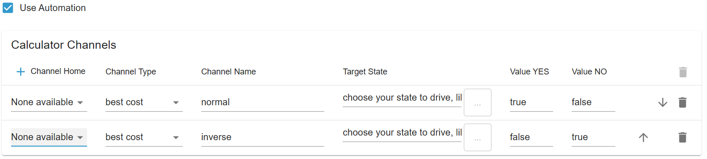

# IoBroker.tibberlink
[](https://github.com/hombach/ioBroker.tibberlink/actions/workflows/codeql-analysis.yml)

## Versionen
## Adapter zur Nutzung von TIBBER-Energiedaten in ioBroker
Dieser Adapter ermöglicht die Anbindung von Daten aus der API Ihres Tibber-Kontos an ioBroker, egal ob für ein einzelnes Haus oder mehrere Wohneinheiten.

Neue Funktion: Der Adapter unterstützt jetzt das direkte lokale Auslesen des Tibber-Pulssensors über Ihr Heimnetzwerk. Dies ermöglicht Echtzeitüberwachung und Datenerfassung, ohne ausschließlich auf die Cloud-API angewiesen zu sein.

Falls Sie derzeit kein Tibber-Nutzer sind, würde ich mich sehr freuen, wenn Sie meinen Empfehlungslink verwenden könnten: [Tibber-Empfehlungslink](https://invite.tibber.com/mu8c82n5).

## Standardkonfiguration
- Erstellen Sie zunächst eine neue Instanz des Adapters.
Sie benötigen außerdem ein API-Token von Tibber, das Sie hier erhalten können: [Tibber Developer API](https://developer.tibber.com).
- Geben Sie Ihren Tibber-API-Token in den Standardeinstellungen ein und konfigurieren Sie mindestens eine Zeile für Live-Feed-Einstellungen (wählen Sie "Keine verfügbar").
- Speichern Sie die Einstellungen und beenden Sie die Konfiguration, um den Adapter neu zu starten; dieser Schritt ermöglicht es, dass Ihre Home-Server beim ersten Mal vom Tibber-Server abgefragt werden.
Kehren Sie zum Konfigurationsbildschirm zurück und wählen Sie die Haushalte aus, von denen Sie mit Ihrem Tibber Pulse Echtzeitdaten abrufen möchten. Sie können auch Haushalte auswählen und den Datenfeed deaktivieren (Hinweis: Dies funktioniert nur, wenn die Hardware installiert ist und der Tibber-Server die Verbindung zu Pulse bestätigt hat).
Hinweis: Falls Sie in Ihrem Tibber-Konto mehrere Häuser aktiv haben, müssen Sie alle hinzufügen, um Fehlermeldungen aufgrund möglicherweise unnötiger Häuser zu beheben. Fügen Sie alle Häuser hinzu und deaktivieren Sie die entsprechenden Optionen.
- Sie haben die Möglichkeit, den Abruf von Preisdaten für heute und morgen zu deaktivieren, beispielsweise wenn Sie ausschließlich Pulse-Live-Feeds nutzen möchten.
Optional können Sie den Abruf historischer Verbrauchsdaten aktivieren. Bitte geben Sie die Anzahl der Datensätze für Stunden, Tage, Wochen, Monate und Jahre an. Sie können „0“ verwenden, um ein oder mehrere dieser Intervalle je nach Ihren Präferenzen zu deaktivieren.
Hinweis: Die Größe des Datensatzes ist entscheidend, da zu große Anfragen dazu führen können, dass der Tibber-Server nicht reagiert. Wir empfehlen, mit der Datensatzgröße zu experimentieren, um eine optimale Funktionalität zu gewährleisten. Durch Anpassen der Intervalle und der Datensatzanzahl lässt sich ein gutes Gleichgewicht zwischen aussagekräftigen Daten und der Serverleistung finden. Beispielsweise sind 48 Datensätze für mehrere Stunden ein guter Wert.
- Einstellungen speichern.

## Rechnerkonfiguration
- Nachdem die Tibber-Verbindung nun eingerichtet und betriebsbereit ist, können Sie den Calculator auch nutzen, um zusätzliche Automatisierungsfunktionen in den TibberLink-Adapter zu integrieren.
Der Rechner arbeitet mit Kanälen, wobei jeder Kanal mit einem ausgewählten Haushalt verknüpft ist.
- Diese Zustände sind so konzipiert, dass sie als externe, dynamische Eingaben für TibberLink dienen und es Ihnen beispielsweise ermöglichen, die Grenzkosten ("TriggerPrice") aus einer externen Quelle anzupassen oder den Rechnerkanal ("Active") zu aktivieren.
- Diese Kanäle müssen je nach den entsprechenden Zuständen aktiviert oder deaktiviert werden.
Die Zustände eines Rechnerkanals werden neben den Startzuständen angeordnet und entsprechend der Kanalnummer benannt. Der im Admin-Bereich gewählte Kanalname wird hier angezeigt, um Ihre Konfigurationen besser identifizieren zu können.

  

- Das Verhalten jedes Kanals wird durch seinen Typ bestimmt: „Best Cost (LTF)“, „Best Single Hours (LTF)“, „Best Hours Block (LTF)“ oder „Smart Battery Buffer“.
Jeder Kanal gibt einen oder zwei externe Zustände aus, die im Einstellungsmenü ausgewählt werden müssen. Dieser Zustand könnte beispielsweise „0_userdata.0.example_state“ oder ein anderer beschreibbarer externer Zustand sein.
- Wenn kein externer Ausgabezustand ausgewählt ist, wird ein interner Zustand innerhalb des Bereichs des Kanals erstellt.
- Die Werte, die in den Ausgabestatus geschrieben werden sollen, können in "value YES" und "value NO" definiert werden, z. B. "true" für boolesche Zustände oder eine Zahl oder ein Text, der geschrieben werden soll.
- Ausgaben:
- „Beste Kosten“: Nutzt den Zustand „TriggerPrice“ als Eingabe und erzeugt stündlich eine Ausgabe „JA“, wenn die aktuellen Tibber-Energiekosten unter dem Triggerpreis liegen.
- "Beste Einzelstunden": Erzeugt eine "JA"-Ausgabe während der günstigsten Stunden, wobei die Anzahl im Zustand "AmountHours" definiert ist.
- "Bester Stundenblock": Gibt "JA" aus, wenn der kostengünstigste Stundenblock mit der im Zustand "AmountHours" angegebenen Stundenzahl aktiv ist.

Zusätzlich wird der durchschnittliche Gesamtkostenwert des ermittelten Blocks in einem Zustand namens „AverageTotalCost“ in der Nähe der Eingangszustände dieses Kanals gespeichert. Außerdem werden Start- und Endzeit des Blocks als Ergebnis der Berechnung in den Zuständen „BlockStartFullHour“ und „BlockEndFullHour“ gespeichert.

- "Bester Prozentsatz": Gibt "JA" während der günstigsten Stunde und zu allen anderen Stunden aus, in denen der Preis innerhalb des im Einstellungsstatus "Prozentsatz" festgelegten Prozentsatzbereichs liegt.
- „Best cost LTF“: „Best cost“ innerhalb eines begrenzten Zeitraums (LTF).
- "Beste Einzelstunden LTF": "Beste Einzelstunden" innerhalb eines begrenzten Zeitraums (LTF).
- "Best Hours Block LTF": "Best Hours Block" innerhalb eines begrenzten Zeitraums (LTF).
- "Bester Prozentsatz LTF": "Bester Prozentsatz" innerhalb eines begrenzten Zeitraums (LTF).
- "Intelligenter Batteriepuffer":
Der Parameter „Effizienzverlust“ definiert den Effizienzverlust des Batteriesystems. Sein Wert liegt zwischen 0 und 1, wobei 0 keinen Effizienzverlust und 1 einen vollständigen Energieverlust bedeutet. Beispielsweise bedeutet ein Wert von 0,25 einen Effizienzverlust von 25 % pro Lade-/Entladezyklus.
Der Parameter „AmountHours“ gibt die maximale Anzahl an Stunden an, die das System zum Laden des Akkus verwenden darf (auf Viertelstunden gerundet). Wichtig: Dies ist eine Obergrenze, keine garantierte Stundenzahl. Die tatsächliche Anzahl der Ladezeitfenster wird dynamisch anhand der Energiepreise und des Wirkungsgradverlusts ermittelt. Es werden nur Zeitfenster ausgewählt, in denen das Laden wirtschaftlich sinnvoll ist (d. h. der Preis deutlich unter dem des teuersten Zeitfensters liegt, unter Berücksichtigung des Wirkungsgradverlusts).
Der Rechner funktioniert wie folgt:
- Günstige Zeitfenster: Akkuladung ist aktiviert (Wert JA), Einspeisung in das Hausenergiesystem ist deaktiviert (Wert 2 NEIN). Dies sind die günstigsten Zeitfenster, die den Effizienzfilter bestehen, bis zu einer bestimmten Anzahl von Stunden.
- Teure Zeitfenster: Das Laden der Batterie ist deaktiviert (Wert NEIN), die Einspeisung in das Hausenergiesystem ist aktiviert (Wert 2 JA). Diese Zeitfenster haben die höchsten Preise, die über dem dynamisch berechneten Schwellenwert liegen, der auf den Preisen der günstigsten Zeitfenster und dem Effizienzverlust basiert.
- Normale Zeitfenster: Wenn das Laden wirtschaftlich nicht rentabel ist, werden beide Ausgänge deaktiviert.
- Dieser Ansatz gewährleistet, dass die Batterie nur dann genutzt wird, wenn es wirtschaftlich sinnvoll ist, anstatt sich strikt an eine festgelegte Stundenzahl zu halten.
LTF-Kanäle: Diese funktionieren ähnlich wie Standardkanäle, sind aber nur innerhalb eines durch die Statusobjekte „StartTime“ und „StopTime“ definierten Zeitraums aktiv. Nach Ablauf von „StopTime“ wird der Kanal automatisch deaktiviert. „StartTime“ und „StopTime“ können sich über zwei Kalendertage erstrecken, da Tibber keine Daten über ein 48-Stunden-Fenster hinaus bereitstellt. Beide Status erfordern eine Datums-/Zeitangabe im ISO-8601-Format mit Zeitzonenverschiebung, z. B. „2024-12-24T18:00:00.000+01:00“. Zusätzlich verfügen die LTF-Kanäle über einen neuen Statusparameter namens „RepeatDays“, der standardmäßig auf 0 gesetzt ist. Wenn „RepeatDays“ auf eine positive ganze Zahl gesetzt wird, wiederholt der Kanal seinen Zyklus, indem er sowohl „StartTime“ als auch „StopTime“ um die angegebene Anzahl von Tagen nach Erreichen von „StopTime“ erhöht. Setzen Sie beispielsweise „RepeatDays“ auf 1 für eine tägliche Wiederholung.

## Konfiguration der Grafikausgabe
Der Adapter visualisiert Preistrends und Rechnerergebnisse. Er bietet drei Komplexitätsstufen mit jeweils unterschiedlichen Optionen.

Diese drei Methoden ermöglichen vielfältige Visualisierungen von Preistrends und Rechnerergebnissen. Je nach Bedarf können Sie zwischen einem einfachen JSON-basierten Ansatz und einer vollständig individualisierten JavaScript-Lösung wählen.

### 1. **(In Entwicklung) Visualisierung mit dem "E-Charts"-Adapter**
Bei dieser Methode muss der Adapter „E-Charts“ separat installiert werden.

- Es können JSON-Daten verwendet werden, die im Abschnitt „Rechnerzustände“ als `Output-E-Charts` generiert werden.
- Die Möglichkeiten sind durch die Beschränkungen des E-Charts-Adapters eingeschränkt.

### 2. **Verwendung des "FlexCharts"- (oder "Fully Featured eCharts")-Adapters mit JSON**
Diese Methode erfordert die separate Installation des "FlexCharts"-Adapters.

- Der TibberLink-Adapter erzeugt einen Zustand namens `jsonFlexCharts`.

    

- Der FlexCharts-Adapter rendert diesen Zustand über die folgende URL:

```
http://[YOUR IP of FLEXCHARTS]:8082/flexcharts/echarts.html?source=state&id=tibberlink.0.Homes.[TIBBER-HOME-ID].PricesTotal.jsonFlexCharts
```

- Ab Version 0.7.0 unterstützt FlexCharts automatische Diagrammaktualisierungen über SSE (Server Sent Events). Um diese Funktion zu nutzen, fügen Sie `&sse` zur URL hinzu:

```
http://[YOUR IP of FLEXCHARTS]:8082/flexcharts/echarts.html?source=state&id=tibberlink.0.Homes.[TIBBER-HOME-ID].PricesTotal.jsonFlexCharts&sse=30
```

Weitere Details finden Sie in der [FlexCharts-Adapterdokumentation](https://github.com/MyHomeMyData/ioBroker.flexcharts).

@reblausgt Mit v0.7.0 ist es in Flexcharts nun möglich, Charts automatisch neu aufzubauen, wenn sich der State des Charts geändert hat. Das Verfahren nennt sich SSE (Server Sent Events). Aktiviert wird es denkbar einfach, indem ein &sse an den html-Aufruf anhängt. Details sind im Readme beschrieben.

Die Version ist in NPM und im Beta-Repo verfügbar. Ab 26. April auch im Stall.

Weitere Details finden Sie in der [FlexCharts-Adapterdokumentation](https://github.com/MyHomeMyData/ioBroker.flexcharts).

#### **Verwendung der JSON-Vorlage**
- Der `jsonFlexCharts`-Status wird auf Basis einer Vorlage generiert, die über den JSON-Editor in den Adaptereinstellungen konfiguriert ist.
- **Wichtig:** Der in ioBroker.Admin integrierte JSON-Editor unterstützt kein JSON5, was zu falschen Fehlermeldungen führen kann.
- Eine Beispielvorlage kann hier heruntergeladen werden: [TemplateFlexChart01.md](docu/TemplateFlexChart01.md).
- Kopieren Sie die Vorlage und fügen Sie sie in den JSON-Editor ein.
- Die Vorlage enthält die Platzhalter:
- `%%xAxisData%%` und `%%yAxisData%%` (werden zur Laufzeit mit Preisinformationen gefüllt).
- `%%CalcChannelsData%%` (gefüllt mit ausgewählten Taschenrechnerkanaldaten).
Der Rest der Vorlage folgt der Apache ECharts-Konfiguration. Beispiele finden Sie unter [Apache ECharts Examples](https://echarts.apache.org/examples/en/index.html).
- **Empfehlung:** Testen Sie den TibberLink-Adapter ohne echte Vorlage mit der Standardzeichenfolge:

```
%%xAxisData%%\n\n%%yAxisData%%\n\n%%CalcChannelsData%%
```

Dies hilft, seine Funktionsweise zu verstehen.

- Template-Anpassungen können auf Apache ECharts-Beispielseiten mithilfe der Zustandsdaten "Output-E-Charts" getestet werden.
- Gute Vorlagen werden innerhalb der TibberLink-Adapter-Community geteilt.

### 3. **Verwendung von "FlexCharts" mit benutzerdefiniertem JavaScript-Code**
Für maximale Flexibilität und Anpassungsmöglichkeiten kann der FlexCharts-Adapter mit benutzerdefiniertem JavaScript verwendet werden.

- Sowohl der "FlexCharts"- als auch der "JavaScript"-Adapter müssen separat installiert werden.
- Dieser Ansatz ermöglicht die Erstellung mehrerer individueller Diagramme.
Weitere Details finden Sie in der [FlexCharts Adapter Discussion](https://github.com/MyHomeMyData/ioBroker.flexcharts/discussions/67).

## Hinweise
### Umgekehrte Verwendung
Um beispielsweise Spitzenzeiten anstelle von optimalen Zeiten zu erhalten, kehren Sie einfach die Verwendung und die Parameter um:  Durch Vertauschen von true <-> false erhalten Sie in der ersten Zeile ein true bei niedrigen Kosten und in der zweiten Zeile ein true bei hohen Kosten (Kanalnamen sind keine Auslöser und können weiterhin frei gewählt werden).

Achtung: Bei Spitzenzeiten, wie im Beispiel, muss die Stundenzahl angepasst werden. Original: 5 -> Kehrwert (24-5) = 19 -> Sie erhalten ein korrektes Ergebnis für die 5 Spitzenstunden.

### LTF-Kanäle
Die Berechnung erfolgt anhand von Daten über mehrere Tage. Da uns nur Informationen für heute und morgen vorliegen (verfügbar ab ca. 13:00 Uhr), ist der Zeitraum effektiv auf maximal 35 Stunden begrenzt. Es ist jedoch wichtig, dies zu beachten, da sich das Ergebnis gegen 13:00 Uhr ändern kann, sobald die neuen Daten für die Preise von morgen verfügbar sind.

Um diese dynamische Veränderung des Zeitrahmens für einen Standardkanal zu beobachten, können Sie einen begrenzten Zeitrahmen (Limited Time Frame, LTF) über mehrere Jahre wählen. Dies ist besonders nützlich für das Szenario „Best Single Hours LTF“.

## Direkte lokale Abfrage von Pulse-Daten
Damit das funktioniert, müssen Sie die Weboberfläche der Bridge so anpassen, dass sie dauerhaft aktiviert bleibt.
marq24 hat die Vorgehensweise für seine Home Assistant-Integration hier hervorragend beschrieben:

https://github.com/marq24/ha-tibber-pulse-local

Wenn alles korrekt funktioniert, werden die Messdaten alle 2 Sekunden in die ioBroker-Zustände geschrieben.

## Wächter
Dieser Adapter verwendet Sentry-Bibliotheken, um Ausnahmen und Codefehler automatisch an die Entwickler zu melden. Weitere Details und Informationen zum Deaktivieren der Fehlerberichterstattung finden Sie in Abschnitt [Sentry-Plugin-Dokumentation](https://github.com/ioBroker/plugin-sentry#plugin-sentry)! Die Sentry-Berichterstattung ist ab js-controller 3.0 verfügbar.

## Spenden
<a href="https://www.paypal.com/donate/?hosted_button_id=F7NM9R2E2DUYS"></a> Wenn dir dieses Projekt gefallen hat – oder du einfach nur großzügig sein möchtest –, spendiere mir doch ein Bier. Prost! 😉

## Changelog

<!--
  Placeholder for the next version (at the beginning of the line):
  ### **WORK IN PROGRESS**
-->

### **WORK IN PROGRESS**

- (copilot) BREAKING: Adapter requires node.js >= 22 now
- (HombachC) Adapter requires admin >=7.6.20 now
- (HombachC) fix some type definitions
- (HombachC) extend FlexCharts docu
- (HombachC) update dependencies

### 6.2.2 (2026-04-13)

- (HombachC) fix vulnerability in axios
- (HombachC) update dependencies

### 6.2.1 (2026-03-30)

- (HombachC) optimize pull of consumption data (#860)
- (HombachC) switch to ES2023 code
- (HombachC) update dependencies

### 6.2.0 (2026-03-07)

- (HombachC) enable umlauts to calculation channel names (#844)
- (HombachC) enhance resolution of pulse meter data (#840)
- (HombachC) fix wrong end block state calculation (#841)
- (HombachC) setup auto-merge for dependabot (#834)
- (HombachC) update dependencies

### 6.1.1 (2026-02-05)

- (HombachC) fix LTF shifting for frames greater 24h
- (HombachC) update dependencies

### 6.1.0 (2026-01-03)

- (HombachC) BREAKING: change flexcharts x-axis type
- (HombachC) introduce FlexChart output for SBB channels second output
- (HombachC) introduce second name for FlexChart output of SBB channels
- (HombachC) introduce color for FlexChart output of calculator results
- (HombachC) introduce more statistics for yesterdays prices
- (HombachC) clean code for 15min time slots
- (HombachC) fix schema links (#822)
- (HombachC) fix CurrentPrice after midnight (#812)
- (HombachC) update cron
- (HombachC) year 2026 changes
- (HombachC) update dependencies

### Old Changes see [CHANGELOG OLD](CHANGELOG_OLD.md)

## License

GNU General Public License v3.0 only

Copyright (c) 2023-2026 C.Hombach <TibberLink@homba.ch>