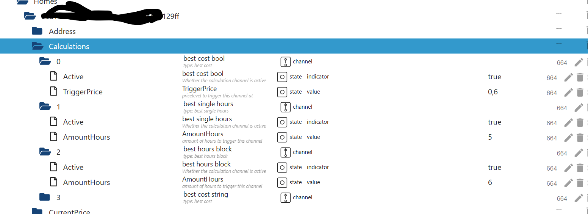

# Rechnerkonfiguration
_Teil des [ioBroker.tibberlink-Dokumentation](/#/adapters/tibberlink)._

- Nachdem die Tibber-Verbindung nun eingerichtet und betriebsbereit ist, können Sie den Calculator auch nutzen, um zusätzliche Automatisierungsfunktionen in den TibberLink-Adapter zu integrieren.
Der Rechner arbeitet mit Kanälen, wobei jeder Kanal mit einem ausgewählten Haushalt verknüpft ist.
- Diese Zustände sind so konzipiert, dass sie als externe, dynamische Eingaben für TibberLink dienen und es Ihnen beispielsweise ermöglichen, die Grenzkosten ("TriggerPrice") aus einer externen Quelle anzupassen oder den Rechnerkanal ("Active") zu aktivieren.
- Diese Kanäle müssen je nach den entsprechenden Zuständen aktiviert oder deaktiviert werden.
Die Zustände eines Rechnerkanals werden neben den Startzuständen angeordnet und entsprechend der Kanalnummer benannt. Der im Admin-Bildschirm eingegebene Kanalname wird hier angezeigt, um die Identifizierung Ihrer Konfigurationen zu erleichtern.

- Das Verhalten jedes Kanals wird durch seinen Typ bestimmt: „Best Cost (LTF)“, „Best Single Hours (LTF)“, „Best Hours Block (LTF)“ oder „Smart Battery Buffer“.
Jeder Kanal gibt einen oder zwei externe Zustände aus, die im Einstellungsmenü ausgewählt werden müssen. Dieser Zustand könnte beispielsweise „0_userdata.0.example_state“ oder ein anderer beschreibbarer externer Zustand sein.
- Wenn kein externer Ausgabezustand ausgewählt ist, wird ein interner Zustand innerhalb des Bereichs des Kanals erstellt.
- Die Werte, die in den Ausgabestatus geschrieben werden sollen, können in "value YES" und "value NO" definiert werden, z. B. "true" für boolesche Zustände oder eine Zahl oder ein Text, der geschrieben werden soll.
- Ausgaben:
- „Beste Kosten“: Nutzt den Zustand „TriggerPrice“ als Eingabe und erzeugt stündlich eine „JA“-Ausgabe, wenn die aktuellen Tibber-Energiekosten unter dem Triggerpreis liegen.
- "Beste Einzelstunden": Erzeugt eine "JA"-Ausgabe während der günstigsten Stunden, wobei die Anzahl im Zustand "AmountHours" definiert ist.
- "Bester Stundenblock": Gibt "JA" aus, wenn der kostengünstigste Stundenblock mit der im Zustand "AmountHours" angegebenen Stundenzahl aktiv ist.

Zusätzlich wird der durchschnittliche Gesamtkostenwert des ermittelten Blocks in einem Zustand namens „AverageTotalCost“ in der Nähe der Eingangszustände dieses Kanals gespeichert. Außerdem werden Start- und Endzeit des Blocks als Ergebnis der Berechnung in den Zuständen „BlockStartFullHour“ und „BlockEndFullHour“ gespeichert.

- "Bester Prozentsatz": Gibt "JA" während der günstigsten Stunde und zu allen anderen Stunden aus, in denen der Preis innerhalb des im Einstellungsstatus "Prozentsatz" festgelegten Prozentsatzbereichs liegt.
- „Best cost LTF“: „Best cost“ innerhalb eines begrenzten Zeitraums (LTF).
- "Beste Einzelstunden LTF": "Beste Einzelstunden" innerhalb eines begrenzten Zeitraums (LTF).
- "Best Hours Block LTF": "Best Hours Block" innerhalb eines begrenzten Zeitraums (LTF).
- "Bester Prozentsatz LTF": "Bester Prozentsatz" innerhalb eines begrenzten Zeitraums (LTF).
- "Intelligenter Batteriepuffer":
Der Parameter „Effizienzverlust“ definiert den Effizienzverlust des Batteriesystems. Sein Wert liegt zwischen 0 und 1, wobei 0 keinen Effizienzverlust und 1 einen vollständigen Energieverlust bedeutet. Beispielsweise bedeutet ein Wert von 0,25 einen Effizienzverlust von 25 % pro Lade-/Entladezyklus.
Der Parameter „AmountHours“ gibt die maximale Anzahl an Stunden an, die das System zum Laden des Akkus verwenden darf (auf Viertelstunden gerundet). Wichtig: Dies ist eine Obergrenze, keine garantierte Stundenzahl. Die tatsächliche Anzahl der Ladezeitfenster wird dynamisch anhand der Energiepreise und des Wirkungsgradverlusts ermittelt. Es werden nur Zeitfenster ausgewählt, in denen das Laden wirtschaftlich sinnvoll ist (d. h. der Preis deutlich unter dem des teuersten Zeitfensters liegt, unter Berücksichtigung des Wirkungsgradverlusts).
Der Rechner funktioniert wie folgt:
- Günstige Zeitfenster: Akkuladung ist aktiviert (Wert JA), Einspeisung in das Hausenergiesystem ist deaktiviert (Wert 2 NEIN). Dies sind die günstigsten Zeitfenster, die den Effizienzfilter bestehen, bis zu einer bestimmten Anzahl von Stunden.
- Teure Zeitfenster: Das Laden der Batterie ist deaktiviert (Wert NEIN), die Einspeisung in das Hausenergiesystem ist aktiviert (Wert 2 JA). Diese Zeitfenster haben die höchsten Preise, die über dem dynamisch berechneten Schwellenwert liegen, der auf den Preisen der günstigsten Zeitfenster und dem Effizienzverlust basiert.
- Normale Zeitfenster: Wenn das Laden wirtschaftlich nicht rentabel ist, werden beide Ausgänge deaktiviert.
- Dieser Ansatz gewährleistet, dass die Batterie nur dann genutzt wird, wenn es wirtschaftlich sinnvoll ist, anstatt sich strikt an eine festgelegte Stundenzahl zu halten.
LTF-Kanäle: Diese funktionieren ähnlich wie Standardkanäle, sind aber nur innerhalb eines durch die Statusobjekte „StartTime“ und „StopTime“ definierten Zeitraums aktiv. Nach Ablauf von „StopTime“ wird der Kanal automatisch deaktiviert. „StartTime“ und „StopTime“ können sich über zwei Kalendertage erstrecken, da Tibber keine Daten über ein 48-Stunden-Fenster hinaus bereitstellt. Beide Status erfordern eine Datums-/Zeitangabe im ISO-8601-Format mit Zeitzonenverschiebung, z. B. „2024-12-24T18:00:00.000+01:00“. Zusätzlich verfügen die LTF-Kanäle über einen neuen Statusparameter namens „RepeatDays“, der standardmäßig auf 0 gesetzt ist. Wenn „RepeatDays“ auf eine positive ganze Zahl gesetzt wird, wiederholt der Kanal seinen Zyklus, indem er sowohl „StartTime“ als auch „StopTime“ um die angegebene Anzahl von Tagen nach Erreichen von „StopTime“ erhöht. Setzen Sie beispielsweise „RepeatDays“ auf 1 für eine tägliche Wiederholung.

## Hinweise
### Umgekehrte Verwendung
Um beispielsweise Spitzenzeiten anstelle von optimalen Zeiten zu erhalten, kehren Sie einfach die Nutzung und die Parameter um:

Durch Vertauschen von true <-> false erhalten Sie in der ersten Zeile ein true mit niedrigen Kosten und in der zweiten Zeile ein true mit hohen Kosten (die Kanalnamen sind nur Beispiele und können frei gewählt werden).

Achtung: Bei Spitzenzeiten, wie im Beispiel, muss die Stundenzahl angepasst werden. Original: 5 -> Kehrwert (24-5) = 19 -> Sie erhalten während der 5 Spitzenstunden einen „wahren“ Wert.

### LTF-Kanäle
Die Berechnung erfolgt anhand von Daten über mehrere Tage. Da uns nur Informationen für heute und morgen vorliegen (verfügbar ab ca. 13:00 Uhr), umfasst der Zeitraum bis zu 48 Stunden, typischerweise jedoch etwa 35 Stunden unmittelbar nach der Preisaktualisierung um 13:00 Uhr. Es ist jedoch wichtig, dieses Verhalten zu beachten, da sich das berechnete Ergebnis gegen 13:00 Uhr ändern kann, sobald die neuen Daten für die Preise von morgen verfügbar sind.

Um diese dynamische Veränderung des Zeitrahmens für einen Standardkanal zu beobachten, können Sie einen begrenzten Zeitrahmen (Limited Time Frame, LTF) über mehrere Jahre wählen. Dies ist besonders nützlich für das Szenario „Best Single Hours LTF“.