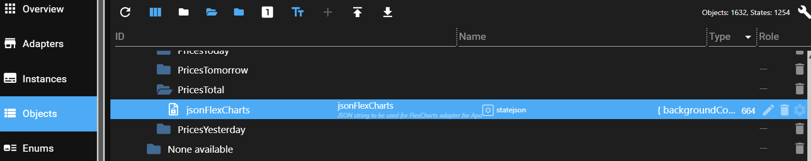

# Konfiguration der Grafikausgabe

_Teil der [ioBroker.tibberlink-Dokumentation](/#/adapters/tibberlink) ._

Der Adapter hilft bei der Visualisierung von Preistrends und Rechnerergebnissen. Er bietet drei Komplexitätsstufen – von einem einfachen JSON-basierten Ansatz bis hin zu einer vollständig individualisierten JavaScript-Lösung.

## 1. **(In Entwicklung) Visualisierung mit dem „E-Charts“-Adapter**

Bei dieser Methode muss der Adapter „E-Charts“ separat installiert werden.

- Im Abschnitt „Rechnerzustände“ werden JSON-Daten generiert (`Output-E-Charts` ) kann verwendet werden.
- Die Möglichkeiten sind durch die Beschränkungen des E-Charts-Adapters eingeschränkt.

## 2. **Verwendung des „FlexCharts“- (oder „Fully Featured eCharts“-)Adapters mit JSON**

Diese Methode erfordert die separate Installation des "FlexCharts"-Adapters.

- Der TibberLink-Adapter erzeugt einen Zustand namens`jsonFlexCharts` Die

  ```
                            
  ```

- Der FlexCharts-Adapter rendert diesen Zustand über die folgende URL:
  ```
  http://[YOUR IP of FLEXCHARTS]:8082/flexcharts/echarts.html?source=state&id=tibberlink.0.Homes.[TIBBER-HOME-ID].PricesTotal.jsonFlexCharts
  ```

- Ab Version 0.7.0 unterstützt FlexCharts automatische Diagrammaktualisierungen über SSE (Server-Sent Events). Um diese Funktion zu nutzen, fügen Sie Folgendes hinzu:`&sse` zur URL:
  ```
  http://[YOUR IP of FLEXCHARTS]:8082/flexcharts/echarts.html?source=state&id=tibberlink.0.Homes.[TIBBER-HOME-ID].PricesTotal.jsonFlexCharts&sse=30
  ```

- Weitere Einzelheiten finden Sie in der [Dokumentation des FlexCharts-Adapters](https://github.com/MyHomeMyData/ioBroker.flexcharts) .

### **Verwendung der JSON-Vorlage**

- Der`jsonFlexCharts` Der Zustand wird auf Basis einer Vorlage generiert, die über den JSON-Editor in den Adaptereinstellungen konfiguriert wird.
- Der integrierte JSON-Editor verwendet den JSON5-Modus, daher sind Kommentare und nachfolgende Kommas zulässig.
- Eine Beispielvorlage kann hier heruntergeladen werden: [TemplateFlexChart01.md](/#/docs/adapterref/iobroker.tibberlink/docu/TemplateFlexChart01.md) .
- Kopieren Sie die Vorlage und fügen Sie sie in den JSON-Editor ein.
- Die Vorlage enthält die Platzhalter:
  - `%%seriesData%%` (wird zur Laufzeit mit den Zeitreihen-Preisdaten gefüllt).
  - `%%CalcChannelsData%%` (mit ausgewählten Taschenrechnerkanaldaten gefüllt).
- Der Rest der Vorlage entspricht der Apache ECharts-Konfiguration. Beispiele finden Sie unter [Apache ECharts Examples](https://echarts.apache.org/examples/en/index.html) .
- **Empfehlung:** Testen Sie den TibberLink-Adapter ohne eine echte Vorlage mithilfe der Standardzeichenfolge:
  ```
  %%seriesData%%\n\n%%CalcChannelsData%%
  ```
  Dies hilft, seine Funktionsweise zu verstehen.
- Template-Anpassungen können auf Apache ECharts-Beispielseiten mithilfe der Zustandsdaten „Output-E-Charts“ getestet werden.
- Gute Vorlagen werden innerhalb der TibberLink-Adapter-Community geteilt.

## 3. **Verwendung von „FlexCharts“ mit benutzerdefiniertem JavaScript-Code**

Für maximale Flexibilität und Anpassungsmöglichkeiten kann der FlexCharts-Adapter mit benutzerdefiniertem JavaScript verwendet werden.

- Sowohl der "FlexCharts"- als auch der "JavaScript"-Adapter müssen separat installiert werden.
- Dieser Ansatz ermöglicht die Erstellung mehrerer individueller Diagramme.
- Weitere Details finden Sie in der [FlexCharts-Adapter-Diskussion](https://github.com/MyHomeMyData/ioBroker.flexcharts/discussions/67) .