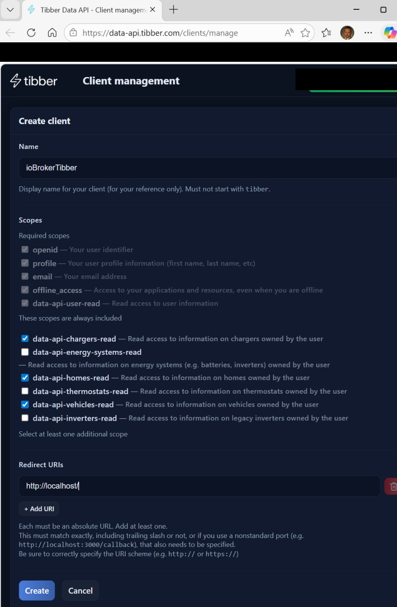
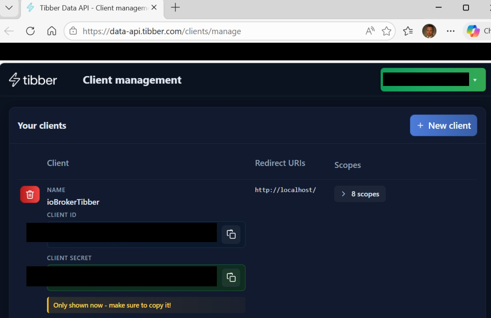
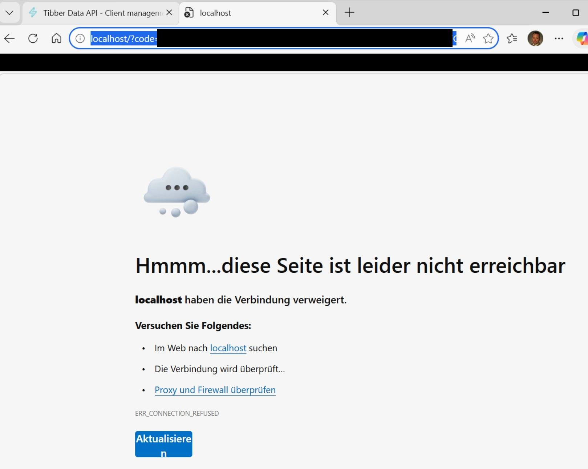

# Fahrzeug- und Ladegerätekonfiguration

_Teil der [ioBroker.tibberlink-Dokumentation](/#/adapters/tibberlink) ._

Tibber betreibt zwei separate APIs mit unterschiedlichen Zwecken:

- **Developer GraphQL API** (`api.tibber.com` ) – Energiepreise, Verbrauchshistorie und der Pulse-Live-Feed. Darauf hat man mit dem Standard-Tibber-API-Token (von [developer.tibber.com](https://developer.tibber.com) ) Zugriff.
- **Tibber Data API** (`data-api.tibber.com` ) — IoT-Gerätedaten für gekoppelte Fahrzeuge, Ladegeräte, Wärmepumpen und Wechselrichter. Dies ist eine neuere, separate REST-API, die eine eigene OAuth2-Client-Registrierung erfordert.

Die APIs ersetzen einander nicht – sie ergänzen sich. Die hier beschriebene Fahrzeug- und Ladegerätfunktion nutzt die Daten-API und benötigt daher neben dem Haupt-API-Token eigene Zugangsdaten.

> Entwickler-/Forschungsnotizen zur Data API (Endpunkte, Geräteschema, Funktionen) befinden sich in [../Info/TibberDataAPI.md](https://github.com/Hombach/ioBroker.tibberlink/blob/master/Info/TibberDataAPI.md) .

## Voraussetzungen

1. Öffnen Sie <https://data-api.tibber.com/clients/manage> und klicken Sie auf **+ Neuer Client** .

 

2. Geben Sie dem Kunden einen Namen (z. B.`ioBrokerTibber` ), die **Umleitungs-URI** genau auf den Wert setzen.`http://localhost/` (mit abschließendem Schrägstrich) und aktivieren Sie mindestens diese Bereiche:

   - `data-api-homes-read`
   - `data-api-vehicles-read`
   - `data-api-chargers-read`

    

3. Klicken Sie auf **„Erstellen“** . Kopieren Sie sofort die **Client-ID** und **das Client-Geheimnis** – das Geheimnis wird nur einmal angezeigt.

 

4. Öffnen Sie die Registerkarte **„Fahrzeuge & Ladegeräte“** in der Adapterkonfiguration, geben Sie beide Werte ein und speichern Sie.
5. Starten Sie den Adapter neu. Es wird eine **Warnung** protokolliert, die die sofort einsatzbereite Autorisierungs-URL mit Ihrer bereits eingetragenen Client-ID enthält:
   ```
   [tibberDataAPI]: no auth code configured — please authorize. URL: https://thewall.tibber.com/connect/authorize?client_id=<your-id>&...
   ```
6. Öffnen Sie diese URL in einem Browser und melden Sie sich mit Ihrem Tibber-Konto an, um Zugriff zu gewähren.
7. Der Browser wird umleiten zu`http://localhost/` und zeigt einen Verbindungsfehler an – das ist **zu erwarten und korrekt** . Kopieren Sie die vollständige URL aus der Adressleiste (sie enthält`?code=...` ).

 

8. Fügen Sie die vollständige URL in das Feld **„Auth-Code“** in der Adapterkonfiguration ein und speichern Sie die Einstellungen.
9. Der Adapter tauscht den Code gegen Tokens aus und beginnt mit dem Polling. Das Feld „Authentifizierungscode“ wird automatisch geleert.

Der Adapter speichert das Aktualisierungstoken intern und erneuert das Zugriffstoken automatisch, sodass dieser einmalige Autorisierungsschritt nicht wiederholt werden muss.

## Verfügbare Staaten

Fahrzeugdaten werden geschrieben nach`Vehicles.<VIN>.*` :

| Zustand               | Beschreibung                                                 |
| --------------------- | ------------------------------------------------------------ |
| `ChargingStatus`      | Aktueller Ladestatus                                         |
| `HomeId`              | Zugehörige Tibber-Haus-ID                                    |
| `LastSeen`            | Zeitstempel, wann das Gerät zuletzt von Tibber gesehen wurde |
| `LastUpdated`         | Zeitstempel der letzten Datenaktualisierung                  |
| `PlugStatus`          | Steckerverbindungsstatus                                     |
| `Range`               | Restreichweite in km                                         |
| `StateOfCharge`       | Batterieladestand in %                                       |
| `TargetStateOfCharge` | Zielladezustand in %                                         |

Die Ladedaten werden geschrieben an`Chargers.<id>.*` Da die Ladefunktionen je nach Hersteller variieren können (z. B. go-e, Wallbox Pulsar Plus), wird jede gemeldete Funktion als eigener Zustand definiert, benannt nach der Funktion-ID der Data API (Punkte werden durch Unterstriche ersetzt) und mit der von der API bereitgestellten Beschreibung versehen. Typische Zustände sind:

| Zustand                            | Beschreibung                                                 |
| ---------------------------------- | ------------------------------------------------------------ |
| `connector_status`                 | Ladeanschlussstatus                                          |
| `charging_status`                  | Ladestatus des Ladegeräts                                    |
| `charging_current_max`             | Maximal zulässiger Ladestrom (A)                             |
| `charging_current_offlineFallback` | Notstromversorgung bei Ausfall des Ladegeräts (A)            |
| `grid_phaseCount`                  | Anzahl der zum Laden verwendeten Phasen                      |
| `HomeId`                           | Zugehörige Tibber-Haus-ID                                    |
| `LastSeen`                         | Zeitstempel, wann das Gerät zuletzt von Tibber gesehen wurde |
| `LastUpdated`                      | Zeitstempel der letzten Datenaktualisierung                  |

## Umfrageintervall

Das Abfrageintervall kann auf der Registerkarte **Fahrzeuge & Ladegeräte** konfiguriert werden (1–60 Minuten, Standard: 5 Minuten).