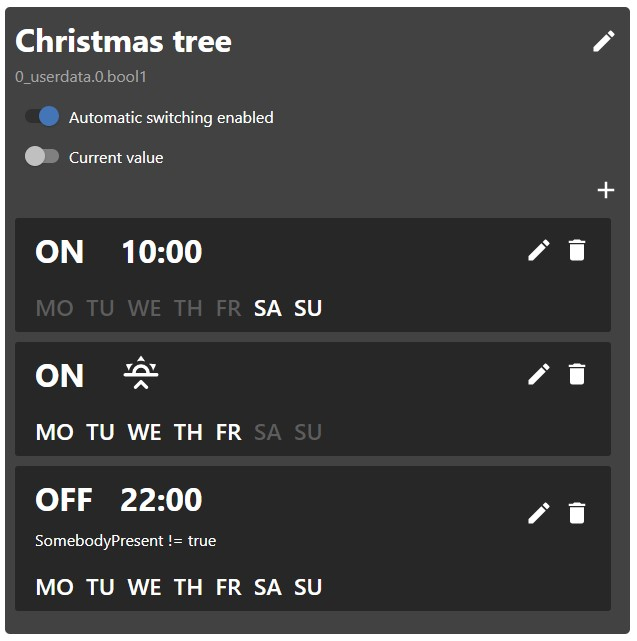

# ioBroker.time-switch

## Zeitschalteradapter für ioBroker

Dieser Adapter ermöglicht es dem Benutzer, Geräte mithilfe von Zeitplänen ein- und auszuschalten. Die Zeitpläne lassen sich vollständig über ein Vis-Widget konfigurieren. Ein Zeitplan schaltet einen oder mehrere ioBroker-Zustände und besteht aus einem oder mehreren Triggern, die festlegen, wann und wie der Zustand umgeschaltet werden soll. Es ist möglich, die Uhrzeit und die Wochentage für die Auslösung des Triggers zu konfigurieren. Auch Astro-Trigger können erstellt werden. Zudem lassen sich benutzerdefinierte Ein-/Ausschaltwerte festlegen. Im Widget kann der Zeitplan vorübergehend deaktiviert und der geschaltete Zustand manuell gesteuert werden.

## Aufstellen

Die Installationsanleitung finden Sie im [Wiki](https://github.com/walli545/ioBroker.time-switch/wiki) (auch auf Deutsch verfügbar).

## Mögliche Funktionen in der Zukunft

- Countdown-Trigger
- Umschalten beliebiger Werte

## Changelog
### 2.2.2
* (walli545)
  * (Fix) Astro triggers not executing after time change (#133)
  * (Fix) Set common.dataSource and common.connectionType in io-package.json (#135)

### 2.2.1
* (walli545)
    * (Fix) Set js-controller dependency to >= 2.0.0

### 2.2.0
* (walli545)
    * (New) Conditional triggers that only execute when a certain condition is met (#31)
    * (New) Option to hide edit name button in widget (#119)
    * (Fix) Astro triggers not executing on days after initial creation (#123)
    * (Fix) Improved error handling (#61)

### 2.1.0
* (walli545)
    * Added astro triggers which can trigger on sunrise, noon, sunset with +- 120 min offset (#30)
    * Added custom styling via css custom properties
    * Fixed a bug which lead to undefined button behaviour when the widget is used together with material design theme by Uhula (#62)
    * Changed state listening to be a be ack based and removed unused on object change listener (#6)

### 2.0.0
**Attention**: Due to breaking changes in the schedule data structure, schedules created with versions 1.x are not compatible with 2.x.

*Before upgrading, remove all schedules in the instance settings and remove widgets in vis.*
* (walli545)
    * Value type can now be configured, this enables switching of real booleans and numbers (#19)
    * Added a new state for each schedule to disable/enable automatic switching (#24)
    * Added option to hide current value switch in widget (#23)
    * Switching of multiple states with one schedule. This allows the creation of groups for devices of the same type
    * Added translations to widget (#35)
    * Fixed widget not working on Safari and fully browser

### 1.1.0
* (walli545) 
    * New option to hide switched oid in widget (#20)
    * Fixed admin page not working on Firefox (#18)
    * Showing full schedule oid in admin page (e.g. time-switch.0.schedule0 instead of schedule0).

### 1.0.0
* (walli545) initial release, features:
    * Admin settings to create schedules
    * vis widget to edit schedules and add actions

## License
MIT License

Copyright (c) 2019-2021 walli545 <walli5446@gmail.com>

Permission is hereby granted, free of charge, to any person obtaining a copy
of this software and associated documentation files (the "Software"), to deal
in the Software without restriction, including without limitation the rights
to use, copy, modify, merge, publish, distribute, sublicense, and/or sell
copies of the Software, and to permit persons to whom the Software is
furnished to do so, subject to the following conditions:

The above copyright notice and this permission notice shall be included in all
copies or substantial portions of the Software.

THE SOFTWARE IS PROVIDED "AS IS", WITHOUT WARRANTY OF ANY KIND, EXPRESS OR
IMPLIED, INCLUDING BUT NOT LIMITED TO THE WARRANTIES OF MERCHANTABILITY,
FITNESS FOR A PARTICULAR PURPOSE AND NONINFRINGEMENT. IN NO EVENT SHALL THE
AUTHORS OR COPYRIGHT HOLDERS BE LIABLE FOR ANY CLAIM, DAMAGES OR OTHER
LIABILITY, WHETHER IN AN ACTION OF CONTRACT, TORT OR OTHERWISE, ARISING FROM,
OUT OF OR IN CONNECTION WITH THE SOFTWARE OR THE USE OR OTHER DEALINGS IN THE
SOFTWARE.