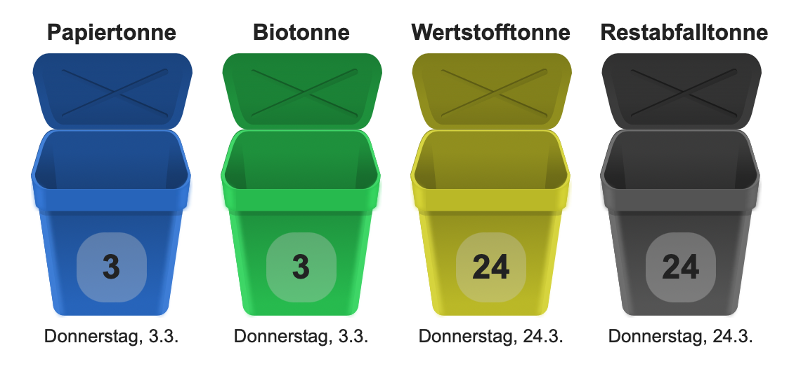

# ioBroker.trashschedule

## Inhaltsverzeichnis

- [Blockly](blockly.md)
- [JavaScript](javascript.md)
- [FAQ](faq.md)

## Anforderungen

1. nodejs 14.5 (oder neuer)
2. js-controller 4.0.15 (oder neuer)
3. iCal Adapter 1.12.1 (oder neuer)
4. Admin Adapter 6.0.0 (oder neuer)

## Voraussetzungen

1. Erstelle eine neue Instanz des [ical Adapters](https://github.com/iobroker-community-adapters/ioBroker.ical)
2. Konfiguriere die URL zu deinem Müllkalender (zum Beispiel ein Google Kalender)
3. Setze die "Tagesvorschau" auf einen Wert, welcher möglichst jeden Abfalltyp mindestens zweimal enthält (z.B. 45 Tage)
4. Falls Du die "Ereignisse" verwendest, stelle sicher, dass bei jedem Ereignis "anzeigen" ausgewählt wurde, welches für den Müllkalender ebenfalls relevant ist (andernfalls werden die Termine vom iCal Adapter ausgeblendet)


## Konfiguration

1. Erstelle eine ```trashschedule``` Instanz und wähle die ical-Instanz aus, welche den Müllkalender enthält
2. Wechsle in das Tab "Abfalltypen" und füge so viele Zeilen ein, wie Du Abfalltypen hast
3. Vergib einen Namen für jeden Abfalltyp und lege fest, welche Termine im Kalender für diesen Typ relevant sind
4. Starte die Instanz

**Fragen?** Schaue in die [FAQ](./faq.md)


## VIS Widget (VIS version 1.x)



## Changelog

<!--
  Placeholder for the next version (at the beginning of the line):
  ### **WORK IN PROGRESS**
-->
### **WORK IN PROGRESS**

NodeJS 16.x is required

* (klein0r) Improved log messages

### 2.2.0 (2023-01-16)

* (klein0r) Added completed flag for types

### 2.1.1 (2023-01-11)

* (klein0r) Added Ukrainian language

### 2.1.0 (2022-12-12)

* (klein0r) Dropped Admin 5 support
* (klein0r) Added Ukrainian language

### 2.0.3 (2022-06-02)

* (klein0r) Allow whitespaces in the match pattern

### 2.0.2 (2022-05-27)

* (klein0r) Fixed error handling for trash types with empty name

## License

MIT License

Copyright (c) 2023 Matthias Kleine <info@haus-automatisierung.com>

Permission is hereby granted, free of charge, to any person obtaining a copy
of this software and associated documentation files (the "Software"), to deal
in the Software without restriction, including without limitation the rights
to use, copy, modify, merge, publish, distribute, sublicense, and/or sell
copies of the Software, and to permit persons to whom the Software is
furnished to do so, subject to the following conditions:

The above copyright notice and this permission notice shall be included in all
copies or substantial portions of the Software.

THE SOFTWARE IS PROVIDED "AS IS", WITHOUT WARRANTY OF ANY KIND, EXPRESS OR
IMPLIED, INCLUDING BUT NOT LIMITED TO THE WARRANTIES OF MERCHANTABILITY,
FITNESS FOR A PARTICULAR PURPOSE AND NONINFRINGEMENT. IN NO EVENT SHALL THE
AUTHORS OR COPYRIGHT HOLDERS BE LIABLE FOR ANY CLAIM, DAMAGES OR OTHER
LIABILITY, WHETHER IN AN ACTION OF CONTRACT, TORT OR OTHERWISE, ARISING FROM,
OUT OF OR IN CONNECTION WITH THE SOFTWARE OR THE USE OR OTHER DEALINGS IN THE
SOFTWARE.