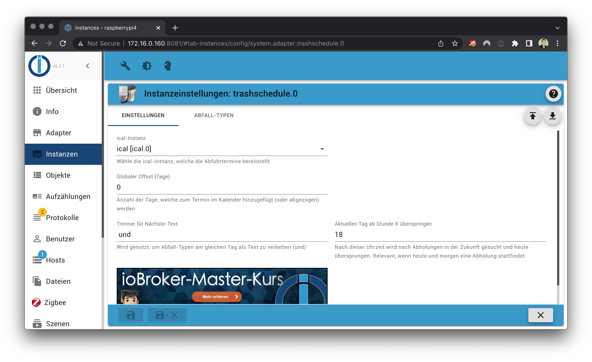
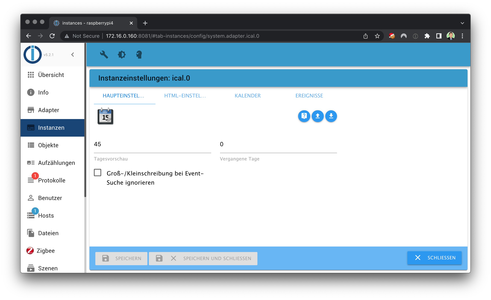

# ioBroker.trashschedule

## Inhaltsverzeichnis

- [Anbieter](/#/docs/adapterref/iobroker.trashschedule/providers.md)
- [Blockly](/#/docs/adapterref/iobroker.trashschedule/blockly.md)
- [JavaScript](/#/docs/adapterref/iobroker.trashschedule/javascript.md)
- [FAQ](/#/docs/adapterref/iobroker.trashschedule/faq.md)

## Anforderungen

1. nodejs 20.0 (oder neuer)
2. js-controller 6.0.0 (oder neuer)
3. Admin Adapter 6.0.0 (oder neuer)
4. iCal Adapter 1.12.1 (oder neuer) - *optional*

## Konfiguration

1. Erstelle eine ```trashschedule``` Instanz und wähle die ical-Instanz aus, welche den Müllkalender enthält. Alternativ können Anbieter direkt ausgewählt werden, welche über verschiedene Online-Dienste integriert werden.
2. Wechsle in das Tab "Abfalltypen" und füge so viele Zeilen ein, wie Du Abfalltypen hast
3. Vergib einen Namen für jeden Abfalltyp und lege fest, welche Termine im Kalender für diesen Typ relevant sind
4. Starte die Instanz

**Fragen?** Schaue in die [FAQ](/#/docs/adapterref/iobroker.trashschedule/faq.md)




## Voraussetzungen für iCal

1. Erstelle eine neue Instanz des [ical Adapters](https://github.com/iobroker-community-adapters/ioBroker.ical)
2. Konfiguriere die URL zu deinem Müllkalender (zum Beispiel ein Google Kalender)
3. Setze die "Tagesvorschau" auf einen Wert, welcher möglichst jeden Abfalltyp mindestens zweimal enthält (z.B. 45 Tage)
4. Falls Du die "Ereignisse" verwendest, stelle sicher, dass bei jedem Ereignis "anzeigen" ausgewählt wurde, welches für den Müllkalender ebenfalls relevant ist (andernfalls werden die Termine vom iCal Adapter ausgeblendet)



## Abfall-Handling - Funktionsweise

- In den Instanzeinstellungen wird mit 'daysuntilaction' eine Vorlaufzeit eingestellt, wieviele Tage im Voraus über die bevorstehende Abholung informiert wird. Annahme: Der Standard dürfte bei vielen 1 Tag, also der Abend vor der Abholung sein.
- Wird diese Vorlaufzeit erreicht, wird der State `actionNeeded` auf `true` gesetzt.
- Wurde der Abfallbehälter an die Straße gestellt, wird dies über den State `completed` bestätigt. Daraufhin wird `actionNeeded` auf `false` gesetzt.
- Um mehrere gleichzeitig auf completed zu setzen gibt es folgende zusätzliche States:
    - `completedToday`= setzt alle Behälter, die heute fällig sind, auf completed
    - `completedTomorrow` = setzt alle Behälter, die morgen fällig sind, auf completed (einschließlich heute)
    - `completedAll` = setzt alle Behälter auf completed, die aktuell anstehen

ttd:
- Übersetzung der Texte
- '???' durch einen sinnvollen Text ersetzen

## VIS Widget (VIS version 1.x)


**VIS 2.x wird mit diesem Widget nicht unterstützt!**