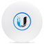

 

# ioBroker.unifi

**Dieser Adapter nutzt die Sentry-Bibliotheken, um Ausnahmen und Codefehler automatisch an die Entwickler zu melden.** Weitere Details und Informationen zum Deaktivieren der Fehlerberichterstattung finden Sie in [der Sentry-Plugin-Dokumentation](https://github.com/ioBroker/plugin-sentry#plugin-sentry) ! Die Sentry-Berichterstattung wird ab js-controller 3.0 verwendet.

Dieser ioBroker-Adapter ermöglicht die Überwachung und eingeschränkte Steuerung von [UniFi-Geräten](http://www.ubnt.com/) , wie z. B. UniFi WiFi Access Points, mithilfe der öffentlichen UniFi Controller Web-API.

## Konfiguration

### Mindestens erforderliche Informationen

Um diesen Adapter in Betrieb zu nehmen, werden folgende Informationen benötigt:

- IP-Adresse und Port Ihres UniFi-Controllers (Lassen Sie das Portfeld leer, falls Ihr Controller unter UniFiOS läuft (z. B. UDM-Pro)).
- Lokaler Benutzername und lokales Passwort (2FA wird **nicht** unterstützt)
- Aktualisierungsintervall

Die Informationen werden standardmäßig alle 60 Sekunden aktualisiert. Abhängig von Ihrer ioBroker-Hardware und der Größe Ihres Netzwerks (Anzahl der Clients, UniFi-Geräte usw.) wird empfohlen, dieses Intervall beizubehalten und nicht weiter zu verringern.

### Filterobjekte

Der Adapter aktualisiert so viele Informationen wie möglich von Ihrem UniFi-Controller, bietet aber auch die Möglichkeit, die aktualisierten Informationen einzuschränken.

Es ist möglich, die Aktualisierung ausgewählter Informationen zu deaktivieren oder bestimmte Objekte dieser Informationen zu filtern.

| Information | Objekte, die nach folgenden Kriterien gefiltert werden können: |
| ----------- | -------------------------------------------------------------- |
| Kunden      | Name, Hostname, IP-Adresse, MAC-Adresse                        |
| Geräte      | Name, IP-Adresse, MAC-Adresse                                  |
| WLANs       | Name                                                           |
| Netzwerke   | Name                                                           |
| Gesundheit  | Teilsystem                                                     |

## Kontrolle

### WLAN aktivieren/deaktivieren

Durch Ändern des Aktivierungsstatus eines WLAN-Netzwerks kann dieses aktiviert oder deaktiviert werden. Die Änderung wird einige Sekunden später an die Zugangspunkte übermittelt.

### Gutscheinerstellung

Verwendung der`vouchers.create_vouchers` Über diese Schaltfläche können vordefinierte Gutscheine erstellt werden. Es ist möglich, die Anzahl der zu erstellenden Gutscheine, deren Gültigkeitsdauer sowie Upload- und Downloadlimits festzulegen.

## Fehlende Datenpunkte

Der Adapter verwendet [node-unifi,](https://github.com/jens-maus/node-unifi) um eine Verbindung zu Ihrem UniFi Controller herzustellen. Um die Einrichtung zu vereinfachen, werden nicht alle verfügbaren Datenpunkte in Ihren ioBroker übernommen. Falls Datenpunkte fehlen, verwenden Sie die folgenden URLs, um die API zu überprüfen. (Hinweis: Ersetzen Sie IP, PORT und SITE durch Ihre Einstellungen.)

| Information | API-URL                                       |
| ----------- | --------------------------------------------- |
| Websites    | <https://IP:PORT/api/self/sites>              |
| SysInfo     | <https://IP:PORT/api/s/SITE/stat/sysinfo>     |
| Kunden      | <https://IP:PORT/api/s/SITE/stat/sta>         |
| Geräte      | <https://IP:PORT/api/s/SITE/stat/device>      |
| WLANs       | <https://IP:PORT/api/s/SITE/rest/wlanconf>    |
| Netzwerke   | <https://IP:PORT/api/s/SITE/rest/networkconf> |
| Gesundheit  | <https://IP:PORT/api/s/SITE/stat/health>      |
| Gutscheine  | <https://IP:PORT/api/s/SITE/stat/voucher>     |
| DPI         | <https://IP:PORT/api/s/SITE/stat/dpi>         |
| Alarm       | <https://IP:PORT/api/s/SITE/stat/alarm>       |

### UniFiOS (UDM-Pro)-Endpunkte

| Information | API-URL                                                |
| ----------- | ------------------------------------------------------ |
| Websites    | <https://IP/proxy/network/api/self/sites>              |
| SysInfo     | <https://IP/proxy/network/api/s/SITE/stat/sysinfo>     |
| Kunden      | <https://IP/proxy/network/api/s/SITE/stat/sta>         |
| Geräte      | <https://IP/proxy/network/api/s/SITE/stat/device>      |
| WLANs       | <https://IP/proxy/network/api/s/SITE/rest/wlanconf>    |
| Netzwerke   | <https://IP/proxy/network/api/s/SITE/rest/networkconf> |
| Gesundheit  | <https://IP/proxy/network/api/s/SITE/stat/health>      |
| Gutscheine  | <https://IP/proxy/network/api/s/SITE/stat/voucher>     |
| DPI         | <https://IP/proxy/network/api/s/SITE/stat/dpi>         |
| Alarm       | <https://IP/proxy/network/api/s/SITE/stat/alarm>       |

## Bekannte Probleme

- Der Verbindungsstatus (is\_wired) von Clients ist nach dem Offline-Gehen eines Clients fehlerhaft. Dies ist ein bekanntes Problem des UniFi-Controllers und steht nicht im Zusammenhang mit dem Adapter. (Siehe <https://community.ui.com/questions/Wireless-clients-shown-as-wired-clients/49d49818-4dab-473a-ba7f-d51bc4c067d1> )

## Referenzen

Dieser Adapter nutzt Funktionen der folgenden Drittanbieter-Node.js-Module:

- [node-unifi](https://github.com/jens-maus/node-unifi)
- [json-logic-js](https://github.com/jwadhams/json-logic-js)

## Changelog
<!--
    Placeholder for the next version (at the beginning of the line):
    ### **WORK IN PROGRESS**
-->

### **WORK IN PROGRESS**
- (copilot) Adapter requires node.js >= 22 now
- (copilot) Adapter requires admin >= 7.7.22 now
- (copilot) Adapter requires js-controller >= 6.0.11 now

### 0.7.0 (2024-04-13)
* (mcm1957) Adapter requires node.js 18 and js-controller >= 5 now
* (mcm1957) Dependencies have been updated

### 0.6.7 (2023-12-10)
* (jens-maus) updated node-unifi to 2.5.1 to fix UDMpro v3.2.x auth issues
* (jens-maus) updated dependencies

### 0.6.6 (2023-06-20)
* (pafade89) fixed broken client status updates (#672)

### 0.6.5 (2023-06-20)
* (jens-maus) Bumped node-unifi to latest 2.4.1

### 0.6.4 (2023-03-31)
* (jens-maus) Bumped node-unifi to latest 2.4.0
* (wuliwux) fixed issue in setWlanStatus not working (#665, #601)
* (pafade89) New feature for whitelisting client objects (#651)
* (Scrounger) client block / unblock added
* (Scrounger) restart device added
* (Scrounger) led override added
* (Scrounger) port power cycle added

### 0.6.3 (2022-10-08)
* (jens-maus) Bumped node-unifi to latest 2.2.1 (fixes #613)

### 0.6.2 (2022-10-07)
* (jens-maus) Bumped node-unifi to latest 2.2.0
* (maximilian-1) port-overrides structures added
* (Scrounger) poe power switch added
* (Scrounger) client reconnect added

### 0.6.1 (2022-06-08)
* (jens-maus) Bumped node-unifi to latest 2.1.0
* (jens-maus) updated translations

### 0.6.0 (2022-06-05)
* IMPORTANT: js-controller 2.0 or higher is required
* IMPORTANT: If Login do not work please re-enter the password in the instance configuration
* (Apollon77) Migrate to new version of unifi library
* (Apollon77) Allow to specify if SSL error should be ignored or not  (Default is to ignore errors as in former versions)
* (jens-maus) Fixed more device state object definitions to get rid of state warnings.
* (jens-maus/Apollon77) Updated dependencies, make compatible to newest firmwares

### 0.5.10 (2021-05-27)
* (jens-maus) Changed "Update done" output to be output as debug info.
* (jens-maus) Updated dependencies.

### 0.5.9 (2021-05-07)
* (jens-maus) Fixed all js-controller 3.3 related state warnings
* (kirovilya, jens-maus) Added device state object with dedicated states list.
* (jens-maus) Updated node-unifi to latest version
* (jens-maus) Updated dependencies

### 0.5.8 (2020-08-29)
* (braindead1) Fixed problems related to unused sites
* (braindead1) Fixed some errors reported via Sentry

### 0.5.7 (2020-07-27)
* (braindead1) Fixed Sentry errors caused by not updated configuration after update

### 0.5.6 (2020-07-25)
* (Scrounger, braindead1) Implemented Alarms, DPI & Gateway Traffic
* (braindead1) Prevented creation of ghost clients caused by iOS MAC randomization
* (dklinger) Implemented manual update trigger
* (braindead1) Implemented deletion of used vouchers
* (braindead1) Fixed some errors reported via Sentry

### 0.5.5 (2020-06-13)
* (braindead1) Fixed some errors reported via Sentry

### 0.5.4 (2020-06-06)
* (braindead1) Implemented offset for is_online
* (braindead1) Fixed some issues related to is_online
* (braindead1) Prepared whitelisting of clients etc.

### 0.5.2 (2020-05-23)
* (jens-maus) Implemented UniFiOS/UDM-Pro support
* (braindead1) Implemented possibility to enable/disable WLANs
* (braindead1) Implemented voucher creation
* (braindead1) Implemented online state for clients
* (braindead1) Updated client states
* (braindead1) Updated device states
* (braindead1) Improved error messages

### 0.5.0 (2020-05-09)
* (braindead1) Implemented configuration of updates
* (braindead1) Improved JsonLogic
* (braindead1) Removed legacy code
* (braindead1) Implemented Sentry

### 0.4.3 (2020-04-24)
* (braindead1) fixed configuration issue

### 0.4.2 (2020-04-23)
* (braindead1) subsystem issue fixed

### 0.4.1 (2020-04-16)
* (braindead1) Enhanced refactoring

### 0.4.0 (2020-04-16)
* (bluefox) Refactoring

### 0.3.1
* (jens-maus) added support for multi-site environments.

### 0.3.0
* (jens-maus) added access device data query and moved the client devices to the 'clients' subtree instead

### 0.2.1
* (jens-maus) minor fixes

### 0.2.0
* (jens-maus) moved `lib/unifi.js` to dedicated node-unifi nodejs class and added it as a dependency.

### 0.1.0
* (jens-maus) implemented a first basically working version which can retrieve status information from a UniFi controller.

### 0.0.1
* (jens-maus) initial checkin of non-working development version

[Older changelogs can be found there](https://github.com/iobroker-community-adapters/ioBroker.unifi/blob/master/CHANGELOG_OLD.md)

## License
The MIT License (MIT)

Copyright (c) 2024-2026 iobroker-community-adapters <iobroker-community-adapters@gmx.de>
Copyright (c) 2016-2023 Jens Maus &lt;mail@jens-maus.de&gt;
Copyright (c) 2020 braindead1 &lt;os.braindead1@gmail.com&gt;

Permission is hereby granted, free of charge, to any person obtaining a copy
of this software and associated documentation files (the "Software"), to deal
in the Software without restriction, including without limitation the rights
to use, copy, modify, merge, publish, distribute, sublicense, and/or sell
copies of the Software, and to permit persons to whom the Software is
furnished to do so, subject to the following conditions:

The above copyright notice and this permission notice shall be included in
all copies or substantial portions of the Software.

THE SOFTWARE IS PROVIDED "AS IS", WITHOUT WARRANTY OF ANY KIND, EXPRESS OR
IMPLIED, INCLUDING BUT NOT LIMITED TO THE WARRANTIES OF MERCHANTABILITY,
FITNESS FOR A PARTICULAR PURPOSE AND NONINFRINGEMENT. IN NO EVENT SHALL THE
AUTHORS OR COPYRIGHT HOLDERS BE LIABLE FOR ANY CLAIM, DAMAGES OR OTHER
LIABILITY, WHETHER IN AN ACTION OF CONTRACT, TORT OR OTHERWISE, ARISING FROM,
OUT OF OR IN CONNECTION WITH THE SOFTWARE OR THE USE OR OTHER DEALINGS IN
THE SOFTWARE.