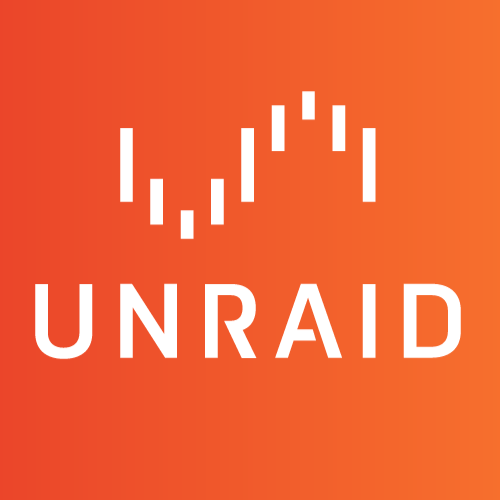
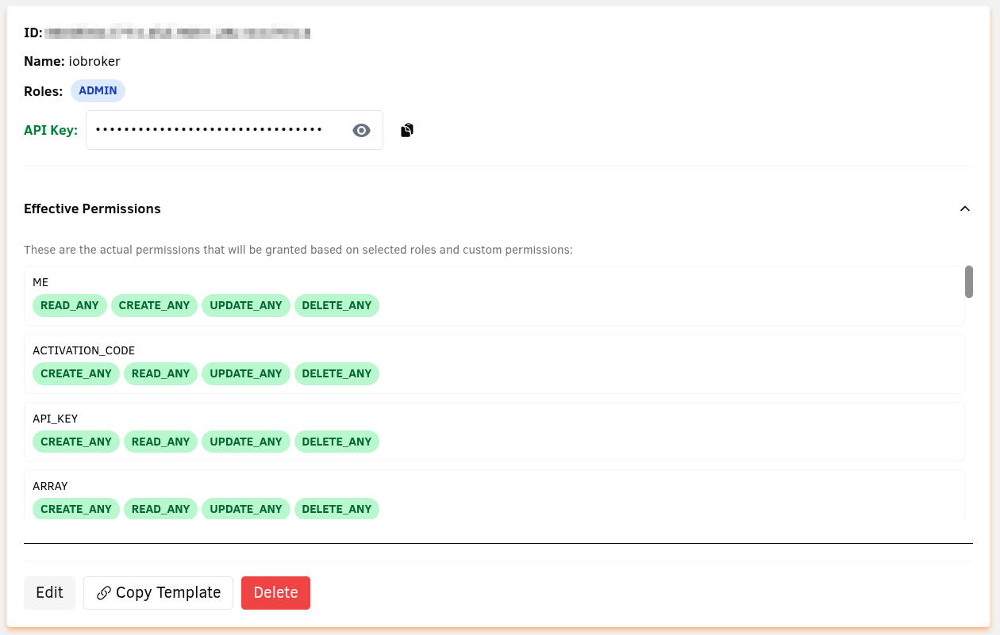
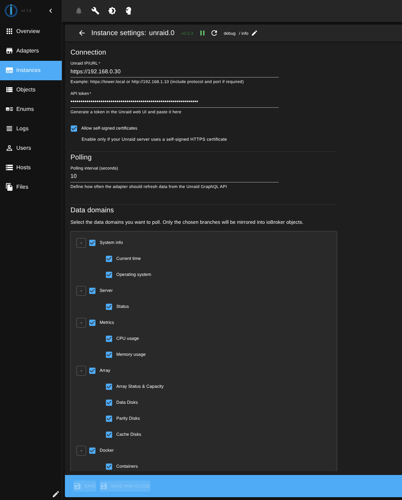
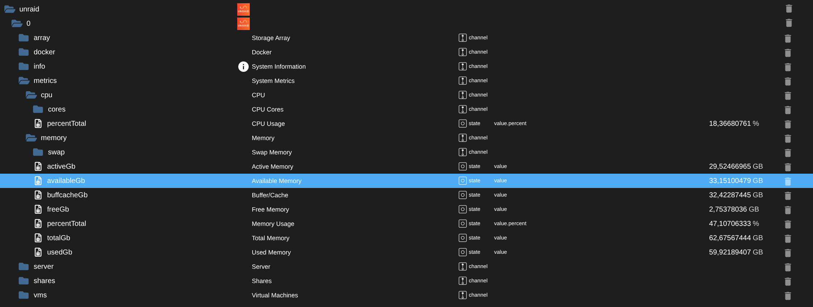
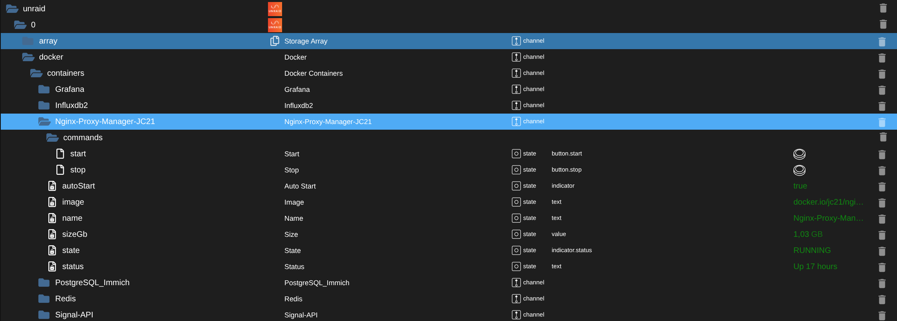
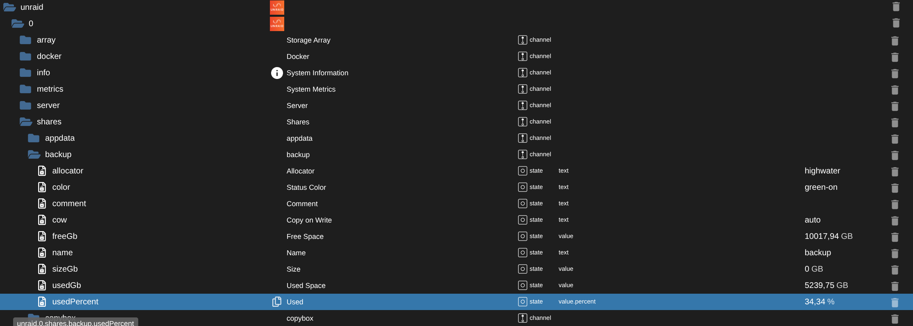

# ioBroker.unraid

> **⚠️ In Arbeit** : Dieser Adapter befindet sich in aktiver Entwicklung. Zusätzliche Datenpunkte und Funktionen sind für zukünftige Versionen geplant.

## Unraid-Adapter für ioBroker

Dieser Adapter verbindet ioBroker über die GraphQL-API mit Unraid-Servern, um Systemmetriken und -status zu überwachen.

## Merkmale

- Überwachung der CPU- und Speicherauslastung (einschließlich Statistiken pro Kern)
- Überwachung der Temperatursensoren auf dem Mainboard (Chipsatz, Umgebungstemperatur usw.) – erfordert Unraid 7.2+
- Serverstatus und Netzwerkinformationen verfolgen
- Docker-Container überwachen und steuern (Starten/Stoppen/Pausieren/Fortsetzen/Aktualisieren) – Pause/Fortsetzen/Aktualisieren erfordert Unraid 7.2+
- Docker-Update-Erkennung pro Container und als Zusammenfassung – erfordert Unraid 7.2+
- Array-Festplatten (Daten, Parität, Cache) mit Zustandsinformationen anzeigen
- Netzwerkfreigaben überwachen (Nutzung, Konfiguration, Dateisystemdetails)
- Virtuelle Maschinen überwachen und steuern (Starten/Stoppen/Anhalten/Fortsetzen/Neustarten)
- Konfigurierbares Abfrageintervall

## Konfiguration

### Generieren eines API-Tokens in Unraid

#### Für Unraid-Versionen vor 7.2:

1. Installieren Sie das **„Unraid Connect Plugin“** aus dem Unraid Community Applications Store.
2. Nach der Installation navigieren Sie zu: **Einstellungen → Verwaltungszugriff → API-Schlüssel**

#### Für Unraid 7.2 und höher:

- Die API-Funktionalität ist integriert. Gehen Sie direkt zu: **Einstellungen → Verwaltungszugriff → API-Schlüssel**

#### Token erstellen:

1. Klicken Sie auf **„API-Schlüssel hinzufügen“.**

2. Konfigurieren Sie die Berechtigungen:

   - **Basisrolle** : Wählen Sie **„Betrachter“** (bietet Lesezugriff auf Systeminformationen, Metriken, Datenträger usw.).
   - **Zusätzliche Berechtigungen** (erforderlich für Steuerungsfunktionen):
     - **Docker Manager** : Ermöglicht das Starten/Stoppen von Docker-Containern
     - **VM-Manager** : Ermöglicht das Starten, Stoppen und Anhalten virtueller Maschinen

   **Alternative Schnellinstallation** : Kopieren Sie diese Vorlagenzeichenfolge und fügen Sie sie in **API-Schlüssel → „Aus Vorlage erstellen“** ein:

   ```
   ?name=ioBroker+unraid+adapter+key&scopes=role%3Aviewer%2Cdocker%2Bvms%3Acreate_any%2Bdelete_any%2Bread_any%2Bupdate_any%2Carray%2Bdashboard%2Bdisk%2Binfo%2Blogs%2Bnetwork%3Aread_any
   ```

3. Geben Sie dem Token einen aussagekräftigen Namen (z. B. „ioBroker“).

4. Kopieren Sie das generierte Token (API-Schlüssel) – Sie benötigen es für die Adapterkonfiguration.



### Adaptereinstellungen

1. **Basis-URL** : Geben Sie Ihre Unraid-Serveradresse ein (z. B.`https://192.168.1.10` oder`https://tower.local` )
2. **API-Token** : Fügen Sie den Admin-Token ein, den Sie in Unraid generiert haben.
3. **Abfrageintervall** : Legen Sie fest, wie oft Daten abgerufen werden sollen (Standard: 60 Sekunden, Minimum: 10 Sekunden).
4. **Selbstsignierte Zertifikate** : Aktivieren Sie diese Option, wenn Ihr Unraid-Server ein selbstsigniertes HTTPS-Zertifikat verwendet.
5. **Datendomänen** : Wählen Sie die zu überwachenden Datenkategorien aus (Systeminformationen, Serverstatus, Metriken usw.).

### Konfigurationsschnittstelle



### Erstellte Objekte

Der Adapter erstellt eine strukturierte Objektstruktur für die überwachten Daten:

<br>

<br>



## Anforderungen

- Unraid-Server (Version 7.0.0+ empfohlen)
  - Für Versionen vor 7.2: Installieren Sie das „Unraid Connect Plugin“ aus den Community-Anwendungen.
  - Ab Version 7.2: API-Unterstützung ist integriert.
- API-Token mit Viewer-Rolle (plus Docker/VM Manager für Steuerungsfunktionen)
- Netzwerkzugriff von ioBroker auf den Unraid-Server

## Changelog

<!--
  Placeholder for the next version (at the beginning of the line):
  ### **WORK IN PROGRESS**
-->
### 0.10.0 (2026-08-21)

- (ingel81) Security fixes in the network libraries (`ws`, `undici`)
- (ingel81) **Node.js 22.19.0 or higher is required** — this has been the case since 0.8.0, the adapter just declared 22.0.0 by mistake
- (ingel81) Completed the settings translations for all languages (Ukrainian was mostly missing)
- (ingel81) Updated Apollo Client, graphql-ws and the ioBroker adapter core

### 0.9.0 (2026-05-03)

- (ingel81) New mainboard temperature sensors (chipset, ambient, ...) as an optional data domain
- (ingel81) New update indicator per Docker container plus a summary (`docker.updates.hasUpdates` / `availableCount`)
- (ingel81) New Pause, Resume and Update buttons for Docker containers
- (ingel81) Requires Unraid 7.2 or newer for the new features (tested on 7.2.4). Older Unraid versions keep working as before — new states are silently omitted and existing data is preserved.

### 0.8.0 (2026-04-19)

- (ingel81) **Node.js 22 or higher is now required** (Node 20 reached end-of-life on 2026-03-24)
- (ingel81) Requires ioBroker admin 7.6.20 or newer
- (ingel81) Updated runtime dependencies (graphql, undici, ws, @apollo/client)
- (ingel81) Internal: CI migrated to Node 22/24, dev dependencies refreshed

### 0.7.2 (2026-01-04)

- (ingel81) Updated dependencies and admin UI (React 19)

### 0.7.1 (2025-11-30)

- (ingel81) Minor pipeline issues fixed

[Older changelogs can be found there](https://github.com/ingel81/ioBroker.unraid/blob/master/CHANGELOG_OLD.md)

## License

MIT License

Copyright (c) 2025-2026 ingel81 <ingel81@sgeht.net>

Permission is hereby granted, free of charge, to any person obtaining a copy
of this software and associated documentation files (the "Software"), to deal
in the Software without restriction, including without limitation the rights
to use, copy, modify, merge, publish, distribute, sublicense, and/or sell
copies of the Software, and to permit persons to whom the Software is
furnished to do so, subject to the following conditions:

The above copyright notice and this permission notice shall be included in all
copies or substantial portions of the Software.

THE SOFTWARE IS PROVIDED "AS IS", WITHOUT WARRANTY OF ANY KIND, EXPRESS OR
IMPLIED, INCLUDING BUT NOT LIMITED TO THE WARRANTIES OF MERCHANTABILITY,
FITNESS FOR A PARTICULAR PURPOSE AND NONINFRINGEMENT. IN NO EVENT SHALL THE
AUTHORS OR COPYRIGHT HOLDERS BE LIABLE FOR ANY CLAIM, DAMAGES OR OTHER
LIABILITY, WHETHER IN AN ACTION OF CONTRACT, TORT OR OTHERWISE, ARISING FROM,
OUT OF OR IN CONNECTION WITH THE SOFTWARE OR THE USE OR OTHER DEALINGS IN THE
SOFTWARE.