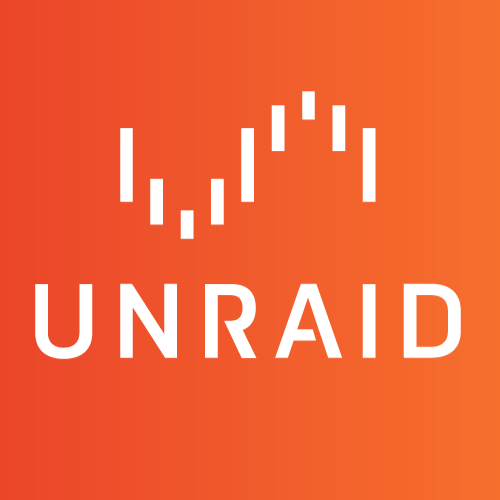
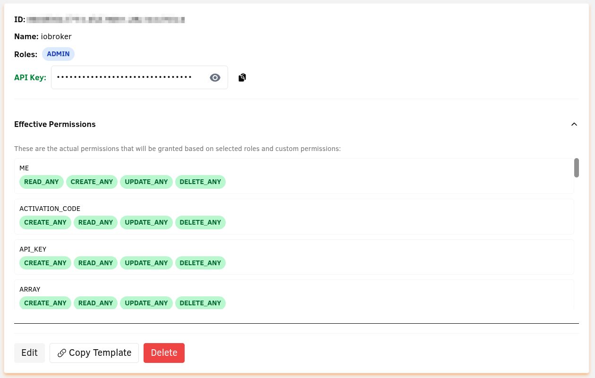
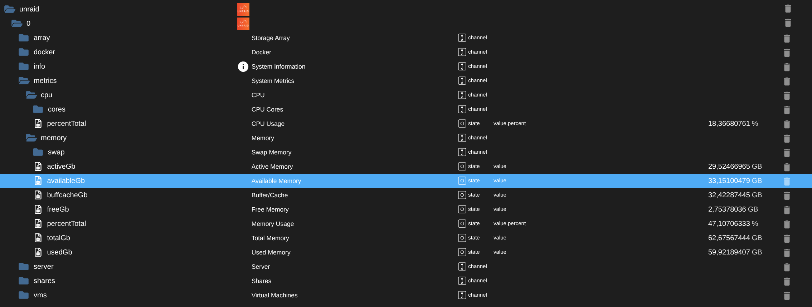
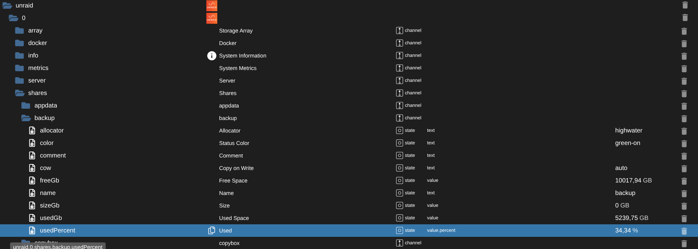

# IoBroker.unraid
> **⚠️ In Arbeit**: Dieser Adapter befindet sich in der aktiven Entwicklung. Weitere Datenpunkte und Funktionen sind für zukünftige Versionen geplant.

**Tests:** 

## Unraid-Adapter für ioBroker
Dieser Adapter verbindet ioBroker über die GraphQL-API mit Unraid-Servern, um Systemmetriken und -status zu überwachen.

## Merkmale
- Überwachung der CPU- und Speichernutzung (einschließlich Statistiken pro Kern)
- Verfolgen Sie den Serverstatus und die Netzwerkinformationen
- Docker-Container überwachen und steuern (Start/Stopp)
- Anzeigen von Array-Festplatten (Daten, Parität, Cache) mit Integritätsinformationen
- Netzwerkfreigaben überwachen (Nutzung, Konfiguration, Dateisystemdetails)
- Virtuelle Maschinen überwachen und steuern (Starten/Stoppen/Pausieren/Fortsetzen/Neustarten)
- Konfigurierbares Abfrageintervall

## Konfiguration
### Generieren eines API-Tokens in Unraid
#### Für Unraid-Versionen vor 7.2:
1. Installieren Sie das **"Unraid Connect Plugin"** aus dem Unraid Community Applications Store
2. Navigieren Sie nach der Installation zu: **Einstellungen → Verwaltungszugriff → API-Schlüssel**

#### Für Unraid 7.2 und höher:
- Die API-Funktionalität ist integriert, gehen Sie direkt zu: **Einstellungen → Verwaltungszugriff → API-Schlüssel**

#### Erstellen des Tokens:
1. Klicken Sie auf **"API-Schlüssel hinzufügen"**
2. **Wichtig**: Wählen Sie **"Admin"** als Zugriffsebene (Rollen: ADMIN)
- Derzeit funktionieren nur Admin-Token ordnungsgemäß (siehe [diesen Forenbeitrag](https://forums.unraid.net/topic/193661-api-access-always-403-forbidden/))
3. Geben Sie dem Token einen beschreibenden Namen (z. B. „ioBroker“)
4. Kopieren Sie den generierten Token (API-Schlüssel) - Sie benötigen ihn für die Adapterkonfiguration

### Adaptereinstellungen
1. **Basis-URL**: Geben Sie Ihre Unraid-Serveradresse ein (z. B. „https://192.168.1.10“ oder „https://tower.local“)
2. **API-Token**: Fügen Sie das Admin-Token ein, das Sie in Unraid generiert haben
3. **Abfrageintervall**: Legen Sie fest, wie oft Daten abgerufen werden sollen (Standard: 60 Sekunden, Minimum: 10 Sekunden)
4. **Selbstsignierte Zertifikate**: Aktivieren Sie diese Option, wenn Ihr Unraid-Server ein selbstsigniertes HTTPS-Zertifikat verwendet
5. **Datendomänen**: Wählen Sie aus, welche Datenkategorien überwacht werden sollen (Systeminformationen, Serverstatus, Metriken usw.).

### Konfigurationsschnittstelle

### Erstellte Objekte
Der Adapter erstellt einen strukturierten Objektbaum für die überwachten Daten:

 

 

## Anforderungen
- Unraid-Server (Version 7.0.0+ empfohlen)
- Für Versionen vor 7.2: Installieren Sie "Unraid Connect Plugin" von Community Applications
- Für Version 7.2+: API-Unterstützung ist integriert
- API-Token auf Administratorebene, generiert in der Unraid-Web-Benutzeroberfläche
- Netzwerkzugriff von ioBroker auf den Unraid-Server

## Changelog

<!--
  Placeholder for the next version (at the beginning of the line):
  ### **WORK IN PROGRESS**
-->
### 0.6.2 (2025-10-19)

- (ingel81) dependencies updated

### 0.6.2-alpha.1 (2025-10-19)

- (ingel81) npm deployment adjusted pt.2

### 0.6.2-alpha.0 (2025-10-19)

- (ingel81) npm deployment adjusted

### 0.6.1 (2025-09-28)

- (ingel81) fix: Use themecolors in settings

### 0.6.0 (2025-09-24)

- (ingel81) Added VM and Docker container control functionality
- (ingel81) Code refactoring and cleanup
- (ingel81) Translation

### 0.5.3 (2025-09-23)

- (ingel81) Support for node 20, 22 and 24

### 0.5.2 (2025-09-22)

- (ingel81) Documentation
- (ingel81) Minor admin page improvements

### 0.5.1 (2025-09-22)

- (ingel81) ESLint9 Migration
- (ingel81) Code refactor

### 0.5.0 (2025-09-21)

- (ingel81) More Unraid queries: Docker containers, shares, VMs, array disks with dynamic state creation,
- (ingel81) Apollo Client migration

### 0.4.1 (2025-09-21)

- (ingel81) Documentation

### 0.4.0 (2025-09-21)

- (ingel81) Adapter renamed to iobroker.unraid

### 0.3.0 (2025-09-21)

- (ingel81) Translations
- (ingel81) Logo
- (ingel81) Readme

### 0.2.2 (2025-09-21)

- (ingel81) Release testing with npm, reloaded2

## License

MIT License

Copyright (c) 2025 ingel81 <ingel81@sgeht.net>

Permission is hereby granted, free of charge, to any person obtaining a copy
of this software and associated documentation files (the "Software"), to deal
in the Software without restriction, including without limitation the rights
to use, copy, modify, merge, publish, distribute, sublicense, and/or sell
copies of the Software, and to permit persons to whom the Software is
furnished to do so, subject to the following conditions:

The above copyright notice and this permission notice shall be included in all
copies or substantial portions of the Software.

THE SOFTWARE IS PROVIDED "AS IS", WITHOUT WARRANTY OF ANY KIND, EXPRESS OR
IMPLIED, INCLUDING BUT NOT LIMITED TO THE WARRANTIES OF MERCHANTABILITY,
FITNESS FOR A PARTICULAR PURPOSE AND NONINFRINGEMENT. IN NO EVENT SHALL THE
AUTHORS OR COPYRIGHT HOLDERS BE LIABLE FOR ANY CLAIM, DAMAGES OR OTHER
LIABILITY, WHETHER IN AN ACTION OF CONTRACT, TORT OR OTHERWISE, ARISING FROM,
OUT OF OR IN CONNECTION WITH THE SOFTWARE OR THE USE OR OTHER DEALINGS IN THE
SOFTWARE.