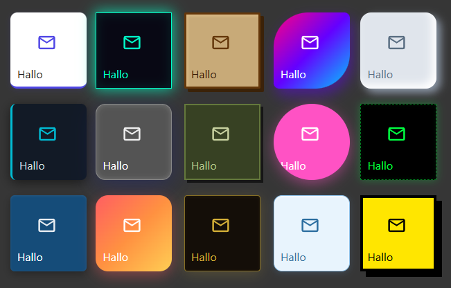

# Inventwo Widgets für ioBroker.vis 2.0
## Um
Fügt Schalter, Schaltflächen, Schieberegler und mehr als Widgets für ioBroker VIS 2.0 hinzu.

## Inhalt
Diverse Widgets zum Umschalten, Navigieren und mehr.

### Widget - Universell

#### Verschiedene Inhaltstypen

Farbauswahl

### Widget - Schieberegler

### Widget - Schalter

### Widget - Kontrollkästchen

### Widget - Tabelle

### Design
Alle Widgets bieten umfangreiche Designoptionen, um das Erscheinungsbild an Ihre Bedürfnisse anzupassen.

Weitere Informationen finden Sie unter [Hier](./docs/universal-widget-design-examples.md).

### Weitere folgen...

## Changelog
<!--
    Placeholder for the next version (at the beginning of the line):
    ### **WORK IN PROGRESS**
-->
### **WORK IN PROGRESS**
- Marquee widget: new scrolling text widget with configurable speed, direction, loop count, gap and pause-on-hover

### 0.8.0 (2026-05-15)
- Slider widget: added read-only mode, gradient support for colors and an option to place steps inside the slider bar (#244)
- Dropdown widget: added conditional background color (#198), read-only mode (#201) and option to show value without text (#201)
- Table widget: added multi-column sort (#234)

### 0.7.2 (2026-04-26)
- Fix button click and hold for mobile devices (#192)

### 0.7.1 (2026-04-24)
- Fixed table widget fixed header not working

### 0.7.0 (2026-04-21)
- Table widget added fixed header option (#234)
- Table widget added conditional row color (#234)
- Table widget added column filter (#234)

### 0.6.5 (2026-04-11)
- Changed click behavior to fix click and hold for mobile devices (#192)
- Fixed dropdown border on focus visible even though border with is 0 (#200)

## License
The MIT License (MIT)

Copyright (c) 2025-2026 jkvarel <jk@inventwo.com>

Permission is hereby granted, free of charge, to any person obtaining a copy
of this software and associated documentation files (the "Software"), to deal
in the Software without restriction, including without limitation the rights
to use, copy, modify, merge, publish, distribute, sublicense, and/or sell
copies of the Software, and to permit persons to whom the Software is
furnished to do so, subject to the following conditions:

The above copyright notice and this permission notice shall be included in
all copies or substantial portions of the Software.

THE SOFTWARE IS PROVIDED "AS IS", WITHOUT WARRANTY OF ANY KIND, EXPRESS OR
IMPLIED, INCLUDING BUT NOT LIMITED TO THE WARRANTIES OF MERCHANTABILITY,
FITNESS FOR A PARTICULAR PURPOSE AND NONINFRINGEMENT. IN NO EVENT SHALL THE
AUTHORS OR COPYRIGHT HOLDERS BE LIABLE FOR ANY CLAIM, DAMAGES OR OTHER
LIABILITY, WHETHER IN AN ACTION OF CONTRACT, TORT OR OTHERWISE, ARISING FROM,
OUT OF OR IN CONNECTION WITH THE SOFTWARE OR THE USE OR OTHER DEALINGS IN
THE SOFTWARE.