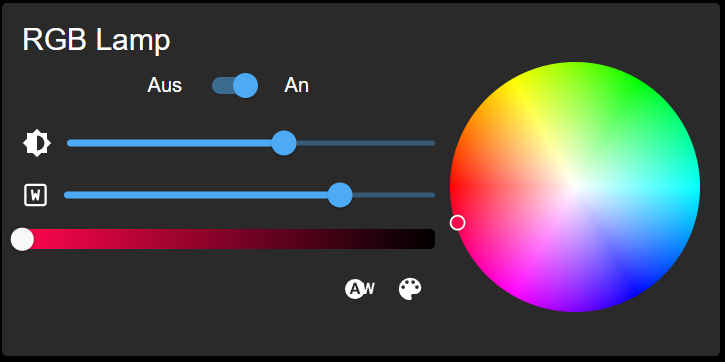

# Material-Widgets für ioBroker.vis 2.0
## Widgets
### Knöpfe und Schalter

### Uhr
- Analog

- Analoge Variante

- Digital

- Digital2 (SVG-Text)

### Einfacher Zustand
Mit diesem Widget können Sie ein Gerät steuern. Boolescher Wert oder Zahl.

- Nummer

- Kontrolle

### Im Widget anzeigen

Nicht als Schaltfläche: Die Ansicht kann in voller Größe angezeigt werden und Sie können Elemente in der Ansicht steuern.

Als Schaltfläche: Sie können eine kleine Miniaturansicht der Ansicht anzeigen. Wenn Sie darauf drücken, wird sie in voller Größe angezeigt.

### Thermostat

Darüber hinaus kann ein Verlauf angezeigt werden, wenn Sie ihn aktiviert haben.

### Tatsächlicher Wert mit Diagramm

### Sicherheitskontrolle

Sie können die Verzögerung in Sekunden definieren.

Durch die Aktivierung wird die definierte ID mit der Anzahl der Verzögerungssekunden geschrieben und nach Ablauf der Verzögerung wird die definierte ID auf 0 und die Alarm-ID auf „true“ gesetzt.

### Spieler

### Karte

### Kamera

### HTML-Vorlage

Mit der HTML-Vorlage kann jeder beliebige HTML-Code angezeigt werden.
Darüber hinaus können Sie mit diesem Widget auch Bilder oder Iframes anzeigen.

### Jalousien

### Farblampe
Mit dem RGB-Lampen-Widget können Sie verschiedene Arten von RGB-Lampen steuern. Hier sind einige Beispiele:

- RGB-Farben werden in einem Zustand wie „#RRGGBB“ festgelegt
- R/G/B-Farben werden in verschiedenen Zuständen von 0 bis 255 eingestellt
- RGBW als eine Variable wie „#RRGGBBWW“
- R/G/B/W-Farben werden in verschiedenen Zuständen von 0 bis 255 eingestellt
- Farbton/Sat/Licht als 3 verschiedene Zustände
- Farbtemperatur als ein Zustand von 2700 bis 6500 oder definiert durch Min./Max. des Objekts
- Der Weißmodus-Status kann zum Umschalten zwischen RGB- und Weißmodus über einen speziellen Status verwendet werden

### Türschloss

### Staubsauger
Dieses Widget ist primär für Xiaomi-Staubsauger. Es kann aber auch für jeden anderen Staubsauger verwendet werden.

Der einzige Unterschied besteht darin, dass Xiaomi die Zimmerreinigung unterstützt.

### Zeitauswahl
## Machen
- Jalousien mit Rollladen ausfahren

<!-- Platzhalter für die nächste Version (am Anfang der Zeile):

### **ARBEIT IN ARBEIT** -->

## Changelog
### 1.3.14 (2023-12-05)
* (bluefox) Allowed with on click on the widget toggling the ON/OFF state of RGB widget
* (bluefox) Added class names to ON/OFF widgets to allow styling

### 1.3.11 (2023-11-17)
* (bluefox) Allowed opening/closing dialogs of some widgets by command

### 1.3.9 (2023-11-10)
* (bluefox) updated packages

### 1.3.8 (2023-11-08)
* (bluefox) Corrected RGB widget if minimal is equal with maximal

### 1.3.5 (2023-11-06)
* (bluefox) Corrected layout of RGB widget
* (bluefox) Added option for RGB widget to hide brightness control
* (bluefox) Added option for white mode in RGB widget

### 1.3.3 (2023-10-26)
* (bluefox) Corrected layout of RGB widget
* (bluefox) Added color settings to actual
* (bluefox) Vacuum settings were hidden

### 1.3.2 (2023-10-14)
* (bluefox) Small improvements done

### 1.3.1 (2023-10-13)
* (bluefox) Added the vacuum cleaner widget

### 1.2.1 (2023-09-18)
* (bluefox) Added door lock, rgb and thermostat to switches widget

### 1.1.3 (2023-09-10)
* (bluefox) Door lock improved

### 1.1.0 (2023-09-08)
* (bluefox) Added door lock

### 1.0.0 (2023-08-21)
* (bluefox) Added RGB widget

### 0.8.5 (2023-08-11)
* (bluefox) Improvement of the widget loading

### 0.8.4 (2023-08-10)
* (bluefox) Improvement of wizard

### 0.8.3 (2023-07-30)
* (bluefox) Font styles are applied to all buttons

### 0.8.2 (2023-07-19)
* (bluefox) Corrected small layout problems

### 0.8.0 (2023-07-18)
* (bluefox) Added wizard for widgets

### 0.7.1 (2023-07-02)
* (bluefox) Added washer widget

### 0.6.2 (2023-06-29)
* (bluefox) Allowed usage without a frame for all widgets

### 0.6.0 (2023-06-28)
* (bluefox) Added blinds to switches widget
* (bluefox) Allowed to place widgets in widgets

### 0.5.3 (2023-06-21)
* (bluefox) Corrected errors with view in widget

### 0.5.1 (2023-06-20)
* (bluefox) Added widget to switch the theme
* (bluefox) Improved HTML widget to show iframe and image

### 0.4.0 (2023-06-16)
* (bluefox) Added button texts for switches widget
* (bluefox) Removed static widget, as it was replaced by switches widget

### 0.3.1 (2023-06-14)
* (bluefox) Improved buttons widget

### 0.2.13 (2023-03-22)
* (bluefox) BREAKING CHANGE: The names of widgets must be entered anew 
* (bluefox) update packages

### 0.2.9 (2023-02-27)
* (bluefox) Made this adapter singleton

### 0.2.2 (2023-02-22)
* (bluefox) Update packages

### 0.2.1 (2022-11-26)
* (bluefox) Implemented the blinds widget

### 0.1.5 (2022-10-27)
* (bluefox) First beta version

### 0.1.2 (2022-10-21)
* (bluefox) initial commit

## License
The MIT License (MIT)

Copyright (c) 2022-2023 Denis Haev <dogafox@gmail.com>

Permission is hereby granted, free of charge, to any person obtaining a copy
of this software and associated documentation files (the "Software"), to deal
in the Software without restriction, including without limitation the rights
to use, copy, modify, merge, publish, distribute, sublicense, and/or sell
copies of the Software, and to permit persons to whom the Software is
furnished to do so, subject to the following conditions:

The above copyright notice and this permission notice shall be included in
all copies or substantial portions of the Software.

THE SOFTWARE IS PROVIDED "AS IS", WITHOUT WARRANTY OF ANY KIND, EXPRESS OR
IMPLIED, INCLUDING BUT NOT LIMITED TO THE WARRANTIES OF MERCHANTABILITY,
FITNESS FOR A PARTICULAR PURPOSE AND NONINFRINGEMENT. IN NO EVENT SHALL THE
AUTHORS OR COPYRIGHT HOLDERS BE LIABLE FOR ANY CLAIM, DAMAGES OR OTHER
LIABILITY, WHETHER IN AN ACTION OF CONTRACT, TORT OR OTHERWISE, ARISING FROM,
OUT OF OR IN CONNECTION WITH THE SOFTWARE OR THE USE OR OTHER DEALINGS IN
THE SOFTWARE.