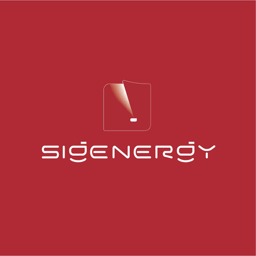
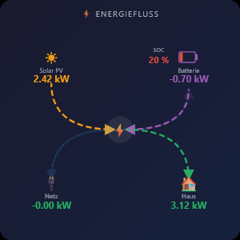
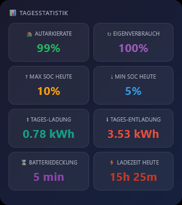
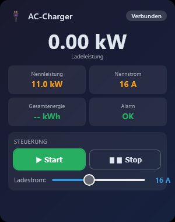
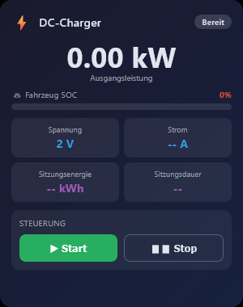
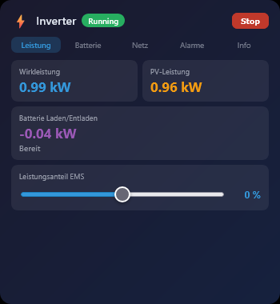
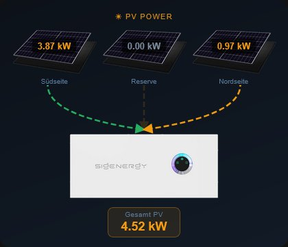

# IoBroker.vis-2-widgets-sigenergy
**Tests:** 

## Vis-2-widgets-sigenergy-Adapter für ioBroker
VIS-2 Widget-Set für den Sigenergy Energiespeicheradapter (`ioBroker.sigenergy`).
Enthält 8 Widgets zur Visualisierung und Steuerung von Energiefluss, Batteriestatus, Echtzeitleistung, Tagesstatistiken, AC-Ladegerät, DC-Ladegerät, Wechselrichter und Übersicht des SigenMicro Mikro-Wechselrichters.

## Anforderungen
- ioBroker mit installiertem und konfiguriertem `sigenergy`-Adapter
- ioBroker VIS-2 Adapter (≥ 2.0.0)

## Widgets
### Energieflussdiagramm
Zeigt den aktuellen Energiefluss zwischen Solarmodulen, Batterie, Stromnetz und Haus als animiertes SVG-Diagramm an. Animierte Pfeile visualisieren aktive Verbindungen in Echtzeit.

**OIDs:** `pvPower`, `essPower`, `gridActivePower`, `housePower`, `essSoc`

#### Strömungsrichtungen
| Datenpunkt | Wert > 0 | Wert < 0 |
|---|---|---|
| `essPower` | Akku laden → Pfeil von der Mitte zum Akku | Akku entladen → Pfeil vom Akku zur Mitte |
| `pvPower` | PV erzeugt → Pfeil von PV zur Mitte | — |
| `housePower` | Haus verbrauchend → Pfeil von der Mitte zum Haus | — |
| `housePower` | Haushalt verbraucht → Pfeil von der Mitte zum Haus | — |

### Batteriestatus & Prognosen
Zeigt den Ladezustand (SOC), den Gesundheitszustand (SOH), die Ladeleistung und Prognosen für die Zeit bis zur vollständigen Aufladung, die verbleibende Laufzeit, den Eigenverbrauch und die Autarkierate an.

**OIDs:** `essSoc`, `essSoh`, `essPower`, `batteryTimeToFull`, `batteryTimeRemaining`, `selfConsumptionRate`, `autarkyRate`

### Echtzeit-Stromversorgung
Kompakte Listenansicht aller aktuellen Leistungswerte mit farbcodierten Richtungsindikatoren.

**OIDs:** `pvPower`, `essPower`, `gridActivePower`, `housePower`, `essSoc`

### Energiestatistik
Tägliche Übersicht mit Autarkierate, Eigenverbrauch, SOC-Verlauf, Lade-/Entladeenergie und Batterieabdeckung.

**OIDs:** `autarkyRate`, `selfConsumptionRate`, `dayMaxSoc`, `dayMinSoc`, `essDailyChargeEnergy`, `essDailyDischargeEnergy`, `batteryCoverageToday`, `batteryDailyChargeTime`

### Netzteil (Sigen EVAC)
Überwachung und Steuerung des Sigenergy-Wechselstromladegeräts (EVAC). Angezeigt werden Ladeleistung, Systemstatus, Nennleistung, Nennstrom und Gesamtenergieverbrauch. Alarme werden farblich hervorgehoben. Der Ladestrom lässt sich direkt über einen Schieberegler einstellen (6–32 A).

**OIDs:** `acCharger.systemState`, `acCharger.chargingPower`, `acCharger.totalEnergyConsumed`, `acCharger.ratedPower`, `acCharger.ratedCurrent`, `acCharger.alarm1/2/3`, `acCharger.control.startStop`, `acCharger.control.outputCurrent`

### Gleichstromladegerät
Überwachung und Steuerung des Sigenergy-Gleichstromladegeräts. Anzeige von Ausgangsleistung, Ladezustand des Fahrzeugs mit Fortschrittsanzeige, Fahrzeugbatteriespannung, Ladestrom sowie Energie und Dauer des aktuellen Ladevorgangs.

**OIDs:** `dcCharger.outputPower`, `dcCharger.vehicleSoc`, `dcCharger.vehicleBatteryVoltage`, `dcCharger.chargingCurrent`, `dcCharger.currentChargingCapacity`, `dcCharger.currentChargingDuration`, `dcCharger.control.startStop`

### Wechselrichter
Umfassende Überwachung und Steuerung des Wechselrichters mit Registerkartennavigation. Anzeige von Betriebszustand, Leistungsdaten, Batterietemperaturen, Phasenspannungen, allen 5 Alarmregistern und Geräteinformationen (Modell, Seriennummer, Firmware).

| Registerkarte | Inhalt |
|---|---|
| **Leistung** | Wirkleistung, PV-Leistung, Batterielade-/Entladeleistung, Lastverteilungsregler (−100 % bis +100 %) |
| **Batterie** | SOC & SOH mit Balken, durchschnittliche Zelltemperatur/-spannung, maximale/minimale Temperatur |
| **Netz** | Phasenspannungen L1/L2/L3, Netzfrequenz, Leistungsfaktor, PCS-Innentemperatur |
| **Alarme** | 5 Alarmregister (PCS ×2, ESS, Gateway, DC-Ladegerät) mit Hex-Code und Farbkennzeichnung |
| **Info** | Modelltyp, Seriennummer, Firmware-Version, Remote-EMS-Umschalter |

**OIDs:** `inverter.activePower`, `inverter.pvPower`, `inverter.essChargeDischargePower`, `inverter.runningState`, `inverter.essBatterySoc/Soh`, `inverter.essAvgCellTemperature/Voltage`, `inverter.phaseA/B/CVoltage`, `inverter.gridFrequency`, `inverter.pcsInternalTemp`, `inverter.alarm1–5`, `inverter.firmwareVersion`, `inverter.modelType`, `inverter.serialNumber`, `inverter.control.startStop`, `inverter.control.remoteEmsDispatchEnable`, `inverter.control.activePowerPercent`

### Photovoltaik-Strom
Anzeige von bis zu 3 PV-Strings mit aktuellen Leistungswerten und animierten Flusspfeilen zum Hybridwechselrichter. Die Pfeilfarben ändern sich dynamisch je nach Leistungsniveau (orange <1 kW, gelb <2 kW, grün >2 kW).

#### Widget-Einstellungen
| Parameter | Typ | Standardwert | Beschreibung |
|---|---|---|---|
| oid_pv1 … oid_pv3 | OID | sigenergy.0.plant.pv1Power … pv3Power | PV-String-Leistungs-OIDs |
| oid_pvtotal | OID | sigenergy.0.plant.pvPower | Gesamt-PV-Leistung OID |
| sig_title | text | PV-Leistung | Widget-Titel |
| sig_name1 … sig_name3 | text | String 1 … String 3 | Konfigurierbare Namen pro String |
| sig_darkmode | Kontrollkästchen | wahr | Dunkel-/Hellmodus |

**OIDs:** `plant.pv1Power`, `plant.pv2Power`, `plant.pv3Power`, `plant.pvPower`

### SignMicro Übersicht
Übersicht und Detailansicht aller über Modbus angeschlossenen SigenMicro-Mikrowechselrichter. Registerkarte 1 zeigt alle Geräte als animiertes Netzwerksegment (Ethernet-Bus-Topologie mit vertikalen Verbindungslinien). Jede weitere Registerkarte zeigt alle 15 Register des jeweiligen Geräts in aufsteigender Reihenfolge.

| Registerkarte | Inhalt |
|---|---|
| **Übersicht** | Alle Geräte als animierte Bustopologie, aggregierte Kacheln (Gesamtleistung, Tagesertrag, Lebenszeitertrag, Anzahl der online befindlichen Geräte) |
| **Gerät 01–20** | Gerätebild oben links (10 px Versatz), Modell-/Seriennummer-/Firmware-/Status-Badge, alle 15 Register (01–15) mit Wert, Einheit und OID-Pfad |

#### Animation eines Netzwerksegments
Die horizontale Hauptlinie und die vertikalen Hilfslinien zeigen animierte Striche, die entlang der Kabel verlaufen, wenn ein Gerät aktiv ist (Betrieb). Inaktive Geräte (Standby/Fehler) zeigen nur die dunkle Grundlinie ohne Animation an.

#### Dynamisches Layout
| Geräte | Zeilen | Bildgröße |
|---|---|---|
| 1–5 | 1 Zeile | 80 × 90 px |
| 6–10 | 1 Zeile | 52 × 60 px |
| 11–15 | 2 Zeilen | 46 × 52 px |
| 16–20 | 2 Zeilen | 40 × 46 px |

#### Widget-Einstellungen
| Parameter | Typ | Standardwert | Beschreibung |
|---|---|---|---|
| micro_count | Anzahl (1–20) | 3 | Anzahl der anzuzeigenden Mikro-Wechselrichter |
| sig_title | text | SigenMicro Mikro-Wechselrichter | Widget-Titel |
| sig_darkmode | Kontrollkästchen | wahr | Dunkel-/Hellmodus |
| oid_micro1 … oid_micro20 | OID | — | Anker-OID pro Gerät (z. B. sigenergy.0.sigenmicro.11.outputPower) |

**OIDs (pro Gerät, Präfix sigenergy.0.sigenmicro.<slaveId>):** Modelltyp, Seriennummer, Firmware-Version, Betriebszustand, Ausgangsleistung, Netzfrequenz, Temperatur, MPPT1-Spannung, MPPT1-Strom, MPPT1-Leistung, MPPT2-Spannung, MPPT2-Strom, MPPT2-Leistung, Tagesertrag, Gesamtertrag

### Fahrzeugladestand (EV SOC)
Zeigt ein konfigurierbares Fahrzeugbild (z. B. Fiat 500e) als zentrales visuelles Element an. Ein farbcodiertes Symbol in der oberen rechten Ecke zeigt einen Blitz, den aktuellen Ladestand in Prozent und die Bezeichnung „LADESTAND“. Ein Fortschrittsbalken am unteren Rand zeigt den aktuellen Ladezustand (SOC) an. Im optionalen Lademodus leuchtet das Symbol pulsierend grün.

#### Farblogik
| Ladezustand | Farbe |
|---|---|
| ≤ 15 % | Rot (#f87171) |
| ≤ 35 % | Gelb (#fbbf24) |
| > 35 % | Grün (#4ade80) |

#### Widget-Einstellungen
| Parameter | Typ | Standardwert | Beschreibung |
|---|---|---|---|
| oid_ev_soc | OID | — | Ladezustand 0–100 |
| oid_charging | OID | — | Ladezustand (optional) — grünes Leuchten bei Aktivität |
| sig_title | Text | Fahrzeug-Ladestand | Fahrzeugname wird unter dem Bild angezeigt |
| sig_car_image | image | — | Fahrzeugbild aus dem ioBroker-Dateibrowser (z. B. /vis-2/img/) |
| sig_darkmode | Kontrollkästchen | wahr | Dunkel-/Hellmodus |

**OIDs:** `oid_ev_soc`, `oid_charging`

## Aussehen
Alle Widgets unterstützen einen **hellen und dunklen Modus**, der über die Widget-Einstellung `Dark mode` umgeschaltet werden kann.

## Dokumentation
- 🇬🇧 [Englisch](README.md) — diese Datei
- 🇩🇪 [Deutsch](doc/de/README.md)
- 🇷🇺 [Russisch](doc/ru/README.md)
- 🇳🇱 [Niederländisch](doc/nl/README.md)
- 🇫🇷 [Français](doc/fr/README.md)
- 🇮🇹 [Italiano](doc/it/README.md)
- 🇪🇸 [Español](doc/es/README.md)
- 🇵🇱 [Polski](doc/pl/README.md)
- 🇵🇹 [Português](doc/pt/README.md)

## Changelog
### 1.8.2 (2026-06-28)
* (ssbingo) Updated CI actions: actions/checkout to v7.0.0, ioBroker/testing-action-deploy to v1.5.0

### 1.8.1 (2026-06-08)
* (ssbingo) Fixed JSON syntax error in io-package.json; added widget screenshot to documentation

### 1.8.0 (2026-06-08)
* (ssbingo) New widget: "Fahrzeug-Ladestand" — shows a configurable EV image with animated SOC bar, color-coded charge level (red/yellow/green), and optional blinking charging badge

### 1.7.9 (2026-05-27)
* (ssbingo) Removed obsolete .eslintrc.json and .prettierignore

### 1.7.8 (2026-05-27)
* (ssbingo) Added ESLint linting, updated CI to Node.js 24; adapter requires node.js >= 22

### 1.7.7 (2026-04-20)
* (ssbingo) Text no longer distorts under non-uniform scaling — letters keep their proportions while containers continue to fill the widget area

### 1.7.6 (2026-04-20)
* (ssbingo) Scaling is now non-uniform: width and height react independently to container changes, keeping both axes individually adjustable

### 1.7.5 (2026-04-20)
* (ssbingo) Widget scaling now also reacts to height changes — content scales proportionally on both axes and is centered within the widget

### 1.7.4 (2026-04-20)
* (ssbingo) All 9 widgets now scale their content responsively with the widget size (fonts, padding, SVG, images)

### 1.7.3 (2026-04-20)
* (ssbingo) All 9 widgets now share a unified background based on the PV-Power widget design

Older changelog entries can be found in [CHANGELOG_OLD.md](CHANGELOG_OLD.md)

[Older changelogs can be found there](CHANGELOG_OLD.md)

## License
MIT License

Copyright (c) 2026 ssbingo <s.sternitzke@online.de>

Permission is hereby granted, free of charge, to any person obtaining a copy
of this software and associated documentation files (the "Software"), to deal
in the Software without restriction, including without limitation the rights
to use, copy, modify, merge, publish, distribute, sublicense, and/or sell
copies of the Software, and to permit persons to whom the Software is
furnished to do so, subject to the following conditions:

The above copyright notice and this permission notice shall be included in all
copies or substantial portions of the Software.

THE SOFTWARE IS PROVIDED "AS IS", WITHOUT WARRANTY OF ANY KIND, EXPRESS OR
IMPLIED, INCLUDING BUT NOT LIMITED TO THE WARRANTIES OF MERCHANTABILITY,
FITNESS FOR A PARTICULAR PURPOSE AND NONINFRINGEMENT. IN NO EVENT SHALL THE
AUTHORS OR COPYRIGHT HOLDERS BE LIABLE FOR ANY CLAIM, DAMAGES OR OTHER
LIABILITY, WHETHER IN AN ACTION OF CONTRACT, TORT OR OTHERWISE, ARISING FROM,
OUT OF OR IN CONNECTION WITH THE SOFTWARE OR THE USE OR OTHER DEALINGS IN THE
SOFTWARE.