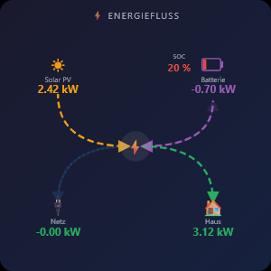
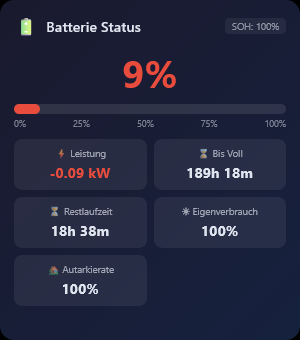
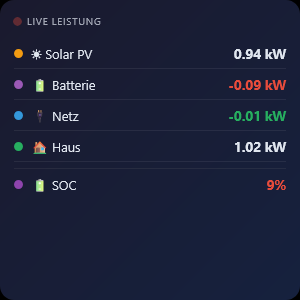
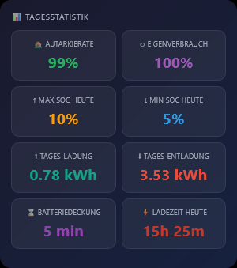
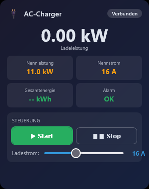
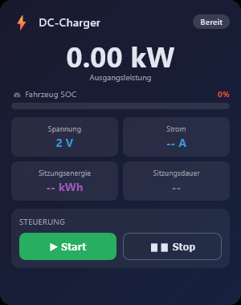
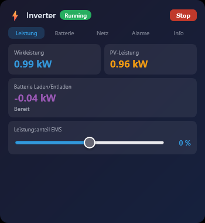
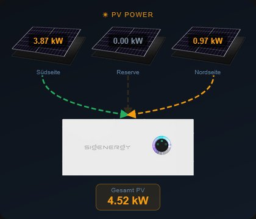
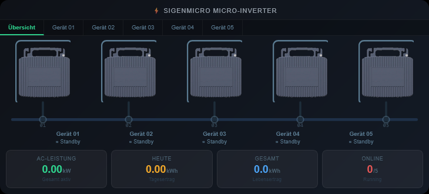
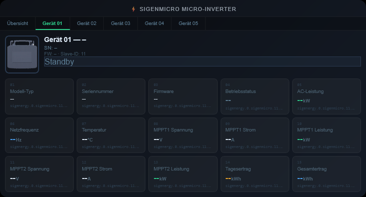

# ioBroker.vis-2-widgets-sigenergy

## vis-2-widgets-sigenergy-Adapter für ioBroker

VIS-2 Widget-Set für den Sigenergy Energiespeicheradapter (`ioBroker.sigenergy` Enthält 8 Widgets zur Visualisierung und Steuerung des Energieflusses, des Batteriestatus, der Echtzeitleistung, der Tagesstatistik, des AC-Ladegeräts, des DC-Ladegeräts, des Wechselrichters und der Übersicht des SigenMicro-Mikro-Wechselrichters.

## Anforderungen

- ioBroker mit dem`sigenergy` Adapter installiert und konfiguriert
- ioBroker VIS-2 Adapter (≥ 2.0.0)

## Widgets

### Energieflussdiagramm

Zeigt den aktuellen Energiefluss zwischen Solarmodulen, Batterie, Stromnetz und Haus als animiertes SVG-Diagramm an. Animierte Pfeile visualisieren die aktiven Verbindungen in Echtzeit.

**OIDs:**`pvPower` ,`essPower` ,`gridActivePower` ,`housePower` , `essSoc`

#### Strömungsrichtungen

| Datenpunkt        | Wert > 0                                                | Wert < 0                                             |
| ----------------- | ------------------------------------------------------- | ---------------------------------------------------- |
| `essPower`        | Akkuladung → Pfeil von der Mitte zum Akku               | Batterieentladung → Pfeil von der Batterie zur Mitte |
| `gridActivePower` | Netzverbrauch → Pfeil vom Netz zur Mitte                | Netzeinspeisung → Pfeil von der Mitte zum Netz       |
| `pvPower`         | PV-Anlage erzeugt → Pfeil von der PV-Anlage zum Zentrum | —                                                    |
| `housePower`      | Hausverbrauch → Pfeil von der Mitte zum Haus            | —                                                    |

### Batteriestatus & Prognosen

Zeigt den Ladezustand (SOC), den Gesundheitszustand (SOH), die Ladeleistung und Prognosen für die Zeit bis zur vollständigen Aufladung, die verbleibende Laufzeit, den Eigenverbrauch und die Autarkierate an.

**OIDs:**`essSoc` ,`essSoh` ,`essPower` ,`batteryTimeToFull` ,`batteryTimeRemaining` ,`selfConsumptionRate` , `autarkyRate`

### Echtzeitleistung

Kompakte Listenansicht aller aktuellen Leistungswerte mit farbcodierten Richtungsindikatoren.

**OIDs:**`pvPower` ,`essPower` ,`gridActivePower` ,`housePower` , `essSoc`

### Energiestatistik

Tägliche Übersicht mit Autarkierate, Eigenverbrauch, SOC-Verlauf, Lade-/Entladeenergie und Batterieabdeckung.

**OIDs:**`autarkyRate` ,`selfConsumptionRate` ,`dayMaxSoc` ,`dayMinSoc` ,`essDailyChargeEnergy` ,`essDailyDischargeEnergy` ,`batteryCoverageToday` , `batteryDailyChargeTime`

### Netzladegerät (Sigen EVAC)

Überwachung und Steuerung des Sigenergy-Netzladegeräts (EVAC). Angezeigt werden Ladeleistung, Systemstatus, Nennleistung, Nennstrom und Gesamtenergieverbrauch. Alarme werden farblich hervorgehoben. Die Statusanzeige zeigt den vereinfachten Ladestatus gemäß IEC 61851-1 (Initialisierung, Frei, Verbunden, Laden, Fehler). Beim Überfahren mit der Maus wird eine detaillierte Beschreibung des aktuellen Status angezeigt. Der Ladestrom kann direkt über einen Schieberegler eingestellt werden (6 A bis zum Nennstrom des Ladegeräts). Die Obergrenze kann zusätzlich über die Widget-Einstellung festgelegt werden.`sig_maxCurrent` Während des Ladevorgangs ist die Starttaste gesperrt und die Stopptaste hervorgehoben.

**OIDs:**`acCharger.systemState` ,`acCharger.chargingPower` ,`acCharger.totalEnergyConsumed` ,`acCharger.ratedPower` ,`acCharger.ratedCurrent` ,`acCharger.alarm1/2/3` ,`acCharger.control.startStop` , `acCharger.control.outputCurrent`

### Gleichstromladegerät

Überwachung und Steuerung des Sigenergy DC-Ladegeräts. Zeigt Ausgangsleistung, Ladezustand des Fahrzeugs mit Fortschrittsanzeige, Fahrzeugbatteriespannung, Ladestrom sowie Energie und Dauer der aktuellen Ladesitzung an. Das Statussymbol zeigt den Betriebszustand der Ladestation an (`dcCharger.runningState` : frei, verbunden/in Vorbereitung, geplant, wird geladen, wird entladen, beendet, Warnung, Fehler/nicht verfügbar); beim Überfahren mit der Maus wird eine detaillierte Erklärung angezeigt. Während des Lade- oder Entladevorgangs ist die Start-Taste gesperrt und die Stopp-Taste hervorgehoben. Ist die Status-OID nicht gesetzt, wird sie von der Ausgangsleistungs-OID abgeleitet; ohne Statuswert wird die Ausgangsleistung als Anzeige verwendet, und der Tooltip erklärt den Grund dafür, abhängig von der vom Adapter erkannten Protokollversion.

**OIDs:**`dcCharger.runningState` ,`dcCharger.outputPower` ,`dcCharger.vehicleSoc` ,`dcCharger.vehicleBatteryVoltage` ,`dcCharger.chargingCurrent` ,`dcCharger.currentChargingCapacity` ,`dcCharger.currentChargingDuration` ,`dcCharger.control.startStop` ,`info.protocolVersion` (`oid_protocol` )

### Wechselrichter

Umfassende Überwachung und Steuerung des Wechselrichters mit Registerkartennavigation. Anzeige von Betriebszustand, Leistungsdaten, Batterietemperaturen, Phasenspannungen, allen 5 Alarmregistern und Geräteinformationen (Modell, Seriennummer, Firmware).

| Tab          | Inhalt                                                                                              |
| ------------ | --------------------------------------------------------------------------------------------------- |
| **Leistung** | Wirkleistung, PV-Leistung, Batterielade-/Entladeleistung, Lastverteilungsregler (−100 % bis +100 %) |
| **Batterie** | SOC & SOH mit Balken, durchschnittliche Zelltemperatur/-spannung, maximale/minimale Temperatur      |
| **Netz**     | Phasenspannungen L1/L2/L3, Netzfrequenz, Leistungsfaktor, PCS-Innentemperatur                       |
| **Alarm**    | 5 Alarmregister (PCS ×2, ESS, Gateway, DC-Ladegerät) mit Hexadezimalcode und Farbkennzeichnung      |
| **Info**     | Modelltyp, Seriennummer, Firmware-Version, Remote-EMS-Umschalter                                    |

**OIDs:**`inverter.activePower` ,`inverter.pvPower` ,`inverter.essChargeDischargePower` ,`inverter.runningState` ,`inverter.essBatterySoc/Soh` ,`inverter.essAvgCellTemperature/Voltage` ,`inverter.phaseA/B/CVoltage` ,`inverter.gridFrequency` ,`inverter.pcsInternalTemp` ,`inverter.alarm1–5` ,`inverter.firmwareVersion` ,`inverter.modelType` ,`inverter.serialNumber` ,`inverter.control.startStop` ,`inverter.control.remoteEmsDispatchEnable` ,`inverter.control.activePowerPercent`

### PV-Strom

Anzeige von bis zu 3 PV-Strings mit aktuellen Leistungswerten und animierten Flusspfeilen zum Hybridwechselrichter. Die Pfeilfarben ändern sich dynamisch je nach Leistungsniveau (orange <1 kW, gelb <2 kW, grün >2 kW).

#### Widget-Einstellungen

| Parameter               | Typ              | Standard                              | Beschreibung                           |
| ----------------------- | ---------------- | ------------------------------------- | -------------------------------------- |
| oid\_pv1 … oid\_pv3     | OID              | sigenergy.0.plant.pv1Power … pv3Power | PV-String-Leistungs-OIDs               |
| oid\_pvtotal            | OID              | sigenergy.0.plant.pvPower             | Gesamt-PV-Leistung OID                 |
| Signaturtitel           | Text             | PV-Strom                              | Widget-Titel                           |
| sig\_name1 … sig\_name3 | Text             | Zeichenkette 1 … Zeichenkette 3       | Konfigurierbare Namen pro Zeichenkette |
| sig\_darkmode           | Kontrollkästchen | WAHR                                  | Dunkel-/Hellmodus                      |

**OIDs:**`plant.pv1Power` ,`plant.pv2Power` ,`plant.pv3Power` ,`plant.pvPower`

### SigenMicro Übersicht

Übersicht und Detailansicht aller über Modbus angeschlossenen SigenMicro-Mikrowechselrichter. Registerkarte 1 zeigt alle Geräte als animiertes Netzwerksegment (Ethernet-Bus-Topologie mit vertikalen Verbindungslinien). Jede weitere Registerkarte zeigt alle 15 Register des jeweiligen Geräts in aufsteigender Reihenfolge.

| Tab             | Inhalt                                                                                                                                              |
| --------------- | --------------------------------------------------------------------------------------------------------------------------------------------------- |
| **Überblick**   | Alle Geräte als animierte Bustopologie, aggregierte Kacheln (Gesamtleistung, Tagesertrag, Lebensdauerertrag, Anzahl der online befindlichen Geräte) |
| **Gerät 01–20** | Gerätebild oben links (10 px Versatz), Modell-/Seriennummer-/Firmware-/Status-Badge, alle 15 Register (01–15) mit Wert, Einheit und OID-Pfad        |

#### Netzwerksegmentanimation

Die horizontale Hauptlinie und die vertikalen Hilfslinien zeigen animierte Striche, die entlang der Kabel verlaufen, wenn ein Gerät aktiv ist (Betrieb). Inaktive Geräte (Standby/Fehler) zeigen nur die dunkle Grundlinie ohne Animation an.

#### Dynamisches Layout

| Geräte | Reihen   | Bildgröße     |
| ------ | -------- | ------------- |
| 1–5    | 1 Zeile  | 80 × 90 px    |
| 6–10   | 1 Zeile  | 52 × 60 px    |
| 11–15  | 2 Zeilen | 46 × 52 Pixel |
| 16–20  | 2 Zeilen | 40 × 46 Pixel |

#### Widget-Einstellungen

| Parameter                  | Typ              | Standard                        | Beschreibung                                                      |
| -------------------------- | ---------------- | ------------------------------- | ----------------------------------------------------------------- |
| Mikro-Anzahl               | Nummer (1–20)    | 3                               | Anzahl der anzuzeigenden Mikro-Wechselrichter                     |
| Signaturtitel              | Text             | SigenMicro Mikro-Wechselrichter | Widget-Titel                                                      |
| sig\_darkmode              | Kontrollkästchen | WAHR                            | Dunkel-/Hellmodus                                                 |
| oid\_micro1 … oid\_micro20 | OID              | —                               | Anker-OID pro Gerät (z. B. sigenergy.0.sigenmicro.11.outputPower) |

**OIDs (pro Gerät, Präfix sigenergy.0.sigenmicro).<slaveId> ):** Modelltyp, Seriennummer, Firmware-Version, Betriebszustand, Ausgangsleistung, Netzfrequenz, Temperatur, MPPT1-Spannung, MPPT1-Strom, MPPT1-Leistung, MPPT2-Spannung, MPPT2-Strom, MPPT2-Leistung, Tagesertrag, Gesamtertrag

### Fahrzeugladezustand (EV SOC)

Zeigt ein konfigurierbares Fahrzeugbild (z. B. Fiat 500e) als zentrales visuelles Element an. Ein farbcodiertes Symbol in der oberen rechten Ecke zeigt einen Blitz, den aktuellen Ladestand in Prozent und die Bezeichnung „LADESTAND“. Ein Fortschrittsbalken am unteren Rand zeigt den aktuellen Ladezustand (SOC) an. Im optionalen Lademodus leuchtet das Symbol pulsierend grün.

#### Farblogik

| Ladeniveau | Farbe          |
| ---------- | -------------- |
| ≤ 15 %     | Rot (#f87171)  |
| ≤ 35 %     | Gelb (#fbbf24) |
| > 35 %     | Grün (#4ade80) |

#### Widget-Einstellungen

| Parameter       | Typ              | Standard           | Beschreibung                                                   |
| --------------- | ---------------- | ------------------ | -------------------------------------------------------------- |
| oid\_ev\_soc    | OID              | —                  | Ladezustand 0–100                                              |
| oid\_charging   | OID              | —                  | Ladezustand (optional) – grünes Leuchten im aktiven Zustand    |
| Signaturtitel   | Text             | Fahrzeug-Ladestand | Fahrzeugname unterhalb des Bildes                              |
| sig\_car\_image | Bild             | —                  | Fahrzeugbild aus dem ioBroker-Dateibrowser (z. B. /vis-2/img/) |
| sig\_darkmode   | Kontrollkästchen | WAHR               | Dunkel-/Hellmodus                                              |

**OIDs:**`oid_ev_soc` ,`oid_charging`

## Aussehen

Alle Widgets unterstützen einen **hellen und einen dunklen Modus** , die über die Widget-Einstellungen umgeschaltet werden können.`Dark mode` Die

## Dokumentation

- 🇬🇧 [Englisch](/#/adapters/vis-2-widgets-sigenergy) — diese Datei
- 🇩🇪 [Deutsch](https://github.com/ssbingo/ioBroker.vis-2-widgets-sigenergy/blob/main/doc/de/README.md)
- 🇷🇺 [Русский](https://github.com/ssbingo/ioBroker.vis-2-widgets-sigenergy/blob/main/doc/ru/README.md)
- 🇳🇱 [Niederländisch](https://github.com/ssbingo/ioBroker.vis-2-widgets-sigenergy/blob/main/doc/nl/README.md)
- 🇫🇷 [Französisch](https://github.com/ssbingo/ioBroker.vis-2-widgets-sigenergy/blob/main/doc/fr/README.md)
- 🇮🇹 [Italiano](https://github.com/ssbingo/ioBroker.vis-2-widgets-sigenergy/blob/main/doc/it/README.md)
- 🇪🇸 [Español](https://github.com/ssbingo/ioBroker.vis-2-widgets-sigenergy/blob/main/doc/es/README.md)
- 🇵🇱 [Polski](https://github.com/ssbingo/ioBroker.vis-2-widgets-sigenergy/blob/main/doc/pl/README.md)
- 🇵🇹 [Português](https://github.com/ssbingo/ioBroker.vis-2-widgets-sigenergy/blob/main/doc/pt/README.md)

## Changelog
### 1.8.10 (2026-09-07)
* (ssbingo) Removed the `admin` entry from `globalDependencies`: a widget set has no admin UI, so no admin version needs to be required (repository checker S1091)

### 1.8.9 (2026-09-07)
* (ssbingo) DC charger: a station that marks its running state register as not valid no longer shows up as a red "Unbekannt" badge. The Sigenergy protocol signals "register not valid" by setting all bits, and a SigenStor EC **with** a DC charger answers that way for register 31513 while its neighbouring registers (rated power, PV yield, meters) read normally. The badge is now derived from the output power in that case and the tooltip states that this is neither an adapter nor a configuration problem
* (ssbingo) DC charger: the raw sentinel 65535 is recognised as well, so the badge is also correct on adapter versions before 3.3.1, which pass the value through instead of reporting no value
* (ssbingo) DC charger: new OID setting `oid_protocol` (default `sigenergy.0.info.protocolVersion`). The protocol version was previously derived from the instance prefix only, and such an OID is never subscribed by VIS, so `vis.states` stayed empty and the tooltip claimed "Protokollversion noch nicht erkannt" even though the adapter had detected V2.9 at startup. Declared as a regular `/id` attribute it is subscribed like every other OID
* (ssbingo) DC charger: when the protocol version cannot be read, the tooltip no longer asserts that none was detected — it says the version is not readable here and points at the new setting
* (ssbingo) DC charger: reworded the tooltip shown when the adapter reports no state although the device announces protocol V2.8 or newer — it no longer claims an adapter update is needed, since the station itself may be marking the register as not valid

### 1.8.8 (2026-09-07)
* (ssbingo) DC charger: if the state OID is not set, it is derived from the output power OID (…dcCharger.outputPower → …dcCharger.runningState), so widgets placed before 1.8.7 show the operating state without editing them
* (ssbingo) DC charger: when no operating state is available, the tooltip explains why depending on the protocol version detected by the adapter (`info.protocolVersion` / `info.protocolLevel`): register 31513 requires Sigenergy protocol V2.8; with V2.8 or newer it points to the adapter log or an adapter update; negative output power is shown as discharging

### 1.8.7 (2026-09-07)
* (ssbingo) DC charger: new state OID `dcCharger.runningState` (default) – the state badge now shows the operating state of the charging station (free, connected/preparing, scheduled, charging, discharging, ended, warning, fault/unavailable) with a detailed explanation as tooltip; without the OID the badge is derived from the output power as before
* (ssbingo) DC charger: while charging or discharging is active, the Start button is locked and the Stop button is highlighted; negative output power (discharging) is shown in purple

### 1.8.6 (2026-09-07)
* (ssbingo) AC charger: the tooltip on the state badge is now rendered as a separate popup with a fixed font size and opaque background, so it is readable regardless of widget size and is no longer overlapped by widget content
* (ssbingo) AC charger: while charging is active, the Start button is locked and the Stop button is highlighted
* (ssbingo) Widget set now reports the correct version in the browser console

### 1.8.5 (2026-09-07)
* (ssbingo) AC charger: the charging current slider is now limited to the charger's rated current; new widget setting `sig_maxCurrent` for a manual upper limit (prevents Modbus errors when setting more than the rated current)
* (ssbingo) AC charger: system state now covers all IEC 61851-1 states (0–7: initialising, free, connected, charging, error); hovering over the state badge shows a detailed explanation

### 1.8.4 (2026-09-04)
* (ssbingo) Lowered minimum admin requirement to >=7.8.23 (admin 8 is no longer required)
* (ssbingo) CI: locked ioBroker/testing-action-deploy to major version v1; fixed Dependabot auto-merge workflow
* (ssbingo) Updated dependencies: @tsconfig/node22 22.0.6, @alcalzone/release-script-plugin-license 5.2.2

### 1.8.3 (2026-08-05)
* (ssbingo) Declared minimum requirements: js-controller >=6.0.11, admin >=8.0.0, Node.js >=22
* (ssbingo) Updated dependencies: actions/checkout 7.0.1, ioBroker/testing-action-deploy 1.5.2, @iobroker/testing 5.3.0

### 1.8.2 (2026-06-28)
* (ssbingo) Updated CI actions: actions/checkout to v7.0.0, ioBroker/testing-action-deploy to v1.5.0

### 1.8.1 (2026-06-08)
* (ssbingo) Fixed JSON syntax error in io-package.json; added widget screenshot to documentation

### 1.8.0 (2026-06-08)
* (ssbingo) New widget: "Fahrzeug-Ladestand" — shows a configurable EV image with animated SOC bar, color-coded charge level (red/yellow/green), and optional blinking charging badge

### 1.7.9 (2026-05-27)
* (ssbingo) Removed obsolete .eslintrc.json and .prettierignore

### 1.7.8 (2026-05-27)
* (ssbingo) Added ESLint linting, updated CI to Node.js 24; adapter requires node.js >= 22

### 1.7.7 (2026-04-20)
* (ssbingo) Text no longer distorts under non-uniform scaling — letters keep their proportions while containers continue to fill the widget area

### 1.7.6 (2026-04-20)
* (ssbingo) Scaling is now non-uniform: width and height react independently to container changes, keeping both axes individually adjustable

### 1.7.5 (2026-04-20)
* (ssbingo) Widget scaling now also reacts to height changes — content scales proportionally on both axes and is centered within the widget

### 1.7.4 (2026-04-20)
* (ssbingo) All 9 widgets now scale their content responsively with the widget size (fonts, padding, SVG, images)

### 1.7.3 (2026-04-20)
* (ssbingo) All 9 widgets now share a unified background based on the PV-Power widget design

Older changelog entries can be found in [CHANGELOG_OLD.md](https://github.com/ssbingo/ioBroker.vis-2-widgets-sigenergy/blob/main/CHANGELOG_OLD.md)

[Older changelogs can be found there](https://github.com/ssbingo/ioBroker.vis-2-widgets-sigenergy/blob/main/CHANGELOG_OLD.md)

## License
MIT License

Copyright (c) 2026 ssbingo <s.sternitzke@online.de>

Permission is hereby granted, free of charge, to any person obtaining a copy
of this software and associated documentation files (the "Software"), to deal
in the Software without restriction, including without limitation the rights
to use, copy, modify, merge, publish, distribute, sublicense, and/or sell
copies of the Software, and to permit persons to whom the Software is
furnished to do so, subject to the following conditions:

The above copyright notice and this permission notice shall be included in all
copies or substantial portions of the Software.

THE SOFTWARE IS PROVIDED "AS IS", WITHOUT WARRANTY OF ANY KIND, EXPRESS OR
IMPLIED, INCLUDING BUT NOT LIMITED TO THE WARRANTIES OF MERCHANTABILITY,
FITNESS FOR A PARTICULAR PURPOSE AND NONINFRINGEMENT. IN NO EVENT SHALL THE
AUTHORS OR COPYRIGHT HOLDERS BE LIABLE FOR ANY CLAIM, DAMAGES OR OTHER
LIABILITY, WHETHER IN AN ACTION OF CONTRACT, TORT OR OTHERWISE, ARISING FROM,
OUT OF OR IN CONNECTION WITH THE SOFTWARE OR THE USE OR OTHER DEALINGS IN THE
SOFTWARE.