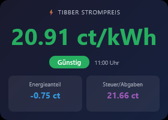
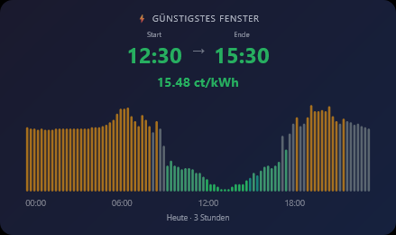
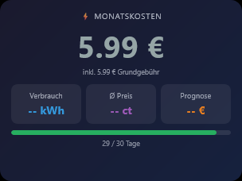

# ioBroker.vis-2-widgets-tibberlink

## vis-2-widgets-tibberlink-Adapter für ioBroker

VIS-2-Widgets zur Visualisierung dynamischer Stromtarifdaten von Tibber: aktueller Preis, günstigstes Zeitfenster und monatliche Kosten.

Mehr Informationen zu Tibber und seinen dynamischen Tarifen: <https://tibber.com/>

## Voraussetzungen

Dieser Widget-Adapter ruft **keine** Daten von Tibber selbst ab. Er liest Zustände, die vom Datenadapter erstellt werden.[`iobroker.tibberlink`](https://github.com/hombach/ioBroker.tibberlink) Installieren und konfigurieren`tibberlink` vor der Verwendung dieser Widgets:

1. Installieren`iobroker.tibberlink` und geben Sie Ihr Tibber-API-Token ein (von <https://developer.tibber.com/settings/accesstoken> ).
2. Aktivieren Sie in den Tibberlink-Einstellungen die **Option „Abruf historischer Verbrauchsdaten“** und legen Sie die Anzahl der Datensätze pro Tag auf mindestens 31 fest (erforderlich für Widget 3).
3. Die Preis-Widgets (Widget 1 und 2) funktionieren automatisch, sobald tibberlink läuft – es werden keine Calculator-Kanäle benötigt.

Ihre **Home-ID** ist die UUID, die im ioBroker-Objektbaum unter folgendem Pfad sichtbar ist:`tibberlink.0.Homes.<UUID>` z.B.`xxxxxxxx-xxxx-xxxx-xxxx-xxxxxxxxxxxx` Die

## Widgets

### Widget 1 — Aktueller Tibber-Preis

Zeigt den aktuellen Strompreis in großer Schrift, eine farbcodierte Preisstufe (SEHR\_GÜNSTIG … SEHR\_TEUER), die Gültigkeitsdauer und optional eine Kostenaufschlüsselung an.

| Option           | Standard                 | Beschreibung                                            |
| ---------------- | ------------------------ | ------------------------------------------------------- |
| `oid_total`      | `…CurrentPrice.total`    | Gesamtpreis in €/kWh                                    |
| `oid_energy`     | `…CurrentPrice.energy`   | Energieanteil in €/kWh                                  |
| `oid_tax`        | `…CurrentPrice.tax`      | Steuern / Zuschläge in €/kWh                            |
| `oid_level`      | `…CurrentPrice.level`    | Preisniveau                                             |
| `oid_startsAt`   | `…CurrentPrice.startsAt` | ISO-Zeitstempel der aktuellen Stunde                    |
| `show_breakdown` | `true`                   | Energie- und Steuerkacheln anzeigen                     |
| `currency`       | `ct/kWh`                 | Die Einheitenbezeichnung wird nach dem Preis angezeigt. |
| `tib_darkmode`   | `true`                   | Dunkles (Standard) oder helles Design                   |

---

### Widget 2 – Günstigstes Zeitfenster

Verwendet einen gleitenden Fensteralgorithmus, um den günstigsten zusammenhängenden N-Stunden-Block in den heutigen (und optional auch morgigen) Kursdaten zu finden. Angezeigt werden Start- und Endzeit, Durchschnittspreis und ein farbcodiertes Sparkline-Balkendiagramm. Die Slot-Dauer (15 Min. / 60 Min.) wird automatisch erkannt.

| Option                | Standard               | Beschreibung                               |
| --------------------- | ---------------------- | ------------------------------------------ |
| `oid_prices_today`    | `…PricesToday.json`    | JSON-Array der heutigen Preisplätze        |
| `oid_prices_tomorrow` | `…PricesTomorrow.json` | JSON-Array der Preisplätze von morgen      |
| `amount_hours`        | `3`                    | Fenstergröße in Stunden                    |
| `future_only`         | `true`                 | Ignoriere bereits beendete Slots.          |
| `show_tomorrow`       | `true`                 | Berücksichtigen Sie die Preise von morgen. |
| `tib_darkmode`        | `true`                 | Dunkles (Standard) oder helles Design      |

---

### Widget 3 – Live-Stromverbrauch

Zeigt den Stromverbrauch in Echtzeit in großer Schrift zusammen mit Minimal-, Durchschnitts- und Maximalwerten sowie dem kumulierten Tagesverbrauch und den Kosten an. Erfordert ein an Ihren Zähler angeschlossenes **Tibber Pulse-** Gerät.

| Option            | Standard                                  | Beschreibung                          |
| ----------------- | ----------------------------------------- | ------------------------------------- |
| `oid_power`       | `…LiveMeasurement.power`                  | Aktuelle Leistung in W                |
| `oid_minpower`    | `…LiveMeasurement.minPower`               | Sitzungsminimum in W                  |
| `oid_avgpower`    | `…LiveMeasurement.averagePower`           | Sitzungsdurchschnitt in W             |
| `oid_maxpower`    | `…LiveMeasurement.maxPower`               | Sitzungsmaximum in W                  |
| `oid_consumption` | `…LiveMeasurement.accumulatedConsumption` | Tagesverbrauch in kWh                 |
| `oid_cost`        | `…LiveMeasurement.accumulatedCost`        | Tageskosten in €                      |
| `tib_darkmode`    | `true`                                    | Dunkles (Standard) oder helles Design |

---

### Widget 4 – Monatliche Stromkosten

Aggregiert den Tibberlink`jsonDaily` Verbrauchsdaten für den aktuellen Kalendermonat. Angezeigt werden Gesamtkosten, Gesamtverbrauch, Durchschnittspreis, eine Prognose zum Monatsende sowie ein Fortschrittsbalken, der den aktuellen Monatsverlauf anzeigt. Voraussetzung ist die Aktivierung **des Abrufs historischer Verbrauchsdaten** in Tibberlink mit mindestens 31 Datensätzen pro Tag.

| Option               | Standard                 | Beschreibung                                                               |
| -------------------- | ------------------------ | -------------------------------------------------------------------------- |
| `oid_jsonDaily`      | `…Consumption.jsonDaily` | JSON-Array mit täglichen Verbrauchsdatensätzen                             |
| `currency_symbol`    | `€`                      | Währungssymbol nach Beträgen angezeigt                                     |
| `show_base_fee`      | `false`                  | Zu den Gesamtkosten wird eine feste monatliche Grundgebühr hinzugerechnet. |
| `base_fee_per_month` | `0`                      | Grundgebühr in € (wird verwendet, wenn`show_base_fee` ist an)              |
| `tib_darkmode`       | `true`                   | Dunkles (Standard) oder helles Design                                      |

## Dokumentation

- 🇬🇧 Englisch — diese Datei
- 🇩🇪 [Deutsch](https://github.com/ssbingo/ioBroker.vis-2-widgets-tibberlink/blob/main/docs/de/README.md)
- 🇷🇺 [Русский](https://github.com/ssbingo/ioBroker.vis-2-widgets-tibberlink/blob/main/docs/ru/README.md)
- 🇳🇱 [Niederländisch](https://github.com/ssbingo/ioBroker.vis-2-widgets-tibberlink/blob/main/docs/nl/README.md)
- 🇫🇷 [Französisch](https://github.com/ssbingo/ioBroker.vis-2-widgets-tibberlink/blob/main/docs/fr/README.md)
- 🇮🇹 [Italiano](https://github.com/ssbingo/ioBroker.vis-2-widgets-tibberlink/blob/main/docs/it/README.md)
- 🇪🇸 [Español](https://github.com/ssbingo/ioBroker.vis-2-widgets-tibberlink/blob/main/docs/es/README.md)
- 🇵🇱 [Polski](https://github.com/ssbingo/ioBroker.vis-2-widgets-tibberlink/blob/main/docs/pl/README.md)
- 🇵🇹 [Português](https://github.com/ssbingo/ioBroker.vis-2-widgets-tibberlink/blob/main/docs/pt/README.md)
- 🇺🇦 [Українська](https://github.com/ssbingo/ioBroker.vis-2-widgets-tibberlink/blob/main/docs/uk/README.md)
- 🇨🇳[简体中文](https://github.com/ssbingo/ioBroker.vis-2-widgets-tibberlink/blob/main/docs/zh-cn/README.md)

## Changelog
### 0.4.11 (2026-07-02)
* (ssbingo) Sync template PRs: update Dependabot config, add auto-merge workflow, fix VS Code schema link

### 0.4.10 (2026-06-13)
* (ssbingo) Re-release to ensure widget group label 'Tibberlink' is served correctly

### 0.4.9 (2026-06-13)
* (ssbingo) Fix widget group name: removed translation prefix so vis-2 editor shows 'Tibberlink' correctly

### 0.4.8 (2026-06-13)
* (ssbingo) Update release-script to 5.2.1

### 0.4.7 (2026-05-27)
* (ssbingo) Add prettier.config.mjs; fix code style to single quotes throughout

### 0.4.6 (2026-05-27)
* (ssbingo) Add ESLint config and lint script; update Node.js to 24; fix Dependabot for @types/node

### 0.4.5 (2026-04-29)
* (ssbingo) Fix common.news to remove unpublished versions; fix Dependabot config for src-widgets

### 0.4.4 (2026-04-29)
* (ssbingo) Fix widget build output directory so vis-2 can load customWidgets.js from the correct path

### 0.4.3 (2026-04-29)
* (ssbingo) Add widget screenshots to documentation

### 0.4.2 (2026-04-29)
* (ssbingo) Fix widget file path so vis-2 can load customWidgets.js correctly

### 0.4.1 (2026-04-29)
* (ssbingo) Fix live view widget positioning; fix monthly cost widget showing previous month instead of current month

### 0.4.0 (2026-04-28)
* (ssbingo) Migrate all widgets to React/Module Federation (proper install/uninstall lifecycle, no more widgets.html patching)

### 0.3.3 (2026-04-26)
* (ssbingo) Update documentation

### 0.3.2 (2026-04-26)
* (ssbingo) Widget 2: replace price chart with TibberCheapestWindow (cheapest N-hour sliding window with sparkline)

### 0.3.1 (2026-04-25)
* (ssbingo) Widget 1: rename oid_price→oid_total, add oid_startsAt, show_breakdown and currency options

### 0.3.0 (2026-04-24)
* (ssbingo) New widget: monthly electricity cost with consumption, avg. price and projection

Older changelog entries are in [CHANGELOG_OLD.md](https://github.com/ssbingo/ioBroker.vis-2-widgets-tibberlink/blob/main/CHANGELOG_OLD.md).

## License
MIT License

Copyright (c) 2026 ssbingo <s.sternitzke@online.de>

Permission is hereby granted, free of charge, to any person obtaining a copy
of this software and associated documentation files (the "Software"), to deal
in the Software without restriction, including without limitation the rights
to use, copy, modify, merge, publish, distribute, sublicense, and/or sell
copies of the Software, and to permit persons to whom the Software is
furnished to do so, subject to the following conditions:

The above copyright notice and this permission notice shall be included in all
copies or substantial portions of the Software.

THE SOFTWARE IS PROVIDED "AS IS", WITHOUT WARRANTY OF ANY KIND, EXPRESS OR
IMPLIED, INCLUDING BUT NOT LIMITED TO THE WARRANTIES OF MERCHANTABILITY,
FITNESS FOR A PARTICULAR PURPOSE AND NONINFRINGEMENT. IN NO EVENT SHALL THE
AUTHORS OR COPYRIGHT HOLDERS BE LIABLE FOR ANY CLAIM, DAMAGES OR OTHER
LIABILITY, WHETHER IN AN ACTION OF CONTRACT, TORT OR OTHERWISE, ARISING FROM,
OUT OF OR IN CONNECTION WITH THE SOFTWARE OR THE USE OR OTHER DEALINGS IN THE
SOFTWARE.