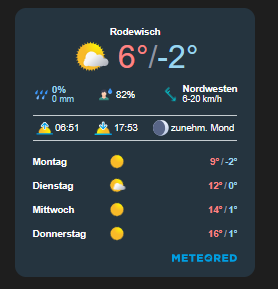

# IoBroker.vis-2-Widgets-Wetter-und-Heizung

**Wenn es Ihnen gefällt, erwägen Sie bitte eine Spende:**

## Wetter
Dieses Vis-2-Widget zeigt Wettervorhersagedaten von DasWetter.com oder weatherunderground an.
Sie benötigen den DasWetter-Adapter oder den weatherunderground-Adapter auf Ihrem System.

### Wetter

* OIDs werden automatisch anhand allgemeiner Einstellungen festgelegt.
Die Beschriftung der x-Achse kann gemäß der [momentjs-Dokumentation](http://momentjs.com/docs/#/displaying/format/) konfiguriert werden.

### Wettertag

* OIDs werden automatisch anhand allgemeiner Einstellungen festgelegt.
* Symbolsets sind veränderbar

### Meteored Wetter-Widget
Weitere Informationen finden Sie in [Meteoriert](https://www.daswetter.com/users/widget).

Sie müssen Ihr Widget auf METEORED erstellen und die Widget-ID abrufen. Diese ID muss hier in den Widget-Einstellungen festgelegt werden.
Vergessen Sie nicht, Ihre Domain in den METEORED-Einstellungen auf die Whitelist zu setzen. In meinem Fall musste ich `https://192.168.xxx.xxx:8082` auf die Whitelist setzen, damit das Widget funktionierte.

## Allgemeine Übersicht

### Eingabedaten für allgemeines Diagramm
* "OID data serie" sollte auf einen Datenpunkt wie `sbfspot.0.xxxxxxxx.history.years` verweisen.
* Der Datenpunkt sollte Schlüssel-Wert-Paare enthalten, wie zum Beispiel

[{"year":"2008","value":7000},{"year":"2009","value":2309000},{"year":"2010","value":4445000},{"year":"2011","value":7019000},{"year":"2012","value":9371000},{"year":"2013","value":11393000},{"year":"2014","value":13666000},{"year":"2015","value":16034000},{"year":"2016","value":17826790}]

* Es ist möglich, Wertdifferenzen automatisch zu berechnen und anzuzeigen. Aktivieren Sie dazu einfach die Option „Differenzberechnung“ in den Einstellungen.

* Es unterstützt die Adapter `sbfspot` und `ebus`: Wählen Sie einfach die Instanz aus, und die grundlegenden Anpassungen werden automatisch vorgenommen.

## Heizung (Widgets für den HeatingControl-Adapter)
Basierend auf dem Projekt [Pittinis](https://github.com/Pittini/iobroker-heatingcontrol-vis) für das alte VIS sind jetzt ähnliche Widgets für VIS-2 verfügbar.

### Raumübersicht

### Heizzeitplan

### Allgemeiner Parameter

### Zimmer

### Raumprofilparameter

### Fensterstatusübersicht

<!--

### **IN BEARBEITUNG** -->

## Changelog
### 1.2.0 (2025-12-30)
* (René) update to support DasWetter@4.x
known issue: Icons are not updated yet.
* (René, copilot) fixes based on Lint recommendation

### 1.1.5 (2025-10-26)
* (René) dependencies updated and bug fix based on adapter checker and linter

### 1.1.3 (2025-09-06)
* (René) dependencies updated and bug fix based on adapter checker

### 1.1.2 (2025-08-17)
* (René) SourceAnalytics widget: min / max calculation optimisation

### 1.1.1 (2025-08-15)
* (René) SourceAnalytics widget: bug fix min / max calculation

### 1.1.0 (2025-08-13)
* (René) new widget SourceAnalytics two weeks bar chart added 
* (René) overworked with TypeScript and vite -> code review desired

### 0.10.4 (2025-04-08)
* (René) Meteored widget: reload once per hour as an option

### 0.10.3 (2025-04-06)
* (René) Heating Room widget: some translations
* (René) Meteored widget: make reload of widget possible

### 0.10.2 (2025-04-04)
* (René) Heating Room widget: support of more then one thermostat. ATTENTIOM: Please check your configuration!

### 0.10.1 (2025-03-30)
* (René) Heating Room widget: smaller optimizations

### 0.10.0 (2025-03-02)
* (René) widget from Meteored (DasWetter.com) added, no further adapter needed, but only display of data from Meteored possible
* (René) changes requested by adapter checker
* (René) dependencies updated

### 0.9.1 (2025-01-12)
* (René) bug fix: support darkmode for time picker

### 0.9.0 (2025-01-11)
* (René) see issue #66: Heating Time Schedule and Profile Params widget - option to use select box for temperature adjustment like Pittini vis
* (René) see issue #66: Heating Time Schedule and Profile Paramswidget - option to use time picker for time adjustments

### 0.8.1 (2024-12-27)
* (René) update dependencies
* (René) see issue #66: Heating Time Schedule widget - uses minimum temperature from adapter for input value range
* (René) see issue #66: Heating Time Schedule widget - step width for temperature adjustable (1°C or 0.5°C)
* (René) translations

### 0.8.0 (2024-11-24)
* (René) see issue #60: add missing module

### 0.7.7 (2024-10-27)
* (René) show absolute / relative as info in Heating Room Profile Params widget
* (René) Heating Time Schedule: copy periods added

### 0.7.6 (2024-10-20)
* (René) added missing svg's
* (René) see issue #55 and #50: in some widgets color configuration added (text and background)
* (René) see issue #55: bug fix to show icon in Heating Window Status widget
* (René) see issue #55: in weather widget position of y axis (left or right) adjustable

### 0.7.4 (2024-10-11)
* (René) see issue #51: weather widget: title not shown at all, if no string available or no OID set
* (René) see issue #51: weather widget: color for title and axis lables adjustable
* (René) see issue #53: wrong icon (weather and wind) shown in WeatherDayWidget fixed

### 0.7.3 (2024-09-28)
* (René) add missing translations

### 0.7.2 (2024-09-15)
* (René) bug fix to show widgets in runtime too

### 0.7.0 (2024-08-23)
* (René) bug fix images
* (René) Icons and translations
* (René) Heating General Parameter: show paramter only if OID is set
* (René) Heating Room Profile Parameter: show paramter only if OID is set
* (Bluefox) Typos, Refactoring, Formating

### 0.6.0 (2024-08-18)
* (René) widget set renamed again because adapter checker doesn't accept the name
* (René) Icons and translations
* (René) readme update
* (René) heating time schedule widget overworked

### 0.5.0 (2024-08-08)
* (René) widget Heating Room Status overview overworked (works only with HeatingControl@1.12.9)
* (René) show number of open windows in Heating Window Status Overview
* (René) widget Heating Room overworked

### 0.4.0 (2024-07-27)
* (René) widget set renamed to weather and heating, because two widget sets are available
* (René) bug fix icon in weather day widget
* (René) heating and weather widgets sets are separeted
* (René) Heating General Params Widget get and set values fixed
* (René) Heating Room Profile Params Widget get and set values fixed

### 0.3.3 (2024-07-12)
* (René) Heating Rooms Overview widget completed
* (René) Heating Windows Status Overview widget completed
* (René) Heating Room widget completed

### 0.3.2 (2024-06-30)
* (René) Heating General Params widget added
* (René) Heating Room widget adde
* (René) Heating Rooms Overview widget added
* (René) Heating Room Profile Params widget added
* (René) Heating Windows Status Overview widget added

### 0.3.1 (2024-06-08)
* (René) translations

### 0.3.0 (2024-06-08)
* (René) Heating TimeSchedule widget added

### 0.2.10 (2024-05-24)
* (René) general diagram widget: support ebus (needs ebus version 3.3.0)
* (René) general diagram widget: auto unit calculation as an option

### 0.2.9 (2024-05-23)
* (René) general diagram widget: x axis label format adjustable
* (René) general diagram widget: support sbfspot (needs sbfspot version 4.3.1)

### 0.2.8 (2024-05-19)
* (René) X axis label format adjustable

### 0.2.7 (2024-05-19)
* (René) adaption for weatherunderground
* (René) bug fix: show legend in graph again, was missing after translations
* (René) smaller bug fixes
* (René) dependencies updated

### 0.2.4 (2024-05-04)
* (René) ready for first deployment

### 0.2.1 (2024-05-01)
* (René) translations and icons

### 0.2.0 (2024-04-26)
* (René) initial release

## License
The MIT License (MIT)

Copyright (c) 2024 - 2025 rg-engineering <info@rg-engineering.eu>

Permission is hereby granted, free of charge, to any person obtaining a copy
of this software and associated documentation files (the "Software"), to deal
in the Software without restriction, including without limitation the rights
to use, copy, modify, merge, publish, distribute, sublicense, and/or sell
copies of the Software, and to permit persons to whom the Software is
furnished to do so, subject to the following conditions:

The above copyright notice and this permission notice shall be included in
all copies or substantial portions of the Software.

THE SOFTWARE IS PROVIDED "AS IS", WITHOUT WARRANTY OF ANY KIND, EXPRESS OR
IMPLIED, INCLUDING BUT NOT LIMITED TO THE WARRANTIES OF MERCHANTABILITY,
FITNESS FOR A PARTICULAR PURPOSE AND NONINFRINGEMENT. IN NO EVENT SHALL THE
AUTHORS OR COPYRIGHT HOLDERS BE LIABLE FOR ANY CLAIM, DAMAGES OR OTHER
LIABILITY, WHETHER IN AN ACTION OF CONTRACT, TORT OR OTHERWISE, ARISING FROM,
OUT OF OR IN CONNECTION WITH THE SOFTWARE OR THE USE OR OTHER DEALINGS IN
THE SOFTWARE.