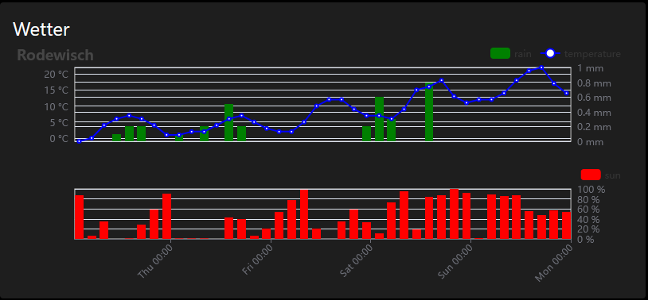
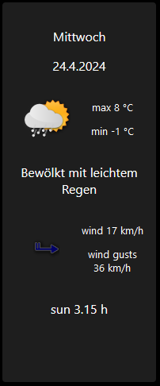
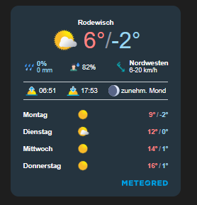
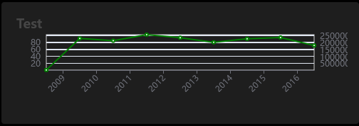
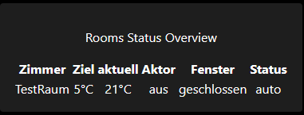
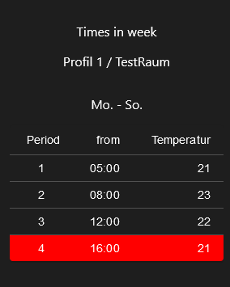
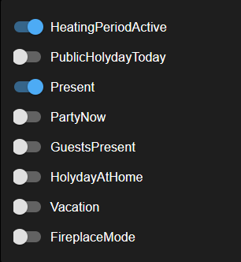
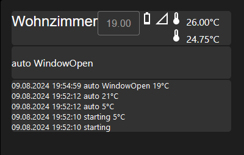
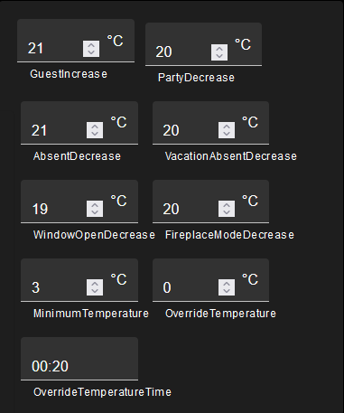
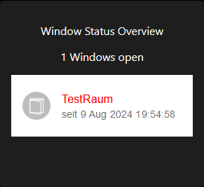

# ioBroker.vis-2-Widgets-Wetter-und-Heizung

**Wenn es Ihnen gefällt, erwägen Sie bitte eine Spende:**

## Wetter

Dieses Vis-2-Widget zeigt Wettervorhersagedaten von DasWetter.com oder weatherunderground an. Sie benötigen den DasWetter-Adapter oder den weatherunderground-Adapter auf Ihrem System.

### Wetter

- OIDs werden automatisch anhand allgemeiner Einstellungen festgelegt.
- Die Beschriftung der x-Achse kann gemäß [der momentjs-Dokumentation](http://momentjs.com/docs/#/displaying/format/) konfiguriert werden.

### Wettertag

- OIDs werden automatisch anhand allgemeiner Einstellungen festgelegt.
- Symbolsets sind veränderbar

### Meteored Wetter-Widget

Weitere Informationen finden Sie unter [METEORED](https://www.daswetter.com/users/widget) .

Sie müssen Ihr Widget auf METEORED erstellen und die Widget-ID abrufen. Diese ID muss hier in den Widget-Einstellungen festgelegt werden. Vergessen Sie nicht, Ihre Domain in den METEORED-Einstellungen auf die Whitelist zu setzen. In meinem Fall musste ich dies tun.`https://192.168.xxx.xxx:8082` um das Widget zum Laufen zu bringen.

## allgemeine Übersicht

### Eingabedaten für allgemeines Diagramm

- "OID-Datenserie" sollte auf einen Datenpunkt wie den folgenden verweisen:`sbfspot.0.xxxxxxxx.history.years`
- Ein Datenpunkt sollte Schlüssel-Wert-Paare enthalten, wie zum Beispiel

\[{"year":"2008","value":7000},{"year":"2009","value":2309000},{"year":"2010","value":4445000},{"year":"2011","value":7019000},{"year":"2012","value":9371000},{"year":"2013","value":11393000},{"year":"2014","value":13666000},{"year":"2015","value":16034000},{"year":"2016","value":17826790}]

- Die Differenzberechnung und -anzeige der Werte ist möglich. Aktivieren Sie dazu einfach die Option „Differenzberechnung“ in den Einstellungen.

- Es unterstützt Adapter`sbfspot` Und`ebus` Wählen Sie einfach die Instanz aus, und die grundlegenden Anpassungen werden automatisch vorgenommen.

## Heizung (Widgets für den HeatingControl-Adapter)

Basierend auf [Pittinis](https://github.com/Pittini/iobroker-heatingcontrol-vis) Projekt für das alte VIS sind nun ähnliche Widgets für VIS-2 verfügbar.

### Raumübersicht

### Heizzeitplan

### Allgemeiner Parameter

### Zimmer

### Raumprofilparameter

### Fensterstatusübersicht

<!--
    ### **WORK IN PROGRESS**
-->

## Changelog
### 1.4.3 (2026-07-05)
* (René) dependencies updated

### 1.4.2 (2026-06-05)
* (René) see #264: decimal places for temperature values can now be configured in weather day widget 
* (René) decimal places for Y axis can now be configured in SourceAnalytics bar graph widget 
* (René) #263: bug fix to switch color for datepicker in dark mode

### 1.4.0 (2026-05-26)
* (René) see #174: unused empty space in weather widget removed
* (René) dependencies updated

### 1.3.0 (2026-01-03)
* (René) dependencies updated
* (René) update echarts@6.0.
* (H5N1v2) 41 icons for DasWetter@4.x (galeria7)
* (René) optimisations based on mui@7.x in WeatherDay-widget
* (René) weather widget shows now min and max temperature (if values available)

### 1.2.1 (2025-12-30)
* (René) bug fix deployment and dependencies updated
* (René) update to support DasWetter@4.x
known issue: Icons are not updated yet.
* (René, copilot) fixes based on Lint recommendation

[Older changelogs can be found there](https://github.com/rg-engineering/ioBroker.vis-2-widgets-weather-and-heating/blob/master/CHANGELOG_OLD.md)

## License
The MIT License (MIT)

Copyright (c) 2024-2026  rg-engineering <info@rg-engineering.eu>

Permission is hereby granted, free of charge, to any person obtaining a copy
of this software and associated documentation files (the "Software"), to deal
in the Software without restriction, including without limitation the rights
to use, copy, modify, merge, publish, distribute, sublicense, and/or sell
copies of the Software, and to permit persons to whom the Software is
furnished to do so, subject to the following conditions:

The above copyright notice and this permission notice shall be included in
all copies or substantial portions of the Software.

THE SOFTWARE IS PROVIDED "AS IS", WITHOUT WARRANTY OF ANY KIND, EXPRESS OR
IMPLIED, INCLUDING BUT NOT LIMITED TO THE WARRANTIES OF MERCHANTABILITY,
FITNESS FOR A PARTICULAR PURPOSE AND NONINFRINGEMENT. IN NO EVENT SHALL THE
AUTHORS OR COPYRIGHT HOLDERS BE LIABLE FOR ANY CLAIM, DAMAGES OR OTHER
LIABILITY, WHETHER IN AN ACTION OF CONTRACT, TORT OR OTHERWISE, ARISING FROM,
OUT OF OR IN CONNECTION WITH THE SOFTWARE OR THE USE OR OTHER DEALINGS IN
THE SOFTWARE.