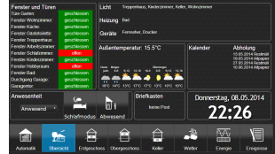
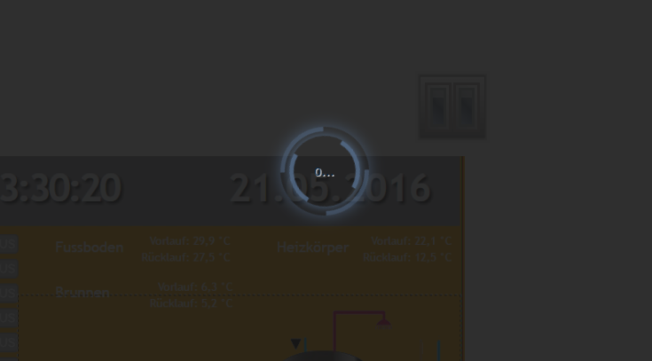

# Visualisierung der nächsten Generation für ioBroker: vis-2
Webvisualisierung für die ioBroker-Plattform.

## Übersicht
- [Lizenzanforderungen](#license-requirements)
- [Installation & Dokumentation](#installation--documentation)
- [Bindungen von Objekten](#bindings-of-objects)
- [Filter](#filters)
- [Steuerungsschnittstelle](#control-interface)
- [Standardansicht](#default-view)
- [Berechtigungssystem](#permissions-system)
- [Einstellungen](#settings)
- [SVG und aktuelleFarbe](#svg-and-currentcolor)

## Installation & Dokumentation
 

[Online-Demos](https://iobroker.click/)

## Bindungen von Objekten
Normalerweise verfügen die meisten Widgets über ein ObjectID-Attribut, das mit einer Objekt-ID verknüpft werden kann.
Es gibt jedoch eine weitere Möglichkeit, *beliebige* Widget-Attribute an eine ObjectID zu binden.

Schreiben Sie einfach in das Attribut `{object.id}`, z. B. `{hm-rpc.0.OEQ1880105.4.ACTUAL_TEMPERATURE}`, und es wird an den Wert dieses Objekts gebunden.
Wenn Sie das spezielle Format verwenden, können Sie damit sogar einfache Operationen durchführen, z. B. Multiplikation oder Formatierung.

Beispiel: Berechnung der Hypotenuse eines Dreiecks:

`{h:javascript.0.myCustom.height;w:javascript.0.myCustom.width;Math.max(20, Math.sqrt(h*h + w*w))}` wird als Funktion interpretiert:

```js
value = await (async function () {
    var h = (await getState('javascript.0.myCustom.height')).val;
    var w = (await getState('javascript.0.myCustom.width')).val;
    return Math.max(20, Math.sqrt(h * h + w * w));
})();
```

oder

`{h:javascript.0.myCustom.height;w:javascript.0.myCustom.width;h*w}` multipliziert einfach Höhe mit Breite.

Sie können *beliebige* JavaScript-Funktionen (Browserfunktionen) verwenden. Argumente müssen mit ':' definiert werden, andernfalls werden sie als Formel interpretiert.

Achten Sie auf die Datentypen. Alle sind als Zeichenketten definiert. Um sicherzustellen, dass der Wert als Zahl behandelt wird, verwenden Sie die Funktion `parseFloat`.

Unsere Hypotenusenberechnung lautet also:

```
{h:javascript.0.myCustom.height;w:javascript.0.myCustom.width;Math.max(20, Math.sqrt(Math.pow(parseFloat(h), 2) + Math.pow(parseFloat(w), 2)))}
```

### Veraltetes Format
Patten hat folgendes Format:

```
{objectID;operation1;operation2;...}
```

Folgende Operationen werden unterstützt:

- `*` - Multiplikation. Das Argument muss in Klammern stehen, z. B. "*(4)". In diesem Beispiel multiplizieren wir den Wert mit 4.
- `+` - addieren. Das Argument muss in eckigen Klammern stehen, z. B. "+(4.5)". In diesem Beispiel addieren wir den Wert 4.5.
- `-` - Subtrahieren. Das Argument muss in Klammern stehen, z. B. "-(-674,5)". In diesem Beispiel subtrahieren wir vom Wert -674,5.
- `/` - Division. Das Argument muss in eckigen Klammern stehen, z. B. "/(0,5)". In diesem Beispiel teilen wir den Wert durch 0,5.
- `%` - Modulo. Das Argument muss in eckigen Klammern stehen, z. B. "%(5)". In diesem Beispiel berechnen wir den Modulo von 5.
- `round` - rundet den Wert.
- `round(N)` - Runden Sie den Wert auf N Nachkommastellen, z. B. 34,678;round(1) => 34,7
- `hex` - Wert in Hexadezimalwert umwandeln. Alle Buchstaben sind kleingeschrieben.
- `hex2` – Wandelt den Wert in einen Hexadezimalwert um. Alle Buchstaben werden kleingeschrieben. Ist der Wert kleiner als 16, wird eine führende Null hinzugefügt.
- `HEX` - dasselbe wie hex, aber in Großbuchstaben.
- `HEX2` - dasselbe wie hex2, aber in Großbuchstaben.
- `date` - Datum gemäß dem angegebenen Format formatieren. Das Format entspricht dem in [iobroker.javascript](https://github.com/iobroker/iobroker.javascript/blob/master/README.md#formatdate) definierten.
- `min(N)` - Wenn der Wert kleiner als N ist, nimm N, sonst den Wert
- `max(M)` - Wenn der Wert größer als M ist, nimm M, sonst den Wert
- `sqrt` - Quadratwurzel
- `pow(n)` - Potenz von N.
- `pow` - Potenz von 2.
- `floor` - Math.floor
- `ceil` - Math.ceil
- `json` - Operation zum Abrufen von JSON- oder Objekteigenschaften. Z. B. `{id;json(common.name.en)}`
- `random(R)` - Math.random() * R, oder einfach Math.random(), wenn kein Argument angegeben wird
- `formatValue(decimals)` - Wert gemäß Systemeinstellungen formatieren und Dezimalstellen verwenden
- `date(format)` - Wert als Datum formatieren. Das Format ist beispielsweise: "YYYY-MM-DD hh:mm:ss.sss"
- `momentDate(format, useTodayOrYesterday)` – Formatiert den Wert als Datum mit Moment.js. [Zulässige Formate müssen gemäß der Moment.js-Bibliothek eingegeben werden](https://momentjs.com/docs/#/displaying/format/). Mit `useTodayOrYesterday=true` werden die Moment.js-Formate `ddd`/`dddd` mit dem heutigen/gestern Datum überschrieben.
- `array(element1,element2[,element3,element4])` - gibt das Element mit dem Index zurück. Beispiel: `{id.ack;array(ack is false,ack is true)}`

Sie können dieses Muster in jedem beliebigen Text verwenden, zum Beispiel

```
My calculations with {objectID1;operation1;operation2;...} are {objectID2;operation3;operation4;...}
```

oder Farbberechnungen:

```
#{objectRed;/(100);*(255);HEX2}{objectGreen;HEX2}{objectBlue;HEX2}
```

Um den Zeitstempel eines Objekts anzuzeigen, schreiben Sie `.ts` oder `.lc` (für die letzte Änderung) an das Ende der Objekt-ID, z. B.:

```
Last change: {objectRed.lc;date(hh:mm)}
```

### Spezielle Bindungen
Es gibt eine Reihe unterschiedlicher interner Bindungen, um zusätzliche Informationen in Ansichten bereitzustellen:

* `username` - zeigt den angemeldeten Benutzer an
* `view` - Name der tatsächlichen Ansicht
* `wname` - Widget-Name
* `widget` – ist ein Objekt mit allen Daten des Widgets. Kann nur im JavaScript-Teil verwendet werden, z. B. `{a:a;widget.data.name}`.
* `widgetOid` - Verwenden Sie die OID des Widgets, um dem Widget im Zuweisungsabschnitt einen Wert zuzuweisen, z. B. `{t:widgetOid.val;t}`
* `wid` - Name des eigentlichen Widgets
* „Sprache“ – kann „de“, „en“ oder „ru“ sein.
* `instance` - Browserinstanz
* `login` - ob eine Anmeldung erforderlich ist oder nicht (z. B. zum Ein-/Ausblenden der Abmeldeschaltfläche)
* `local_*` – Wenn der Zustandsname mit `local_` beginnt, wird er nicht an ioBroker gemeldet, aber alle Widgets, die von diesem Zustand abhängen, werden aktualisiert. (Lokale Variable für die aktuelle Browsersitzung)

Hinweis: Um ":" in Berechnungen (z. B. in einer Formel) zu verwenden, verwenden Sie stattdessen "::" .

**Denken Sie daran:** Stildefinitionen werden als Bindungen interpretiert. Verwenden Sie daher `{{style: value}}` oder einfach

```
{
	style: value
}
```

dafür.

## Filter
Um die Gesamtzahl der Widgets in einer einzigen Ansicht zu visualisieren, können Sie Filter verwenden, um die Anzahl der gleichzeitig in der Ansicht angezeigten Widgets zu reduzieren.

Jedes Widget verfügt über ein Feld `filter`. Wenn Sie diesem einen Wert zuweisen, z. B. `light`, können Sie mit einem anderen Widget `(bars - filters, filter - dropdown)` steuern, welcher Filter gerade aktiv ist.

## Steuerungsschnittstelle
Vis erstellt 3 Variablen:

- `control.instance` - Hier sollte die Browserinstanz angegeben werden oder `FFFFFFFF`, wenn jeder Browser kontrolliert werden soll.
- `control.data` - Parameter für den Befehl. Siehe die Beschreibung des jeweiligen Befehls.
- `control.command` – Befehlsname. Schreiben Sie diese Variable, um den Befehl auszulösen. Das bedeutet, dass die Variablen „instance“ und „data“ vor dem Schreiben des Befehls mit Daten gefüllt sein müssen.

Befehle:

* `alert` – zeigt ein Warnfenster in vis-2 an. "control.data" hat das Format "message;title;jquery-icon". Titel und jquery-icon sind optional. Die Namen der Icons finden Sie [hier](http://jqueryui.com/themeroller/). Um das Icon "ui-icon-info" anzuzeigen, schreiben Sie `Message;;info`.
* `changeView` – Wechselt zur gewünschten Ansicht. "control.data" muss den Namen der Ansicht enthalten. Sie können auch den Projektnamen als `project/view` angeben. Das Standardprojekt ist `main`.
* `refresh` - vis-2 neu laden, beispielsweise nachdem das Projekt so geändert wurde, dass es in allen Browsern neu geladen wird.
* `reload` - dasselbe wie Aktualisieren.
* `dialog` – Dialogfenster anzeigen. Der Dialog muss in der Ansicht vorhanden sein. Eine der folgenden Optionen:

- `static - HTML - Dialog`,
- `static - Icon - Dialog`,
- `container - HTML - view in jqui Dialog`,
- `container - ext cmd - view in jqui Dialog`,
- `container - Icon - view in jqui Dialog`,
- `container - Button - view in jqui Dialog`.

`control.data` muss die ID des Dialog-Widgets haben, z. B. `w00056`.

* `dialogClose`
* `popup` – öffnet ein neues Browserfenster. Der Link muss in `control.data` angegeben werden, z. B. http://google.com
* `playSound` – spielt eine Audiodatei ab. Der Link zur Datei wird in `control.data` angegeben, z. B. http://www.modular-planet.de/fx/marsians/Marsiansrev.mp3.

Sie können Ihre eigene Datei in vis-2 hochladen und beispielsweise als `/vis-2.0/main/img/myFile.mp3` abspielen lassen.

**Wichtig:** Der Browser kann erst dann Audio abspielen, wenn der Nutzer mindestens einmal auf die Seite geklickt hat. Dies ist eine Sicherheitsrichtlinie des Browsers. [Hier](https://github.com/Hugo22O/chrome-autoplay) Weitere Informationen finden Sie hier.

Wenn der Benutzer die Ansicht ändert oder beim Start, werden die Variablen von vis-2 mit

- `control.instance`: Browserinstanz und `ack=true`
- `control.data`: Projekt- und Ansichtsname im Format `project/view`, z. B. `main/view` (und `ack=true`)
- `control.command`: `changedView` und `ack=true`

Sie können die JSON-Zeichenfolge oder das Objekt in `control.command` als `{instance: 'AABBCCDD', command: 'cmd', data: 'ddd'}` schreiben. In diesem Fall werden die Instanz und die Daten aus dem JSON-Objekt übernommen.

Beispiel für einen JavaScript-Adapter:

```js
setState('vis-2.0.control.command', { instance: '*', command: 'refresh', data: ''});
```

Wenn Sie das JSON als Zeichenkette schreiben, stellen Sie sicher, dass es analysierbar ist, z. B. `{"instance": "*", "command": "refresh", "data": ""}`, beachten Sie das `"`.

## Standardansicht
Sie können für jede Ansicht die gewünschte Auflösung festlegen (Menü → Werkzeuge → Auflösung).
Dies ist lediglich der visuelle Rahmen im Bearbeitungsmodus, der Ihnen die Bildschirmgröße auf einem bestimmten Gerät anzeigt. Im Echtzeitmodus ist er nicht sichtbar, und alle Widgets außerhalb des Rahmens sind sichtbar.

Zusätzlich können Sie festlegen, ob diese Ansicht für diese Auflösung als Standard verwendet werden soll.

Jedes Mal, wenn `index.html` (ohne `#viewName`) aufgerufen wird, wird die für diese Auflösung am besten geeignete Ansicht geöffnet.
Wenn nur eine Ansicht das Flag *"Standard"* besitzt, wird diese Ansicht unabhängig von Bildschirmauflösung und -ausrichtung geöffnet.

Beispielsweise können Sie zwei Ansichten erstellen, „Querformat-Mobil“ und „Hochformat-Mobil“, und zwischen diesen beiden Ansichten wird automatisch umgeschaltet, wenn Sie die Ausrichtung oder die Bildschirmgröße ändern.

Es gibt ein Hilfs-Widget namens „basic - Screen Resolution“, das die aktuelle Bildschirmauflösung und die für diese Auflösung am besten geeignete Standardansicht anzeigt.

## Berechtigungssystem
### Projekt
Im Projektmanagement-Dialog können Sie die Berechtigungen `read` und `write` für jeden ioBroker-Benutzer konfigurieren.

Das Flag `read` bedeutet, dass das Projekt für diesen Benutzer in der Laufzeitumgebung zugänglich ist.
Das Flag `write` bedeutet, dass das Projekt für diesen Benutzer im Bearbeitungsmodus zugänglich ist.

Wenn ein neuer Benutzer über den ioBroker Admin-Adapter erstellt wird, verfügt er standardmäßig über beide Berechtigungen.

### Sicht
Sie können außerdem festlegen, auf welche Ansichten der Benutzer im Laufzeit- und Bearbeitungsmodus zugreifen darf.
Wenn eine der Zugriffsrechte auf Projektebene nicht gewährt wird, hat die Festlegung auf Ansichtsebene keine Auswirkung, da das gesamte Projekt dann nicht zugänglich ist.

Beachten Sie, dass dem Benutzer immer dann das Projektauswahlfeld angezeigt wird, wenn er versucht, auf eine Ansicht zuzugreifen, für die er keine Berechtigung hat.

### Widget
Besitzt der Benutzer keine Berechtigung für `read`, wird das Widget zur Laufzeit nicht gerendert. Besitzt der Benutzer keine Berechtigung für `write`, wird das Widget im Bearbeitungsmodus nicht gerendert.

## Einstellungen
### Neu laden, wenn die Wartezeit länger als
Es gibt eine Regel, die besagt, dass nach einer gewissen Zeit ohne Verbindung die gesamte VIS-Seite neu geladen wird, um das Projekt zu synchronisieren.
Sie können dies im Menü „Einstellungen…“ konfigurieren. Wenn Sie das Intervall auf „Nie“ setzen, wird die Seite nie neu geladen.

### Wiederverbindungsintervall
Legen Sie das Intervall zwischen den Verbindungsversuchen bei Verbindungsabbruch fest. Bei einer Einstellung von 2 Sekunden wird alle 2 Sekunden versucht, die Verbindung wiederherzustellen.

### Dunkler Wiederverbindungsbildschirm
Manchmal (nachts) ist ein dunkler Ladebildschirm erforderlich. Mit dieser Option können Sie dies einstellen.

Beachten Sie, dass diese Einstellungen nur für die Wiederverbindung und nicht für die erste Verbindung gelten.



## SVG und currentColor
Das CSS-Schlüsselwort `currentColor` ermöglicht es Elementen, die aktuelle Textfarbe ihres Elternelements zu übernehmen.
Dies ist besonders nützlich bei SVGs (Scalable Vector Graphics), da es dynamischere Formatierungen und eine einfachere Integration in HTML-Inhalte ermöglicht.

Sie können das Schlüsselwort `currentColor` anstelle eines spezifischen Farbwerts für jede Eigenschaft innerhalb des SVG-Elements verwenden, die einen Farbwert akzeptiert.
Hier ist ein einfaches Beispiel mit einem Kreis in einem SVG-Element:

```xml
<svg width="100" height="100" xmlns="http://www.w3.org/2000/svg">
    <circle cx="50" cy="50" r="40" fill="currentColor" />
</svg>
```

In diesem Fall übernimmt das SVG die Farbe des übergeordneten Elements.

Beispiel: Wenn es in einem Menü verwendet wird und das Menü rot ist, wäre der Kreis ebenfalls rot.

## Entwicklung und Fehlersuche
Um Anpassungen am vis-2-Editor selbst vorzunehmen, nach Fehlern zu suchen und diese zu beheben, müssen die folgenden Schritte durchgeführt werden.

1. Forken Sie das Repository iobroker/iobroker.vis-2 über die Benutzeroberfläche von GitHub in Ihr eigenes Konto.

2. Klonen Sie das Repository in ein Verzeichnis. Kopieren Sie die URL aus Ihrem GitHub-Repository. Der Befehl sieht folgendermaßen aus:

```shell
git clone https://github.com/<your profile name>/ioBroker.vis-2.git
```

3. Öffnen Sie das heruntergeladene Repository mit Ihrer IDE.

4. Um alle erforderlichen Bibliotheken zu installieren und herunterzuladen, führen Sie den folgenden Befehl in einem Terminal im Stammverzeichnis des Repositorys aus.

```shell
npm run install-monorepo
```

5. Um den Editor im Browser zu starten, führen Sie bitte den folgenden Befehl aus.

Eine bereits separat laufende iobroker-Serverinstanz muss auf Port 8082 verfügbar sein.

```shell
npm run start
```

- Debugging ist im Browser verfügbar, z. B. in Chrome über die Taste F12.
- Wenn Sie eine Datei ändern, wird das automatische Neuladen des Editors unterstützt.

## Todo
<!-- Platzhalter für die nächste Version (am Anfang der Zeile):

### **IN BEARBEITUNG** -->

## Changelog
### 2.13.17 (2026-03-29)
* (@GermanBluefox) Removed debug code for theme

### 2.13.16 (2026-03-26)
* (@GermanBluefox) Fixing the usage of umlauts in patterns
* (@GermanBluefox) Fixing commands via control interface when sent as JSON

### 2.13.8 (2025-11-15)
* (@GermanBluefox) Updated packages

### 2.13.7 (2025-11-09)
* (@GermanBluefox) Updated packages
* (@GermanBluefox) Corrected the basic image refreshing

### 2.13.6 (2025-10-10)
* (@GermanBluefox) Prevent error by the icon selection dialog

## License
To use this adapter in `ioBroker` you need to accept the source code license of the adapter. The source code of this adapter is available under the CC BY-NC license.

Additionally, you need a license to use the adapter. The following license editions are available on https://iobroker.net/www/pricing 
* **Community-License: Free for private use!**: Get a free license by registering an account on [https://iobroker.net](https://iobroker.net). The license if checked online against the ioBroker license server when the vis-2 adapter is started, so an online connection at this time point is required!
* **Private use Offline-License**: For paying a small support fee, you can get rid of the required online license check on adapter startup. **Only for Private use!**
* **Commercial License**: When using Vis in a commercial environment or selling Vis as a part of ioBroker packages to your customers, this license is for you. License check is also not requiring an online connection.

## License
 Copyright (c) 2021-2026 Denis Haev, https://github.com/GermanBluefox <dogafox@gmail.com>,
  
 Creative Common Attribution-NonCommercial (CC BY-NC)

 http://creativecommons.org/licenses/by-nc/4.0/


Short content:
Licensees may copy, distribute, display and perform the work and make derivative works based on it only if they give the author or licensor the credits in the manner specified by these.
Licensees may copy, distribute, display, and perform the work and make derivative works based on it only for noncommercial purposes.
(Free for non-commercial use).