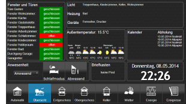
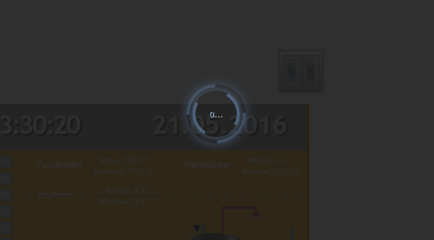

# Visualisierung der nächsten Generation für ioBroker: vis-2

Webvisualisierung für die ioBroker-Plattform.

## Überblick

- [Lizenzanforderungen](#license-requirements)
- [Installation & Dokumentation](#installation--documentation)
- [Bindungen von Objekten](#bindings-of-objects)
- [Filter](#filters)
- [Steuerungsschnittstelle](#control-interface)
- [Standardansicht](#default-view)
- [Navigation](#navigation)
- [Berechtigungssystem](#permissions-system)
- [Einstellungen](#settings)
- [SVG und aktuelle Farbe](#svg-and-currentcolor)

## Lizenzanforderungen

Um diesen Adapter zu verwenden in`ioBroker` Sie müssen die Quellcodelizenz des Adapters akzeptieren. Der Quellcode dieses Adapters ist unter der CC BY-NC-Lizenz verfügbar.

Zusätzlich benötigen Sie eine Lizenz zur Nutzung des Adapters. Die folgenden Lizenzversionen sind auf <https://iobroker.net/www/pricing> verfügbar.

- **Community-Lizenz: Kostenlos für den privaten Gebrauch!** Registrieren Sie sich auf <https://iobroker.net> , um eine kostenlose Lizenz zu erhalten. Die Lizenz wird beim Start des vis-2-Adapters online auf dem ioBroker-Lizenzserver überprüft. Daher ist zu diesem Zeitpunkt eine Internetverbindung erforderlich!
- **Offline-Lizenz für den privaten Gebrauch** : Gegen eine geringe Supportgebühr können Sie die obligatorische Online-Lizenzprüfung beim Start des Adapters umgehen. **Nur für den privaten Gebrauch!**
- **Kommerzielle Lizenz** : Diese Lizenz ist für Sie geeignet, wenn Sie Vis in einer kommerziellen Umgebung einsetzen oder Vis als Bestandteil von ioBroker-Paketen an Ihre Kunden verkaufen. Die Lizenzprüfung erfordert keine Internetverbindung.

## Installation & Dokumentation



[Online-Demos](https://iobroker.click/)

## Bindungen von Objekten

Normalerweise verfügen die meisten Widgets über ein ObjectID-Attribut, das mit einer Objekt-ID verknüpft werden kann. Es gibt jedoch noch eine weitere Möglichkeit, _ein beliebiges_ Widget-Attribut an eine ObjectID zu binden.

Schreiben Sie einfach in das Attribut.`{object.id}` z.B`{hm-rpc.0.OEQ1880105.4.ACTUAL_TEMPERATURE}` und es wird an den Wert dieses Objekts gebunden. Wenn Sie das spezielle Format verwenden, können Sie damit sogar einfache Operationen durchführen, z. B. Multiplikation oder Formatierung.

Beispiel: Berechnung der Hypotenuse eines Dreiecks:

`{h:javascript.0.myCustom.height;w:javascript.0.myCustom.width;Math.max(20, Math.sqrt(h*h + w*w))}` wird als Funktion interpretiert:

```js
value = await (async function () {
    var h = (await getState('javascript.0.myCustom.height')).val;
    var w = (await getState('javascript.0.myCustom.width')).val;
    return Math.max(20, Math.sqrt(h * h + w * w));
})();
```

oder

`{h:javascript.0.myCustom.height;w:javascript.0.myCustom.width;h*w}` multipliziert einfach Höhe mit Breite.

Sie können _beliebige_ JavaScript-Funktionen (Browserfunktionen) verwenden. Argumente müssen mit ':' definiert werden, andernfalls werden sie als Formel interpretiert.

Achten Sie auf die Datentypen. Alle sind als Zeichenketten definiert. Um sicherzustellen, dass der Wert als Zahl behandelt wird, verwenden Sie die Funktion \`parseFloat\`.

Unsere Hypotenusenberechnung lautet also:

```
{h:javascript.0.myCustom.height;w:javascript.0.myCustom.width;Math.max(20, Math.sqrt(Math.pow(parseFloat(h), 2) + Math.pow(parseFloat(w), 2)))}
```

### Veraltetes Format

Patten hat folgendes Format:

```
{objectID;operation1;operation2;...}
```

Folgende Operationen werden unterstützt:

- `*` Multiplikation. Das Argument muss in Klammern stehen, z. B. "\*(4)". In diesem Beispiel multiplizieren wir den Wert mit 4.
- `+` - addieren. Das Argument muss in Klammern stehen, z. B. "+(4,5)". In diesem Beispiel addieren wir den Wert 4,5.
- `-` - Subtrahieren. Das Argument muss in Klammern stehen, z. B. "-(-674,5)". In diesem Beispiel subtrahieren wir vom Wert -674,5.
- `/` - Division. Das Argument muss in Klammern stehen, z. B. "/(0,5)". In diesem Beispiel teilen wir den Wert durch 0,5.
- `%` Modulo. Das Argument muss in eckigen Klammern stehen, z. B. "%(5)". In diesem Beispiel berechnen wir den Modulo von 5.
- `round` - Runden Sie den Wert.
- `round(N)` - Runde den Wert auf N Nachkommastellen, z. B. 34,678;round(1) => 34,7
- `hex` - Wert in Hexadezimalwert umwandeln. Alle Buchstaben sind kleingeschrieben.
- `hex2` - Wert in Hexadezimalwert umwandeln. Alle Buchstaben werden kleingeschrieben. Ist der Wert kleiner als 16, wird eine führende Null hinzugefügt.
- `HEX` - Dasselbe wie Hexadezimal, nur in Großbuchstaben.
- `HEX2` - das Gleiche wie hex2, aber in Großbuchstaben.
- `date` - Datum gemäß dem angegebenen Format formatieren. Das Format ist dasselbe wie in [iobroker.javascript.](https://github.com/iobroker/iobroker.javascript/blob/master/README.md#formatdate)
- `min(N)` - Wenn der Wert kleiner als N ist, nimm N, sonst den Wert
- `max(M)` - Wenn der Wert größer als M ist, nimm M, ansonsten den Wert
- `sqrt` - Quadratwurzel
- `pow(n)` - Potenz von N.
- `pow` - Zweierpotenz.
- `floor` - Math.floor
- `ceil` - Math.ceil
- `json` - Operation zum Abrufen von JSON- oder Objekteigenschaften. Z. B.`{id;json(common.name.en)}`
- `random(R)` - Math.random() \* R, oder einfach Math.random(), wenn kein Argument angegeben wird
- `formatValue(decimals)` - Wert gemäß Systemeinstellungen formatieren und Dezimalstellen verwenden
- `date(format)` - Wert als Datum formatieren. Das Format ist etwa so: "YYYY-MM-DD hh:mm:ss.sss"
- `momentDate(format, useTodayOrYesterday)` - Wert mithilfe von Moment.js als Datum formatieren. [Zulässige Formate müssen gemäß der Moment.js-Bibliothek eingegeben werden](https://momentjs.com/docs/#/displaying/format/) .`useTodayOrYesterday=true` Die`moment.js` Format`ddd` /`dddd` werden mit heute / gestern überschrieben
- `array(element1,element2[,element3,element4])` - Gibt das Element mit dem angegebenen Index zurück. Beispiel:`{id.ack;array(ack is false,ack is true)}`

Sie können dieses Muster in jedem beliebigen Text verwenden, zum Beispiel

```
My calculations with {objectID1;operation1;operation2;...} are {objectID2;operation3;operation4;...}
```

oder Farbberechnungen:

```
#{objectRed;/(100);*(255);HEX2}{objectGreen;HEX2}{objectBlue;HEX2}
```

Um den Zeitstempel eines Objekts anzuzeigen, schreiben Sie`.ts` oder`.lc` (für die letzte Änderung) am Ende der Objekt-ID, z. B.:

```
Last change: {objectRed.lc;date(hh:mm)}
```

### Spezielle Bindungen

Es gibt eine Reihe unterschiedlicher interner Bindungen, um zusätzliche Informationen in Ansichten bereitzustellen:

- `username` - zeigt den angemeldeten Benutzer an
- `view`- Name der aktuellen Ansicht
- `wname` - Widget-Name
- `widget` - ist ein Objekt mit allen Daten des Widgets. Kann nur im JS-Teil verwendet werden, wie z. B.`{a:a;widget.data.name}`
- `widgetOid` - Verwenden Sie die OID des Widgets, um dem Widget im Zuweisungsabschnitt einen Wert zuzuweisen, wie zum Beispiel`{t:widgetOid.val;t}`
- `wid` - Name des eigentlichen Widgets
- `language` - kann sein`de` ,`en` oder`ru` Die
- `instance` - Browserinstanz
- `login` - ob eine Anmeldung erforderlich ist oder nicht (z. B. zum Ein-/Ausblenden des Abmeldebuttons)
- `local_*` - wenn der Staatsname mit folgendem beginnt`local_` Es wird nicht an ioBroker gemeldet, aktualisiert aber alle Widgets, die von diesem Zustand abhängen. (Lokale Variable der aktuellen Browsersitzung)

Hinweis: Um ":" in Berechnungen (z. B. in einer Zeichenkettenformel) zu verwenden, verwenden Sie stattdessen "::" .

**Denken Sie daran** , dass Stildefinitionen als Bindungen interpretiert werden, also verwenden Sie`{{style: value}}` oder einfach

```
{
	style: value
}
```

dafür.

## Filter

Um die Gesamtzahl der Widgets in einer einzigen Ansicht zu visualisieren, können Sie Filter verwenden, um die Anzahl der gleichzeitig in der Ansicht angezeigten Widgets zu reduzieren.

Jedes Widget hat ein Feld`filter` Wenn Sie es auf einen bestimmten Wert setzen, z.B.`light` Sie können also auch andere Widgets verwenden.`(bars - filters, filter - dropdown)` um zu steuern, welcher Filter tatsächlich aktiv ist.

Die Einträge der`filter - dropdown` Widgets (Schaltflächen und Dropdown-Elemente) haben die CSS-Klasse`vis-filter-item` und zusätzlich die aktuell aktiven Einträge`vis-filter-item-active` sodass sie im Projekt-CSS formatiert werden können, z. B.:

```css
/* buttons (horizontal / vertical) */
.vis-filter-item-active {
    background-color: #ff0000;
}

/* entries of the dropdown */
.vis-filter-item-active.Mui-selected {
    background-color: #ff0000;
}
```

Es sind zwei Regeln erforderlich, da der aktive Eintrag des Dropdown-Menüs zusätzlich die Klasse besitzt.`Mui-selected` und seine eigene Hintergrundfarbe ist spezifischer als`.vis-filter-item-active` allein.

Bitte beachten Sie:

- Wenn für einen Eintrag im Widget selbst eine Farbe konfiguriert ist, wird diese als Inline-Stil geschrieben und kann nicht überschrieben werden.`color` Diese Eigenschaft stammt aus dem Projekt-CSS. Lassen Sie das Feld für die Farbe des Eingabefelds leer, wenn Sie die Farbe über CSS festlegen möchten.
- Die Einträge des Dropdown-Menüs werden außerhalb des Widgets (in einem Popup auf Seitenebene) gerendert, daher können sie nur global und nicht mit einem Selektor für ein einzelnes Widget angesprochen werden, wie z. B.`#w00001 .vis-filter-item-active` Die Schaltflächen sind Teil des Widgets und können auf diese Weise angesprochen werden.

## Steuerungsschnittstelle

Vis erstellt 3 Variablen:

- `control.instance` - Hier sollte die Browserinstanz angegeben werden oder`FFFFFFFF` wenn jeder Browser kontrolliert werden muss.
- `control.data` - Parameter für den Befehl. Siehe die spezifische Befehlsbeschreibung.
- `control.command` - Befehlsname. Schreiben Sie diese Variable, um den Befehl auszulösen. Das bedeutet, dass die Variablen „instance“ und „data“ vor dem Ausführen des Befehls mit Daten vorbereitet werden müssen.

Befehle:

- `alert` - Zeigt ein Warnfenster in vis-2 an. "control.data" hat das Format "message;title;jquery-icon". Titel und jquery-icon sind optional. Die Namen der Icons finden Sie [hier](http://jqueryui.com/themeroller/) . Um das Icon "ui-icon-info" anzuzeigen, schreiben Sie`Message;;info` Die
- `changeView` - Wechseln Sie zur gewünschten Ansicht. "control.data" muss den Namen der Ansicht enthalten. Sie können auch den Projektnamen angeben.`project/view` Das Standardprojekt ist`main` Die
- `refresh` - Laden Sie beispielsweise vis-2 neu, nachdem das Projekt so geändert wurde, dass es in allen Browsern neu geladen wird.
- `reload` - Dasselbe wie beim Aktualisieren.
- `dialog` - Dialogfenster anzeigen. Der Dialog muss in der Ansicht vorhanden sein. Eine der folgenden Optionen:

  - `static    - HTML    - Dialog` ,
  - `static    - Icon    - Dialog` ,
  - `container - HTML    - view in jqui Dialog` ,
  - `container - ext cmd - view in jqui Dialog` ,
  - `container - Icon    - view in jqui Dialog` ,
  - `container - Button  - view in jqui Dialog` Die

  `control.data` muss die ID des Dialog-Widgets haben, z. B.`w00056` Die
- `dialogClose`
- `popup` - öffnet ein neues Browserfenster. Der Link muss angegeben werden in`control.data` z. B. <http://google.com>
- `playSound` - Audiodatei abspielen. Der Link zur Datei ist angegeben in`control.data` z. B. <http://www.modular-planet.de/fx/marsians/Marsiansrev.mp3> . Sie können Ihre eigene Datei in vis-2 hochladen und sie beispielsweise abspielen lassen.`/vis-2.0/main/img/myFile.mp3` **Wichtig** : Ihr Browser kann erst dann Audio abspielen, wenn Sie mindestens einmal auf die Seite geklickt haben. Dies ist eine Sicherheitsrichtlinie Ihres Browsers. [Hier](https://github.com/Hugo22O/chrome-autoplay) erfahren Sie mehr.

Wenn der Benutzer die Ansicht ändert oder beim Start, werden die Variablen von vis-2 mit

- `control.instance` : Browserinstanz und`ack=true`
- `control.data` : Projekt- und Ansichtsname im Formular`project/view` z.B.`main/view` (Und`ack=true` )
- `control.command` :`changedView` Und`ack=true`

Sie können die JSON-Zeichenfolge oder das Objekt in Folgendes schreiben:`control.command` als`{instance: 'AABBCCDD', command: 'cmd', data: 'ddd'}` In diesem Fall werden die Instanz und die Daten aus dem JSON-Objekt übernommen.

Beispiel für einen JavaScript-Adapter:

```js
setState('vis-2.0.control.command', { instance: '*', command: 'refresh', data: ''});
```

Wenn Sie das JSON als Zeichenkette schreiben, stellen Sie sicher, dass es parsbar ist, z. B.`{"instance": "*", "command": "refresh", "data": ""}` Beachten Sie die`"` Die

## Standardansicht

Sie können für jede Ansicht die gewünschte Auflösung festlegen (Menü => Werkzeuge => Auflösung). Dies ist lediglich der visuelle Rahmen im Bearbeitungsmodus, der Ihnen die Bildschirmgröße auf einem bestimmten Gerät anzeigt. Im Echtzeitmodus ist dieser Rahmen nicht sichtbar, und alle Widgets außerhalb des Rahmens sind sichtbar.

Zusätzlich können Sie festlegen, ob diese Ansicht für diese Auflösung als Standard verwendet werden soll.

Also jedes Mal, wenn`index.html` (ohne`#viewName` Wird die entsprechende Option aufgerufen, wird die für diese Bildschirmauflösung am besten geeignete Ansicht geöffnet. Ist nur eine Ansicht als _„Standard“_ gekennzeichnet, wird diese unabhängig von Bildschirmauflösung und -ausrichtung geöffnet.

Sie können beispielsweise zwei Ansichten erstellen, „Querformat-Mobil“ und „Hochformat-Mobil“, und zwischen diesen beiden Ansichten wird automatisch umgeschaltet, wenn Sie die Ausrichtung oder die Bildschirmgröße ändern.

Es gibt ein Hilfs-Widget namens „basic - Screen Resolution“, das die aktuelle Bildschirmauflösung und die für diese Auflösung am besten geeignete Standardansicht anzeigt.

## Navigation

Jedes Widget, das zu einer Ansicht führt – das`Go to view` Option der jQui-Widgets,`basic - HTML navigation` , … - erhält die CSS-Klasse`vis-nav-active` Solange die Ansicht, auf die verwiesen wird, auch die angezeigte Ansicht ist. Daher kann der Eintrag der aktuellen Ansicht im CSS des Projekts hervorgehoben werden:

```css
.vis-nav-active button {
    border: 1px solid #0d72b8;
}
```

## Berechtigungssystem

### Projekt

Im Projektmanagement-Dialog können Sie konfigurieren`read` Und`write` Berechtigungen für jeden ioBroker-Benutzer.

Der`read` Das Flag bedeutet, dass das Projekt für diesen Benutzer in der Laufzeitumgebung zugänglich ist.`write` Dieses Flag bedeutet, dass das Projekt für diesen Benutzer im Bearbeitungsmodus zugänglich ist.

Wenn ein neuer Benutzer über den ioBroker Admin-Adapter erstellt wird, verfügt er standardmäßig über beide Berechtigungen.

### Sicht

Sie können außerdem festlegen, auf welche Ansichten der Benutzer im Laufzeit- und Bearbeitungsmodus zugreifen darf. Wenn eine der Zugriffsrechte auf Projektebene nicht gewährt wird, hat die Angabe auf Ansichtsebene keine Auswirkung, da das gesamte Projekt dann nicht zugänglich ist.

Beachten Sie, dass dem Benutzer immer dann das Projektauswahlfeld angezeigt wird, wenn er versucht, auf eine Ansicht zuzugreifen, für die er keine Berechtigung hat.

### Widget

Wenn der Benutzer keine`read` Fehlende Berechtigungen führen dazu, dass das Widget zur Laufzeit nicht gerendert wird. Wenn der Benutzer keine Berechtigungen hat, wird das Widget nicht gerendert.`write` Ohne Berechtigungen wird das Widget im Bearbeitungsmodus nicht angezeigt.

## Einstellungen

### Neu laden, wenn die Wartezeit länger als

Es gibt eine Regel, nach der die gesamte VIS-Seite nach einer gewissen Zeit ohne Verbindung neu geladen wird, um das Projekt zu synchronisieren. Sie können dies im Menü „Einstellungen…“ konfigurieren. Wenn Sie das Intervall auf „Nie“ setzen, wird die Seite nie neu geladen.

### Wiederverbindungsintervall

Legen Sie das Intervall zwischen den Verbindungsversuchen bei Verbindungsabbruch fest. Bei einer Einstellung von 2 Sekunden wird alle 2 Sekunden versucht, die Verbindung wiederherzustellen.

### Dunkler Wiederverbindungsbildschirm

Manchmal (nachts) ist ein dunkler Ladebildschirm erforderlich. Mit dieser Option können Sie dies einstellen.

Beachten Sie, dass diese Einstellungen nur für die Wiederverbindung und nicht für die erste Verbindung gelten.



## SVG und currentColor

Das CSS-Schlüsselwort \`currentColor\` ermöglicht es Elementen, die aktuelle Textfarbe ihres Elternelements zu übernehmen. Dies ist besonders nützlich bei SVGs (Scalable Vector Graphics), da es dynamischere Formatierungen und eine einfachere Integration in HTML-Inhalte ermöglicht.

Sie können das Schlüsselwort \`currentColor\` anstelle eines spezifischen Farbwerts für jede Eigenschaft innerhalb eines SVG-Elements verwenden, die einen Farbwert akzeptiert. Hier ist ein einfaches Beispiel mit einem Kreis in einem SVG-Element:

```xml
<svg width="100" height="100" xmlns="http://www.w3.org/2000/svg">
    <circle cx="50" cy="50" r="40" fill="currentColor" />
</svg>
```

In diesem Fall übernimmt das SVG die Farbe des übergeordneten Elements. Wenn es beispielsweise in einem Menü verwendet wird und das Menü rot ist, wäre der Kreis ebenfalls rot.

## Entwicklung und Fehlersuche

Um Anpassungen am vis-2-Editor selbst vorzunehmen, nach Fehlern zu suchen und diese zu beheben, müssen die folgenden Schritte durchgeführt werden.

1. Forken Sie das Repository iobroker/iobroker.vis-2 über die Benutzeroberfläche von GitHub in Ihr eigenes Konto.

2. Klonen Sie das Repository in ein Verzeichnis. Kopieren Sie die URL aus Ihrem GitHub-Repository. Der Befehl sieht folgendermaßen aus:

```shell
git clone https://github.com/<your profile name>/ioBroker.vis-2.git
```

3. Öffnen Sie das heruntergeladene Repository mit Ihrer IDE.

4. Um alle notwendigen Bibliotheken zu installieren und herunterzuladen, führen Sie den folgenden Befehl in einem Terminal im Stammverzeichnis des Repositorys aus.

```shell
npm run install-monorepo
```

5. Um den Editor im Browser zu starten, führen Sie bitte folgenden Befehl aus. Eine separat laufende iobroker-Serverinstanz muss auf Port 8082 verfügbar sein.

```shell
npm run start
```

- Debugging-Funktionen sind im Browser verfügbar, z. B. in Chrome (F12).
- Wenn Sie eine Datei ändern, wird das automatische Neuladen des Editors unterstützt.

## Todo

<!--
    Placeholder for the next version (at the beginning of the line):
    ### **WORK IN PROGRESS**
-->

## Changelog
### **WORK IN PROGRESS**
* (@typhosj) `licenseInformation.link` points at the license editions now. For a non-free license that link is meant to name validity, shop and seller, which the source license file does not
* (@typhosj) A timestamp that arrives as a string is shown as a date again instead of `NaN:NaN:NaN`, and a value that cannot be parsed at all is shown as it is
* (@typhosj) A widget that leads to the view that is shown gets the CSS class `vis-nav-active`, so the current entry of a self-built navigation can be highlighted. The jQui buttons mark themselves by the active view now instead of the address of the browser, which they never noticed changing
* (@typhosj) The project setting `States Debounce Time` is applied again: the commands for one object ID are collected during that period. It had no effect at all, as the value was never read from the project
* (@typhosj) The switch of the `binary control` widget shows the state of the object again if no text and no icon are defined
* (@typhosj) `widgetOid` delivers the object ID of a widget inside a group again instead of the name of the group attribute
* (@typhosj) A view can show the navigation menu without being an entry of it: the new view setting `Hide this view in the menu`
* (@typhosj) A resize of the window does not leave the opened view anymore, unless that view offers itself for a resolution
* (@typhosj) Fixed the widget attributes keeping the groups of the previously selected widget after a view change
* (@typhosj) The view of a jQui dialog is drawn inside the dialog again and no longer over its title
* (@typhosj) Fixed the crash of the `bulb on/off` widget if the value of its object is `null`
* (@typhosj) An `iFrame` or `echarts` widget is transparent again in the dark mode. The CSS variables put `color-scheme: dark` on `:root`, and a browser paints an opaque canvas behind an iframe whose document declares itself transparent (#661)
* (@typhosj, @GermanBluefox) The content of a widget is not cut off anymore: `CssBaseline` is gone. It switched the whole document to `border-box` and painted the body, while the widgets - the built-in ones and those of other adapters alike - are laid out for the default `content-box` (#661)
* (@typhosj) The text of a `Fab` button is readable again in the dark mode. MUI writes `text.primary` into it as soon as the CSS variables are generated, which is white, although the background of the button stays light grey in both themes (#661)
* (@GermanBluefox) vis-2 uses MUI 9 and `@iobroker/gui-components` now, the successor of `@iobroker/adapter-react-v5`
* (@GermanBluefox) `@mui/styles` is gone: it does not exist beyond MUI 6 and vis-2 never used it. It stays in the shared modules of the module federation so that a widget set built against MUI 6 keeps its own copy
* (@GermanBluefox) Replaced the unmaintained `mui-nested-menu`, whose peer range ends at MUI 7, with an own sub menu entry built from MUI components
* (@GermanBluefox) Followed the MUI props that were consolidated into `slotProps` (`TransitionProps`, `TabIndicatorProps`, `InputLabelProps`, `PaperProps`) and the renamed `HelpOutline` icon
* (@GermanBluefox) vis-2 runs on React 19 now
* (@GermanBluefox) Replaced the unmaintained `react-beautiful-dnd` with its api-compatible fork `@hello-pangea/dnd`, which is the only one of the two that supports React 19
* (@GermanBluefox) Fixed the connectors of react-dnd being passed as a `ref`: React 19 takes what a ref callback returns as its cleanup function, and those connectors return a React element, so React would have tried to call an element on unmount
* (@GermanBluefox) Fixed the type of `window.VisMaterialIconSelector`, which named the state of the component instead of its properties
* (@GermanBluefox) A widget set that was built for an older React is recognized by its federation manifest and skipped with a readable message, instead of dying somewhere inside the module federation loader where no error boundary can catch it. As long as vis-2 itself runs on react 18 nothing is skipped
* (@GermanBluefox) Widget sets that were skipped are named in a dialog in the editor and in the runtime, so a view with missing widgets does not leave the user guessing. It is shown once per affected set
* (@GermanBluefox) Dropped the `mime` dependency; copied widget files are compared byte for byte instead of by type
* (@GermanBluefox) `@iobroker/types-vis-2`: `@iobroker/vis-2-widgets-react-dev` left the list of shared modules. vis-2 never provided it anyway, and bundled as a share it dragged its undeclared `@iobroker/adapter-react-v5` into the host build
* (@GermanBluefox) The check that skips widget sets built for an older React works on a real installation too: it asked for the federation manifest under `/vis-2/vis-2/...`, was always answered 404 and let every set through
* (@GermanBluefox) The build declares one placeholder remote (`vis2-dynamic-remotes.js`), which makes `@module-federation/vite` 1.21 treat vis-2 as the host it is. Without it the plugin deferred every shared module to the federation bootstrap and vis-2 died on `jsx is not a function` / `createCssVarsProvider is not a function`
* (@GermanBluefox) `@iobroker/types-vis-2`: `@mui/icons-material` and the i18n JSONs of `@iobroker/gui-components` are not shared modules anymore, and `moment` is one now. Since a shared entry is bundled as a whole namespace, the icons alone put all ~10700 of them into every vis-2 delivery although vis-2 uses 83 - the build shrinks from 11 MB to 5.9 MB. A widget set bundles the icons it really uses instead, which is what already happened for every set of an older MUI major
* (@GermanBluefox) Dropped the unused `echarts` and `echarts-for-react` dependencies of the editor
* (@GermanBluefox) A widget could not be dropped on a view anymore: the workspace wrapper carried no height, so the `height: 100%` of the canvas resolved to `auto` and the drop area collapsed to zero pixels. The workspace is a flex column now - the tabs take their height, the canvas takes the rest
* (@GermanBluefox) `@iobroker/types-vis-2`: `@mui/material` and `@mui/system` are singletons now instead of being versioned by the range of the consumer. A widget set built against 9.1.0 while vis-2 ships 9.1.2 used to carry its own copy; it renders with the MUI of vis-2 now, whatever patch or minor it was built against. Widget sets of an older MUI major are react 18 builds and are skipped before they are evaluated anyway
* (@GermanBluefox) The federation host uses the `loaded-first` share strategy, so a widget set cannot replace the shared react, MUI or gui-components of vis-2 with its own copy

### 2.15.0 (2026-08-16)
* (@GermanBluefox) Reworked the name plate of a widget in the editor: it is only as wide as its content, its buttons sit next to the name instead of on fixed positions that left a gap whenever a button was hidden, and the plate of a selected widget is drawn in the same blue as its frame
* (@GermanBluefox) The three buttons of the name plate have a tooltip now and no longer turn red and double their size when the cursor is over them
* (@GermanBluefox) The widget under the cursor is highlighted in blue instead of olive in the editor, in both themes
* (@GermanBluefox) Several selected widgets are marked with the same frame as a single one, only without the handles to resize them. They carried no mark at all before, as the frame is drawn by those handles
* (@GermanBluefox) Relative widgets can be reordered by dragging them again: a half transparent copy follows the cursor and a placeholder shows the slot the widget will land in. Dragging one never reordered anything before, because the gesture was not started for relative widgets at all
* (@GermanBluefox) Removed the arrow buttons and the re-order menu of the relative widgets, as dragging replaces them
* (@GermanBluefox) Moving and resizing a widget is rendered from the widget state now instead of being written into the DOM, which removes the duplicated geometry of the service and the can.js element
* (@GermanBluefox) Removed the dead `calculateRelativeWidgetPosition` callback from `onMove` and `WidgetReference`: it has been `null` since 2022 and was never called
* (@typhosj) The `view in widget 8` and `image 8` widgets show the view/image with the number of the value again
* (@typhosj) `vis.updateStates` does not write the states back to ioBroker anymore, like in vis-1
* (@typhosj) The `iFrame 8` widget shows the frame with the number of the value, also for a boolean object
* (@typhosj) Every copy of a group gets its own member widgets if several widgets are pasted at once
* (@typhosj) A binding can be used as the comparison value of the visibility condition
* (@typhosj) The application bar is not wider than the window anymore
* (@typhosj) Fixed the invisible content of the `tabs` widget if the tabs are placed vertically
* (@typhosj) The tabs of the `tabs` widget are as wide as their title now and can be scrolled on a touch device
* (@GermanBluefox) Shortened the values that a failing binding writes to the console: a widget with braces in its HTML produced hundreds of failing bindings, each printing the complete HTML, which buried every other error
* (@typhosj) Fixed the position of the vis-1 widgets in a view with a limited screen size
* (@typhosj) The `bulb on/off` widget writes numeric min/max values as a number and not as a string
* (@typhosj) Fixed `min`, `max` and `step` of the vis-1 widget attributes: they are optional and may be fractional
* (@typhosj) Fixed the doubled border of the jQui widgets: the border is drawn by the button only and not by the widget too
* (@typhosj) Fixed the missing attributes of a group: the sections could not be opened and the group attributes were not editable
* (@typhosj) Made the background color and the text color of the selected entry editable for the horizontal navigation menu. The new background color takes precedence over the color of the application bar, which the horizontal menu borrowed before, so a view that was switched from the vertical to the horizontal navigation can change its color once
* (@typhosj) Fixed the enumerable widget groups and fields that start at the index 0 and were not expanded
* (@typhosj) Added the MUI CSS variables (`--mui-palette-*`), so the theme colors can be adjusted with CSS
* (@typhosj) Fixed the overlapping entries of the horizontal navigation menu in a narrow window
* (@typhosj) Fixed the invalid HTML element IDs of the widgets shown in multiple views
* (@GermanBluefox) A widget that crashes while rendering does not take the whole view down anymore, but is replaced by a placeholder
* (@GermanBluefox) Added `react/jsx-runtime` and `react/jsx-dev-runtime` to the shared modules of the module federation, so a widget set uses the JSX runtime of vis-2 instead of bundling its own
* (@GermanBluefox) Fixed the shared modules `react-dom/client` and the i18n files of `adapter-react-v5` being dropped if a widget set passes its `package.json` to `moduleFederationShared()`
* (@GermanBluefox) `@mui/material`, `@mui/system`, `@mui/icons-material` and `@mui/styles` are shared per version now instead of as a singleton. A widget set that is rebuilt keeps its own MUI copy if it was built against another MUI major than vis-2, instead of being given the one of vis-2
* (@GermanBluefox) Added `@mui/private-theming` to the shared modules, so the theme of vis-2 also reaches a widget set that uses its own MUI major
* (@GermanBluefox) The widgeteria is not shown in the GUI anymore

### 2.14.4 (2026-08-10)
* (@typhosj) The entries of the horizontal navigation menu can be scrolled now instead of being cut off in a narrow window
* (@typhosj) Fixed the invalid HTML element IDs of the widgets shown in multiple views. Their IDs changed from `<view>_<widget>` to `v<view>_<widget>`, so a user script or CSS that addresses such a copy must be adapted
* (@typhosj) Fixed the double click on a widget shown in multiple views jumping to a wrong view
* (@typhosj) Show the text of the button widgets as entered and not upper cased
* (@GermanBluefox) Fixed the ignored "small" option of the `filter - dropdown` widget
* (@typhosj) Subscribed to object IDs that are the result of a binding
* (@typhosj) Fixed the ignored read-only option of the Bool SVG widget
* (@GermanBluefox) Fixed the position of a new group created inside another group
* (@typhosj) Fixed the position of the members when a nested group is dissolved
* (@GermanBluefox) Fixed "same width"/"same height" applying the sizes of a previously selected widget
* (@GermanBluefox) Fixed the widget selection when a stored selected widget does not exist anymore
* (@typhosj) Fixed dissolving a group deleting a member widget instead of the group
* (@GermanBluefox) The user permissions are now applied to widgets embedded via `getWidgetInWidget`, which can return `null` now
* (@typhosj) Fixed the user permissions being ignored for widgets inside a group
* (@typhosj) Added the CSS classes `vis-filter-item` and `vis-filter-item-active` to the `filter - dropdown` widget
* (@GermanBluefox) Fixed `exist`/`not exist` of signals evaluating the comparison value instead of the state value
* (@GermanBluefox) Fixed the signal condition if the state value is `null`
* (@typhosj) Fixed the URL attributes of the `iFrame 8` widget being subscribed as object IDs
* (@typhosj) Fixed the visibility condition if the state value is `null`

### 2.14.3 (2026-06-09)
* (@GermanBluefox) Applied the user-defined style to tplValueInput

### 2.14.0 (2026-05-29)
* (@GermanBluefox) Refactoring of the build process

### 2.13.19 (2026-04-27)
* (@GermanBluefox) Refactoring

### 2.13.17 (2026-03-29)
* (@GermanBluefox) Removed debug code for theme

## License
 Copyright (c) 2021-2026 Denis Haev, https://github.com/GermanBluefox <dogafox@gmail.com>,
  
 Creative Common Attribution-NonCommercial (CC BY-NC)

 http://creativecommons.org/licenses/by-nc/4.0/


Short content:
Licensees may copy, distribute, display and perform the work and make derivative works based on it only if they give the author or licensor the credits in the manner specified by these.
Licensees may copy, distribute, display, and perform the work and make derivative works based on it only for noncommercial purposes.
(Free for non-commercial use).