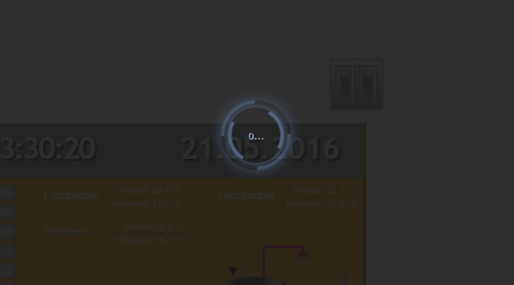

# Visualisierung der nächsten Generation für ioBroker: vis-2
WEB-Visualisierung für die ioBroker-Plattform.

## Übersicht
- [Lizenzanforderungen](#Lizenzanforderungen)
- [Installation und Dokumentation](#installation--documentation)
- [Bindungen von Objekten](#bindings-of-objects)
- [Filter](#filters)
- [Bedienschnittstelle](#control-interface)
- [Standardansicht](#default-view)
- [Berechtigungssystem](#permissions-system)
- [Einstellungen](#settings)
- [SVG und aktuelle Farbe](#svg-and-currentcolor)

## Installation und Dokumentation
 

[Online Demos](https://iobroker.click/)

## Bindungen von Objekten
Normalerweise haben die meisten Widgets ein ObjectID-Attribut und dieses Attribut kann mit einem Wert einer Objekt-ID verknüpft werden.
Es gibt jedoch eine andere Möglichkeit, *jedes* Attribut eines Widgets an eine ObjectID zu binden.

Schreiben Sie einfach in das Attribut `{object.id}` z. B. `{hm-rpc.0.OEQ1880105.4.ACTUAL_TEMPERATURE}` und es wird an den Wert dieses Objekts gebunden.
Wenn Sie das spezielle Format verwenden, können Sie damit sogar einige einfache Operationen durchführen, z. B. Multiplizieren oder Formatieren.

So berechnen Sie beispielsweise die Hypothenuse eines Dreiecks:

`{h:javascript.0.myCustom.height;w:javascript.0.myCustom.width;Math.max(20, Math.sqrt(h*h + w*w))}` wird als Funktion interpretiert:

```js
value = await (async function () {
    var h = (await getState('javascript.0.myCustom.height')).val;
    var w = (await getState('javascript.0.myCustom.width')).val;
    return Math.max(20, Math.sqrt(h * h + w * w));
})();
```

oder

`{h:javascript.0.myCustom.height;w:javascript.0.myCustom.width;h*w}` multipliziert einfach Höhe mit Breite.

Sie können *alle* JavaScript-Funktionen (Browserfunktionen) verwenden. Argumente müssen mit ':' definiert werden, andernfalls werden sie als Formel interpretiert.

Achten Sie auf die Typen. Alle sind als Zeichenfolgen definiert. Um sicherzugehen, dass der Wert als Zahl behandelt wird, verwenden Sie die Funktion parseFloat.

Unsere Hypothenuse-Berechnung sieht also wie folgt aus:

```js
{h:javascript.0.myCustom.height;w:javascript.0.myCustom.width;Math.max(20, Math.sqrt(Math.pow(parseFloat(h), 2) + Math.pow(parseFloat(w), 2)))}
```

### Veraltetes Format
Patten hat das folgende Format:

```js
{objectID;operation1;operation2;...}
```

Die folgenden Vorgänge werden unterstützt:

- `*` - Multiplikation. Das Argument muss in Klammern stehen, z. B. "*(4)". In diesem Beispiel multiplizieren wir den Wert mit 4.
- `+` - addieren. Das Argument muss in Klammern stehen, z. B. "+(4,5)". In diesem Beispiel addieren wir zum Wert 4,5.
- `-` - Subtrahieren. Das Argument muss in Klammern stehen, z. B. "-(-674,5)". In diesem Beispiel subtrahieren wir vom Wert -674,5.
- `/` - Dividieren. Das Argument muss in Klammern stehen, z. B. "/(0,5)". In diesem Beispiel dividieren wir den Wert durch 0,5.
- `%` - Modulo. Das Argument muss in Klammern stehen, z. B. "%(5)". In diesem Beispiel nehmen wir Modulo von 5.
- „round“ – rundet den Wert.
- `round(N)` - rundet den Wert mit N Stellen nach dem Komma, zB 34.678;round(1) => 34.7
- „hex“ – Wert in Hexadezimalwert umwandeln. Alle Buchstaben werden klein geschrieben.
- `hex2` - Wert in Hexadezimalwert umwandeln. Alle Buchstaben werden klein geschrieben. Wenn der Wert kleiner als 16 ist, wird die führende Null hinzugefügt.
- „HEX“ – dasselbe wie Hex, aber in Großbuchstaben.
- „HEX2“ – dasselbe wie Hex2, aber in Großbuchstaben.
- `date` – Datum entsprechend dem angegebenen Format formatieren. Das Format ist dasselbe wie in [iobroker.javascript](https://github.com/iobroker/iobroker.javascript/blob/master/README.md#formatdate)
- `min(N)` - wenn der Wert kleiner als N ist, nimm N, sonst den Wert
- `max(M)` - wenn der Wert größer als M ist, nimm M, sonst den Wert
- `sqrt` - Quadratwurzel
- `pow(n)` – Potenz von N.
- „pow“ – Potenz von 2.
- `Boden` - Math.floor
- `ceil` - Math.ceil
- `json` – Operation zum Abrufen von JSON- oder Objekteigenschaft. Beispiel: `{id;json(common.name.en)}`
- `random(R)` - Math.random() * R oder nur Math.random(), wenn kein Argument vorhanden ist
- „formatValue(decimals)“ – Wert entsprechend den Systemeinstellungen formatieren und Dezimalstellen verwenden
- `date(format)` - Wert als Datum formatieren. Das Format ist etwa: "JJJJ-MM-TT hh:mm:ss.sss"
- `momentDate(format, useTodayOrYesterday)` - Wert mit Moment.js als Datum formatieren. [Freigegebene Formate müssen gemäß der moment.js-Bibliothek eingegeben werden](https://momentjs.com/docs/#/displaying/format/). Mit `useTodayOrYesterday=true` wird das `moment.js`-Format `ddd`/`dddd` mit today / yesterday überschrieben
- `array(element1,element2[,element3,element4])` – gibt das Element des Index zurück. Beispiel: `{id.ack;array(ack is false,ack is true)}`

Sie können dieses Muster in jedem beliebigen Text verwenden, beispielsweise

```
My calculations with {objectID1;operation1;operation2;...} are {objectID2;operation3;operation4;...}
```

oder Farbberechnungen:

```
#{objectRed;/(100);*(255);HEX2}{objectGreen;HEX2}{objectBlue;HEX2}
```

Um den Zeitstempel des Objekts anzuzeigen, schreiben Sie `.ts` oder `.lc` (für letzte Änderung) an das Ende der Objekt-ID, zum Beispiel:

```
Last change: {objectRed.lc;date(hh:mm)}
```

### Spezielle Bindungen
Es gibt eine Reihe verschiedener interner Bindungen, um zusätzliche Informationen in Ansichten bereitzustellen:

* `Benutzername` - zeigt den angemeldeten Benutzer
* „Ansicht“ – Name der aktuellen Ansicht
* `wname` - Widgetname
* `widget` – ist ein Objekt mit allen Daten des Widgets. Kann nur im JS-Teil verwendet werden, wie `{a:a;widget.data.name}`
* „widgetOid“ – verwenden Sie die OID des Widgets, um den Wert des Widgets im Zuweisungsabschnitt zuzuweisen, z. B. „{t:widgetOid.val;t}“
* `wid` – Name des aktuellen Widgets
* „Sprache“ – kann „de“, „en“ oder „ru“ sein.
* `Instanz` – Browserinstanz
* „Anmelden“ – ob eine Anmeldung erforderlich ist oder nicht (z. B. um die Schaltfläche zum Abmelden anzuzeigen/auszublenden)
* `local_*` – wenn der Statusname von `local_` aus gestartet wird, wird er nicht an ioBroker gemeldet, sondern aktualisiert alle Widgets, die von diesem Status abhängen. (Lokale Variable für die aktuelle Browsersitzung)

Hinweis: Um in Berechnungen (z. B. in Zeichenfolgenformeln) ein „:“ zu verwenden, verwenden Sie stattdessen „::“.

**Denken Sie daran**, dass Stildefinitionen als Bindungen interpretiert werden. Verwenden Sie daher `{{style: value}}` oder einfach

```
{
	style: value
}
```

dafür.

## Filter
Um die gesamte Anzahl der Widgets in einer Ansicht zu visualisieren, können Sie Filter verwenden, um die Anzahl der gleichzeitig in der Ansicht angezeigten Widgets zu reduzieren.

Jedes Widget hat ein Feld `filter`. Wenn Sie es auf einen Wert setzen, z. B. `light`, können Sie mit dem anderen Widget `(bars - filters, filter - dropdown)` steuern, welcher Filter tatsächlich aktiv ist.

## Bedienoberfläche
Vis erstellt 3 Variablen:

- „control.instance“ – Hier sollte die Browserinstanz geschrieben werden oder „FFFFFFFF“, wenn jeder Browser gesteuert werden muss.
- `control.data` – Parameter für Befehl. Siehe spezifische Befehlsbeschreibung.
- `control.command` – Befehlsname. Das Schreiben dieser Variable löst den Befehl aus. Das bedeutet, bevor der Befehl geschrieben wird, müssen die „Instanz“ und „Daten“ mit Daten vorbereitet werden.

Befehle:

* `alert` – zeigt ein Warnfenster in vis-2 an. „control.data“ hat das folgende Format „message;title;jquery-icon“. Titel und jquery-icon sind optional. Symbolnamen finden Sie [hier](http://jqueryui.com/themeroller/). Um das Symbol „ui-icon-info“ anzuzeigen, schreiben Sie „Message;;info“.
* `changeView` – zur gewünschten Ansicht wechseln. „control.data“ muss den Namen der Ansicht haben. Sie können auch den Projektnamen als `project/view` angeben. Das Standardprojekt ist `main`.
* „Aktualisieren“ – vis-2 neu laden, beispielsweise nachdem das Projekt so geändert wurde, dass es in allen Browsern neu geladen wird.
* „Neuladen“ – dasselbe wie Aktualisieren.
* `dialog` - Dialogfenster anzeigen. Dialog muss in der Ansicht vorhanden sein. Eines von:

- `statischer - HTML - Dialog`,
- `statisch - Symbol - Dialog`,
- `Container – HTML – Ansicht im jqui-Dialog`,
- `Container – ext cmd – im jqui-Dialog anzeigen`,
- `Container – Symbol – im JQUI-Dialog anzeigen`,
- „Container – Schaltfläche – im JQUI-Dialog anzeigen“.

`control.data` muss die ID des Dialog-Widgets haben, z. B. `w00056`.

* `dialogSchließen`
* `popup` - öffnet ein neues Browserfenster. Der Link muss in `control.data` angegeben werden, z. B. http://google.com
* `playSound` - Sounddatei abspielen. Der Link zur Datei ist in `control.data` angegeben, z.B. http://www.modular-planet.de/fx/marsians/Marsiansrev.mp3.

Sie können Ihre eigene Datei in vis-2 hochladen und sie abspielen lassen, beispielsweise `/vis-2.0/main/img/myFile.mp3`.
**Wichtig** Der Browser kann kein Audio abspielen, bis der Benutzer nicht mindestens einmal auf die Seite geklickt hat. Dies ist eine Browser-Sicherheitsrichtlinie. [Hier](https://github.com/Hugo22O/chrome-autoplay) Sie können mehr lesen.

Bei einem Wechsel der Ansicht oder beim Start werden die Variablen vom vis-2 gefüllt mit

- `control.instance`: Browserinstanz und `ack=true`
- `control.data`: Projekt- und Ansichtsname in der Form `project/view`, zB `main/view` (und `ack=true`)
- `control.command`: `changedView` und `ack=true`

Sie können den JSON-String oder das Objekt in `control.command` als `{instance: 'AABBCCDD', command: 'cmd', data: 'ddd'}` schreiben. In diesem Fall werden die Instanz und die Daten aus dem JSON-Objekt übernommen.

Beispiel für Javascript-Adapter:

```js
setState('vis-2.0.control.command', { instance: '*', command: 'refresh', data: ''});
```

Wenn Sie das JSON als Zeichenfolge schreiben, stellen Sie sicher, dass es analysierbar ist, z. B. `{"instance": "*", "command": "refresh", "data": ""}`, beachten Sie das `"`.

## Standardansicht
Sie können für jede Ansicht die gewünschte Auflösung festlegen (Menü=>Tools=>Auflösung).
Dies ist nur der visuelle Rahmen im Bearbeitungsmodus, um Ihnen die Bildschirmgröße auf einem bestimmten Gerät anzuzeigen. Im Echtzeitmodus ist er nicht sichtbar und alle Widgets außerhalb des Rahmens sind sichtbar.

Zusätzlich können Sie festlegen, ob diese Ansicht als Standard für diese Auflösung verwendet werden soll.

Daher wird bei jedem Aufruf von `index.html` (ohne `#viewName`) die für diese Auflösung am besten geeignete Ansicht geöffnet.

Wenn nur eine Ansicht das Flag *„Standard“* hat, wird diese Ansicht unabhängig von Bildschirmauflösung oder -ausrichtung geöffnet.

Sie können beispielsweise zwei Ansichten „Querformat-Mobil“ und „Hochformat-Mobil“ erstellen und diese beiden Ansichten werden automatisch umgeschaltet, wenn Sie die Ausrichtung oder Bildschirmgröße ändern.

Es gibt ein Hilfs-Widget „Basic – Bildschirmauflösung“, das die tatsächliche Bildschirmauflösung und die am besten geeignete Standardansicht für diese Auflösung anzeigt.

## Berechtigungssystem
### Projekt
Im Projektverwaltungsdialog können Sie für jeden ioBroker-Benutzer die Berechtigungen `read` und `write` konfigurieren.

Das Flag `read` bedeutet, dass das Projekt für diesen Benutzer in der Runtime zugänglich ist.
Das Flag `write` bedeutet, dass das Projekt für diesen Benutzer im Bearbeitungsmodus zugänglich ist.

Wenn ein neuer Benutzer über den ioBroker-Admin-Adapter erstellt wird, verfügt er standardmäßig über beide Berechtigungen.

### Sicht
Sie können auch angeben, auf welche Ansichten der Benutzer im Laufzeit- und Bearbeitungsmodus zugreifen darf.
Wenn eines der Zugriffsrechte auf Projektebene nicht gewährt wird, hat es keine Auswirkung, es auf Ansichtsebene anzugeben, da das Projekt als Ganzes nicht zugänglich ist.

Beachten Sie, dass dem Benutzer immer das Projektauswahlfenster angezeigt wird, wenn Sie versuchen, auf eine Ansicht zuzugreifen, für die der aktuelle Benutzer keine Berechtigung hat.

### Widget
Wenn der Benutzer keine `read`-Berechtigungen hat, wird das Widget zur Laufzeit nicht gerendert. Wenn der Benutzer keine `write`-Berechtigungen hat, wird das Widget im Bearbeitungsmodus nicht gerendert.

## Einstellungen
### Neu laden, wenn der Schlaf länger als
Es gibt eine Regel, dass nach einer gewissen Zeit der Trennung die gesamte VIS-Seite neu geladen wird, um das Projekt zu synchronisieren.
Sie können dies im Menü „Einstellungen…“ konfigurieren. Wenn Sie das Intervall auf „nie“ einstellen, wird die Seite nie neu geladen.

### Wiederverbindungsintervall
Legen Sie das Intervall zwischen den Verbindungsversuchen bei Verbindungsunterbrechung fest. Wenn Sie 2 Sekunden festlegen, wird alle 2 Sekunden versucht, die Verbindung herzustellen.

### Dunkler Wiederverbindungsbildschirm
Manchmal (nachts) ist es erforderlich, den Ladebildschirm dunkel zu halten. Mit dieser Option können Sie dies einstellen.

Beachten Sie, dass diese Einstellungen nur für die erneute Verbindung und nicht für die erste Verbindung gültig sind.



## SVG und currentColor
Mit dem Schlüsselwort currentColor in CSS können Elemente die aktuelle Textfarbe von ihrem übergeordneten Element übernehmen.

Besonders nützlich kann dies bei SVGs (Scalable Vector Graphics) sein, da es eine dynamischere Gestaltung und eine einfachere Integration mit HTML-Inhalten ermöglicht.

Sie können das Schlüsselwort currentColor anstelle eines bestimmten Farbwerts für jede Eigenschaft innerhalb des SVG verwenden, die einen Farbwert akzeptiert.
Hier ist ein einfaches Beispiel mit einem Kreis in einem SVG:

```xml
<svg width="100" height="100" xmlns="http://www.w3.org/2000/svg">
    <circle cx="50" cy="50" r="40" fill="currentColor" />
</svg>
```

In diesem Fall nimmt das SVG die Farbe des übergeordneten Elements an.
Wenn es beispielsweise in einem Menü verwendet wird und das Menü rot ist, wäre der Kreis rot.

## Entwicklung und Debugging
Um Anpassungen am vis-2 Editor selbst vorzunehmen, Fehler zu suchen und zu debuggen, müssen folgende Schritte durchgeführt werden.

1. Forken Sie das Repository iobroker/iobroker.vis-2 über die Benutzeroberfläche von GitHub in Ihr eigenes Konto.

2. Klonen Sie das Repository in ein Verzeichnis. Kopieren Sie die URL aus Ihrem GitHub-Repository. Der Befehl sieht so aus

```shell
git clone https://github.com/<your profile name>/ioBroker.vis-2.git
```

3. Öffnen Sie das heruntergeladene Repository mit Ihrer IDE

4. Um alle notwendigen Bibliotheken zu installieren und herunterzuladen, führen Sie den folgenden Befehl in einem Terminal im Stammverzeichnis des Repositorys aus

```shell
npm run install-monorepo
```

5. Um den Editor im Browser zu starten, führen Sie bitte den folgenden Befehl aus.

Eine bereits separat laufende iobroker Serverinstanz muss auf Port 8082 verfügbar sein.

```shell
npm run start
```

- Debuggen ist im Browser verfügbar, z. B. Chrome F12
- Wenn Sie eine Datei ändern, wird das automatische Neuladen des Editors unterstützt

## Aufgaben
<!-- Platzhalter für die nächste Version (am Anfang der Zeile):

### **IN ARBEIT** -->

## Changelog
### 2.11.1 (2024-12-02)
* (@GermanBluefox) Corrected navigation menu
* (@GermanBluefox) Migrated widgets to React: basic - frame, basic - note, basic - logout 
* (@GermanBluefox) Added the HTML rebuild button to settings
* (@GermanBluefox) Backend was migrated to TypeScript

### 2.10.8 (2024-11-22)
* (bluefox) Added new option for view: "Limit only for instances"

### 2.10.7 (2024-07-23)
* (bluefox) Optimization of the module federation

### 2.10.6 (2024-07-20)
* (bluefox) Improved the typing in typescript

### 2.10.4 (2024-07-16)
* (bluefox) Corrected the jumping by object selection
* (bluefox) Implemented swipe widget

### 2.10.3 (2024-07-11)
* (bluefox) Converted the CanJSWidget to typescript
* (bluefox) Added "clone" button to the attribute groups

### 2.10.2 (2024-07-10)
* (bluefox) Removed incompatible package for styles
* (bluefox) All widgets must be updated
* (bluefox) The basic input value widget was migrated to ReactJS

### 2.9.64 (2024-05-23)
* (bluefox) Added possibility to clear a text field by button

### 2.9.63 (2024-05-15)
* (bluefox) Migrated some files to typescript

### 2.9.60 (2024-05-07)
* (foxriver76) test automatic release

### 2.9.53 (2024-05-06)
* (bluefox) Allowed applying styles to jQui buttons

### 2.9.52 (2024-04-25)
* (bluefox) Navigation was improved: adjustable menu width and bulk edit were added

### 2.9.50 (2024-04-19)
* (bluefox) Corrected widget in widget behavior

### 2.9.49 (2024-04-11)
* (bluefox) Corrected the scroll buttons in Tabs widget
* (bluefox) Corrected resizers if the border width is set

### 2.9.48 (2024-03-30)
* (bluefox) Showed selected view in the view dialog
* (bluefox) Added customization of loading screen
* (bluefox) Respected the sentry disable flag in GUI

### 2.9.42 (2024-03-09)
* (bluefox) Allowed limiting the view size only on desktop
* (bluefox) Change word "Filter" to "Search"

### 2.9.40 (2024-03-05)
* (bluefox) Migrated the filter widget to react
* (bluefox) Migrated the basic link widget to react

### 2.9.39 (2024-03-01)
* (foxriver76) allow to use `widgetOid` in bindings
* (foxriver76) fixed various problems with Date Picker widget
* (foxriver76) made default option of Date Picker human readable and added option for full parseable date
* (bluefox) Added the possibility to add suffix by navigation widgets
* (bluefox) Improved the license manager

### 2.9.37 (2024-02-28)
* (foxriver76) TimePicker widget now saves the time instead of date by default, if you want old behavior use checkbox `asDate`

### 2.9.36 (2024-02-27)
* (foxriver76) fixed project-specific css not being applied

### 2.9.35 (2024-02-27)
* (foxriver76) user-specified css has now priority over widgets css
* (foxriver76) fixed crash case for broken grouped widgets

### 2.9.34 (2024-02-26)
* (foxriver76) detect admin user correctly in project permissions dialog

### 2.9.33 (2024-02-21)
* (foxriver76) fixed issue that last image is never shown in image8 widget
* (foxriver76) added possibility to define background and title color for jqui dialog
* (foxriver76) make it possible to click through signal image if in front of widget

### 2.9.32 (2024-02-16)
* (foxriver76) implemented buttons to show or hide all views in views manager
* (foxriver76) fixed issue with signals on RxWidgets
* (foxriver76) allow disabling Sentry only for this instance

### 2.9.31 (2024-02-06)
* (foxriver76) apply default overflow correctly
* (foxriver76) navigation style fixes (fix an icon background and allow to customize header text color)

### 2.9.30 (2024-02-06)
* (foxriver76) global css will no longer be deleted on adapter upload/update
* (foxriver76) allowed modifying style of navigation

### 2.9.29 (2024-02-05)
* (foxriver76) fixed multiple problems with nested groups
* (foxriver76) also made group/ungroup commands working in group view
* (foxriver76) allowed selecting widgets in a group via click (previously only dropdown worked)
* (foxriver76) fixed issue, that Basic Image 8 is not configurable for value 0

### 2.9.28 (2024-02-03)
* (foxriver76) correctly determine the vis instance in all cases

### 2.9.26 (2024-02-02)
* (foxriver76) do not show empty icon category if jquery style selected for jquery button widgets
* (foxriver76) added possibility to hide navigation after selection

### 2.9.25 (2024-01-29)
* (foxriver76) fixed resizing issue for relative widgets
* (foxriver76) do not crash when using visibility "only for groups"
* (foxriver76) do not crash if a widget tries to update widget on non-existent view

### 2.9.24 (2024-01-24)
* (foxriver76) Image 8 widget ported to react

### 2.9.23 (2024-01-24)
* (foxriver76) fixed another bug due to previous versions

### 2.9.22 (2024-01-22)
* (foxriver76) try to fix problems introduced with 2.9.21

### 2.9.21 (2024-01-19)
* (foxriver76) fixed crash case when fixing widgets
* (foxriver76) fixed bug, that opacity is applied twice on image edit mode overlay

### 2.9.20 (2024-01-18)
* (foxriver76) increased timeout for project import
* (foxriver76) added permissions on widget level

### 2.9.19 (2024-01-17)
* (foxriver76) fixed issue when resizing widget from the left side
* (foxriver76) added select box to dimension attributes if multiple widgets selected

### 2.9.18 (2024-01-15)
* (foxriver76) fixed issue that old attributes value is shown in some scenarios
* (foxriver76) dedicated permission system extended to view level

### 2.9.17 (2024-01-13)
* (foxriver76) dedicated permission system on project level introduced

### 2.9.16 (2024-01-11)
* (foxriver76) use the correct fallback values for widget signals determination

### 2.9.15 (2024-01-09)
* (foxriver76) fixed issue with BulkEditor

### 2.9.14 (2024-01-09)
* (foxriver76) fixed last change y-offset for some widgets
* (foxriver76) fixed issue where JquiState did not respect data type
* (foxriver76) fixed issues with BulkEdtior (dialog not closing and other dialog showing the wrong button)
* (foxriver76) implemented workaround resize bug for https://github.com/devbookhq/splitter/issues/15

### 2.9.13 (2024-01-08)
* (foxriver76) correctly detect IDs in bindings when they contain hash character
* (foxriver76) fix crash when multiple JquiState widgets selected
* (foxriver76) prevent showing widget in a group after it is already cut out
* (foxriver76) prevent usage of widgets which are not in a group for calculating rulers on group view

### 2.9.12 (2024-01-04)
* (foxriver76) optimized copy/paste/cut in groups

### 2.9.11 (2024-01-02)
* (foxriver76) fixed bug with visibility calculation

### 2.9.10 (2024-01-02)
* (foxriver76) remove accidentally added script file, which leads to crash

### 2.9.9 (2024-01-01)
* (foxriver76) allow importing views without attribute `activeWidgets`
* (foxriver76) make BasicBulb behave more like its old version
* (foxriver76) fixed issue that data of different widget is displayed in edit mode
* (foxriver76) fixed issue that every state update is used for visibility calculation
* (bluefox) migrated jQui select, jQui Radio steps widgets to react
* (bluefox) All jQui widgets were migrated to react

### 2.9.8 (2023-12-21)
* (foxriver76) fixed bug that no labels are shown for a background
* (foxriver76) prevent short flashing of widgets with visibility condition at a page load
* (foxriver76) fixed issue on theme switch

### 2.9.7 (2023-12-19)
* (bluefox) Allowed the read-only flag for Styled/Input

### 2.9.6 (2023-12-14)
* (foxriver76) fixed issues with the BulkEditor
* (foxriver76) scripts in HTML are now added to the DOM, instead of being executed in eval
* (foxriver76) fixed issues with Bulb widget if min/max was once filled
* (foxriver76) migrated "speech2text" widget to react

### 2.9.5 (2023-12-10)
* (foxriver76) open new views at the beginning
* (foxriver76) fixed crash case if signals are used
* (foxriver76) fixed material-design-widgets helper 
* (foxriver76) update references to view in widget when view is renamed
* (bluefox) jQui Toggle icon widget was migrated to react
* (bluefox) jQui Radio widget was migrated to react
* (bluefox) jQui Radio List widget was migrated to react
* (bluefox) Corrected last-change by React widgets

### 2.9.4 (2023-12-04)
* (foxriver76) fixed issues with display width

### 2.9.3 (2023-12-03)
* (bluefox) Added the possibility to limit hard the view size
* (foxriver76) implemented simple sort mechanic for navigation
* (foxriver76) fixed import of views, which were inside a folder
* (foxriver76) fixed theme also applied in iframe
* (foxriver76) do not simply reuse widget ids when importing or copying views
* (foxriver76) implemented basic bulb widget as React widget
* (foxriver76) made script tags work in basic html widget

### 2.9.2 (2023-11-29)
* (foxriver76) fixed reactivity in custom components
* (foxriver76) fixed import for groups
* (foxriver76) after creating a group it is now pre-selected
* (foxriver76) fields are now updated when moved via keyboard

### 2.9.1 (2023-11-28)
* (foxriver76) recalculate fields after moving widgets
* (foxriver76) fixed a pasting group on other view
* (foxriver76) fixed theme also applied in iframe
* (bluefox) implemented Basic Image as React widget

### 2.9.0 (2023-11-27)
* (bluefox) implemented SVG shape and Screen Resolution widgets natively
* (bluefox) implemented Basic iFrame as React widget
* (foxriver76) only allow zip files at project import
* (foxriver76) fix overflow being overwritten
* (foxriver76) sort pages and projects alphabetically
* (foxriver76) fixed problem on saving
* (foxriver76) fixed problem with groups when `always render` is activated
* (foxriver76) allow changing color and write lowercase in a tabs component
* (foxriver76) fixed problem that navigation from a alwaysRender page is shown on different page

### 2.8.0 (2023-11-24)
* (foxriver76) sort folders alphabetically in pages view
* (foxriver76) fixed deselecting widgets with ctrl + click
* (foxriver76) fixed display issue with a switch component
* (bluefox) implemented Basic Red Number widget natively
* (foxriver76) fixed copy/clone of grouped widgets
* (foxriver76) fixed problem with open/close dialog via state

### 2.7.0 (2023-11-22)
* (foxriver76) implemented Basic Bar widget natively

### 2.6.4 (2023-11-21)
* (foxriver76) fixed typescript build

### 2.6.3 (2023-11-20)
* (foxriver76) fixed several crash cases

### 2.6.2 (2023-11-20)
* (foxriver76) fixed crash case when editing group
* (foxriver76) fixed pasting groups
* (foxriver76) fixed problem jumping cursor and removed characters while typing

### 2.6.1 (2023-11-17)
* (bluefox) Showed "file too large" message by icon upload
* (bluefox) Made navigation bar for view as an own group
* (foxriver76) sorted views alphabetically
* (foxriver76) respect uppercase/lowercase in projects toolbar
* (bluefox) Redirect `dialog` and `dialogClose` commands to widgets

### 2.6.0 (2023-11-13)
* (foxriver76) implemented select/unselect all buttons
* (foxriver76) fixed bindings not working

### 2.5.0 (2023-11-11)
* (foxriver76) allowed using real html in prepend-HTML and append-HTML (basic string widget)
* (foxriver76) fixed problem while editing groups
* (foxriver76) do not automatically format button text as uppercase
* (foxriver76) do not automatically show page names as uppercase
* (bluefox) Implemented the signal icons for React widgets
* (bluefox) Implemented the last change indication for React widgets
* (bluefox) Implemented SVG Bool widget as React Component

### 2.4.0 (2023-11-08)
* (foxriver76) fixed issues with icon selector filter when changing category
* (foxriver76) fixed problem, that only the first widget is pasted
* (bluefox) added JSON binding operator
* (bluefox) Allowed using function as filter for Object ID
* (bluefox) Implemented View bar (with no menu)

### 2.3.6 (2023-11-06)
* (foxriver76) fixed issues with binding editor on style attributes
* (foxriver76) improved performance due to optimizations on auto save

### 2.3.5 (2023-11-03)
* (foxriver76) update adapter-react to have enhanced image support in file selector
* (foxriver76) fixed color of file browser in light mode
* (foxriver76) fixed the color inputs jumping to the end of input on modifying

### 2.3.4 (2023-11-02)
* (foxriver76) fix crash when selecting multiple widgets
* (foxriver76) removed duplicate `none` entry in `border-style` dropdown
* (foxriver76) fix crash when reordering widgets

### 2.3.3 (2023-10-30)
* (foxriver76) fixed problem, that vis is not loading if a single widget has a script error
* (bluefox) added the editor for bindings
* (bluefox) background does not used if in iframe

### 2.3.2 (2023-10-14)
* (bluefox) Allowed showing only selected widgets in edit mode
* (bluefox) Corrected the visibility calculation for old (CanJS) widgets

### 2.3.1 (2023-10-13)
* (bluefox) Corrected vertical gap between relative widgets
* (bluefox) Better input of numbers with min/max in attribute dialog

### 2.3.0 (2023-09-28)
* (bluefox) jQui widgets (many of them) were improved

### 2.2.7 (2023-09-18)
* (bluefox) Improved icon selector: you can upload your own icon directly
* (bluefox) Optimized loading: do not load unused widget sets

### 2.2.6 (2023-09-17)
* (bluefox) Date binding corrected
* (bluefox) Optimized loading of widgeteria
* (bluefox) Horizontal navigation is fixed

### 2.2.5 (2023-09-12)
* (bluefox) Implemented horizontal navigation

### 2.2.4 (2023-09-04)
* (bluefox) Corrected license checking

### 2.2.2 (2023-08-16)
* (bluefox) Changed sentry settings

### 2.2.1 (2023-08-15)
* (bluefox) Added possibility to filter widgets in edit mode
* (bluefox) Added possibility to change the order of relative widgets with drag&drop

### 2.2.0 (2023-08-14)
* (bluefox) Release candidate 1

### 2.1.7 (2023-08-10)
* (bluefox) Optimized the rendering of the widgets

### 2.1.6 (2023-07-30)
* (bluefox) First beta release

### 2.1.4 (2023-07-19)
* (bluefox) Allowed to add widgets to widgets

### 2.0.36 (2023-06-21)
* (bluefox) Added widgeteria

### 2.0.29 (2023-05-17)
* (bluefox) Corrected errors

### 2.0.10 (2022-12-01)
* (bluefox) Added the file browser

### 2.0.8 (2022-11-26)
* (bluefox) Improved the error handling

### 2.0.0 (2022-10-21)
* (bluefox) Completely new visualization, but partly compatible with the previous version

## License
To use this adapter in `ioBroker` you need to accept the source code license of the adapter. The source code of this adapter is available under the CC BY-NC license.

Additionally, you need a license to use the adapter. The following license editions are available on https://iobroker.net/www/pricing 
* **Community-License: Free for private use!**: Get a free license by registering an account on [https://iobroker.net](https://iobroker.net). The license if checked online against the ioBroker license server when the vis-2 adapter is started, so an online connection at this time point is required!
* **Private use Offline-License**: For paying a small support fee, you can get rid of the required online license check on adapter startup. **Only for Private use!**
* **Commercial License**: When using Vis in a commercial environment or selling Vis as part of ioBroker packages to your customers, this license is for you. License check is also not requiring an online connection.

## License
 Copyright (c) 2021-2024 Denis Haev, https://github.com/GermanBluefox <dogafox@gmail.com>,
  
 Creative Common Attribution-NonCommercial (CC BY-NC)

 http://creativecommons.org/licenses/by-nc/4.0/


Short content:
Licensees may copy, distribute, display and perform the work and make derivative works based on it only if they give the author or licensor the credits in the manner specified by these.
Licensees may copy, distribute, display, and perform the work and make derivative works based on it only for noncommercial purposes.
(Free for non-commercial use).