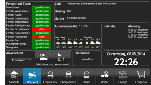

# Visualisierung der nächsten Generation für ioBroker: vis-2
WEB-Visualisierung für die ioBroker-Plattform.

## Übersicht
- [Lizenzanforderungen](#license-requirements)
- [Installation & Dokumentation](#installation--documentation)
- [Bindungen von Objekten](#bindings-of-objects)
- [Filter](#filters)
- [Steuerschnittstelle](#control-interface)
- [Standardansicht](#default-view)
- [Berechtigungssystem](#permissions-system)
- [Einstellungen](#settings)
- [SVG und aktuelle Farbe](#svg-and-currentcolor)

## Installation & Dokumentation
 

[Online-Demos](https://iobroker.click/)

## Bindungen von Objekten
Normalerweise verfügen die meisten Widgets über ein ObjectID-Attribut, das mit einem Objekt-ID-Wert verknüpft werden kann.
Es gibt jedoch eine weitere Möglichkeit, *beliebige* Widget-Attribute an eine ObjectID zu binden.

Schreiben Sie einfach in das Attribut `{object.id}`, z. B. `{hm-rpc.0.OEQ1880105.4.ACTUAL_TEMPERATURE}`, und es wird an den Wert dieses Objekts gebunden.
Wenn Sie das spezielle Format verwenden, können Sie damit sogar einige einfache Operationen durchführen, z. B. Multiplizieren oder Formatieren.

So berechnen Sie beispielsweise die Hypothenuse eines Dreiecks:

`{h:javascript.0.myCustom.height;w:javascript.0.myCustom.width;Math.max(20, Math.sqrt(h*h + w*w))}` wird als Funktion interpretiert:

```js
value = await (async function () {
    var h = (await getState('javascript.0.myCustom.height')).val;
    var w = (await getState('javascript.0.myCustom.width')).val;
    return Math.max(20, Math.sqrt(h * h + w * w));
})();
```

oder

`{h:javascript.0.myCustom.height;w:javascript.0.myCustom.width;h*w}` multipliziert einfach Höhe mit Breite.

Sie können *beliebige* JavaScript-Funktionen (Browser) verwenden. Argumente müssen mit ':' definiert werden, andernfalls werden sie als Formel interpretiert.

Achten Sie auf die Typen. Alle sind als Zeichenfolgen definiert. Um sicherzustellen, dass der Wert als Zahl behandelt wird, verwenden Sie die Funktion parseFloat.

Unsere Hypotenuse-Berechnung lautet also:

```
{h:javascript.0.myCustom.height;w:javascript.0.myCustom.width;Math.max(20, Math.sqrt(Math.pow(parseFloat(h), 2) + Math.pow(parseFloat(w), 2)))}
```

### Veraltetes Format
Patten hat das folgende Format:

```
{objectID;operation1;operation2;...}
```

Die folgenden Vorgänge werden unterstützt:

- `*` - Multiplikation. Das Argument muss in Klammern stehen, z. B. "*(4)". In diesem Beispiel multiplizieren wir den Wert mit 4.
- `+` - Addieren. Das Argument muss in Klammern stehen, z. B. "+(4,5)". In diesem Beispiel addieren wir zum Wert 4,5.
- `-` - Subtrahieren. Das Argument muss in Klammern stehen, z. B. "-(-674,5)". In diesem Beispiel subtrahieren wir vom Wert -674,5.
- `/` - Division. Das Argument muss in Klammern stehen, z. B. "/(0,5)". In diesem Beispiel dividieren wir den Wert durch 0,5.
- `%` - Modulo. Das Argument muss in Klammern stehen, z. B. "%(5)". In diesem Beispiel nehmen wir Modulo von 5.
- `round` – rundet den Wert.
- `round(N)` - rundet den Wert mit N Stellen nach dem Punkt, zB 34.678;round(1) => 34.7
- `hex` – Wert in Hexadezimalwert umwandeln. Alle Buchstaben werden klein geschrieben.
- `hex2` - konvertiert den Wert in einen Hexadezimalwert. Alle Buchstaben werden klein geschrieben. Ist der Wert kleiner als 16, wird die führende Null hinzugefügt.
- „HEX“ – dasselbe wie Hex, aber in Großbuchstaben.
- „HEX2“ – dasselbe wie Hex2, aber in Großbuchstaben.
- `date` – Datum entsprechend dem angegebenen Format formatieren. Das Format ist dasselbe wie in [iobroker.javascript](https://github.com/iobroker/iobroker.javascript/blob/master/README.md#formatdate)
- `min(N)` - wenn der Wert kleiner als N ist, wird N genommen, andernfalls der Wert
- `max(M)` - wenn der Wert größer als M ist, wird M genommen, sonst der Wert
- `sqrt` - Quadratwurzel
- `pow(n)` – Potenz von N.
- `pow` – Potenz von 2.
- `floor` - Math.floor
- `ceil` - Math.ceil
- `json` – Vorgang zum Abrufen von JSON- oder Objekteigenschaft. Z. B. `{id;json(common.name.en)}`
- `random(R)` - Math.random() * R, oder einfach Math.random(), wenn kein Argument vorhanden ist
- `formatValue(decimals)` – Wert entsprechend den Systemeinstellungen formatieren und Dezimalzahlen verwenden
- `date(format)` - Wert als Datum formatieren. Das Format ist etwa: "JJJJ-MM-TT hh:mm:ss.sss"
- `momentDate(format, useTodayOrYesterday)` - Wert mit Moment.js als Datum formatieren. [Freigegebene Formate müssen entsprechend der moment.js-Bibliothek eingegeben werden](https://momentjs.com/docs/#/displaying/format/). Mit `useTodayOrYesterday=true` wird das `moment.js`-Format `ddd`/`dddd` mit heute / gestern überschrieben
- `array(element1,element2[,element3,element4])` – gibt das Element des Index zurück. zB: `{id.ack;array(ack ist falsch,ack ist wahr)}`

Sie können dieses Muster in jedem Text verwenden, wie

```
My calculations with {objectID1;operation1;operation2;...} are {objectID2;operation3;operation4;...}
```

oder Farbberechnungen:

```
#{objectRed;/(100);*(255);HEX2}{objectGreen;HEX2}{objectBlue;HEX2}
```

Um den Zeitstempel des Objekts anzuzeigen, schreiben Sie `.ts` oder `.lc` (für die letzte Änderung) am Ende der Objekt-ID, z. B.:

```
Last change: {objectRed.lc;date(hh:mm)}
```

### Spezielle Bindungen
Es gibt eine Reihe verschiedener interner Bindungen, um zusätzliche Informationen in Ansichten bereitzustellen:

* `Benutzername` - zeigt den angemeldeten Benutzer
* `view` - Name der aktuellen Ansicht
* `wname` - Widgetname
* `widget` – ist ein Objekt mit allen Daten des Widgets. Kann nur im JS-Teil verwendet werden, wie `{a:a;widget.data.name}`
* `widgetOid` – verwenden Sie die OID des Widgets, um den Wert des Widgets im Zuweisungsabschnitt zuzuweisen, z. B. `{t:widgetOid.val;t}`
* `wid` - Name des aktuellen Widgets
* „Sprache“ – kann „de“, „en“ oder „ru“ sein.
* `Instanz` – Browserinstanz
* `login` – ob eine Anmeldung erforderlich ist oder nicht (z. B. um die Schaltfläche zum Abmelden anzuzeigen/auszublenden)
* `local_*` – Wenn der Statusname von `local_` ausgeht, wird er nicht an ioBroker gemeldet, sondern aktualisiert alle Widgets, die von diesem Status abhängen. (Lokale Variable für die aktuelle Browsersitzung)

Hinweis: Um ":" in Berechnungen (z. B. in Zeichenfolgenformeln) zu verwenden, verwenden Sie stattdessen "::".

**Denken Sie daran**, dass Stildefinitionen als Bindungen interpretiert werden. Verwenden Sie daher `{{style: value}}` oder einfach

```
{
	style: value
}
```

dafür.

## Filter
Um die gesamte Anzahl der Widgets in einer Ansicht zu visualisieren, können Sie Filter verwenden, um die Anzahl der gleichzeitig in der Ansicht angezeigten Widgets zu reduzieren.

Jedes Widget verfügt über ein Feld `filter`. Wenn Sie es auf einen Wert setzen, z. B. `light`, können Sie mit dem anderen Widget `(bars - filters, filter - dropdown)` steuern, welcher Filter tatsächlich aktiv ist.

## Steuerschnittstelle
Vis erstellt 3 Variablen:

- `control.instance` – Hier sollte die Browserinstanz geschrieben werden oder `FFFFFFFF`, wenn jeder Browser gesteuert werden muss.
- `control.data` – Parameter für den Befehl. Siehe spezifische Befehlsbeschreibung.
- `control.command` - Befehlsname. Das Schreiben dieser Variable löst den Befehl aus. Das bedeutet, bevor der Befehl geschrieben wird, müssen die "Instanz" und "Daten" mit Daten vorbereitet werden.

Befehle:

* `alert` – zeigt ein Warnfenster in vis-2 an. „control.data“ hat das Format „message;title;jquery-icon“. Titel und jquery-icon sind optional. Die Icon-Namen finden Sie [hier](http://jqueryui.com/themeroller/). Um das Icon „ui-icon-info“ anzuzeigen, schreiben Sie „Message;;info“.
* `changeView` - Wechselt zur gewünschten Ansicht. "control.data" muss den Namen der Ansicht enthalten. Sie können auch den Projektnamen als `project/view` angeben. Das Standardprojekt ist `main`.
* `refresh` – vis-2 neu laden, beispielsweise nachdem das Projekt so geändert wurde, dass es in allen Browsern neu geladen wird.
* „Neuladen“ – dasselbe wie „Aktualisieren“.
* `dialog` - Dialogfenster anzeigen. Dialog muss in der Ansicht vorhanden sein. Eines von:

- `statischer HTML-Dialog`,
- `statisch - Symbol - Dialog`,
- `Container – HTML – Ansicht im JQUI-Dialog`,
- `Container - ext cmd - Ansicht im jqui-Dialog`,
- `Container - Symbol - Im JQUI-Dialog anzeigen`,
- `Container – Schaltfläche – Im JQUI-Dialog anzeigen`.

`control.data` muss die ID des Dialog-Widgets haben, z. B. `w00056`.

* `dialogClose`
* `popup` - öffnet ein neues Browserfenster. Der Link muss in `control.data` angegeben werden, z.B. http://google.com
* `playSound` - Sounddatei abspielen. Der Link zur Datei ist in `control.data` angegeben, z.B. http://www.modular-planet.de/fx/marsians/Marsiansrev.mp3.

Sie können Ihre eigene Datei in Vis-2 hochladen und abspielen lassen, z. B. `/vis-2.0/main/img/myFile.mp3`.
**Wichtig** Der Browser kann Audio erst abspielen, wenn der Benutzer mindestens einmal auf die Seite geklickt hat. Dies ist eine Browser-Sicherheitsrichtlinie. [Hier](https://github.com/Hugo22O/chrome-autoplay) Weitere Informationen finden Sie hier.

Bei einem Wechsel der Ansicht oder beim Start werden die Variablen vom vis-2 mit

- `control.instance`: Browserinstanz und `ack=true`
- `control.data`: Projekt- und Ansichtsname in der Form `project/view`, zB `main/view` (und `ack=true`)
- `control.command`: `changedView` und `ack=true`

Sie können den JSON-String oder das JSON-Objekt in `control.command` als `{instance: 'AABBCCDD', command: 'cmd', data: 'ddd'}` schreiben. In diesem Fall werden die Instanz und die Daten aus dem JSON-Objekt übernommen.

Beispiel für Javascript-Adapter:

```js
setState('vis-2.0.control.command', { instance: '*', command: 'refresh', data: ''});
```

Wenn Sie das JSON als Zeichenfolge schreiben, stellen Sie sicher, dass es analysierbar ist, z. B. `{"instance": "*", "command": "refresh", "data": ""}`, beachten Sie das `"`.

## Standardansicht
Sie können für jede Ansicht die gewünschte Auflösung festlegen (Menü => Tools => Auflösung).
Dies ist nur der visuelle Rahmen im Bearbeitungsmodus, um Ihnen die Bildschirmgröße auf einem bestimmten Gerät anzuzeigen. Im Echtzeitmodus ist er nicht sichtbar und alle Widgets außerhalb des Rahmens sind sichtbar.

Zusätzlich können Sie festlegen, ob diese Ansicht als Standard für diese Auflösung verwendet werden soll.

Daher wird bei jedem Aufruf von `index.html` (ohne `#viewName`) die für diese Auflösung am besten geeignete Ansicht geöffnet.

Wenn nur eine Ansicht das Flag *„Standard“* hat, wird diese Ansicht unabhängig von Bildschirmauflösung oder -ausrichtung geöffnet.

Sie können beispielsweise zwei Ansichten erstellen: „Querformat-Mobil“ und „Hochformat-Mobil“. Diese beiden Ansichten werden automatisch umgeschaltet, wenn Sie die Ausrichtung oder Bildschirmgröße ändern.

Es gibt ein Hilfs-Widget „Basic – Bildschirmauflösung“, das die tatsächliche Bildschirmauflösung und die am besten geeignete Standardansicht für diese Auflösung anzeigt.

## Berechtigungssystem
### Projekt
Im Projektverwaltungsdialog können Sie für jeden ioBroker-Benutzer die Berechtigungen `read` und `write` konfigurieren.

Das Flag `read` bedeutet, dass das Projekt für diesen Benutzer in der Runtime zugänglich ist.
Das Flag `write` bedeutet, dass das Projekt für diesen Benutzer im Bearbeitungsmodus zugänglich ist.

Wenn ein neuer Benutzer über den ioBroker-Admin-Adapter erstellt wird, verfügt er standardmäßig über beide Berechtigungen.

### Sicht
Sie können auch festlegen, auf welche Ansichten der Benutzer im Laufzeit- und Bearbeitungsmodus zugreifen darf.
Wenn eines der Zugriffsrechte auf Projektebene nicht gewährt wird, hat die Angabe auf Ansichtsebene keine Auswirkungen, da das gesamte Projekt nicht zugänglich ist.

Beachten Sie, dass dem Benutzer beim Versuch, auf eine Ansicht zuzugreifen, für die er keine Berechtigung hat, stattdessen das Projektauswahlfeld angezeigt wird.

### Widget
Wenn der Benutzer nicht über die Berechtigung `read` verfügt, wird das Widget zur Laufzeit nicht gerendert. Wenn der Benutzer nicht über die Berechtigung `write` verfügt, wird das Widget im Bearbeitungsmodus nicht gerendert.

## Einstellungen
### Neu laden, wenn der Schlaf länger als
Es gibt eine Regel, dass nach einer gewissen Zeit der Verbindungsunterbrechung die gesamte VIS-Seite neu geladen wird, um das Projekt zu synchronisieren.
Sie können dies im Menü „Einstellungen…“ konfigurieren. Wenn Sie das Intervall auf „Nie“ einstellen, wird die Seite nie neu geladen.

### Wiederverbindungsintervall
Legen Sie das Intervall zwischen den Verbindungsversuchen bei Verbindungsabbruch fest. Bei einem Wert von 2 Sekunden wird alle 2 Sekunden versucht, die Verbindung herzustellen.

### Dunkler Bildschirm zum erneuten Verbinden
Manchmal (nachts) ist ein dunkler Ladebildschirm erforderlich. Mit dieser Option können Sie dies einstellen.

Beachten Sie, dass diese Einstellungen nur für die erneute Verbindung und nicht für die erste Verbindung gültig sind.


## SVG und currentColor
Das Schlüsselwort currentColor in CSS ermöglicht es Elementen, die aktuelle Textfarbe von ihrem übergeordneten Element zu übernehmen.
Es kann besonders in SVGs (Scalable Vector Graphics) nützlich sein, da es ein dynamischeres Styling und eine einfachere Integration mit HTML-Inhalten ermöglicht.

Sie können das Schlüsselwort currentColor anstelle eines bestimmten Farbwerts für jede Eigenschaft innerhalb der SVG-Datei verwenden, die einen Farbwert akzeptiert.
Hier ist ein einfaches Beispiel mit einem Kreis in einer SVG-Datei:

```xml
<svg width="100" height="100" xmlns="http://www.w3.org/2000/svg">
    <circle cx="50" cy="50" r="40" fill="currentColor" />
</svg>
```

In diesem Fall übernimmt das SVG die Farbe des übergeordneten Elements.
Beispiel: Wenn es in einem Menü verwendet wird und das Menü rot ist, ist der Kreis rot.

## Entwicklung und Debugging
Um Anpassungen am vis-2 Editor selbst vorzunehmen, Fehler zu suchen und zu debuggen, müssen folgende Schritte durchgeführt werden.

1. Forken Sie das Repository iobroker/iobroker.vis-2 über die Benutzeroberfläche von GitHub in Ihr eigenes Konto

2. Klonen Sie das Repository in ein Verzeichnis. Kopieren Sie die URL aus Ihrem GitHub-Repository. Der Befehl sieht so aus

```shell
git clone https://github.com/<your profile name>/ioBroker.vis-2.git
```

3. Öffnen Sie das heruntergeladene Repository mit Ihrer IDE

4. Um alle notwendigen Bibliotheken zu installieren und herunterzuladen, führen Sie den folgenden Befehl in einem Terminal im Stammverzeichnis des Repositorys aus

```shell
npm run install-monorepo
```

5. Um den Editor im Browser zu starten, führen Sie bitte den folgenden Befehl aus.

Eine bereits separat laufende iobroker-Serverinstanz muss auf Port 8082 verfügbar sein.

```shell
npm run start
```

- Debuggen ist im Browser verfügbar, z. B. Chrome F12
- Wenn Sie eine Datei ändern, wird das automatische Neuladen des Editors unterstützt

## Aufgaben
<!-- Platzhalter für die nächste Version (am Anfang der Zeile):

### **IN ARBEIT** -->

## Changelog
### 2.13.4 (2025-09-05)
* (@GermanBluefox) Added the basic methods for metro widgets again

### 2.13.3 (2025-08-27)
* (@GermanBluefox) Corrected loading of icon sets

### 2.13.2 (2025-08-26)
* (@GermanBluefox) Added support for older Android versions

### 2.13.1 (2025-08-25)
* (@GermanBluefox) Fixed loading of widgets on the cloud

### 2.13.0 (2025-08-24)
* (@GermanBluefox) Added possibility to define SVG icon sets from widgets sets

## License
To use this adapter in `ioBroker` you need to accept the source code license of the adapter. The source code of this adapter is available under the CC BY-NC license.

Additionally, you need a license to use the adapter. The following license editions are available on https://iobroker.net/www/pricing 
* **Community-License: Free for private use!**: Get a free license by registering an account on [https://iobroker.net](https://iobroker.net). The license if checked online against the ioBroker license server when the vis-2 adapter is started, so an online connection at this time point is required!
* **Private use Offline-License**: For paying a small support fee, you can get rid of the required online license check on adapter startup. **Only for Private use!**
* **Commercial License**: When using Vis in a commercial environment or selling Vis as part of ioBroker packages to your customers, this license is for you. License check is also not requiring an online connection.

## License
 Copyright (c) 2021-2025 Denis Haev, https://github.com/GermanBluefox <dogafox@gmail.com>,
  
 Creative Common Attribution-NonCommercial (CC BY-NC)

 http://creativecommons.org/licenses/by-nc/4.0/


Short content:
Licensees may copy, distribute, display and perform the work and make derivative works based on it only if they give the author or licensor the credits in the manner specified by these.
Licensees may copy, distribute, display, and perform the work and make derivative works based on it only for noncommercial purposes.
(Free for non-commercial use).