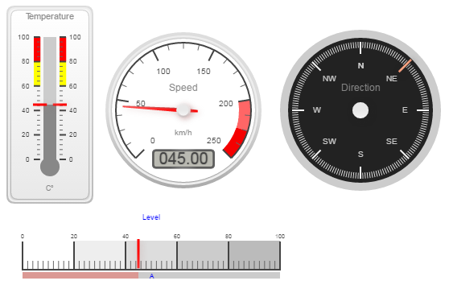

# ioBroker.vis-canvas-gauges

canvas-gauges – Canvas-Gauges für [ioBroker.vis](https://github.com/ioBroker/ioBroker.vis) und [ioBroker.vis-2](https://github.com/ioBroker/ioBroker.vis-2)

In diesem Widget-Set wird die sehr detaillierte Canvas-Bibliothek von Mikhus verwendet. Vielen Dank, Mikhus.

Eine Beschreibung der verwendeten Bibliothek finden Sie hier: <https://canvas-gauges.com>

Und [hier](https://github.com/Mikhus/canvas-gauges) auf GitHub

## vis und vis-2

Der Adapter liefert jedes Widget zweimal aus:

- **vis (vis-1)** verwendet das EJS/jQuery-Widget-Set in `widgets/canvas-gauges.html` Die
- **vis-2** verwendet das React-Widget-Set in `widgets/vis-2-widgets-canvas-gauges/`, gebaut aus `src-widgets/` Die

Beide deklarieren die gleichen Widget-IDs (`tplCGlinearGauge`, `tplCGradialGauge`, `tplCGCompas`, `tplCGflatGauge`) und dieselben Attributnamen, und vis-2 bevorzugt ein React-Widget gegenüber einem EJS-Widget. Daher funktioniert ein mit vis erstelltes Projekt auch nach dem Wechsel zu vis-2 weiterhin – die Widgets werden einfach mit der React-Implementierung gerendert, ohne jQuery.

Der Fortschrittsbalken (`tplCGprogress`) wurde für vis-2 hinzugefügt und hat kein Gegenstück im vis-1-Set.

Die React-Widgets benötigen vis-2 Version 2.12.8 oder neuer. Bei älteren vis-2-Versionen werden die EJS-Widgets verwendet.

## Dokumentation

Alle Widgets mit ihren Einstellungen und Screenshots: [Englisch](/#/docs/adapterref/iobroker.vis-canvas-gauges/docs/en/README.md) | [Deutsch](https://github.com/ioBroker/ioBroker.vis-canvas-gauges/blob/master/docs/de/README.md)

<!--
	Placeholder for the next version (at the beginning of the line):
	### **WORK IN PROGRESS**
-->

## Changelog
### **WORK IN PROGRESS**
* (bluefox) All four widgets were ported to vis-2 as React widgets, without jQuery
* (bluefox) Added the widget "Progress" - a plain bar for a battery, a tank or a humidity (vis-2 only)
* (bluefox) The widgets follow the dark theme of vis-2: plate, scale, texts, rings and the track of the bar adapt, while the needle and the colour of the bar keep their meaning. Widgets placed before this version keep their look
* (bluefox) Added the settings of the library that the vis-1 widgets never offered: section width and section ends of the highlights, exact ticks, numbers margin, stroke colour of the ticks, width of the value box and the shadow of the bar
* (bluefox) The vis-2 palette shows a sharp preview and a short description for every widget
* (bluefox) Added documentation for every vis-2 widget with screenshots (English and German)
* (bluefox) The labels of the widget settings are translated properly now, in eleven languages
* (bluefox) "Padding" of the bar ticks is applied to the ticks now instead of the round end of the bar
* (bluefox) "Value weight" changes the weight of the value now instead of the font family of the scale
* (bluefox) The scale keeps its last label if the step does not divide the range without a rounding error
* (bluefox) A state that has no value yet when the view opens is subscribed now, so the gauge follows it
* (bluefox) "Major ticks" is a text field in every widget now, so a list of labels can be used everywhere
* (bluefox) The default needle type of the radial gauge is "arrow" instead of the unused word "select"
* (bluefox) Removed the vis dependency and replaced it with a message by installation or update if neither vis nor vis-2 is installed

### 1.0.1 (2022-09-05)
* (oweitman) Added workaround for firefox canvas problem

### 0.1.5 (2016-11-24)
* (bluefox) do not scan DOM at start

### 0.1.4 (2016-11-18)
* (bluefox) fix destroy of widgets

### 0.1.3 (2016-10-06)
* (bluefox) fix highlights if min not zero

### 0.1.2 (2016-09-30)
* (bluefox) translate english

### 0.1.0 (2016-09-26)
* (bluefox) initial checkin

## License
 Copyright (c) 2016-2026 bluefox https://github.com/GermanBluefox
 MIT