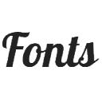
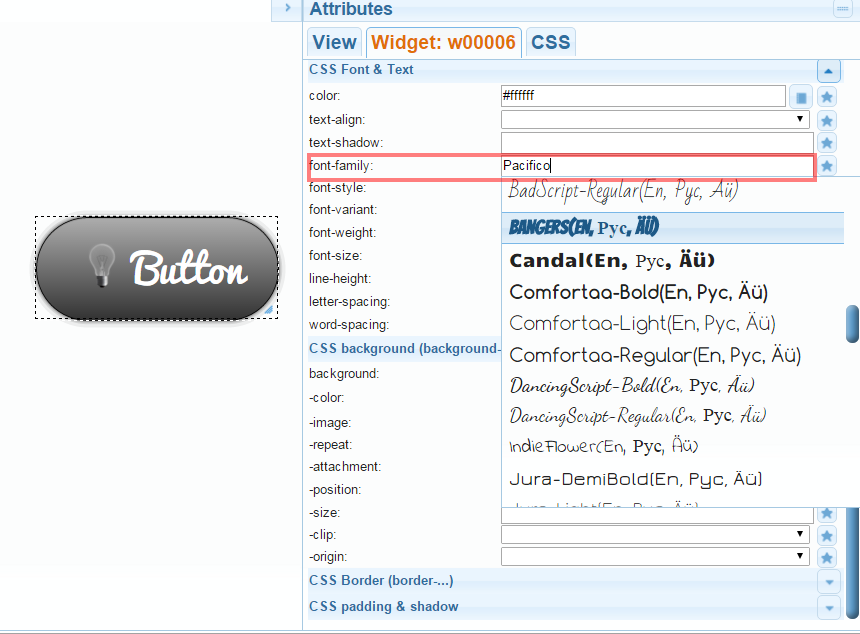
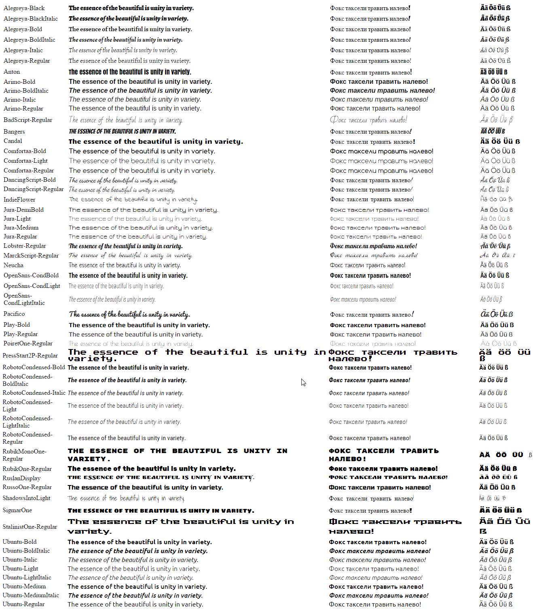

#ioBroker.vis-google-fonts
Zusätzliche Schriftarten für ioBroker.vis

## Verwendungszweck
Installieren Sie Schriftarten und verwenden Sie das Feld **CSS->font-family**.

Schriftarten: 

Erweitern Sie iobroker.vis mit Google Fonts: https://www.google.com/fonts

Folgende Schriftarten werden eingebunden:

- Alegreya - von Juan Pablo del Peral (juan@huertatipografica.com.ar)
- Anton - von Vernon Adams (vern@newtypography.co.uk)
- Arimo - von Apache 2.0
- BadScript - von Cyreal (www.cyreal.org)
- Bangers - von Vernon Adams (vern@newtypography.co.uk)
- Candal - von Vernon Adams (vern@newtypography.co.uk)
- Comfortaa - von Johan Aakerlund (aajohan@gmail.com)
- DancingScript - von Pablo Impallari (www.impallari.com|impallari@gmail.com) und Igino Marini. (www.ikern.com|mail@iginomarini.com)
- IndieFlower - von Kimberly Geswein (kimberlygeswein.com)
- Jura - von Daniel Johnson (<il.basso.buffo@gmail.com>)
- Hummer - von Pablo Impallari (www.impallari.com|impallari@gmail.com) und Alexei Vanyashin (www.cyreal.org|a@cyreal.org)
- MarckScript - von Denis Masharov <denis.masharov@gmail.com> & Marck Fogel
- Neucha - von Jovanny Lemonad (http://www.jovanny.ru)
- OpenSans-Condensed - Apache 2.0
- Pacifico - von Vernon Adams (vern@newtypography.co.uk)
- Spielen - von Jonas Hecksher, Playtypes, e-types AS (e-types.com)
- PoiretOne - von Denis Masharov (denis.masharov@gmail.com)
- PressStart2P - von Cody "CodeMan38" Boisclair (cody@zone38.net)
- RobotoCondensed - Apache 2.0
- RubikMonoOne - von Hubert und Fischer, Philipp Hubert (philipp@hubertfischer.com), Sebastian Fischer (sebastian@hubertfischer.com)
- RubikOne-Regular - von Hubert und Fischer, Philipp Hubert (philipp@hubertfischer.com), Sebastian Fischer (sebastian@hubertfischer.com)
- RuslanDisplay - von Denis Masharov <denis.masharov@gmail.com>
- RussoOne-Regular - von Jovanny Lemonad (jovanny.ru)
- ShadowsIntoLight - von Kimberly Geswein (kimberlygeswein.com)
- SigmarOne - von Vernon Adams (vern@newtypography.co.uk)
- StalinistOne - von Alexey Maslov, Jovanny Lemonad (lemonad@jovanny.ru)
- Ubuntu - UBUNTU SCHRIFTARTLIZENZ Version 1.0

<!-- Platzhalter für die nächste Version (am Zeilenanfang):

### __ARBEITEN IN PROGRESS__ -->

## Changelog
### 1.0.3 (2021-11-11)
* (bluefox) Support of compact mode added

### 1.0.0 (2016-04-20)
* (bluefox) just set the version

### 0.1.0 (2015-11-05)
* (bluefox) always load google-fonts if installed

### 0.0.1 (2015-11-05)
* (bluefox) initial checkin

## License
 Apache 2.0 and SIL Open Font License 1.1
 Copyright bluefox<dogafox@gmail.com>
 
 Copyright (c) 2011, Juan Pablo del Peral (juan@huertatipografica.com.ar), 
 with Reserved Font Names "Alegreya" "Alegreya SC"
 
 Copyright (c) 2011, Vernon Adams (vern@newtypography.co.uk),
 with Reserved Font Name Anton.
 
 Copyright (c) 2011, Cyreal (www.cyreal.org),
 with Reserved Font Name "Bad Script".
 
 Copyright (c) 2010 by vernon adams (vern@newtypography.co.uk),
 with Reserved Font Name Bangers.
 
 Copyright (c) 2011, Vernon Adams (vern@newtypography.co.uk),
 with Reserved Font Name Candal.
 
 Copyright (c) 2010, 2011 Johan Aakerlund (aajohan@gmail.com),
 with Reserved Font Name "Comfortaa".
 
 Copyright (c) 2010, Pablo Impallari (www.impallari.com|impallari@gmail.com),
 Copyright (c) 2010, Igino Marini. (www.ikern.com|mail@iginomarini.com),
 with Reserved Font Name Dancing Script.
 
 Copyright (c) 2010, Kimberly Geswein (kimberlygeswein.com)
 
 Copyright (c) 2009, 2010, 2011 Daniel Johnson (<il.basso.buffo@gmail.com>).
 
 Copyright (c) 2010, Pablo Impallari (www.impallari.com|impallari@gmail.com),
 Copyright (c) 2010, 2011, Alexei Vanyashin (www.cyreal.org|a@cyreal.org),
 with Reserved Font Name Lobster.
 
 Copyright (c) 2011, Denis Masharov <denis.masharov@gmail.com> & Marck Fogel,
 with Reserved Font Name "Marck Script".
 
 Copyright (c) 2008-2010 by Jovanny Lemonad (http://www.jovanny.ru)
 
 Copyright (c) 2011, Vernon Adams (vern@newtypography.co.uk),
 with Reserved Font Name Pacifico.
 
 Copyright (c) 2011, Jonas Hecksher, Playtypes, e-types AS (e-types.com),
 with Reserved Font Name "Play", "Playtype", "Playtype Sans".
 
 Copyright (c) 2011, Denis Masharov (denis.masharov@gmail.com)
 
 Copyright (c) 2012, Cody "CodeMan38" Boisclair (cody@zone38.net), with Reserved Font Name "Press Start 2P"
 
 Copyright (c) 2013, 2014, Hubert and Fischer, Philipp Hubert (philipp@hubertfischer.com), Sebastian Fischer (sebastian@hubertfischer.com)
 
 Copyright (c) 2013, 2014, Hubert and Fischer, Philipp Hubert (philipp@hubertfischer.com), Sebastian Fischer (sebastian@hubertfischer.com)
 
 Copyright (c) 2010, 2011, Denis Masharov <denis.masharov@gmail.com>,
 with Reserved Font Name "Ruslan", "Ruslan Display".
 
 Copyright (c) 2011-2012, Jovanny Lemonad (jovanny.ru), with Reserved Font Name "Russo"
 
 Copyright (c) 2010, Kimberly Geswein (kimberlygeswein.com)
 
 Copyright (c) 2011, Vernon Adams (vern@newtypography.co.uk),
 with Reserved Font Name Sigmar One.
 
 Copyright (c) 2009-2011, Alexey Maslov, Jovanny Lemonad (lemonad@jovanny.ru), with Reserved Font Name 'Stalinist'