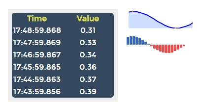

# ioBroker.vis-Historie

Widgets, die mit Verlaufsdaten arbeiten können. Dazu werden natürlich einige der History-Adapter benötigt: SQL, History oder Influx (oder etwas anderes).

Sparklines können aufgrund der Aggregation nur für nicht-binäre Daten angezeigt werden.

Für die Sparklines wird das [jQuery-Plugin](http://omnipotent.net/jquery.sparkline/) verwendet, das von Gareth Watts geschrieben und unter der New BSD License veröffentlicht wurde.

## Changelog

### 1.0.0 (2019-10-01)
- (bluefox) update table too if the value has been only updated 

### 0.2.7 (2017-05-29)
- (Apollon77) small fixes on Title (http://forum.iobroker.net/viewtopic.php?f=23&t=3111&start=20#p68971) and getHistory parameters

### 0.2.6 (2017-03-02)
- (bluefox) small fix for empty values

### 0.2.5 (2017-01-13)
- (bluefox) make http links "clickable" in the list

### 0.2.4 (2016-10-09)
- (bluefox) support of new custom schema

### 0.2.3 (2016-09-22)
- (bluefox) fixed JS error

### 0.2.2 (2016-08-22)
- (bluefox) add units and suffix

### 0.2.1 (2016-07-09)
- (bluefox) typo

### 0.2.0 (2016-07-09)
- (bluefox) fix max line settings
- (bluefox) add 'none' time selector

### 0.1.1 (2016-06-13)
- (bluefox) change default style to vis-style-green-gray

### 0.1.0 (2016-06-13)
- (bluefox) initial checkin

## License
 Copyright (c) 2016 bluefox
 BSD-3-Clause