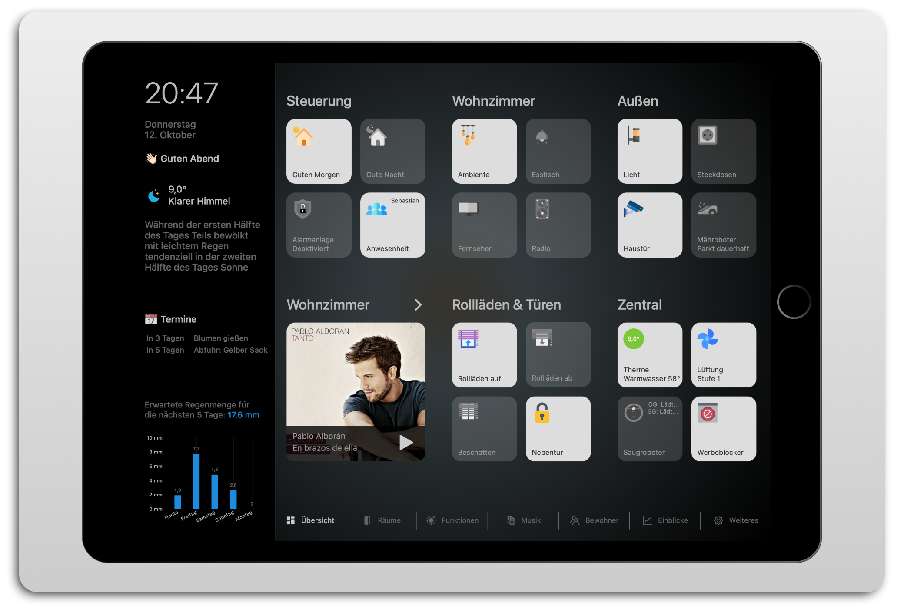

# IoBroker.vis-homekittiles

**Tests:** 

## HomeKit-Kacheln für ioBroker-VIS
Homekit Tiles ist ein Widget-Set, das auf dem Design von Apple HomeKit basiert.
Das Besondere an den Widgets ist, dass sie keine festen Stilelemente enthalten, sondern alles per CSS formatiert ist. Dadurch gibt es im VIS-Editor keine gesonderten Einstellungen für die Position und/oder Größe der Icons, Beschriftungen etc. Das Design wird durch Änderung des CSS-Codes angepasst. Hierzu kann der CSS-Code aus der Datei `/widgets/homekittiles/css/style.css` als Vorlage verwendet werden. Der Code wird im VIS-Editor in den CSS-Tab eingefügt und kann nach Wunsch angepasst werden. Es ist auch möglich, eigene CSS-Klassen über den VIS-Editor im Bereich „Allgemein“ der Widgets hinzuzufügen.

Die Widgets sind für VIS 1.x konzipiert.

**Hinweis:** Aus Lizenzgründen sind diesem Adapter keine Symbole beigefügt. Sehr gute Quellen für Icons sind:

* [https://www.flaticon.com](https://www.flaticon.com)
* [https://icons8.com](https://icons8.com)

[🇩🇪 Dokumentation](doc/homekittiles-de.md) [🇺🇸 Dokumentation](doc/homekittiles-en.md)

## Dinge die zu tun sind
* Eigene Signalbilder für Kacheln
* Mini-Mediaplayer
* Thermostat
* Wählen
* Untermenü-Button
* CSS: Farben des Dialogfensters schön gestalten
* CSS: Farben des Datumsauswahlfensters schön gestalten

## Changelog
<!--
    Placeholder for the next version (at the beginning of the line):
    ### **WORK IN PROGRESS**
-->
### **WORK IN PROGRESS**

* (Standarduser) added Object ID for Active State for View in Widget Dialog tile and Value tile
* (Standarduser) repaired Increment function

### 0.0.9 (2024-02-02)

* (Standarduser) corrected block operation. ATTENTION! You may have to delete and reinsert your widgets, if you used a different Object ID for blocking operation! Of cause only these widgets, where you used this function ;)
* (Standarduser) corrected formatValue function

### 0.0.7 (2023-12-26)

* (Standarduser) CSS adjustments
* (Standarduser) changed block operation to old variant
* (Standarduser) corrected value formatting in label groups

### 0.0.6 (2023-11-10)

* (Standarduser) just some cleanup

### 0.0.5 (2023-11-04)

* (Standarduser) fixed: adjustment of decimals in labelgroup 1 & 2
* (Standarduser) fixed: readme
* (Standarduser) not fixed: increment not working properbly

### 0.0.4 (2023-11-01)

* (Standarduser) fixed: some corrections on CSS code
* (Standarduser) fixed: widget description text
* (Standarduser) fixed: wrong placement if dialog-height had a unit (ViewInWidget-Dialog)
* (Standarduser) fixed: increment buttons on tiles were working insuficient
* (Standarduser) added: variable number of digits at value-tile
* (Standarduser) added: slider for ViewInWidget-Swipe
* (Standarduser) added: ability to manipulate values in label-groups

### 0.0.2 (2023-10-14)

* (Standarduser) initial release

## License

MIT License

Copyright (c) 2024 Standarduser

Permission is hereby granted, free of charge, to any person obtaining a copy
of this software and associated documentation files (the "Software"), to deal
in the Software without restriction, including without limitation the rights
to use, copy, modify, merge, publish, distribute, sublicense, and/or sell
copies of the Software, and to permit persons to whom the Software is
furnished to do so, subject to the following conditions:

The above copyright notice and this permission notice shall be included in all
copies or substantial portions of the Software.

THE SOFTWARE IS PROVIDED "AS IS", WITHOUT WARRANTY OF ANY KIND, EXPRESS OR
IMPLIED, INCLUDING BUT NOT LIMITED TO THE WARRANTIES OF MERCHANTABILITY,
FITNESS FOR A PARTICULAR PURPOSE AND NONINFRINGEMENT. IN NO EVENT SHALL THE
AUTHORS OR COPYRIGHT HOLDERS BE LIABLE FOR ANY CLAIM, DAMAGES OR OTHER
LIABILITY, WHETHER IN AN ACTION OF CONTRACT, TORT OR OTHERWISE, ARISING FROM,
OUT OF OR IN CONNECTION WITH THE SOFTWARE OR THE USE OR OTHER DEALINGS IN THE
SOFTWARE.