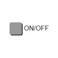

# IoBroker.vis-inventwo
## Widgets für den ioBroker.vis-Adapter
Schalter, Slider, Tabellen, Regler, Checkboxen, Radiobuttons und mehr...<br> Mit unserem Widgets-Set hast du die freie Wahl individuelle Visualisierungen ganz einfach für dein Smart-Home zu erstellen.


Analoguhren [Weitere Informationen](https://github.com/inventwo/ioBroker.vis-inventwo/wiki/Universal-%26-Multi-Widget-Inhaltstypen)


Digitaluhren [Weitere Informationen](https://github.com/inventwo/ioBroker.vis-inventwo/wiki/Universal-%26-Multi-Widget-Inhaltstypen)


###### .. ab v 2.0.0
<table><tr><td><center><b>Universal<br></b><br></td><td><center> <b>Multi<br></b><br></td><td><center> <b>Bild<br></b><br></td><td><center> <b>Tabelle<br></b> <br></td></tr><tr><td colspan=4></td></tr><tr><td><center><b>Aufführen<br></b><br></td><td><center> <b>Festzelt<br></b><br></td><td><center> <b>Radio knopf<br></b><br></td><td><center> <b>Schieberegler<br> vertikal</b> <br></td></tr><tr><td colspan=4></td></tr><tr><td><center> <b>Schieberegler<br> horizontal</b><br></td><td><center> <b>Farbschieber<br> horizontal</b><br></td><td><center> <b>Farbschieber<br> horizontal</b><br></td><td><center> <b>Kippschalter<br></b> <br></td></tr><tr><td colspan=4></td></tr><tr><td><center> <b>Basisschalter<br></b><br></td><td><center> <b>Kontrollkästchen/<br> Radio knopf</b><br></td></tr></table>

Mit Hilfe unserer Widgets lassen sich folgende Projekte verwirklichen. Zur Zeit befinden sich in unserem Adapter NUR die reinen Schaltflächen (siehe oben). Uhr und Wetter stammen aus anderen Adaptern und müssen ggf. zusätzlich installiert werden.


---

##Unterstützung
Falls Dir unsere Arbeit gefällt und Du uns unterstützen möchtest, wir freuen uns über jede Spende.

(Dieser Link führt zu unserem PayPal-Konto und steht in keiner Verbindung zum ioBroker)

[](https://www.paypal.com/donate?hosted_button_id=7W6M3TFZ4W9LW)

---

## 3.2.8
- Radiobutton-Liste: Mehrzeilige/Mehrspaltige Darstellung möglich [#393](https://github.com/inventwo/ioBroker.vis-inventwo/issues/393)
- JSON-Tabelle: Textausrichtung für Kopfzeile hinzugefügt [#394](https://github.com/inventwo/ioBroker.vis-inventwo/issues/394)

## 3.2.7
- BEHOBEN: Popup schließt nicht bei Datenpunktwert

## 3.2.6
- JSON-Tabelle: Hintergrund pro Zeile in Abhängigkeit eines Wertes färben [#280](https://github.com/inventwo/ioBroker.vis-inventwo/issues/280)
- JSON-Tabelle: Standardsortierung einer Spalte [#286](https://github.com/inventwo/ioBroker.vis-inventwo/issues/286)
- Universal- & Multi-Widget ViewInPopUp: Scrollen der View möglich [#344](https://github.com/inventwo/ioBroker.vis-inventwo/issues/344)
- Universal- & Multi-Widget HTTP: Link kann im selben oder neuem Tab geöffnet werden [#363](https://github.com/inventwo/ioBroker.vis-inventwo/issues/363)

- BEHOBEN: JSON-Tabelle funktioniert nun auch wenn nur ein einzelnes Objekt statt Array mit Objekten im Datenpunkt steht [#319](https://github.com/inventwo/ioBroker.vis-inventwo/issues/319)
- FIXED: JSON-Tabelle: 10-stelliger Zeitstempel funktioniert nicht [#376](https://github.com/inventwo/ioBroker.vis-inventwo/issues/376)

## 3.2.5
- Bug-Fix

## 3.2.4
- Bug-Fix

## 3.2.3
- Bug-Fix

## 3.2.2
- Bug-Fix

## 3.2.1
- Problem mit aktiver Textfarbe behoben (#302)
- Problem mit Multi-Widget und unterschiedlichem Prüftyp behoben (#303)
- Problem beim Schließen mit View im PopUp behoben (#254)
- Navigationseffekte aus der Basisnavigation hinzugefügt (#304)
- Neu hinzugefügter Widget-Typ 'HTTP' für Universal- und Multi-Widget (#249)
- Sichtbare Schritte für einfachen Slider hinzugefügt

## 3.2.0
- Textfarbe aktiv/inaktiv für Universal- & Multiwidget
- Colorslider CIE Wert mit eckigen Klammern
- Fehler behoben, dass Schattenfarbe bei Universal- & Multiwidget nicht aktualisiert wird
- JSON Tabelle: Vorangestellter und angehängeter Text

## 3.1.3
- Bug-Fix

## 3.1.2
- Bug-Fix

## 3.1.1
- Bug-Fix

## 3.1.0
- Neues Widget: Basisschalter
- Neues Widget: Checkbox/Radiobutton
- Fehlerbehebung

## 3.0.11
- Bug-Fix

## 3.0.10
- Bug-Fix

## 3.0.9
- Bug-Fix

## 3.0.8
- Bug-Fix

## 3.0.7
- Bug-Fix

## 3.0.6
- Bug-Fix

## 3.0.5
- Bug-Fix

## 3.0.4
- Bug-Fix

## 3.0.3
- Bug-Fix

## 3.0.2
- Bug-Fix

## 3.0.1
- Bug-Fix

## 3.0.0
```diff
#### ACHTUNG ####
Nach dem Update sind die Icons vom Universal- und Multiwidget
nicht zu sehen, sind aber nicht weg! Damit diese wieder zu sehen sind müssen
die Widgets einmal EINZELN im Editor angeklickt werden.
```

- Beim Universal- und Multiwidget kann der Inhaltstyp geändert werden.
    - Inhaltstypen: Bild (Standard), Analoge Uhr, Digitale Uhr und HTML/Text
    - Analoge und digitale Uhr: Farbe des Ziffernblatts unter Zeiger kann frei gewählt werden, Zeitzone kann geändert werden
    - Statt dem Icon kann ein eigener Text oder ein Datenpunktwert per Binding angezeigt werden
- Vergleichsoperatoren Größer-Gelich und Kleiner-Gleich
- PopUp kann per Datenpunk geöffnet werden
- Bug-Fix:
    - Colorslider unsichtbar wenn für CIE kein Wert vorhanden ist
    - Links funktionieren nicht im Popup
    - State Rückmeldedauer funktioniert nicht richtig

## 2.9.7
- Bug-Fix

## 2.9.6
- Bug-Fix

## 2.9.5
- Bug-Fix

## 2.9.4
- Bug-Fix

## 2.9.3
- Fehler mit PopUp behoben: Klick zum Schließen wurde direkt nach Öffnen registriert und Klick löste Buttons hinter dem PopUp aus
- Zustände wurden bei View in PopUp nicht richtig angezeigt

## 2.9.2
- Problem mit Datenpunkt zum Schließen des Popups behoben. ACHTUNG! Der Datenpunkt muss erneut ausgewählt werden

## 2.9.1
- Bug-Fix

## 2.9.0
- Multi-Widget-Status kann unabhängig vom Widget-Typ nach Datenpunkten oder Ansichten prüfen
- Optionen zum automatischen Schließen des Popups hinzugefügt
- Fehlerbehebung

## 2.8.3
- Bug-Fix

## 2.8.2
- Problem mit Colorslider behoben: Wert wird nicht in Datenpunkt gesetzt, wenn "Wert bei Freigabe aktualisieren" aktiviert ist,

## 2.8.1
- Fehler behoben: Color Slider RGB aktualisiert bei Dp Änderung nicht (WICHTIG: Datenpunkte müssen neu ausgewählt werden!)

## 2.8.0
- View in PopUp Option für Universal- und Multi-Widget hinzugefügt
- Bug-Fix

## 2.7.11
- Bug-Fix

## 2.7.10
- Problem mit Bildern im Universal und Multi Widget behoben
- Problem mit Bildwechsel im Universal und Multi Widget behoben

## 2.7.9
- Option für die Bildgröße für das Image-Widget hinzugefügt
- Fehler von vorheriger Version behoben

## 2.7.8
- Problem mit Textausrichtung behoben
- Problem mit Bildgröße im Image-Widget behoben

## 2.7.7
- Problem mit der Bildgröße behoben
- Problem mit dem Farbregler behoben, dass der Wert beim Loslassen nicht gespeichert wurde

## 2.7.6
- Problem mit Symbolfarbe für Navi-Widget behoben
- Problem mit Hervorhebung auf Touch-Geräten behoben
- Problem mit Radiobutton-Widget und Datentyp Zahlen behobenn

## 2.7.5
- JSON Tabelle farbliche Grenzen für Zahlen
- Fehler beim Slider behoben wenn ungültiger Wert im Datenpunkt steht
- Fehler behoben: Signalbilder wurden mit eingefärbt
- Option um Bildfarbe zu invertieren eingefügt, um Farbfilter zu umgehen
- Color Slider kann nun zwischen HEX, RGB und CIE unterscheiden

## 2.7.4
- Fehlende Übersetzung für Hover-Farben hinzugefügt

## 2.7.3
- Fehler beim Multi-State und mehreren behobenen Zuständen
- Schatten und Rand Hover für Buttons hinzugefügt

## 2.7.2
- Fehler im Radiobutton mit Bildfarbe behoben
- Fehler behoben: Doppeltes klicken bei State mit Verweildauer
- Hovereffekt für Buttons eingefügt
- Problem mit der Anzeige des Sliderwerts behoben
- Slidertext anhängen möglich

## 2.7.1
- Bug-Fix

## 2.7.0
- Neues Widget: Farbslider
- JSON Tabelle Spaltenformat boolean und Zahl
- JSON Tabelle Kopfzeile kann fixiert werden
- JSON Tabelle Fehler beim Sortieren behoben
- JSON Tabelle konfigurierbare Dummyzeile wenn JSON leer ist
- Fehler behoben

## 2.6.0
- Universal- & Multi-Widget Vergleichsoperatoren gleich, größer, kleiner und nicht hinzugefügt
- Slider Min/Max invertieren
- Slider Wert erst beim loslassen setzen
- Widget um den Wert zu erhöhen oder zu reduzieren
- JSON Tabelle Fehler mit Datum behoben

. JSON Tabellenanzeige von Millisekunden möglich

- JSON Tabelle Platzhalter wenn Eintrag leer ist
- JSON Tabellenspalten können per Klick sortiert werden

## 2.5.11
- Bug-Fix

## 2.5.10
- Bug-Fix

## 2.5.9
- Der Prozess der Bildfarbfilterung wurde geändert
- Die Bildfarbe kann jetzt ein Datenpunkt sein

## 2.5.8
- Bug-Fix

## 2.5.7
- Bug-Fix

## 2.5.6
- Bug-Fix

## 2.5.5
- Bug-Fix

## 2.5.4
- Bugfix (Zustand: doppeltes senden dese Wertes bei touch)

## 2.5.3
- Grauer Kippschalter hinzugefügt

## 2.5.2
- Bug-Fix

## 2.5.1
- Bug-Fix

## 2.5.0
- Kippschalter hinzugefügt
- Bug-Fix

## 2.4.3
- Bug-Fix

## 2.4.2
- Bug-Fix

## 2.4.1
- Bug-Fix

## 2.4.0
- Randstil zur JSON-Tabelle hinzugefügt
- Farbauswahö für Icons zu allen Widgets hinzugefügt
- Fehlerbehebung

## 2.3.2
- Fehler bei der Navigation mit dem Widget 'View in Widget' behoben

## 2.3.1
- Fehler in JSON-Tabelle behoben

## 2.3.0
- Problem behoben, bei dem Schaltflächen zweimal Werte senden
- Datum / Uhrzeit und Bildformat für Tabellenzellen hinzugefügt
- Universal- und Multi-Widget-Attribute werden beim Klicken auf Widget aktualisiert

## 2.2.3
- Fehler in JSON-Tabelle behoben

## 2.2.2
- Fehler im Multi Widget behoben: Bilder und Text wechseln nicht bei Typ Navigation

## 2.2.1
- Fehler in JSON Tabelle behoben, wenn kein gültiges JSON-Objekt vorhanden ist
- Fehler in Werteliste behoben: Wert wird nicht aktualisiert

## 2.2.0
- Datenpunktwerte werden jetzt bei allen Widgets im Editor angezeigt
- Neues Widget: Marquee (Laufschrift)
- Universal und Multi State Verweildauer hinzugefügt
- Listen-Widget Abstand zwischen den Einträgen kann aufgestellt werden

## 2.1.0
- Datenpunktwerte werden im VIS Editor angezeigt!

## 2.0.1
- Übersetzungsfehler behoben
- Randfarbe behoben
- Widget-Untertitel korrigiert

## 2.0.0
- Switch, Button, Nav und Background Widget (sowie die kleinen Ausführungen) zu einem einzigen Widget hinzugefügt -> dem Universal Widget
- Multi Widget -> wie das Universal, nur dass hier auf mehrere Datenpunkte und Werte geprüft werden können (Ähnlich der Signalbild Funktion)
- Bild-Widget kann nun auf Datenpunkt prüfen
- Radiobuttons hinzugefügt
- Werteliste hinzugefügt (Kann Liste aus einem Datenpunkt oder manuell eingetragenem Text erstellen)

## 1.3.8
- Schieberschritt auf Dezimal geändert
- Problem mit numerischen Werten behoben

### 1.3.7
- Problem mit der Navigation auf Touchscreens behoben

### 1.3.6
- Set-State-Option für die Navigation hinzugefügt
- Problem mit Datenpunkten ohne Konfiguration behoben

### 1.3.5
- Aktualisierungsrate für Tabelle hinzugefügt

### 1.3.4
- Symbole und Hintergründe entfernt, Konfiguration geändert, Navigation korrigiert

### 1.3.3
- Die Wertoption für das Hintergrund-Widget wurde korrigiert

### 1.3.2
- Bug-Fix

### 1.3.1
- Farbverhalten der Navigationsschaltfläche geändert
- Neue Symbole hinzugefügt

### 1.3.0
- JSON-Tabelle hinzugefügt
- Verzögerung für Navigationen hinzugefügt
- Text in Schaltflächen kann jetzt HTML sein
- Neue Symbole hinzugefügt

### 1.2.3
- Aktive Farbe der Navigation hinzugefügt
- Feste Zustandsfarbe für Wertschalter

## 1.2.2
- Bug Fix: Schiebereglerwert, Konfig

## 1.2.1
- Fixed Slider Widget: getrennt in zwei Widgets (horizontal und vertikal)

### 1.2.0
- Bild-Widget hinzugefügt
- Slider hinzugefügt, um den Randradius für alle 4 Ecken zu ändern (Wenn diese Version ein Update für Sie ist, müssen Sie auf jede Schaltfläche im Vis-Editor klicken, um die Standardecken wiederherzustellen)
- Neue Symbole hinzugefügt

### 1.1.1
- Bug-Fix

### 1.1.0
- Slider-Widget hinzugefügt
- Option zum Spiegeln des Bildes hinzugefügt
- Neue Symbole hinzugefügt
- Schaltflächen-Widgets geändert, um standardmäßige Schriftart- und Textoptionen zu verwenden

### 1.0.0
- Deckkraft des Widget-Hintergrunds und des Inhalts, Schalter kann von boolesch auf Wert geändert werden, Symbole von weiß auf schwarz geändert, nahtlose Hintergründe hinzugefügt

### 0.1.2
- Fehlerbehebung

...

### 0.1.1
- Fehlerbehebung

...

### 0.1.0 (Erstveröffentlichung)
- erfinden zwei Design-Widgets

...

### 0.0.1
- Die Idee ist geboren

---

## Changelog

## License

Copyright (c) 2022 [jkvarel](https://github.com/jkvarel) und [skvarel](https://github.com/skvarel) von [inventwo](https://github.com/inventwo)

MIT License (nur in englisch / englisch only)

Permission is hereby granted, free of charge, to any person obtaining a copy
of this software and associated documentation files (the "Software"), to deal
in the Software without restriction, including without limitation the rights
to use, copy, modify, merge, publish, distribute, sublicense, and/or sell
copies of the Software, and to permit persons to whom the Software is
furnished to do so, subject to the following conditions:

The above copyright notice and this permission notice shall be included in all
copies or substantial portions of the Software.

THE SOFTWARE IS PROVIDED "AS IS", WITHOUT WARRANTY OF ANY KIND, EXPRESS OR
IMPLIED, INCLUDING BUT NOT LIMITED TO THE WARRANTIES OF MERCHANTABILITY,
FITNESS FOR A PARTICULAR PURPOSE AND NONINFRINGEMENT. IN NO EVENT SHALL THE
AUTHORS OR COPYRIGHT HOLDERS BE LIABLE FOR ANY CLAIM, DAMAGES OR OTHER
LIABILITY, WHETHER IN AN ACTION OF CONTRACT, TORT OR OTHERWISE, ARISING FROM,
OUT OF OR IN CONNECTION WITH THE SOFTWARE OR THE USE OR OTHER DEALINGS IN THE
SOFTWARE.

---

Icons from Icons8 https://icons8.com/