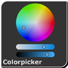

# IoBroker.vis-inventwo
## Widgets für den ioBroker.vis-Adapter
Schalter, Schieberegler, Tabellen, Bedienelemente, Kontrollkästchen, Optionsfelder und mehr...  Mit unserem Widget-Set haben Sie die Freiheit, auf einfache Weise individuelle Visualisierungen für Ihr Smart Home zu erstellen.

### Wichtiger Hinweis für Vis 2
Dieser Adapter wurde für VIS 1 entwickelt und getestet. In VIS 2 können Fehler auftreten, die die Nutzung Ihrer Visualisierung verhindern. Eine nahtlose Kompatibilität ist nicht möglich. Einen neuen Adapter für VIS 2 finden Sie hier: https://github.com/inventwo/ioBroker.vis-2-widgets-inventwo

**Ab Version 4.1.x sind die Widgets explizit vom Vis 2-Editor ausgeschlossen, und der Adapter funktioniert in Vis 2 überhaupt nicht mehr.** Wenn Sie diesen Adapter weiterhin in Vis 2 verwenden möchten, müssen Sie eine Version vor 4.1.x verwenden.

## Inhalt des Adapters
Diverse Widgets zum Umschalten, Navigieren und mehr.

Analoge Uhren [Weitere Informationen](https://github.com/inventwo/ioBroker.vis-inventwo/wiki/Universal-%26-Multi-Widget-Inhaltstypen)

Digitaluhren [Weitere Informationen](https://github.com/inventwo/ioBroker.vis-inventwo/wiki/Universal-%26-Multi-Widget-Inhaltstypen)

Farbauswahl [Weitere Informationen](https://github.com/inventwo/ioBroker.vis-inventwo/wiki/Colorpicker)

Weitere Informationen finden Sie unter [Wiki](https://github.com/inventwo/ioBroker.vis-inventwo/wiki).

###### Alle Widgets ab Version 2.0.0
<table><tr><td>
<b>Universal </b> </td><td>
 <b>Multi </b> </td><td>
 <b>Bild </b> </td><td>
 <b>Tisch </b>  </td></tr><tr><td colspan=4></td></tr><tr><td>
<b>Liste </b> </td><td>
 <b>Festzelt </b> </td><td>
 <b>Optionsfeld </b> </td><td>
 <b>Schieberegler  Vertikale</b>  </td></tr><tr><td colspan=4></td></tr><tr><td>
 <b>Schieberegler  horizontal</b> </td><td>
 <b>Farbschieberegler  horizontal</b> </td><td>
 <b>Farbschieberegler  Vertikale</b> </td><td>
 <b>Kippschalter </b>  </td></tr><tr><td colspan=4></td></tr><tr><td>
 <b>Grundlegender Schalter </b> </td><td>
 <b>Kontrollkästchen/  Optionsfeld</b> </td><td>
 <b>Farbauswahl </b> </td></tr></table>

Folgende Projekte lassen sich mithilfe unserer Widgets realisieren. Unser Adapter enthält derzeit NUR die reinen Schaltflächen (siehe oben). Uhr und Wetterinformationen stammen von anderen Adaptern und müssen gegebenenfalls zusätzlich installiert werden.

---

## Unterstützung
Wenn Ihnen unsere Arbeit gefällt und Sie uns unterstützen möchten, freuen wir uns über jede Spende.

(Dieser Link führt zu unserem PayPal-Konto und steht in keiner Verbindung zu ioBroker.)

---

## Ältere Änderungen
Kann in [CHANGELOG_OLD.md](CHANGELOG_OLD.md) gefunden werden

---

## Changelog

<!--
  Placeholder for the next version (at the beginning of the line):
  ### **WORK IN PROGRESS**
-->
### 4.1.1 (2026-06-04)
- correct z-index layering for popups — date/time picker dropdowns now appear in front of the popup overlay instead of behind it (#583)

### 4.1.0 (2026-05-17)
- Hide widgets in vis 2 editor

### 4.0.1 (2026-05-15)
- Fixed widget gif images missing

### 4.0.0 (2026-05-15)
- (copilot) Adapter requires node.js >= 22 now
- (iobroker-bot) Adapter requires node.js >= 20 now.
- Updated dependencies
- Updated project structure to meet latest ioBroker standards
- Updated build process to use latest tools and best practices

### 3.3.5
- Fixed: [#688](https://github.com/inventwo/ioBroker.vis-inventwo/issues/688) Radio button cannot write a boolean value
- Fixed: [#736](https://github.com/inventwo/ioBroker.vis-inventwo/issues/736) Adapter checker errors in package.json and io-package.json resolved
- Fixed: [#678](https://github.com/inventwo/ioBroker.vis-inventwo/issues/678) Mode in io-package changed from daemon to once

## License

MIT License

Permission is hereby granted, free of charge, to any person obtaining a copy
of this software and associated documentation files (the "Software"), to deal
in the Software without restriction, including without limitation the rights
to use, copy, modify, merge, publish, distribute, sublicense, and/or sell
copies of the Software, and to permit persons to whom the Software is
furnished to do so, subject to the following conditions:

The above copyright notice and this permission notice shall be included in all
copies or substantial portions of the Software.

THE SOFTWARE IS PROVIDED "AS IS", WITHOUT WARRANTY OF ANY KIND, EXPRESS OR
IMPLIED, INCLUDING BUT NOT LIMITED TO THE WARRANTIES OF MERCHANTABILITY,
FITNESS FOR A PARTICULAR PURPOSE AND NONINFRINGEMENT. IN NO EVENT SHALL THE
AUTHORS OR COPYRIGHT HOLDERS BE LIABLE FOR ANY CLAIM, DAMAGES OR OTHER
LIABILITY, WHETHER IN AN ACTION OF CONTRACT, TORT OR OTHERWISE, ARISING FROM,
OUT OF OR IN CONNECTION WITH THE SOFTWARE OR THE USE OR OTHER DEALINGS IN THE
SOFTWARE.

---

Icons from Icons8 https://icons8.com/

Copyright (c) 2025-2026 [jkvarel](https://github.com/jkvarel) and [skvarel](https://github.com/skvarel) from [inventwo](https://github.com/inventwo)