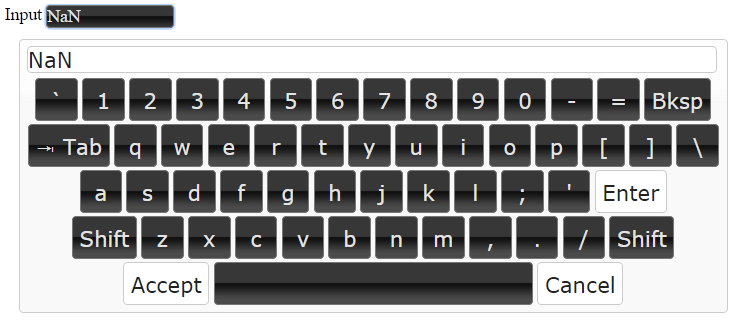

# IoBroker.vis-Tastatur

Ich habe ein sehr gutes jQuery-Plugin von Jeremy Satterfield verwendet. (Original von Jeremy Satterfield, aktualisiert und gepflegt von Rob Garrison)

github – http://github.com/Mottie/Keyboard

## Verwendung
Sie können dieses Widget in der Ansicht platzieren, und alle Widgets mit Eingabefeldern erhalten eine virtuelle Tastatur. Das Widget muss in jeder Ansicht platziert werden.

Zusätzlich können Sie der Widget-Klasse `keyboard-num` hinzufügen, um die Verwendung der numerischen Tastatur zu erzwingen, oder `keyboard-all`, um die Verwendung der Volltexttastatur zu erzwingen.

<!-- Platzhalter für die nächste Version (am Anfang der Zeile):

### **IN BEARBEITUNG** -->

## Changelog
### 0.0.3 (2025-10-30)
- (bluefox) updated packages

### 0.0.2 (2015-10-28)
- (bluefox) update plugin

### 0.0.1 (2015-10-21)
- (smiling_Jack) initial checkin

## License
 Copyright (c) 2015-2025 smiling_Jack
 MIT