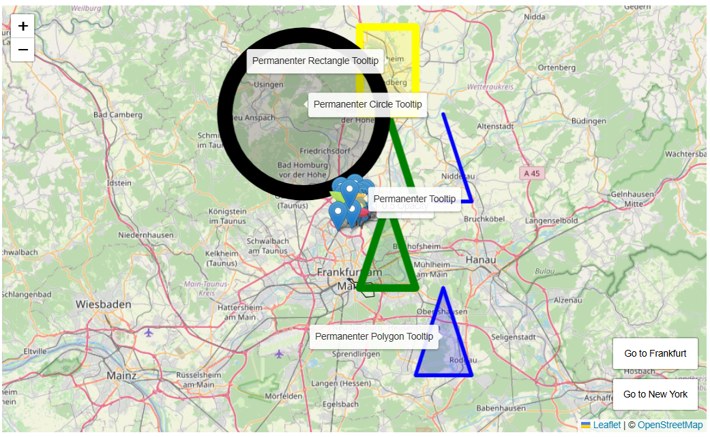
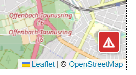
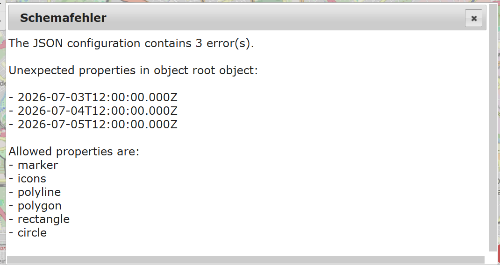

# IoBroker.mapwidgets


**Tests:** 

## Mapwidgets-Adapter für ioBroker
Mit diesem Adapter können Sie mithilfe des Leaflet-Widgets verschiedene Elemente auf einer Karte anzeigen.
Diese Elemente lassen sich über eine JSON-Datenstruktur konfigurieren.

 **Beispiel aus dem vollständigen Testbeispiel**

Aktuell werden folgende Elemente unterstützt:

- Markierungen (benutzerdefinierte Symbole können über ihre ID referenziert werden)
- Symbole
- Polylinien (z. B. für Gleise)
- Polygone (geometrische Formen)
- Rechtecke
- Kreise

Für fortgeschrittene Anwendungsfälle kann auf das Kartenobjekt über eine spezielle Variable zugegriffen und es mit JavaScript manipuliert werden.

Anwendungsbeispiele finden Sie in [Beispiele](./example/example.md)

Zusätzliche Funktionen können auf Anfrage je nach Relevanz und Machbarkeit hinzugefügt werden.

## Konfiguration
Der Adapter selbst verfügt über keine Konfigurationsoptionen.

Die Konfiguration des Widgets wird im Folgenden beschrieben.

## Vis und Widgets
Folgende Widgets existieren tatsächlich

- [`Map Leaflet`](#map-leaflet) - Zeigt Kartendaten mithilfe der Leaflet-Bibliothek <https://leafletjs.com/> an.

### Kartenblatt
Darstellung verschiedener Elemente auf einer Karte.

#### Widget-Konfiguration
| Name | Beschreibung |
| -------------------------------- | ----------------------------------------------------------------------- |
| `mapwidgets_oid` | Datenpunkt, der die Elementkonfiguration enthält |
| `mapwidgets_lon` | Längengrad des Kartenmittelpunkts |
| `mapwidgets_zoom` | Anfangszoomstufe |
| `mapwidgets_expose` | Das Kartenobjekt unter `window.iobroker.mapwidgets.<widgetID>.map` anzeigen |
| `mapwidgets_maptheme` | Farbschema der Karte: automatisch, hell oder dunkel (Standard: automatisch) |
| `mapwidgets_daynightenabled` | Tag-/Nachtmodus aktivieren |
| `mapwidgets_daynightcolor` | Rahmenfarbe für die Tag-/Nachtzone |
| `mapwidgets_daynightopacity` | Deckkraft für die Tag-/Nachtzone |
| `mapwidgets_daynightfillcolor` | Füllfarbe für die Tag-/Nachtzone |
| `mapwidgets_daynightfillopacity` | Deckkraft für die Tag-/Nachtzone füllen |
| `mapwidgets_daynightfillopacity` | Deckkraft für die Tag-/Nachtzone anpassen |

Das Farbschema der Karte ändert nur die Darstellung der OpenStreetMap-Kacheln. `auto` richtet sich nach der Browsereinstellung `prefers-color-scheme` und wird bei deren Änderung aktualisiert. `light` zeigt die Originalkacheln an, während `dark` einen Dunkelfilter anwendet. Markierungen, Pfade, Polygone und andere Leaflet-Overlays werden nicht gefiltert.

#### Kartenkonfiguration
Das Kartenobjekt besteht aus mehreren Hauptkomponenten, die alle unabhängig voneinander konfiguriert werden können:

```json
{
    "marker": [],
    "icons": {},
    "polyline": [],
    "polygon": [],
    "rectangle": [],
    "circle": []
}
```

Für weitere Testinhalte siehe auch [Beispiel\example.md](example/example.md).

Bei allen Konfigurationen gilt der Grundsatz, dass nur die unbedingt notwendige Informationsmenge zur Anzeige eines Elements benötigt wird.

Die Kartendaten werden im Bearbeitungsmodus geprüft. Eventuelle Fehler können über die Schaltfläche mit dem roten Ausrufezeichen eingesehen und überprüft werden.
Diese Schaltfläche ist nur sichtbar, wenn Fehler vorliegen.

In vis lässt sich der Dialog wie gewohnt mit einem Klick öffnen. In vis-2 verwenden Sie 2 x SHIFT + Klick.

Taste



Dialog



Die Zuordnung der einzelnen Attribute wird im Folgenden beschrieben:

##### Marker
Dies enthält ein Array von einzelnen Markerinformationsobjekten.

```json
[
    {
        "latlng": [50.182, 8.682],
        "options": {
            "title": "Default"
        },
        "popup": "<b>Default Marker</b>",
        "tooltip": "Hover me"
    },
    {
        "lat": 50.176,
        "lng": 8.69,
        "options": {
            "draggable": true,
            "title": "Draggable"
        },
        "popup": "Drag me!"
    }
]
```

Breitengrad und Längengrad sind Pflicht; alle anderen Parameter sind optional.
Es gibt zwei alternative Schreibweisen für Breitengrad und Längengrad; siehe Beispiel oben.

Bei einem benutzerdefinierten Symbol wird die eindeutige ID des Symbols als Zeichenkette angegeben (siehe die Konfiguration `icons`).

Für Tooltip und Popup siehe [Tooltip](#tooltip) und [Popup](#popup).

Detaillierte Beschreibungen der Parameter finden Sie hier:

<https://leafletjs.com/reference.html#marker>

##### Symbol
Dies enthält ein Array von Objekten mit Informationen zu einzelnen Symbolen.

```json
{
    "greenleaf": {
        "iconUrl": "/vis.0/leaf-green.png",
        "iconSize": [25, 41],
        "iconAnchor": [12, 41],
        "popupAnchor": [1, -34],
        "shadowUrl": "/vis.0/leaf-shadow.png",
        "shadowSize": [41, 41],
        "shadowAnchor": [12, 41]
    },
    "orangeleaf": {
        "iconUrl": "/vis.0/leaf-orange.png",
        "iconSize": [32, 48],
        "iconAnchor": [16, 48],
        "popupAnchor": [0, -40],
        "shadowUrl": "/vis.0/leaf-shadow.png",
        "shadowSize": [50, 50],
        "shadowAnchor": [16, 48]
    }
}
```

`iconURL` ist obligatorisch; alle anderen Parameter sind optional.

Der Schlüsselname des Symbols (im Beispiel `greenleaf`) ist case-sensitiv, muss innerhalb der Symbolgruppe eindeutig sein und wird in Markierungen als Referenz verwendet.

Zulässige Zeichen: `a–z, 0–9, _, -.`

Detaillierte Beschreibungen der Parameter finden Sie hier:

<https://leafletjs.com/reference.html#icon>

##### Polylinie / Polygon / Rechteck / Kreis
Dieses Array enthält Informationen zu einzelnen Polylinien, Polygonen, Rechtecken und Kreisen.
Das Schema ist für alle Typen identisch. Unterschiede sind unten aufgeführt.

**Polylinie:**

```json
[
    {
        "latlng": [
            [50.2, 8.7],
            [50.2, 8.8],
            [50.3, 8.75]
        ],
        "options": {
            "color": "green",
            "weight": 10
        }
    },
    {
        "latlng": [
            [50.2, 8.8],
            [50.2, 8.9],
            [50.3, 8.85]
        ],
        "options": {
            "color": "blue",
            "weight": 5
        }
    }
]
```

**Polygon:**

```json
[
    {
        "latlng": [
            [50.1, 8.7],
            [50.1, 8.8],
            [50.2, 8.75]
        ],
        "options": {
            "color": "green",
            "weight": 10
        }
    }
]
```

**Rechteck:**

```json
[
    {
        "latlng": [
            [50.3, 8.7],
            [50.4, 8.8]
        ],
        "options": {
            "color": "yellow",
            "weight": 10
        }
    }
]
```

**Kreis:**

```json
[
    {
        "latlng": [50.3, 8.6],
        "options": {
            "radius": 10000,
            "weight": 10,
            "color": "black"
        }
    }
]
```

###### `latlng`
Das Vorhandensein dieses Parameters ist für alle Typen obligatorisch.

Breitengrad und Längengrad sind immer ein Array mit 2 Elementen [Breitengrad, Längengrad], die im Folgenden als Koordinaten bezeichnet werden (Koordinate oben links und Koordinate unten rechts).

Polylinie, Polygon und Rechteck sind Koordinatenarrays. Ein Kreis besteht nur aus einer einzigen Koordinate.

Eine Polylinie muss aus mindestens 2 Elementen, ein Polygon aus mindestens 3 Elementen und ein Rechteck aus genau 2 Elementen bestehen.

###### `options`
Mit Ausnahme des Circle-Objekts ist der Parameter „options“ immer optional.
Für das Circle-Objekt ist der Parameter „radius“ obligatorisch.
Die Möglichkeit, einen separaten „radius“-Parameter auf der Ebene von Latt und Koordinaten sowie auf der Options-Ebene zu verwenden, wie in der Leaflet-Dokumentation beschrieben, ist hier nicht verfügbar.

Für Tooltip und Popup siehe [Tooltip](#tooltip) und [Popup](#popup).

Detaillierte Beschreibungen der Parameter finden Sie hier:

<https://leafletjs.com/reference.html#polyline>

<https://leafletjs.com/reference.html#polygon>

<https://leafletjs.com/reference.html#polygon>

<https://leafletjs.com/reference.html#circle>

##### Tooltip
Tooltip für Marker, Polygon, Rechteck, Kreis.

```json
[
    {
        "lat": 50.182,
        "lng": 8.682,
        "options": {
            "title": "Default"
        },
        "popup": "<b>Default Marker</b>",
        "tooltip": "Hover me"
    },
    {
        "lat": 50.171,
        "lng": 8.695,
        "options": {
            "icon": "orangeleaf",
            "draggable": true,
            "title": "Orange dot (draggable)"
        },
        "tooltip": {
            "text": "Permanent tooltip",
            "options": {
                "permanent": true,
                "offset": [0, -12]
            }
        }
    }
]
```

Ein Tooltip kann entweder als einfacher String oder als Objekt mit den Attributen „text“ und „options“ definiert werden.

Detaillierte Beschreibungen der Parameter finden Sie hier:

<https://leafletjs.com/reference.html#tooltip>

##### Popup
Popup für Marker, Polygon, Rechteck, Kreis.

```json
[
    {
        "lat": 50.182,
        "lng": 8.682,
        "options": {
            "title": "Default"
        },
        "popup": "<b>Default Marker</b>"
    },
    {
        "lat": 50.171,
        "lng": 8.695,
        "options": {
            "icon": "orangeleaf",
            "draggable": true,
            "title": "Orange dot (draggable)"
        },
        "popup": {
            "text": "Popup with offset",
            "options": {
                "offset": [0, -12]
            }
        }
    }
]
```

Ein Popup kann entweder als einfacher String oder als Objekt mit den Attributen "text" und "options" definiert werden.

Detaillierte Beschreibungen der Parameter finden Sie hier:

<https://leafletjs.com/reference.html#popup>

##### Spezielle iobroker-Optionen
Spezielle Optionen, die nur von der Leaflet-Version in ioBroker unterstützt werden, werden mithilfe des zusätzlichen Optionsobjekts „iobOptions“ implementiert.

Dieses Objekt ist nicht für alle Objekttypen gültig. Welche Optionen für welchen Objekttyp gültig sind, wird im jeweiligen Abschnitt beschrieben.

###### FitBounds
Dies gilt für die folgenden Objekttypen: Marker, Polygon, Polylinie, Rechteck, Kreis.

Das System erfasst alle Punkte der Objekte, bestimmt einen minimalen/maximalen Begrenzungsrahmen um sie herum, berechnet den passenden Zoomfaktor und zentriert und zoomt die Ansicht so, dass alle ausgewählten Objekte sichtbar sind.

**Beispiel für fitBounds mit 3 Markern:**

```json
{
    "marker": [
        {
            "latlng": [50.2, 8.7],
            "iobOptions": {
                "fitBounds": true
            }
        },
        {
            "latlng": [50.2, 8.6],
            "options": {
                "title": "Default"
            },
            "tooltip": {
                "text": "Default",
                "options": {
                    "permanent": true,
                    "direction": "top"
                }
            },
            "iobOptions": {
                "fitBounds": true
            }
        },
        {
            "latlng": [50.2, 8.8],
            "options": {
                "title": "with Custom Icon",
                "icon": "redleaf"
            },
            "tooltip": {
                "text": "with Custom Icon",
                "options": {
                    "permanent": true,
                    "direction": "bottom"
                }
            },
            "iobOptions": {
                "fitBounds": true
            }
        }
    ],
    "icons": {
        "redleaf": {
            "iconUrl": "/vis.0/leaf-red.png",
            "iconSize": [25, 41],
            "shadowUrl": "/vis.0/leaf-shadow.png",
            "shadowSize": [25, 41],
            "iconAnchor": [14, 39],
            "shadowAnchor": [3, 39],
            "popupAnchor": [50, 50]
        }
    }
}
```

### Zeitleiste des Standorts
Das **Standort-Timeline**-Widget zeigt den täglichen Standortverlauf von bis zu fünf Personen an. Sein Layout ist von der Karten- und Zeitleisteninteraktion mobiler Kartenanwendungen inspiriert, ohne jedoch ein bestimmtes Anwendungsdesign zu kopieren.

Jeder konfigurierte Tracking-Datenpunkt muss eine kombinierte WGS84-Position enthalten:

```text
50.11552,8.68417
```

Kopieren Sie zum Testen [`example/LocationTimeline/create-example-track.js`](example/LocationTimeline/create-example-track.js) in ein JavaScript-Adapterskript. Dadurch wird ein konfigurierbarer Beispieltag erstellt und die Rohpositionen in `history.0` bis `storeState` gespeichert.

Für den ausgewählten Tag im lokalen Kalender fordert das Widget nicht aggregierte Werte aus `history.0` an. Tagesgrenzen und Sommerzeitumstellungen richten sich nach der Zeitzone des Browsers. Falls für den heutigen Tag kein Verlauf verfügbar ist, wird der aktuelle Status als einzelne Markierung angezeigt. Vergangene Tage ohne Verlauf bleiben leer.

Das Widget entfernt einzelne, unplausible GPS-Sprünge und gruppiert nahe beieinander liegende Messwerte zu Aufenthalten. Die folgenden Optionen steuern diese Verarbeitung:

- **Zeitleistenlayout**: automatisch, neben der Karte oder unterhalb der Karte
- **Farbschema** (`timeline_theme`): automatisch, hell oder dunkel für die

Zeitleisten-Steuerelemente, Listen und Dialogfelder

- **Kartenfarbschema** (`mapwidgets_maptheme`): automatisch, hell oder dunkel für

nur die OpenStreetMap-Kacheln

- **Aufenthaltsradius**: Maximale Entfernung der zu einem Aufenthalt gehörenden Proben (Standardwert 75 m)
- **Mindestaufenthalt**: Mindestdauer eines Aufenthalts (standardmäßig 10 Minuten)
- **Maximal sinnvolle Geschwindigkeit**: Schwellenwert für isolierte GPS-Sprünge

(Standardwert 300 km/h; `0` deaktiviert den Filter)

Beide Farbschema-Optionen verwenden standardmäßig `auto` und folgen der Browsereinstellung `prefers-color-scheme`. Sie können unabhängig voneinander ausgewählt werden, beispielsweise um eine dunkle Zeitleistenoberfläche mit hellen Kartenkacheln zu kombinieren. Das Kartendesign filtert weder Routenlinien noch Markierungen oder andere Leaflet-Overlays.

Bekannte Orte und Ergebnisse der umgekehrten Geokodierung werden in diesen Zuständen gespeichert, die während der Adapterinstallation erstellt werden:

```text
vis-mapwidgets.0.timeline.places
vis-mapwidgets.0.timeline.geocodingCache
```

IndexedDB dient als schneller lokaler Cache. Statusänderungen werden im Hintergrund erfasst und ausgeführt. Ein abgeschlossener Aufenthalt kann als bekannter Ort mit einer bearbeitbaren Bezeichnung und einem Radius gespeichert werden.

Aufgelöste Orte werden als Name und eine kleinere Adresszeile angezeigt. Routenpfeile zeigen die Fahrtrichtung an, und sowohl Haltepunkte als auch Routenabschnitte wählen beim Anklicken den entsprechenden Zeitleisteneintrag aus.

Externes Reverse-Geocoding ist standardmäßig deaktiviert. Bei Aktivierung wird standardmäßig die öffentliche Nominatim Reverse-API verwendet. Anfragen werden dedupliziert und serialisiert, wobei zwischen den Aufrufen mindestens 1,1 Sekunden liegen. Konfigurieren Sie eine Kontakt-E-Mail-Adresse und beachten Sie die Meldung „[Nominatim-Nutzungsrichtlinie](https://operations.osmfoundation.org/policies/nominatim/)“. Die Standortkoordinaten werden an den konfigurierten externen Dienst gesendet.

### Dokumentation der Hilfsfunktionen
Unter `window.iobroker.mapwidgets` stehen folgende Funktionen zur Verfügung. Zum Beispiel:

```js
window.iobroker.mapwidgets.waitForGlobal(...)
window.iobroker.mapwidgets.loadScript(...)
window.iobroker.mapwidgets.loadCSS(...)
```

`loadScript` und `loadCSS` können verwendet werden, um JavaScript-Dateien und CSS-Stylesheets dynamisch zu laden, was für die Verwendung der Karten-Widgets erforderlich sein kann.

`waitForGlobal` kann verwendet werden, um auf eine globale Variable unter `window.` zu warten.

Dies ist notwendig, da die Kartenvariable erst verfügbar ist, nachdem das Karten-Widget von vis.js initialisiert wurde.

#### `loadScript(src, { attrs = {}, timeout = 15000 } = {})`
Lädt dynamisch eine externe JavaScript-Datei in das aktuelle Dokument.

##### Parameter loadScript
- **src** (`string`)

Die URL der zu ladenden JavaScript-Datei.

- **attrs** (`object`, optional)

Zusätzliche Attribute für das Element `<script>`. Unterstützte Schlüssel:

- `type`: z.B. `"module"`, um es als ES-Modul zu laden.
- `integrity`: Subresource Integrity (SRI)-Hash.
- `crossOrigin`: Cross-Origin-Einstellung (`"anonymous"` oder `"use-credentials"`).
- **Timeout** (`Zahl`, optional, Standardwert: `15000`)

Maximale Zeit in Millisekunden, bevor der Ladevorgang fehlschlägt.

##### Gibt loadScript zurück
- **Versprechen**

Wird aufgelöst, wenn das Skript erfolgreich geladen wurde; bei Fehlern oder Zeitüberschreitung wird eine Fehlermeldung ausgegeben.
Wenn das Skript bereits im Dokument vorhanden ist, wird `"already-loaded"` zurückgegeben.

##### Beispiel-Ladeskript
```js
loadScript('https://cdn.example.com/lib.min.js')
    .then(() => {
        console.log('Script loaded!');
    })
    .catch(console.error);
```

#### `loadCSS(href, { attrs = {}, timeout = 15000 } = {})`
Lädt dynamisch ein externes CSS-Stylesheet in das aktuelle Dokument.

##### Parameter loadCSS
- **href** (`string`)

Die URL der zu ladenden CSS-Datei.

- **attrs** (`object`, optional)

Zusätzliche Attribute für das Element `<link>`. Unterstützte Schlüssel:

- `integrity`: Subresource Integrity (SRI)-Hash.
- `crossOrigin`: Cross-Origin-Einstellung.
- `media`: Medienabfrage für bedingtes Laden

      (z. B. `"print"`, `"(min-width: 768px)"`).

- **Timeout** (`Zahl`, optional, Standardwert: `15000`)

Maximale Zeit in Millisekunden, bevor der Ladevorgang fehlschlägt.

##### Gibt loadCSS zurück
- **Versprechen**

Wird aufgelöst, wenn das Stylesheet erfolgreich geladen wurde; bei Fehlern oder Zeitüberschreitung wird eine Fehlermeldung ausgegeben.
Wenn das Stylesheet bereits im Dokument vorhanden ist, wird `"already-loaded"` zurückgegeben.

##### Beispiel loadCSS
```js
loadCSS('https://cdn.example.com/theme.css').catch(console.error);
```

#### `waitForGlobal(path, interval = 100, timeout = 0)`
Wartet darauf, dass eine globale Variable (oder eine verschachtelte Eigenschaft von `window`) verfügbar wird.

##### Parameter waitForGlobal
- **Pfad** (`string`)

Durch Punkte getrennter Pfad zur globalen Variable (z. B. `"jQuery"`, `"MyLib.utils.helper"`).

- **Intervall** (`Zahl`, optional, Standardwert: `100`)

Intervall in Millisekunden, in dem die Variable überprüft werden soll.

- **Timeout** (`Zahl`, optional, Standardwert: `0`)

Maximale Wartezeit in Millisekunden. `0` bedeutet unbegrenztes Warten.

##### Gibt waitForGlobal zurück
- **Versprechen**

Wird mit dem gefundenen Objekt aufgelöst, sobald dieses verfügbar ist.
Wird abgelehnt, wenn das Timeout erreicht wird, bevor das Objekt gefunden wurde.

##### Beispiel waitForGlobal
```html
<script>
    waitForGlobal('iobroker.mapwidgets.w00001.map', 200, 5000)
        .then(map => {
            // map is now available
        })
        .catch(err => console.error(err.message));
</script>
```

## Todo
- noch zu definieren

## Changelog

<!--
    Placeholder for the next version (at the beginning of the line):
    ### **WORK IN PROGRESS**
-->
### 0.3.3 (2026-08-11)

- remove vis dependency

### 0.3.2 (2026-08-10)

- switch support link to short link service

### 0.3.1 (2026-08-09)

- fix review problems

### 0.3.0 (2026-08-05)

- Added an independent automatic, light, or dark map color scheme to the Map
  Leaflet and Location Timeline widgets.

### 0.2.5 (2026-08-04)

- The dark theme has been adjusted to make the dialog easier to read.

Older entries are in [CHANGELOG_OLD.md](CHANGELOG_OLD.md).

## License

MIT License

Copyright (c) 2026 oweitman <oweitman@gmx.de>

Permission is hereby granted, free of charge, to any person obtaining a copy
of this software and associated documentation files (the "Software"), to deal
in the Software without restriction, including without limitation the rights
to use, copy, modify, merge, publish, distribute, sublicense, and/or sell
copies of the Software, and to permit persons to whom the Software is
furnished to do so, subject to the following conditions:

The above copyright notice and this permission notice shall be included in all
copies or substantial portions of the Software.

THE SOFTWARE IS PROVIDED "AS IS", WITHOUT WARRANTY OF ANY KIND, EXPRESS OR
IMPLIED, INCLUDING BUT NOT LIMITED TO THE WARRANTIES OF MERCHANTABILITY,
FITNESS FOR A PARTICULAR PURPOSE AND NONINFRINGEMENT. IN NO EVENT SHALL THE
AUTHORS OR COPYRIGHT HOLDERS BE LIABLE FOR ANY CLAIM, DAMAGES OR OTHER
LIABILITY, WHETHER IN AN ACTION OF CONTRACT, TORT OR OTHERWISE, ARISING FROM,
OUT OF OR IN CONNECTION WITH THE SOFTWARE OR THE USE OR OTHER DEALINGS IN THE
SOFTWARE.