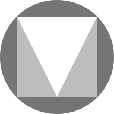 <!-- im Inhaltsverzeichnis weglassen -->


##ioBroker.vis-materialdesign
<!-- im Inhaltsverzeichnis weglassen -->

# Materialdesign-Widgets für ioBroker VIS [](https://www.paypal.com/cgi-bin/webscr?cmd=_s-xclick&hosted_button_id=VWAXSTS634G88&source=url)
ioBroker Material Design Widgets basieren auf [Richtlinien für das Materialdesign von Google](https://material.io/design/)

<br>

<!-- im Inhaltsverzeichnis weglassen -->

## Inhaltsverzeichnis
- [Allgemein](#allgemein)
- [Online-Beispielprojekt](#online-beispielprojekt)
- [Praktische Beispiele](#practice-examples)
- [Fragen und Antworten zu den Widgets](#fragen-und-antworten-zu-den-Widgets)
- [Unterstützter Browser](#supported-browser)
- [Unterstützter Browser für die Vibrationsfunktion auf Mobilgeräten](#supported-browser-for-vibrate-on-mobil-devices-function)
- [ioBroker VIS-App](#iobroker-vis-app)
- [Adaptereinstellungen](#adapter-settings)
- [Allgemein](#general-1)
- [Theme-Editor](#theme-editor)
- [Theme-Einstellungen](#theme-settings)
- [Widgets](#Widgets)
- [Materialdesign-Symbole und Bilder](#material-design-icons-and-images)
- [Editoreinstellungen](#editor-settings)
- [HTML-Eigenschaften](#html-Eigenschaften)
- [Tasten](#Tasten)
- [Navigation](#Navigation)
- [Editoreinstellungen](#editor-settings-1)
- [HTML-Eigenschaften](#html-eigenschaften-1)
- [Link](#link)
- [Editoreinstellungen](#editor-settings-2)
- [HTML-Eigenschaften](#html-Eigenschaften-2)
- [Staat](#Staat)
- [Editoreinstellungen](#editor-settings-3)
- [HTML-Eigenschaften](#html-properties-3)
- [Mehrere Staaten](#Mehrere Staaten)
- [Editoreinstellungen](#editor-settings-4)
- [HTML-Eigenschaften](#html-eigenschaften-4)
- [Zusatz](#Zusatz)
- [Editoreinstellungen](#editor-settings-5)
- [HTML-Eigenschaften](#html-eigenschaften-5)
- [Umschalten](#umschalten)
- [Editoreinstellungen](#editor-settings-6)
- [HTML-Eigenschaften](#html-eigenschaften-6)
- [Schaltflächen vertikal](#Schaltflächen-vertikal)
- [Navigation](#navigation-1)
- [Editoreinstellungen](#editor-settings-7)
- [HTML-Eigenschaften](#html-eigenschaften-7)
- [Link](#link-1)
- [Editoreinstellungen](#editor-settings-8)
- [HTML-Eigenschaften](#html-eigenschaften-8)
- [Staat](#Staat-1)
- [Editoreinstellungen](#editor-settings-9)
- [HTML-Eigenschaften](#html-properties-9)
- [Multi-State](#multi-state-1)
- [Editoreinstellungen](#editor-settings-10)
- [HTML-Eigenschaften](#html-properties-10)
- [Zusatz](#Zusatz-1)
- [Editoreinstellungen](#editor-settings-11)
- [HTML-Eigenschaften](#html-eigenschaften-11)
- [Toggle](#toggle-1)
- [Editoreinstellungen](#editor-settings-12)
- [HTML-Eigenschaften](#html-eigenschaften-12)
- [Symbolschaltflächen](#icon-schaltflächen)
- [Navigation](#navigation-2)
- [Editoreinstellungen](#editor-settings-13)
- [HTML-Eigenschaften](#html-properties-13)
- [Link](#link-2)
- [Editoreinstellungen](#editor-settings-14)
- [HTML-Eigenschaften](#html-eigenschaften-14)
- [Staat](#Staat-2)
- [Editoreinstellungen](#editor-settings-15)
- [HTML-Eigenschaften](#html-eigenschaften-15)
- [Multi-State](#multi-state-2)
- [Editoreinstellungen](#editor-settings-16)
- [HTML-Eigenschaften](#html-eigenschaften-16)
- [Zusatz](#Zusatz-2)
- [Editoreinstellungen](#editor-settings-17)
- [HTML-Eigenschaften](#html-properties-17)
- [Toggle](#toggle-2)
- [Editoreinstellungen](#editor-settings-18)
- [HTML-Eigenschaften](#html-properties-18)
- [Checkbox](#Checkbox)
- [Editoreinstellungen](#editor-settings-19)
- [HTML-Eigenschaften](#html-properties-19)
- [Schalter](#Schalter)
- [Editoreinstellungen](#editor-settings-20)
- [HTML-Eigenschaften](#html-properties-20)
- [Wert](#Wert)
- [Editoreinstellungen](#editor-settings-21)
- [HTML-Eigenschaften](#html-properties-21)
- [HTML-Karte](#html-Karte)
- [Liste](#Liste)
- [Editoreinstellungen](#editor-settings-22)
- [Daten-JSON-Eigenschaften](#data-json-properties)
- [IconList](#iconlist)
- [Editoreinstellungen](#editor-settings-23)
- [Daten-JSON-Eigenschaften](#data-json-properties-1)
- [Fortschritt](#Fortschritt)
- [Editoreinstellungen](#editor-settings-24)
- [HTML-Eigenschaften](#html-properties-22)
- [Progress Circular](#progress-circular)
- [Editoreinstellungen](#editor-settings-25)
- [HTML-Eigenschaften](#html-properties-23)
- [Schieberegler](#Schieberegler)
- [HTML-Eigenschaften](#html-properties-24)
- [Slider Round](#slider-round)
- [HTML-Eigenschaften](#html-properties-25)
- [Eingabe](#Eingabe)
- [Texteingabe](#text-eingabe)
- [Editoreinstellungen](#editor-settings-26)
- [HTML-Eigenschaften](#html-properties-26)
- [Auswählen](#auswählen)
- [Menü-JSON-Eigenschaften](#menu-json-properties)
- [HTML-Eigenschaften](#html-properties-27)
- [Autocomplete](#autocomplete)
- [Menü JSON-Eigenschaften](#menu-json-properties-1)
- [HTML-Eigenschaften](#html-properties-28)
- [Top App Bar](#top-app-bar)
- [Editoreinstellungen](#editor-settings-27)
- [Menü JSON-Eigenschaften](#menu-json-properties-2)
- [Untermenü](#Untermenü)
- [Untermenü JSON-Eigenschaften](#submenu-json-properties)
- [Charts](#Charts)
- [Balkendiagramm](#balkendiagramm)
- [Editoreinstellungen](#editor-settings-28)
- [Dataset-JSON-Eigenschaften](#dataset-json-properties)
- [Kreisdiagramm](#Kreisdiagramm)
- [Editoreinstellungen](#editor-settings-29)
- [Dataset-JSON-Eigenschaften](#dataset-json-properties-1)
- [Linienverlaufsdiagramm:](#line-history-chart)
- [Editoreinstellungen](#editor-settings-30)
- [JSON-Diagramm](#json-chart)
- [JSON-Eigenschaften](#json-Eigenschaften)
- [Tabelle](#Tabelle)
- [Editoreinstellungen](#editor-settings-31)
- [Daten - JSON-Struktur](#data---json-Struktur)
- [interne Objektbindung](#internal-object-binding)
- [Steuerelemente mit HTML-Widgets](#control-elements-using-html-widgets)
- [Control Elements - **veraltet seit v0.5.0**](#control-elements---deprecated-seit-v050)
- [Responsives Layout](#responsive-layout)
- [Mauerwerk-Ansichten](#mauerwerk-Ansichten)
- [Editoreinstellungen](#editor-settings-32)
- [Rasteransichten](#grid-views)
- [Editoreinstellungen](#editor-settings-33)
- [Benachrichtigungen](#alerts)
- [Editoreinstellungen](#editor-settings-34)
- [Datenpunkt-JSON-Eigenschaften](#datapoint-json-properties)
- [Skript: Benachrichtigung an Widget senden](#script-send-alert-to-widget)
- [Kalender](#Kalender)
- [Editoreinstellungen](#editor-settings-35)
- [Datenpunkt-JSON-Eigenschaften](#datapoint-json-properties-1)
- [Skript: ical-Konvertierung](#script-ical-conversion)
- [Dialog](#dialog)
- [Editoreinstellungen](#editor-settings-36)
- [HTML-Widgets](#html-Widgets)
- [Beispiele](#Beispiele)
- [Informationen](#Informationen)
- [verwendete Bibliotheken](#verwendete-Bibliotheken)
- [Changelog](#changelog)

# Allgemeines
##Online-Beispielprojekt
bereitgestellt von [iobroker.click](https://iobroker.click/index.html), dank bluefox und iobroker.

* <a href="https://iobroker.click/vis/index.html?Material%20Design%20Widgets" target="_blank">VIS Runtime</a> ( <a href="http://iobroker.click:8082/vis/index.html?Material%20Design%20Widgets" target="_blank">alternativ</a> )
* <a href="https://iobroker.click/vis/edit.html?Material%20Design%20Widgets" target="_blank">VIS-Editor</a> ( <a href="http://iobroker.click:8082/vis/edit.html?Material%20Design%20Widgets" target="_blank">alternativ</a> )

## Praktische Beispiele
* [Wetteransicht](https://forum.iobroker.net/topic/32232/material-design-widgets-wetter-view)
* [Skriptstatus](https://forum.iobroker.net/topic/30662/material-design-widgets-skript-status)
* [Adapterstatus](https://forum.iobroker.net/topic/30661/material-design-widgets-adapter-status)
* [UniFi Netzwerk Status](https://github.com/Scrounger/ioBroker.vis-materialdesign/tree/master/examples/UnifiNetworkState)

## Fragen und Antworten zu den Widgets
Wenn Sie Fragen zu den einzelnen Widgets haben, dann schauen Sie sich zuerst die Themen der einzelnen Widgets an

* [Deutsche Threads](https://forum.iobroker.net/search?term=Material%20Design%20Widgets%3A&in=titles&matchWords=all&by%5B%5D=Scrounger&categories%5B%5D=7&sortBy=topic.title&sortDirection=desc&showAs= Themen)

## Unterstützter Browser
Ich unterstütze offiziell die letzten beiden Versionen aller gängigen Browser. Konkret teste ich auf den folgenden Browsern:

* Firefox unter Windows und Linux
* Chrome auf Android, Windows und Linux

## Unterstützter Browser für die Vibrationsfunktion auf Mobilgeräten
https://developer.mozilla.org/en-US/docs/Web/API/Navigator/vibrate

## IoBroker VIS-App
neueste Version muss von der App implementiert werden, siehe https://github.com/ioBroker/ioBroker.vis.cordova.
Ich nutze die App nicht und teste auch nicht damit

# Adaptereinstellungen
Ab Version 0.4.0 gibt es eine Einstellungsseite für den Adapter. Sie finden es unter Instanzen in der Benutzeroberfläche des Admin-Adapters

## Allgemeines


| Einstellung | Beschreibung |
| ---------------------- | -------------------------------------------------------------------------------------------------------------------------------------------------------------------------------------------------------------------------------------------------------------------------- |
| Dokumentation | Links zur Dokumentation zur Konfiguration der Widgets |
| Globales Skript generieren | Erstellen Sie ein globales Skript für die [Javascript-Skript-Engine](https://github.com/ioBroker/ioBroker.javascript) mit allen Themendatenpunkten. Dadurch können Farben, Schriftarten und Schriftgrößen komfortabel in Skripten verwendet werden. |
| Wache | Verwenden Sie Sentry-Bibliotheken, um automatisch Ausnahmen und Codefehler anonym an die Entwickler zu melden. Weitere Details und Informationen zum Deaktivieren der Fehlerberichterstattung finden Sie in der [Sentry-Plugin-Dokumentation](https://github.com/ioBroker/plugin-sentry#plugin-sentry)! |

## Theme-Editor
Mit Hilfe des Theme Editors können Sie über die Adaptereinstellungen Farben, Schriftarten und Schriftgrößen für alle Widgets zentral einstellen. Für jedes Widget werden Datenpunkte (siehe Screenshot unten) mit den eingestellten Werten erstellt. Dadurch ist es möglich, diese Einstellungen auch in anderen Widgets (nicht Material Design Widgets) über Bindungen zu verwenden.

##### Datenpunktstruktur


### Themen Einstellungen


Jede Einstellungsseite für Farben, Farben dunkel, Schriftart und Schriftgröße sieht aus wie im Screenshot oben.

Im oberen Bereich können Standardfarben / Schriftarten / Schriftgrößen definiert werden. Diese Standardfarben / Schriftarten / Schriftgrößen können dann über die Schaltflächen in der Tabelle den einzelnen Widgets zugewiesen werden. Wenn Sie die Standardfarben / Schriftarten /Schriftgrößen ändern, ändert sich dies auch für alle Widgets, die diese Farben / Schriftarten /Schriftgrößen verwenden.
Außerdem ist es möglich, den Widgets unabhängig von den Standardfarben eigene Farben / Schriftarten / Schriftgrößen zuzuweisen.

Für Farben gibt es zwei Themen – helles Thema und dunkles Thema. Mit dem Datenpunkt `vis-materialdesign.0.colors.darkTheme` können Sie zwischen den beiden Themen wechseln. Dieser Datenpunkt kann beispielsweise in einem Skript verwendet werden, um bei Sonnenaufgang und Sonnenuntergang zwischen hellen und dunklen Farben zu wechseln.

##### VIS Editor (Alte Widgets wiederherstellen / aktualisieren)


Im VIS-Editor finden Sie für jedes Widget eine Schaltfläche `use theme`. Mit dieser Schaltfläche können Sie die Widgets auf die Verwendung der Themes zurücksetzen. Das heißt, wenn Sie Farben, Schriftarten oder Schriftgrößen geändert haben, können Sie diese mit dieser Schaltfläche zurücksetzen.

Mit Hilfe dieser Schaltfläche ist es auch möglich, Ihre Widgets von Versionen vor 0.4.0 zu aktualisieren, um die Themes zu verwenden.

##### Datenpunktbindung für Material Design Widgets ändern


Wenn Sie die Verwendung anderer Farben ändern möchten, die für andere Widgets definiert sind, können Sie die Datenpunktbindung durch Drücken der Schaltfläche mit dem Materialdesign-Symbol kopieren. Fügen Sie dies einfach in ein beliebiges Feld für Farbe, Schriftart oder Schriftgröße eines Materialdesign-Widgets ein. Zum Beispiel sieht eine Farbe "Zustandsbindung" aus wie `#mdwTheme:vis-materialdesign.0.colors.card.background`

##### Bindung für Nicht-Material-Design-Widgets verwenden


In den Adaptereinstellungen können Sie den Bindungsbefehl in die Zwischenablage kopieren, indem Sie auf die Schaltfläche mit dem iobroker-Symbol klicken. Diese Bindung kann dann durch Kopieren und Einfügen auch für Nicht-Material Design Widgets verwendet werden. Eine Farbbindung sieht zum Beispiel so aus: `{mode:vis-materialdesign.0.colors.darkTheme;light:vis-materialdesign.0.colors.light.card.background;dark:vis-materialdesign.0.colors.dark.card.background; mode === "true" ? dark : light}`

# Widgets
##Materialdesign-Symbole und Bilder


### Editor-Einstellungen
Einstellungen, die in der folgenden Tabelle nicht aufgeführt sind, sind selbsterklärend.

<table><thead><tr><th>Bildschirmfoto</th><th> Beschreibung</th></tr></thead><tbody><tr><td rowspan=6>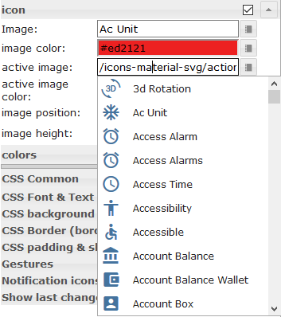</td><td> Einige der Widgets unterstützen die <a href="https://materialdesignicons.com/" target="_blank">Material Design Icons-</a> Bibliothek. Sie können ein Symbol aus der obigen Liste auswählen oder die Bildauswahl öffnen, indem Sie auf die Schaltfläche rechts neben dem Eingabefeld klicken.<br><br> <b>Bildfarben gelten nur für die Materialdesign-Icons, nicht für ein Bild!</b></td></tr></tbody></table>

### HTML-Eigenschaften
Die folgenden Eigenschaften können als [HTML-Widgets](#html-widgets) verwendet werden.

<table><thead><tr><th>Eigentum</th><th> Beschreibung</th><th> Art</th><th> Werte </th></tr></thead><tbody><tr><td colspan="4" style="background: #44739e; color: white; border-color: #44739e;"> <i><b><br>Verbreitet</b></i></td></tr><tr><td> mdw-mdwIcon</td><td> Symbol</td><td> Schnur</td><td></tr><tr><td> mdw-mdwIconSize</td><td> Symbolgröße</td><td> Nummer</td><td></tr><tr><td> mdw-mdwIconColor</td><td> Symbolfarbe</td><td> Schnur</td><td> hex(#44739e), rgb(20, 50, 200), rgba(20, 50, 200, 0,5)</tr><tr><td> mdw-debug</td><td> debuggen</td><td> boolesch</td><td> falsch | wahr</tr></tbody></table>

<!-- im Inhaltsverzeichnis weglassen -->

#### HTML-Eigenschaften - Beispiel
<details>

```
<div class='vis-widget materialdesign-widget materialdesign-icon materialdesign-materialdesignicons-html-element'
	style='width: 50px; height: 50px; position: relative; display: flex; align-items: center;'
	mdw-mdwIcon='iobroker'
	mdw-mdwIconSize='30'
	mdw-mdwIconColor='#mdwTheme:vis-materialdesign.0.colors.material_design_icon.color'
	mdw-debug='true'
></div>
```

</details>

## Tasten


###Navigation
#### Editor-Einstellungen
Einstellungen, die in der folgenden Tabelle nicht aufgeführt sind, sind selbsterklärend.

<table><thead><tr><th>Bildschirmfoto</th><th> Rahmen</th><th> Beschreibung </th></tr></thead><tbody><tr><td rowspan=1></td><td>Zum Navigieren anzeigen</td><td> Name der Ansicht zum Navigieren</td></tr></tbody></table>

#### HTML-Eigenschaften
Die folgenden Eigenschaften können als [HTML-Widgets](#html-widgets) verwendet werden.

<table><thead><tr><th>Eigentum</th><th> Beschreibung</th><th> Art</th><th> Werte</th></tr></thead><tbody><tr><td> mdw-Typ</td><td> Widget-Typ</td><td> Schnur</td><td> navigation_default</td></tr><tr><td colspan="4" style="background: #44739e; color: white; border-color: #44739e;"> <i><b><br>Verbreitet</b></i></td></tr><tr><td> mdw-buttonStyle</td><td> Schaltflächenstil</td><td> Schnur</td><td> Text | aufgezogen | nicht erhöht | skizziert</tr><tr><td> mdw-nav_view</td><td> Zum Navigieren anzeigen</td><td> Ansichten</td><td></tr><tr><td> mdw-vibrateOnMobilDevices</td><td> vibrieren auf mobilen Geräten [s]</td><td> Nummer</td><td></tr><tr><td> mdw-debug</td><td> debuggen</td><td> boolesch</td><td> falsch | wahr</tr><tr><td colspan="4" style="background: #44739e; color: white; border-color: #44739e;"> <i><b><br>Beschriftung</b></i></td></tr><tr><td> mdw-Buttontext</td><td> Schaltflächentext</td><td> Schnur</td><td></tr><tr><td> mdw-textFontFamily</td><td> Schriftart</td><td> Schnur</td><td></tr><tr><td> mdw-textFontSize</td><td> Textgröße</td><td> Nummer</td><td></tr><tr><td> mdw-labelWidth</td><td> Textbreite</td><td> Nummer</td><td></tr><tr><td colspan="4" style="background: #44739e; color: white; border-color: #44739e;"><i><b><br>Farben</b></i></td></tr><tr><td> mdw-mdwButtonPrimaryColor</td><td> Primärfarbe</td><td> Schnur</td><td> hex(#44739e), rgb(20, 50, 200), rgba(20, 50, 200, 0,5)</tr><tr><td> mdw-mdwButtonSecondaryColor</td><td> sekundäre Farbe</td><td> Schnur</td><td> hex(#44739e), rgb(20, 50, 200), rgba(20, 50, 200, 0,5)</tr><tr><td> mdw-mdwButtonColorPress</td><td> Farbe gepresst</td><td> Schnur</td><td> hex(#44739e), rgb(20, 50, 200), rgba(20, 50, 200, 0,5)</tr><tr><td colspan="4" style="background: #44739e; color: white; border-color: #44739e;"> <i><b><br>Symbol</b></i></td></tr><tr><td> mdw-Bild</td><td> Bild</td><td> Schnur</td><td></tr><tr><td> mdw-imageColor</td><td> Bildfarbe</td><td> Schnur</td><td> hex(#44739e), rgb(20, 50, 200), rgba(20, 50, 200, 0,5)</tr><tr><td> mdw-iconPosition</td><td> Bildposition</td><td> Schnur</td><td> links | Recht</tr><tr><td> mdw-iconHeight</td><td> Bildhöhe</td><td> Nummer</td><td></tr></tbody></table>

<!-- im Inhaltsverzeichnis weglassen -->

##### HTML-Eigenschaften - Beispiel
<details>

```
<div class='vis-widget materialdesign-widget materialdesign-button materialdesign-button-html-element'
	style='width: 100%; height: 100%; position: relative; padding: 0px;'
	mdw-type='navigation_default'
	mdw-buttonStyle='raised'
	mdw-nav_view='value'
	mdw-vibrateOnMobilDevices='50'
	mdw-buttontext=' Navigation'
	mdw-textFontFamily='#mdwTheme:vis-materialdesign.0.fonts.button.default.text'
	mdw-textFontSize='#mdwTheme:vis-materialdesign.0.fontSizes.button.default.text'
	mdw-mdwButtonPrimaryColor='#mdwTheme:vis-materialdesign.0.colors.button.default.primary'
	mdw-mdwButtonSecondaryColor='#mdwTheme:vis-materialdesign.0.colors.button.default.secondary'
	mdw-image='navigation'
	mdw-iconPosition='left'
></div>
```

</details>

### Verknüpfung
#### Editor-Einstellungen
Einstellungen, die in der folgenden Tabelle nicht aufgeführt sind, sind selbsterklärend.

<table><thead><tr><th>Bildschirmfoto</th><th> Rahmen</th><th> Beschreibung</th></tr></thead><tbody><tr><td rowspan=2></td><td> Verknüpfung</td><td> URL zum Öffnen</td></tr><tr><td> in neuem Fenster öffnen</td><td> Link in neuem Fenster / Tab öffnen</td></tr></tbody></table>

#### HTML-Eigenschaften
Die folgenden Eigenschaften können als [HTML-Widgets](#html-widgets) verwendet werden.

<table><thead><tr><th>Eigentum</th><th> Beschreibung</th><th> Art</th><th> Werte</th></tr></thead><tbody><tr><td> mdw-Typ</td><td> Widget-Typ</td><td> Schnur</td><td> link_default</td></tr><tr><td colspan="4" style="background: #44739e; color: white; border-color: #44739e;"> <i><b><br>Verbreitet</b></i></td></tr><tr><td> mdw-buttonStyle</td><td> Schaltflächenstil</td><td> Schnur</td><td> Text | aufgezogen | nicht erhöht | skizziert</tr><tr><td> mdw-href</td><td> Verknüpfung</td><td> URL</td><td></tr><tr><td> mdw-openNewWindow</td><td> in neuem Fenster öffnen</td><td> boolesch</td><td> falsch | wahr</tr><tr><td> mdw-vibrateOnMobilDevices</td><td> vibrieren auf mobilen Geräten [s]</td><td> Nummer</td><td></tr><tr><td> mdw-debug</td><td> debuggen</td><td> boolesch</td><td> falsch | wahr</tr><tr><td colspan="4" style="background: #44739e; color: white; border-color: #44739e;"> <i><b><br>Beschriftung</b></i></td></tr><tr><td> mdw-Buttontext</td><td> Schaltflächentext</td><td> Schnur</td><td></tr><tr><td> mdw-textFontFamily</td><td> Schriftart</td><td> Schnur</td><td></tr><tr><td> mdw-textFontSize</td><td> Textgröße</td><td> Nummer</td><td></tr><tr><td> mdw-labelWidth</td><td> Textbreite</td><td> Nummer</td><td></tr><tr><td colspan="4" style="background: #44739e; color: white; border-color: #44739e;"><i><b><br>Farben</b></i></td></tr><tr><td> mdw-mdwButtonPrimaryColor</td><td> Primärfarbe</td><td> Schnur</td><td> hex(#44739e), rgb(20, 50, 200), rgba(20, 50, 200, 0,5)</tr><tr><td> mdw-mdwButtonSecondaryColor</td><td> sekundäre Farbe</td><td> Schnur</td><td> hex(#44739e), rgb(20, 50, 200), rgba(20, 50, 200, 0,5)</tr><tr><td> mdw-mdwButtonColorPress</td><td> Farbe gepresst</td><td> Schnur</td><td> hex(#44739e), rgb(20, 50, 200), rgba(20, 50, 200, 0,5)</tr><tr><td colspan="4" style="background: #44739e; color: white; border-color: #44739e;"> <i><b><br>Symbol</b></i></td></tr><tr><td> mdw-Bild</td><td> Bild</td><td> Schnur</td><td></tr><tr><td> mdw-imageColor</td><td> Bildfarbe</td><td> Schnur</td><td> hex(#44739e), rgb(20, 50, 200), rgba(20, 50, 200, 0,5)</tr><tr><td> mdw-iconPosition</td><td> Bildposition</td><td> Schnur</td><td> links | Recht</tr><tr><td> mdw-iconHeight</td><td> Bildhöhe</td><td> Nummer</td><td></tr></tbody></table>

<!-- im Inhaltsverzeichnis weglassen -->

##### HTML-Eigenschaften - Beispiel
<details>

```
<div class='vis-widget materialdesign-widget materialdesign-button materialdesign-button-html-element'
	style='width: 100px; height: 30px; position: relative; padding: 0px;'
	mdw-type='link_default'
	mdw-buttonStyle='raised'
	mdw-href='https://github.com/Scrounger/ioBroker.vis-materialdesign'
	mdw-openNewWindow='true'
	mdw-vibrateOnMobilDevices='50'
	mdw-buttontext=' Link'
	mdw-textFontFamily='#mdwTheme:vis-materialdesign.0.fonts.button.default.text'
	mdw-textFontSize='#mdwTheme:vis-materialdesign.0.fontSizes.button.default.text'
	mdw-mdwButtonPrimaryColor='#mdwTheme:vis-materialdesign.0.colors.button.default.primary'
	mdw-mdwButtonSecondaryColor='#mdwTheme:vis-materialdesign.0.colors.button.default.secondary'
	mdw-image='link'
	mdw-iconPosition='left'
></div>
```

</details>

### Zustand
#### Editor-Einstellungen
Einstellungen, die in der folgenden Tabelle nicht aufgeführt sind, sind selbsterklärend.

<table><thead><tr><th>Bildschirmfoto</th><th> Rahmen</th><th> Beschreibung</th></tr></thead><tbody><tr><td rowspan=1></td><td>Wert</td><td> Wert einzustellen</td></tr></tbody></table>

#### HTML-Eigenschaften
Die folgenden Eigenschaften können als [HTML-Widgets](#html-widgets) verwendet werden.

<table><thead><tr><th>Eigentum</th><th> Beschreibung</th><th> Art</th><th> Werte</th></tr></thead><tbody><tr><td> mdw-Typ</td><td> Widget-Typ</td><td> Schnur</td><td> state_default</td></tr><tr><td colspan="4" style="background: #44739e; color: white; border-color: #44739e;"> <i><b><br>Verbreitet</b></i></td></tr><tr><td> mdw-oid</td><td> Objekt Identifikation</td><td> Schnur</td><td></tr><tr><td> mdw-buttonStyle</td><td> Schaltflächenstil</td><td> Schnur</td><td> Text | aufgezogen | nicht erhöht | skizziert</tr><tr><td> mdw-Wert</td><td> Wert</td><td> Schnur</td><td></tr><tr><td> mdw-vibrateOnMobilDevices</td><td> vibrieren auf mobilen Geräten [s]</td><td> Nummer</td><td></tr><tr><td> mdw-debug</td><td> debuggen</td><td> boolesch</td><td> falsch | wahr</tr><tr><td colspan="4" style="background: #44739e; color: white; border-color: #44739e;"> <i><b><br>Beschriftung</b></i></td></tr><tr><td> mdw-Buttontext</td><td> Schaltflächentext</td><td> Schnur</td><td></tr><tr><td> mdw-textFontFamily</td><td> Schriftart</td><td> Schnur</td><td></tr><tr><td> mdw-textFontSize</td><td> Textgröße</td><td> Nummer</td><td></tr><tr><td> mdw-labelWidth</td><td> Textbreite</td><td> Nummer</td><td></tr><tr><td colspan="4" style="background: #44739e; color: white; border-color: #44739e;"><i><b><br>Farben</b></i></td></tr><tr><td> mdw-mdwButtonPrimaryColor</td><td> Primärfarbe</td><td> Schnur</td><td> hex(#44739e), rgb(20, 50, 200), rgba(20, 50, 200, 0,5)</tr><tr><td> mdw-mdwButtonSecondaryColor</td><td> sekundäre Farbe</td><td> Schnur</td><td> hex(#44739e), rgb(20, 50, 200), rgba(20, 50, 200, 0,5)</tr><tr><td> mdw-mdwButtonColorPress</td><td> Farbe gepresst</td><td> Schnur</td><td> hex(#44739e), rgb(20, 50, 200), rgba(20, 50, 200, 0,5)</tr><tr><td colspan="4" style="background: #44739e; color: white; border-color: #44739e;"> <i><b><br>Symbol</b></i></td></tr><tr><td> mdw-Bild</td><td> Bild</td><td> Schnur</td><td></tr><tr><td> mdw-imageColor</td><td> Bildfarbe</td><td> Schnur</td><td> hex(#44739e), rgb(20, 50, 200), rgba(20, 50, 200, 0,5)</tr><tr><td> mdw-iconPosition</td><td> Bildposition</td><td> Schnur</td><td> links | Recht</tr><tr><td> mdw-iconHeight</td><td> Bildhöhe</td><td> Nummer</td><td></tr><tr><td colspan="4" style="background: #44739e; color: white; border-color: #44739e;"><i><b><br>Verriegelung</b></i></td></tr><tr><td> mdw-lockEnabled</td><td> Sperren aktivieren</td><td> boolesch</td><td> falsch | wahr</tr><tr><td> mdw-autoLockAfter</td><td> automatische Sperrung nach [s]</td><td> Nummer</td><td></tr><tr><td> mdw-lockIcon</td><td> Symbol</td><td> Schnur</td><td></tr><tr><td> mdw-lockIconSize</td><td> Symbolgröße</td><td> Nummer</td><td></tr><tr><td> mdw-lockIconColor</td><td> Symbolfarbe</td><td> Schnur</td><td> hex(#44739e), rgb(20, 50, 200), rgba(20, 50, 200, 0,5)</tr><tr><td> mdw-lockFilterGraustufen</td><td> grauer Filter wenn gesperrt</td><td> Nummer</td><td></tr></tbody></table>

<!-- im Inhaltsverzeichnis weglassen -->

##### HTML-Eigenschaften - Beispiel
<details>

```
<div class='vis-widget materialdesign-widget materialdesign-button materialdesign-button-html-element'
	style='width: 100%; height: 100%; position: relative; padding: 0px;'
	mdw-type='state_default'
	mdw-oid='0_userdata.0.number'
	mdw-buttonStyle='raised'
	mdw-value='22'
	mdw-vibrateOnMobilDevices='50'
	mdw-buttontext=' State'
	mdw-textFontFamily='#mdwTheme:vis-materialdesign.0.fonts.button.default.text'
	mdw-textFontSize='#mdwTheme:vis-materialdesign.0.fontSizes.button.default.text'
	mdw-mdwButtonPrimaryColor='#mdwTheme:vis-materialdesign.0.colors.button.default.primary'
	mdw-mdwButtonSecondaryColor='#mdwTheme:vis-materialdesign.0.colors.button.default.secondary'
	mdw-image='pencil'
	mdw-iconPosition='left'
	mdw-autoLockAfter='10'
	mdw-lockIconColor='#mdwTheme:vis-materialdesign.0.colors.button.lock_icon'
	mdw-lockFilterGrayscale='30'
></div>
```

</details>

###Mehrere Staaten
#### Editor-Einstellungen
Einstellungen, die in der folgenden Tabelle nicht aufgeführt sind, sind selbsterklärend.

<table><thead><tr><th>Bildschirmfoto</th><th> Rahmen</th><th> Beschreibung </th></tr></thead><tbody><tr><td rowspan=3></td><td> Objekt-ID[x]</td><td> id des Objekts, von dem der Wert gesetzt werden soll</td></tr><tr><td> Wert[x]</td><td> einzustellender Wert</td></tr><tr><td> Verzögerung [ms][x]</td><td> Verzögerung bis Wert eingestellt ist</td></tr></tbody></table>

#### HTML-Eigenschaften
Die folgenden Eigenschaften können als [HTML-Widgets](#html-widgets) verwendet werden.

<table><thead><tr><th>Eigentum</th><th> Beschreibung</th><th> Art</th><th> Werte</th></tr></thead><tbody><tr><td> mdw-Typ</td><td> Widget-Typ</td><td> Schnur</td><td> multiState_default</td></tr><tr><td colspan="4" style="background: #44739e; color: white; border-color: #44739e;"> <i><b><br>Verbreitet</b></i></td></tr><tr><td> mdw-countOids</td><td> Anzahl der Objekt-IDs</td><td> Nummer</td><td></tr><tr><td> mdw-buttonStyle</td><td> Schaltflächenstil</td><td> Schnur</td><td> Text | aufgezogen | nicht erhöht | skizziert</tr><tr><td> mdw-vibrateOnMobilDevices</td><td> vibrieren auf mobilen Geräten [s]</td><td> Nummer</td><td></tr><tr><td> mdw-debug</td><td> debuggen</td><td> boolesch</td><td> falsch | wahr</tr><tr><td colspan="4" style="background: #44739e; color: white; border-color: #44739e;"> <i><b><br>Objekt-ID [x]</b></i></td></tr><tr><td> mdw-oid[x]</td><td> Objekt Identifikation</td><td> Schnur</td><td></tr><tr><td> mdw-Wert[x]</td><td> Wert</td><td> Schnur</td><td></tr><tr><td> mdw-delayInMs[x]</td><td> Verzögerung [ms]</td><td> Nummer</td><td></tr><tr><td colspan="4" style="background: #44739e; color: white; border-color: #44739e;"><i><b><br>Beschriftung</b></i></td></tr><tr><td> mdw-Buttontext</td><td> Schaltflächentext</td><td> Schnur</td><td></tr><tr><td> mdw-textFontFamily</td><td> Schriftart</td><td> Schnur</td><td></tr><tr><td> mdw-textFontSize</td><td> Textgröße</td><td> Nummer</td><td></tr><tr><td> mdw-labelWidth</td><td> Textbreite</td><td> Nummer</td><td></tr><tr><td colspan="4" style="background: #44739e; color: white; border-color: #44739e;"><i><b><br>Farben</b></i></td></tr><tr><td> mdw-mdwButtonPrimaryColor</td><td> Primärfarbe</td><td> Schnur</td><td> hex(#44739e), rgb(20, 50, 200), rgba(20, 50, 200, 0,5)</tr><tr><td> mdw-mdwButtonSecondaryColor</td><td> sekundäre Farbe</td><td> Schnur</td><td> hex(#44739e), rgb(20, 50, 200), rgba(20, 50, 200, 0,5)</tr><tr><td> mdw-mdwButtonColorPress</td><td> Farbe gepresst</td><td> Schnur</td><td> hex(#44739e), rgb(20, 50, 200), rgba(20, 50, 200, 0,5)</tr><tr><td colspan="4" style="background: #44739e; color: white; border-color: #44739e;"> <i><b><br>Symbol</b></i></td></tr><tr><td> mdw-Bild</td><td> Bild</td><td> Schnur</td><td></tr><tr><td> mdw-imageColor</td><td> Bildfarbe</td><td> Schnur</td><td> hex(#44739e), rgb(20, 50, 200), rgba(20, 50, 200, 0,5)</tr><tr><td> mdw-iconPosition</td><td> Bildposition</td><td> Schnur</td><td> links | Recht</tr><tr><td> mdw-iconHeight</td><td> Bildhöhe</td><td> Nummer</td><td></tr><tr><td colspan="4" style="background: #44739e; color: white; border-color: #44739e;"><i><b><br>Verriegelung</b></i></td></tr><tr><td> mdw-lockEnabled</td><td> Sperren aktivieren</td><td> boolesch</td><td> falsch | wahr</tr><tr><td> mdw-autoLockAfter</td><td> automatische Sperrung nach [s]</td><td> Nummer</td><td></tr><tr><td> mdw-lockIcon</td><td> Symbol</td><td> Schnur</td><td></tr><tr><td> mdw-lockIconSize</td><td> Symbolgröße</td><td> Nummer</td><td></tr><tr><td> mdw-lockIconColor</td><td> Symbolfarbe</td><td> Schnur</td><td> hex(#44739e), rgb(20, 50, 200), rgba(20, 50, 200, 0,5)</tr><tr><td> mdw-lockFilterGraustufen</td><td> grauer Filter wenn gesperrt</td><td> Nummer</td><td></tr></tbody></table>

<!-- im Inhaltsverzeichnis weglassen -->

##### HTML-Eigenschaften - Beispiel
<details>

```
<div class='vis-widget materialdesign-widget materialdesign-button materialdesign-button-html-element'
	style='width: 100%; height: 100%; position: relative; padding: 0px;'
	mdw-type='multiState_default'
	mdw-countOids='1'
	mdw-buttonStyle='raised'
	mdw-vibrateOnMobilDevices='50'
	mdw-buttontext=' Multi State'
	mdw-textFontFamily='#mdwTheme:vis-materialdesign.0.fonts.button.default.text'
	mdw-textFontSize='#mdwTheme:vis-materialdesign.0.fontSizes.button.default.text'
	mdw-mdwButtonPrimaryColor='#mdwTheme:vis-materialdesign.0.colors.button.default.primary'
	mdw-mdwButtonSecondaryColor='#mdwTheme:vis-materialdesign.0.colors.button.default.secondary'
	mdw-image='pencil-box-multiple'
	mdw-iconPosition='left'
	mdw-autoLockAfter='10'
	mdw-lockIconColor='#mdwTheme:vis-materialdesign.0.colors.button.lock_icon'
	mdw-lockFilterGrayscale='30'
	mdw-oid0='0_userdata.0.MDW.Buttons.multiState.bool'
	mdw-value0='true'
	mdw-delayInMs0='0'
	mdw-oid1='0_userdata.0.MDW.Buttons.number'
	mdw-value1='66'
	mdw-delayInMs1='0'
></div>
```

</details>

###Zusatz
#### Editor-Einstellungen
Einstellungen, die in der folgenden Tabelle nicht aufgeführt sind, sind selbsterklärend.

<table><thead><tr><th>Bildschirmfoto</th><th> Rahmen</th><th> Beschreibung </th></tr></thead><tbody><tr><td rowspan=2></td><td> Wert</td><td> Wert, der hinzugefügt oder abgezogen werden soll</td></tr><tr><td> Minimal Maximal</td><td> minimaler / maximaler Wert, bis zu dem addiert oder subtrahiert werden kann</td></tr></tbody></table>

#### HTML-Eigenschaften
Die folgenden Eigenschaften können als [HTML-Widgets](#html-widgets) verwendet werden.

<table><thead><tr><th>Eigentum</th><th> Beschreibung</th><th> Art</th><th> Werte</th></tr></thead><tbody><tr><td> mdw-Typ</td><td> Widget-Typ</td><td> Schnur</td><td> addition_default</td></tr><tr><td colspan="4" style="background: #44739e; color: white; border-color: #44739e;"> <i><b><br>Verbreitet</b></i></td></tr><tr><td> mdw-oid</td><td> Objekt Identifikation</td><td> Schnur</td><td></tr><tr><td> mdw-buttonStyle</td><td> Schaltflächenstil</td><td> Schnur</td><td> Text | aufgezogen | nicht erhöht | skizziert</tr><tr><td> mdw-Wert</td><td> Wert</td><td> Schnur</td><td></tr><tr><td> mdw-minmax</td><td> Minimal Maximal</td><td> Schnur</td><td></tr><tr><td> mdw-vibrateOnMobilDevices</td><td> vibrieren auf mobilen Geräten [s]</td><td> Nummer</td><td></tr><tr><td> mdw-debug</td><td> debuggen</td><td> boolesch</td><td> falsch | wahr</tr><tr><td colspan="4" style="background: #44739e; color: white; border-color: #44739e;"> <i><b><br>Beschriftung</b></i></td></tr><tr><td> mdw-Buttontext</td><td> Schaltflächentext</td><td> Schnur</td><td></tr><tr><td> mdw-textFontFamily</td><td> Schriftart</td><td> Schnur</td><td></tr><tr><td> mdw-textFontSize</td><td> Textgröße</td><td> Nummer</td><td></tr><tr><td> mdw-labelWidth</td><td> Textbreite</td><td> Nummer</td><td></tr><tr><td colspan="4" style="background: #44739e; color: white; border-color: #44739e;"><i><b><br>Farben</b></i></td></tr><tr><td> mdw-mdwButtonPrimaryColor</td><td> Primärfarbe</td><td> Schnur</td><td> hex(#44739e), rgb(20, 50, 200), rgba(20, 50, 200, 0,5)</tr><tr><td> mdw-mdwButtonSecondaryColor</td><td> sekundäre Farbe</td><td> Schnur</td><td> hex(#44739e), rgb(20, 50, 200), rgba(20, 50, 200, 0,5)</tr><tr><td> mdw-mdwButtonColorPress</td><td> Farbe gepresst</td><td> Schnur</td><td> hex(#44739e), rgb(20, 50, 200), rgba(20, 50, 200, 0,5)</tr><tr><td colspan="4" style="background: #44739e; color: white; border-color: #44739e;"> <i><b><br>Symbol</b></i></td></tr><tr><td> mdw-Bild</td><td> Bild</td><td> Schnur</td><td></tr><tr><td> mdw-imageColor</td><td> Bildfarbe</td><td> Schnur</td><td> hex(#44739e), rgb(20, 50, 200), rgba(20, 50, 200, 0,5)</tr><tr><td> mdw-iconPosition</td><td> Bildposition</td><td> Schnur</td><td> links | Recht</tr><tr><td> mdw-iconHeight</td><td> Bildhöhe</td><td> Nummer</td><td></tr></tbody></table>

<!-- im Inhaltsverzeichnis weglassen -->

##### HTML-Eigenschaften - Beispiel
<details>

```
<div class='vis-widget materialdesign-widget materialdesign-button materialdesign-button-html-element'
	style='width: 100%; height: 100%; position: relative; padding: 0px;'
	mdw-type='addition_default'
	mdw-oid='0_userdata.0.MDW.Buttons.number'
	mdw-buttonStyle='raised'
	mdw-value='1'
	mdw-minmax='100'
	mdw-vibrateOnMobilDevices='50'
	mdw-buttontext=' Addition'
	mdw-textFontFamily='#mdwTheme:vis-materialdesign.0.fonts.button.default.text'
	mdw-textFontSize='#mdwTheme:vis-materialdesign.0.fontSizes.button.default.text'
	mdw-mdwButtonPrimaryColor='#mdwTheme:vis-materialdesign.0.colors.button.default.primary'
	mdw-mdwButtonSecondaryColor='#mdwTheme:vis-materialdesign.0.colors.button.default.secondary'
	mdw-image='plus'
	mdw-iconPosition='left'
></div>
```

</details>

### Umschalten
#### Editor-Einstellungen
Einstellungen, die in der folgenden Tabelle nicht aufgeführt sind, sind selbsterklärend.

noch

#### HTML-Eigenschaften
Die folgenden Eigenschaften können als [HTML-Widgets](#html-widgets) verwendet werden.

<table><thead><tr><th>Eigentum</th><th> Beschreibung</th><th> Art</th><th> Werte</th></tr></thead><tbody><tr><td> mdw-Typ</td><td> Widget-Typ</td><td> Schnur</td><td> toggle_default</td></tr><tr><td colspan="4" style="background: #44739e; color: white; border-color: #44739e;"> <i><b><br>Verbreitet</b></i></td></tr><tr><td> mdw-oid</td><td> Objekt Identifikation</td><td> Schnur</td><td></tr><tr><td> mdw-buttonStyle</td><td> Schaltflächenstil</td><td> Schnur</td><td> Text | aufgezogen | nicht erhöht | skizziert</tr><tr><td> mdw-readOnly</td><td> schreibgeschützt</td><td> boolesch</td><td> falsch | wahr</tr><tr><td> mdw-toggleType</td><td> Art des Umschalters</td><td> Schnur</td><td> boolesch | Wert</tr><tr><td> mdw-Drucktaste</td><td> Druckknopf</td><td> boolesch</td><td> falsch | wahr</tr><tr><td> mdw-WertAus</td><td> Wert für aus</td><td> Schnur</td><td></tr><tr><td> mdw-WertEin</td><td> Wert für an</td><td> Schnur</td><td></tr><tr><td> mdw-stateIfNotTrueValue</td><td> Zustand, wenn Wert ungleich &#39;Ein&#39;-Bedingung</td><td> Schnur</td><td> auf | aus</tr><tr><td> mdw-vibrateOnMobilDevices</td><td> vibrieren auf mobilen Geräten [s]</td><td> Nummer</td><td></tr><tr><td> mdw-debug</td><td> debuggen</td><td> boolesch</td><td> falsch | wahr</tr><tr><td colspan="4" style="background: #44739e; color: white; border-color: #44739e;"> <i><b><br>Beschriftung</b></i></td></tr><tr><td> mdw-Buttontext</td><td> Schaltflächentext</td><td> Schnur</td><td></tr><tr><td> mdw-labelTrue</td><td> Label wahr</td><td> Schnur</td><td></tr><tr><td> mdw-labelColorFalse</td><td> Etikettenfarbe</td><td> Schnur</td><td> hex(#44739e), rgb(20, 50, 200), rgba(20, 50, 200, 0,5)</tr><tr><td> mdw-labelColorTrue</td><td> aktive Etikettenfarbe</td><td> Schnur</td><td> hex(#44739e), rgb(20, 50, 200), rgba(20, 50, 200, 0,5)</tr><tr><td> mdw-textFontFamily</td><td> Schriftart</td><td> Schnur</td><td></tr><tr><td> mdw-textFontSize</td><td> Textgröße</td><td> Nummer</td><td></tr><tr><td> mdw-labelWidth</td><td> Textbreite</td><td> Nummer</td><td></tr><tr><td colspan="4" style="background: #44739e; color: white; border-color: #44739e;"><i><b><br>Farben</b></i></td></tr><tr><td> mdw-mdwButtonPrimaryColor</td><td> Primärfarbe</td><td> Schnur</td><td> hex(#44739e), rgb(20, 50, 200), rgba(20, 50, 200, 0,5)</tr><tr><td> mdw-mdwButtonSecondaryColor</td><td> sekundäre Farbe</td><td> Schnur</td><td> hex(#44739e), rgb(20, 50, 200), rgba(20, 50, 200, 0,5)</tr><tr><td> mdw-mdwButtonColorPress</td><td> Farbe gepresst</td><td> Schnur</td><td> hex(#44739e), rgb(20, 50, 200), rgba(20, 50, 200, 0,5)</tr><tr><td> mdw-colorBgFalse</td><td> Hintergrund</td><td> Schnur</td><td> hex(#44739e), rgb(20, 50, 200), rgba(20, 50, 200, 0,5)</tr><tr><td> mdw-colorBgTrue</td><td> aktiver Hintergrund</td><td> Schnur</td><td> hex(#44739e), rgb(20, 50, 200), rgba(20, 50, 200, 0,5)</tr><tr><td colspan="4" style="background: #44739e; color: white; border-color: #44739e;"> <i><b><br>Symbol</b></i></td></tr><tr><td> mdw-Bild</td><td> Bild</td><td> Schnur</td><td></tr><tr><td> mdw-imageColor</td><td> Bildfarbe</td><td> Schnur</td><td> hex(#44739e), rgb(20, 50, 200), rgba(20, 50, 200, 0,5)</tr><tr><td> mdw-imageTrue</td><td> aktives Bild</td><td> Schnur</td><td></tr><tr><td> mdw-imageTrueColor</td><td> aktive Bildfarbe</td><td> Schnur</td><td> hex(#44739e), rgb(20, 50, 200), rgba(20, 50, 200, 0,5)</tr><tr><td> mdw-iconPosition</td><td> Bildposition</td><td> Schnur</td><td> links | Recht</tr><tr><td> mdw-iconHeight</td><td> Bildhöhe</td><td> Nummer</td><td></tr><tr><td colspan="4" style="background: #44739e; color: white; border-color: #44739e;"><i><b><br>Verriegelung</b></i></td></tr><tr><td> mdw-lockEnabled</td><td> Sperren aktivieren</td><td> boolesch</td><td> falsch | wahr</tr><tr><td> mdw-autoLockAfter</td><td> automatische Sperrung nach [s]</td><td> Nummer</td><td></tr><tr><td> mdw-lockIcon</td><td> Symbol</td><td> Schnur</td><td></tr><tr><td> mdw-lockIconSize</td><td> Symbolgröße</td><td> Nummer</td><td></tr><tr><td> mdw-lockIconColor</td><td> Symbolfarbe</td><td> Schnur</td><td> hex(#44739e), rgb(20, 50, 200), rgba(20, 50, 200, 0,5)</tr><tr><td> mdw-lockFilterGraustufen</td><td> grauer Filter wenn gesperrt</td><td> Nummer</td><td></tr></tbody></table>

<!-- im Inhaltsverzeichnis weglassen -->

##### HTML-Eigenschaften - Beispiel
<details>

```
<div class='vis-widget materialdesign-widget materialdesign-button materialdesign-button-html-element'
	style='width: 100%; height: 100%; position: relative; padding: 0px;'
	mdw-type='toggle_default'
	mdw-oid='0_userdata.0.MDW.Buttons.multiState.bool'
	mdw-buttonStyle='raised'
	mdw-toggleType='boolean'
	mdw-stateIfNotTrueValue='on'
	mdw-vibrateOnMobilDevices='50'
	mdw-buttontext='off'
	mdw-labelTrue='on'
	mdw-textFontFamily='#mdwTheme:vis-materialdesign.0.fonts.button.default.text'
	mdw-textFontSize='#mdwTheme:vis-materialdesign.0.fontSizes.button.default.text'
	mdw-mdwButtonPrimaryColor='#mdwTheme:vis-materialdesign.0.colors.button.default.primary'
	mdw-mdwButtonSecondaryColor='#mdwTheme:vis-materialdesign.0.colors.button.default.secondary'
	mdw-colorBgTrue='green'
	mdw-image='checkbox-blank-outline'
	mdw-imageTrue='checkbox-marked'
	mdw-iconPosition='left'
	mdw-autoLockAfter='4'
	mdw-lockIconColor='#mdwTheme:vis-materialdesign.0.colors.button.lock_icon'
	mdw-lockFilterGrayscale='30'
></div>
```

</details>

## Tasten vertikal


###Navigation
#### Editor-Einstellungen
Einstellungen, die in der folgenden Tabelle nicht aufgeführt sind, sind selbsterklärend.

<table><thead><tr><th>Bildschirmfoto</th><th> Rahmen</th><th> Beschreibung </th></tr></thead><tbody><tr><td rowspan=1></td><td>Zum Navigieren anzeigen</td><td> Name der Ansicht zum Navigieren</td></tr></tbody></table>

#### HTML-Eigenschaften
Die folgenden Eigenschaften können als [HTML-Widgets](#html-widgets) verwendet werden.

<table><thead><tr><th>Eigentum</th><th> Beschreibung</th><th> Art</th><th> Werte</th></tr></thead><tbody><tr><td> mdw-Typ</td><td> Widget-Typ</td><td> Schnur</td><td> navigation_vertikal</td></tr><tr><td colspan="4" style="background: #44739e; color: white; border-color: #44739e;"> <i><b><br>Verbreitet</b></i></td></tr><tr><td> mdw-buttonStyle</td><td> Schaltflächenstil</td><td> Schnur</td><td> Text | aufgezogen | nicht erhöht | skizziert</tr><tr><td> mdw-nav_view</td><td> Zum Navigieren anzeigen</td><td> Ansichten</td><td></tr><tr><td> mdw-vibrateOnMobilDevices</td><td> vibrieren auf mobilen Geräten [s]</td><td> Nummer</td><td></tr><tr><td> mdw-debug</td><td> debuggen</td><td> boolesch</td><td> falsch | wahr</tr><tr><td colspan="4" style="background: #44739e; color: white; border-color: #44739e;"> <i><b><br>Beschriftung</b></i></td></tr><tr><td> mdw-Buttontext</td><td> Schaltflächentext</td><td> Schnur</td><td></tr><tr><td> mdw-textFontFamily</td><td> Schriftart</td><td> Schnur</td><td></tr><tr><td> mdw-textFontSize</td><td> Textgröße</td><td> Nummer</td><td></tr><tr><td> mdw-Ausrichtung</td><td> Ausrichtung</td><td> Schnur</td><td> Flexstart | Zentrum | Flex-Ende</tr><tr><td> mdw-AbstandBetweenTextAndImage</td><td> Abstand zwischen Text und Bild</td><td> Nummer</td><td></tr><tr><td colspan="4" style="background: #44739e; color: white; border-color: #44739e;"><i><b><br>Farben</b></i></td></tr><tr><td> mdw-mdwButtonPrimaryColor</td><td> Primärfarbe</td><td> Schnur</td><td> hex(#44739e), rgb(20, 50, 200), rgba(20, 50, 200, 0,5)</tr><tr><td> mdw-mdwButtonSecondaryColor</td><td> sekundäre Farbe</td><td> Schnur</td><td> hex(#44739e), rgb(20, 50, 200), rgba(20, 50, 200, 0,5)</tr><tr><td> mdw-mdwButtonColorPress</td><td> Farbe gepresst</td><td> Schnur</td><td> hex(#44739e), rgb(20, 50, 200), rgba(20, 50, 200, 0,5)</tr><tr><td colspan="4" style="background: #44739e; color: white; border-color: #44739e;"> <i><b><br>Symbol</b></i></td></tr><tr><td> mdw-Bild</td><td> Bild</td><td> Schnur</td><td></tr><tr><td> mdw-imageColor</td><td> Bildfarbe</td><td> Schnur</td><td> hex(#44739e), rgb(20, 50, 200), rgba(20, 50, 200, 0,5)</tr><tr><td> mdw-iconPosition</td><td> Bildposition</td><td> Schnur</td><td> Nach oben | Unterseite</tr><tr><td> mdw-iconHeight</td><td> Bildhöhe</td><td> Nummer</td><td></tr></tbody></table>

<!-- im Inhaltsverzeichnis weglassen -->

##### HTML-Eigenschaften - Beispiel
<details>

```
<div class='vis-widget materialdesign-widget materialdesign-button materialdesign-button-html-element'
	style='width: 100%; height: 100%; position: relative; padding: 0px;'
	mdw-type='navigation_vertical'
	mdw-buttonStyle='raised'
	mdw-nav_view='progress'
	mdw-vibrateOnMobilDevices='50'
	mdw-buttontext='Navigation'
	mdw-textFontFamily='#mdwTheme:vis-materialdesign.0.fonts.button.vertical.text'
	mdw-textFontSize='#mdwTheme:vis-materialdesign.0.fontSizes.button.vertical.text'
	mdw-alignment='center'
	mdw-mdwButtonPrimaryColor='#mdwTheme:vis-materialdesign.0.colors.button.vertical.primary'
	mdw-mdwButtonSecondaryColor='#mdwTheme:vis-materialdesign.0.colors.button.vertical.secondary'
	mdw-image='navigation'
	mdw-iconPosition='top'
	mdw-iconHeight='26'
></div>
```

</details>

### Verknüpfung
#### Editor-Einstellungen
Einstellungen, die in der folgenden Tabelle nicht aufgeführt sind, sind selbsterklärend.

<table><thead><tr><th>Bildschirmfoto</th><th> Rahmen</th><th> Beschreibung</th></tr></thead><tbody><tr><td rowspan=2></td><td> Verknüpfung</td><td> URL zum Öffnen</td></tr><tr><td> in neuem Fenster öffnen</td><td> Link in neuem Fenster / Tab öffnen</td></tr></tbody></table>

#### HTML-Eigenschaften
Die folgenden Eigenschaften können als [HTML-Widgets](#html-widgets) verwendet werden.

<table><thead><tr><th>Eigentum</th><th> Beschreibung</th><th> Art</th><th> Werte</th></tr></thead><tbody><tr><td> mdw-Typ</td><td> Widget-Typ</td><td> Schnur</td><td> link_vertikal</td></tr><tr><td colspan="4" style="background: #44739e; color: white; border-color: #44739e;"> <i><b><br>Verbreitet</b></i></td></tr><tr><td> mdw-buttonStyle</td><td> Schaltflächenstil</td><td> Schnur</td><td> Text | aufgezogen | nicht erhöht | skizziert</tr><tr><td> mdw-href</td><td> Verknüpfung</td><td> URL</td><td></tr><tr><td> mdw-openNewWindow</td><td> in neuem Fenster öffnen</td><td> boolesch</td><td> falsch | wahr</tr><tr><td> mdw-vibrateOnMobilDevices</td><td> vibrieren auf mobilen Geräten [s]</td><td> Nummer</td><td></tr><tr><td> mdw-debug</td><td> debuggen</td><td> boolesch</td><td> falsch | wahr</tr><tr><td colspan="4" style="background: #44739e; color: white; border-color: #44739e;"> <i><b><br>Beschriftung</b></i></td></tr><tr><td> mdw-Buttontext</td><td> Schaltflächentext</td><td> Schnur</td><td></tr><tr><td> mdw-textFontFamily</td><td> Schriftart</td><td> Schnur</td><td></tr><tr><td> mdw-textFontSize</td><td> Textgröße</td><td> Nummer</td><td></tr><tr><td> mdw-Ausrichtung</td><td> Ausrichtung</td><td> Schnur</td><td> Flexstart | Zentrum | Flex-Ende</tr><tr><td> mdw-AbstandBetweenTextAndImage</td><td> Abstand zwischen Text und Bild</td><td> Nummer</td><td></tr><tr><td colspan="4" style="background: #44739e; color: white; border-color: #44739e;"><i><b><br>Farben</b></i></td></tr><tr><td> mdw-mdwButtonPrimaryColor</td><td> Primärfarbe</td><td> Schnur</td><td> hex(#44739e), rgb(20, 50, 200), rgba(20, 50, 200, 0,5)</tr><tr><td> mdw-mdwButtonSecondaryColor</td><td> sekundäre Farbe</td><td> Schnur</td><td> hex(#44739e), rgb(20, 50, 200), rgba(20, 50, 200, 0,5)</tr><tr><td> mdw-mdwButtonColorPress</td><td> Farbe gepresst</td><td> Schnur</td><td> hex(#44739e), rgb(20, 50, 200), rgba(20, 50, 200, 0,5)</tr><tr><td colspan="4" style="background: #44739e; color: white; border-color: #44739e;"> <i><b><br>Symbol</b></i></td></tr><tr><td> mdw-Bild</td><td> Bild</td><td> Schnur</td><td></tr><tr><td> mdw-imageColor</td><td> Bildfarbe</td><td> Schnur</td><td> hex(#44739e), rgb(20, 50, 200), rgba(20, 50, 200, 0,5)</tr><tr><td> mdw-iconPosition</td><td> Bildposition</td><td> Schnur</td><td> Nach oben | Unterseite</tr><tr><td> mdw-iconHeight</td><td> Bildhöhe</td><td> Nummer</td><td></tr></tbody></table>

<!-- im Inhaltsverzeichnis weglassen -->

##### HTML-Eigenschaften - Beispiel
<details>

```
<div class='vis-widget materialdesign-widget materialdesign-button materialdesign-button-html-element'
	style='width: 100%; height: 100%; position: relative; padding: 0px;'
	mdw-type='link_vertical'
	mdw-debug='true'
	mdw-buttonStyle='raised'
	mdw-href='https://github.com/Scrounger/ioBroker.vis-materialdesign'
	mdw-openNewWindow='true'
	mdw-vibrateOnMobilDevices='50'
	mdw-buttontext='Link'
	mdw-textFontFamily='#mdwTheme:vis-materialdesign.0.fonts.button.vertical.text'
	mdw-textFontSize='#mdwTheme:vis-materialdesign.0.fontSizes.button.vertical.text'
	mdw-alignment='center'
	mdw-mdwButtonPrimaryColor='#mdwTheme:vis-materialdesign.0.colors.button.vertical.primary'
	mdw-mdwButtonSecondaryColor='#mdwTheme:vis-materialdesign.0.colors.button.vertical.secondary'
	mdw-image='link'
	mdw-iconPosition='top'
	mdw-iconHeight='26'
></div>
```

</details>

### Zustand
#### Editor-Einstellungen
Einstellungen, die in der folgenden Tabelle nicht aufgeführt sind, sind selbsterklärend.

<table><thead><tr><th>Bildschirmfoto</th><th> Rahmen</th><th> Beschreibung</th></tr></thead><tbody><tr><td rowspan=1></td><td>Wert</td><td> Wert einzustellen</td></tr></tbody></table>

#### HTML-Eigenschaften
Die folgenden Eigenschaften können als [HTML-Widgets](#html-widgets) verwendet werden.

<table><thead><tr><th>Eigentum</th><th> Beschreibung</th><th> Art</th><th> Werte</th></tr></thead><tbody><tr><td> mdw-Typ</td><td> Widget-Typ</td><td> Schnur</td><td> state_vertikal</td></tr><tr><td colspan="4" style="background: #44739e; color: white; border-color: #44739e;"> <i><b><br>Verbreitet</b></i></td></tr><tr><td> mdw-oid</td><td> Objekt Identifikation</td><td> Schnur</td><td></tr><tr><td> mdw-buttonStyle</td><td> Schaltflächenstil</td><td> Schnur</td><td> Text | aufgezogen | nicht erhöht | skizziert</tr><tr><td> mdw-Wert</td><td> Wert</td><td> Schnur</td><td></tr><tr><td> mdw-vibrateOnMobilDevices</td><td> vibrieren auf mobilen Geräten [s]</td><td> Nummer</td><td></tr><tr><td> mdw-debug</td><td> debuggen</td><td> boolesch</td><td> falsch | wahr</tr><tr><td colspan="4" style="background: #44739e; color: white; border-color: #44739e;"> <i><b><br>Beschriftung</b></i></td></tr><tr><td> mdw-Buttontext</td><td> Schaltflächentext</td><td> Schnur</td><td></tr><tr><td> mdw-textFontFamily</td><td> Schriftart</td><td> Schnur</td><td></tr><tr><td> mdw-textFontSize</td><td> Textgröße</td><td> Nummer</td><td></tr><tr><td> mdw-Ausrichtung</td><td> Ausrichtung</td><td> Schnur</td><td> Flexstart | Zentrum | Flex-Ende</tr><tr><td> mdw-AbstandBetweenTextAndImage</td><td> Abstand zwischen Text und Bild</td><td> Nummer</td><td></tr><tr><td colspan="4" style="background: #44739e; color: white; border-color: #44739e;"><i><b><br>Farben</b></i></td></tr><tr><td> mdw-mdwButtonPrimaryColor</td><td> Primärfarbe</td><td> Schnur</td><td> hex(#44739e), rgb(20, 50, 200), rgba(20, 50, 200, 0,5)</tr><tr><td> mdw-mdwButtonSecondaryColor</td><td> sekundäre Farbe</td><td> Schnur</td><td> hex(#44739e), rgb(20, 50, 200), rgba(20, 50, 200, 0,5)</tr><tr><td> mdw-mdwButtonColorPress</td><td> Farbe gepresst</td><td> Schnur</td><td> hex(#44739e), rgb(20, 50, 200), rgba(20, 50, 200, 0,5)</tr><tr><td colspan="4" style="background: #44739e; color: white; border-color: #44739e;"> <i><b><br>Symbol</b></i></td></tr><tr><td> mdw-Bild</td><td> Bild</td><td> Schnur</td><td></tr><tr><td> mdw-imageColor</td><td> Bildfarbe</td><td> Schnur</td><td> hex(#44739e), rgb(20, 50, 200), rgba(20, 50, 200, 0,5)</tr><tr><td> mdw-iconPosition</td><td> Bildposition</td><td> Schnur</td><td> Nach oben | Unterseite</tr><tr><td> mdw-iconHeight</td><td> Bildhöhe</td><td> Nummer</td><td></tr><tr><td colspan="4" style="background: #44739e; color: white; border-color: #44739e;"><i><b><br>Verriegelung</b></i></td></tr><tr><td> mdw-lockEnabled</td><td> Sperren aktivieren</td><td> boolesch</td><td> falsch | wahr</tr><tr><td> mdw-autoLockAfter</td><td> automatische Sperrung nach [s]</td><td> Nummer</td><td></tr><tr><td> mdw-lockIcon</td><td> Symbol</td><td> Schnur</td><td></tr><tr><td> mdw-lockIconTop</td><td> Symbolabstand von oben [%]</td><td> Nummer</td><td></tr><tr><td> mdw-lockIconLeft</td><td> Symbolabstand von links [%]</td><td> Nummer</td><td></tr><tr><td> mdw-lockIconSize</td><td> Symbolgröße</td><td> Nummer</td><td></tr><tr><td> mdw-lockIconColor</td><td> Symbolfarbe</td><td> Schnur</td><td> hex(#44739e), rgb(20, 50, 200), rgba(20, 50, 200, 0,5)</tr><tr><td> mdw-lockFilterGraustufen</td><td> grauer Filter wenn gesperrt</td><td> Nummer</td><td></tr></tbody></table>

<!-- im Inhaltsverzeichnis weglassen -->

##### HTML-Eigenschaften - Beispiel
<details>

```
<div class='vis-widget materialdesign-widget materialdesign-button materialdesign-button-html-element'
	style='width: 100%; height: 100%; position: relative; padding: 0px;'
	mdw-type='state_vertical'
	mdw-oid='0_userdata.0.MDW.Buttons.number'
	mdw-buttonStyle='raised'
	mdw-value='41'
	mdw-vibrateOnMobilDevices='50'
	mdw-buttontext='State'
	mdw-textFontFamily='#mdwTheme:vis-materialdesign.0.fonts.button.vertical.text'
	mdw-textFontSize='#mdwTheme:vis-materialdesign.0.fontSizes.button.vertical.text'
	mdw-alignment='center'
	mdw-mdwButtonPrimaryColor='#mdwTheme:vis-materialdesign.0.colors.button.vertical.primary'
	mdw-mdwButtonSecondaryColor='#mdwTheme:vis-materialdesign.0.colors.button.vertical.secondary'
	mdw-image='pencil'
	mdw-iconPosition='top'
	mdw-iconHeight='26'
	mdw-autoLockAfter='10'
	mdw-lockIconTop='5'
	mdw-lockIconLeft='5'
	mdw-lockIconColor='#mdwTheme:vis-materialdesign.0.colors.button.lock_icon'
	mdw-lockFilterGrayscale='30'
></div>
```

</details>

###Mehrere Staaten
#### Editor-Einstellungen
Einstellungen, die in der folgenden Tabelle nicht aufgeführt sind, sind selbsterklärend.

<table><thead><tr><th>Bildschirmfoto</th><th> Rahmen</th><th> Beschreibung </th></tr></thead><tbody><tr><td rowspan=3></td><td> Objekt-ID[x]</td><td> id des Objekts, von dem der Wert gesetzt werden soll</td></tr><tr><td> Wert[x]</td><td> einzustellender Wert</td></tr><tr><td> Verzögerung [ms][x]</td><td> Verzögerung bis Wert eingestellt ist</td></tr></tbody></table>

#### HTML-Eigenschaften
Die folgenden Eigenschaften können als [HTML-Widgets](#html-widgets) verwendet werden.

<table><thead><tr><th>Eigentum</th><th> Beschreibung</th><th> Art</th><th> Werte</th></tr></thead><tbody><tr><td> mdw-Typ</td><td> Widget-Typ</td><td> Schnur</td><td> multiState_vertikal</td></tr><tr><td colspan="4" style="background: #44739e; color: white; border-color: #44739e;"> <i><b><br>Verbreitet</b></i></td></tr><tr><td> mdw-countOids</td><td> Anzahl der Objekt-IDs</td><td> Nummer</td><td></tr><tr><td> mdw-buttonStyle</td><td> Schaltflächenstil</td><td> Schnur</td><td> Text | aufgezogen | nicht erhöht | skizziert</tr><tr><td> mdw-vibrateOnMobilDevices</td><td> vibrieren auf mobilen Geräten [s]</td><td> Nummer</td><td></tr><tr><td> mdw-debug</td><td> debuggen</td><td> boolesch</td><td> falsch | wahr</tr><tr><td colspan="4" style="background: #44739e; color: white; border-color: #44739e;"> <i><b><br>Objekt-ID [x]</b></i></td></tr><tr><td> mdw-oid[x]</td><td> Objekt Identifikation</td><td> Schnur</td><td></tr><tr><td> mdw-Wert[x]</td><td> Wert</td><td> Schnur</td><td></tr><tr><td> mdw-delayInMs[x]</td><td> Verzögerung [ms]</td><td> Nummer</td><td></tr><tr><td colspan="4" style="background: #44739e; color: white; border-color: #44739e;"><i><b><br>Beschriftung</b></i></td></tr><tr><td> mdw-Buttontext</td><td> Schaltflächentext</td><td> Schnur</td><td></tr><tr><td> mdw-textFontFamily</td><td> Schriftart</td><td> Schnur</td><td></tr><tr><td> mdw-textFontSize</td><td> Textgröße</td><td> Nummer</td><td></tr><tr><td> mdw-Ausrichtung</td><td> Ausrichtung</td><td> Schnur</td><td> Flexstart | Zentrum | Flex-Ende</tr><tr><td> mdw-AbstandBetweenTextAndImage</td><td> Abstand zwischen Text und Bild</td><td> Nummer</td><td></tr><tr><td colspan="4" style="background: #44739e; color: white; border-color: #44739e;"><i><b><br>Farben</b></i></td></tr><tr><td> mdw-mdwButtonPrimaryColor</td><td> Primärfarbe</td><td> Schnur</td><td> hex(#44739e), rgb(20, 50, 200), rgba(20, 50, 200, 0,5)</tr><tr><td> mdw-mdwButtonSecondaryColor</td><td> sekundäre Farbe</td><td> Schnur</td><td> hex(#44739e), rgb(20, 50, 200), rgba(20, 50, 200, 0,5)</tr><tr><td> mdw-mdwButtonColorPress</td><td> Farbe gepresst</td><td> Schnur</td><td> hex(#44739e), rgb(20, 50, 200), rgba(20, 50, 200, 0,5)</tr><tr><td colspan="4" style="background: #44739e; color: white; border-color: #44739e;"> <i><b><br>Symbol</b></i></td></tr><tr><td> mdw-Bild</td><td> Bild</td><td> Schnur</td><td></tr><tr><td> mdw-imageColor</td><td> Bildfarbe</td><td> Schnur</td><td> hex(#44739e), rgb(20, 50, 200), rgba(20, 50, 200, 0,5)</tr><tr><td> mdw-iconPosition</td><td> Bildposition</td><td> Schnur</td><td> Nach oben | Unterseite</tr><tr><td> mdw-iconHeight</td><td> Bildhöhe</td><td> Nummer</td><td></tr><tr><td colspan="4" style="background: #44739e; color: white; border-color: #44739e;"><i><b><br>Verriegelung</b></i></td></tr><tr><td> mdw-lockEnabled</td><td> Sperren aktivieren</td><td> boolesch</td><td> falsch | wahr</tr><tr><td> mdw-autoLockAfter</td><td> automatische Sperrung nach [s]</td><td> Nummer</td><td></tr><tr><td> mdw-lockIcon</td><td> Symbol</td><td> Schnur</td><td></tr><tr><td> mdw-lockIconTop</td><td> Symbolabstand von oben [%]</td><td> Nummer</td><td></tr><tr><td> mdw-lockIconLeft</td><td> Symbolabstand von links [%]</td><td> Nummer</td><td></tr><tr><td> mdw-lockIconSize</td><td> Symbolgröße</td><td> Nummer</td><td></tr><tr><td> mdw-lockIconColor</td><td> Symbolfarbe</td><td> Schnur</td><td> hex(#44739e), rgb(20, 50, 200), rgba(20, 50, 200, 0,5)</tr><tr><td> mdw-lockFilterGraustufen</td><td> grauer Filter wenn gesperrt</td><td> Nummer</td><td></tr></tbody></table>

<!-- im Inhaltsverzeichnis weglassen -->

##### HTML-Eigenschaften - Beispiel
<details>

```
<div class='vis-widget materialdesign-widget materialdesign-button materialdesign-button-html-element'
	style='width: 100%; height: 100%; position: relative; padding: 0px;'
	mdw-type='multiState_vertical'
	mdw-countOids='1'
	mdw-buttonStyle='raised'
	mdw-vibrateOnMobilDevices='50'
	mdw-buttontext='Multi State'
	mdw-textFontFamily='#mdwTheme:vis-materialdesign.0.fonts.button.vertical.text'
	mdw-textFontSize='#mdwTheme:vis-materialdesign.0.fontSizes.button.vertical.text'
	mdw-alignment='center'
	mdw-mdwButtonPrimaryColor='#mdwTheme:vis-materialdesign.0.colors.button.vertical.primary'
	mdw-mdwButtonSecondaryColor='#mdwTheme:vis-materialdesign.0.colors.button.vertical.secondary'
	mdw-image='pencil-box-multiple'
	mdw-iconPosition='top'
	mdw-iconHeight='26'
	mdw-autoLockAfter='10'
	mdw-lockIconTop='5'
	mdw-lockIconLeft='5'
	mdw-lockIconColor='#mdwTheme:vis-materialdesign.0.colors.button.lock_icon'
	mdw-lockFilterGrayscale='30'
	mdw-oid0='0_userdata.0.MDW.Buttons.multiState.bool'
	mdw-value0='true'
	mdw-delayInMs0='0'
	mdw-oid1='0_userdata.0.MDW.Buttons.number'
	mdw-value1='33'
	mdw-delayInMs1='0'
></div>
```

</details>

###Zusatz
#### Editor-Einstellungen
Einstellungen, die in der folgenden Tabelle nicht aufgeführt sind, sind selbsterklärend.

<table><thead><tr><th>Bildschirmfoto</th><th> Rahmen</th><th> Beschreibung </th></tr></thead><tbody><tr><td rowspan=2></td><td> Wert</td><td> Wert, der hinzugefügt oder abgezogen werden soll</td></tr><tr><td> Minimal Maximal</td><td> minimaler / maximaler Wert, bis zu dem addiert oder subtrahiert werden kann</td></tr></tbody></table>

#### HTML-Eigenschaften
Die folgenden Eigenschaften können als [HTML-Widgets](#html-widgets) verwendet werden.

<table><thead><tr><th>Eigentum</th><th> Beschreibung</th><th> Art</th><th> Werte</th></tr></thead><tbody><tr><td> mdw-Typ</td><td> Widget-Typ</td><td> Schnur</td><td> zusätzliche_vertikale</td></tr><tr><td colspan="4" style="background: #44739e; color: white; border-color: #44739e;"> <i><b><br>Verbreitet</b></i></td></tr><tr><td> mdw-oid</td><td> Objekt Identifikation</td><td> Schnur</td><td></tr><tr><td> mdw-buttonStyle</td><td> Schaltflächenstil</td><td> Schnur</td><td> Text | aufgezogen | nicht erhöht | skizziert</tr><tr><td> mdw-Wert</td><td> Wert</td><td> Schnur</td><td></tr><tr><td> mdw-minmax</td><td> Minimal Maximal</td><td> Schnur</td><td></tr><tr><td> mdw-vibrateOnMobilDevices</td><td> vibrieren auf mobilen Geräten [s]</td><td> Nummer</td><td></tr><tr><td> mdw-debug</td><td> debuggen</td><td> boolesch</td><td> falsch | wahr</tr><tr><td colspan="4" style="background: #44739e; color: white; border-color: #44739e;"> <i><b><br>Beschriftung</b></i></td></tr><tr><td> mdw-Buttontext</td><td> Schaltflächentext</td><td> Schnur</td><td></tr><tr><td> mdw-textFontFamily</td><td> Schriftart</td><td> Schnur</td><td></tr><tr><td> mdw-textFontSize</td><td> Textgröße</td><td> Nummer</td><td></tr><tr><td> mdw-Ausrichtung</td><td> Ausrichtung</td><td> Schnur</td><td> Flexstart | Zentrum | Flex-Ende</tr><tr><td> mdw-AbstandBetweenTextAndImage</td><td> Abstand zwischen Text und Bild</td><td> Nummer</td><td></tr><tr><td colspan="4" style="background: #44739e; color: white; border-color: #44739e;"><i><b><br>Farben</b></i></td></tr><tr><td> mdw-mdwButtonPrimaryColor</td><td> Primärfarbe</td><td> Schnur</td><td> hex(#44739e), rgb(20, 50, 200), rgba(20, 50, 200, 0,5)</tr><tr><td> mdw-mdwButtonSecondaryColor</td><td> sekundäre Farbe</td><td> Schnur</td><td> hex(#44739e), rgb(20, 50, 200), rgba(20, 50, 200, 0,5)</tr><tr><td> mdw-mdwButtonColorPress</td><td> Farbe gepresst</td><td> Schnur</td><td> hex(#44739e), rgb(20, 50, 200), rgba(20, 50, 200, 0,5)</tr><tr><td colspan="4" style="background: #44739e; color: white; border-color: #44739e;"> <i><b><br>Symbol</b></i></td></tr><tr><td> mdw-Bild</td><td> Bild</td><td> Schnur</td><td></tr><tr><td> mdw-imageColor</td><td> Bildfarbe</td><td> Schnur</td><td> hex(#44739e), rgb(20, 50, 200), rgba(20, 50, 200, 0,5)</tr><tr><td> mdw-iconPosition</td><td> Bildposition</td><td> Schnur</td><td> Nach oben | Unterseite</tr><tr><td> mdw-iconHeight</td><td> Bildhöhe</td><td> Nummer</td><td></tr></tbody></table>

<!-- im Inhaltsverzeichnis weglassen -->

##### HTML-Eigenschaften - Beispiel
<details>

```
<div class='vis-widget materialdesign-widget materialdesign-button materialdesign-button-html-element'
	style='width: 100%; height: 100%; position: relative; padding: 0px;'
	mdw-type='addition_vertical'
	mdw-oid='0_userdata.0.MDW.Buttons.number'
	mdw-buttonStyle='raised'
	mdw-value='-1'
	mdw-minmax='0'
	mdw-vibrateOnMobilDevices='50'
	mdw-buttontext='Addition'
	mdw-textFontFamily='#mdwTheme:vis-materialdesign.0.fonts.button.vertical.text'
	mdw-textFontSize='#mdwTheme:vis-materialdesign.0.fontSizes.button.vertical.text'
	mdw-alignment='center'
	mdw-mdwButtonPrimaryColor='#mdwTheme:vis-materialdesign.0.colors.button.vertical.primary'
	mdw-mdwButtonSecondaryColor='#mdwTheme:vis-materialdesign.0.colors.button.vertical.secondary'
	mdw-image='minus'
	mdw-iconPosition='top'
	mdw-iconHeight='26'
></div>
```

</details>

### Umschalten
#### Editor-Einstellungen
Einstellungen, die in der folgenden Tabelle nicht aufgeführt sind, sind selbsterklärend.

noch

#### HTML-Eigenschaften
Die folgenden Eigenschaften können als [HTML-Widgets](#html-widgets) verwendet werden.

<table><thead><tr><th>Eigentum</th><th> Beschreibung</th><th> Art</th><th> Werte</th></tr></thead><tbody><tr><td> mdw-Typ</td><td> Widget-Typ</td><td> Schnur</td><td> toggle_vertikal</td></tr><tr><td colspan="4" style="background: #44739e; color: white; border-color: #44739e;"> <i><b><br>Verbreitet</b></i></td></tr><tr><td> mdw-oid</td><td> Objekt Identifikation</td><td> Schnur</td><td></tr><tr><td> mdw-buttonStyle</td><td> Schaltflächenstil</td><td> Schnur</td><td> Text | aufgezogen | nicht erhöht | skizziert</tr><tr><td> mdw-readOnly</td><td> schreibgeschützt</td><td> boolesch</td><td> falsch | wahr</tr><tr><td> mdw-toggleType</td><td> Art des Umschalters</td><td> Schnur</td><td> boolesch | Wert</tr><tr><td> mdw-Drucktaste</td><td> Druckknopf</td><td> boolesch</td><td> falsch | wahr</tr><tr><td> mdw-WertAus</td><td> Wert für aus</td><td> Schnur</td><td></tr><tr><td> mdw-WertEin</td><td> Wert für an</td><td> Schnur</td><td></tr><tr><td> mdw-stateIfNotTrueValue</td><td> Zustand, wenn Wert ungleich &#39;Ein&#39;-Bedingung</td><td> Schnur</td><td> auf | aus</tr><tr><td> mdw-vibrateOnMobilDevices</td><td> vibrieren auf mobilen Geräten [s]</td><td> Nummer</td><td></tr><tr><td> mdw-debug</td><td> debuggen</td><td> boolesch</td><td> falsch | wahr</tr><tr><td colspan="4" style="background: #44739e; color: white; border-color: #44739e;"> <i><b><br>Beschriftung</b></i></td></tr><tr><td> mdw-Buttontext</td><td> Schaltflächentext</td><td> Schnur</td><td></tr><tr><td> mdw-labelTrue</td><td> Label wahr</td><td> Schnur</td><td></tr><tr><td> mdw-labelColorFalse</td><td> Etikettenfarbe</td><td> Schnur</td><td> hex(#44739e), rgb(20, 50, 200), rgba(20, 50, 200, 0,5)</tr><tr><td> mdw-labelColorTrue</td><td> aktive Etikettenfarbe</td><td> Schnur</td><td> hex(#44739e), rgb(20, 50, 200), rgba(20, 50, 200, 0,5)</tr><tr><td> mdw-textFontFamily</td><td> Schriftart</td><td> Schnur</td><td></tr><tr><td> mdw-textFontSize</td><td> Textgröße</td><td> Nummer</td><td></tr><tr><td> mdw-Ausrichtung</td><td> Ausrichtung</td><td> Schnur</td><td> Flexstart | Zentrum | Flex-Ende</tr><tr><td> mdw-AbstandBetweenTextAndImage</td><td> Abstand zwischen Text und Bild</td><td> Nummer</td><td></tr><tr><td colspan="4" style="background: #44739e; color: white; border-color: #44739e;"><i><b><br>Farben</b></i></td></tr><tr><td> mdw-mdwButtonPrimaryColor</td><td> Primärfarbe</td><td> Schnur</td><td> hex(#44739e), rgb(20, 50, 200), rgba(20, 50, 200, 0,5)</tr><tr><td> mdw-mdwButtonSecondaryColor</td><td> sekundäre Farbe</td><td> Schnur</td><td> hex(#44739e), rgb(20, 50, 200), rgba(20, 50, 200, 0,5)</tr><tr><td> mdw-colorBgFalse</td><td> Hintergrund</td><td> Schnur</td><td> hex(#44739e), rgb(20, 50, 200), rgba(20, 50, 200, 0,5)</tr><tr><td> mdw-colorBgTrue</td><td> aktiver Hintergrund</td><td> Schnur</td><td> hex(#44739e), rgb(20, 50, 200), rgba(20, 50, 200, 0,5)</tr><tr><td colspan="4" style="background: #44739e; color: white; border-color: #44739e;"> <i><b><br>Symbol</b></i></td></tr><tr><td> mdw-Bild</td><td> Bild</td><td> Schnur</td><td></tr><tr><td> mdw-imageColor</td><td> Bildfarbe</td><td> Schnur</td><td> hex(#44739e), rgb(20, 50, 200), rgba(20, 50, 200, 0,5)</tr><tr><td> mdw-imageTrue</td><td> aktives Bild</td><td> Schnur</td><td></tr><tr><td> mdw-imageTrueColor</td><td> aktive Bildfarbe</td><td> Schnur</td><td> hex(#44739e), rgb(20, 50, 200), rgba(20, 50, 200, 0,5)</tr><tr><td> mdw-iconPosition</td><td> Bildposition</td><td> Schnur</td><td> Nach oben | Unterseite</tr><tr><td> mdw-iconHeight</td><td> Bildhöhe</td><td> Nummer</td><td></tr><tr><td colspan="4" style="background: #44739e; color: white; border-color: #44739e;"><i><b><br>Verriegelung</b></i></td></tr><tr><td> mdw-lockEnabled</td><td> Sperren aktivieren</td><td> boolesch</td><td> falsch | wahr</tr><tr><td> mdw-autoLockAfter</td><td> automatische Sperrung nach [s]</td><td> Nummer</td><td></tr><tr><td> mdw-lockIcon</td><td> Symbol</td><td> Schnur</td><td></tr><tr><td> mdw-lockIconTop</td><td> Symbolabstand von oben [%]</td><td> Nummer</td><td></tr><tr><td> mdw-lockIconLeft</td><td> Symbolabstand von links [%]</td><td> Nummer</td><td></tr><tr><td> mdw-lockIconSize</td><td> Symbolgröße</td><td> Nummer</td><td></tr><tr><td> mdw-lockIconColor</td><td> Symbolfarbe</td><td> Schnur</td><td> hex(#44739e), rgb(20, 50, 200), rgba(20, 50, 200, 0,5)</tr><tr><td> mdw-lockFilterGraustufen</td><td> grauer Filter wenn gesperrt</td><td> Nummer</td><td></tr></tbody></table>

<!-- im Inhaltsverzeichnis weglassen -->

##### HTML-Eigenschaften - Beispiel
<details>

```
<div class='vis-widget materialdesign-widget materialdesign-button materialdesign-button-html-element'
	style='width: 100%; height: 100%; position: relative; padding: 0px;'
	mdw-type='toggle_vertical'
	mdw-oid='0_userdata.0.MDW.Buttons.multiState.bool'
	mdw-buttonStyle='raised'
	mdw-toggleType='boolean'
	mdw-pushButton='true'
	mdw-stateIfNotTrueValue='on'
	mdw-vibrateOnMobilDevices='50'
	mdw-buttontext='off push'
	mdw-labelTrue='on push'
	mdw-textFontFamily='#mdwTheme:vis-materialdesign.0.fonts.button.vertical.text'
	mdw-textFontSize='#mdwTheme:vis-materialdesign.0.fontSizes.button.vertical.text'
	mdw-alignment='center'
	mdw-mdwButtonPrimaryColor='#mdwTheme:vis-materialdesign.0.colors.button.vertical.primary'
	mdw-mdwButtonSecondaryColor='#mdwTheme:vis-materialdesign.0.colors.button.vertical.secondary'
	mdw-colorBgTrue='green'
	mdw-image='checkbox-blank-outline'
	mdw-imageTrue='checkbox-marked'
	mdw-iconPosition='top'
	mdw-iconHeight='26'
	mdw-autoLockAfter='4'
	mdw-lockIconTop='5'
	mdw-lockIconLeft='5'
	mdw-lockIconSize='24'
	mdw-lockIconColor='#mdwTheme:vis-materialdesign.0.colors.button.lock_icon'
	mdw-lockFilterGrayscale='100'
></div>
```

</details>

## Symbolschaltflächen


###Navigation
#### Editor-Einstellungen
Einstellungen, die in der folgenden Tabelle nicht aufgeführt sind, sind selbsterklärend.

<table><thead><tr><th>Bildschirmfoto</th><th> Rahmen</th><th> Beschreibung </th></tr></thead><tbody><tr><td rowspan=1></td><td>Zum Navigieren anzeigen</td><td> Name der Ansicht zum Navigieren</td></tr></tbody></table>

#### HTML-Eigenschaften
Die folgenden Eigenschaften können als [HTML-Widgets](#html-widgets) verwendet werden.

<table><thead><tr><th>Eigentum</th><th> Beschreibung</th><th> Art</th><th> Werte</th></tr></thead><tbody><tr><td> mdw-Typ</td><td> Widget-Typ</td><td> Schnur</td><td> Navigationssymbol</td></tr><tr><td colspan="4" style="background: #44739e; color: white; border-color: #44739e;"> <i><b><br>Verbreitet</b></i></td></tr><tr><td> mdw-nav_view</td><td> Zum Navigieren anzeigen</td><td> Ansichten</td><td></tr><tr><td> mdw-vibrateOnMobilDevices</td><td> vibrieren auf mobilen Geräten [s]</td><td> Nummer</td><td></tr><tr><td> mdw-debug</td><td> debuggen</td><td> boolesch</td><td> falsch | wahr</tr><tr><td colspan="4" style="background: #44739e; color: white; border-color: #44739e;"> <i><b><br>Symbol</b></i></td></tr><tr><td> mdw-Bild</td><td> Bild</td><td> Schnur</td><td></tr><tr><td> mdw-imageColor</td><td> Bildfarbe</td><td> Schnur</td><td> hex(#44739e), rgb(20, 50, 200), rgba(20, 50, 200, 0,5)</tr><tr><td> mdw-iconHeight</td><td> Bildhöhe</td><td> Nummer</td><td></tr><tr><td colspan="4" style="background: #44739e; color: white; border-color: #44739e;"><i><b><br>Farben</b></i></td></tr><tr><td> mdw-colorBgFalse</td><td> Hintergrund</td><td> Schnur</td><td> hex(#44739e), rgb(20, 50, 200), rgba(20, 50, 200, 0,5)</tr><tr><td> mdw-colorPress</td><td> Farbe gepresst</td><td> Schnur</td><td> hex(#44739e), rgb(20, 50, 200), rgba(20, 50, 200, 0,5)</tr></tbody></table>

<!-- im Inhaltsverzeichnis weglassen -->

##### HTML-Eigenschaften - Beispiel
<details>

```
<div class='vis-widget materialdesign-widget materialdesign-icon-button materialdesign-button-html-element'
	style='width: 48px; height: 48px; position: relative; padding: 0px;'
	mdw-type='navigation_icon'
	mdw-nav_view='progress'
	mdw-vibrateOnMobilDevices='50'
	mdw-image='navigation'
	mdw-imageColor='#mdwTheme:vis-materialdesign.0.colors.button.icon.icon_off'
	mdw-colorBgFalse='#mdwTheme:vis-materialdesign.0.colors.button.icon.background_off'
	mdw-colorPress='#mdwTheme:vis-materialdesign.0.colors.button.icon.pressed'
></div>
```

</details>

### Verknüpfung
#### Editor-Einstellungen
Einstellungen, die in der folgenden Tabelle nicht aufgeführt sind, sind selbsterklärend.

<table><thead><tr><th>Bildschirmfoto</th><th> Rahmen</th><th> Beschreibung</th></tr></thead><tbody><tr><td rowspan=2></td><td> Verknüpfung</td><td> URL zum Öffnen</td></tr><tr><td> in neuem Fenster öffnen</td><td> Link in neuem Fenster / Tab öffnen</td></tr></tbody></table>

#### HTML-Eigenschaften
Die folgenden Eigenschaften können als [HTML-Widgets](#html-widgets) verwendet werden.

<table><thead><tr><th>Eigentum</th><th> Beschreibung</th><th> Art</th><th> Werte</th></tr></thead><tbody><tr><td> mdw-Typ</td><td> Widget-Typ</td><td> Schnur</td><td> link_icon</td></tr><tr><td colspan="4" style="background: #44739e; color: white; border-color: #44739e;"> <i><b><br>Verbreitet</b></i></td></tr><tr><td> mdw-href</td><td> Verknüpfung</td><td> URL</td><td></tr><tr><td> mdw-openNewWindow</td><td> in neuem Fenster öffnen</td><td> boolesch</td><td> falsch | wahr</tr><tr><td> mdw-vibrateOnMobilDevices</td><td> vibrieren auf mobilen Geräten [s]</td><td> Nummer</td><td></tr><tr><td> mdw-debug</td><td> debuggen</td><td> boolesch</td><td> falsch | wahr</tr><tr><td colspan="4" style="background: #44739e; color: white; border-color: #44739e;"> <i><b><br>Symbol</b></i></td></tr><tr><td> mdw-Bild</td><td> Bild</td><td> Schnur</td><td></tr><tr><td> mdw-imageColor</td><td> Bildfarbe</td><td> Schnur</td><td> hex(#44739e), rgb(20, 50, 200), rgba(20, 50, 200, 0,5)</tr><tr><td> mdw-iconHeight</td><td> Bildhöhe</td><td> Nummer</td><td></tr><tr><td colspan="4" style="background: #44739e; color: white; border-color: #44739e;"><i><b><br>Farben</b></i></td></tr><tr><td> mdw-colorBgFalse</td><td> Hintergrund</td><td> Schnur</td><td> hex(#44739e), rgb(20, 50, 200), rgba(20, 50, 200, 0,5)</tr><tr><td> mdw-colorPress</td><td> Farbe gepresst</td><td> Schnur</td><td> hex(#44739e), rgb(20, 50, 200), rgba(20, 50, 200, 0,5)</tr></tbody></table>

<!-- im Inhaltsverzeichnis weglassen -->

##### HTML-Eigenschaften - Beispiel
<details>

```
<div class='vis-widget materialdesign-widget materialdesign-icon-button materialdesign-button-html-element'
	style='width: 48px; height: 48px; position: relative; padding: 0px;'
	mdw-type='link_icon'
	mdw-href='https://github.com/Scrounger/ioBroker.vis-materialdesign'
	mdw-openNewWindow='true'
	mdw-vibrateOnMobilDevices='50'
	mdw-image='link'
	mdw-imageColor='#mdwTheme:vis-materialdesign.0.colors.button.icon.icon_off'
	mdw-colorBgFalse='#mdwTheme:vis-materialdesign.0.colors.button.icon.background_off'
	mdw-colorPress='#mdwTheme:vis-materialdesign.0.colors.button.icon.pressed'
></div>
```

</details>

### Zustand
#### Editor-Einstellungen
Einstellungen, die in der folgenden Tabelle nicht aufgeführt sind, sind selbsterklärend.

<table><thead><tr><th>Bildschirmfoto</th><th> Rahmen</th><th> Beschreibung</th></tr></thead><tbody><tr><td rowspan=1></td><td>Wert</td><td> Wert einzustellen</td></tr></tbody></table>

#### HTML-Eigenschaften
Die folgenden Eigenschaften können als [HTML-Widgets](#html-widgets) verwendet werden.

<table><thead><tr><th>Eigentum</th><th> Beschreibung</th><th> Art</th><th> Werte</th></tr></thead><tbody><tr><td> mdw-Typ</td><td> Widget-Typ</td><td> Schnur</td><td> Zustandssymbol</td></tr><tr><td colspan="4" style="background: #44739e; color: white; border-color: #44739e;"> <i><b><br>Verbreitet</b></i></td></tr><tr><td> mdw-oid</td><td> Objekt Identifikation</td><td> Schnur</td><td></tr><tr><td> mdw-Wert</td><td> Wert</td><td> Schnur</td><td></tr><tr><td> mdw-vibrateOnMobilDevices</td><td> vibrieren auf mobilen Geräten [s]</td><td> Nummer</td><td></tr><tr><td> mdw-debug</td><td> debuggen</td><td> boolesch</td><td> falsch | wahr</tr><tr><td colspan="4" style="background: #44739e; color: white; border-color: #44739e;"> <i><b><br>Symbol</b></i></td></tr><tr><td> mdw-Bild</td><td> Bild</td><td> Schnur</td><td></tr><tr><td> mdw-imageColor</td><td> Bildfarbe</td><td> Schnur</td><td> hex(#44739e), rgb(20, 50, 200), rgba(20, 50, 200, 0,5)</tr><tr><td> mdw-iconHeight</td><td> Bildhöhe</td><td> Nummer</td><td></tr><tr><td colspan="4" style="background: #44739e; color: white; border-color: #44739e;"><i><b><br>Farben</b></i></td></tr><tr><td> mdw-colorBgFalse</td><td> Hintergrund</td><td> Schnur</td><td> hex(#44739e), rgb(20, 50, 200), rgba(20, 50, 200, 0,5)</tr><tr><td> mdw-colorPress</td><td> Farbe gepresst</td><td> Schnur</td><td> hex(#44739e), rgb(20, 50, 200), rgba(20, 50, 200, 0,5)</tr><tr><td colspan="4" style="background: #44739e; color: white; border-color: #44739e;"> <i><b><br>Verriegelung</b></i></td></tr><tr><td> mdw-lockEnabled</td><td> Sperren aktivieren</td><td> boolesch</td><td> falsch | wahr</tr><tr><td> mdw-autoLockAfter</td><td> automatische Sperrung nach [s]</td><td> Nummer</td><td></tr><tr><td> mdw-lockIcon</td><td> Symbol</td><td> Schnur</td><td></tr><tr><td> mdw-lockIconTop</td><td> Symbolabstand von oben [%]</td><td> Nummer</td><td></tr><tr><td> mdw-lockIconLeft</td><td> Symbolabstand von links [%]</td><td> Nummer</td><td></tr><tr><td> mdw-lockIconSize</td><td> Symbolgröße</td><td> Nummer</td><td></tr><tr><td> mdw-lockIconColor</td><td> Symbolfarbe</td><td> Schnur</td><td> hex(#44739e), rgb(20, 50, 200), rgba(20, 50, 200, 0,5)</tr><tr><td> mdw-lockIconBackground</td><td> lockIconHintergrund</td><td> Schnur</td><td> hex(#44739e), rgb(20, 50, 200), rgba(20, 50, 200, 0,5)</tr><tr><td> mdw-lockBackgroundSizeFactor</td><td> lockHintergrundGrößenfaktor</td><td> Nummer</td><td></tr><tr><td> mdw-lockFilterGraustufen</td><td> grauer Filter wenn gesperrt</td><td> Nummer</td><td></tr></tbody></table>

<!-- im Inhaltsverzeichnis weglassen -->

##### HTML-Eigenschaften - Beispiel
<details>

```
<div class='vis-widget materialdesign-widget materialdesign-icon-button materialdesign-button-html-element'
	style='width: 48px; height: 48px; position: relative; padding: 0px;'
	mdw-type='state_icon'
	mdw-oid='0_userdata.0.MDW.Buttons.number'
	mdw-value='77'
	mdw-vibrateOnMobilDevices='50'
	mdw-image='pencil'
	mdw-imageColor='#mdwTheme:vis-materialdesign.0.colors.button.icon.icon_off'
	mdw-colorBgFalse='#mdwTheme:vis-materialdesign.0.colors.button.icon.background_off'
	mdw-colorPress='#mdwTheme:vis-materialdesign.0.colors.button.icon.pressed'
	mdw-lockEnabled='true'
	mdw-autoLockAfter='10'
	mdw-lockIconTop='45'
	mdw-lockIconLeft='55'
	mdw-lockIconSize='20'
	mdw-lockIconColor='#mdwTheme:vis-materialdesign.0.colors.button.icon.lock_icon'
	mdw-lockIconBackground='#mdwTheme:vis-materialdesign.0.colors.button.icon.lock_icon_background'
	mdw-lockBackgroundSizeFactor='1'
	mdw-lockFilterGrayscale='30'
></div>
```

</details>

###Mehrere Staaten
#### Editor-Einstellungen
Einstellungen, die in der folgenden Tabelle nicht aufgeführt sind, sind selbsterklärend.

<table><thead><tr><th>Bildschirmfoto</th><th> Rahmen</th><th> Beschreibung </th></tr></thead><tbody><tr><td rowspan=3></td><td> Objekt-ID[x]</td><td> id des Objekts, von dem der Wert gesetzt werden soll</td></tr><tr><td> Wert[x]</td><td> einzustellender Wert</td></tr><tr><td> Verzögerung [ms][x]</td><td> Verzögerung bis Wert eingestellt ist</td></tr></tbody></table>

#### HTML-Eigenschaften
Die folgenden Eigenschaften können als [HTML-Widgets](#html-widgets) verwendet werden.

<table><thead><tr><th>Eigentum</th><th> Beschreibung</th><th> Art</th><th> Werte</th></tr></thead><tbody><tr><td> mdw-Typ</td><td> Widget-Typ</td><td> Schnur</td><td> multiState_icon</td></tr><tr><td colspan="4" style="background: #44739e; color: white; border-color: #44739e;"> <i><b><br>Verbreitet</b></i></td></tr><tr><td> mdw-countOids</td><td> Anzahl der Objekt-IDs</td><td> Nummer</td><td></tr><tr><td> mdw-vibrateOnMobilDevices</td><td> vibrieren auf mobilen Geräten [s]</td><td> Nummer</td><td></tr><tr><td> mdw-debug</td><td> debuggen</td><td> boolesch</td><td> falsch | wahr</tr><tr><td colspan="4" style="background: #44739e; color: white; border-color: #44739e;"> <i><b><br>Objekt-ID [x]</b></i></td></tr><tr><td> mdw-oid[x]</td><td> Objekt Identifikation</td><td> Schnur</td><td></tr><tr><td> mdw-Wert[x]</td><td> Wert</td><td> Schnur</td><td></tr><tr><td> mdw-delayInMs[x]</td><td> Verzögerung [ms]</td><td> Nummer</td><td></tr><tr><td colspan="4" style="background: #44739e; color: white; border-color: #44739e;"><i><b><br>Symbol</b></i></td></tr><tr><td> mdw-Bild</td><td> Bild</td><td> Schnur</td><td></tr><tr><td> mdw-imageColor</td><td> Bildfarbe</td><td> Schnur</td><td> hex(#44739e), rgb(20, 50, 200), rgba(20, 50, 200, 0,5)</tr><tr><td> mdw-iconHeight</td><td> Bildhöhe</td><td> Nummer</td><td></tr><tr><td colspan="4" style="background: #44739e; color: white; border-color: #44739e;"><i><b><br>Farben</b></i></td></tr><tr><td> mdw-colorBgFalse</td><td> Hintergrund</td><td> Schnur</td><td> hex(#44739e), rgb(20, 50, 200), rgba(20, 50, 200, 0,5)</tr><tr><td> mdw-colorPress</td><td> Farbe gepresst</td><td> Schnur</td><td> hex(#44739e), rgb(20, 50, 200), rgba(20, 50, 200, 0,5)</tr><tr><td colspan="4" style="background: #44739e; color: white; border-color: #44739e;"> <i><b><br>Verriegelung</b></i></td></tr><tr><td> mdw-lockEnabled</td><td> Sperren aktivieren</td><td> boolesch</td><td> falsch | wahr</tr><tr><td> mdw-autoLockAfter</td><td> automatische Sperrung nach [s]</td><td> Nummer</td><td></tr><tr><td> mdw-lockIcon</td><td> Symbol</td><td> Schnur</td><td></tr><tr><td> mdw-lockIconTop</td><td> Symbolabstand von oben [%]</td><td> Nummer</td><td></tr><tr><td> mdw-lockIconLeft</td><td> Symbolabstand von links [%]</td><td> Nummer</td><td></tr><tr><td> mdw-lockIconSize</td><td> Symbolgröße</td><td> Nummer</td><td></tr><tr><td> mdw-lockIconColor</td><td> Symbolfarbe</td><td> Schnur</td><td> hex(#44739e), rgb(20, 50, 200), rgba(20, 50, 200, 0,5)</tr><tr><td> mdw-lockIconBackground</td><td> lockIconHintergrund</td><td> Schnur</td><td> hex(#44739e), rgb(20, 50, 200), rgba(20, 50, 200, 0,5)</tr><tr><td> mdw-lockBackgroundSizeFactor</td><td> lockHintergrundGrößenfaktor</td><td> Nummer</td><td></tr><tr><td> mdw-lockFilterGraustufen</td><td> grauer Filter wenn gesperrt</td><td> Nummer</td><td></tr></tbody></table>

<!-- im Inhaltsverzeichnis weglassen -->

##### HTML-Eigenschaften - Beispiel
<details>

```
<div class='vis-widget materialdesign-widget materialdesign-icon-button materialdesign-button-html-element'
	style='width: 48px; height: 48px; position: relative; padding: 0px;'
	mdw-type='multiState_icon'
	mdw-countOids='1'
	mdw-vibrateOnMobilDevices='50'
	mdw-image='pencil-box-multiple'
	mdw-imageColor='#mdwTheme:vis-materialdesign.0.colors.button.icon.icon_off'
	mdw-colorBgFalse='#mdwTheme:vis-materialdesign.0.colors.button.icon.background_off'
	mdw-colorPress='#mdwTheme:vis-materialdesign.0.colors.button.icon.pressed'
	mdw-autoLockAfter='10'
	mdw-lockIconTop='45'
	mdw-lockIconLeft='55'
	mdw-lockIconSize='20'
	mdw-lockIconColor='#mdwTheme:vis-materialdesign.0.colors.button.icon.lock_icon'
	mdw-lockIconBackground='#mdwTheme:vis-materialdesign.0.colors.button.icon.lock_icon_background'
	mdw-lockBackgroundSizeFactor='1'
	mdw-lockFilterGrayscale='30'
	mdw-oid0='0_userdata.0.MDW.Buttons.number'
	mdw-value0='22'
	mdw-delayInMs0='0'
	mdw-oid1='0_userdata.0.MDW.Buttons.multiState.bool'
	mdw-value1='true'
	mdw-delayInMs1='0'
></div>
```

</details>

###Zusatz
#### Editor-Einstellungen
Einstellungen, die in der folgenden Tabelle nicht aufgeführt sind, sind selbsterklärend.

<table><thead><tr><th>Bildschirmfoto</th><th> Rahmen</th><th> Beschreibung </th></tr></thead><tbody><tr><td rowspan=2></td><td> Wert</td><td> Wert, der hinzugefügt oder abgezogen werden soll</td></tr><tr><td> Minimal Maximal</td><td> minimaler / maximaler Wert, bis zu dem addiert oder subtrahiert werden kann</td></tr></tbody></table>

#### HTML-Eigenschaften
Die folgenden Eigenschaften können als [HTML-Widgets](#html-widgets) verwendet werden.

<table><thead><tr><th>Eigentum</th><th> Beschreibung</th><th> Art</th><th> Werte</th></tr></thead><tbody><tr><td> mdw-Typ</td><td> Widget-Typ</td><td> Schnur</td><td> addition_icon</td></tr><tr><td colspan="4" style="background: #44739e; color: white; border-color: #44739e;"> <i><b><br>Verbreitet</b></i></td></tr><tr><td> mdw-oid</td><td> Objekt Identifikation</td><td> Schnur</td><td></tr><tr><td> mdw-Wert</td><td> Wert</td><td> Schnur</td><td></tr><tr><td> mdw-minmax</td><td> Minimal Maximal</td><td> Schnur</td><td></tr><tr><td> mdw-vibrateOnMobilDevices</td><td> vibrieren auf mobilen Geräten [s]</td><td> Nummer</td><td></tr><tr><td> mdw-debug</td><td> debuggen</td><td> boolesch</td><td> falsch | wahr</tr><tr><td colspan="4" style="background: #44739e; color: white; border-color: #44739e;"> <i><b><br>Symbol</b></i></td></tr><tr><td> mdw-Bild</td><td> Bild</td><td> Schnur</td><td></tr><tr><td> mdw-imageColor</td><td> Bildfarbe</td><td> Schnur</td><td> hex(#44739e), rgb(20, 50, 200), rgba(20, 50, 200, 0,5)</tr><tr><td> mdw-iconHeight</td><td> Bildhöhe</td><td> Nummer</td><td></tr><tr><td colspan="4" style="background: #44739e; color: white; border-color: #44739e;"><i><b><br>Farben</b></i></td></tr><tr><td> mdw-colorBgFalse</td><td> Hintergrund</td><td> Schnur</td><td> hex(#44739e), rgb(20, 50, 200), rgba(20, 50, 200, 0,5)</tr><tr><td> mdw-colorPress</td><td> Farbe gepresst</td><td> Schnur</td><td> hex(#44739e), rgb(20, 50, 200), rgba(20, 50, 200, 0,5)</tr></tbody></table>

<!-- im Inhaltsverzeichnis weglassen -->

##### HTML-Eigenschaften - Beispiel
<details>

```
<div class='vis-widget materialdesign-widget materialdesign-icon-button materialdesign-button-html-element'
	style='width: 48px; height: 48px; position: relative; padding: 0px;'
	mdw-type='addition_icon'
	mdw-oid='0_userdata.0.MDW.Buttons.number'
	mdw-value='1'
	mdw-minmax='100'
	mdw-vibrateOnMobilDevices='50'
	mdw-image='plus'
	mdw-imageColor='#mdwTheme:vis-materialdesign.0.colors.button.icon.icon_off'
	mdw-colorBgFalse='#mdwTheme:vis-materialdesign.0.colors.button.icon.background_off'
	mdw-colorPress='#mdwTheme:vis-materialdesign.0.colors.button.icon.pressed'
></div>
```

</details>

### Umschalten
#### Editor-Einstellungen
Einstellungen, die in der folgenden Tabelle nicht aufgeführt sind, sind selbsterklärend.

noch

#### HTML-Eigenschaften
Die folgenden Eigenschaften können als [HTML-Widgets](#html-widgets) verwendet werden.

<table><thead><tr><th>Eigentum</th><th> Beschreibung</th><th> Art</th><th> Werte</th></tr></thead><tbody><tr><td> mdw-Typ</td><td> Widget-Typ</td><td> Schnur</td><td> toggle_icon</td></tr><tr><td colspan="4" style="background: #44739e; color: white; border-color: #44739e;"> <i><b><br>Verbreitet</b></i></td></tr><tr><td> mdw-oid</td><td> Objekt Identifikation</td><td> Schnur</td><td></tr><tr><td> mdw-readOnly</td><td> schreibgeschützt</td><td> boolesch</td><td> falsch | wahr</tr><tr><td> mdw-toggleType</td><td> Art des Umschalters</td><td> Schnur</td><td> boolesch | Wert</tr><tr><td> mdw-Drucktaste</td><td> Druckknopf</td><td> boolesch</td><td> falsch | wahr</tr><tr><td> mdw-WertAus</td><td> Wert für aus</td><td> Schnur</td><td></tr><tr><td> mdw-WertEin</td><td> Wert für an</td><td> Schnur</td><td></tr><tr><td> mdw-stateIfNotTrueValue</td><td> Zustand, wenn Wert ungleich &#39;Ein&#39;-Bedingung</td><td> Schnur</td><td> auf | aus</tr><tr><td> mdw-vibrateOnMobilDevices</td><td> vibrieren auf mobilen Geräten [s]</td><td> Nummer</td><td></tr><tr><td> mdw-debug</td><td> debuggen</td><td> boolesch</td><td> falsch | wahr</tr><tr><td colspan="4" style="background: #44739e; color: white; border-color: #44739e;"> <i><b><br>Symbol</b></i></td></tr><tr><td> mdw-Bild</td><td> Bild</td><td> Schnur</td><td></tr><tr><td> mdw-imageColor</td><td> Bildfarbe</td><td> Schnur</td><td> hex(#44739e), rgb(20, 50, 200), rgba(20, 50, 200, 0,5)</tr><tr><td> mdw-imageTrue</td><td> aktives Bild</td><td> Schnur</td><td></tr><tr><td> mdw-imageTrueColor</td><td> aktive Bildfarbe</td><td> Schnur</td><td> hex(#44739e), rgb(20, 50, 200), rgba(20, 50, 200, 0,5)</tr><tr><td> mdw-iconHeight</td><td> Bildhöhe</td><td> Nummer</td><td></tr><tr><td colspan="4" style="background: #44739e; color: white; border-color: #44739e;"><i><b><br>Farben</b></i></td></tr><tr><td> mdw-colorBgFalse</td><td> Hintergrund</td><td> Schnur</td><td> hex(#44739e), rgb(20, 50, 200), rgba(20, 50, 200, 0,5)</tr><tr><td> mdw-colorBgTrue</td><td> aktiver Hintergrund</td><td> Schnur</td><td> hex(#44739e), rgb(20, 50, 200), rgba(20, 50, 200, 0,5)</tr><tr><td> mdw-colorPress</td><td> Farbe gepresst</td><td> Schnur</td><td> hex(#44739e), rgb(20, 50, 200), rgba(20, 50, 200, 0,5)</tr><tr><td colspan="4" style="background: #44739e; color: white; border-color: #44739e;"> <i><b><br>Verriegelung</b></i></td></tr><tr><td> mdw-lockEnabled</td><td> Sperren aktivieren</td><td> boolesch</td><td> falsch | wahr</tr><tr><td> mdw-autoLockAfter</td><td> automatische Sperrung nach [s]</td><td> Nummer</td><td></tr><tr><td> mdw-lockIcon</td><td> Symbol</td><td> Schnur</td><td></tr><tr><td> mdw-lockIconTop</td><td> Symbolabstand von oben [%]</td><td> Nummer</td><td></tr><tr><td> mdw-lockIconLeft</td><td> Symbolabstand von links [%]</td><td> Nummer</td><td></tr><tr><td> mdw-lockIconSize</td><td> Symbolgröße</td><td> Nummer</td><td></tr><tr><td> mdw-lockIconColor</td><td> Symbolfarbe</td><td> Schnur</td><td> hex(#44739e), rgb(20, 50, 200), rgba(20, 50, 200, 0,5)</tr><tr><td> mdw-lockIconBackground</td><td> lockIconHintergrund</td><td> Schnur</td><td> hex(#44739e), rgb(20, 50, 200), rgba(20, 50, 200, 0,5)</tr><tr><td> mdw-lockBackgroundSizeFactor</td><td> lockHintergrundGrößenfaktor</td><td> Nummer</td><td></tr><tr><td> mdw-lockFilterGraustufen</td><td> grauer Filter wenn gesperrt</td><td> Nummer</td><td></tr></tbody></table>

<!-- im Inhaltsverzeichnis weglassen -->

##### HTML-Eigenschaften - Beispiel
<details>

```
<div class='vis-widget materialdesign-widget materialdesign-icon-button materialdesign-button-html-element'
	style='width: 48px; height: 48px; position: relative; padding: 0px;'
	mdw-type='toggle_icon'
	mdw-oid='0_userdata.0.MDW.Buttons.multiState.bool'
	mdw-toggleType='boolean'
	mdw-stateIfNotTrueValue='on'
	mdw-vibrateOnMobilDevices='50'
	mdw-image='checkbox-blank-outline'
	mdw-imageColor='#mdwTheme:vis-materialdesign.0.colors.button.icon.icon_off'
	mdw-imageTrue='checkbox-marked'
	mdw-imageTrueColor='#mdwTheme:vis-materialdesign.0.colors.button.icon.icon_on'
	mdw-colorBgFalse='#mdwTheme:vis-materialdesign.0.colors.button.icon.background_off'
	mdw-colorBgTrue='lightgreen'
	mdw-colorPress='#mdwTheme:vis-materialdesign.0.colors.button.icon.pressed'
	mdw-autoLockAfter='10'
	mdw-lockIconTop='45'
	mdw-lockIconLeft='55'
	mdw-lockIconSize='20'
	mdw-lockIconColor='#mdwTheme:vis-materialdesign.0.colors.button.icon.lock_icon'
	mdw-lockIconBackground='#mdwTheme:vis-materialdesign.0.colors.button.icon.lock_icon_background'
	mdw-lockBackgroundSizeFactor='1'
	mdw-lockFilterGrayscale='30'
></div>
```

</details>

## Kontrollkästchen


### Editor-Einstellungen
Einstellungen, die in der folgenden Tabelle nicht aufgeführt sind, sind selbsterklärend.

<table><thead><tr><th>Bildschirmfoto</th><th> Rahmen</th><th> Beschreibung </th></tr></thead><tbody><tr><td rowspan=4></td><td>Art des Umschalters</td><td> Legen Sie fest, welcher Datenpunkttyp (Boolean oder Wert) umgeschaltet werden soll</td></tr><tr><td> Wert für aus</td><td> Legen Sie fest, bei welchem Wert das Kontrollkästchen falsch ist</td></tr><tr><td> Wert für an</td><td> Legen Sie fest, bei welchem Wert das Kontrollkästchen wahr ist</td></tr><tr><td> Zustand, wenn Wert ungleich &#39;Ein&#39;-Bedingung</td><td> Legen Sie den Status des Kontrollkästchens fest, wenn der Wert nicht der Bedingung &quot;Ein&quot; entspricht</td></tr></tbody></table>

### HTML-Eigenschaften
Die folgenden Eigenschaften können als [HTML-Widgets](#html-widgets) verwendet werden.

<table><thead><tr><th>Eigentum</th><th> Beschreibung</th><th> Art</th><th> Werte </th></tr></thead><tbody><tr><td colspan="4" style="background: #44739e; color: white; border-color: #44739e;"> <i><b><br>Verbreitet</b></i></td></tr><tr><td> mdw-oid</td><td> Objekt Identifikation</td><td> Schnur</td><td></tr><tr><td> mdw-readOnly</td><td> schreibgeschützt</td><td> boolesch</td><td> falsch | wahr</tr><tr><td> mdw-toggleType</td><td> Art des Umschalters</td><td> Schnur</td><td> boolesch | Wert</tr><tr><td> mdw-WertAus</td><td> Wert für aus</td><td> Schnur</td><td></tr><tr><td> mdw-WertEin</td><td> Wert für an</td><td> Schnur</td><td></tr><tr><td> mdw-stateIfNotTrueValue</td><td> Zustand, wenn Wert ungleich &#39;Ein&#39;-Bedingung</td><td> Schnur</td><td> auf | aus</tr><tr><td> mdw-vibrateOnMobilDevices</td><td> vibrieren auf mobilen Geräten [s]</td><td> Nummer</td><td></tr><tr><td> mdw-debug</td><td> debuggen</td><td> boolesch</td><td> falsch | wahr</tr><tr><td colspan="4" style="background: #44739e; color: white; border-color: #44739e;"> <i><b><br>Beschriftung</b></i></td></tr><tr><td> mdw-labelFalse</td><td> Label falsch</td><td> Schnur</td><td></tr><tr><td> mdw-labelTrue</td><td> Label wahr</td><td> Schnur</td><td></tr><tr><td> mdw-labelPosition</td><td> labelPosition</td><td> Schnur</td><td> links | richtig | aus</tr><tr><td> mdw-labelClickActive</td><td> Label-Klick aktivieren</td><td> boolesch</td><td> falsch | wahr</tr><tr><td> mdw-WertFontFamily</td><td> valueFontFamily</td><td> Schnur</td><td></tr><tr><td> mdw-WertFontSize</td><td> Wert Schriftgröße</td><td> Nummer</td><td></tr><tr><td colspan="4" style="background: #44739e; color: white; border-color: #44739e;"><i><b><br>Farben</b></i></td></tr><tr><td> mdw-colorCheckBox</td><td> Kontrollkästchenfarbe</td><td> Schnur</td><td> hex(#44739e), rgb(20, 50, 200), rgba(20, 50, 200, 0,5)</tr><tr><td> mdw-colorCheckBoxBorder</td><td> Randfarbe</td><td> Schnur</td><td> hex(#44739e), rgb(20, 50, 200), rgba(20, 50, 200, 0,5)</tr><tr><td> mdw-colorCheckBoxHover</td><td> Hover-Farbe des Kontrollkästchens</td><td> Schnur</td><td> hex(#44739e), rgb(20, 50, 200), rgba(20, 50, 200, 0,5)</tr><tr><td> mdw-labelColorFalse</td><td> Etikettenfarbe</td><td> Schnur</td><td> hex(#44739e), rgb(20, 50, 200), rgba(20, 50, 200, 0,5)</tr><tr><td> mdw-labelColorTrue</td><td> aktive Etikettenfarbe</td><td> Schnur</td><td> hex(#44739e), rgb(20, 50, 200), rgba(20, 50, 200, 0,5)</tr><tr><td colspan="4" style="background: #44739e; color: white; border-color: #44739e;"> <i><b><br>Verriegelung</b></i></td></tr><tr><td> mdw-lockEnabled</td><td> Sperren aktivieren</td><td> boolesch</td><td> falsch | wahr</tr><tr><td> mdw-autoLockAfter</td><td> automatische Sperrung nach [s]</td><td> Nummer</td><td></tr><tr><td> mdw-lockIcon</td><td> Symbol</td><td> Schnur</td><td></tr><tr><td> mdw-lockIconTop</td><td> Symbolabstand von oben [%]</td><td> Nummer</td><td></tr><tr><td> mdw-lockIconLeft</td><td> Symbolabstand von links [%]</td><td> Nummer</td><td></tr><tr><td> mdw-lockIconSize</td><td> Symbolgröße</td><td> Nummer</td><td></tr><tr><td> mdw-lockIconColor</td><td> Symbolfarbe</td><td> Schnur</td><td> hex(#44739e), rgb(20, 50, 200), rgba(20, 50, 200, 0,5)</tr><tr><td> mdw-lockFilterGraustufen</td><td> grauer Filter wenn gesperrt</td><td> Nummer</td><td></tr></tbody></table>

<!-- im Inhaltsverzeichnis weglassen -->

#### HTML-Eigenschaften - Beispiel
<details>

```
<div class='vis-widget materialdesign-widget materialdesign-checkbox materialdesign-checkbox-html-element'
	style='width: 100%; height: 50px; position: relative; overflow: visible !important; display: flex; align-items: center;'
	mdw-debug='false'
	mdw-oid='0_userdata.0.bool'
	mdw-toggleType='boolean'
	mdw-stateIfNotTrueValue='on'
	mdw-vibrateOnMobilDevices='50'
	mdw-labelFalse='off'
	mdw-labelTrue='on'
	mdw-labelPosition='right'
	mdw-labelClickActive='true'
	mdw-valueFontFamily='#mdwTheme:vis-materialdesign.0.fonts.checkbox.value'
	mdw-valueFontSize='#mdwTheme:vis-materialdesign.0.fontSizes.checkbox.value'
	mdw-colorCheckBox='#mdwTheme:vis-materialdesign.0.colors.checkbox.on'
	mdw-colorCheckBoxBorder='#mdwTheme:vis-materialdesign.0.colors.checkbox.border'
	mdw-colorCheckBoxHover='#mdwTheme:vis-materialdesign.0.colors.checkbox.hover'
	mdw-labelColorFalse='#mdwTheme:vis-materialdesign.0.colors.checkbox.text_off'
	mdw-labelColorTrue='#mdwTheme:vis-materialdesign.0.colors.checkbox.text_on'
	mdw-autoLockAfter='10'
	mdw-lockIconTop='5'
	mdw-lockIconLeft='5'
	mdw-lockIconColor='#mdwTheme:vis-materialdesign.0.colors.checkbox.lock_icon'
	mdw-lockFilterGrayscale='30'
></div>
```

</details>

## Schalter
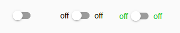

### Editor-Einstellungen
Einstellungen, die in der folgenden Tabelle nicht aufgeführt sind, sind selbsterklärend.

<table><thead><tr><th>Bildschirmfoto</th><th> Rahmen</th><th> Beschreibung </th></tr></thead><tbody><tr><td rowspan=4></td><td> Art des Umschalters</td><td> Legen Sie fest, welcher Datenpunkttyp (Boolean oder Wert) umgeschaltet werden soll</td></tr><tr><td> Wert für aus</td><td> Legen Sie fest, bei welchem Wert der Schalter falsch ist</td></tr><tr><td> Wert für an</td><td> Legen Sie fest, bei welchem Wert der Schalter wahr ist</td></tr><tr><td> Zustand, wenn Wert ungleich &#39;Ein&#39;-Bedingung</td><td> Stellen Sie den Zustand des Schalters ein, wenn der Wert nicht der Bedingung &#39;Ein&#39; entspricht</td></tr></tbody></table>

### HTML-Eigenschaften
Die folgenden Eigenschaften können als [HTML-Widgets](#html-widgets) verwendet werden.

<table><thead><tr><th>Eigentum</th><th> Beschreibung</th><th> Art</th><th> Werte </th></tr></thead><tbody><tr><td colspan="4" style="background: #44739e; color: white; border-color: #44739e;"> <i><b><br>Verbreitet</b></i></td></tr><tr><td> mdw-oid</td><td> Objekt Identifikation</td><td> Schnur</td><td></tr><tr><td> mdw-readOnly</td><td> schreibgeschützt</td><td> boolesch</td><td> falsch | wahr</tr><tr><td> mdw-toggleType</td><td> Art des Umschalters</td><td> Schnur</td><td> boolesch | Wert</tr><tr><td> mdw-WertAus</td><td> Wert für aus</td><td> Schnur</td><td></tr><tr><td> mdw-WertEin</td><td> Wert für an</td><td> Schnur</td><td></tr><tr><td> mdw-stateIfNotTrueValue</td><td> Zustand, wenn Wert ungleich &#39;Ein&#39;-Bedingung</td><td> Schnur</td><td> auf | aus</tr><tr><td> mdw-vibrateOnMobilDevices</td><td> vibrieren auf mobilen Geräten [s]</td><td> Nummer</td><td></tr><tr><td> mdw-debug</td><td> debuggen</td><td> boolesch</td><td> falsch | wahr</tr><tr><td colspan="4" style="background: #44739e; color: white; border-color: #44739e;"> <i><b><br>Beschriftung</b></i></td></tr><tr><td> mdw-labelFalse</td><td> Label falsch</td><td> Schnur</td><td></tr><tr><td> mdw-labelTrue</td><td> Label wahr</td><td> Schnur</td><td></tr><tr><td> mdw-labelPosition</td><td> labelPosition</td><td> Schnur</td><td> links | richtig | aus</tr><tr><td> mdw-labelClickActive</td><td> Label-Klick aktivieren</td><td> boolesch</td><td> falsch | wahr</tr><tr><td> mdw-WertFontFamily</td><td> valueFontFamily</td><td> Schnur</td><td></tr><tr><td> mdw-WertFontSize</td><td> Wert Schriftgröße</td><td> Nummer</td><td></tr><tr><td colspan="4" style="background: #44739e; color: white; border-color: #44739e;"><i><b><br>Farben</b></i></td></tr><tr><td> mdw-colorSwitchThumb</td><td> Daumenfarbe des Schalters</td><td> Schnur</td><td> hex(#44739e), rgb(20, 50, 200), rgba(20, 50, 200, 0,5)</tr><tr><td> mdw-colorSwitchTrack</td><td> Gleisfarbe der Weiche</td><td> Schnur</td><td> hex(#44739e), rgb(20, 50, 200), rgba(20, 50, 200, 0,5)</tr><tr><td> mdw-colorSwitchTrue</td><td> aktive Schalterfarbe switch</td><td> Schnur</td><td> hex(#44739e), rgb(20, 50, 200), rgba(20, 50, 200, 0,5)</tr><tr><td> mdw-colorSwitchHover</td><td> Hover-Farbe des Schalters</td><td> Schnur</td><td> hex(#44739e), rgb(20, 50, 200), rgba(20, 50, 200, 0,5)</tr><tr><td> mdw-colorSwitchHoverTrue</td><td> aktive Schalterfarbe ausgewählt / schweben</td><td> Schnur</td><td> hex(#44739e), rgb(20, 50, 200), rgba(20, 50, 200, 0,5)</tr><tr><td> mdw-labelColorFalse</td><td> Etikettenfarbe</td><td> Schnur</td><td> hex(#44739e), rgb(20, 50, 200), rgba(20, 50, 200, 0,5)</tr><tr><td> mdw-labelColorTrue</td><td> aktive Etikettenfarbe</td><td> Schnur</td><td> hex(#44739e), rgb(20, 50, 200), rgba(20, 50, 200, 0,5)</tr><tr><td colspan="4" style="background: #44739e; color: white; border-color: #44739e;"> <i><b><br>Verriegelung</b></i></td></tr><tr><td> mdw-lockEnabled</td><td> Sperren aktivieren</td><td> boolesch</td><td> falsch | wahr</tr><tr><td> mdw-autoLockAfter</td><td> automatische Sperrung nach [s]</td><td> Nummer</td><td></tr><tr><td> mdw-lockIcon</td><td> Symbol</td><td> Schnur</td><td></tr><tr><td> mdw-lockIconTop</td><td> Symbolabstand von oben [%]</td><td> Nummer</td><td></tr><tr><td> mdw-lockIconLeft</td><td> Symbolabstand von links [%]</td><td> Nummer</td><td></tr><tr><td> mdw-lockIconSize</td><td> Symbolgröße</td><td> Nummer</td><td></tr><tr><td> mdw-lockIconColor</td><td> Symbolfarbe</td><td> Schnur</td><td> hex(#44739e), rgb(20, 50, 200), rgba(20, 50, 200, 0,5)</tr><tr><td> mdw-lockFilterGraustufen</td><td> grauer Filter wenn gesperrt</td><td> Nummer</td><td></tr></tbody></table>

<!-- im Inhaltsverzeichnis weglassen -->

#### HTML-Eigenschaften - Beispiel
<details>

```
<div class='vis-widget materialdesign-widget materialdesign-switch materialdesign-switch-html-element'
	style='width: 100%; height: 50px; position: relative; overflow: visible !important; display: flex; align-items: center;'
	mdw-debug='false'
	mdw-oid='0_userdata.0.bool'
	mdw-toggleType='boolean'
	mdw-stateIfNotTrueValue='on'
	mdw-vibrateOnMobilDevices='50'
	mdw-labelFalse='off'
	mdw-labelTrue='on'
	mdw-labelPosition='right'
	mdw-labelClickActive='true'
	mdw-valueFontFamily='#mdwTheme:vis-materialdesign.0.fonts.switch.value'
	mdw-valueFontSize='#mdwTheme:vis-materialdesign.0.fontSizes.switch.value'
	mdw-colorSwitchThumb='#mdwTheme:vis-materialdesign.0.colors.switch.off'
	mdw-colorSwitchTrack='#mdwTheme:vis-materialdesign.0.colors.switch.track'
	mdw-colorSwitchTrue='#mdwTheme:vis-materialdesign.0.colors.switch.on'
	mdw-colorSwitchHover='#mdwTheme:vis-materialdesign.0.colors.switch.off_hover'
	mdw-colorSwitchHoverTrue='#mdwTheme:vis-materialdesign.0.colors.switch.on_hover'
	mdw-labelColorFalse='#mdwTheme:vis-materialdesign.0.colors.switch.text_off'
	mdw-labelColorTrue='#mdwTheme:vis-materialdesign.0.colors.switch.text_on'
	mdw-autoLockAfter='10'
	mdw-lockIconTop='5'
	mdw-lockIconLeft='5'
	mdw-lockIconColor='#mdwTheme:vis-materialdesign.0.colors.switch.lock_icon'
	mdw-lockFilterGrayscale='30'
></div>
```

</details>

## Wert


Als HTML-Widget kann es als Alternative für Bindings verwendet werden, da es eine bessere Performance bietet.

### Editor-Einstellungen
Einstellungen, die in der folgenden Tabelle nicht aufgeführt sind, sind selbsterklärend.

<table><thead><tr><th>Bildschirmfoto</th><th> Rahmen</th><th> Beschreibung </th></tr></thead><tbody><tr><td rowspan=2></td><td> Zieltyp</td><td> Wenn Sie in einen anderen Typ konvertieren möchten, wählen Sie den Zieltyp aus, in den konvertiert werden soll.</td></tr><tr><td> Text überschreiben</td><td> den Werttext überschreiben. Sie können <code>#value</code> , um den Wert im Text anzuzeigen</td></tr><tr><td rowspan=3></td><td> Schriftfarbe</td><td> Definieren Sie die Farbe des Textes. Zusätzlich ist es möglich, <code>#value</code> für Bedingungen zu verwenden, um je nach Wert des Datenpunkts unterschiedliche Farben anzuzeigen. Zulässiger Ausdruck siehe <a href="https://mathjs.org/docs/expressions/syntax.html#operators" _target="blank">mathematische Auswertungsausdrücke</a></td></tr><tr><td> Farbe des Textes vorgefertigt</td><td> Definieren Sie die Farbe des Textes. Zusätzlich ist es möglich, <code>#value</code> für Bedingungen zu verwenden, um je nach Wert des Datenpunkts unterschiedliche Farben anzuzeigen. Zulässiger Ausdruck siehe <a href="https://mathjs.org/docs/expressions/syntax.html#operators" _target="blank">mathematische Auswertungsausdrücke</a></td></tr><tr><td> Farbe des angehängten Textes</td><td> Definieren Sie die Farbe des Textes. Zusätzlich ist es möglich, <code>#value</code> für Bedingungen zu verwenden, um je nach Wert des Datenpunkts unterschiedliche Farben anzuzeigen. Zulässiger Ausdruck siehe <a href="https://mathjs.org/docs/expressions/syntax.html#operators" _target="blank">mathematische Auswertungsausdrücke</a></td></tr><tr><td rowspan=3></td><td> Berechnung</td><td> Verwenden Sie <code>#value</code> für den Wert des Datenpunkts und konvertieren Sie ihn durch Berechnung mit <a href="https://mathjs.org/docs/expressions/syntax.html#operators" _target="blank">mathematischen Auswertungsausdrücken</a></td></tr><tr><td> Sekunden in Dauer umrechnen</td><td> Wandeln Sie eine Dauer in Sekunden in eine lesbare Zeichenfolge um. Freigegebene Formate müssen entsprechend der <a href="https://github.com/jsmreese/moment-duration-format#template-string">Moment-Dauer-Formatbibliothek eingetragen werden</a> . Sie können auch <code>humanize</code> .<br><br> Es ist auch möglich, dies mit der Berechnung zu kombinieren, z. B. wenn der Quellwert in Minuten angegeben ist, können Sie ihn mithilfe von Berechnung in Sekunden umrechnen</td></tr><tr><td> Zeitstempel in Datum/Uhrzeit konvertieren</td><td> Konvertieren Sie einen Zeitstempel in eine lesbare Datumszeit. Genehmigte Formate müssen gemäß der <a href="https://momentjs.com/docs/#/displaying/format/">momentjs-</a> Bibliothek eingegeben werden.<br><br> Es ist auch möglich, dies mit der Berechnung zu kombinieren</td></tr><tr><td rowspan=1></td><td> Bedingung</td><td> Verwenden Sie <code>#value</code> für den Wert des Datenpunkts und Bedingungen, um andere Typen mithilfe der <a href="https://mathjs.org/docs/expressions/syntax.html#operators" _target="blank">mathematischen Auswertungsausdrücke in Boolean zu formatieren</a></td></tr><tr><td rowspan=2></td><td> Bild</td><td> Wählen Sie ein Materialdesignicon oder ein Bild aus. Zusätzlich ist es möglich, <code>#value</code> für Bedingungen zu verwenden, um je nach Wert des Datenpunktes verschiedene Bilder / Icons anzuzeigen. Zulässiger Ausdruck siehe <a href="https://mathjs.org/docs/expressions/syntax.html#operators" _target="blank">mathematische Auswertungsausdrücke</a></td></tr><tr><td> Bildfarbe</td><td> Definieren Sie die Farbe des Materialdesignicons. Zusätzlich ist es möglich, <code>#value</code> für Bedingungen zu verwenden, um je nach Wert des Datenpunkts unterschiedliche Farben anzuzeigen. Zulässiger Ausdruck siehe <a href="https://mathjs.org/docs/expressions/syntax.html#operators" _target="blank">mathematische Auswertungsausdrücke</a></td></tr></tbody></table>

### HTML-Eigenschaften
Die folgenden Eigenschaften können als [HTML-Widgets](#html-widgets) verwendet werden.

<table><thead><tr><th>Eigentum</th><th> Beschreibung</th><th> Art</th><th> Werte </th></tr></thead><tbody><tr><td colspan="4" style="background: #44739e; color: white; border-color: #44739e;"> <i><b><br>Verbreitet</b></i></td></tr><tr><td> mdw-oid</td><td> Objekt Identifikation</td><td> Schnur</td><td></tr><tr><td> mdw-targetType</td><td> Zieltyp</td><td> Schnur</td><td> automatisch | Nummer | Zeichenfolge | boolesch</tr><tr><td> mdw-overrideText</td><td> Text überschreiben</td><td> Schnur</td><td></tr><tr><td> mdw-debug</td><td> debuggen</td><td> boolesch</td><td> falsch | wahr</tr><tr><td colspan="4" style="background: #44739e; color: white; border-color: #44739e;"> <i><b><br>Layout</b></i></td></tr><tr><td> mdw-textAlign</td><td> Textausrichtung</td><td> Schnur</td><td> starten | Zentrum | Ende</tr><tr><td> mdw-WerteFontColor</td><td> Schriftfarbe</td><td> Schnur</td><td> hex(#44739e), rgb(20, 50, 200), rgba(20, 50, 200, 0,5)</tr><tr><td> mdw-WerteFontFamily</td><td> Schriftart</td><td> Schnur</td><td></tr><tr><td> mdw-WerteFontSize</td><td> Schriftgröße</td><td> Nummer</td><td></tr><tr><td> mdw-prepandText</td><td> Text vorgefertigt text</td><td> Schnur</td><td></tr><tr><td> mdw-prepandTextColor</td><td> Farbe des Textes vorgefertigt</td><td> Schnur</td><td> hex(#44739e), rgb(20, 50, 200), rgba(20, 50, 200, 0,5)</tr><tr><td> mdw-prepandTextFontFamily</td><td> Schriftart des Textes vorgefertigt</td><td> Schnur</td><td></tr><tr><td> mdw-prepandTextFontSize</td><td> Größe Text vorgefertigt</td><td> Nummer</td><td></tr><tr><td> mdw-appendText</td><td> angehängter Text</td><td> Schnur</td><td></tr><tr><td> mdw-appendTextColor</td><td> Farbe des angehängten Textes</td><td> Schnur</td><td> hex(#44739e), rgb(20, 50, 200), rgba(20, 50, 200, 0,5)</tr><tr><td> mdw-appendTextFontFamily</td><td> Schriftart des angehängten Textes</td><td> Schnur</td><td></tr><tr><td> mdw-appendTextFontSize</td><td> Schriftgröße des angehängten Textes</td><td> Nummer</td><td></tr><tr><td colspan="4" style="background: #44739e; color: white; border-color: #44739e;"><i><b><br>Zahlenformatierung</b></i></td></tr><tr><td> mdw-valueLabelUnit</td><td> Einheit</td><td> Schnur</td><td></tr><tr><td> mdw-minDezimalzahlen</td><td> minimale Dezimalstellen</td><td> Nummer</td><td></tr><tr><td> mdw-maxDezimalzahlen</td><td> maximale Dezimalstellen</td><td> Nummer</td><td></tr><tr><td> mdw-berechnen</td><td> Berechnung</td><td> Schnur</td><td></tr><tr><td> mdw-convertToDuration</td><td> in Dauer umwandeln</td><td> Text</td><td></tr><tr><td colspan="4" style="background: #44739e; color: white; border-color: #44739e;"><i><b><br>Boolesche Formatierung</b></i></td></tr><tr><td> mdw-textOnTrue</td><td> Text wenn wahr</td><td> Schnur</td><td></tr><tr><td> mdw-textOnFalse</td><td> Text wenn falsch</td><td> Schnur</td><td></tr><tr><td> mdw-Zustand</td><td> Bedingung</td><td> Schnur</td><td></tr><tr><td colspan="4" style="background: #44739e; color: white; border-color: #44739e;"><i><b><br>Symbol</b></i></td></tr><tr><td> mdw-Bild</td><td> Bild</td><td> Schnur</td><td></tr><tr><td> mdw-imageColor</td><td> Bildfarbe</td><td> Schnur</td><td> hex(#44739e), rgb(20, 50, 200), rgba(20, 50, 200, 0,5)</tr><tr><td> mdw-iconPosition</td><td> Bildposition</td><td> Schnur</td><td> links | Recht</tr><tr><td> mdw-iconHeight</td><td> Bildhöhe</td><td> Nummer</td><td></tr><tr><td colspan="4" style="background: #44739e; color: white; border-color: #44739e;"><i><b><br>Wertänderungseffekt</b></i></td></tr><tr><td> mdw-changeEffectEnabled</td><td> aktiviert</td><td> boolesch</td><td> falsch | wahr</tr><tr><td> mdw-effectFontColor</td><td> Schriftfarbe</td><td> Schnur</td><td> hex(#44739e), rgb(20, 50, 200), rgba(20, 50, 200, 0,5)</tr><tr><td> mdw-effectFontSize</td><td> Schriftgröße</td><td> Nummer</td><td></tr><tr><td> mdw-EffektDauer</td><td> Wirkungsdauer</td><td> Nummer</td><td></tr></tbody></table>

<!-- im Inhaltsverzeichnis weglassen -->

#### HTML-Eigenschaften - Beispiel
<details>

```
<div class='vis-widget materialdesign-widget materialdesign-value materialdesign-value-html-element'
	style='width: 218px; height: 30px; position: relative; display: flex; align-items: center;'
	mdw-debug='false'
	mdw-oid='0_userdata.0.MDW.Value.number'
	mdw-targetType='auto'
	mdw-textAlign='start'
	mdw-valuesFontColor='#mdwTheme:vis-materialdesign.0.colors.value.text'
	mdw-valuesFontFamily='#mdwTheme:vis-materialdesign.0.fonts.value.text'
	mdw-valuesFontSize='#mdwTheme:vis-materialdesign.0.fontSizes.value.text'
	mdw-prepandText='aktuelle Leistung:'
	mdw-prepandTextColor='#mdwTheme:vis-materialdesign.0.colors.value.prepand'
	mdw-prepandTextFontFamily='#mdwTheme:vis-materialdesign.0.fonts.value.prepand'
	mdw-prepandTextFontSize='#mdwTheme:vis-materialdesign.0.fontSizes.value.prepand'
	mdw-appendTextColor='#mdwTheme:vis-materialdesign.0.colors.value.append'
	mdw-appendTextFontFamily='#mdwTheme:vis-materialdesign.0.fonts.value.append'
	mdw-appendTextFontSize='#mdwTheme:vis-materialdesign.0.fontSizes.value.append'
	mdw-valueLabelUnit='W'
	mdw-image='power-plug'
	mdw-imageColor='#mdwTheme:vis-materialdesign.0.colors.value.icon'
	mdw-iconPosition='left'
	mdw-changeEffectEnabled='true'
	mdw-effectFontColor='#00e640'
	mdw-effectFontSize='20'
	mdw-effectDuration='1000'
></div>
```

</details>

## HTML-Karte
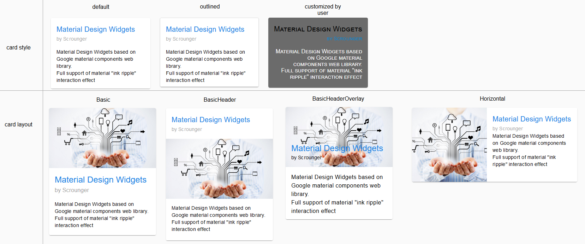

## Aufführen
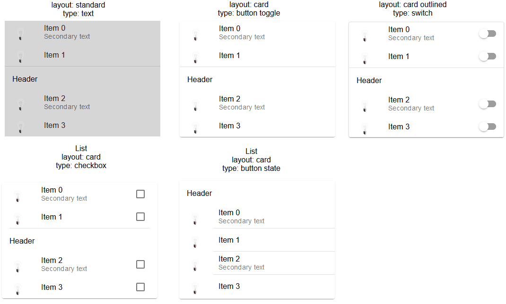

### Editor-Einstellungen
Einstellungen, die in der folgenden Tabelle nicht aufgeführt sind, sind selbsterklärend.

<table><thead><tr><th>Bildschirmfoto</th><th> Rahmen</th><th> Beschreibung </th></tr></thead><tbody><tr><td rowspan=4></td><td> Art der Liste</td><td> Steuerelementtyp der Liste wie Kontrollkästchen, Schaltflächenstatus, Schaltflächenumschaltung usw.</td></tr><tr><td> Teiler-Stil</td><td> Stil des Teilers</td></tr><tr><td> Layout</td><td> Standard- oder Kartenlayout</td></tr><tr><td> Leiste anzeigen</td><td> Bildlaufleiste anzeigen, falls erforderlich</td></tr><tr><td rowspan=4></td><td> Eingabemethode für die Listendaten</td><td> Verwenden Sie den Editor oder einen Json-String, um die Elemente zu definieren</td></tr><tr><td> Editor: Anzahl der Listenelemente</td><td> Anzahl der Listenelemente mit dem Editor</td></tr><tr><td> JSON-String: Objekt-ID</td><td> Objekt-ID des Datenpunkts, der die Json-Zeichenfolge enthält. Zulässige Eigenschaften werden unten beschrieben</td></tr></tbody></table>

### Daten-JSON-Eigenschaften
<table><thead><tr><th>Eigentum</th><th> Beschreibung</th><th> Art</th><th> Werte</th></tr></thead><tbody><tr><td> Objekt Identifikation</td><td> ID des Datenpunkts</td><td> Schnur</td><td></td></tr><tr><td> buttonStateValue</td><td> Wert für Schaltfläche, wenn Liste vom Typ Schaltflächenstatus ist</td><td> Schnur</td><td></td></tr><tr><td> SchaltflächeNavView</td><td> Ansicht für Schaltfläche, wenn die Liste vom Typ Schaltflächennavigation stammt</td><td> Schnur</td><td></td></tr><tr><td> SchaltflächeLink</td><td> Linkadresse für Schaltfläche, wenn die Liste vom Typ Schaltflächenlink ist</td><td> Schnur</td><td></td></tr><tr><td> Header</td><td> Kopftext des Artikels</td><td> Schnur</td><td></td></tr><tr><td> Text</td><td> Primärtext</td><td> Schnur</td><td></td></tr><tr><td> Untertext</td><td> Sekundärtext</td><td> Schnur</td><td></td></tr><tr><td> richtigText</td><td> primärer rechter text</td><td> Schnur</td><td></td></tr><tr><td> rightSubText</td><td> sekundärrechter Text</td><td> Schnur</td><td></td></tr><tr><td> Bild</td><td> Materialdesign-Symbol oder Bildpfad</td><td> Schnur</td><td></td></tr><tr><td> BildFarbe</td><td> Farbe des Symbols für Materialdesign</td><td> Schnur</td><td> hex(#44739e), rgb(20, 50, 200), rgba(20, 50, 200, 0,5)</td></tr><tr><td> BildAktiv</td><td> Materialdesign-Symbol oder Bildpfad, wenn Datenpunkt aktiv ist</td><td> Schnur</td><td></td></tr><tr><td> imageActiveColor</td><td> Farbe des Materialdesign-Symbols, wenn Datenpunkt aktiv ist</td><td> Schnur</td><td> hex(#44739e), rgb(20, 50, 200), rgba(20, 50, 200, 0,5)</td></tr><tr><td> showDivider</td><td> Teiler anzeigen</td><td> boolesch</td><td> falsch | wahr</td></tr><tr><td> listOverflow</td><td> Spaltenbreite automatisch an Wert anpassen</td><td> boolesch</td><td> falsch | wahr</td></tr></tbody></table>

<!-- im Inhaltsverzeichnis weglassen -->

#### JSON-Eigenschaften - Beispiel
<details> <pre><code> [ { "text": "item0", "subText": "{0_userdata.0.MDW.list.bind0}", "rightText": "right", "rightSubText": "", "image": "clock-check-outline", "imageColor": "#44739e", "imageActive": "", "imageActiveColor": "", "header": "JSON", "showDivider": "false", "objectId": "0_userdata.0.MDW.list.bool.val0", "buttonStateValue": "", "buttonNavView": "", "buttonLink": "", "listOverflow": false }, { "text": "item1", "subText": "{0_userdata.0.MDW.list.bind1}", "rightText": "right", "rightSubText": "", "image": "clock-check-outline", "imageColor": "#44739e", "imageActive": "", "imageActiveColor": "", "header": "", "showDivider": "false", "objectId": "0_userdata.0.MDW.list.bool.val1", "buttonStateValue": "", "buttonNavView": "", "buttonLink": "", "listOverflow": false }, { "text": "item2", "subText": "", "rightText": "right", "rightSubText": "", "image": "clock-check-outline", "imageColor": "#44739e", "imageActive": "", "imageActiveColor": "", "header": "", "showDivider": "false", "objectId": "0_userdata.0.MDW.list.bool.val2", "buttonStateValue": "", "buttonNavView": "", "buttonLink": "", "listOverflow": false }, { "text": "item3", "subText": "fuuuu", "rightText": "right", "rightSubText": "", "image": "clock-check-outline", "imageColor": "#44739e", "imageActive": "", "imageActiveColor": "", "header": "", "showDivider": "false", "objectId": "0_userdata.0.MDW.list.bool.val3", "buttonStateValue": "", "buttonNavView": "", "buttonLink": "", "listOverflow": false } ] </code></pre> </details>

## Symbolliste
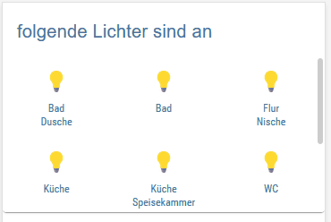

### Editor-Einstellungen
Einstellungen, die in der folgenden Tabelle nicht aufgeführt sind, sind selbsterklärend.

<table><thead><tr><th>Bildschirmfoto</th><th> Rahmen</th><th> Beschreibung </th></tr></thead><tbody><tr><td rowspan=6></td><td> Eingabemethode für die Listendaten</td><td> Die Daten für die IconList können über den Editor eingegeben oder ein JSON-String verwendet werden</td></tr><tr><td> Editor: Anzahl der Listenelemente</td><td> Anzahl der Listenelemente mit vis Editor für die Daten der Liste</td></tr><tr><td> JSON-String: Objekt-ID</td><td> Objekt-ID des Datenpunkts, der die Json-Zeichenfolge enthält. Zulässige Eigenschaften werden unten beschrieben</td></tr></tbody></table>

### Daten-JSON-Eigenschaften
Der JSON-String muss ein Array von Objekten mit den folgenden Eigenschaften sein:

<table><thead><tr><th>Eigentum</th><th> Beschreibung</th><th> Art</th><th> Werte</th></tr></thead><tbody><tr><td> Listentyp</td><td> Art der Liste<ul><li> buttonToggleValueTrue: ist nur eingeschaltet, wenn der Wert der Bedingung &#39;on&#39; entspricht</li><li> buttonToggleValueFalse: ist nur aus, wenn der Wert der Bedingung &#39;off&#39; entspricht</li></ul></td><td> Schnur</td><td> Text | buttonState | buttonToggle | buttonToggleValueTrue | buttonToggleValueFalse | buttonNav | SchaltflächeLink</td></tr><tr><td> Objekt Identifikation</td><td> Objekt-ID für Schaltfläche</td><td> Schnur</td><td/></tr><tr><td> minBreite</td><td> Mindestbreite für Artikel</td><td> Schnur</td><td> 30px | 60%</td></tr><tr><td> usePercentOfRow</td><td> Artikelverwendung x Prozent der Zeile.</td><td> Nummer</td><td> 0 = automatisch</td></tr><tr><td> buttonStateValue</td><td> Wert für Schaltflächenstatus</td><td> Schnur</td><td/></tr><tr><td> SchaltflächeNavView</td><td> zum Navigieren anzeigen</td><td> Schnur</td><td/></tr><tr><td> SchaltflächeLink</td><td> URL zum Navigieren</td><td> Schnur</td><td/></tr><tr><td> buttonToggleValueTrue</td><td> wahrer Wert für Schaltflächenumschaltung</td><td> Schnur</td><td/></tr><tr><td> buttonToggleValueFalse</td><td> falscher Wert für Schaltfläche Toggle</td><td> Schnur</td><td/></tr><tr><td> schreibgeschützt</td><td> Schaltfläche ist schreibgeschützt</td><td> boolesch</td><td> falsch | wahr</td></tr><tr><td> showValueLabel</td><td> Wert als Text anzeigen</td><td> boolesch</td><td> falsch | wahr</td></tr><tr><td> WertAnhang</td><td> Text an Wert anhängen</td><td> Schnur</td><td/></tr><tr><td> Hintergrund</td><td> Hintergrundfarbe</td><td> Schnur</td><td> hex(#44739e), rgb(20, 50, 200), rgba(20, 50, 200, 0,5)</td></tr><tr><td> Text</td><td> Text</td><td> Schnur</td><td/></tr><tr><td> Untertext</td><td> zweiter Text</td><td> Schnur</td><td/></tr><tr><td> Bild</td><td> Bildpfad oder Name von Material Design Icons</td><td> Schnur</td><td/></tr><tr><td> BildFarbe</td><td> Farbe von Material Design Icons</td><td> Schnur</td><td> hex(#44739e), rgb(20, 50, 200), rgba(20, 50, 200, 0,5)</td></tr><tr><td> BildAktiv</td><td> Bildpfad oder Name von Material Design Icons</td><td> Schnur</td><td/></tr><tr><td> imageActiveColor</td><td> Bildpfad oder Name von Material Design Icons für aktive Schaltfläche</td><td> Schnur</td><td> hex(#44739e), rgb(20, 50, 200), rgba(20, 50, 200, 0,5)</td></tr><tr><td> SchaltflächeHintergrundfarbe</td><td> Hintergrundfarbe der Schaltfläche</td><td> Schnur</td><td> hex(#44739e), rgb(20, 50, 200), rgba(20, 50, 200, 0,5)</td></tr><tr><td> SchaltflächeHintergrundActiveColor</td><td> Hintergrundfarbe des Buttons für den aktiven Button</td><td> Schnur</td><td> hex(#44739e), rgb(20, 50, 200), rgba(20, 50, 200, 0,5)</td></tr><tr><td> statusBarColor</td><td> Farbe der Statusleiste</td><td> Schnur</td><td> hex(#44739e), rgb(20, 50, 200), rgba(20, 50, 200, 0,5)</td></tr><tr><td> statusBarText</td><td> Text der Statusleiste</td><td> Schnur</td><td/></tr><tr><td> lockEnabled</td><td> Sperren aktivieren</td><td> boolesch</td><td> falsch | wahr</td></tr><tr><td> SichtbarkeitOid</td><td> Objekt-ID für Sichtbarkeit</td><td> Schnur</td><td/></tr><tr><td> SichtbarkeitBedingung</td><td> Sichtbedingungen</td><td> Schnur</td><td> == | != | &lt;= | &gt;= | &lt; | &gt; | bestehen | nicht bestehen | existieren | nicht existieren</td></tr><tr><td> SichtbarkeitConditionValue</td><td> Wert für Sichtbarkeitsbedingung</td><td> Schnur</td><td/></tr></tbody></table>

<!-- im Inhaltsverzeichnis weglassen -->

#### JSON-Eigenschaften - Beispiel
<details> <pre><code> [ { "background": "red", "text": "text1", "subText": "number", "image": "harddisk", "imageColor": "#ec0909", "imageActive": "folder", "imageActiveColor": "#5ad902", "buttonBackgroundColor": "", "buttonBackgroundActiveColor": "", "listType": "buttonState", "objectId": "0_userdata.0.iconList.buttonState.number", "buttonStateValue": "60", "buttonNavView": "", "buttonLink": "", "buttonToggleValueTrue": "", "buttonToggleValueFalse": "", "valueAppendix": "", "showValueLabel": "true", "statusBarColor": "green", "lockEnabled": "false" }, { "background": "green", "text": "text0", "subText": "bool", "image": "home", "imageColor": "#44739e", "imageActive": "home", "imageActiveColor": "#44739e", "buttonBackgroundColor": "", "buttonBackgroundActiveColor": "#a0f628", "listType": "buttonToggle", "objectId": "0_userdata.0.iconList.buttonToggle.bool0", "buttonStateValue": "60", "buttonNavView": "", "buttonLink": "", "buttonToggleValueTrue": "", "buttonToggleValueFalse": "", "valueAppendix": "", "showValueLabel": "false", "statusBarColor": "", "lockEnabled": "false" } ] </code></pre> </details>

## Fortschritt
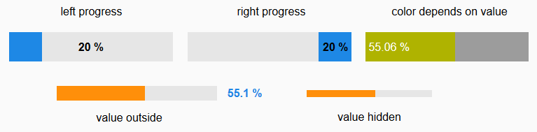

### Editor-Einstellungen
<table><thead><tr><th>Bildschirmfoto</th><th> Rahmen</th><th> Beschreibung </th></tr></thead><tbody><tr><td rowspan=2></td><td>Bedingung für Farbe 1 Fortschritt [&gt;]</td><td> Zustand ab wann Farbe 1 verwendet werden soll. Der Wert der Bedingung muss in Prozent angegeben werden</td></tr><tr><td> Bedingung für Farbe 2 Fortschritt [&gt;]</td><td> Zustand ab wann Farbe 2 verwendet werden soll. Der Wert der Bedingung muss in Prozent angegeben werden</td></tr><tr><td rowspan=1></td><td> benutzerdefiniertes Etikett</td><td> Bei benutzerdefinierten Labels können Sie die Eigenschaft <code>[#value]</code> , um den tatsächlichen Wert des Datenpunkts anzuzeigen. Um den aktuellen <code>[#percent]</code></td></tr></tbody></table>

### HTML-Eigenschaften
Die folgenden Eigenschaften können als [HTML-Widgets](#html-widgets) verwendet werden.

<table><thead><tr><th>Eigentum</th><th> Beschreibung</th><th> Art</th><th> Werte</th></tr></thead><tbody><tr><td> mdw-Typ</td><td> Widget-Typ</td><td> Schnur</td><td> linear</td></tr><tr><td colspan="4" style="background: #44739e; color: white; border-color: #44739e;"> <i><b><br>Verbreitet</b></i></td></tr><tr><td> mdw-oid</td><td> Objekt Identifikation</td><td> Schnur</td><td></tr><tr><td> mdw-min</td><td> Mindest</td><td> Schnur</td><td></tr><tr><td> mdw-max</td><td> max</td><td> Schnur</td><td></tr><tr><td> mdw-fortschrittUnbestimmt</td><td> unbestimmt - ständig animiert</td><td> boolesch</td><td> falsch | wahr</tr><tr><td> mdw-rückwärts</td><td> Kehrt den Wert um</td><td> boolesch</td><td> falsch | wahr</tr><tr><td> mdw-debug</td><td> debuggen</td><td> boolesch</td><td> falsch | wahr</tr><tr><td colspan="4" style="background: #44739e; color: white; border-color: #44739e;"> <i><b><br>Layout</b></i></td></tr><tr><td> mdw-fortschrittAbgerundet</td><td> abgerundete Ecken</td><td> boolesch</td><td> falsch | wahr</tr><tr><td> mdw-progressGestreift</td><td> gestreift</td><td> boolesch</td><td> falsch | wahr</tr><tr><td> mdw-progressStripedColor</td><td> progressStripedColor</td><td> Schnur</td><td> hex(#44739e), rgb(20, 50, 200), rgba(20, 50, 200, 0,5)</tr><tr><td colspan="4" style="background: #44739e; color: white; border-color: #44739e;"> <i><b><br>Farben</b></i></td></tr><tr><td> mdw-colorProgressBackground</td><td> Hintergrundfarbe</td><td> Schnur</td><td> hex(#44739e), rgb(20, 50, 200), rgba(20, 50, 200, 0,5)</tr><tr><td> mdw-colorProgress</td><td> Farbverlauf</td><td> Schnur</td><td> hex(#44739e), rgb(20, 50, 200), rgba(20, 50, 200, 0,5)</tr><tr><td> mdw-colorOneCondition</td><td> Bedingung für Farbe 1 Fortschritt [&gt;]</td><td> Nummer</td><td></tr><tr><td> mdw-colorOne</td><td> Farbe 1 Fortschritt</td><td> Schnur</td><td> hex(#44739e), rgb(20, 50, 200), rgba(20, 50, 200, 0,5)</tr><tr><td> mdw-colorTwoCondition</td><td> Bedingung für Farbe 2 Fortschritt [&gt;]</td><td> Nummer</td><td></tr><tr><td> mdw-colorTwo</td><td> Farbe 2 Fortschritt</td><td> Schnur</td><td> hex(#44739e), rgb(20, 50, 200), rgba(20, 50, 200, 0,5)</tr><tr><td colspan="4" style="background: #44739e; color: white; border-color: #44739e;"> <i><b><br>Beschriftung</b></i></td></tr><tr><td> mdw-showValueLabel</td><td> Wert anzeigen</td><td> boolesch</td><td> falsch | wahr</tr><tr><td> mdw-valueLabelStyle</td><td> Stil für Wertunterschriften</td><td> Schnur</td><td> FortschrittProzent | progressWert | progressBenutzerdefiniert</tr><tr><td> mdw-valueLabelUnit</td><td> Einheit</td><td> Schnur</td><td></tr><tr><td> mdw-WertMaxDecimals</td><td> Dezimalpunkte</td><td> Nummer</td><td></tr><tr><td> mdw-valueLabelCustom</td><td> benutzerdefiniertes Etikett</td><td> Schnur</td><td></tr><tr><td> mdw-textColor</td><td> Textfarbe für Minuten</td><td> Schnur</td><td> hex(#44739e), rgb(20, 50, 200), rgba(20, 50, 200, 0,5)</tr><tr><td> mdw-textFontSize</td><td> Textgröße</td><td> Nummer</td><td></tr><tr><td> mdw-textFontFamily</td><td> Schriftart</td><td> Schnur</td><td></tr><tr><td> mdw-textAlign</td><td> Textausrichtung</td><td> Schnur</td><td> starten | Zentrum | Ende</tr></tbody></table>

<!-- im Inhaltsverzeichnis weglassen -->

#### HTML-Eigenschaften - Beispiel
<details>

```
<div class='vis-widget materialdesign-widget materialdesign-progress materialdesign-progress-html-element'
	style='width: 100%; height: 100%; position: relative; padding: 0px;'
	mdw-type='linear'
	mdw-oid='0_userdata.0.MDW.Progress.val0'
	mdw-debug='true'
	mdw-progressRounded='true'
	mdw-colorProgressBackground='#mdwTheme:vis-materialdesign.0.colors.progress.track_background'
	mdw-colorProgress='#mdwTheme:vis-materialdesign.0.colors.progress.track'
	mdw-colorOneCondition='50'
	mdw-colorOne='#mdwTheme:vis-materialdesign.0.colors.progress.track_condition1'
	mdw-colorTwoCondition='70'
	mdw-colorTwo='#mdwTheme:vis-materialdesign.0.colors.progress.track_condition2'
	mdw-showValueLabel='true'
	mdw-valueLabelStyle='progressPercent'
	mdw-textColor='#mdwTheme:vis-materialdesign.0.colors.progress.text'
	mdw-textFontSize='#mdwTheme:vis-materialdesign.0.fontSizes.progress.text'
	mdw-textFontFamily='#mdwTheme:vis-materialdesign.0.fonts.progress.text'
	mdw-textAlign='end'
></div>
```

</details>

##Fortschrittsrundschreiben


### Editor-Einstellungen
Einstellungen, die in der folgenden Tabelle nicht aufgeführt sind, sind selbsterklärend.

<table><thead><tr><th>Bildschirmfoto</th><th> Rahmen</th><th> Beschreibung </th></tr></thead><tbody><tr><td rowspan=2></td><td> Bedingung für Farbe 1 Fortschritt [&gt;]</td><td> Zustand ab wann Farbe 1 verwendet werden soll. Der Wert der Bedingung muss in Prozent angegeben werden</td></tr><tr><td> Bedingung für Farbe 2 Fortschritt [&gt;]</td><td> Zustand ab wann Farbe 2 verwendet werden soll. Der Wert der Bedingung muss in Prozent angegeben werden</td></tr><tr><td rowspan=6></td><td> benutzerdefiniertes Etikett</td><td> Bei benutzerdefinierten Labels können Sie die Eigenschaft <code>[#value]</code> , um den tatsächlichen Wert des Datenpunkts anzuzeigen. Um den aktuellen <code>[#percent]</code></td></tr></tbody></table>

### HTML-Eigenschaften
Die folgenden Eigenschaften können als [HTML-Widgets](#html-widgets) verwendet werden.

<table><thead><tr><th>Eigentum</th><th> Beschreibung</th><th> Art</th><th> Werte</th></tr></thead><tbody><tr><td> mdw-Typ</td><td> Widget-Typ</td><td> Schnur</td><td> linear</td></tr><tr><td colspan="4" style="background: #44739e; color: white; border-color: #44739e;"> <i><b><br>Verbreitet</b></i></td></tr><tr><td> mdw-oid</td><td> Objekt Identifikation</td><td> Schnur</td><td></tr><tr><td> mdw-min</td><td> Mindest</td><td> Schnur</td><td></tr><tr><td> mdw-max</td><td> max</td><td> Schnur</td><td></tr><tr><td> mdw-rückwärts</td><td> Kehrt den Wert um</td><td> boolesch</td><td> falsch | wahr</tr><tr><td> mdw-invertValue</td><td> Wert invertieren</td><td> boolesch</td><td> falsch | wahr</tr><tr><td> mdw-debug</td><td> debuggen</td><td> boolesch</td><td> falsch | wahr</tr><tr><td colspan="4" style="background: #44739e; color: white; border-color: #44739e;"> <i><b><br>Layout</b></i></td></tr><tr><td> mdw-fortschrittAbgerundet</td><td> abgerundete Ecken</td><td> boolesch</td><td> falsch | wahr</tr><tr><td> mdw-fortschrittUnbestimmt</td><td> unbestimmt - ständig animiert</td><td> boolesch</td><td> falsch | wahr</tr><tr><td> mdw-progressRotate</td><td> 90 Grad drehen</td><td> Schnur</td><td> neinDrehen | jaDrehen</tr><tr><td colspan="4" style="background: #44739e; color: white; border-color: #44739e;"> <i><b><br>group_layoutGestreift</b></i></td></tr><tr><td> mdw-progressGestreift</td><td> gestreift</td><td> boolesch</td><td> falsch | wahr</tr><tr><td> mdw-progressStripedColor</td><td> progressStripedColor</td><td> Schnur</td><td> hex(#44739e), rgb(20, 50, 200), rgba(20, 50, 200, 0,5)</tr><tr><td> mdw-stripWinkel</td><td> StreifenWinkel</td><td> Nummer</td><td></tr><tr><td colspan="4" style="background: #44739e; color: white; border-color: #44739e;"><i><b><br>Farben</b></i></td></tr><tr><td> mdw-colorProgressBackground</td><td> Hintergrundfarbe</td><td> Schnur</td><td> hex(#44739e), rgb(20, 50, 200), rgba(20, 50, 200, 0,5)</tr><tr><td> mdw-colorProgress</td><td> Farbverlauf</td><td> Schnur</td><td> hex(#44739e), rgb(20, 50, 200), rgba(20, 50, 200, 0,5)</tr><tr><td> mdw-colorOneCondition</td><td> Bedingung für Farbe 1 Fortschritt [&gt;]</td><td> Nummer</td><td></tr><tr><td> mdw-colorOne</td><td> Farbe 1 Fortschritt</td><td> Schnur</td><td> hex(#44739e), rgb(20, 50, 200), rgba(20, 50, 200, 0,5)</tr><tr><td> mdw-colorTwoCondition</td><td> Bedingung für Farbe 2 Fortschritt [&gt;]</td><td> Nummer</td><td></tr><tr><td> mdw-colorTwo</td><td> Farbe 2 Fortschritt</td><td> Schnur</td><td> hex(#44739e), rgb(20, 50, 200), rgba(20, 50, 200, 0,5)</tr><tr><td colspan="4" style="background: #44739e; color: white; border-color: #44739e;"> <i><b><br>Beschriftung</b></i></td></tr><tr><td> mdw-showValueLabel</td><td> Wert anzeigen</td><td> boolesch</td><td> falsch | wahr</tr><tr><td> mdw-valueLabelStyle</td><td> Stil für Wertunterschriften</td><td> Schnur</td><td> FortschrittProzent | progressWert | progressBenutzerdefiniert</tr><tr><td> mdw-valueLabelUnit</td><td> Einheit</td><td> Schnur</td><td></tr><tr><td> mdw-WertMaxDecimals</td><td> Dezimalpunkte</td><td> Nummer</td><td></tr><tr><td> mdw-valueLabelCustom</td><td> benutzerdefiniertes Etikett</td><td> Schnur</td><td></tr><tr><td> mdw-textColor</td><td> Textfarbe für Minuten</td><td> Schnur</td><td> hex(#44739e), rgb(20, 50, 200), rgba(20, 50, 200, 0,5)</tr><tr><td> mdw-textFontSize</td><td> Textgröße</td><td> Nummer</td><td></tr><tr><td> mdw-textFontFamily</td><td> Schriftart</td><td> Schnur</td><td></tr><tr><td> mdw-textAlign</td><td> Textausrichtung</td><td> Schnur</td><td> starten | Zentrum | Ende</tr></tbody></table>

<!-- im Inhaltsverzeichnis weglassen -->

#### HTML-Eigenschaften - Beispiel
<details>

```
<div class='vis-widget materialdesign-widget materialdesign-progress materialdesign-progress-html-element'
	style='width: 100%; height: 100%; position: relative; padding: 0px;'
	mdw-type='circular'
	mdw-oid='0_userdata.0.MDW.Progress.val1'
	mdw-colorProgressBackground='#mdwTheme:vis-materialdesign.0.colors.progress.track_background'
	mdw-colorProgress='#mdwTheme:vis-materialdesign.0.colors.progress.track'
	mdw-innerColor='#mdwTheme:vis-materialdesign.0.colors.progress.circular_background'
	mdw-colorOneCondition='50'
	mdw-colorOne='#mdwTheme:vis-materialdesign.0.colors.progress.track_condition1'
	mdw-colorTwoCondition='70'
	mdw-colorTwo='#mdwTheme:vis-materialdesign.0.colors.progress.track_condition2'
	mdw-showValueLabel='true'
	mdw-valueLabelStyle='progressPercent'
	mdw-textColor='#mdwTheme:vis-materialdesign.0.colors.progress.text'
	mdw-textFontSize='#mdwTheme:vis-materialdesign.0.fontSizes.progress.text'
	mdw-textFontFamily='#mdwTheme:vis-materialdesign.0.fonts.progress.text'
></div>
```

</details>

## Schieberegler
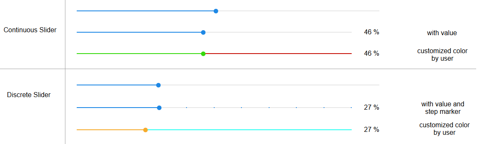

### HTML-Eigenschaften
Die folgenden Eigenschaften können als [HTML-Widgets](#html-widgets) verwendet werden.

<table><thead><tr><th>Eigentum</th><th> Beschreibung</th><th> Art</th><th> Werte </th></tr></thead><tbody><tr><td colspan="4" style="background: #44739e; color: white; border-color: #44739e;"> <i><b><br>Verbreitet</b></i></td></tr><tr><td> mdw-oid</td><td> Objekt Identifikation</td><td> Schnur</td><td></tr><tr><td> mdw-oid-working</td><td> Arbeitsobjekt-ID</td><td> Schnur</td><td></tr><tr><td> mdw-Orientierung</td><td> Orientierung</td><td> Schnur</td><td> horizontal | vertikal</tr><tr><td> mdw-reverseSlider</td><td> Schieberegler invertieren</td><td> boolesch</td><td> falsch | wahr</tr><tr><td> mdw-knobGröße</td><td> Knopfgröße</td><td> Schnur</td><td> KnopfKlein | KnopfMittel | KnopfGroß</tr><tr><td> mdw-readOnly</td><td> schreibgeschützt</td><td> boolesch</td><td> falsch | wahr</tr><tr><td> mdw-min</td><td> Mindest</td><td> Schnur</td><td></tr><tr><td> mdw-max</td><td> max</td><td> Schnur</td><td></tr><tr><td> mdw-Schritt</td><td> Schritte</td><td> Schnur</td><td></tr><tr><td> mdw-vibrateOnMobilDevices</td><td> vibrieren auf mobilen Geräten [s]</td><td> Nummer</td><td></tr><tr><td> mdw-debug</td><td> debuggen</td><td> boolesch</td><td> falsch | wahr</tr><tr><td colspan="4" style="background: #44739e; color: white; border-color: #44739e;"> <i><b><br>Schritte Layout</b></i></td></tr><tr><td> mdw-showTicks</td><td> Schritte anzeigen</td><td> Schnur</td><td> nein | ja | immer</tr><tr><td> mdw-tickGröße</td><td> Anzeigegröße der Schritte</td><td> Nummer</td><td></tr><tr><td> mdw-tickLabels</td><td> Text der Schritte (durch Kommas getrennt)</td><td> Schnur</td><td></tr><tr><td> mdw-tickTextColor</td><td> Textfarbe der Schritte</td><td> Schnur</td><td> hex(#44739e), rgb(20, 50, 200), rgba(20, 50, 200, 0,5)</tr><tr><td> mdw-tickFontFamily</td><td> Schriftart der Schritte</td><td> Schnur</td><td></tr><tr><td> mdw-tickFontSize</td><td> Schriftgröße</td><td> Nummer</td><td></tr><tr><td> mdw-tickColorBefore</td><td> Farbe vor dem Regler</td><td> Schnur</td><td> hex(#44739e), rgb(20, 50, 200), rgba(20, 50, 200, 0,5)</tr><tr><td> mdw-tickColorAfter</td><td> Farbe nach dem Regler</td><td> Schnur</td><td> hex(#44739e), rgb(20, 50, 200), rgba(20, 50, 200, 0,5)</tr><tr><td colspan="4" style="background: #44739e; color: white; border-color: #44739e;"> <i><b><br>Farben</b></i></td></tr><tr><td> mdw-colorBeforeThumb</td><td> Farbe vor Regler</td><td> Schnur</td><td> hex(#44739e), rgb(20, 50, 200), rgba(20, 50, 200, 0,5)</tr><tr><td> mdw-colorThumb</td><td> Farbe des Reglers</td><td> Schnur</td><td> hex(#44739e), rgb(20, 50, 200), rgba(20, 50, 200, 0,5)</tr><tr><td> mdw-colorAfterThumb</td><td> Farbe nach Regler</td><td> Schnur</td><td> hex(#44739e), rgb(20, 50, 200), rgba(20, 50, 200, 0,5)</tr><tr><td colspan="4" style="background: #44739e; color: white; border-color: #44739e;"> <i><b><br>Beschriftung</b></i></td></tr><tr><td> mdw-prepandText</td><td> Text vorgefertigt text</td><td> Schnur</td><td></tr><tr><td> mdw-prepandTextWidth</td><td> prepandTextWidth</td><td> Nummer</td><td></tr><tr><td> mdw-prepandTextColor</td><td> Farbe des Textes vorgefertigt</td><td> Schnur</td><td> hex(#44739e), rgb(20, 50, 200), rgba(20, 50, 200, 0,5)</tr><tr><td> mdw-prepandTextFontSize</td><td> Größe Text vorgefertigt</td><td> Nummer</td><td></tr><tr><td> mdw-prepandTextFontFamily</td><td> Schriftart des Textes vorgefertigt</td><td> Schnur</td><td></tr><tr><td> mdw-showValueLabel</td><td> Wert anzeigen</td><td> boolesch</td><td> falsch | wahr</tr><tr><td> mdw-valueLabelStyle</td><td> Stil für Wertunterschriften</td><td> Schnur</td><td> sliderProzent | sliderValue</tr><tr><td> mdw-valueLabelUnit</td><td> Einheit</td><td> Schnur</td><td></tr><tr><td> mdw-WertFontFamily</td><td> valueFontFamily</td><td> Schnur</td><td></tr><tr><td> mdw-WertFontSize</td><td> Wert Schriftgröße</td><td> Nummer</td><td></tr><tr><td> mdw-WertLabelColor</td><td> Textfarbe des Wertes</td><td> Schnur</td><td> hex(#44739e), rgb(20, 50, 200), rgba(20, 50, 200, 0,5)</tr><tr><td> mdw-WertLabelMin</td><td> Text für Wert kleiner als min</td><td> Schnur</td><td></tr><tr><td> mdw-WertLabelMax</td><td> Text für Wert größer als min</td><td> Schnur</td><td></tr><tr><td> mdw-WertWeniger als</td><td> &#39;kleiner als&#39;-Bedingung für den Text des Wertes</td><td> Nummer</td><td></tr><tr><td> mdw-textForValueLessThan</td><td> Text für &#39;kleiner als&#39;</td><td> Schnur</td><td></tr><tr><td> mdw-WertGrößer als</td><td> &#39;größer als&#39;-Bedingung für den Text des Wertes</td><td> Nummer</td><td></tr><tr><td> mdw-textForValueGreaterThan</td><td> Text für &#39;größer als&#39;</td><td> Schnur</td><td></tr><tr><td> mdw-valueLabelWidth</td><td> Entfernungsschild</td><td> Nummer</td><td></tr><tr><td colspan="4" style="background: #44739e; color: white; border-color: #44739e;"><i><b><br>Layout des Controller-Etiketts</b></i></td></tr><tr><td> mdw-showThumbLabel</td><td> Label anzeigen</td><td> Schnur</td><td> nein | ja | immer</tr><tr><td> mdw-Daumengröße</td><td> Etikettengröße</td><td> Nummer</td><td></tr><tr><td> mdw-thumbBackgroundColor</td><td> Hintergrundfarbe</td><td> Schnur</td><td> hex(#44739e), rgb(20, 50, 200), rgba(20, 50, 200, 0,5)</tr><tr><td> mdw-thumbFontColor</td><td> Schriftfarbe</td><td> Schnur</td><td> hex(#44739e), rgb(20, 50, 200), rgba(20, 50, 200, 0,5)</tr><tr><td> mdw-thumbFontSize</td><td> Schriftgröße</td><td> Nummer</td><td></tr><tr><td> mdw-thumbFontFamily</td><td> Schriftart</td><td> Schnur</td><td></tr><tr><td> mdw-useLabelRules</td><td> Regeln des Textes verwenden</td><td> boolesch</td><td> falsch | wahr</tr></tbody></table>

<!-- im Inhaltsverzeichnis weglassen -->

#### HTML-Eigenschaften - Beispiel
<details>

```
<div class='vis-widget materialdesign-widget materialdesign-slider-vertical materialdesign-slider-html-element'
	style='width: 342px; height: 100px; position: relative; overflow:visible !important; display: flex; align-items: center;'
	mdw-debug='false'
	mdw-oid='0_userdata.0.MDW.Slider.val0'
	mdw-oid-working='0_userdata.0.MDW.Slider.working'
	mdw-orientation='horizontal'
	mdw-knobSize='knobSmall'
	mdw-min='0'
	mdw-max='100'
	mdw-step='10'
	mdw-vibrateOnMobilDevices='50'
	mdw-showTicks='always'
	mdw-tickSize='5'
	mdw-tickLabels='1,2,3,4,5,6,7,8,9,10,11'
	mdw-tickTextColor='#mdwTheme:vis-materialdesign.0.colors.slider.tick'
	mdw-tickFontFamily='#mdwTheme:vis-materialdesign.0.fonts.slider.ticks'
	mdw-tickFontSize='#mdwTheme:vis-materialdesign.0.fontSizes.slider.ticks'
	mdw-tickColorBefore='#mdwTheme:vis-materialdesign.0.colors.slider.tick_before'
	mdw-tickColorAfter='#mdwTheme:vis-materialdesign.0.colors.slider.tick_after'
	mdw-colorBeforeThumb='#mdwTheme:vis-materialdesign.0.colors.slider.control_before'
	mdw-colorThumb='#mdwTheme:vis-materialdesign.0.colors.slider.control'
	mdw-colorAfterThumb='#mdwTheme:vis-materialdesign.0.colors.slider.control_behind'
	mdw-prepandText='prepand'
	mdw-prepandTextWidth='60'
	mdw-prepandTextColor='#mdwTheme:vis-materialdesign.0.colors.slider.text_prepand'
	mdw-prepandTextFontSize='#mdwTheme:vis-materialdesign.0.fontSizes.slider.prepand'
	mdw-prepandTextFontFamily='#mdwTheme:vis-materialdesign.0.fonts.slider.prepand'
	mdw-showValueLabel='true'
	mdw-valueLabelStyle='sliderPercent'
	mdw-valueFontFamily='#mdwTheme:vis-materialdesign.0.fonts.slider.value'
	mdw-valueFontSize='#mdwTheme:vis-materialdesign.0.fontSizes.slider.value'
	mdw-valueLabelColor='#mdwTheme:vis-materialdesign.0.colors.slider.text'
	mdw-valueLabelWidth='50'
	mdw-showThumbLabel='always'
	mdw-thumbBackgroundColor='#mdwTheme:vis-materialdesign.0.colors.slider.control_background'
	mdw-thumbFontColor='#mdwTheme:vis-materialdesign.0.colors.slider.control_text'
	mdw-thumbFontSize='#mdwTheme:vis-materialdesign.0.fontSizes.slider.control'
	mdw-thumbFontFamily='#mdwTheme:vis-materialdesign.0.fonts.slider.control'
></div>
```

</details>

## Schieberegler rund
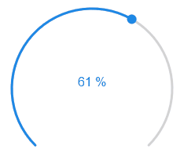

### HTML-Eigenschaften
Die folgenden Eigenschaften können als [HTML-Widgets](#html-widgets) verwendet werden.

<table><thead><tr><th>Eigentum</th><th> Beschreibung</th><th> Art</th><th> Werte </th></tr></thead><tbody><tr><td colspan="4" style="background: #44739e; color: white; border-color: #44739e;"> <i><b><br>Verbreitet</b></i></td></tr><tr><td> mdw-oid</td><td> Objekt Identifikation</td><td> Schnur</td><td></tr><tr><td> mdw-oid-working</td><td> Arbeitsobjekt-ID</td><td> Schnur</td><td></tr><tr><td> mdw-min</td><td> Mindest</td><td> Schnur</td><td></tr><tr><td> mdw-max</td><td> max</td><td> Schnur</td><td></tr><tr><td> mdw-Schritt</td><td> Schritte</td><td> Schnur</td><td></tr><tr><td> mdw-readOnly</td><td> schreibgeschützt</td><td> boolesch</td><td> falsch | wahr</tr><tr><td> mdw-startWinkel</td><td> Startwinkel</td><td> Nummer</td><td></tr><tr><td> mdw-arcLength</td><td> Bogenlänge</td><td> Nummer</td><td></tr><tr><td> mdw-sliderWidth</td><td> Schieberstärke</td><td> Nummer</td><td></tr><tr><td> mdw-handleGröße</td><td> Knopfgröße</td><td> Nummer</td><td></tr><tr><td> mdw-handleZoom</td><td> Drehknopf-Zoom an der Steuerung</td><td> Nummer</td><td></tr><tr><td> mdw-rtl</td><td> Schieberbewegung von rechts nach links</td><td> boolesch</td><td> falsch | wahr</tr><tr><td> mdw-vibrateOnMobilDevices</td><td> vibrieren auf mobilen Geräten [s]</td><td> Nummer</td><td></tr><tr><td> mdw-debug</td><td> debuggen</td><td> boolesch</td><td> falsch | wahr</tr><tr><td colspan="4" style="background: #44739e; color: white; border-color: #44739e;"> <i><b><br>Farben</b></i></td></tr><tr><td> mdw-colorSliderBg</td><td> Hintergrund</td><td> Schnur</td><td> hex(#44739e), rgb(20, 50, 200), rgba(20, 50, 200, 0,5)</tr><tr><td> mdw-colorBeforeThumb</td><td> Farbe vor Regler</td><td> Schnur</td><td> hex(#44739e), rgb(20, 50, 200), rgba(20, 50, 200, 0,5)</tr><tr><td> mdw-colorThumb</td><td> Farbe des Reglers</td><td> Schnur</td><td> hex(#44739e), rgb(20, 50, 200), rgba(20, 50, 200, 0,5)</tr><tr><td> mdw-colorAfterThumb</td><td> Farbe nach Regler</td><td> Schnur</td><td> hex(#44739e), rgb(20, 50, 200), rgba(20, 50, 200, 0,5)</tr><tr><td> mdw-WertLabelColor</td><td> Textfarbe des Wertes</td><td> Schnur</td><td> hex(#44739e), rgb(20, 50, 200), rgba(20, 50, 200, 0,5)</tr><tr><td colspan="4" style="background: #44739e; color: white; border-color: #44739e;"> <i><b><br>Beschriftung</b></i></td></tr><tr><td> mdw-showValueLabel</td><td> Wert anzeigen</td><td> boolesch</td><td> falsch | wahr</tr><tr><td> mdw-valueLabelVerticalPosition</td><td> vertikale Textposition des Wertes</td><td> Nummer</td><td></tr><tr><td> mdw-valueLabelStyle</td><td> Stil für Wertunterschriften</td><td> Schnur</td><td> sliderProzent | sliderValue</tr><tr><td> mdw-valueLabelUnit</td><td> Einheit</td><td> Schnur</td><td></tr><tr><td> mdw-WertFontFamily</td><td> valueFontFamily</td><td> Schnur</td><td></tr><tr><td> mdw-WertFontSize</td><td> Wert Schriftgröße</td><td> Nummer</td><td></tr><tr><td> mdw-WertLabelMin</td><td> Text für Wert kleiner als min</td><td> Schnur</td><td></tr><tr><td> mdw-WertLabelMax</td><td> Text für Wert größer als min</td><td> Schnur</td><td></tr><tr><td> mdw-WertWeniger als</td><td> &#39;kleiner als&#39;-Bedingung für den Text des Wertes</td><td> Nummer</td><td></tr><tr><td> mdw-textForValueLessThan</td><td> Text für &#39;kleiner als&#39;</td><td> Schnur</td><td></tr><tr><td> mdw-WertGrößer als</td><td> &#39;größer als&#39;-Bedingung für den Text des Wertes</td><td> Nummer</td><td></tr><tr><td> mdw-textForValueGreaterThan</td><td> Text für &#39;größer als&#39;</td><td> Schnur</td><td></tr></tbody></table>

<!-- im Inhaltsverzeichnis weglassen -->

#### HTML-Eigenschaften - Beispiel
<details>

```
<div class="vis-widget materialdesign-widget materialdesign-slider-round materialdesign-roundslider-html-element"
	style="width: 100px; height: 100px; position: relative;"
	mdw-debug="false"
	mdw-oid='0_userdata.0.MDW.Slider.val0'
	mdw-oid-working='0_userdata.0.MDW.Slider.working'
	mdw-step='1'
	mdw-startAngle='135'
	mdw-arcLength='270'
	mdw-handleZoom='1.5'
	mdw-vibrateOnMobilDevices='50'
	mdw-colorSliderBg='#mdwTheme:vis-materialdesign.0.colors.slider.background'
	mdw-colorBeforeThumb='#mdwTheme:vis-materialdesign.0.colors.slider.control_before'
	mdw-colorThumb='#mdwTheme:vis-materialdesign.0.colors.slider.control'
	mdw-colorAfterThumb='#mdwTheme:vis-materialdesign.0.colors.slider.control_behind'
	mdw-valueLabelColor='#mdwTheme:vis-materialdesign.0.colors.slider.text'
	mdw-showValueLabel='true'
	mdw-valueLabelStyle='sliderValue'
	mdw-valueFontFamily='#mdwTheme:vis-materialdesign.0.fonts.slider.value'
	mdw-valueFontSize='#mdwTheme:vis-materialdesign.0.fontSizes.slider.value'
></div>
```

</details>

## Eingabe
### Text Eingabe
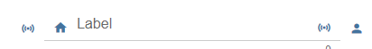

#### Editor-Einstellungen
Einstellungen, die in der folgenden Tabelle nicht aufgeführt sind, sind selbsterklärend.

<table><thead><tr><th>Bildschirmfoto</th><th> Rahmen</th><th> Beschreibung </th></tr></thead><tbody><tr><td rowspan=4></td><td> Objekt Identifikation</td><td> ID des Datenpunkts</td></tr><tr><td> Eingabetyp</td><td> Eingabeart des Textfeldes</td></tr><tr><td> Eingabemaske</td><td> Wenn Sie den Eingabetyp Maske verwenden, können Sie eine Maske definieren. Erlaubte Eigenschaften sind in der <a href="https://vuejs-tips.github.io/vue-the-mask/" target="_blank">vue the mask-Dokumentation beschrieben</a></td></tr><tr><td> maximale Länge</td><td> maximale Eingabelänge des Textfeldes</td></tr></tbody></table>

#### HTML-Eigenschaften
Die folgenden Eigenschaften können als [HTML-Widgets](#html-widgets) verwendet werden.

<table><thead><tr><th>Eigentum</th><th> Beschreibung</th><th> Art</th><th> Werte </th></tr></thead><tbody><tr><td colspan="4" style="background: #44739e; color: white; border-color: #44739e;"> <i><b><br>Verbreitet</b></i></td></tr><tr><td> mdw-oid</td><td> Objekt Identifikation</td><td> Schnur</td><td></tr><tr><td> mdw-inputType</td><td> Eingabetyp</td><td> Schnur</td><td> Text | Nummer | Datum | Zeit | Maske</tr><tr><td> mdw-inputMaske</td><td> Eingabemaske</td><td> Schnur</td><td></tr><tr><td> mdw-inputMaxLength</td><td> maximale Länge</td><td> Nummer</td><td></tr><tr><td> mdw-debug</td><td> debuggen</td><td> boolesch</td><td> falsch | wahr</tr><tr><td colspan="4" style="background: #44739e; color: white; border-color: #44739e;"> <i><b><br>Layouteingabe</b></i></td></tr><tr><td> mdw-inputLayout</td><td> Layout</td><td> Schnur</td><td> regelmäßig | Solo | solo-gerundet | Soloform | gefüllt | gefüllt-rund | gefüllte Form | skizziert | umrandet-gerundet | umrissen-förmig</tr><tr><td> mdw-inputAusrichtung</td><td> Textausrichtung</td><td> Schnur</td><td> links | Zentrum | Recht</tr><tr><td> mdw-inputLayoutBackgroundColor</td><td> Hintergrundfarbe</td><td> Schnur</td><td> hex(#44739e), rgb(20, 50, 200), rgba(20, 50, 200, 0,5)</tr><tr><td> mdw-inputLayoutHintergrundFarbeHover</td><td> Hintergrundfarbe schweben</td><td> Schnur</td><td> hex(#44739e), rgb(20, 50, 200), rgba(20, 50, 200, 0,5)</tr><tr><td> mdw-inputLayoutBackgroundColorSelected</td><td> Hintergrundfarbe ausgewählt</td><td> Schnur</td><td> hex(#44739e), rgb(20, 50, 200), rgba(20, 50, 200, 0,5)</tr><tr><td> mdw-inputLayoutBorderColor</td><td> Randfarbe</td><td> Schnur</td><td> hex(#44739e), rgb(20, 50, 200), rgba(20, 50, 200, 0,5)</tr><tr><td> mdw-inputLayoutBorderColorHover</td><td> Rahmenfarbe schweben</td><td> Schnur</td><td> hex(#44739e), rgb(20, 50, 200), rgba(20, 50, 200, 0,5)</tr><tr><td> mdw-inputLayoutBorderColorSelected</td><td> Rahmenfarbe ausgewählt</td><td> Schnur</td><td> hex(#44739e), rgb(20, 50, 200), rgba(20, 50, 200, 0,5)</tr><tr><td> mdw-inputTextFontFamily</td><td> Schriftart</td><td> Schnur</td><td></tr><tr><td> mdw-inputTextFontSize</td><td> Schriftgröße</td><td> Nummer</td><td></tr><tr><td> mdw-inputTextColor</td><td> Textfarbe</td><td> Schnur</td><td> hex(#44739e), rgb(20, 50, 200), rgba(20, 50, 200, 0,5)</tr><tr><td colspan="4" style="background: #44739e; color: white; border-color: #44739e;"> <i><b><br>Bezeichnung der Eingabe</b></i></td></tr><tr><td> mdw-inputLabelText</td><td> Text</td><td> Schnur</td><td></tr><tr><td> mdw-inputLabelColor</td><td> Textfarbe</td><td> Schnur</td><td> hex(#44739e), rgb(20, 50, 200), rgba(20, 50, 200, 0,5)</tr><tr><td> mdw-inputLabelColorSelected</td><td> Textfarbe ausgewählt</td><td> Schnur</td><td> hex(#44739e), rgb(20, 50, 200), rgba(20, 50, 200, 0,5)</tr><tr><td> mdw-inputLabelFontFamily</td><td> Schriftart</td><td> Schnur</td><td></tr><tr><td> mdw-inputLabelFontSize</td><td> Schriftgröße</td><td> Nummer</td><td></tr><tr><td> mdw-inputTranslateX</td><td> Versatz x</td><td> Nummer</td><td></tr><tr><td> mdw-inputTranslateY</td><td> Offset y</td><td> Nummer</td><td></tr><tr><td colspan="4" style="background: #44739e; color: white; border-color: #44739e;"><i><b><br>Anhänge der Eingabe</b></i></td></tr><tr><td> mdw-inputPrefix</td><td> vorangestellter Text</td><td> Schnur</td><td></tr><tr><td> mdw-inputSuffix</td><td> angehängter Text</td><td> Schnur</td><td></tr><tr><td> mdw-inputAnhangFarbe</td><td> Textfarbe</td><td> Schnur</td><td> hex(#44739e), rgb(20, 50, 200), rgba(20, 50, 200, 0,5)</tr><tr><td> mdw-inputAppendixFontSize</td><td> Schriftgröße</td><td> Nummer</td><td></tr><tr><td> mdw-inputAppendixFontFamily</td><td> Schriftart</td><td> Schnur</td><td></tr><tr><td colspan="4" style="background: #44739e; color: white; border-color: #44739e;"><i><b><br>Untertext der Eingabe</b></i></td></tr><tr><td> mdw-showInputMessageAlways</td><td> immer anzeigen</td><td> boolesch</td><td> falsch | wahr</tr><tr><td> mdw-inputMessage</td><td> Text</td><td> Schnur</td><td></tr><tr><td> mdw-inputMessageFontFamily</td><td> Schriftart</td><td> Schnur</td><td></tr><tr><td> mdw-inputMessageFontSize</td><td> Schriftgröße</td><td> Nummer</td><td></tr><tr><td> mdw-inputMessageColor</td><td> Textfarbe</td><td> Schnur</td><td> hex(#44739e), rgb(20, 50, 200), rgba(20, 50, 200, 0,5)</tr><tr><td colspan="4" style="background: #44739e; color: white; border-color: #44739e;"> <i><b><br>Thekenlayout</b></i></td></tr><tr><td> mdw-showInputCounter</td><td> Zähler anzeigen</td><td> boolesch</td><td> falsch | wahr</tr><tr><td> mdw-inputCounterColor</td><td> Schriftfarbe</td><td> Schnur</td><td> hex(#44739e), rgb(20, 50, 200), rgba(20, 50, 200, 0,5)</tr><tr><td> mdw-inputCounterFontSize</td><td> Schriftgröße</td><td> Nummer</td><td></tr><tr><td> mdw-inputCounterFontFamily</td><td> Schriftart</td><td> Schnur</td><td></tr><tr><td colspan="4" style="background: #44739e; color: white; border-color: #44739e;"><i><b><br>Symbole</b></i></td></tr><tr><td> mdw-clearIconShow</td><td> Textlöschsymbol anzeigen text</td><td> boolesch</td><td> falsch | wahr</tr><tr><td> mdw-clearIcon</td><td> Symbol zum Löschen von Text</td><td> Schnur</td><td></tr><tr><td> mdw-clearIconSize</td><td> Größe des Textlöschsymbols</td><td> Nummer</td><td></tr><tr><td> mdw-clearIconColor</td><td> Farbe des Textlöschsymbols</td><td> Schnur</td><td> hex(#44739e), rgb(20, 50, 200), rgba(20, 50, 200, 0,5)</tr><tr><td> mdw-prepandIcon</td><td> vorangestelltes Symbol</td><td> Schnur</td><td></tr><tr><td> mdw-prepandIconSize</td><td> Größe des vorangestellten Symbols</td><td> Nummer</td><td></tr><tr><td> mdw-prepandIconColor</td><td> Farbe des vorangestellten Symbols</td><td> Schnur</td><td> hex(#44739e), rgb(20, 50, 200), rgba(20, 50, 200, 0,5)</tr><tr><td> mdw-prepandInnerIcon</td><td> inneres vorangestelltes Symbol</td><td> Schnur</td><td></tr><tr><td> mdw-prepandInnerIconSize</td><td> Größe des inneren vorangestellten Symbols</td><td> Nummer</td><td></tr><tr><td> mdw-prepandInnerIconColor</td><td> Farbe des inneren vorangestellten Symbols</td><td> Schnur</td><td> hex(#44739e), rgb(20, 50, 200), rgba(20, 50, 200, 0,5)</tr><tr><td> mdw-appendIcon</td><td> angehängtes Symbol</td><td> Schnur</td><td></tr><tr><td> mdw-appendIconSize</td><td> Größe des angehängten Symbols</td><td> Nummer</td><td></tr><tr><td> mdw-appendIconColor</td><td> Farbe des angehängten Symbols</td><td> Schnur</td><td> hex(#44739e), rgb(20, 50, 200), rgba(20, 50, 200, 0,5)</tr><tr><td> mdw-appendOuterIcon</td><td> äußeres angehängtes Symbol</td><td> Schnur</td><td></tr><tr><td> mdw-appendOuterIconSize</td><td> Größe des äußeren angehängten Symbols</td><td> Nummer</td><td></tr><tr><td> mdw-appendOuterIconColor</td><td> Farbe des äußeren angehängten Symbols</td><td> Schnur</td><td> hex(#44739e), rgb(20, 50, 200), rgba(20, 50, 200, 0,5)</tr></tbody></table>

### Wählen
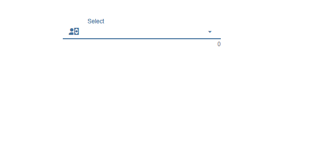

Einstellungen, die in der folgenden Tabelle nicht aufgeführt sind, sind selbsterklärend.

<table><thead><tr><th>Bildschirmfoto</th><th> Rahmen</th><th> Beschreibung</th></tr></thead><tbody><tr><td rowspan=6>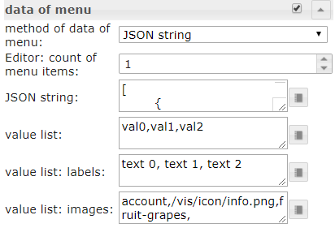</td><td> Methode der Daten des Menüs</td><td> Es gibt drei Methoden, um die Daten des Menüs zu definieren. Zuerst muss es über den Editor definiert werden. Zweitens muss es über einen Json-String definiert werden. Die dritte Methode besteht darin, es durch drei Listen für Werte, Beschriftungen und Symbole zu definieren</td></tr><tr><td> Editor: Anzahl der Menüpunkte</td><td> Methode der Menüdaten: über den Editor<br> Legen Sie die Anzahl der Menüeinträge fest. Die einzelnen Menüeinträge können unter Menüpunkt[x] definiert werden</td></tr><tr><td> JSON-Zeichenfolge</td><td> Hier können Sie einen JSON-String hinzufügen, um die Menüeinträge zu definieren oder Bindungen zu einem Datenpunkt verwenden, der einen JSON-String enthält.<br><br> JSON-String muss das oben beschriebene Format haben<br></td></tr><tr><td> Werteliste</td><td> Definieren Sie die Anzahl der Menüeinträge, indem Sie Werte hinzufügen, die dem Datenpunkt zugewiesen werden. Einträge müssen durch Semikolon getrennt werden</td></tr><tr><td> Werteliste: Labels</td><td> Definieren Sie die zugehörigen Beschriftungen der Werte. Einträge müssen durch Semikolon getrennt werden</td></tr><tr><td> Werteliste: Bilder</td><td> Definieren Sie die zugehörigen Symbole der Werte. Einträge müssen durch Semikolon getrennt werden. Sie können den Namen des Bildpfads oder der Material Design Icons verwenden</td></tr></tbody></table>

#### Menü JSON-Eigenschaften
<table><thead><tr><th>Eigentum</th><th> Beschreibung</th><th> Art</th><th> Werte</th></tr></thead><tbody><tr><td> Text</td><td> Text des Menüpunktes</td><td> Schnur</td><td></td></tr><tr><td> Untertext</td><td> Untertext des Menüpunktes</td><td> Schnur</td><td></td></tr><tr><td> Wert</td><td> Wert des Menüpunktes, dies wird dem Datenpunkt als Wert zugewiesen, wenn dieser ausgewählt ist</td><td> Schnur</td><td/></tr><tr><td> Symbol</td><td> Materialdesign-Symbol oder Bildpfad für Menüelement</td><td> Schnur</td><td/></tr><tr><td> SymbolFarbe</td><td> Farbe des Symbols für Materialdesign</td><td> Schnur</td><td> hex(#44739e), rgb(20, 50, 200), rgba(20, 50, 200, 0,5)</td></tr><tr><td> iconColorSelectedTextField</td><td> Symbolfarbe des Eingabefeldes bei Auswahl</td><td> Schnur</td><td> hex(#44739e), rgb(20, 50, 200), rgba(20, 50, 200, 0,5)</td></tr></tbody></table>

<!-- im Inhaltsverzeichnis weglassen -->

##### Menü JSON-Eigenschaften - Beispiel
<details>

```
[   {
		"text": "1 Tag",
		"subText": "sub",
		"value": "1 day",
		"icon": "home"
	},
	{
		"text": "3 Tage",
		"subText": "sub",
		"value": "3 days",
		"icon": "home"
	},
	{
		"text": "1 Woche",
		"subText": "sub",
		"value": "7 days",
		"icon": "home"
	},
	{
		"text": "2 Wochen",
		"subText": "sub",
		"value": "14 days",
		"icon": "home"
	},
	{
		"text": "1 Monat",
		"subText": "sub",
		"value": "1 month",
		"icon": "/vis.0/myImages/hard-drive.png"
	},
	{
		"text": "2 Monate",
		"subText": "sub",
		"value": "2 months",
		"icon": "home",
		"iconColor": "blue",
		"iconColorSelectedTextField": "purple"
	},
	{
		"text": "3 Monate",
		"value": "3 months"
	},
	{
		"text": "6 Monate",
		"value": "6 months"
	},
	{
		"text": "1 Jahr",
		"value": "1 year"
	}
]
```

</details>

#### HTML-Eigenschaften
Die folgenden Eigenschaften können als [HTML-Widgets](#html-widgets) verwendet werden.

<table><thead><tr><th>Eigentum</th><th> Beschreibung</th><th> Art</th><th> Werte </th></tr></thead><tbody><tr><td colspan="4" style="background: #44739e; color: white; border-color: #44739e;"> <i><b><br>Verbreitet</b></i></td></tr><tr><td> mdw-oid</td><td> Objekt Identifikation</td><td> Schnur</td><td></tr><tr><td> mdw-inputType</td><td> Eingabetyp</td><td> Schnur</td><td> Text | Datum | Zeit</tr><tr><td> mdw-vibrateOnMobilDevices</td><td> vibrieren auf mobilen Geräten [s]</td><td> Nummer</td><td></tr><tr><td> mdw-debug</td><td> debuggen</td><td> boolesch</td><td> falsch | wahr</tr><tr><td colspan="4" style="background: #44739e; color: white; border-color: #44739e;"> <i><b><br>Layouteingabe</b></i></td></tr><tr><td> mdw-inputLayout</td><td> Layout</td><td> Schnur</td><td> regelmäßig | Solo | solo-gerundet | Soloform | gefüllt | gefüllt-rund | gefüllte Form | skizziert | umrandet-gerundet | umrissen-förmig</tr><tr><td> mdw-inputAusrichtung</td><td> Textausrichtung</td><td> Schnur</td><td> links | Zentrum | Recht</tr><tr><td> mdw-inputLayoutBackgroundColor</td><td> Hintergrundfarbe</td><td> Schnur</td><td> hex(#44739e), rgb(20, 50, 200), rgba(20, 50, 200, 0,5)</tr><tr><td> mdw-inputLayoutHintergrundFarbeHover</td><td> Hintergrundfarbe schweben</td><td> Schnur</td><td> hex(#44739e), rgb(20, 50, 200), rgba(20, 50, 200, 0,5)</tr><tr><td> mdw-inputLayoutBackgroundColorSelected</td><td> Hintergrundfarbe ausgewählt</td><td> Schnur</td><td> hex(#44739e), rgb(20, 50, 200), rgba(20, 50, 200, 0,5)</tr><tr><td> mdw-inputLayoutBorderColor</td><td> Randfarbe</td><td> Schnur</td><td> hex(#44739e), rgb(20, 50, 200), rgba(20, 50, 200, 0,5)</tr><tr><td> mdw-inputLayoutBorderColorHover</td><td> Rahmenfarbe schweben</td><td> Schnur</td><td> hex(#44739e), rgb(20, 50, 200), rgba(20, 50, 200, 0,5)</tr><tr><td> mdw-inputLayoutBorderColorSelected</td><td> Rahmenfarbe ausgewählt</td><td> Schnur</td><td> hex(#44739e), rgb(20, 50, 200), rgba(20, 50, 200, 0,5)</tr><tr><td> mdw-inputTextFontFamily</td><td> Schriftart</td><td> Schnur</td><td></tr><tr><td> mdw-inputTextFontSize</td><td> Schriftgröße</td><td> Nummer</td><td></tr><tr><td> mdw-inputTextColor</td><td> Textfarbe</td><td> Schnur</td><td> hex(#44739e), rgb(20, 50, 200), rgba(20, 50, 200, 0,5)</tr><tr><td colspan="4" style="background: #44739e; color: white; border-color: #44739e;"> <i><b><br>Bezeichnung der Eingabe</b></i></td></tr><tr><td> mdw-inputLabelText</td><td> Text</td><td> Schnur</td><td></tr><tr><td> mdw-inputLabelColor</td><td> Textfarbe</td><td> Schnur</td><td> hex(#44739e), rgb(20, 50, 200), rgba(20, 50, 200, 0,5)</tr><tr><td> mdw-inputLabelColorSelected</td><td> Textfarbe ausgewählt</td><td> Schnur</td><td> hex(#44739e), rgb(20, 50, 200), rgba(20, 50, 200, 0,5)</tr><tr><td> mdw-inputLabelFontFamily</td><td> Schriftart</td><td> Schnur</td><td></tr><tr><td> mdw-inputLabelFontSize</td><td> Schriftgröße</td><td> Nummer</td><td></tr><tr><td> mdw-inputTranslateX</td><td> Versatz x</td><td> Nummer</td><td></tr><tr><td> mdw-inputTranslateY</td><td> Offset y</td><td> Nummer</td><td></tr><tr><td colspan="4" style="background: #44739e; color: white; border-color: #44739e;"><i><b><br>Anhänge der Eingabe</b></i></td></tr><tr><td> mdw-inputPrefix</td><td> vorangestellter Text</td><td> Schnur</td><td></tr><tr><td> mdw-inputSuffix</td><td> angehängter Text</td><td> Schnur</td><td></tr><tr><td> mdw-inputAnhangFarbe</td><td> Textfarbe</td><td> Schnur</td><td> hex(#44739e), rgb(20, 50, 200), rgba(20, 50, 200, 0,5)</tr><tr><td> mdw-inputAppendixFontSize</td><td> Schriftgröße</td><td> Nummer</td><td></tr><tr><td> mdw-inputAppendixFontFamily</td><td> Schriftart</td><td> Schnur</td><td></tr><tr><td colspan="4" style="background: #44739e; color: white; border-color: #44739e;"><i><b><br>Untertext der Eingabe</b></i></td></tr><tr><td> mdw-showInputMessageAlways</td><td> immer anzeigen</td><td> boolesch</td><td> falsch | wahr</tr><tr><td> mdw-inputMessage</td><td> Text</td><td> Schnur</td><td></tr><tr><td> mdw-inputMessageFontFamily</td><td> Schriftart</td><td> Schnur</td><td></tr><tr><td> mdw-inputMessageFontSize</td><td> Schriftgröße</td><td> Nummer</td><td></tr><tr><td> mdw-inputMessageColor</td><td> Textfarbe</td><td> Schnur</td><td> hex(#44739e), rgb(20, 50, 200), rgba(20, 50, 200, 0,5)</tr><tr><td colspan="4" style="background: #44739e; color: white; border-color: #44739e;"> <i><b><br>Thekenlayout</b></i></td></tr><tr><td> mdw-showInputCounter</td><td> Zähler anzeigen</td><td> boolesch</td><td> falsch | wahr</tr><tr><td> mdw-inputCounterColor</td><td> Schriftfarbe</td><td> Schnur</td><td> hex(#44739e), rgb(20, 50, 200), rgba(20, 50, 200, 0,5)</tr><tr><td> mdw-inputCounterFontSize</td><td> Schriftgröße</td><td> Nummer</td><td></tr><tr><td> mdw-inputCounterFontFamily</td><td> Schriftart</td><td> Schnur</td><td></tr><tr><td colspan="4" style="background: #44739e; color: white; border-color: #44739e;"><i><b><br>Symbole</b></i></td></tr><tr><td> mdw-clearIconShow</td><td> Textlöschsymbol anzeigen text</td><td> boolesch</td><td> falsch | wahr</tr><tr><td> mdw-clearIcon</td><td> Symbol zum Löschen von Text</td><td> Schnur</td><td></tr><tr><td> mdw-clearIconSize</td><td> Größe des Textlöschsymbols</td><td> Nummer</td><td></tr><tr><td> mdw-clearIconColor</td><td> Farbe des Textlöschsymbols</td><td> Schnur</td><td> hex(#44739e), rgb(20, 50, 200), rgba(20, 50, 200, 0,5)</tr><tr><td> mdw-collapseIcon</td><td> Menü öffnen Symbol</td><td> Schnur</td><td></tr><tr><td> mdw-collapseIconSize</td><td> Größe des Menüsymbols öffnen</td><td> Nummer</td><td></tr><tr><td> mdw-collapseIconColor</td><td> Farbe des Symbols zum Öffnen des Menüs</td><td> Schnur</td><td> hex(#44739e), rgb(20, 50, 200), rgba(20, 50, 200, 0,5)</tr><tr><td> mdw-prepandIcon</td><td> vorangestelltes Symbol</td><td> Schnur</td><td></tr><tr><td> mdw-prepandIconSize</td><td> Größe des vorangestellten Symbols</td><td> Nummer</td><td></tr><tr><td> mdw-prepandIconColor</td><td> Farbe des vorangestellten Symbols</td><td> Schnur</td><td> hex(#44739e), rgb(20, 50, 200), rgba(20, 50, 200, 0,5)</tr><tr><td> mdw-prepandInnerIcon</td><td> inneres vorangestelltes Symbol</td><td> Schnur</td><td></tr><tr><td> mdw-prepandInnerIconSize</td><td> Größe des inneren vorangestellten Symbols</td><td> Nummer</td><td></tr><tr><td> mdw-prepandInnerIconColor</td><td> Farbe des inneren vorangestellten Symbols</td><td> Schnur</td><td> hex(#44739e), rgb(20, 50, 200), rgba(20, 50, 200, 0,5)</tr><tr><td> mdw-appendOuterIcon</td><td> äußeres angehängtes Symbol</td><td> Schnur</td><td></tr><tr><td> mdw-appendOuterIconSize</td><td> Größe des äußeren angehängten Symbols</td><td> Nummer</td><td></tr><tr><td> mdw-appendOuterIconColor</td><td> Farbe des äußeren angehängten Symbols</td><td> Schnur</td><td> hex(#44739e), rgb(20, 50, 200), rgba(20, 50, 200, 0,5)</tr><tr><td colspan="4" style="background: #44739e; color: white; border-color: #44739e;"> <i><b><br>Daten des Menüs</b></i></td></tr><tr><td> mdw-listDataMethod</td><td> Eingabemethode für die Menüdaten</td><td> Schnur</td><td> inputPerEditor | jsonStringObject | multistatesObject | Werteliste</tr><tr><td> mdw-countSelectItems</td><td> Editor: Anzahl der Menüpunkte</td><td> Nummer</td><td></tr><tr><td> mdw-jsonStringObject</td><td> JSON-Zeichenfolge. Muss html-escaped sein! Hinweis: Verwenden Sie <a href="https://github.com/mathiasbynens/he#heencodetext-options" target="_blank">die Bibliothek</a> in Ihren Skripten, um in htmle zu codieren</td><td> Schnur</td><td></tr><tr><td> mdw-Werteliste</td><td> Werteliste</td><td> Schnur</td><td></tr><tr><td> mdw-valueListLabels</td><td> Werteliste: Labels</td><td> Schnur</td><td></tr><tr><td> mdw-valueListIcons</td><td> Werteliste: Bilder</td><td> Schnur</td><td></tr><tr><td colspan="4" style="background: #44739e; color: white; border-color: #44739e;"><i><b><br>Menü-Layout</b></i></td></tr><tr><td> mdw-ListePosition</td><td> Position</td><td> Schnur</td><td> automatisch | Nach oben | Unterseite</tr><tr><td> mdw-listPositionOffset</td><td> Positionsoffset verwenden</td><td> boolesch</td><td> falsch | wahr</tr><tr><td> mdw-openOnClear</td><td> Öffnen Sie das Menü bei mit der Löschtaste</td><td> boolesch</td><td> falsch | wahr</tr><tr><td> mdw-listItemHeight</td><td> Höhe des Menüpunktes</td><td> Nummer</td><td></tr><tr><td> mdw-listItemBackgroundColor</td><td> Hintergrundfarbe</td><td> Schnur</td><td> hex(#44739e), rgb(20, 50, 200), rgba(20, 50, 200, 0,5)</tr><tr><td> mdw-listItemBackgroundHoverColor</td><td> Schwebefarbe</td><td> Schnur</td><td> hex(#44739e), rgb(20, 50, 200), rgba(20, 50, 200, 0,5)</tr><tr><td> mdw-listItemBackgroundSelectedColor</td><td> Farbe des ausgewählten Artikels</td><td> Schnur</td><td> hex(#44739e), rgb(20, 50, 200), rgba(20, 50, 200, 0,5)</tr><tr><td> mdw-listItemRippleEffectColor</td><td> Effektfarbe</td><td> Schnur</td><td> hex(#44739e), rgb(20, 50, 200), rgba(20, 50, 200, 0,5)</tr><tr><td> mdw-showSelectedIcon</td><td> Symbol des ausgewählten Elements anzeigen</td><td> Schnur</td><td> nein | voranstellen | prepend-inner | anhängen-äußeres</tr><tr><td> mdw-listIconSize</td><td> Symbolgröße</td><td> Nummer</td><td></tr><tr><td> mdw-listIconColor</td><td> Symbolfarbe</td><td> Schnur</td><td> hex(#44739e), rgb(20, 50, 200), rgba(20, 50, 200, 0,5)</tr><tr><td> mdw-listIconHoverColor</td><td> Symbol-Hover-Farbe</td><td> Schnur</td><td> hex(#44739e), rgb(20, 50, 200), rgba(20, 50, 200, 0,5)</tr><tr><td> mdw-listIconSelectedColor</td><td> Symbolfarbe des ausgewählten Elements</td><td> Schnur</td><td> hex(#44739e), rgb(20, 50, 200), rgba(20, 50, 200, 0,5)</tr><tr><td> mdw-listItemFontSize</td><td> Schriftgröße</td><td> Nummer</td><td></tr><tr><td> mdw-listItemFont</td><td> Schriftart</td><td> Schnur</td><td></tr><tr><td> mdw-listItemFontColor</td><td> Schriftfarbe</td><td> Schnur</td><td> hex(#44739e), rgb(20, 50, 200), rgba(20, 50, 200, 0,5)</tr><tr><td> mdw-listItemFontHoverColor</td><td> Schrift Hover-Farbe</td><td> Schnur</td><td> hex(#44739e), rgb(20, 50, 200), rgba(20, 50, 200, 0,5)</tr><tr><td> mdw-listItemFontSelectedColor</td><td> Schriftfarbe des ausgewählten Elements</td><td> Schnur</td><td> hex(#44739e), rgb(20, 50, 200), rgba(20, 50, 200, 0,5)</tr><tr><td> mdw-listItemSubFontSize</td><td> zweiter Text Schriftgröße</td><td> Nummer</td><td></tr><tr><td> mdw-listItemSubFont</td><td> zweite Textschriftart</td><td> Schnur</td><td></tr><tr><td> mdw-listItemSubFontColor</td><td> zweite Schriftfarbe des Textes</td><td> Schnur</td><td> hex(#44739e), rgb(20, 50, 200), rgba(20, 50, 200, 0,5)</tr><tr><td> mdw-listItemSubFontHoverColor</td><td> Hover-Farbe des zweiten Textes</td><td> Schnur</td><td> hex(#44739e), rgb(20, 50, 200), rgba(20, 50, 200, 0,5)</tr><tr><td> mdw-listItemSubFontSelectedColor</td><td> Farbe des zweiten ausgewählten Textes</td><td> Schnur</td><td> hex(#44739e), rgb(20, 50, 200), rgba(20, 50, 200, 0,5)</tr><tr><td> mdw-showValue</td><td> Wert anzeigen</td><td> boolesch</td><td> falsch | wahr</tr><tr><td> mdw-listItemValueFontSize</td><td> Schriftgröße des Wertes</td><td> Nummer</td><td></tr><tr><td> mdw-listItemValueFont</td><td> Schriftart des Wertes</td><td> Schnur</td><td></tr><tr><td> mdw-listItemValueFontColor</td><td> Schriftfarbe des Wertes</td><td> Schnur</td><td> hex(#44739e), rgb(20, 50, 200), rgba(20, 50, 200, 0,5)</tr><tr><td> mdw-listItemValueFontHoverColor</td><td> Hover-Schriftfarbe des Wertes</td><td> Schnur</td><td> hex(#44739e), rgb(20, 50, 200), rgba(20, 50, 200, 0,5)</tr><tr><td> mdw-listItemValueFontSelectedColor</td><td> Schriftfarbe des ausgewählten Wertes</td><td> Schnur</td><td> hex(#44739e), rgb(20, 50, 200), rgba(20, 50, 200, 0,5)</tr><tr><td colspan="4" style="background: #44739e; color: white; border-color: #44739e;"> <i><b><br>Menüpunkt [x]</b></i></td></tr><tr><td> mdw-Wert[x]</td><td> Wert</td><td> Schnur</td><td></tr><tr><td> mdw-Label[x]</td><td> Etikette</td><td> Schnur</td><td></tr><tr><td> mdw-subLabel[x]</td><td> zweiter Text</td><td> Schnur</td><td></tr><tr><td> mdw-listIcon[x]</td><td> Symbol</td><td> Schnur</td><td></tr><tr><td> mdw-listIconColor[x]</td><td> Symbolfarbe</td><td> Schnur</td><td> hex(#44739e), rgb(20, 50, 200), rgba(20, 50, 200, 0,5)</tr><tr><td> mdw-imageColorSelectedTextField[x]</td><td> ausgewählte Symbolfarbe für Textfeld</td><td> Schnur</td><td> hex(#44739e), rgb(20, 50, 200), rgba(20, 50, 200, 0,5)</tr></tbody></table>

<!-- im Inhaltsverzeichnis weglassen -->

##### HTML-Eigenschaften - Beispiel
<details>

```
<div class='vis-widget materialdesign-widget materialdesign-select materialdesign-select-html-element'
	style='width: 322px; height: 38px; position: relative; overflow: visible; display: flex; align-items: center;'
	mdw-debug='true'
	mdw-oid='0_userdata.0.MDW.Input.string'
	mdw-inputType='text'
	mdw-vibrateOnMobilDevices='50'
	mdw-inputLayout='regular'
	mdw-inputAlignment='left'
	mdw-inputLayoutBorderColor='#mdwTheme:vis-materialdesign.0.colors.input.border'
	mdw-inputLayoutBorderColorHover='#mdwTheme:vis-materialdesign.0.colors.input.border_hover'
	mdw-inputLayoutBorderColorSelected='#mdwTheme:vis-materialdesign.0.colors.input.border_selected'
	mdw-inputTextFontFamily='#mdwTheme:vis-materialdesign.0.fonts.input.text'
	mdw-inputTextFontSize='#mdwTheme:vis-materialdesign.0.fontSizes.input.text'
	mdw-inputTextColor='#mdwTheme:vis-materialdesign.0.colors.input.text'
	mdw-inputLabelText='Fuu'
	mdw-inputLabelColor='#mdwTheme:vis-materialdesign.0.colors.input.label'
	mdw-inputLabelColorSelected='#mdwTheme:vis-materialdesign.0.colors.input.label_selected'
	mdw-inputLabelFontFamily='#mdwTheme:vis-materialdesign.0.fonts.input.label'
	mdw-inputLabelFontSize='#mdwTheme:vis-materialdesign.0.fontSizes.input.label'
	mdw-inputAppendixColor='#mdwTheme:vis-materialdesign.0.colors.input.appendix'
	mdw-inputAppendixFontSize='#mdwTheme:vis-materialdesign.0.fontSizes.input.appendix'
	mdw-inputAppendixFontFamily='#mdwTheme:vis-materialdesign.0.fonts.input.appendix'
	mdw-showInputMessageAlways='true'
	mdw-inputMessageFontFamily='#mdwTheme:vis-materialdesign.0.fonts.input.message'
	mdw-inputMessageFontSize='#mdwTheme:vis-materialdesign.0.fontSizes.input.message'
	mdw-inputMessageColor='#mdwTheme:vis-materialdesign.0.colors.input.message'
	mdw-showInputCounter='true'
	mdw-inputCounterColor='#mdwTheme:vis-materialdesign.0.colors.input.counter'
	mdw-inputCounterFontSize='#mdwTheme:vis-materialdesign.0.fontSizes.input.counter'
	mdw-inputCounterFontFamily='#mdwTheme:vis-materialdesign.0.fonts.input.counter'
	mdw-clearIconShow='true'
	mdw-clearIconColor='#mdwTheme:vis-materialdesign.0.colors.input.icon_clear'
	mdw-collapseIconColor='#mdwTheme:vis-materialdesign.0.colors.input.icon_collapse'
	mdw-prepandIcon='account-network'
	mdw-prepandIconSize='30'
	mdw-prepandIconColor='#f91010'
	mdw-prepandInnerIcon='alert-box'
	mdw-prepandInnerIconSize='20'
	mdw-appendOuterIcon='/vis.0/myImages/hard-drive.png'
	mdw-listDataMethod='jsonStringObject'
	mdw-countSelectItems='0'
	mdw-jsonStringObject='[   {
&#x9;&#x9;&#x22;text&#x22;: &#x22;1 Tag&#x22;,
&#x9;&#x9;&#x22;subText&#x22;: &#x22;sub&#x22;,
&#x9;&#x9;&#x22;value&#x22;: &#x22;1 day&#x22;,
&#x9;&#x9;&#x22;icon&#x22;: &#x22;home&#x22;
&#x9;},
&#x9;{
&#x9;&#x9;&#x22;text&#x22;: &#x22;3 Tage&#x22;,
&#x9;&#x9;&#x22;subText&#x22;: &#x22;sub&#x22;,&#x9;&#x9;
&#x9;&#x9;&#x22;value&#x22;: &#x22;3 days&#x22;,
&#x9;&#x9;&#x22;icon&#x22;: &#x22;home&#x22;
&#x9;},
&#x9;{
&#x9;&#x9;&#x22;text&#x22;: &#x22;1 Woche&#x22;,
&#x9;&#x9;&#x22;subText&#x22;: &#x22;sub&#x22;,&#x9;&#x9;
&#x9;&#x9;&#x22;value&#x22;: &#x22;7 days&#x22;,
&#x9;&#x9;&#x22;icon&#x22;: &#x22;home&#x22;
&#x9;},
&#x9;{
&#x9;&#x9;&#x22;text&#x22;: &#x22;2 Wochen&#x22;,
&#x9;&#x9;&#x22;subText&#x22;: &#x22;sub&#x22;,&#x9;&#x9;
&#x9;&#x9;&#x22;value&#x22;: &#x22;14 days&#x22;,
&#x9;&#x9;&#x22;icon&#x22;: &#x22;home&#x22;
&#x9;},
&#x9;{
&#x9;&#x9;&#x22;text&#x22;: &#x22;1 Monat&#x22;,
&#x9;&#x9;&#x22;subText&#x22;: &#x22;sub&#x22;,&#x9;&#x9;
&#x9;&#x9;&#x22;value&#x22;: &#x22;1 month&#x22;,
&#x9;&#x9;&#x22;icon&#x22;: &#x22;/vis.0/myImages/hard-drive.png&#x22;
&#x9;},
&#x9;{
&#x9;&#x9;&#x22;text&#x22;: &#x22;2 Monate&#x22;,
&#x9;&#x9;&#x22;subText&#x22;: &#x22;sub&#x22;,&#x9;&#x9;
&#x9;&#x9;&#x22;value&#x22;: &#x22;2 months&#x22;,
&#x9;&#x9;&#x22;icon&#x22;: &#x22;home&#x22;,
&#x9;&#x9;&#x22;iconColor&#x22;: &#x22;blue&#x22;,
&#x9;&#x9;&#x22;iconColorSelectedTextField&#x22;: &#x22;purple&#x22;
&#x9;},
&#x9;{
&#x9;&#x9;&#x22;text&#x22;: &#x22;3 Monate&#x22;,
&#x9;&#x9;&#x22;value&#x22;: &#x22;3 months&#x22;
&#x9;},
&#x9;{
&#x9;&#x9;&#x22;text&#x22;: &#x22;6 Monate&#x22;,
&#x9;&#x9;&#x22;value&#x22;: &#x22;6 months&#x22;
&#x9;},
&#x9;{
&#x9;&#x9;&#x22;text&#x22;: &#x22;1 Jahr&#x22;,
&#x9;&#x9;&#x22;value&#x22;: &#x22;1 year&#x22;
&#x9;}
]'
	mdw-listPosition='bottom'
	mdw-listPositionOffset='true'
	mdw-listItemBackgroundColor='#mdwTheme:vis-materialdesign.0.colors.input.menu.background'
	mdw-listItemBackgroundHoverColor='#mdwTheme:vis-materialdesign.0.colors.input.menu.hover'
	mdw-listItemBackgroundSelectedColor='#mdwTheme:vis-materialdesign.0.colors.input.menu.selected'
	mdw-listItemRippleEffectColor='#mdwTheme:vis-materialdesign.0.colors.input.menu.effect'
	mdw-showSelectedIcon='prepend-inner'
	mdw-listIconColor='#mdwTheme:vis-materialdesign.0.colors.input.menu.icon'
	mdw-listIconHoverColor='#bf0d0d'
	mdw-listIconSelectedColor='#42ff2e'
	mdw-listItemFontSize='#mdwTheme:vis-materialdesign.0.fontSizes.input.dropdown.text'
	mdw-listItemFont='#mdwTheme:vis-materialdesign.0.fonts.input.dropdown.text'
	mdw-listItemFontColor='#mdwTheme:vis-materialdesign.0.colors.input.menu.text'
	mdw-listItemSubFontSize='#mdwTheme:vis-materialdesign.0.fontSizes.input.dropdown.subText'
	mdw-listItemSubFont='#mdwTheme:vis-materialdesign.0.fonts.input.dropdown.subText'
	mdw-listItemSubFontColor='#mdwTheme:vis-materialdesign.0.colors.input.menu.subText'
	mdw-showValue='true'
	mdw-listItemValueFontSize='#mdwTheme:vis-materialdesign.0.fontSizes.input.dropdown.value'
	mdw-listItemValueFont='#mdwTheme:vis-materialdesign.0.fonts.input.dropdown.value'
	mdw-listItemValueFontColor='#mdwTheme:vis-materialdesign.0.colors.input.menu.value'
></div>
```

</details>

### Autovervollständigung
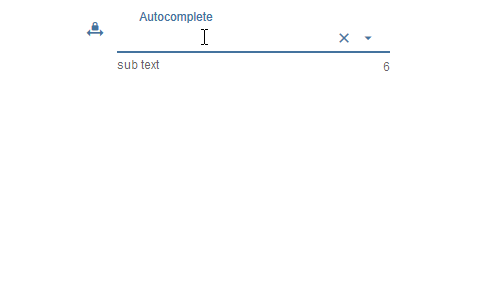

Einstellungen, die in der folgenden Tabelle nicht aufgeführt sind, sind selbsterklärend.

<table><thead><tr><th>Bildschirmfoto</th><th> Rahmen</th><th> Beschreibung</th></tr></thead><tbody><tr><td rowspan=6></td><td> Methode der Daten des Menüs</td><td> Es gibt drei Methoden, um die Daten des Menüs zu definieren. Zuerst muss es über den Editor definiert werden. Zweitens muss es über einen Json-String definiert werden. Die dritte Methode besteht darin, es durch drei Listen für Werte, Beschriftungen und Symbole zu definieren</td></tr><tr><td> Editor: Anzahl der Menüpunkte</td><td> Methode der Menüdaten: über den Editor<br> Legen Sie die Anzahl der Menüeinträge fest. Die einzelnen Menüeinträge können unter Menüpunkt[x] definiert werden</td></tr><tr><td> JSON-Zeichenfolge</td><td> Hier können Sie einen JSON-String hinzufügen, um die Menüeinträge zu definieren oder Bindungen zu einem Datenpunkt verwenden, der einen JSON-String enthält.<br><br> JSON-String muss das oben beschriebene Format haben<br></td></tr><tr><td> Werteliste</td><td> Definieren Sie die Anzahl der Menüeinträge, indem Sie Werte hinzufügen, die dem Datenpunkt zugewiesen werden. Einträge müssen durch Semikolon getrennt werden</td></tr><tr><td> Werteliste: Labels</td><td> Definieren Sie die zugehörigen Beschriftungen der Werte. Einträge müssen durch Semikolon getrennt werden</td></tr><tr><td> Werteliste: Bilder</td><td> Definieren Sie die zugehörigen Symbole der Werte. Einträge müssen durch Semikolon getrennt werden. Sie können den Namen des Bildpfads oder der Material Design Icons verwenden</td></tr></tbody></table>

#### Menü JSON-Eigenschaften
<table><thead><tr><th>Eigentum</th><th> Beschreibung</th><th> Art</th><th> Werte</th></tr></thead><tbody><tr><td> Text</td><td> Text des Menüpunktes</td><td> Schnur</td><td></td></tr><tr><td> Untertext</td><td> Untertext des Menüpunktes</td><td> Schnur</td><td></td></tr><tr><td> Wert</td><td> Wert des Menüpunktes, dies wird dem Datenpunkt als Wert zugewiesen, wenn dieser ausgewählt ist</td><td> Schnur</td><td/></tr><tr><td> Symbol</td><td> Materialdesign-Symbol oder Bildpfad für Menüelement</td><td> Schnur</td><td/></tr><tr><td> SymbolFarbe</td><td> Farbe des Symbols für Materialdesign</td><td> Schnur</td><td> hex(#44739e), rgb(20, 50, 200), rgba(20, 50, 200, 0,5)</td></tr><tr><td> iconColorSelectedTextField</td><td> Symbolfarbe des Eingabefeldes bei Auswahl</td><td> Schnur</td><td> hex(#44739e), rgb(20, 50, 200), rgba(20, 50, 200, 0,5)</td></tr></tbody></table>

<!-- im Inhaltsverzeichnis weglassen -->

##### Menü JSON-Eigenschaften - Beispiel
<details>

```
[   {
		"text": "1 Tag",
		"subText": "sub",
		"value": "1 day",
		"icon": "home"
	},
	{
		"text": "3 Tage",
		"subText": "sub",
		"value": "3 days",
		"icon": "home"
	},
	{
		"text": "1 Woche",
		"subText": "sub",
		"value": "7 days",
		"icon": "home"
	},
	{
		"text": "2 Wochen",
		"subText": "sub",
		"value": "14 days",
		"icon": "home"
	},
	{
		"text": "1 Monat",
		"subText": "sub",
		"value": "1 month",
		"icon": "/vis.0/myImages/hard-drive.png"
	},
	{
		"text": "2 Monate",
		"subText": "sub",
		"value": "2 months",
		"icon": "home",
		"iconColor": "blue",
		"iconColorSelectedTextField": "purple"
	},
	{
		"text": "3 Monate",
		"value": "3 months"
	},
	{
		"text": "6 Monate",
		"value": "6 months"
	},
	{
		"text": "1 Jahr",
		"value": "1 year"
	}
]
```

</details>

#### HTML-Eigenschaften
Die folgenden Eigenschaften können als [HTML-Widgets](#html-widgets) verwendet werden.

<table><thead><tr><th>Eigentum</th><th> Beschreibung</th><th> Art</th><th> Werte </th></tr></thead><tbody><tr><td colspan="4" style="background: #44739e; color: white; border-color: #44739e;"> <i><b><br>Verbreitet</b></i></td></tr><tr><td> mdw-oid</td><td> Objekt Identifikation</td><td> Schnur</td><td></tr><tr><td> mdw-inputMode</td><td> Eingabemodus</td><td> Schnur</td><td> schreiben | wählen</tr><tr><td> mdw-inputType</td><td> Eingabetyp</td><td> Schnur</td><td> Text | Datum | Zeit</tr><tr><td> mdw-vibrateOnMobilDevices</td><td> vibrieren auf mobilen Geräten [s]</td><td> Nummer</td><td></tr><tr><td> mdw-debug</td><td> debuggen</td><td> boolesch</td><td> falsch | wahr</tr><tr><td colspan="4" style="background: #44739e; color: white; border-color: #44739e;"> <i><b><br>Layouteingabe</b></i></td></tr><tr><td> mdw-inputLayout</td><td> Layout</td><td> Schnur</td><td> regelmäßig | Solo | solo-gerundet | Soloform | gefüllt | gefüllt-rund | gefüllte Form | skizziert | umrandet-gerundet | umrissen-förmig</tr><tr><td> mdw-inputAusrichtung</td><td> Textausrichtung</td><td> Schnur</td><td> links | Zentrum | Recht</tr><tr><td> mdw-inputLayoutBackgroundColor</td><td> Hintergrundfarbe</td><td> Schnur</td><td> hex(#44739e), rgb(20, 50, 200), rgba(20, 50, 200, 0,5)</tr><tr><td> mdw-inputLayoutHintergrundFarbeHover</td><td> Hintergrundfarbe schweben</td><td> Schnur</td><td> hex(#44739e), rgb(20, 50, 200), rgba(20, 50, 200, 0,5)</tr><tr><td> mdw-inputLayoutBackgroundColorSelected</td><td> Hintergrundfarbe ausgewählt</td><td> Schnur</td><td> hex(#44739e), rgb(20, 50, 200), rgba(20, 50, 200, 0,5)</tr><tr><td> mdw-inputLayoutBorderColor</td><td> Randfarbe</td><td> Schnur</td><td> hex(#44739e), rgb(20, 50, 200), rgba(20, 50, 200, 0,5)</tr><tr><td> mdw-inputLayoutBorderColorHover</td><td> Rahmenfarbe schweben</td><td> Schnur</td><td> hex(#44739e), rgb(20, 50, 200), rgba(20, 50, 200, 0,5)</tr><tr><td> mdw-inputLayoutBorderColorSelected</td><td> Rahmenfarbe ausgewählt</td><td> Schnur</td><td> hex(#44739e), rgb(20, 50, 200), rgba(20, 50, 200, 0,5)</tr><tr><td> mdw-inputTextFontFamily</td><td> Schriftart</td><td> Schnur</td><td></tr><tr><td> mdw-inputTextFontSize</td><td> Schriftgröße</td><td> Nummer</td><td></tr><tr><td> mdw-inputTextColor</td><td> Textfarbe</td><td> Schnur</td><td> hex(#44739e), rgb(20, 50, 200), rgba(20, 50, 200, 0,5)</tr><tr><td colspan="4" style="background: #44739e; color: white; border-color: #44739e;"> <i><b><br>Bezeichnung der Eingabe</b></i></td></tr><tr><td> mdw-inputLabelText</td><td> Text</td><td> Schnur</td><td></tr><tr><td> mdw-inputLabelColor</td><td> Textfarbe</td><td> Schnur</td><td> hex(#44739e), rgb(20, 50, 200), rgba(20, 50, 200, 0,5)</tr><tr><td> mdw-inputLabelColorSelected</td><td> Textfarbe ausgewählt</td><td> Schnur</td><td> hex(#44739e), rgb(20, 50, 200), rgba(20, 50, 200, 0,5)</tr><tr><td> mdw-inputLabelFontFamily</td><td> Schriftart</td><td> Schnur</td><td></tr><tr><td> mdw-inputLabelFontSize</td><td> Schriftgröße</td><td> Nummer</td><td></tr><tr><td> mdw-inputTranslateX</td><td> Versatz x</td><td> Nummer</td><td></tr><tr><td> mdw-inputTranslateY</td><td> Offset y</td><td> Nummer</td><td></tr><tr><td colspan="4" style="background: #44739e; color: white; border-color: #44739e;"><i><b><br>Anhänge der Eingabe</b></i></td></tr><tr><td> mdw-inputPrefix</td><td> vorangestellter Text</td><td> Schnur</td><td></tr><tr><td> mdw-inputSuffix</td><td> angehängter Text</td><td> Schnur</td><td></tr><tr><td> mdw-inputAnhangFarbe</td><td> Textfarbe</td><td> Schnur</td><td> hex(#44739e), rgb(20, 50, 200), rgba(20, 50, 200, 0,5)</tr><tr><td> mdw-inputAppendixFontSize</td><td> Schriftgröße</td><td> Nummer</td><td></tr><tr><td> mdw-inputAppendixFontFamily</td><td> Schriftart</td><td> Schnur</td><td></tr><tr><td colspan="4" style="background: #44739e; color: white; border-color: #44739e;"><i><b><br>Untertext der Eingabe</b></i></td></tr><tr><td> mdw-showInputMessageAlways</td><td> immer anzeigen</td><td> boolesch</td><td> falsch | wahr</tr><tr><td> mdw-inputMessage</td><td> Text</td><td> Schnur</td><td></tr><tr><td> mdw-inputMessageFontFamily</td><td> Schriftart</td><td> Schnur</td><td></tr><tr><td> mdw-inputMessageFontSize</td><td> Schriftgröße</td><td> Nummer</td><td></tr><tr><td> mdw-inputMessageColor</td><td> Textfarbe</td><td> Schnur</td><td> hex(#44739e), rgb(20, 50, 200), rgba(20, 50, 200, 0,5)</tr><tr><td colspan="4" style="background: #44739e; color: white; border-color: #44739e;"> <i><b><br>Thekenlayout</b></i></td></tr><tr><td> mdw-showInputCounter</td><td> Zähler anzeigen</td><td> boolesch</td><td> falsch | wahr</tr><tr><td> mdw-inputCounterColor</td><td> Schriftfarbe</td><td> Schnur</td><td> hex(#44739e), rgb(20, 50, 200), rgba(20, 50, 200, 0,5)</tr><tr><td> mdw-inputCounterFontSize</td><td> Schriftgröße</td><td> Nummer</td><td></tr><tr><td> mdw-inputCounterFontFamily</td><td> Schriftart</td><td> Schnur</td><td></tr><tr><td colspan="4" style="background: #44739e; color: white; border-color: #44739e;"><i><b><br>Symbole</b></i></td></tr><tr><td> mdw-clearIconShow</td><td> Textlöschsymbol anzeigen text</td><td> boolesch</td><td> falsch | wahr</tr><tr><td> mdw-clearIcon</td><td> Symbol zum Löschen von Text</td><td> Schnur</td><td></tr><tr><td> mdw-clearIconSize</td><td> Größe des Textlöschsymbols</td><td> Nummer</td><td></tr><tr><td> mdw-clearIconColor</td><td> Farbe des Textlöschsymbols</td><td> Schnur</td><td> hex(#44739e), rgb(20, 50, 200), rgba(20, 50, 200, 0,5)</tr><tr><td> mdw-collapseIcon</td><td> Menü öffnen Symbol</td><td> Schnur</td><td></tr><tr><td> mdw-collapseIconSize</td><td> Größe des Menüsymbols öffnen</td><td> Nummer</td><td></tr><tr><td> mdw-collapseIconColor</td><td> Farbe des Symbols zum Öffnen des Menüs</td><td> Schnur</td><td> hex(#44739e), rgb(20, 50, 200), rgba(20, 50, 200, 0,5)</tr><tr><td> mdw-prepandIcon</td><td> vorangestelltes Symbol</td><td> Schnur</td><td></tr><tr><td> mdw-prepandIconSize</td><td> Größe des vorangestellten Symbols</td><td> Nummer</td><td></tr><tr><td> mdw-prepandIconColor</td><td> Farbe des vorangestellten Symbols</td><td> Schnur</td><td> hex(#44739e), rgb(20, 50, 200), rgba(20, 50, 200, 0,5)</tr><tr><td> mdw-prepandInnerIcon</td><td> inneres vorangestelltes Symbol</td><td> Schnur</td><td></tr><tr><td> mdw-prepandInnerIconSize</td><td> Größe des inneren vorangestellten Symbols</td><td> Nummer</td><td></tr><tr><td> mdw-prepandInnerIconColor</td><td> Farbe des inneren vorangestellten Symbols</td><td> Schnur</td><td> hex(#44739e), rgb(20, 50, 200), rgba(20, 50, 200, 0,5)</tr><tr><td> mdw-appendOuterIcon</td><td> äußeres angehängtes Symbol</td><td> Schnur</td><td></tr><tr><td> mdw-appendOuterIconSize</td><td> Größe des äußeren angehängten Symbols</td><td> Nummer</td><td></tr><tr><td> mdw-appendOuterIconColor</td><td> Farbe des äußeren angehängten Symbols</td><td> Schnur</td><td> hex(#44739e), rgb(20, 50, 200), rgba(20, 50, 200, 0,5)</tr><tr><td colspan="4" style="background: #44739e; color: white; border-color: #44739e;"> <i><b><br>Daten des Menüs</b></i></td></tr><tr><td> mdw-listDataMethod</td><td> Eingabemethode für die Menüdaten</td><td> Schnur</td><td> inputPerEditor | jsonStringObject | multistatesObject | Werteliste</tr><tr><td> mdw-countSelectItems</td><td> Editor: Anzahl der Menüpunkte</td><td> Nummer</td><td></tr><tr><td> mdw-jsonStringObject</td><td> JSON-Zeichenfolge. Muss html-escaped sein! Hinweis: Verwenden Sie <a href="https://github.com/mathiasbynens/he#heencodetext-options" target="_blank">die Bibliothek</a> in Ihren Skripten, um in htmle zu codieren</td><td> Schnur</td><td></tr><tr><td> mdw-Werteliste</td><td> Werteliste</td><td> Schnur</td><td></tr><tr><td> mdw-valueListLabels</td><td> Werteliste: Labels</td><td> Schnur</td><td></tr><tr><td> mdw-valueListIcons</td><td> Werteliste: Bilder</td><td> Schnur</td><td></tr><tr><td colspan="4" style="background: #44739e; color: white; border-color: #44739e;"><i><b><br>Menü-Layout</b></i></td></tr><tr><td> mdw-ListePosition</td><td> Position</td><td> Schnur</td><td> automatisch | Nach oben | Unterseite</tr><tr><td> mdw-listPositionOffset</td><td> Positionsoffset verwenden</td><td> boolesch</td><td> falsch | wahr</tr><tr><td> mdw-openOnClear</td><td> Öffnen Sie das Menü bei mit der Löschtaste</td><td> boolesch</td><td> falsch | wahr</tr><tr><td> mdw-listItemHeight</td><td> Höhe des Menüpunktes</td><td> Nummer</td><td></tr><tr><td> mdw-listItemBackgroundColor</td><td> Hintergrundfarbe</td><td> Schnur</td><td> hex(#44739e), rgb(20, 50, 200), rgba(20, 50, 200, 0,5)</tr><tr><td> mdw-listItemBackgroundHoverColor</td><td> Schwebefarbe</td><td> Schnur</td><td> hex(#44739e), rgb(20, 50, 200), rgba(20, 50, 200, 0,5)</tr><tr><td> mdw-listItemBackgroundSelectedColor</td><td> Farbe des ausgewählten Artikels</td><td> Schnur</td><td> hex(#44739e), rgb(20, 50, 200), rgba(20, 50, 200, 0,5)</tr><tr><td> mdw-listItemRippleEffectColor</td><td> Effektfarbe</td><td> Schnur</td><td> hex(#44739e), rgb(20, 50, 200), rgba(20, 50, 200, 0,5)</tr><tr><td> mdw-showSelectedIcon</td><td> Symbol des ausgewählten Elements anzeigen</td><td> Schnur</td><td> nein | voranstellen | prepend-inner | anhängen-äußeres</tr><tr><td> mdw-listIconSize</td><td> Symbolgröße</td><td> Nummer</td><td></tr><tr><td> mdw-listIconColor</td><td> Symbolfarbe</td><td> Schnur</td><td> hex(#44739e), rgb(20, 50, 200), rgba(20, 50, 200, 0,5)</tr><tr><td> mdw-listIconHoverColor</td><td> Symbol-Hover-Farbe</td><td> Schnur</td><td> hex(#44739e), rgb(20, 50, 200), rgba(20, 50, 200, 0,5)</tr><tr><td> mdw-listIconSelectedColor</td><td> Symbolfarbe des ausgewählten Elements</td><td> Schnur</td><td> hex(#44739e), rgb(20, 50, 200), rgba(20, 50, 200, 0,5)</tr><tr><td> mdw-listItemFontSize</td><td> Schriftgröße</td><td> Nummer</td><td></tr><tr><td> mdw-listItemFont</td><td> Schriftart</td><td> Schnur</td><td></tr><tr><td> mdw-listItemFontColor</td><td> Schriftfarbe</td><td> Schnur</td><td> hex(#44739e), rgb(20, 50, 200), rgba(20, 50, 200, 0,5)</tr><tr><td> mdw-listItemFontHoverColor</td><td> Schrift Hover-Farbe</td><td> Schnur</td><td> hex(#44739e), rgb(20, 50, 200), rgba(20, 50, 200, 0,5)</tr><tr><td> mdw-listItemFontSelectedColor</td><td> Schriftfarbe des ausgewählten Elements</td><td> Schnur</td><td> hex(#44739e), rgb(20, 50, 200), rgba(20, 50, 200, 0,5)</tr><tr><td> mdw-listItemSubFontSize</td><td> zweiter Text Schriftgröße</td><td> Nummer</td><td></tr><tr><td> mdw-listItemSubFont</td><td> zweite Textschriftart</td><td> Schnur</td><td></tr><tr><td> mdw-listItemSubFontColor</td><td> zweite Schriftfarbe des Textes</td><td> Schnur</td><td> hex(#44739e), rgb(20, 50, 200), rgba(20, 50, 200, 0,5)</tr><tr><td> mdw-listItemSubFontHoverColor</td><td> Hover-Farbe des zweiten Textes</td><td> Schnur</td><td> hex(#44739e), rgb(20, 50, 200), rgba(20, 50, 200, 0,5)</tr><tr><td> mdw-listItemSubFontSelectedColor</td><td> Farbe des zweiten ausgewählten Textes</td><td> Schnur</td><td> hex(#44739e), rgb(20, 50, 200), rgba(20, 50, 200, 0,5)</tr><tr><td> mdw-showValue</td><td> Wert anzeigen</td><td> boolesch</td><td> falsch | wahr</tr><tr><td> mdw-listItemValueFontSize</td><td> Schriftgröße des Wertes</td><td> Nummer</td><td></tr><tr><td> mdw-listItemValueFont</td><td> Schriftart des Wertes</td><td> Schnur</td><td></tr><tr><td> mdw-listItemValueFontColor</td><td> Schriftfarbe des Wertes</td><td> Schnur</td><td> hex(#44739e), rgb(20, 50, 200), rgba(20, 50, 200, 0,5)</tr><tr><td> mdw-listItemValueFontHoverColor</td><td> Hover-Schriftfarbe des Wertes</td><td> Schnur</td><td> hex(#44739e), rgb(20, 50, 200), rgba(20, 50, 200, 0,5)</tr><tr><td> mdw-listItemValueFontSelectedColor</td><td> Schriftfarbe des ausgewählten Wertes</td><td> Schnur</td><td> hex(#44739e), rgb(20, 50, 200), rgba(20, 50, 200, 0,5)</tr><tr><td colspan="4" style="background: #44739e; color: white; border-color: #44739e;"> <i><b><br>Menüpunkt [x]</b></i></td></tr><tr><td> mdw-Wert[x]</td><td> Wert</td><td> Schnur</td><td></tr><tr><td> mdw-Label[x]</td><td> Etikette</td><td> Schnur</td><td></tr><tr><td> mdw-subLabel[x]</td><td> zweiter Text</td><td> Schnur</td><td></tr><tr><td> mdw-listIcon[x]</td><td> Symbol</td><td> Schnur</td><td></tr><tr><td> mdw-listIconColor[x]</td><td> Symbolfarbe</td><td> Schnur</td><td> hex(#44739e), rgb(20, 50, 200), rgba(20, 50, 200, 0,5)</tr><tr><td> mdw-imageColorSelectedTextField[x]</td><td> ausgewählte Symbolfarbe für Textfeld</td><td> Schnur</td><td> hex(#44739e), rgb(20, 50, 200), rgba(20, 50, 200, 0,5)</tr></tbody></table>

<!-- im Inhaltsverzeichnis weglassen -->

##### HTML-Eigenschaften - Beispiel
<details>

```
<div class='vis-widget materialdesign-widget materialdesign-autocomplete materialdesign-autocomplete-html-element'
	style='width: 354px; height: 38px; position: relative; overflow: visible; display: flex; align-items: center;'
	mdw-oid='0_userdata.0.MDW.Input.string'
	mdw-inputMode='write'
	mdw-inputType='text'
	mdw-vibrateOnMobilDevices='50'
	mdw-inputLayout='regular'
	mdw-inputAlignment='left'
	mdw-inputLayoutBorderColor='#mdwTheme:vis-materialdesign.0.colors.input.border'
	mdw-inputLayoutBorderColorHover='#mdwTheme:vis-materialdesign.0.colors.input.border_hover'
	mdw-inputLayoutBorderColorSelected='#mdwTheme:vis-materialdesign.0.colors.input.border_selected'
	mdw-inputTextFontFamily='#mdwTheme:vis-materialdesign.0.fonts.input.text'
	mdw-inputTextFontSize='#mdwTheme:vis-materialdesign.0.fontSizes.input.text'
	mdw-inputTextColor='#mdwTheme:vis-materialdesign.0.colors.input.text'
	mdw-inputLabelText='fuuu'
	mdw-inputLabelColor='#mdwTheme:vis-materialdesign.0.colors.input.label'
	mdw-inputLabelColorSelected='#mdwTheme:vis-materialdesign.0.colors.input.label_selected'
	mdw-inputLabelFontFamily='#mdwTheme:vis-materialdesign.0.fonts.input.label'
	mdw-inputLabelFontSize='#mdwTheme:vis-materialdesign.0.fontSizes.input.label'
	mdw-inputAppendixColor='#mdwTheme:vis-materialdesign.0.colors.input.appendix'
	mdw-inputAppendixFontSize='#mdwTheme:vis-materialdesign.0.fontSizes.input.appendix'
	mdw-inputAppendixFontFamily='#mdwTheme:vis-materialdesign.0.fonts.input.appendix'
	mdw-showInputMessageAlways='true'
	mdw-inputMessageFontFamily='#mdwTheme:vis-materialdesign.0.fonts.input.message'
	mdw-inputMessageFontSize='#mdwTheme:vis-materialdesign.0.fontSizes.input.message'
	mdw-inputMessageColor='#mdwTheme:vis-materialdesign.0.colors.input.message'
	mdw-showInputCounter='true'
	mdw-inputCounterColor='#mdwTheme:vis-materialdesign.0.colors.input.counter'
	mdw-inputCounterFontSize='#mdwTheme:vis-materialdesign.0.fontSizes.input.counter'
	mdw-inputCounterFontFamily='#mdwTheme:vis-materialdesign.0.fonts.input.counter'
	mdw-clearIconShow='true'
	mdw-clearIconColor='#mdwTheme:vis-materialdesign.0.colors.input.icon_clear'
	mdw-collapseIconColor='#mdwTheme:vis-materialdesign.0.colors.input.icon_collapse'
	mdw-listDataMethod='jsonStringObject'
	mdw-countSelectItems='1'
	mdw-jsonStringObject='[   {
&#x9;&#x9;&#x22;text&#x22;: &#x22;1 Tag&#x22;,
&#x9;&#x9;&#x22;subText&#x22;: &#x22;sub&#x22;,
&#x9;&#x9;&#x22;value&#x22;: &#x22;1 day&#x22;,
&#x9;&#x9;&#x22;icon&#x22;: &#x22;home&#x22;
&#x9;},
&#x9;{
&#x9;&#x9;&#x22;text&#x22;: &#x22;3 Tage&#x22;,
&#x9;&#x9;&#x22;subText&#x22;: &#x22;sub&#x22;,&#x9;&#x9;
&#x9;&#x9;&#x22;value&#x22;: &#x22;3 days&#x22;,
&#x9;&#x9;&#x22;icon&#x22;: &#x22;home&#x22;
&#x9;},
&#x9;{
&#x9;&#x9;&#x22;text&#x22;: &#x22;1 Woche&#x22;,
&#x9;&#x9;&#x22;subText&#x22;: &#x22;sub&#x22;,&#x9;&#x9;
&#x9;&#x9;&#x22;value&#x22;: &#x22;7 days&#x22;,
&#x9;&#x9;&#x22;icon&#x22;: &#x22;home&#x22;
&#x9;},
&#x9;{
&#x9;&#x9;&#x22;text&#x22;: &#x22;2 Wochen&#x22;,
&#x9;&#x9;&#x22;subText&#x22;: &#x22;sub&#x22;,&#x9;&#x9;
&#x9;&#x9;&#x22;value&#x22;: &#x22;14 days&#x22;,
&#x9;&#x9;&#x22;icon&#x22;: &#x22;home&#x22;
&#x9;},
&#x9;{
&#x9;&#x9;&#x22;text&#x22;: &#x22;1 Monat&#x22;,
&#x9;&#x9;&#x22;subText&#x22;: &#x22;sub&#x22;,&#x9;&#x9;
&#x9;&#x9;&#x22;value&#x22;: &#x22;1 month&#x22;,
&#x9;&#x9;&#x22;icon&#x22;: &#x22;home&#x22;
&#x9;},
&#x9;{
&#x9;&#x9;&#x22;text&#x22;: &#x22;2 Monate&#x22;,
&#x9;&#x9;&#x22;subText&#x22;: &#x22;sub&#x22;,&#x9;&#x9;
&#x9;&#x9;&#x22;value&#x22;: &#x22;2 months&#x22;,
&#x9;&#x9;&#x22;icon&#x22;: &#x22;home&#x22;
&#x9;},
&#x9;{
&#x9;&#x9;&#x22;text&#x22;: &#x22;3 Monate&#x22;,
&#x9;&#x9;&#x22;value&#x22;: &#x22;3 months&#x22;
&#x9;},
&#x9;{
&#x9;&#x9;&#x22;text&#x22;: &#x22;6 Monate&#x22;,
&#x9;&#x9;&#x22;value&#x22;: &#x22;6 months&#x22;
&#x9;},
&#x9;{
&#x9;&#x9;&#x22;text&#x22;: &#x22;1 Jahr&#x22;,
&#x9;&#x9;&#x22;value&#x22;: &#x22;1 year&#x22;
&#x9;}
]'
	mdw-listPosition='auto'
	mdw-listPositionOffset='true'
	mdw-listItemBackgroundColor='#mdwTheme:vis-materialdesign.0.colors.input.menu.background'
	mdw-listItemBackgroundHoverColor='#mdwTheme:vis-materialdesign.0.colors.input.menu.hover'
	mdw-listItemBackgroundSelectedColor='#mdwTheme:vis-materialdesign.0.colors.input.menu.selected'
	mdw-listItemRippleEffectColor='#mdwTheme:vis-materialdesign.0.colors.input.menu.effect'
	mdw-showSelectedIcon='prepend-inner'
	mdw-listIconColor='#mdwTheme:vis-materialdesign.0.colors.input.menu.icon'
	mdw-listItemFontSize='#mdwTheme:vis-materialdesign.0.fontSizes.input.dropdown.text'
	mdw-listItemFont='#mdwTheme:vis-materialdesign.0.fonts.input.dropdown.text'
	mdw-listItemFontColor='#mdwTheme:vis-materialdesign.0.colors.input.menu.text'
	mdw-listItemSubFontSize='#mdwTheme:vis-materialdesign.0.fontSizes.input.dropdown.subText'
	mdw-listItemSubFont='#mdwTheme:vis-materialdesign.0.fonts.input.dropdown.subText'
	mdw-listItemSubFontColor='#mdwTheme:vis-materialdesign.0.colors.input.menu.subText'
	mdw-showValue='true'
	mdw-listItemValueFontSize='#mdwTheme:vis-materialdesign.0.fontSizes.input.dropdown.value'
	mdw-listItemValueFont='#mdwTheme:vis-materialdesign.0.fonts.input.dropdown.value'
	mdw-listItemValueFontColor='#mdwTheme:vis-materialdesign.0.colors.input.menu.value'
></div>
```

</details>

## Top-App-Leiste
Die obere App-Leiste mit Navigationsschublade kann mit der <a href="https://www.iobroker.net/#en/documentation/viz/basic.md" target="_blank">Ansicht im Widget 8</a> kombiniert werden.

<b>Sehen Sie sich die [Beispielprojekt für Material Design Widgets](https://github.com/Scrounger/ioBroker.vis-materialdesign#online-example-project)</b> an, um zu verstehen, wie es funktioniert.

##### Layout-Modal:
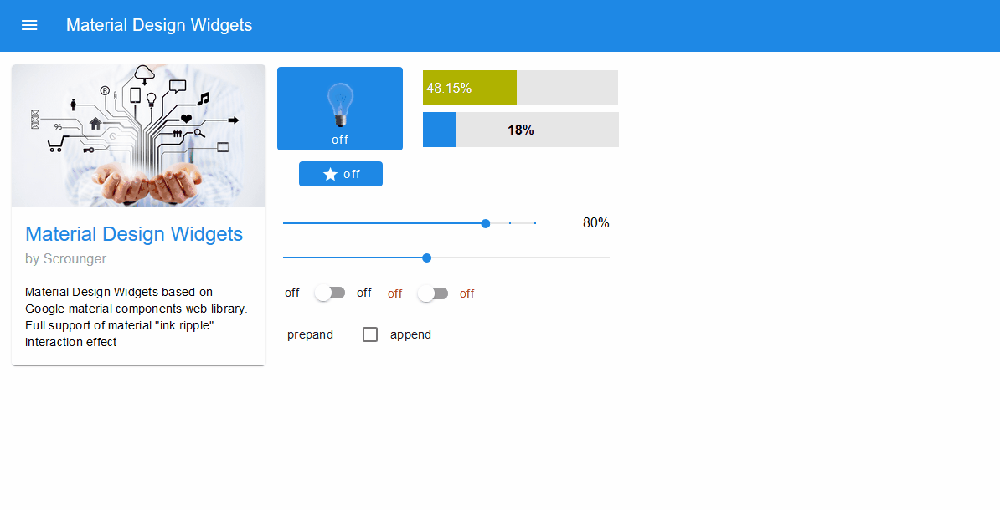

##### Layout permanent:
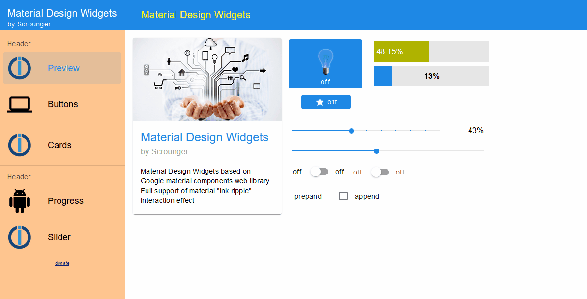

##### Layout automatisch:
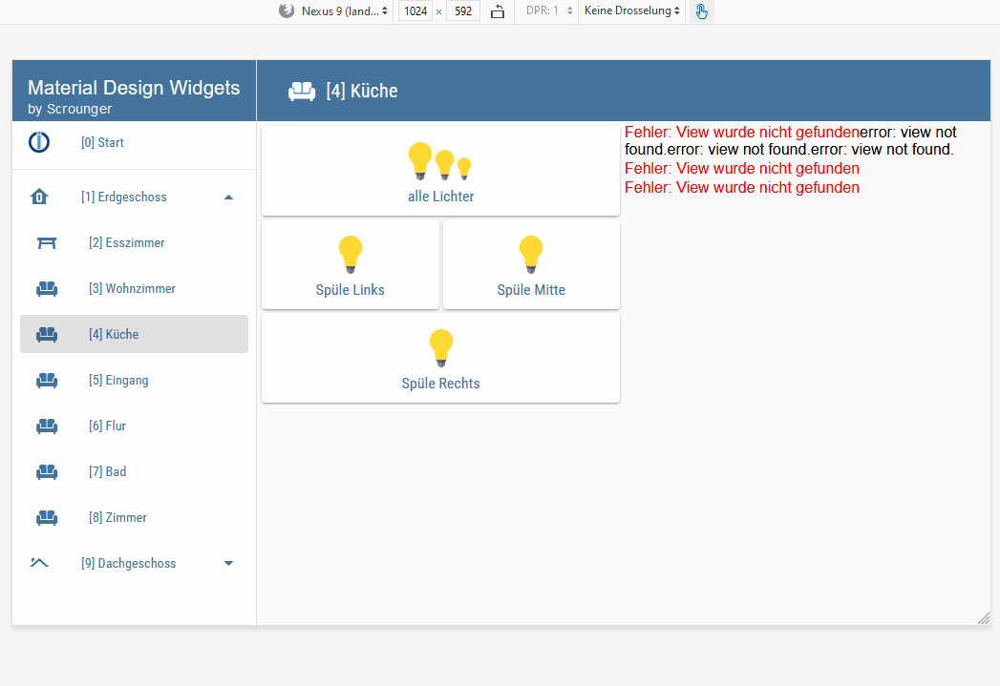

Layout 'auto' schaltet je nach Bildschirmauflösung automatisch zwischen Layout 'modal' und 'permanent' um. Über den VIS-Editor können Sie einstellen, ab welcher Auflösung das 'permanente' Layout verwendet werden soll (größer als Bedingung).

**Hinweis: Verwendung mit dem Widget „In Widget 8 anzeigen“**

Um mit dem Widget 'Ansicht in Widget 8' korrekt zu arbeiten, müssen Sie eine CSS-Medienregel definieren.

* Weisen Sie dem Widget zunächst eine "Common CSS Rule" zu, z.B. namens `my-view-in-widget8`.
* Fügen Sie dann das folgende CSS zu Ihrem Projekt hinzu:

```
.my-view-in-widget8 {
    top: 64px !important;
    height: calc(100% - 64px) !important;
    overflow-y: auto;
}
@media screen and (max-width: 800px) {
    /* Resolution lower than 800px -> using 'modal' layout */
    .my-view-in-widget8 {
        left: 0 !important;
        width: 100% !important;
    }
}
@media screen and (min-width: 800px) {
    /* Resolution higher than 800px -> using 'modal' layout */
    .my-view-in-widget8 {
        left: 256px !important;
        width: calc(100% - 256px) !important;
    }
}
```

* Passen Sie im CSS die Auflösung an die Auflösung an, die Sie über den VIS-Editor einstellen (im Beispiel `max-width: 800px` und `min-width: 800px`)
* Wenn Sie eine benutzerdefinierte Breite für die Menüleiste festlegen, müssen Sie auch die Eigenschaften 'left' und 'width' im CSS auf diesen Wert ändern (im Beispiel `left: 256px !important;` und `width: calc( 100% - 256px) !wichtig;`)

### Editor-Einstellungen
Einstellungen, die in der folgenden Tabelle nicht aufgeführt sind, sind selbsterklärend.

<table><thead><tr><th>Bildschirmfoto</th><th> Rahmen</th><th> Beschreibung</th></tr></thead><tbody><tr><td rowspan=6>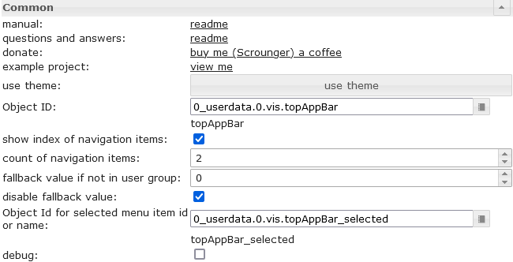</td><td> Objekt Identifikation</td><td> muss auf einen Datenpunkt ab Typnummer gesetzt werden. Zum Beispiel kann dieser Datenpunkt von der <a href="https://www.iobroker.net/#en/documentation/viz/basic.md" target="_blank">Ansicht in Widget 8 verwendet werden</a></td></tr><tr><td> Index der Navigationselemente anzeigen</td><td> zeigt den Navigationsindex vor dem Elementlabel. Diese Nummer kann in der <a href="https://www.iobroker.net/#en/documentation/viz/basic.md" target="_blank">Ansicht in Widget 8 verwendet werden</a> , um die Ansicht zu definieren, die angezeigt werden soll, wenn das Element ausgewählt ist</td></tr><tr><td> Anzahl der Navigationselemente</td><td> Definieren Sie die Anzahl der Navigationselemente</td></tr><tr><td> Fallback-Wert, wenn nicht in Benutzergruppe</td><td> Wenn Sie die Gruppenberechtigungen verwenden, können Sie hier den Wert festlegen, zu dem gewechselt werden soll, wenn der Benutzer nicht in der Gruppe ist</td></tr><tr><td> Fallback-Wert deaktivieren</td><td> Fallback-Wert deaktivieren</td></tr><tr><td> Objekt-ID für ausgewählte Menüelement-ID oder Name</td><td> Optional können Sie einen Datenpunkt angeben, in den der Name oder die Menü-ID des ausgewählten Navigationselements geschrieben wird.<br> Wird keine Menü-ID angegeben, wird der Text des Navigationselements verwendet. Handelt es sich bei dem ausgewählten Navigationselement um ein Untermenü, wird der Name bzw. die Menü-ID des entsprechenden Navigationselements und Untermenüelements mit einem &#39;.&#39; getrennt geschrieben, zB <code>EG.Wohnzimmer</code><br><br> Damit lassen sich beispielsweise Widgets dynamisch je nach ausgewähltem Navigationselement erstellen.</td></tr><tr><td rowspan=2>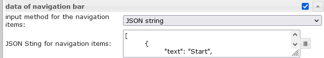</td><td> Eingabemethode für die Navigationselemente</td><td> Wählen Sie aus, ob die Navigationselemente vom VIS-Editor oder vom JSON-String erstellt werden.</td></tr><tr><td> JSON-String für Navigationselemente</td><td> <a href="#menu-json-properties-2">Details siehe Menü JSON-Eigenschaften und Untermenü JSON-Eigenschaften</a></td></tr></tbody></table>

### Menü JSON-Eigenschaften
Menüelemente können durch einen JSON-String definiert werden:

<table><thead><tr><th>Eigentum</th><th> Beschreibung</th><th> Art</th><th> Werte</th></tr></thead><tbody><tr><td> menuId</td><td> Definieren Sie eine benutzerdefinierte ID für das Menüelement, wird in die &quot;Objekt-ID für die ausgewählte Menüelement-ID oder den Namen&quot; geschrieben, wenn ausgewählt</td><td> Schnur</td><td></td></tr><tr><td> Text</td><td> Text des Menüpunktes</td><td> Schnur</td><td></td></tr><tr><td> Header</td><td> Kopfzeile des Menüpunktes</td><td> Schnur</td><td></td></tr><tr><td> Symbol</td><td> Symbol oder Bildpfad des Eintrags</td><td> Schnur</td><td></td></tr><tr><td> SymbolFarbe</td><td> Symbolfarbe (funktioniert nicht, wenn Bild verwendet wird)</td><td> Farbe</td><td> hex(#44739e), rgb(20, 50, 200), rgba(20, 50, 200, 0,5)</td></tr><tr><td> Teiler</td><td> einen Teiler anzeigen</td><td> boolesch</td><td> Falsch Richtig</td></tr><tr><td> Benutzergruppen</td><td> Benutzergruppen, die diesen Eintrag anzeigen und steuern dürfen.</td><td> Array[string]</td><td> ID der Benutzergruppen</td></tr><tr><td> VerhaltenNotInUserGroup</td><td> Eintrag ausblenden oder deaktivieren, wenn Benutzer nicht Teil der Benutzergruppe ist</td><td> Schnur</td><td> verstecken, deaktiviert</td></tr><tr><td> setValueOnMenuToggleClick</td><td> Wert einstellen beim Klicken auf ein Element, das das Untermenü umschaltet</td><td> boolesch</td><td> Falsch Richtig</td></tr><tr><td> subMenuIconColor</td><td> Symbolfarbe der Untermenüpunkte (funktioniert nicht, wenn Bild verwendet wird)</td><td> Farbe</td><td> hex(#44739e), rgb(20, 50, 200), rgba(20, 50, 200, 0,5)</td></tr><tr><td> Untermenüs</td><td> Objekt mit Untermenüpunkten, <a href="#submenu-json-properties">Details siehe Untermenü JSON-Eigenschaften</a></td><td> Array[Untermenü]</td><td></td></tr></tbody></table>

<!-- im Inhaltsverzeichnis weglassen -->

#### Menü JSON-Eigenschaften - Beispiel
<details> <pre><code> [ { "text": "Start", "divider": "true", "icon": "home" }, { "menuId": "EG", "text": "Erdgeschoss", "icon": "home-floor-0", "setValueOnMenuToggleClick": "true", "subMenus": [ { "menuId": "Esszimmer", "text": "Esszimmer", "icon": "table-furniture" }, { "menuId": "Wohnzimmer", "text": "Wohnzimmer", "icon": "sofa" }, { "menuId": "Kueche", "text": "Küche", "icon": "sofa" }, { "menuId": "Eingang", "text": "Eingang", "icon": "sofa" }, { "menuId": "Flur", "text": "Flur", "icon": "sofa" }, { "menuId": "Bad", "text": "Bad", "icon": "sofa" }, { "menuId": "Zimmer", "text": "Zimmer", "icon": "sofa" } ] }, { "menuId": "DG", "text": "Dachgeschoss", "icon": "home-roof", "setValueOnMenuToggleClick": "true", "subMenus": [ { "text": "Flur", "icon": "table-furniture" }, { "text": "Galerie", "icon": "sofa" }, { "text": "Schlafzimmer", "icon": "sofa" }, { "text": "Ankleide", "icon": "sofa" }, { "text": "Bad", "icon": "sofa" }, { "text": "Kinderzimmer", "icon": "sofa" } ] } ] </code></pre> </details>

### Untermenü
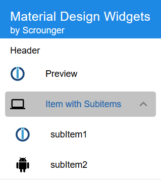

Untermenüs müssen durch einen JSON-String definiert werden:

#### Untermenü JSON-Eigenschaften
<table><thead><tr><th>Eigentum</th><th> Beschreibung</th><th> Art</th><th> Werte</th></tr></thead><tbody><tr><td> menuId</td><td> Definieren Sie eine benutzerdefinierte ID für das Menüelement, wird in die &quot;Objekt-ID für die ausgewählte Menüelement-ID oder den Namen&quot; geschrieben, wenn ausgewählt</td><td> Schnur</td><td></td></tr><tr><td> Text</td><td> Text des Untermenüs</td><td> Schnur</td><td></td></tr><tr><td> Symbol</td><td> Symbol oder Bildpfad des Eintrags</td><td> Schnur</td><td></td></tr><tr><td> SymbolFarbe</td><td> Symbolfarbe (funktioniert nicht, wenn Bild verwendet wird)</td><td> Farbe</td><td> hex(#44739e), rgb(20, 50, 200), rgba(20, 50, 200, 0,5)</td></tr><tr><td> Teiler</td><td> einen Teiler anzeigen</td><td> boolesch</td><td> Falsch Richtig</td></tr><tr><td> Benutzergruppen</td><td> Benutzergruppen, die diesen Eintrag anzeigen und steuern dürfen.</td><td> Array[string]</td><td> ID der Benutzergruppen</td></tr><tr><td> VerhaltenNotInUserGroup</td><td> Eintrag ausblenden oder deaktivieren, wenn Benutzer nicht Teil der Benutzergruppe ist</td><td> Schnur</td><td> verstecken, deaktiviert</td></tr></tbody></table>

<!-- im Inhaltsverzeichnis weglassen -->

##### Untermenü JSON-Eigenschaften - Beispiel
<details> <pre><code> [ { "text": "subitem0", "icon": "account", "iconColor": "red" }, { "text": "subitem1", "icon": "home", "iconColor": "green", "divider": "true" }, { "text": "subitem1", "divider": "true", "icon": "/vis.0/myImages/devices/lxc_iobroker.png", "userGroups": ["administrator", "user"], "behaviorNotInUserGroup": "disabled" } ] </code></pre> </details>

## Diagramme
### Balkendiagramm


#### Editor-Einstellungen
Einstellungen, die in der folgenden Tabelle nicht aufgeführt sind, sind selbsterklärend.

<table><thead><tr><th>Bildschirmfoto</th><th> Rahmen</th><th> Beschreibung </th></tr></thead><tbody><tr><td rowspan=3></td><td>setze Datensätze mit</td><td> Die Daten für das BarChart können über den Editor eingegeben oder ein JSON-String verwendet werden</td></tr><tr><td> Anzahl der Teile</td><td> Anzahl der Balken mit vis Editor für die Daten der Liste</td></tr><tr><td> Objekt Identifikation</td><td> Objekt-ID des Datenpunkts, der die Json-Zeichenfolge enthält. Zulässige Eigenschaften werden unten beschrieben</td></tr><tr><td rowspan=></td><td> Objekt-ID[x]</td><td> Objekt-ID für die einzelnen Balken mit dem vis-Editor</td></tr></tbody></table>

#### Dataset-JSON-Eigenschaften
Der JSON-String muss ein Array von Objekten mit den folgenden Eigenschaften sein:

<table><thead><tr><th>Eigentum</th><th> Beschreibung</th><th> Art</th><th> Werte</th></tr></thead><tbody><tr><td> Etikette</td><td> Achsenbeschriftung des Balkens</td><td> Schnur</td><td/></tr><tr><td> Wert</td><td> Balkenwert</td><td> Nummer</td><td/></tr><tr><td> dataColor</td><td> Balkenfarbe</td><td> hex(#44739e), rgb(20, 50, 200), rgba(20, 50, 200, 0,5)</td><td/></tr><tr><td> WertText</td><td> Text des Balkens überschreiben</td><td> Schnur</td><td/></tr><tr><td> WertFarbe</td><td> Farbe des Werttextes</td><td> hex(#44739e), rgb(20, 50, 200), rgba(20, 50, 200, 0,5)</td><td/></tr><tr><td> WertAnhang</td><td> Anhang des Wertetextes</td><td> Schnur</td><td/></tr><tr><td> KurzinfoTitel</td><td> Tooltip-Titel</td><td> Schnur</td><td/></tr><tr><td> TooltipText</td><td> Tooltip-Text</td><td> Schnur</td><td/></tr></tbody></table>

<!-- im Inhaltsverzeichnis weglassen -->

#### Dataset-JSON-Eigenschaften - Beispiel
<details> <pre><code> [ { "label": "val0", "value": "30", "valueColor": "#ffffff" }, { "label": "val1", "value": "12.54645646", "tooltipTitle": "myTitle" }, { "label": "val2", "value": "48", "dataColor": "#c2c2c2", "valueAppendix": "\n extra" }, { "label": "val3", "value": "97", "valueColor": "#ffffff" }, { "label": "val4", "value": "32", "valueText": "text" } ] </pre></code> </details>

### Kuchendiagramm


#### Editor-Einstellungen
Einstellungen, die in der folgenden Tabelle nicht aufgeführt sind, sind selbsterklärend.

<table><thead><tr><th>Bildschirmfoto</th><th> Rahmen</th><th> Beschreibung </th></tr></thead><tbody><tr><td rowspan=3></td><td>setze Datensätze mit</td><td> Die Daten für das PieChart können über den Editor eingegeben oder ein JSON-String verwendet werden</td></tr><tr><td> Anzahl der Teile</td><td> Anzahl der Tortenstücke mit vis Editor für die Daten der Liste</td></tr><tr><td> Objekt Identifikation</td><td> Objekt-ID des Datenpunkts, der die Json-Zeichenfolge enthält. Zulässige Eigenschaften werden unten beschrieben</td></tr><tr><td rowspan=></td><td> Objekt-ID[x]</td><td> Objekt-ID für die einzelnen Tortenstücke mit dem Vis-Editor</td></tr></tbody></table>

#### Dataset-JSON-Eigenschaften
Der JSON-String muss ein Array von Objekten mit den folgenden Eigenschaften sein:

<table><thead><tr><th>Eigentum</th><th> Beschreibung</th><th> Art</th><th> Werte</th></tr></thead><tbody><tr><td> Etikette</td><td> Achsenbeschriftung des Kuchens</td><td> Schnur</td><td/></tr><tr><td> Wert</td><td> Kuchenwert</td><td> Nummer</td><td/></tr><tr><td> dataColor</td><td> Kuchenfarbe</td><td> hex(#44739e), rgb(20, 50, 200), rgba(20, 50, 200, 0,5)</td><td/></tr><tr><td> WertText</td><td> überschreibe den Text des Kuchens</td><td> Schnur</td><td/></tr><tr><td> WertFarbe</td><td> Farbe des Werttextes</td><td> hex(#44739e), rgb(20, 50, 200), rgba(20, 50, 200, 0,5)</td><td/></tr><tr><td> WertAnhang</td><td> Anhang des Wertetextes</td><td> Schnur</td><td/></tr><tr><td> KurzinfoTitel</td><td> Tooltip-Titel</td><td> Schnur</td><td/></tr><tr><td> TooltipText</td><td> Tooltip-Text</td><td> Schnur</td><td/></tr></tbody></table>

<!-- im Inhaltsverzeichnis weglassen -->

#### Dataset-JSON-Eigenschaften - Beispiel
<details> <pre><code> [ { "label": "val0", "value": "30", "valueColor": "#ffffff" }, { "label": "val1", "value": "12.54645646" }, { "label": "val2", "value": "48", "dataColor": "#c2c2c2", "valueAppendix": "\nextra" }, { "label": "val3", "value": "97", "valueColor": "#ffffff" }, { "label": "val4", "value": "32", "valueText": "text" } ] </pre></code> </details>

### Linienverlaufsdiagramm:
> Benötigter Adapter: [SQL](https://github.com/ioBroker/ioBroker.sql), [History](https://github.com/ioBroker/ioBroker.history) oder [InfluxDb](https://github.com/ioBroker/ioBroker.influxdb)!

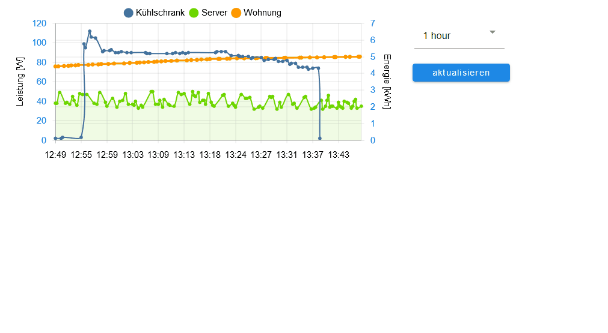

#### Editor-Einstellungen
Einstellungen, die in der folgenden Tabelle nicht aufgeführt sind, sind selbsterklärend.

<table><thead><tr><th>Bildschirmfoto</th><th> Rahmen</th><th> Beschreibung </th></tr></thead><tbody><tr><td rowspan=5>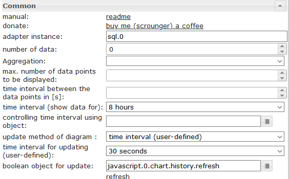</td><td> Adapterinstanz</td><td> Instanz für den SQL- oder History-Adapter</td></tr><tr><td> Zeitintervall mit Objekt steuern using</td><td> ID eines Datenpunkts zum Ändern des Zeitintervalls des Diagramms.<br><br> Wenn der Datenpunkt vom Typ &#39;String&#39; ist, muss er <a href="https://github.com/Scrounger/ioBroker.vis-materialdesign/blob/235530e4e54346b5527333ca06ce596519954c67/widgets/materialdesign/js/materialdesign.chart.js#L802">einen der verknüpften Werte enthalten</a><br> Wenn der Datenpunkt vom Typ &#39;Zahl&#39; ist, muss er den Startzeitstempel des Graphen enthalten.<br><br> Hier können Sie beispielsweise über eine Schaltfläche die Darstellung des Diagramms zur Laufzeit ändern</td></tr><tr><td> boolesches Objekt für Update</td><td> ID eines Datenpunkts, um eine manuelle Aktualisierung des Diagramms auszulösen.<br> Hier können Sie beispielsweise über eine Schaltfläche das Diagramm zur Laufzeit aktualisieren</td></tr><tr><td> Diagramm-Timeout</td><td> Timeout für das Laden der Chartdaten. Wenn Sie eine Timeout-Fehlermeldung erhalten, erhöhen Sie diesen Wert</td></tr><tr><td> Debug-Modus</td><td> Wenn Sie Probleme oder Fehler haben, aktivieren Sie den Debug-Modus und hängen Sie die Konsolenprotokolldaten (F12) an das Problem an</td></tr><tr><td rowspan=5></td><td> Objekt-ID[x]</td><td> ID des Datenpunkts mit aktivierter History-Instanz</td></tr><tr><td> Anzeigemethode[x]</td><td> <a href="https://www.iobroker.net/docu/index-195.htm?page_id=198&lang=en#Aggregation">Aggregationsmethode</a></td></tr><tr><td> max. Anzahl der anzuzeigenden Datenpunkte[x]</td><td> Anzahl der maximal anzuzeigenden Datenpunkte</td></tr><tr><td> Zeitintervall zwischen den Datenpunkten in [s][x]</td><td> Optionale Einstellung, überschreibt die &#39;count&#39;-Einstellung.<br> Abstand zwischen den einzelnen Datenpunkten in Sekunden.<br> Wenn Sie beispielsweise jede Minute Datenpunkte anzeigen möchten, müssen Sie hier 60 eingeben enter</td></tr><tr><td> Daten multiplizieren mit[x]</td><td> Optionale Einstellung, multiplizieren Sie jeden Datenpunkt mit dem angegebenen Wert</td></tr><tr><td>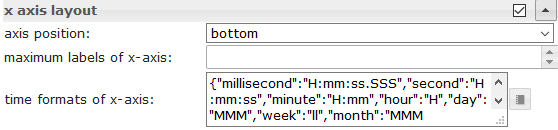</td><td> Zeitformate der x-Achse</td><td> Ändern Sie das Zeitformat der X-Achse. Für alle Zeiteinheiten müssen Zeitformate eingegeben werden, <a href="https://github.com/Scrounger/ioBroker.vis-materialdesign/blob/c677220868961b3cf0b153fb8bf04e13b4475c09/widgets/materialdesign/js/materialdesign.chart.js#L805">die folgenden Zeiteinheiten sind zulässig.</a><br> Genehmigte Zeitformate müssen gemäß der Bibliothek moment.js eingegeben werden, <a href="https://momentjs.com/docs/#/displaying/">siehe Link</a></td></tr><tr><td>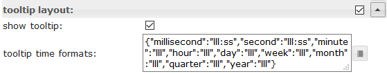</td><td> Tooltip-Zeitformate</td><td> Ändern Sie das Zeitformat des Tooltips. Für alle Zeiteinheiten müssen Zeitformate eingegeben werden, <a href="https://github.com/Scrounger/ioBroker.vis-materialdesign/blob/c677220868961b3cf0b153fb8bf04e13b4475c09/widgets/materialdesign/js/materialdesign.chart.js#L805">die folgenden Zeiteinheiten sind zulässig.</a><br> Genehmigte Zeitformate müssen gemäß der Bibliothek moment.js eingegeben werden, <a href="https://momentjs.com/docs/#/displaying/">siehe Link</a></td></tr></tbody></table>

###JSON-Diagramm
Mit dem JSON-Diagramm haben Sie die maximale Freiheit, ein gemischtes Diagramm (Linie, Balken und gestapelte Balken) per Skript zu erstellen.

 

#### JSON-Eigenschaften
<!-- im Inhaltsverzeichnis weglassen -->

##### Allgemeines
<table><thead><tr><th>Eigentum</th><th> Beschreibung</th><th> Art</th><th> Werte</th></tr></thead><tbody><tr><td> AchseLabels</td><td> Achsenbeschriftung des Diagramms</td><td> Array</td><td> Zahlen oder Zeichenfolge</td></tr><tr><td> Grafiken</td><td> Daten von Grafiken</td><td> Array&lt; <a href="#graph">Graph</a> &gt;</td><td> siehe Grafik</td></tr></tbody></table>

<!-- im Inhaltsverzeichnis weglassen -->

#####-Grafik
<details><table><thead><tr><th>Eigentum</th><th> Beschreibung</th><th> Art</th><th> Werte</th></tr></thead><tbody><tr><td> Daten</td><td> Daten des Graphen oder Daten mit Zeitstempel</td><td> Array[Zahlen] | Array[ <a href="#values-with-timestamp">Werte mit Zeitstempel</a> ]</td><td> Nummer</td></tr><tr><td> Art</td><td> Art der Grafik</td><td> Schnur</td><td> &#39;Linie&#39;, &#39;Balken&#39;</td></tr><tr><td> LegendeText</td><td> Text der Legende</td><td> Schnur</td><td></td></tr><tr><td> Bestellung anzeigen</td><td> Overlay-Reihenfolge des Graphen</td><td> Nummer</td><td> 1, 2, ...</td></tr><tr><td> Farbe</td><td> Farbe der Grafik</td><td> Farbe</td><td> hex(#44739e), rgb(20, 50, 200), rgba(20, 50, 200, 0,5)</td></tr><tr><td> use_gradient_color</td><td> Farbverlauf verwenden</td><td> boolesch</td><td> Falsch Richtig</td></tr><tr><td> Farbverlauf</td><td> Farbverlauf-Array</td><td> Array[ <a href="#gradientcolor">gradientColor</a> ]</td><td> [ { Wert: -20, Farbe: &#39;#7d3c98&#39; }, { Wert: 0, Farbe: &#39;#2874a6&#39; } ]</td></tr><tr><td> tooltip_title</td><td> Titel des Tooltips</td><td> Zeichenfolge | Array[string]</td><td></td></tr><tr><td> tooltip_text</td><td> Übersichtlicher Text des Tooltips</td><td> Zeichenfolge | Array[string]</td><td></td></tr><tr><td> tooltip_MinDigits</td><td> maximale Dezimalstellen des Tooltip-Werts</td><td> Nummer</td><td> 0, 1, 2, ...</td></tr><tr><td> tooltip_MaxDigits</td><td> maximale Dezimalstellen des Tooltip-Werts</td><td> Nummer</td><td> 0, 1, 2, ...</td></tr><tr><td> tooltip_AppendText</td><td> Text an Tooltip-Wert anhängen</td><td> Schnur</td><td></td></tr><tr><td> datalabel_show</td><td> Datenlabels für Diagramm anzeigen</td><td> Zeichenfolge | boolesch</td><td> falsch, wahr, automatisch</td></tr><tr><td> datalabel_anchor</td><td> Anker von Datenlabels</td><td> Schnur</td><td> Mitte, Anfang, Ende</td></tr><tr><td> datalabel_align</td><td> Position des Datenlabels relativ zum Ankerpunkt</td><td> Schnur</td><td> links, Anfang, Mitte, Ende, rechts, oben, unten</td></tr><tr><td> datalabel_offset</td><td> Abstand (in Pixel), um die Datenbeschriftung vom Ankerpunkt wegzuziehen</td><td> Nummer</td><td> 0, 1, 2, ...</td></tr><tr><td> datalabel_text_align</td><td> Textausrichtung des Datenetiketts</td><td> Schnur</td><td> links, Anfang, Mitte, Ende, rechts</td></tr><tr><td> datalabel_rotation</td><td> Drehwinkel im Uhrzeigersinn (in Grad) des Datenetiketts</td><td> Nummer</td><td> 0, 1, 2, ...</td></tr><tr><td> datalabel_steps</td><td> Datenlabel alle x Schritte anzeigen</td><td> Nummer</td><td> 0, 1, 2, ...</td></tr><tr><td> datalabel_minDigits</td><td> minimale Dezimalstellen von Datenlabels</td><td> Nummer</td><td> 0, 1, 2, ...</td></tr><tr><td> datalabel_maxDigits</td><td> maximale Dezimalstellen von Datenlabels</td><td> Nummer</td><td> 0, 1, 2, ...</td></tr><tr><td> datalabel_override</td><td> Text des Datenlabels überschreiben</td><td> Array[string]</td><td></td></tr><tr><td> datalabel_append</td><td> Text an Datenetikett anhängen</td><td> Schnur</td><td></td></tr><tr><td> datalabel_color</td><td> Farbe des Datenetiketts</td><td> Farbe | Array[Farben]</td><td> hex(#44739e), rgb(20, 50, 200), rgba(20, 50, 200, 0,5)</td></tr><tr><td> datalabel_fontFamily</td><td> Schriftfamilie für Datenetiketten</td><td> Schnur</td><td></td></tr><tr><td> datalabel_fontSize</td><td> Schriftgröße für Datenetiketten</td><td> Nummer</td><td> 1, 2, 5, ...</td></tr><tr><td> datalabel_backgroundColor</td><td> Hintergrundfarbe des Datenetiketts</td><td> Farbe | Array[Farben]</td><td> hex(#44739e), rgb(20, 50, 200), rgba(20, 50, 200, 0,5)</td></tr><tr><td> datalabel_borderColor</td><td> Rahmenfarbe des Datenetiketts</td><td> Farbe | Array[Farben]</td><td> hex(#44739e), rgb(20, 50, 200), rgba(20, 50, 200, 0,5)</td></tr><tr><td> datalabel_borderWidth</td><td> Breite des Datenetiketts</td><td> Nummer</td><td> 1, 2, 5, ...</td></tr><tr><td> datalabel_borderRadius</td><td> Randradius des Datenetiketts</td><td> Nummer</td><td> 1, 2, 5, ...</td></tr></tbody></table></details>

<!-- im Inhaltsverzeichnis weglassen -->

##### Diagramm Liniendiagramm spfeicifc
<details><table><thead><tr><th>Eigentum</th><th> Beschreibung</th><th> Art</th><th> Werte</th></tr></thead><tbody><tr><td> line_pointStyle</td><td> Punktstil der Linie</td><td> Schnur</td><td> Kreis, Kreuz, KreuzRot, Strich, Linie, Rechteck, RechteckGerundet, RectRot, Stern, Dreieck</td></tr><tr><td> line_pointSize</td><td> Punktgröße der Linie</td><td> Nummer</td><td> 1, 2, 3, ...</td></tr><tr><td> line_pointSizeHover</td><td> Punktgröße der Linie</td><td> Nummer</td><td> 1, 2, 3, ...</td></tr><tr><td> line_PointColor</td><td> Farbe des Linienpunktes</td><td> Farbe | Array[Farben]</td><td> hex(#44739e), rgb(20, 50, 200), rgba(20, 50, 200, 0,5)</td></tr><tr><td> line_PointColorBorder</td><td> Rahmenfarbe des Linienpunktes</td><td> Farbe | Array[Farben]</td><td> hex(#44739e), rgb(20, 50, 200), rgba(20, 50, 200, 0,5)</td></tr><tr><td> line_PointColorHover</td><td> Schwebefarbe des Linienpunktes</td><td> Farbe | Array[Farben]</td><td> hex(#44739e), rgb(20, 50, 200), rgba(20, 50, 200, 0,5)</td></tr><tr><td> line_PointColorBorderHover</td><td> Rahmen-Hover-Farbe des Linienpunktes</td><td> Farbe | Array[Farben]</td><td> hex(#44739e), rgb(20, 50, 200), rgba(20, 50, 200, 0,5)</td></tr><tr><td> line_spanGaps</td><td> Linien ziehen, wenn Daten Lücken aufweisen</td><td> boolesch</td><td> Falsch Richtig</td></tr><tr><td> line_steppedLine</td><td> gestufte Linie aktivieren</td><td> boolesch</td><td> Falsch Richtig</td></tr><tr><td> line_Tension</td><td> Geschmeidigkeit der Linie</td><td> Nummer</td><td> 0 - 1</td></tr><tr><td> dicke der Linie</td><td> Linienstärke</td><td> Nummer</td><td> 1, 2, 5, ...</td></tr><tr><td> line_UseFillColor</td><td> Füllfarbe unter Linie verwenden</td><td> boolesch</td><td> Falsch Richtig</td></tr><tr><td> line_FillColor</td><td> Füllfarbe unter Linie</td><td> Farbe</td><td> hex(#44739e), rgb(20, 50, 200), rgba(20, 50, 200, 0,5)</td></tr><tr><td> use_line_gradient_fill_color</td><td> Verwenden Sie eine Farbverlaufsfüllfarbe</td><td> boolesch</td><td> Falsch Richtig</td></tr><tr><td> line_gradient_fill_color</td><td> Farbverlauf-Array</td><td> Array[ <a href="#gradientcolor">gradientColor</a> ]</td><td> [ { Wert: -20, Farbe: &#39;#7d3c98&#39; }, { Wert: 0, Farbe: &#39;#2874a6&#39; } ]</td></tr><tr><td> line_FillBetweenLines</td><td> Füllfarbe zur nächsten / vorherigen Zeile</td><td> Schnur</td><td> &#39;+1&#39;, &#39;-1&#39;, &#39;+2&#39;, ...</td></tr></tbody></table></details>

<!-- im Inhaltsverzeichnis weglassen -->

##### Diagramm Balkendiagramm spfeicifc
<details><table><thead><tr><th>Eigentum</th><th> Beschreibung</th><th> Art</th><th> Werte</th></tr></thead><tbody><tr><td> barIsStacked</td><td> gestapelter Balken. Wenn Sie ein kombiniertes Diagramm (Linie + gestapelter Balken) haben, müssen Sie diesen Wert auch für den Liniendatensatz festlegen!</td><td> boolesch</td><td> Falsch Richtig</td></tr><tr><td> barStackId</td><td> ID des Stapels. Bar, die zu einem Stack kombiniert werden soll, muss die gleiche ID haben</td><td> Nummer</td><td> 1, 2, 5, ...</td></tr><tr><td> barColorHover</td><td> Hover-Farbe des Balkens</td><td> Farbe | Array[Farben]</td><td> hex(#44739e), rgb(20, 50, 200), rgba(20, 50, 200, 0,5)</td></tr><tr><td> BalkenBorderColor</td><td> Rahmenfarbe des Balkens</td><td> Farbe | Array[Farben]</td><td> hex(#44739e), rgb(20, 50, 200), rgba(20, 50, 200, 0,5)</td></tr><tr><td> barGrenze</td><td> Dicke der Balkengrenze</td><td> Nummer</td><td> 1, 2, 5, ...</td></tr><tr><td> barBorderColorHover</td><td> Rahmen-Hover-Farbe des Balkens</td><td> Farbe | Array[Farben]</td><td> hex(#44739e), rgb(20, 50, 200), rgba(20, 50, 200, 0,5)</td></tr><tr><td> barBorderWidthHover</td><td> Schwebestärke der Balkengrenze</td><td> Nummer</td><td> 1, 2, 5, ...</td></tr></tbody></table></details>

<!-- im Inhaltsverzeichnis weglassen -->

##### Graph y-Achse
<details><table><thead><tr><th>Eigentum</th><th> Beschreibung</th><th> Art</th><th> Werte</th></tr></thead><tbody><tr><td> yAxis_id</td><td> ID der y-Achse. Wenn Sie eine gemeinsame y-Achse für mehrere Diagrammdaten verwenden möchten, verwenden Sie dieselbe ID.</td><td> Nummer</td><td> 1, 2, 5, ...</td></tr><tr><td> yAchse_position</td><td> Position der y-Achse</td><td> Schnur</td><td> links rechts</td></tr><tr><td> yAxis_show</td><td> y-Achse anzeigen</td><td> boolesch</td><td> Falsch Richtig</td></tr><tr><td> yAxis_title_text</td><td> Y-Achsentitel</td><td> Schnur</td><td></td></tr><tr><td> yAxis_title_color</td><td> Titelfarbe der y-Achse überschreiben</td><td> Farbe</td><td> hex(#44739e), rgb(20, 50, 200), rgba(20, 50, 200, 0,5)</td></tr><tr><td> yAxis_title_fontFamily</td><td> y-Achsen-Titelschriftfamilie überschreiben</td><td> Schnur</td><td></td></tr><tr><td> yAxis_title_fontSize</td><td> Schriftgröße des Titels der Y-Achse überschreiben</td><td> Nummer</td><td> 1, 2, 5, ...</td></tr><tr><td> yAchse_min</td><td> Mindestwert der y-Achse</td><td> Nummer</td><td> 1, 2, 5, ...</td></tr><tr><td> yAchse_max</td><td> Maximalwert der y-Achse</td><td> Nummer</td><td> 1, 2, 5, ...</td></tr><tr><td> yAchse_Schritt</td><td> Schritte der y-Achse</td><td> Nummer</td><td> 1, 2, 5, ...</td></tr><tr><td> yAxis_minimumDigits</td><td> y-Achse minimale Anzahl von Dezimalstellen</td><td> Nummer</td><td> 1, 2, 5, ...</td></tr><tr><td> yAxis_maximumDigits</td><td> y-Achse maximale Anzahl von Dezimalstellen</td><td> Nummer</td><td> 1, 2, 5, ...</td></tr><tr><td> yAxis_maxSteps</td><td> maximale Schritte der y-Achse</td><td> Nummer</td><td> 1, 2, 5, ...</td></tr><tr><td> yAchse_Abstand</td><td> y-Achsenwert Abstand zur Achse überschreiben</td><td> Nummer</td><td> 1, 2, 5, ...</td></tr><tr><td> yAchse_Anhang</td><td> Text an y-Achsenwert anhängen</td><td> Schnur</td><td></td></tr><tr><td> yAchse_Farbe</td><td> Wertfarbe der y-Achse überschreiben</td><td> Farbe</td><td> hex(#44739e), rgb(20, 50, 200), rgba(20, 50, 200, 0,5)</td></tr><tr><td> yAxis_fontFamily</td><td> y-Achsen-Wert-Schriftfamilie überschreiben</td><td> Schnur</td><td></td></tr><tr><td> yAxis_fontSize</td><td> Schriftgröße für y-Achsenwert überschreiben</td><td> Nummer</td><td> 1, 2, 5, ...</td></tr><tr><td> yAxis_zeroLineWidth</td><td> Breite der y-Achsen-Nulllinie</td><td> Nummer</td><td> 0,3, 1,5, 4, ...</td></tr><tr><td> yAxis_zeroLineColor</td><td> Farbe der Nulllinie der y-Achse</td><td> Farbe</td><td> hex(#44739e), rgb(20, 50, 200), rgba(20, 50, 200, 0,5)</td></tr><tr><td> yAxis_gridLines_show</td><td> y-Achsen-Gitterlinien anzeigen</td><td> boolesch</td><td> Falsch Richtig</td></tr><tr><td> yAxis_gridLines_color</td><td> Farbe der Gitterlinien der y-Achse</td><td> Farbe</td><td> hex(#44739e), rgb(20, 50, 200), rgba(20, 50, 200, 0,5)</td></tr><tr><td> yAxis_gridLines_lineWidth</td><td> Breite der Rasterlinien</td><td> Nummer</td><td> 0 - 1</td></tr><tr><td> yAxis_gridLines_border_show</td><td> Rand der y-Achsen-Gitterlinien anzeigen</td><td> boolesch</td><td> Falsch Richtig</td></tr><tr><td> yAxis_gridLines_ticks_show</td><td> y-Achsen-Rasterintervall-Ticks anzeigen</td><td> boolesch</td><td> Falsch Richtig</td></tr><tr><td> yAxis_gridLines_ticks_length</td><td> Länge der Rasterstriche auf der y-Achse</td><td> Nummer</td><td> 1, 2, 5, ...</td></tr></tbody></table></details>

<!-- im Inhaltsverzeichnis weglassen -->

##### Farbverlauf
<details><table><thead><tr><th>Eigentum</th><th> Beschreibung</th><th> Art</th><th> Werte</th></tr></thead><tbody><tr><td> Wert</td><td> Wert, wo Farbe aufgetragen werden soll</td><td> Nummer</td><td> 1, 2, 5, ...</td></tr><tr><td> Farbe</td><td> Farbe für Wert</td><td> Farbe</td><td> hex(#44739e), rgb(20, 50, 200), rgba(20, 50, 200, 0,5)</td></tr></tbody></table></details>

<!-- im Inhaltsverzeichnis weglassen -->

##### Diagramm mit Zeitachse JSON-Diagramm unterstützt Daten mit Zeitstempel. Dazu muss das Datenarray Werte für Zeitstempel (x-Achsen-Wert) und Wert (y-Achsen-Wert) haben.
###### Werte mit Zeitstempel
<details><table><thead><tr><th>Eigentum</th><th> Beschreibung</th><th> Art</th><th> Werte</th></tr></thead><tbody><tr><td> t</td><td> Zeitstempel - xAchsenwert</td><td> Nummer</td><td> 1, 2, 5, ...</td></tr><tr><td> ja</td><td> Wert für Zeitstempel - yAchsenwert</td><td> Nummer</td><td> 1, 2, 5, ...</td></tr></tbody></table></details>

###### X-Achsen-Einstellungen für Daten mit Zeitstempel
<details><table><thead><tr><th>Eigentum</th><th> Beschreibung</th><th> Art</th><th> Werte</th></tr></thead><tbody><tr><td> xAxis_bounds</td><td> Skalengrenzenstrategie<br><br> &#39;data&#39;: Stellt sicher, dass die Daten vollständig sichtbar sind, Etiketten außerhalb werden entfernt<br> &#39;ticks&#39;: Stellt sicher, dass die Ticks vollständig sichtbar sind, Daten außerhalb werden abgeschnitten</td><td> Zeichenfolge</td><td> Daten, Zecken</td></tr><tr><td> xAxis_timeFormats</td><td> Zeitformate für die x-Achse</td><td> Objekt</td><td> Für alle Zeiteinheiten müssen Zeitformate eingegeben werden, <a href="https://github.com/Scrounger/ioBroker.vis-materialdesign/blob/c677220868961b3cf0b153fb8bf04e13b4475c09/widgets/materialdesign/js/materialdesign.chart.js#L805">die folgenden Zeiteinheiten sind zulässig.</a><br> Genehmigte Zeitformate müssen gemäß der Bibliothek moment.js eingegeben werden, <a href="https://momentjs.com/docs/#/displaying/">siehe Link</a></td></tr><tr><td> xAxis_tooltip_timeFormats</td><td> Zeitformate für die x-Achse</td><td> Zeichenfolge</td><td> Genehmigte Zeitformate müssen gemäß der Bibliothek moment.js eingegeben werden, <a href="https://momentjs.com/docs/#/displaying/">siehe Link</a></td></tr><tr><td> xAxis_time_unit</td><td> erzwinge das Zeitformat für die x-Achse</td><td> Zeichenfolge</td><td> folgende Einheiten sind erlaubt, <a href="https://www.chartjs.org/docs/latest/axes/cartesian/time.html#time-units">siehe Link</a></td></tr></tbody></table></details>

<!-- im Inhaltsverzeichnis weglassen -->

#### Beispiel
<details> <pre><code> { "axisLabels": ["1h", "2h", "3h", "4h", "5h", "6h", "7h", "8h", "9h", "10h", "11h", "12h", "13h", "14h", "17h", "18h", "19h", "20h", "21h", "22h", "23h", "24h"], "graphs": [ { "data": [19, 19, 18, 19, 19, 20, 20, 21, 22, 24, 24, 24, 23, 22, 23, 23, 24, 23, 23, 22, 22, 21, 20, 20], "type": "line", "color": "gray", "legendText": "Temperatur", "line_pointSizeHover": 5, "line_pointSize": 0, "line_Tension": 0.3, "yAxis_show": false, "yAxis_gridLines_show": false, "yAxis_gridLines_ticks_length": 5, "yAxis_min": 0, "yAxis_max": 30, "yAxis_step": 5, "yAxis_position": "left", "yAxis_appendix": " °C", "yAxis_zeroLineWidth": 0.1, "yAxis_zeroLineColor": "black", "displayOrder": 0, "tooltip_AppendText": " °C", "datalabel_backgroundColor": ["#2b9a44", "#2b9a44", "#3aa35b", "#2b9a44", "#2b9a44", "#1d922e", "#1d922e", "#0e8917", "#008000", "#668f00", "#668f00", "#668f00", "#338700", "#008000", "#338700", "#338700", "#668f00", "#338700", "#338700", "#008000", "#008000", "#0e8917", "#1d922e", "#1d922e"], "datalabel_color": "white", "datalabel_offset": -10, "datalabel_fontFamily": "RobotoCondensed-Light", "datalabel_fontSize": 12, "datalabel_borderRadius": 6, "datalabel_show": "auto", "line_PointColor": ["#2b9a44", "#2b9a44", "#3aa35b", "#2b9a44", "#2b9a44", "#1d922e", "#1d922e", "#0e8917", "#008000", "#668f00", "#668f00", "#668f00", "#338700", "#008000", "#338700", "#338700", "#668f00", "#338700", "#338700", "#008000", "#008000", "#0e8917", "#1d922e", "#1d922e"], "line_PointColorBorder": ["#2b9a44", "#2b9a44", "#3aa35b", "#2b9a44", "#2b9a44", "#1d922e", "#1d922e", "#0e8917", "#008000", "#668f00", "#668f00", "#668f00", "#338700", "#008000", "#338700", "#338700", "#668f00", "#338700", "#338700", "#008000", "#008000", "#0e8917", "#1d922e", "#1d922e"], "line_PointColorHover": ["#2b9a44", "#2b9a44", "#3aa35b", "#2b9a44", "#2b9a44", "#1d922e", "#1d922e", "#0e8917", "#008000", "#668f00", "#668f00", "#668f00", "#338700", "#008000", "#338700", "#338700", "#668f00", "#338700", "#338700", "#008000", "#008000", "#0e8917", "#1d922e", "#1d922e"], "line_PointColorBorderHover": ["#2b9a44", "#2b9a44", "#3aa35b", "#2b9a44", "#2b9a44", "#1d922e", "#1d922e", "#0e8917", "#008000", "#668f00", "#668f00", "#668f00", "#338700", "#008000", "#338700", "#338700", "#668f00", "#338700", "#338700", "#008000", "#008000", "#0e8917", "#1d922e", "#1d922e"], "use_gradient_color": true, "gradient_color": [{ "value": -20, "color": "#5b2c6f66" }, { "value": 0, "color": "#2874a666" }, { "value": 14, "color": "#73c6b666" }, { "value": 22, "color": "#00800066" }, { "value": 27, "color": "#ffa50066" }, { "value": 35, "color": "#ff000066" } ], "use_line_gradient_fill_color": true, "line_gradient_fill_color": [{ "value": -20, "color": "#5b2c6f66" }, { "value": 0, "color": "#2874a666" }, { "value": 14, "color": "#73c6b666" }, { "value": 22, "color": "#00800066" }, { "value": 27, "color": "#ffa50066" }, { "value": 35, "color": "#ff000066" } ] }, { "data": [50, 50, 50, 50, 50, 50, 50, 50, 50, 50, 50, 50, 50, 19, 33, 36, 23, 14, 16, 34, 46, 40, 24, 22], "type": "line", "color": "#0d47a1", "legendText": "Regenwahrscheinlichkeit", "line_UseFillColor": true, "line_pointSize": 0, "line_pointSizeHover": 5, "yAxis_min": 0, "yAxis_max": 100, "yAxis_maxSteps": 10, "yAxis_position": "left", "yAxis_gridLines_show": false, "yAxis_gridLines_border_show": false, "yAxis_zeroLineWidth": 0.1, "yAxis_zeroLineColor": "black", "yAxis_appendix": " %", "displayOrder": 1, "tooltip_AppendText": " %", "datalabel_show": false }, { "data": ["0", "0", "0", "0", "0", "0", "0", "0", "0", "0", "0", "1.3", "2.5", 0, 1.9, 1.17, 0, 0, 0, 0.18, 0.7, 0.2, 0, 0], "type": "bar", "color": "#6dd600", "legendText": "Niederschlag", "yAxis_min": 0, "yAxis_max": 5, "yAxis_maxSteps": 10, "yAxis_position": "right", "yAxis_gridLines_show": false, "yAxis_appendix": " mm", "yAxis_gridLines_border_show": false, "yAxis_zeroLineWidth": 0.1, "yAxis_zeroLineColor": "black", "displayOrder": 1, "tooltip_AppendText": " mm", "datalabel_show": false } ] }

</pre></code> </details>

<details> <pre><code> { "axisLabels": ["Jan", "Feb", "Mrz", "Apr"], "graphs": [{ "type": "line", "data": [40, 22, 160, 92], "yAxis_id": 0, "barIsStacked": true, "datalabel_show": false, "line_UseFillColor": true

}, { "type": "bar", "barIsStacked": true, "data": [30, 69, 91, 35], "yAxis_id": 0, "barStackId": 0, "color": "#6dd600 ", "datalabel_color": "#FFFFFF", "datalabel_align": "start", "use_gradient_color": true, "gradient_color": [{ "value": 60, "color": "#6dd600" }, { "value ": 0, "color": "lightgray" } ] }, { "type": "bar", "barIsStacked": true, "data": [17, 68, 83, 49], "yAxis_id": 0, "barStackId": 1, "color": "#ff9800", "datalabel_color": "#FFFFFF", "datalabel_align": "start" }, { "type": "bar", "barIsStacked": true, "data ": [95, 42, 34, 31], "yAxis_id": 0, "barStackId": 1, "color": "#8e24aa", "datalabel_color": "#FFFFFF", "datalabel_align": "start" } , { "type": "bar", "barIsStacked": true, "data": [33, 44, 22, 34], "yAxis_id": 0, "barStackId": 2, "color": "#a65628" , "datalabel_color": "#FFFFFF", "datalabel_align": "start" }, { "type": "bar", "barIsStacked": true, "data": [28, 34, 45, 23], "yAxis_id ": 0, "yAxis_max": "180", "barStackId": 2, "color": "#d32f2f", "datalabel_color": "#FFFFFF" , "datalabel_align": "start" } ] }

</pre></code> </details>

## Tabelle
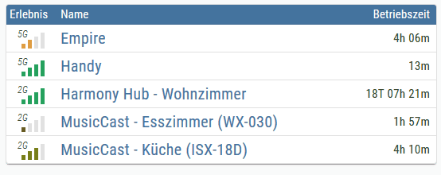

### Editor-Einstellungen
<table><thead><tr><th>Bildschirmfoto</th><th> Rahmen</th><th> Beschreibung</th></tr></thead><tbody><tr><td rowspan=2>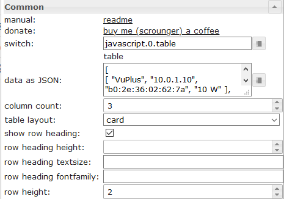</td><td> Schalter</td><td> Datenpunkt vom Typ String mit Eingabedaten wie oben gezeigt</td></tr><tr><td> Daten als JSON</td><td> Optional, Eingabe der Daten wie oben gezeigt, wenn kein oid-Datenpunkt gesetzt ist</td></tr><tr><td rowspan=4>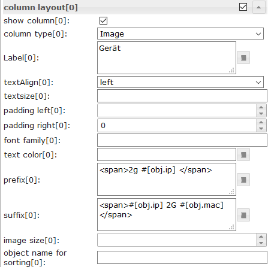</td><td> Spaltentyp[x]</td><td> Wenn Bild ausgewählt ist, muss die Objekteigenschaft den Pfad zum Bild haben ( <a href="https://github.com/Scrounger/ioBroker.vis-materialdesign#input-data">siehe oben</a> )</td></tr><tr><td> Präfix[x]</td><td> Präfix für Objekteigenschaft, interne Objektbindung ( <a href="https://github.com/Scrounger/ioBroker.vis-materialdesign#internal-object-binding">siehe unten</a> ) und HTML können verwendet werden</td></tr><tr><td> Nachsetzzeichen[x]</td><td> Suffix für Objekteigenschaft, interne Objektbindung ( <a href="https://github.com/Scrounger/ioBroker.vis-materialdesign#internal-object-binding">siehe unten</a> ) und HTML können verwendet werden</td></tr><tr><td> Objektname zum Sortieren[x]</td><td> Hier können Sie eine weitere Objekteigenschaft definieren, die zum Sortieren verwendet werden soll.</td></tr></tbody></table>

###Daten - JSON-Struktur
Eingabedaten müssen ein Json-Array von Objekten sein. Sie können jede Eigenschaft verwenden, es gibt keine feste Struktur. Spalte 0 erhält den Wert der ersten Eigenschaft, Spalte 1 den Wert der zweiten Eigenschaft und so weiter.
Wichtig ist, dass jedes Objekt die gleiche Struktur hat.

```
[
	{
		"img": "/vis.0/myImages/erlebnis_50.png",
		"name": "Empire",
		"betriebszeit": "4h 06m",
		"funk": "5G",
		"ip": "10.0.0.1"
	},
	{
		"img": "/vis.0/myImages/erlebnis_100.png",
		"name": "Handy",
		"betriebszeit": "13m",
		"funk": "5G",
		"ip": "10.0.0.2"
	},
	{
		"img": "/vis.0/myImages/erlebnis_100.png",
		"name": "Harmony Hub - Wohnzimmer",
		"betriebszeit": "18T 07h 21m",
		"funk": "2G",
		"ip": "10.0.0.3"
	}
]
```

### Interne Objektbindung
Präfix & Suffix unterstützt tabelleninterne Objektbindung -> Sie können auf andere Eigenschaften des Objekts zugreifen, indem Sie verwenden

```
#[obj.'propertyName']
```

Beispiel <a href="https://github.com/Scrounger/ioBroker.vis-materialdesign#input-data">siehe oben</a> .

Ein funktionierendes Widget-Beispiel kann gefunden werden

* [hier](https://forum.iobroker.net/topic/26199/test-adapter-material-design-widgets-v0-1-x/113)
* [ical Adapter](https://forum.iobroker.net/topic/29658/material-design-widgets-table-widget/2)

### Kontrollelemente mit HTML-Widgets


Sie können die [HTML-Widgets](#html-widgets) direkt im json-String verwenden. Wenn Sie die Zelle, die das Widget enthält, anpassen möchten, verwenden Sie den folgenden Container:

<table><thead><tr><th>Eigentum</th><th> Beschreibung</th><th> Art</th><th> Eigenschaften</th></tr></thead><tbody><tr><td> Reihenspanne</td><td> Zelle, die x Zeilen umfasst</td><td> Nummer</td><td> 1, 2, 3, ...</td></tr><tr><td> colspan</td><td> Zelle, die x Spalten umfasst</td><td> Nummer</td><td> 1, 2, 3, ...</td></tr><tr><td> cellStyleAttrs</td><td> CSS-Stilattribute für Zelle</td><td> Schnur</td><td></td></tr><tr><td> html</td><td> jedes HTML-Element, z. HTML-Widget</td><td> Schnur</td><td></td></tr></tbody></table>

<!-- im Inhaltsverzeichnis weglassen -->

#### HTML-Steuerelement-Widgets - Beispiel
<details>

```
[
	{
		"col_1": "button toggle",
		"col_2": {
			"rowspan": "2",
			"html": "<div style='display: flex; justify-content: center'><div class='vis-widget materialdesign-widget materialdesign-button materialdesign-button-html-element'
			style='width: 80px; height: 60px; position: relative; padding: 0px;'
			mdw-type='toggle_vertical'
			mdw-oid='0_userdata.0.MDW.Table.Control.bool'
			mdw-buttonStyle='raised'
			mdw-toggleType='boolean'
			mdw-stateIfNotTrueValue='on'
			mdw-vibrateOnMobilDevices='50'
			mdw-buttontext='off'
			mdw-labelTrue='on'
			mdw-labelColorTrue='#000000'
			mdw-textFontFamily='#mdwTheme:vis-materialdesign.0.fonts.button.vertical.text'
			mdw-textFontSize='#mdwTheme:vis-materialdesign.0.fontSizes.button.vertical.text'
			mdw-alignment='center'
			mdw-mdwButtonPrimaryColor='#mdwTheme:vis-materialdesign.0.colors.button.vertical.primary'
			mdw-mdwButtonSecondaryColor='#mdwTheme:vis-materialdesign.0.colors.button.vertical.secondary'
			mdw-colorBgTrue='green'
			mdw-image='checkbox-blank-outline'
			mdw-imageTrue='checkbox-marked'
			mdw-iconPosition='top'
			mdw-iconHeight='36'
			mdw-lockEnabled='true'
			mdw-autoLockAfter='10'
			mdw-lockIconTop='5'
			mdw-lockIconLeft='5'
			mdw-lockIconColor='#mdwTheme:vis-materialdesign.0.colors.button.lock_icon'
			mdw-lockFilterGrayscale='30'
			></div></div>"
		},
		"col_3": "<div class='vis-widget materialdesign-widget materialdesign-button materialdesign-button-html-element'
		style='width: 100%; height: 100%; position: relative; padding: 0px;'
		mdw-type='toggle_default'
		mdw-oid='0_userdata.0.MDW.Table.Control.bool'
		mdw-buttonStyle='raised'
		mdw-toggleType='boolean'
		mdw-stateIfNotTrueValue='on'
		mdw-vibrateOnMobilDevices='50'
		mdw-buttontext='off'
		mdw-labelTrue='on'
		mdw-textFontFamily='#mdwTheme:vis-materialdesign.0.fonts.button.default.text'
		mdw-textFontSize='#mdwTheme:vis-materialdesign.0.fontSizes.button.default.text'
		mdw-mdwButtonPrimaryColor='#mdwTheme:vis-materialdesign.0.colors.button.default.primary'
		mdw-mdwButtonSecondaryColor='#mdwTheme:vis-materialdesign.0.colors.button.default.secondary'
		mdw-colorBgTrue='#a2bc9f'
		mdw-image='access-point-network-off'
		mdw-imageColor='#c70000'
		mdw-imageTrue='access-point-network'
		mdw-imageTrueColor='#36fa29'
		mdw-iconPosition='left'
		mdw-autoLockAfter='10'
		mdw-lockIconColor='#mdwTheme:vis-materialdesign.0.colors.button.lock_icon'
		mdw-lockFilterGrayscale='30'
		></div>",
		"col_4": "<div class='vis-widget materialdesign-widget materialdesign-icon-button materialdesign-button-html-element'
		style='width: 48px; height: 48px; position: relative; padding: 0px;'
		mdw-type='toggle_icon'
		mdw-oid='0_userdata.0.MDW.Table.Control.bool'
		mdw-toggleType='boolean'
		mdw-stateIfNotTrueValue='on'
		mdw-vibrateOnMobilDevices='50'
		mdw-image='access-point-network-off'
		mdw-imageColor='#mdwTheme:vis-materialdesign.0.colors.button.icon.icon_off'
		mdw-imageTrue='access-point-network'
		mdw-imageTrueColor='orange'
		mdw-colorBgFalse='#mdwTheme:vis-materialdesign.0.colors.button.icon.background_off'
		mdw-colorBgTrue='#mdwTheme:vis-materialdesign.0.colors.button.icon.background_on'
		mdw-colorPress='#mdwTheme:vis-materialdesign.0.colors.button.icon.pressed'
		mdw-autoLockAfter='10'
		mdw-lockIconTop='45'
		mdw-lockIconLeft='55'
		mdw-lockIconSize='20'
		mdw-lockIconColor='#mdwTheme:vis-materialdesign.0.colors.button.icon.lock_icon'
		mdw-lockIconBackground='#mdwTheme:vis-materialdesign.0.colors.button.icon.lock_icon_background'
		mdw-lockBackgroundSizeFactor='1'
		mdw-lockFilterGrayscale='30'
		></div>"
	}, {
		"col_1": "Checkbox / Switch",
		"col_2": "<div style='display: flex; justify-content: center'><div class='vis-widget materialdesign-widget materialdesign-checkbox materialdesign-checkbox-html-element'
		style='width: 71px; height: 24px; position: relative; overflow: visible !important; display: flex; align-items: center;'
		mdw-oid='0_userdata.0.MDW.Table.Control.bool'
		mdw-toggleType='boolean'
		mdw-stateIfNotTrueValue='on'
		mdw-vibrateOnMobilDevices='50'
		mdw-labelFalse='on'
		mdw-labelTrue='off'
		mdw-labelPosition='left'
		mdw-labelClickActive='true'
		mdw-valueFontFamily='#mdwTheme:vis-materialdesign.0.fonts.checkbox.value'
		mdw-valueFontSize='#mdwTheme:vis-materialdesign.0.fontSizes.checkbox.value'
		mdw-colorCheckBox='#mdwTheme:vis-materialdesign.0.colors.checkbox.on'
		mdw-colorCheckBoxBorder='#mdwTheme:vis-materialdesign.0.colors.checkbox.border'
		mdw-colorCheckBoxHover='#mdwTheme:vis-materialdesign.0.colors.checkbox.hover'
		mdw-labelColorFalse='#mdwTheme:vis-materialdesign.0.colors.checkbox.text_off'
		mdw-labelColorTrue='#mdwTheme:vis-materialdesign.0.colors.checkbox.text_on'
		mdw-autoLockAfter='10'
		mdw-lockIconTop='5'
		mdw-lockIconLeft='5'
		mdw-lockIconColor='#mdwTheme:vis-materialdesign.0.colors.checkbox.lock_icon'
		mdw-lockFilterGrayscale='30'
		></div></div>",
		"col_3": {
			"cellStyleAttrs": "padding: 8px;",
			"html": "<div style='display: flex; justify-content: center'><div class='vis-widget materialdesign-widget materialdesign-switch materialdesign-switch-html-element'
			style='width: 83px; height: 44px; position: relative; overflow: visible !important; display: flex; align-items: center;'
			mdw-oid='0_userdata.0.MDW.Table.Control.bool'
			mdw-toggleType='boolean'
			mdw-stateIfNotTrueValue='on'
			mdw-vibrateOnMobilDevices='50'
			mdw-labelFalse='off'
			mdw-labelTrue='on'
			mdw-labelPosition='right'
			mdw-labelClickActive='true'
			mdw-valueFontFamily='#mdwTheme:vis-materialdesign.0.fonts.switch.value'
			mdw-valueFontSize='#mdwTheme:vis-materialdesign.0.fontSizes.switch.value'
			mdw-colorSwitchThumb='#mdwTheme:vis-materialdesign.0.colors.switch.off'
			mdw-colorSwitchTrack='#mdwTheme:vis-materialdesign.0.colors.switch.track'
			mdw-colorSwitchTrue='#mdwTheme:vis-materialdesign.0.colors.switch.on'
			mdw-colorSwitchHover='#mdwTheme:vis-materialdesign.0.colors.switch.off_hover'
			mdw-colorSwitchHoverTrue='#mdwTheme:vis-materialdesign.0.colors.switch.on_hover'
			mdw-labelColorFalse='#mdwTheme:vis-materialdesign.0.colors.switch.text_off'
			mdw-labelColorTrue='#mdwTheme:vis-materialdesign.0.colors.switch.text_on'
			mdw-lockEnabled='true'
			mdw-autoLockAfter='10'
			mdw-lockIconTop='5'
			mdw-lockIconLeft='5'
			mdw-lockIconColor='#mdwTheme:vis-materialdesign.0.colors.switch.lock_icon'
			mdw-lockFilterGrayscale='30'
			></div></div>"
		}
	}, {
		"col_1": "Button State",
		"col_2": "<div style='display: flex; justify-content: center'><div class='vis-widget materialdesign-widget materialdesign-icon-button materialdesign-button-html-element'
		style='width: 48px; height: 48px; position: relative; padding: 0px;'
		mdw-type='state_icon'
		mdw-oid='0_userdata.0.MDW.Table.Control.number'
		mdw-value='100'
		mdw-vibrateOnMobilDevices='50'
		mdw-image='battery'
		mdw-imageColor='#mdwTheme:vis-materialdesign.0.colors.button.icon.icon_off'
		mdw-iconHeight='26'
		mdw-colorBgFalse='#mdwTheme:vis-materialdesign.0.colors.button.icon.background_off'
		mdw-colorPress='#mdwTheme:vis-materialdesign.0.colors.button.icon.pressed'
		mdw-autoLockAfter='10'
		mdw-lockIconTop='45'
		mdw-lockIconLeft='55'
		mdw-lockIconSize='20'
		mdw-lockIconColor='#mdwTheme:vis-materialdesign.0.colors.button.icon.lock_icon'
		mdw-lockIconBackground='#mdwTheme:vis-materialdesign.0.colors.button.icon.lock_icon_background'
		mdw-lockBackgroundSizeFactor='1'
		mdw-lockFilterGrayscale='30'
		></div></div>",
		"col_3": "<div style='display: flex; justify-content: center'><div class='vis-widget materialdesign-widget materialdesign-button materialdesign-button-html-element'
		style='width: 100px; height: 100%; position: relative; padding: 0px;'
		mdw-type='state_default'
		mdw-oid='0_userdata.0.MDW.Table.Control.number'
		mdw-buttonStyle='raised'
		mdw-value='70'
		mdw-vibrateOnMobilDevices='50'
		mdw-buttontext='70'
		mdw-textFontFamily='#mdwTheme:vis-materialdesign.0.fonts.button.default.text'
		mdw-textFontSize='#mdwTheme:vis-materialdesign.0.fontSizes.button.default.text'
		mdw-mdwButtonPrimaryColor='#mdwTheme:vis-materialdesign.0.colors.button.default.primary'
		mdw-mdwButtonSecondaryColor='#mdwTheme:vis-materialdesign.0.colors.button.default.secondary'
		mdw-image='battery-70'
		mdw-iconPosition='left'
		mdw-iconHeight='20'
		mdw-lockEnabled='true'
		mdw-autoLockAfter='10'
		mdw-lockIconColor='#mdwTheme:vis-materialdesign.0.colors.button.lock_icon'
		mdw-lockFilterGrayscale='30'
		></div></div>",
		"col_4": "<div style='display: flex; justify-content: center'><div class='vis-widget materialdesign-widget materialdesign-button materialdesign-button-html-element'
		style='width: 102px; height: 67px; position: relative; padding: 0px;'
		mdw-type='state_vertical'
		mdw-oid='0_userdata.0.MDW.Table.Control.number'
		mdw-buttonStyle='raised'
		mdw-value='10'
		mdw-vibrateOnMobilDevices='50'
		mdw-buttontext='10'
		mdw-textFontFamily='#mdwTheme:vis-materialdesign.0.fonts.button.vertical.text'
		mdw-textFontSize='#mdwTheme:vis-materialdesign.0.fontSizes.button.vertical.text'
		mdw-alignment='center'
		mdw-mdwButtonPrimaryColor='#mdwTheme:vis-materialdesign.0.colors.button.vertical.primary'
		mdw-mdwButtonSecondaryColor='#mdwTheme:vis-materialdesign.0.colors.button.vertical.secondary'
		mdw-image='battery-10'
		mdw-iconPosition='top'
		mdw-iconHeight='38'
		mdw-autoLockAfter='10'
		mdw-lockIconTop='5'
		mdw-lockIconLeft='5'
		mdw-lockIconColor='#mdwTheme:vis-materialdesign.0.colors.button.lock_icon'
		mdw-lockFilterGrayscale='30'
		></div></div>"
	}, {
		"col_1": "Progress",
		"col_2": "<div style='display: flex; justify-content: center'><div class='vis-widget materialdesign-widget materialdesign-progress materialdesign-progress-html-element'
		style='width: 83px; height: 81px; position: relative; padding: 0px;'
		mdw-type='circular'
		mdw-oid='0_userdata.0.MDW.Table.Control.number'
		mdw-min='0'
		mdw-max='100'
		mdw-progressCircularSize='80'
		mdw-progressCircularWidth='10'
		mdw-progressCircularRotate='90'
		mdw-colorProgressBackground='#mdwTheme:vis-materialdesign.0.colors.progress.track_background'
		mdw-colorProgress='#mdwTheme:vis-materialdesign.0.colors.progress.track'
		mdw-innerColor='#mdwTheme:vis-materialdesign.0.colors.progress.circular_background'
		mdw-colorOneCondition='60'
		mdw-colorOne='#mdwTheme:vis-materialdesign.0.colors.progress.track_condition1'
		mdw-colorTwoCondition='80'
		mdw-colorTwo='#mdwTheme:vis-materialdesign.0.colors.progress.track_condition2'
		mdw-showValueLabel='true'
		mdw-valueLabelStyle='progressValue'
		mdw-valueMaxDecimals='3'
		mdw-textColor='#mdwTheme:vis-materialdesign.0.colors.progress.text'
		mdw-textFontSize='#mdwTheme:vis-materialdesign.0.fontSizes.progress.text'
		mdw-textFontFamily='#mdwTheme:vis-materialdesign.0.fonts.progress.text'
		></div></div>",
		"col_3": {
			"colspan": "2",
			"html": "<div style='display: flex; justify-content: center'><div class='vis-widget materialdesign-widget materialdesign-progress materialdesign-progress-html-element'
			style='width: 80%; height: 36px; position: relative; padding: 0px;'
			mdw-type='linear'
			mdw-oid='0_userdata.0.MDW.Table.Control.number'
			mdw-min='0'
			mdw-max='100'
			mdw-colorProgressBackground='#mdwTheme:vis-materialdesign.0.colors.progress.track_background'
			mdw-colorProgress='#mdwTheme:vis-materialdesign.0.colors.progress.track'
			mdw-colorOneCondition='50'
			mdw-colorOne='#mdwTheme:vis-materialdesign.0.colors.progress.track_condition1'
			mdw-colorTwoCondition='70'
			mdw-colorTwo='#mdwTheme:vis-materialdesign.0.colors.progress.track_condition2'
			mdw-showValueLabel='true'
			mdw-valueLabelStyle='progressPercent'
			mdw-textColor='#mdwTheme:vis-materialdesign.0.colors.progress.text'
			mdw-textFontSize='#mdwTheme:vis-materialdesign.0.fontSizes.progress.text'
			mdw-textFontFamily='#mdwTheme:vis-materialdesign.0.fonts.progress.text'
			mdw-textAlign='end'
			></div></div>"
		}
	}, {
		"col_1": "Slider",
		"col_2": {
			"colspan": "2",
			"cellStyleAttrs": "overflow: visible;",
			"html": "<div style='display: flex; justify-content: center'><div class='vis-widget materialdesign-widget materialdesign-slider-vertical materialdesign-slider-html-element'
			style='width: 90%; height: 60px; position: relative; overflow:visible !important; display: flex; align-items: center;'
			mdw-oid='0_userdata.0.MDW.Table.Control.number'
			mdw-orientation='horizontal'
			mdw-knobSize='knobSmall'
			mdw-step='1'
			mdw-vibrateOnMobilDevices='50'
			mdw-showTicks='no'
			mdw-tickTextColor='#mdwTheme:vis-materialdesign.0.colors.slider.tick'
			mdw-tickFontFamily='#mdwTheme:vis-materialdesign.0.fonts.slider.ticks'
			mdw-tickFontSize='#mdwTheme:vis-materialdesign.0.fontSizes.slider.ticks'
			mdw-tickColorBefore='#mdwTheme:vis-materialdesign.0.colors.slider.tick_before'
			mdw-tickColorAfter='#mdwTheme:vis-materialdesign.0.colors.slider.tick_after'
			mdw-colorBeforeThumb='#mdwTheme:vis-materialdesign.0.colors.slider.control_before'
			mdw-colorThumb='#mdwTheme:vis-materialdesign.0.colors.slider.control'
			mdw-colorAfterThumb='#mdwTheme:vis-materialdesign.0.colors.slider.control_behind'
			mdw-prepandTextWidth='1'
			mdw-prepandTextColor='#mdwTheme:vis-materialdesign.0.colors.slider.text_prepand'
			mdw-prepandTextFontSize='#mdwTheme:vis-materialdesign.0.fontSizes.slider.prepand'
			mdw-prepandTextFontFamily='#mdwTheme:vis-materialdesign.0.fonts.slider.prepand'
			mdw-showValueLabel='true'
			mdw-valueLabelStyle='sliderValue'
			mdw-valueLabelUnit='%'
			mdw-valueFontFamily='#mdwTheme:vis-materialdesign.0.fonts.slider.value'
			mdw-valueFontSize='#mdwTheme:vis-materialdesign.0.fontSizes.slider.value'
			mdw-valueLabelColor='#mdwTheme:vis-materialdesign.0.colors.slider.text'
			mdw-valueLabelWidth='50'
			mdw-showThumbLabel='yes'
			mdw-thumbBackgroundColor='#mdwTheme:vis-materialdesign.0.colors.slider.control_background'
			mdw-thumbFontColor='#mdwTheme:vis-materialdesign.0.colors.slider.control_text'
			mdw-thumbFontSize='#mdwTheme:vis-materialdesign.0.fontSizes.slider.control'
			mdw-thumbFontFamily='#mdwTheme:vis-materialdesign.0.fonts.slider.control'
			></div></div>"
		},
		"col_3": "<div style='display: flex; justify-content: center'><div class='vis-widget materialdesign-widget materialdesign-slider-round materialdesign-roundslider-html-element'
		style='width: 79px; height: 67px; position: relative;'
		mdw-oid='0_userdata.0.MDW.Table.Control.number'
		mdw-step='1'
		mdw-startAngle='135'
		mdw-arcLength='270'
		mdw-handleZoom='1.5'
		mdw-vibrateOnMobilDevices='50'
		mdw-colorSliderBg='#mdwTheme:vis-materialdesign.0.colors.slider.background'
		mdw-colorBeforeThumb='#mdwTheme:vis-materialdesign.0.colors.slider.control_before'
		mdw-colorThumb='#mdwTheme:vis-materialdesign.0.colors.slider.control'
		mdw-colorAfterThumb='#mdwTheme:vis-materialdesign.0.colors.slider.control_behind'
		mdw-valueLabelColor='#mdwTheme:vis-materialdesign.0.colors.slider.text'
		mdw-showValueLabel='true'
		mdw-valueLabelStyle='sliderValue'
		mdw-valueFontFamily='#mdwTheme:vis-materialdesign.0.fonts.slider.value'
		mdw-valueFontSize='#mdwTheme:vis-materialdesign.0.fontSizes.slider.value'
		></div></div>"
	}, {
		"col_1": "Select",
		"col_2": "<div style='display: flex; justify-content: center'><div class='vis-widget materialdesign-widget materialdesign-select materialdesign-select-html-element'
		style='width: 90%; height: 38px; position: relative; overflow: visible; display: flex; align-items: center;'
		mdw-oid='0_userdata.0.MDW.Table.Control.number'
		mdw-inputType='text'
		mdw-vibrateOnMobilDevices='50'
		mdw-inputLayout='regular'
		mdw-inputAlignment='left'
		mdw-inputLayoutBorderColor='#mdwTheme:vis-materialdesign.0.colors.input.border'
		mdw-inputLayoutBorderColorHover='#mdwTheme:vis-materialdesign.0.colors.input.border_hover'
		mdw-inputLayoutBorderColorSelected='#mdwTheme:vis-materialdesign.0.colors.input.border_selected'
		mdw-inputTextFontFamily='#mdwTheme:vis-materialdesign.0.fonts.input.text'
		mdw-inputTextFontSize='#mdwTheme:vis-materialdesign.0.fontSizes.input.text'
		mdw-inputTextColor='#mdwTheme:vis-materialdesign.0.colors.input.text'
		mdw-inputLabelText='by Editor'
		mdw-inputLabelColor='#mdwTheme:vis-materialdesign.0.colors.input.label'
		mdw-inputLabelColorSelected='#mdwTheme:vis-materialdesign.0.colors.input.label_selected'
		mdw-inputLabelFontFamily='#mdwTheme:vis-materialdesign.0.fonts.input.label'
		mdw-inputLabelFontSize='#mdwTheme:vis-materialdesign.0.fontSizes.input.label'
		mdw-inputTranslateX='-29'
		mdw-inputAppendixColor='#mdwTheme:vis-materialdesign.0.colors.input.appendix'
		mdw-inputAppendixFontSize='#mdwTheme:vis-materialdesign.0.fontSizes.input.appendix'
		mdw-inputAppendixFontFamily='#mdwTheme:vis-materialdesign.0.fonts.input.appendix'
		mdw-showInputMessageAlways='true'
		mdw-inputMessageFontFamily='#mdwTheme:vis-materialdesign.0.fonts.input.message'
		mdw-inputMessageFontSize='#mdwTheme:vis-materialdesign.0.fontSizes.input.message'
		mdw-inputMessageColor='#mdwTheme:vis-materialdesign.0.colors.input.message'
		mdw-inputCounterColor='#mdwTheme:vis-materialdesign.0.colors.input.counter'
		mdw-inputCounterFontSize='#mdwTheme:vis-materialdesign.0.fontSizes.input.counter'
		mdw-inputCounterFontFamily='#mdwTheme:vis-materialdesign.0.fonts.input.counter'
		mdw-clearIconShow='true'
		mdw-clearIconColor='#mdwTheme:vis-materialdesign.0.colors.input.icon_clear'
		mdw-collapseIconColor='#mdwTheme:vis-materialdesign.0.colors.input.icon_collapse'
		mdw-listDataMethod='inputPerEditor'
		mdw-countSelectItems='2'
		mdw-listPosition='auto'
		mdw-listItemBackgroundColor='#mdwTheme:vis-materialdesign.0.colors.input.menu.background'
		mdw-listItemBackgroundHoverColor='#mdwTheme:vis-materialdesign.0.colors.input.menu.hover'
		mdw-listItemBackgroundSelectedColor='#mdwTheme:vis-materialdesign.0.colors.input.menu.selected'
		mdw-listItemRippleEffectColor='#mdwTheme:vis-materialdesign.0.colors.input.menu.effect'
		mdw-showSelectedIcon='prepend-inner'
		mdw-listIconColor='#mdwTheme:vis-materialdesign.0.colors.input.menu.icon'
		mdw-listItemFontSize='#mdwTheme:vis-materialdesign.0.fontSizes.input.dropdown.text'
		mdw-listItemFont='#mdwTheme:vis-materialdesign.0.fonts.input.dropdown.text'
		mdw-listItemFontColor='#mdwTheme:vis-materialdesign.0.colors.input.menu.text'
		mdw-listItemSubFontSize='#mdwTheme:vis-materialdesign.0.fontSizes.input.dropdown.subText'
		mdw-listItemSubFont='#mdwTheme:vis-materialdesign.0.fonts.input.dropdown.subText'
		mdw-listItemSubFontColor='#mdwTheme:vis-materialdesign.0.colors.input.menu.subText'
		mdw-showValue='true'
		mdw-listItemValueFontSize='#mdwTheme:vis-materialdesign.0.fontSizes.input.dropdown.value'
		mdw-listItemValueFont='#mdwTheme:vis-materialdesign.0.fonts.input.dropdown.value'
		mdw-listItemValueFontColor='#mdwTheme:vis-materialdesign.0.colors.input.menu.value'
		mdw-value0='10'
		mdw-label0='val0'
		mdw-listIcon0='alpha-d-box'
		mdw-value1='70'
		mdw-label1='val1'
		mdw-listIcon1='account-alert'
		mdw-value2='100'
		mdw-label2='val2'
		mdw-listIcon2='karate'
		></div></div>",
		"col_3": "<div style='display: flex; justify-content: center'><div class='vis-widget materialdesign-widget materialdesign-select materialdesign-select-html-element'
		style='width: 90%; height: 38px; position: relative; overflow: visible; display: flex; align-items: center;'
		mdw-oid='0_userdata.0.MDW.Table.Control.number'
		mdw-inputType='text'
		mdw-vibrateOnMobilDevices='50'
		mdw-inputLayout='regular'
		mdw-inputAlignment='left'
		mdw-inputLayoutBorderColor='#mdwTheme:vis-materialdesign.0.colors.input.border'
		mdw-inputLayoutBorderColorHover='#mdwTheme:vis-materialdesign.0.colors.input.border_hover'
		mdw-inputLayoutBorderColorSelected='#mdwTheme:vis-materialdesign.0.colors.input.border_selected'
		mdw-inputTextFontFamily='#mdwTheme:vis-materialdesign.0.fonts.input.text'
		mdw-inputTextFontSize='#mdwTheme:vis-materialdesign.0.fontSizes.input.text'
		mdw-inputTextColor='#mdwTheme:vis-materialdesign.0.colors.input.text'
		mdw-inputLabelText='by Value List'
		mdw-inputLabelColor='#mdwTheme:vis-materialdesign.0.colors.input.label'
		mdw-inputLabelColorSelected='#mdwTheme:vis-materialdesign.0.colors.input.label_selected'
		mdw-inputLabelFontFamily='#mdwTheme:vis-materialdesign.0.fonts.input.label'
		mdw-inputLabelFontSize='#mdwTheme:vis-materialdesign.0.fontSizes.input.label'
		mdw-inputTranslateX='-29'
		mdw-inputAppendixColor='#mdwTheme:vis-materialdesign.0.colors.input.appendix'
		mdw-inputAppendixFontSize='#mdwTheme:vis-materialdesign.0.fontSizes.input.appendix'
		mdw-inputAppendixFontFamily='#mdwTheme:vis-materialdesign.0.fonts.input.appendix'
		mdw-showInputMessageAlways='true'
		mdw-inputMessageFontFamily='#mdwTheme:vis-materialdesign.0.fonts.input.message'
		mdw-inputMessageFontSize='#mdwTheme:vis-materialdesign.0.fontSizes.input.message'
		mdw-inputMessageColor='#mdwTheme:vis-materialdesign.0.colors.input.message'
		mdw-inputCounterColor='#mdwTheme:vis-materialdesign.0.colors.input.counter'
		mdw-inputCounterFontSize='#mdwTheme:vis-materialdesign.0.fontSizes.input.counter'
		mdw-inputCounterFontFamily='#mdwTheme:vis-materialdesign.0.fonts.input.counter'
		mdw-clearIconShow='true'
		mdw-clearIconColor='#mdwTheme:vis-materialdesign.0.colors.input.icon_clear'
		mdw-collapseIconColor='#mdwTheme:vis-materialdesign.0.colors.input.icon_collapse'
		mdw-listDataMethod='valueList'
		mdw-countSelectItems='0'
		mdw-valueList='10;30;90'
		mdw-valueListLabels='val1;val2;val3'
		mdw-valueListIcons='home;home;home'
		mdw-listPosition='auto'
		mdw-listItemBackgroundColor='#mdwTheme:vis-materialdesign.0.colors.input.menu.background'
		mdw-listItemBackgroundHoverColor='#mdwTheme:vis-materialdesign.0.colors.input.menu.hover'
		mdw-listItemBackgroundSelectedColor='#mdwTheme:vis-materialdesign.0.colors.input.menu.selected'
		mdw-listItemRippleEffectColor='#mdwTheme:vis-materialdesign.0.colors.input.menu.effect'
		mdw-showSelectedIcon='prepend-inner'
		mdw-listIconColor='#mdwTheme:vis-materialdesign.0.colors.input.menu.icon'
		mdw-listItemFontSize='#mdwTheme:vis-materialdesign.0.fontSizes.input.dropdown.text'
		mdw-listItemFont='#mdwTheme:vis-materialdesign.0.fonts.input.dropdown.text'
		mdw-listItemFontColor='#mdwTheme:vis-materialdesign.0.colors.input.menu.text'
		mdw-listItemSubFontSize='#mdwTheme:vis-materialdesign.0.fontSizes.input.dropdown.subText'
		mdw-listItemSubFont='#mdwTheme:vis-materialdesign.0.fonts.input.dropdown.subText'
		mdw-listItemSubFontColor='#mdwTheme:vis-materialdesign.0.colors.input.menu.subText'
		mdw-showValue='true'
		mdw-listItemValueFontSize='#mdwTheme:vis-materialdesign.0.fontSizes.input.dropdown.value'
		mdw-listItemValueFont='#mdwTheme:vis-materialdesign.0.fonts.input.dropdown.value'
		mdw-listItemValueFontColor='#mdwTheme:vis-materialdesign.0.colors.input.menu.value'
		></div></div>",
		"col_4": {
			"cellStyleAttrs": "padding: 6px;",
			"html": "<div style='display: flex; justify-content: center'><div class='vis-widget materialdesign-widget materialdesign-select materialdesign-select-html-element'
			style='width: 293px; height: 38px; position: relative; overflow: visible; display: flex; align-items: center;'
			mdw-oid='0_userdata.0.MDW.Table.Control.string'
			mdw-inputType='text'
			mdw-vibrateOnMobilDevices='50'
			mdw-inputLayout='solo-rounded'
			mdw-inputAlignment='center'
			mdw-inputLayoutBorderColor='#mdwTheme:vis-materialdesign.0.colors.input.border'
			mdw-inputLayoutBorderColorHover='#mdwTheme:vis-materialdesign.0.colors.input.border_hover'
			mdw-inputLayoutBorderColorSelected='#mdwTheme:vis-materialdesign.0.colors.input.border_selected'
			mdw-inputTextFontFamily='#mdwTheme:vis-materialdesign.0.fonts.input.text'
			mdw-inputTextFontSize='#mdwTheme:vis-materialdesign.0.fontSizes.input.text'
			mdw-inputTextColor='#mdwTheme:vis-materialdesign.0.colors.input.text'
			mdw-inputLabelText='by JSON Editor'
			mdw-inputLabelColor='#mdwTheme:vis-materialdesign.0.colors.input.label'
			mdw-inputLabelColorSelected='#mdwTheme:vis-materialdesign.0.colors.input.label_selected'
			mdw-inputLabelFontFamily='#mdwTheme:vis-materialdesign.0.fonts.input.label'
			mdw-inputLabelFontSize='#mdwTheme:vis-materialdesign.0.fontSizes.input.label'
			mdw-inputTranslateX='-29'
			mdw-inputAppendixColor='#mdwTheme:vis-materialdesign.0.colors.input.appendix'
			mdw-inputAppendixFontSize='#mdwTheme:vis-materialdesign.0.fontSizes.input.appendix'
			mdw-inputAppendixFontFamily='#mdwTheme:vis-materialdesign.0.fonts.input.appendix'
			mdw-showInputMessageAlways='true'
			mdw-inputMessageFontFamily='#mdwTheme:vis-materialdesign.0.fonts.input.message'
			mdw-inputMessageFontSize='#mdwTheme:vis-materialdesign.0.fontSizes.input.message'
			mdw-inputMessageColor='#mdwTheme:vis-materialdesign.0.colors.input.message'
			mdw-inputCounterColor='#mdwTheme:vis-materialdesign.0.colors.input.counter'
			mdw-inputCounterFontSize='#mdwTheme:vis-materialdesign.0.fontSizes.input.counter'
			mdw-inputCounterFontFamily='#mdwTheme:vis-materialdesign.0.fonts.input.counter'
			mdw-clearIconShow='true'
			mdw-clearIconColor='#mdwTheme:vis-materialdesign.0.colors.input.icon_clear'
			mdw-collapseIconColor='#mdwTheme:vis-materialdesign.0.colors.input.icon_collapse'
			mdw-listDataMethod='jsonStringObject'
			mdw-countSelectItems='0'
			mdw-jsonStringObject='[   {
			&#x9;&#x9;&#x22;text&#x22;: &#x22;1 Tag&#x22;,
			&#x9;&#x9;&#x22;value&#x22;: &#x22;1 day&#x22;
			&#x9;},
			&#x9;{
			&#x9;&#x9;&#x22;text&#x22;: &#x22;3 Tage&#x22;,
			&#x9;&#x9;&#x22;value&#x22;: &#x22;3 days&#x22;
			&#x9;},
			&#x9;{
			&#x9;&#x9;&#x22;text&#x22;: &#x22;1 Woche&#x22;,
			&#x9;&#x9;&#x22;value&#x22;: &#x22;7 days&#x22;
			&#x9;},
			&#x9;{
			&#x9;&#x9;&#x22;text&#x22;: &#x22;2 Wochen&#x22;,
			&#x9;&#x9;&#x22;value&#x22;: &#x22;14 days&#x22;
			&#x9;},
			&#x9;{
			&#x9;&#x9;&#x22;text&#x22;: &#x22;1 Monat&#x22;,
			&#x9;&#x9;&#x22;value&#x22;: &#x22;1 month&#x22;
			&#x9;},
			&#x9;{
			&#x9;&#x9;&#x22;text&#x22;: &#x22;2 Monate&#x22;,
			&#x9;&#x9;&#x22;value&#x22;: &#x22;2 months&#x22;
			&#x9;},
			&#x9;{
			&#x9;&#x9;&#x22;text&#x22;: &#x22;3 Monate&#x22;,
			&#x9;&#x9;&#x22;value&#x22;: &#x22;3 months&#x22;
			&#x9;},
			&#x9;{
			&#x9;&#x9;&#x22;text&#x22;: &#x22;6 Monate&#x22;,
			&#x9;&#x9;&#x22;value&#x22;: &#x22;6 months&#x22;
			&#x9;},
			&#x9;{
			&#x9;&#x9;&#x22;text&#x22;: &#x22;1 Jahr&#x22;,
			&#x9;&#x9;&#x22;value&#x22;: &#x22;1 year&#x22;
			&#x9;}
			]'
			mdw-listPosition='auto'
			mdw-listItemBackgroundColor='#mdwTheme:vis-materialdesign.0.colors.input.menu.background'
			mdw-listItemBackgroundHoverColor='#mdwTheme:vis-materialdesign.0.colors.input.menu.hover'
			mdw-listItemBackgroundSelectedColor='#mdwTheme:vis-materialdesign.0.colors.input.menu.selected'
			mdw-listItemRippleEffectColor='#mdwTheme:vis-materialdesign.0.colors.input.menu.effect'
			mdw-showSelectedIcon='prepend-inner'
			mdw-listIconColor='#mdwTheme:vis-materialdesign.0.colors.input.menu.icon'
			mdw-listItemFontSize='#mdwTheme:vis-materialdesign.0.fontSizes.input.dropdown.text'
			mdw-listItemFont='#mdwTheme:vis-materialdesign.0.fonts.input.dropdown.text'
			mdw-listItemFontColor='#mdwTheme:vis-materialdesign.0.colors.input.menu.text'
			mdw-listItemSubFontSize='#mdwTheme:vis-materialdesign.0.fontSizes.input.dropdown.subText'
			mdw-listItemSubFont='#mdwTheme:vis-materialdesign.0.fonts.input.dropdown.subText'
			mdw-listItemSubFontColor='#mdwTheme:vis-materialdesign.0.colors.input.menu.subText'
			mdw-showValue='true'
			mdw-listItemValueFontSize='#mdwTheme:vis-materialdesign.0.fontSizes.input.dropdown.value'
			mdw-listItemValueFont='#mdwTheme:vis-materialdesign.0.fonts.input.dropdown.value'
			mdw-listItemValueFontColor='#mdwTheme:vis-materialdesign.0.colors.input.menu.value'
			></div></div>"
		}
	}, {
		"col_1": "col_1",
		"col_2": "col_2",
		"col_3": "col_3",
		"col_4": "col_4"
	}
]

```

</details>

### Kontrollelemente - **veraltet seit v0.5.0**
> **veraltet Verwenden Sie stattdessen [HTML-Widgets](#html-widgets)!**

Um ein Steuerelement (Schaltfläche, Checkbox usw.) in einer Zelle der Tabelle zu generieren, müssen Sie statt einer Zeichenfolge ein Objekt erstellen.


## Responsive Layout
Es gibt zwei Widgets – Masonry Views und Grid Views – mit denen es möglich ist, ein responsives Layout (ein Layout für Desktop, Tablet und Handy) zu erstellen. Beide Widgets haben mehrere `view in widget` integriert.

###Mauerwerk-Ansichten
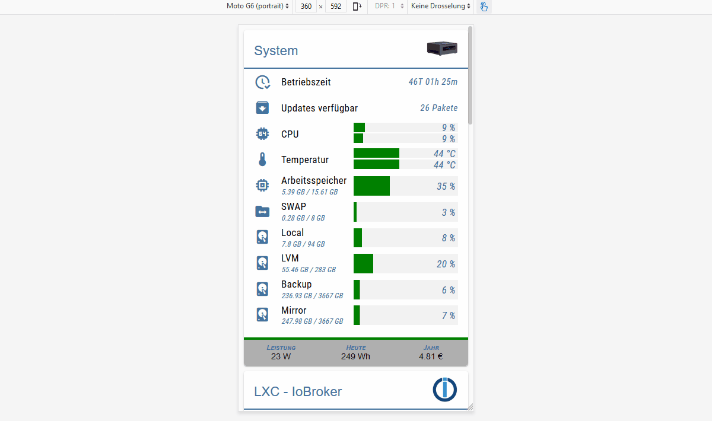

Masonry Views hat mehrere `view in widget` integriert, die je nach Breite des Widgets automatisch sortiert werden. Mit diesem Widget ist es möglich ein responsives Layout zu erstellen (ein Layout für Desktop, Tablet und Handy).
Mauerwerksansichten sind besonders nützlich, wenn die enthaltenen Ansichten unterschiedliche Höhen haben.

<b>Sehen Sie sich die [Beispielprojekt für Material Design Widgets](https://github.com/Scrounger/ioBroker.vis-materialdesign#online-example-project)</b> an, um zu verstehen, wie es funktioniert.

#### Editor-Einstellungen
<table><thead><tr><th>Bildschirmfoto</th><th> Rahmen</th><th> Beschreibung </th></tr></thead><tbody><tr><td rowspan=1>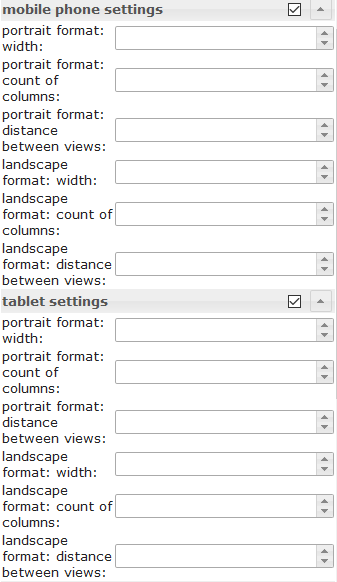</td><td colspan=2>Je nach Breite des Widgets kann die Anzahl der Spalten und der Abstand zwischen den Ansichten eingestellt werden. Die Einstellungen können für Hoch- und Querformat unabhängig voneinander vorgenommen werden. Um die Breite der Auflösung für die verschiedenen Geräte herauszufinden, aktivieren Sie den Auflösungsassistenten unter den allgemeinen Einstellungen.</td></tr><tr><td rowspan=2>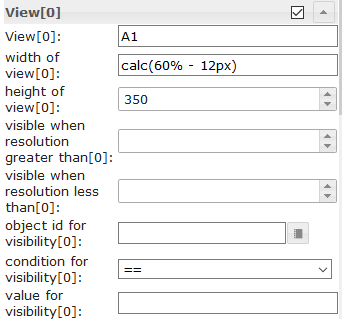</td><td> Ansichtsbreite[x]</td><td> Definieren Sie die Breite der Ansicht. Erlaubte Werte sind Zahl, px, % oder Calc. Beispiele: <code>100</code> , <code>100px</code> , <code>55%</code> , <code>calc(60% - 12px)</code></td></tr><tr><td> Sichthöhe[x]</td><td> Hier können Sie die Höhe der verwendeten Ansicht festlegen.<br><br> Soll sich die Höhe variabel an die Ansicht anpassen, dann muss diese Eingabe leer sein und für das Widget mit der höchsten Höhe in der Ansicht muss die Position auf relativ gesetzt werden, siehe Screenshot:<br><br></td></tr></tbody></table>

### Rasteransichten
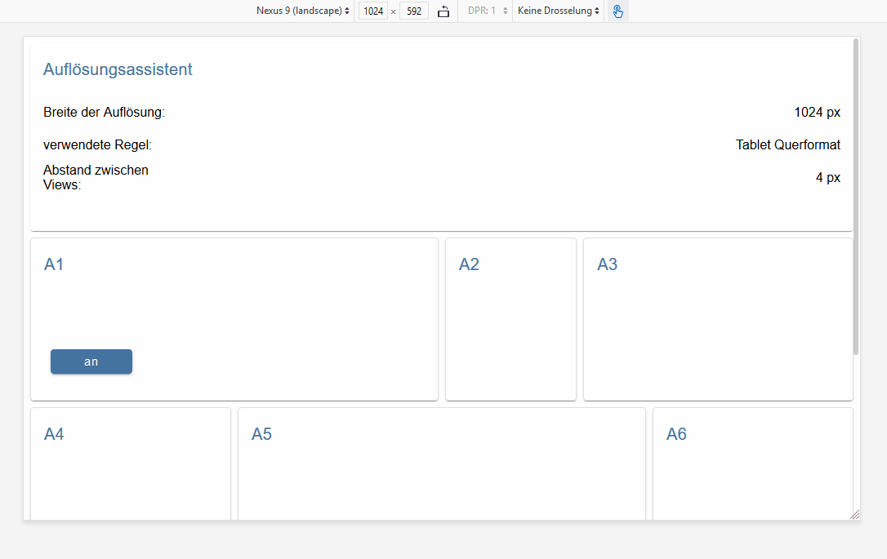

Grid Views hat mehrere `view in widget` integriert, die je nach Breite des Widgets automatisch sortiert werden. Mit diesem Widget ist es möglich ein responsives Layout zu erstellen (ein Layout für Desktop, Tablet und Handy).
Rasteransichten sind besonders nützlich, wenn die enthaltenen Ansichten die gleichen Höhen haben.

<b>Das Rasteransichts-Widget hat insgesamt 12 Spalten. Wenn eine Ansicht eine Breite von 4 Spalten haben soll, müssen Sie die Spaltenbreite in der entsprechenden Ansicht[x] auf 4 setzen.</b>

<b>Sehen Sie sich die [Beispielprojekt für Material Design Widgets](https://github.com/Scrounger/ioBroker.vis-materialdesign#online-example-project)</b> an, um zu verstehen, wie es funktioniert.

#### Editor-Einstellungen
<table><thead><tr><th>Bildschirmfoto</th><th> Rahmen</th><th> Beschreibung </th></tr></thead><tbody><tr><td rowspan=1>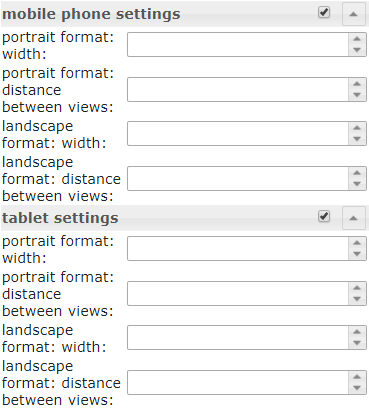</td><td colspan=2> Abhängig von der Breite des Widgets, definiert ab welcher Breite des Widgets die Regeln für die Spaltenspanne der einzelnen Ansichten[x] angewendet werden können und der Abstand zwischen den Ansichten. Die Einstellungen können für Hoch- und Querformat unabhängig voneinander vorgenommen werden. Um die Breite der Auflösung für die verschiedenen Geräte herauszufinden, aktivieren Sie den Auflösungsassistenten unter den allgemeinen Einstellungen.</td></tr><tr><td rowspan=2>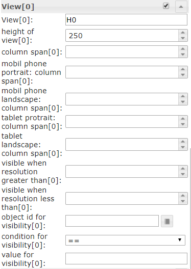</td><td colspan=2> Definieren Sie die Spaltenspanne der Ansicht abhängig von der aktuellen Breitenauflösungsregel.<br> Außerdem können Sie hier festlegen, ob eine Ansicht nur mit einer höheren oder niedrigeren Auflösung als ein definierter Wert angezeigt werden soll oder ob sie über eine Objekt-ID sichtbar sein soll.</td></tr><tr><td> Sichthöhe[x]</td><td> Hier können Sie die Höhe der verwendeten Ansicht festlegen.<br><br> Soll sich die Höhe variabel an die Ansicht anpassen, dann muss diese Eingabe leer sein und für das Widget mit der höchsten Höhe in der Ansicht muss die Position auf relativ gesetzt werden, siehe Screenshot:<br><br></td></tbody></table>

## Benachrichtigungen
Das Alerts-Widget kann z.B. Nachrichten im VIS anzuzeigen, wie es mit dem Pushover-Adapter funktioniert, aber direkt im VIS.

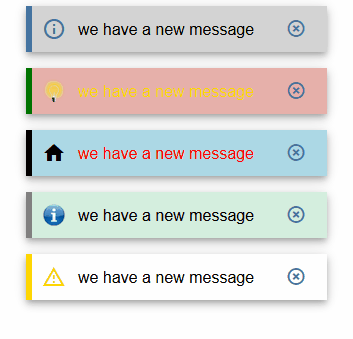

### Editor-Einstellungen
Einstellungen, die in der folgenden Tabelle nicht aufgeführt sind, sind selbsterklärend.

<table><thead><tr><th>Bildschirmfoto</th><th> Rahmen</th><th> Beschreibung</th></tr></thead><tbody><tr><td rowspan=3>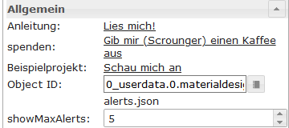</td><td> Anzahl der Spalten</td><td> Anzahl der Spalten definieren</td></tr><tr><td> Objekt Identifikation</td><td> Object muss ein Json-String sein. Zulässige Eigenschaften werden unten beschrieben</td></tr><tr><td> max. Benachrichtigungen</td><td> maximale Anzahl von Warnungen, die angezeigt werden sollen.</td></tr></tbody></table>

### Datenpunkt-JSON-Eigenschaften
<table><thead><tr><th>Eigentum</th><th> Beschreibung</th><th> Art</th><th> Werte</th></tr></thead><tbody><tr><td> Text</td><td> Text des Menüpunktes</td><td> Schnur</td><td></td></tr><tr><td> Hintergrundfarbe</td><td> Hintergrundfarbe des Warnelements</td><td> Schnur</td><td> hex(#44739e), rgb(20, 50, 200), rgba(20, 50, 200, 0,5)</td></tr><tr><td> Randfarbe</td><td> Rahmenfarbe des Warnelements</td><td> Schnur</td><td> hex(#44739e), rgb(20, 50, 200), rgba(20, 50, 200, 0,5)</td></tr><tr><td> Symbol</td><td> Materialdesign-Symbol oder Bildpfad für Menüelement</td><td> Schnur</td><td/></tr><tr><td> SymbolFarbe</td><td> Farbe des Symbols für Materialdesign</td><td> Schnur</td><td> hex(#44739e), rgb(20, 50, 200), rgba(20, 50, 200, 0,5)</td></tr><tr><td> Schriftfarbe</td><td> Schriftfarbe des Warnelements</td><td> Schnur</td><td> hex(#44739e), rgb(20, 50, 200), rgba(20, 50, 200, 0,5)</td></tr></tbody></table>

<!-- im Inhaltsverzeichnis weglassen -->

#### Datenpunkt-JSON-Eigenschaften - Beispiel
<details>

```
[
       {
		"text": "we have a new message",
		"backgroundColor": "",
		"borderColor": "darkred",
		"icon": "message-alert-outline",
		"iconColor": "darkred",
		"fontColor": "blue"
	}, {
		"text": "we have a new message",
		"backgroundColor": "#e6b0aa",
		"borderColor": "green",
		"icon": "/vis/img/bulb_on.png",
		"iconColor": "green",
		"fontColor": "gold"
	}, {
		"text": "we have a new message",
		"backgroundColor": "",
		"borderColor": "gold",
		"icon": "alert-outline",
		"iconColor": "gold",
		"fontColor": ""
	}
]
```

</details>

### Skript: Benachrichtigung an Widget senden
Mit dem folgenden Skript können Sie einfache Nachrichten an Datenpunkte senden, die vom Alerts Widget verwendet werden.
Das Skript muss in globale Skripte eingefügt werden. Dann ist es möglich, eine Nachricht mit dem folgenden Befehl zu senden

`materialDesignWidgets.sendTo('datapoint_id', 'message', 'color');`

```


var materialDesignWidgets = {};
materialDesignWidgets.sendTo = function (id, text, backgroundColor = '', borderColor = '', icon = '', iconColor = '', fontColor = '') {
    let json = getState(id).val;

    if (json) {
        try {

            json = JSON.parse(json);

        } catch (e) {
            json = [];
            console.warn('Wert ist kein JSON string! Wert wird ersetzt!');
        }
    } else {
        json = [];
    }

    json.push(
        {
            text: text,
            backgroundColor: backgroundColor,
            borderColor: borderColor,
            icon: icon,
            iconColor: iconColor,
            fontColor: fontColor
        }
    )
    setState(id, JSON.stringify(json), true);
}
```

## Kalender
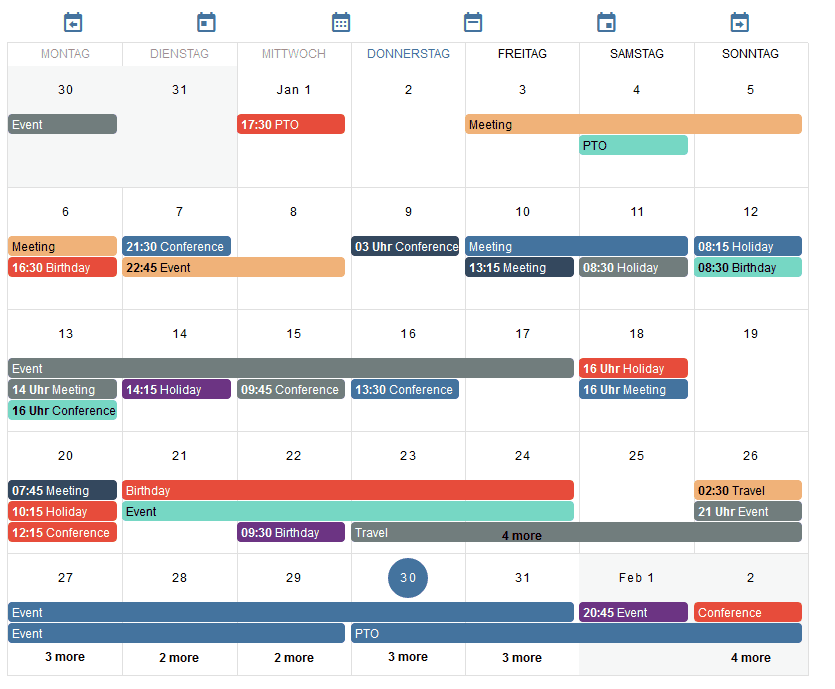

### Editor-Einstellungen
Einstellungen, die in der folgenden Tabelle nicht aufgeführt sind, sind selbsterklärend.

<table><thead><tr><th>Bildschirmfoto</th><th> Rahmen</th><th> Beschreibung</th></tr></thead><tbody><tr><td rowspan=1></td><td> Objekt Identifikation</td><td> ID des Datenpunkts. Der Datenpunkt muss einen Json-String enthalten. Zulässige json-Eigenschaften werden unten beschrieben</td></tr><tr><td rowspan=2>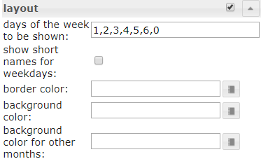</td><td> Wochentage angezeigt werden</td><td> Gibt an, welche Wochentage angezeigt werden sollen. Um nur von Montag bis Freitag anzuzeigen, kann ein Wert von <code>1, 2, 3, 4, 5</code> verwendet werden. Um eine Woche beginnend am Montag anzuzeigen, kann ein Wert von <code>1, 2, 3, 4, 5, 6, 0</code> verwendet werden.</td></tr><tr><td> Objekt Identifikation</td><td> Object muss ein Json-String sein, der wie oben beschrieben strukturiert sein muss</td></tr><tr><td rowspan=2>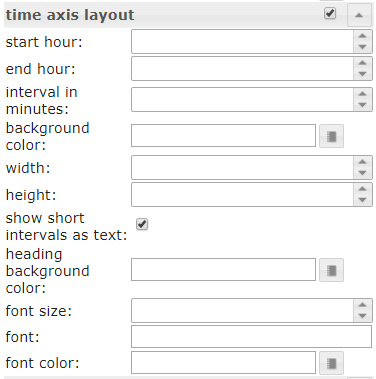</td><td> Startstunde</td><td> Die Stunde, ab der Termine in der Wochen- und Tagesansicht angezeigt werden sollen.</td></tr><tr><td> Ende Stunde</td><td> Die Stunde, bis zu der Termine in der Wochen- und Tagesansicht angezeigt werden sollen</td></tr><tr><td rowspan=2></td><td colspan=2> Überschreiben Sie die Standard-Datumsformate. Erlaubte Formate sind in der Dokumentation von <a href="https://momentjs.com/docs/#/displaying/">momentjs beschrieben</a></td></td></tr></tbody></table>

### Datenpunkt-JSON-Eigenschaften
<table><thead><tr><th>Eigentum</th><th> Beschreibung</th><th> Art</th><th> Werte</th></tr></thead><tbody><tr><td> Name</td><td> Name der Veranstaltung</td><td> Schnur</td><td></td></tr><tr><td> Farbe</td><td> Hintergrundfarbe des Ereignisses</td><td> Schnur</td><td> hex(#44739e), rgb(20, 50, 200), rgba(20, 50, 200, 0,5)</td></tr><tr><td> Farbtext</td><td> Textfarbe des Ereignisses</td><td> Schnur</td><td> hex(#44739e), rgb(20, 50, 200), rgba(20, 50, 200, 0,5)</td></tr><tr><td> Start</td><td> Startdatum und Uhrzeit der Veranstaltung. Verwenden Sie für ganztägige Ereignisse nur ein Datum ohne Uhrzeit.</td><td> Schnur</td><td> JJJJ-MM-TT | JJJJ-MM-TT HH:mm</td></tr><tr><td> Ende</td><td> Enddatum und Uhrzeit des Ereignisses. Verwenden Sie für ganztägige Ereignisse nur ein Datum ohne Zeit</td><td> Schnur</td><td> JJJJ-MM-TT | JJJJ-MM-TT HH:mm</td></tr></tbody></table>

<!-- im Inhaltsverzeichnis weglassen -->

#### Datenpunkt-JSON-Eigenschaften - Beispiel
<details>

```
[
	{
		"name": "Event",
		"color": "#e74c3c",
		"colorText": "#FFFFFF",
		"start": "2020-01-24",
		"end": "2020-01-26"
	},
	{
		"name": "Meeting",
		"color": "#717d7e",
		"colorText": "#FFFFFF",
		"start": "2020-03-23 16:00",
		"end": "2020-03-24 17:15"
	}
]
```

</details>

### Skript: ische Konvertierung
Wenn Sie das Widget mit [ischer Adapter](https://github.com/iobroker-community-adapters/ioBroker.ical) verwenden möchten, können Sie das ical-Objekt mit dem folgenden Skript so konvertieren, dass es mit dem Widget funktioniert.

<details>

```
// momentjs is required as dependecies in javascript adapter
const moment = require("moment");

var instances = $(`[id=ical.*.data.table]`);
instances.on(ical2CalendarWidget);

// remove this, if you know to use your own datapoint
let datapointId = 'materialdesignwidgets.calendar.ical2calendar'
createState(datapointId, "[]", {
  read: true,
  write: false,
  desc: "JSON String for Calendar Widget",
  type: "string",
  def: "[]"
});

function ical2CalendarWidget() {
    try {
        let calList = [];

        for (var inst = 0; inst <= instances.length - 1; inst++) {
            let icalObj = getState(instances[inst]).val;

            if (icalObj) {
                for (var i = 0; i <= icalObj.length - 1; i++) {
                    let item = icalObj[i];

                    // extract calendar color
                    let calendarName = item._class.split(' ')[0].replace('ical_', '');

                    let startTime = moment(item._date);
                    let endTime = moment(item._end);

                    let start = startTime.format("YYYY-MM-DD HH:mm");
                    let end = endTime.format("YYYY-MM-DD HH:mm");

                    if (startTime.format('HH:mm') === '00:00' && endTime.format('HH:mm') === '00:00') {
                        // is full-day event
                        if (endTime.diff(startTime, 'hours') === 24) {
                            // full-day event, one day
                            start = startTime.format("YYYY-MM-DD");
                            end = startTime.format("YYYY-MM-DD");
                        } else {
                            // full-day event, multiple days
                            start = startTime.format("YYYY-MM-DD");
                            end = endTime.format("YYYY-MM-DD");
                        }
                    }

                    // create object for calendar widget
                    calList.push({
                        name: item.event,
                        color: getMyCalendarColor(calendarName),
                        colorText: getMyCalendarTextColor(calendarName),
                        start: start,
                        end: end
                    })
                }

                function getMyCalendarColor(calendarName) {
                    // assign colors via the calendar names, use calendar name as set in ical
                    if (calendarName === 'calendar1') {
                        return '#FF0000';
                    } else if (calendarName === 'calendar2') {
                        return '#44739e'
                    } else if (calendarName === 'calendar3') {
                        return '#32a852'
                    }
                }

                function getMyCalendarTextColor(calendarName) {
                    // assign colors via the calendar names, use calendar name as set in ical
                    if (calendarName === 'calendar1') {
                        return '#FFFFFF';
                    } else if (calendarName === 'calendar2') {
                        return '#FFFFFF'
                    } else if (calendarName === 'calendar3') {
                        return '#FFFFFF'
                    }
                }
            }

            // Enter the destination data point that is to be used as object ID in the widget
            setState(datapointId, JSON.stringify(calList), true);
        }
    } catch (e) {
        console.error(`ical2MaterialDesignCalendarWidget: message: ${e.message}, stack: ${e.stack}`);
    }
}

ical2CalendarWidget();
```

</details>

## Dialog


### Editor-Einstellungen
Einstellungen, die in der folgenden Tabelle nicht aufgeführt sind, sind selbsterklärend.

<table><thead><tr><th>Bildschirmfoto</th><th> Rahmen</th><th> Beschreibung </th></tr></thead><tbody><tr><td rowspan=3></td><td> Methode zum Anzeigen von Dialogen</td><td> Dialog über eine Schaltfläche oder über einen Datenpunkt anzeigen (Typ boolean)</td></tr><tr><td> Enthält Ansicht</td><td> die Ansicht, die vom Dialog angezeigt werden soll</td></tr><tr><td> Vollbilddialog anzeigen, wenn die Auflösung niedriger ist als</td><td> Vollbilddialog anzeigen, wenn die Auflösung niedriger als der angegebene Wert ist.</td></tr></tbody></table>

## HTML-Widgets
Erstellen Sie ein HTML-Widget aus den unterstützten Material Design-Widgets, um es in jedem anderen Widget zu verwenden, das HTML unterstützt.
Stylen Sie einfach Ihr Material Design-Widget, drücken Sie die `generate Html Element`, kopieren Sie die Daten und fügen Sie sie in ein beliebiges Widget ein, das HTML-Tags unterstützt.
Oder verwenden Sie es in Skripten, um dynamisch Widgets zu generieren.

> Achtung: > *Attribute von HTML-Tags müssen in `'` (einfache Anführungszeichen) eingeschlossen werden >* doppelte Anführungszeichen `"` die in Attributen verwendet werden müssen wie `\"` maskiert werden > > vergleichen Sie dies mit den gezeigten Beispielen der verschiedenen Widgets


Weitere Informationen zu den unterstützten Eigenschaften finden Sie im Kapitel HTML-Eigenschaften der einzelnen Widgets

###Beispiele
<!-- im Inhaltsverzeichnis weglassen -->

#### Slider Round kombiniert mit Icon Button mit HTML Widget
Runder Schieberegler und Symbolschaltfläche in einem HTML-Widget zusammengefasst


Widget zum Importieren über den VIS-Editor:<details>

```
[{"tpl":"tplHtml","data":{"g_fixed":false,"g_visibility":false,"g_css_font_text":false,"g_css_background":false,"g_css_shadow_padding":false,"g_css_border":false,"g_gestures":false,"g_signals":false,"g_last_change":false,"visibility-cond":"==","visibility-val":1,"visibility-groups-action":"hide","refreshInterval":"0","signals-cond-0":"==","signals-val-0":true,"signals-icon-0":"/vis/signals/lowbattery.png","signals-icon-size-0":0,"signals-blink-0":false,"signals-horz-0":0,"signals-vert-0":0,"signals-hide-edit-0":false,"signals-cond-1":"==","signals-val-1":true,"signals-icon-1":"/vis/signals/lowbattery.png","signals-icon-size-1":0,"signals-blink-1":false,"signals-horz-1":0,"signals-vert-1":0,"signals-hide-edit-1":false,"signals-cond-2":"==","signals-val-2":true,"signals-icon-2":"/vis/signals/lowbattery.png","signals-icon-size-2":0,"signals-blink-2":false,"signals-horz-2":0,"signals-vert-2":0,"signals-hide-edit-2":false,"lc-type":"last-change","lc-is-interval":true,"lc-is-moment":false,"lc-format":"","lc-position-vert":"top","lc-position-horz":"right","lc-offset-vert":0,"lc-offset-horz":0,"lc-font-size":"12px","lc-font-family":"","lc-font-style":"","lc-bkg-color":"","lc-color":"","lc-border-width":"0","lc-border-style":"","lc-border-color":"","lc-border-radius":10,"lc-zindex":0,"html":"<div>\n    <div class='vis-widget materialdesign-widget materialdesign-slider-round materialdesign-roundslider-html-element'\n    \tstyle='width: 100px; height: 100px; position: relative;'\n    \tmdw-oid='0_userdata.0.MDW.Slider.val0'\n    \tmdw-step='1'\n    \tmdw-startAngle='135'\n    \tmdw-arcLength='270'\n    \tmdw-handleZoom='1.5'\n    \tmdw-vibrateOnMobilDevices='50'\n    \tmdw-colorSliderBg='#mdwTheme:vis-materialdesign.0.colors.slider.background'\n    \tmdw-colorBeforeThumb='#mdwTheme:vis-materialdesign.0.colors.slider.control_before'\n    \tmdw-colorThumb='#mdwTheme:vis-materialdesign.0.colors.slider.control'\n    \tmdw-colorAfterThumb='#mdwTheme:vis-materialdesign.0.colors.slider.control_behind'\n    \tmdw-valueLabelColor='#mdwTheme:vis-materialdesign.0.colors.slider.text'\n    ></div>\n    <div class='vis-widget materialdesign-widget materialdesign-icon-button materialdesign-button-html-element'\n    \tstyle='width: 60px; height: 60px; position: absolute; padding: 0px; top: calc(50% - 30px); left:calc(50% - 30px);'\n    \tmdw-type='toggle_icon'\n    \tmdw-oid='0_userdata.0.MDW.Slider.val0'\n    \tmdw-toggleType='value'\n    \tmdw-valueOff='0'\n    \tmdw-valueOn='50'\n    \tmdw-iconHeight='35'\n    \tmdw-stateIfNotTrueValue='on'\n    \tmdw-vibrateOnMobilDevices='50'\n    \tmdw-image='lightbulb-off'\n    \tmdw-imageColor='#mdwTheme:vis-materialdesign.0.colors.button.icon.icon_off'\n    \tmdw-imageTrue='lightbulb-on'\n    \tmdw-imageTrueColor='gold'\n    \tmdw-colorBgFalse='#mdwTheme:vis-materialdesign.0.colors.button.icon.background_off'\n    \tmdw-colorBgTrue='#mdwTheme:vis-materialdesign.0.colors.button.icon.background_on'\n    \tmdw-colorPress='#mdwTheme:vis-materialdesign.0.colors.button.icon.pressed'\n    \tmdw-autoLockAfter='10'\n    \tmdw-lockIconTop='45'\n    \tmdw-lockIconLeft='55'\n    \tmdw-lockIconSize='20'\n    \tmdw-lockIconColor='#mdwTheme:vis-materialdesign.0.colors.button.icon.lock_icon'\n    \tmdw-lockIconBackground='#mdwTheme:vis-materialdesign.0.colors.button.icon.lock_icon_background'\n    \tmdw-lockBackgroundSizeFactor='1'\n    \tmdw-lockFilterGrayscale='30'\n    ></div>\n</div>"},"style":{"left":"527px","top":"76px","width":"100px","height":"100px"},"widgetSet":"basic"}]
```

</details>

<!-- im Inhaltsverzeichnis weglassen -->

#### Liste mit HTML-Widgets
Eine Liste mit benutzerdefinierten Steuerelementen mithilfe von HTML-Widgets


Widget zum Importieren über den VIS-Editor:<details>

```
[{"tpl":"tplVis-materialdesign-List","data":{"g_fixed":false,"g_visibility":false,"g_css_font_text":false,"g_css_background":false,"g_css_shadow_padding":false,"g_css_border":false,"g_gestures":false,"g_signals":false,"g_last_change":false,"visibility-cond":"==","visibility-val":1,"visibility-groups-action":"hide","vibrateOnMobilDevices":"50","listType":"text","listItemDividerStyle":"padded","listLayout":"card","showScrollbar":false,"listItemDataMethod":"inputPerEditor","countListItems":"5","listItemAlignment":"left","listItemBackground":"#mdwTheme:vis-materialdesign.0.colors.list.background_off","listItemBackgroundActive":"#mdwTheme:vis-materialdesign.0.colors.list.background_on","colorSwitchThumb":"#mdwTheme:vis-materialdesign.0.colors.switch.off","colorSwitchTrack":"#mdwTheme:vis-materialdesign.0.colors.switch.track","colorSwitchTrue":"#mdwTheme:vis-materialdesign.0.colors.switch.on","colorSwitchHover":"#mdwTheme:vis-materialdesign.0.colors.switch.off_hover","colorCheckBox":"#mdwTheme:vis-materialdesign.0.colors.checkbox.on","colorListItemHover":"#mdwTheme:vis-materialdesign.0.colors.list.hover","colorListItemSelected":"#mdwTheme:vis-materialdesign.0.colors.list.selected","colorListItemText":"#mdwTheme:vis-materialdesign.0.colors.list.text","colorListItemTextSecondary":"#mdwTheme:vis-materialdesign.0.colors.list.subText","colorListItemTextRight":"#mdwTheme:vis-materialdesign.0.colors.list.text_right","colorListItemTextSecondaryRight":"{mode:vis-materialdesign.0.colors.darkTheme;light:vis-materialdesign.0.colors.light.list.subText_right;dark:vis-materialdesign.0.colors.dark.list.subText_right; mode === \"true\" ? dark : light}","colorListItemHeaders":"#mdwTheme:vis-materialdesign.0.colors.list.header","colorListItemDivider":"#mdwTheme:vis-materialdesign.0.colors.list.divider","headerFontFamily":"#mdwTheme:vis-materialdesign.0.fonts.list.header","listItemFont":"#mdwTheme:vis-materialdesign.0.fonts.list.text","listItemSubFont":"#mdwTheme:vis-materialdesign.0.fonts.list.subText","listItemRightFont":"#mdwTheme:vis-materialdesign.0.fonts.list.text_right","listItemSubRightFont":"#mdwTheme:vis-materialdesign.0.fonts.list.subText_right","listItemTextSize":"#mdwTheme:vis-materialdesign.0.fontSizes.list.text","listItemSubTextSize":"#mdwTheme:vis-materialdesign.0.fontSizes.list.subText","listItemTextRightSize":"#mdwTheme:vis-materialdesign.0.fontSizes.list.text_right","listItemSubTextRightSize":"#mdwTheme:vis-materialdesign.0.fontSizes.list.subText_right","listItemHeaderTextSize":"#mdwTheme:vis-materialdesign.0.fontSizes.list.header","listImageColor0":"#mdwTheme:vis-materialdesign.0.colors.list.icon_off","listImageActiveColor0":"#mdwTheme:vis-materialdesign.0.colors.list.icon_on","listImageColor1":"#mdwTheme:vis-materialdesign.0.colors.list.icon_off","listImageActiveColor1":"#mdwTheme:vis-materialdesign.0.colors.list.icon_on","signals-cond-0":"==","signals-val-0":true,"signals-icon-0":"/vis/signals/lowbattery.png","signals-icon-size-0":0,"signals-blink-0":false,"signals-horz-0":0,"signals-vert-0":0,"signals-hide-edit-0":false,"signals-cond-1":"==","signals-val-1":true,"signals-icon-1":"/vis/signals/lowbattery.png","signals-icon-size-1":0,"signals-blink-1":false,"signals-horz-1":0,"signals-vert-1":0,"signals-hide-edit-1":false,"signals-cond-2":"==","signals-val-2":true,"signals-icon-2":"/vis/signals/lowbattery.png","signals-icon-size-2":0,"signals-blink-2":false,"signals-horz-2":0,"signals-vert-2":0,"signals-hide-edit-2":false,"lc-type":"last-change","lc-is-interval":true,"lc-is-moment":false,"lc-format":"","lc-position-vert":"top","lc-position-horz":"right","lc-offset-vert":0,"lc-offset-horz":0,"lc-font-size":"12px","lc-font-family":"","lc-font-style":"","lc-bkg-color":"","lc-color":"","lc-border-width":"0","lc-border-style":"","lc-border-color":"","lc-border-radius":10,"lc-zindex":0,"groupHeader0":"List with HTML Widgets","label0":"Button Toggle","rightLabel0":"<div style=\"display: flex; justify-content: flex-end;\">\n    <div class='vis-widget materialdesign-widget materialdesign-button materialdesign-button-html-element'\n    \tstyle='width: 103px; height: 29px; position: relative; padding: 0px; margin-right: 10px;'\n    \tmdw-type='toggle_default'\n    \tmdw-oid='0_userdata.0.bool'\n    \tmdw-buttonStyle='raised'\n    \tmdw-toggleType='boolean'\n    \tmdw-stateIfNotTrueValue='on'\n    \tmdw-vibrateOnMobilDevices='50'\n    \tmdw-buttontext='off'\n    \tmdw-labelTrue='on'\n    \tmdw-textFontFamily='#mdwTheme:vis-materialdesign.0.fonts.button.default.text'\n    \tmdw-textFontSize='#mdwTheme:vis-materialdesign.0.fontSizes.button.default.text'\n    \tmdw-mdwButtonPrimaryColor='#mdwTheme:vis-materialdesign.0.colors.button.default.primary'\n    \tmdw-mdwButtonSecondaryColor='#mdwTheme:vis-materialdesign.0.colors.button.default.secondary'\n    \tmdw-colorBgTrue='green'\n    \tmdw-image='checkbox-blank-outline'\n    \tmdw-imageTrue='checkbox-marked'\n    \tmdw-iconPosition='left'\n    \tmdw-lockEnabled='false'\n    \tmdw-autoLockAfter='10'\n    \tmdw-lockIconColor='#mdwTheme:vis-materialdesign.0.colors.button.lock_icon'\n    \tmdw-lockFilterGrayscale='30'\n    ></div>\n</div>","rightTextWidth":"300","label1":"Switch","rightLabel1":"<div style=\"display: flex; justify-content: flex-end;\">\n    <div class='vis-widget materialdesign-widget materialdesign-switch materialdesign-switch-html-element'\n    \tstyle='height: 50px; position: relative; overflow: visible !important; display: flex; align-items: center;'\n    \tmdw-oid='0_userdata.0.bool'\n    \tmdw-toggleType='boolean'\n    \tmdw-stateIfNotTrueValue='on'\n    \tmdw-vibrateOnMobilDevices='50'\n    \tmdw-labelPosition='right'\n    \tmdw-labelClickActive='true'\n    \tmdw-valueFontFamily='#mdwTheme:vis-materialdesign.0.fonts.switch.value'\n    \tmdw-valueFontSize='#mdwTheme:vis-materialdesign.0.fontSizes.switch.value'\n    \tmdw-colorSwitchThumb='#mdwTheme:vis-materialdesign.0.colors.switch.off'\n    \tmdw-colorSwitchTrack='#mdwTheme:vis-materialdesign.0.colors.switch.track'\n    \tmdw-colorSwitchTrue='#mdwTheme:vis-materialdesign.0.colors.switch.on'\n    \tmdw-colorSwitchHover='#mdwTheme:vis-materialdesign.0.colors.switch.off_hover'\n    \tmdw-colorSwitchHoverTrue='#mdwTheme:vis-materialdesign.0.colors.switch.on_hover'\n    \tmdw-labelColorFalse='#mdwTheme:vis-materialdesign.0.colors.switch.text_off'\n    \tmdw-labelColorTrue='#mdwTheme:vis-materialdesign.0.colors.switch.text_on'\n    \tmdw-autoLockAfter='10'\n    \tmdw-lockIconTop='5'\n    \tmdw-lockIconLeft='5'\n    \tmdw-lockIconColor='#mdwTheme:vis-materialdesign.0.colors.switch.lock_icon'\n    \tmdw-lockFilterGrayscale='30'\n    ></div>\n</div>","listImageColor2":"#mdwTheme:vis-materialdesign.0.colors.list.icon_off","listImageActiveColor2":"#mdwTheme:vis-materialdesign.0.colors.list.icon_on","listImageColor3":"#mdwTheme:vis-materialdesign.0.colors.list.icon_off","listImageActiveColor3":"#mdwTheme:vis-materialdesign.0.colors.list.icon_on","listImageColor4":"#mdwTheme:vis-materialdesign.0.colors.list.icon_off","listImageActiveColor4":"#mdwTheme:vis-materialdesign.0.colors.list.icon_on","listImageColor5":"#mdwTheme:vis-materialdesign.0.colors.list.icon_off","listImageActiveColor5":"#mdwTheme:vis-materialdesign.0.colors.list.icon_on","listImageColor6":"#mdwTheme:vis-materialdesign.0.colors.list.icon_off","listImageActiveColor6":"#mdwTheme:vis-materialdesign.0.colors.list.icon_on","label2":"Slider","rightLabel2":"<div style=\"display: flex; justify-content: flex-end; overflow:visible !important;\">\n    <div class='vis-widget materialdesign-widget materialdesign-slider-vertical materialdesign-slider-html-element'\n    \tstyle='width: 100%; height: 100%; position: relative; overflow:visible !important; display: flex; align-items: center; padding: 0; margin-right: -6px;'\n    \tmdw-oid='0_userdata.0.number'\n    \tmdw-orientation='horizontal'\n    \tmdw-knobSize='knobSmall'\n    \tmdw-step='1'\n    \tmdw-vibrateOnMobilDevices='50'\n    \tmdw-showTicks='no'\n    \tmdw-tickTextColor='#mdwTheme:vis-materialdesign.0.colors.slider.tick'\n    \tmdw-tickFontFamily='#mdwTheme:vis-materialdesign.0.fonts.slider.ticks'\n    \tmdw-tickFontSize='#mdwTheme:vis-materialdesign.0.fontSizes.slider.ticks'\n    \tmdw-tickColorBefore='#mdwTheme:vis-materialdesign.0.colors.slider.tick_before'\n    \tmdw-tickColorAfter='#mdwTheme:vis-materialdesign.0.colors.slider.tick_after'\n    \tmdw-colorBeforeThumb='#mdwTheme:vis-materialdesign.0.colors.slider.control_before'\n    \tmdw-colorThumb='#mdwTheme:vis-materialdesign.0.colors.slider.control'\n    \tmdw-colorAfterThumb='#mdwTheme:vis-materialdesign.0.colors.slider.control_behind'\n    \tmdw-prepandTextColor='#mdwTheme:vis-materialdesign.0.colors.slider.text_prepand'\n    \tmdw-prepandTextFontSize='#mdwTheme:vis-materialdesign.0.fontSizes.slider.prepand'\n    \tmdw-prepandTextFontFamily='#mdwTheme:vis-materialdesign.0.fonts.slider.prepand'\n    \tmdw-valueLabelStyle='sliderValue'\n    \tmdw-valueFontFamily='#mdwTheme:vis-materialdesign.0.fonts.slider.value'\n    \tmdw-valueFontSize='#mdwTheme:vis-materialdesign.0.fontSizes.slider.value'\n    \tmdw-valueLabelColor='#mdwTheme:vis-materialdesign.0.colors.slider.text'\n    \tmdw-valueLabelWidth='50'\n    \tmdw-showThumbLabel='yes'\n    \tmdw-thumbBackgroundColor='#mdwTheme:vis-materialdesign.0.colors.slider.control_background'\n    \tmdw-thumbFontColor='#mdwTheme:vis-materialdesign.0.colors.slider.control_text'\n    \tmdw-thumbFontSize='#mdwTheme:vis-materialdesign.0.fontSizes.slider.control'\n    \tmdw-thumbFontFamily='#mdwTheme:vis-materialdesign.0.fonts.slider.control'\n    ></div>\n</div>","listOverflow2":true,"listItemRightAlignment":"left","rightLabel3":"<div style=\"display: flex; justify-content: flex-end; overflow:visible !important; margin-right: 10px;\">\n    <div class='vis-widget materialdesign-widget materialdesign-progress materialdesign-progress-html-element'\n    \tstyle='width: 100%; height: 30px; position: relative; padding: 0px;'\n    \tmdw-type='linear'\n    \tmdw-oid='0_userdata.0.number'\n    \tmdw-progressRounded='true'\n    \tmdw-colorProgressBackground='#mdwTheme:vis-materialdesign.0.colors.progress.track_background'\n    \tmdw-colorProgress='#mdwTheme:vis-materialdesign.0.colors.progress.track'\n    \tmdw-colorOneCondition='50'\n    \tmdw-colorOne='#mdwTheme:vis-materialdesign.0.colors.progress.track_condition1'\n    \tmdw-colorTwoCondition='70'\n    \tmdw-colorTwo='#mdwTheme:vis-materialdesign.0.colors.progress.track_condition2'\n    \tmdw-showValueLabel='true'\n    \tmdw-valueLabelStyle='progressPercent'\n    \tmdw-textColor='#000'\n    \tmdw-textFontSize='#mdwTheme:vis-materialdesign.0.fontSizes.progress.text'\n    \tmdw-textFontFamily='#mdwTheme:vis-materialdesign.0.fonts.progress.text'\n    \tmdw-textAlign='end'\n    ></div>\n</div>\n\n\n\n","rightSubLabel3":"","listOverflow1":true,"label3":"Progress","dividers0":true,"dividers1":true,"dividers2":true,"dividers3":true,"listImageHeight":"","listItemHeight":"40","listImage0":"gesture-tap-button","oid1":"","listImage1":"application-export","listImage2":"view-day","listImage3":"progress-download","label4":"Select","rightLabel4":"<div style=\"display: flex; justify-content: flex-end; margin-right: 10px;\">\n    <div class='vis-widget materialdesign-widget materialdesign-select materialdesign-select-html-element'\n    \tstyle='width: 183px; height: 28px; position: relative; overflow: visible; display: flex; align-items: center;'\n    \tmdw-oid='0_userdata.0.number'\n    \tmdw-inputType='text'\n    \tmdw-vibrateOnMobilDevices='50'\n    \tmdw-inputLayout='regular'\n    \tmdw-inputAlignment='left'\n    \tmdw-inputLayoutBorderColor='#mdwTheme:vis-materialdesign.0.colors.input.border'\n    \tmdw-inputLayoutBorderColorHover='#mdwTheme:vis-materialdesign.0.colors.input.border_hover'\n    \tmdw-inputLayoutBorderColorSelected='#mdwTheme:vis-materialdesign.0.colors.input.border_selected'\n    \tmdw-inputTextFontFamily='#mdwTheme:vis-materialdesign.0.fonts.input.text'\n    \tmdw-inputTextFontSize='#mdwTheme:vis-materialdesign.0.fontSizes.input.text'\n    \tmdw-inputTextColor='#mdwTheme:vis-materialdesign.0.colors.input.text'\n    \tmdw-inputLabelText='by Value List'\n    \tmdw-inputLabelColor='#mdwTheme:vis-materialdesign.0.colors.input.label'\n    \tmdw-inputLabelColorSelected='#mdwTheme:vis-materialdesign.0.colors.input.label_selected'\n    \tmdw-inputLabelFontFamily='#mdwTheme:vis-materialdesign.0.fonts.input.label'\n    \tmdw-inputLabelFontSize='#mdwTheme:vis-materialdesign.0.fontSizes.input.label'\n    \tmdw-inputTranslateX='-29'\n    \tmdw-inputAppendixColor='#mdwTheme:vis-materialdesign.0.colors.input.appendix'\n    \tmdw-inputAppendixFontSize='#mdwTheme:vis-materialdesign.0.fontSizes.input.appendix'\n    \tmdw-inputAppendixFontFamily='#mdwTheme:vis-materialdesign.0.fonts.input.appendix'\n    \tmdw-showInputMessageAlways='true'\n    \tmdw-inputMessageFontFamily='#mdwTheme:vis-materialdesign.0.fonts.input.message'\n    \tmdw-inputMessageFontSize='#mdwTheme:vis-materialdesign.0.fontSizes.input.message'\n    \tmdw-inputMessageColor='#mdwTheme:vis-materialdesign.0.colors.input.message'\n    \tmdw-inputCounterColor='#mdwTheme:vis-materialdesign.0.colors.input.counter'\n    \tmdw-inputCounterFontSize='#mdwTheme:vis-materialdesign.0.fontSizes.input.counter'\n    \tmdw-inputCounterFontFamily='#mdwTheme:vis-materialdesign.0.fonts.input.counter'\n    \tmdw-clearIconShow='true'\n    \tmdw-clearIconColor='#mdwTheme:vis-materialdesign.0.colors.input.icon_clear'\n    \tmdw-collapseIconColor='#mdwTheme:vis-materialdesign.0.colors.input.icon_collapse'\n    \tmdw-listDataMethod='valueList'\n    \tmdw-countSelectItems='0'\n    \tmdw-valueList='10;30;90'\n    \tmdw-valueListLabels='val1;val2;val3'\n    \tmdw-valueListIcons='home;home;home'\n    \tmdw-listPosition='auto'\n    \tmdw-listItemBackgroundColor='#mdwTheme:vis-materialdesign.0.colors.input.menu.background'\n    \tmdw-listItemBackgroundHoverColor='#mdwTheme:vis-materialdesign.0.colors.input.menu.hover'\n    \tmdw-listItemBackgroundSelectedColor='#mdwTheme:vis-materialdesign.0.colors.input.menu.selected'\n    \tmdw-listItemRippleEffectColor='#mdwTheme:vis-materialdesign.0.colors.input.menu.effect'\n    \tmdw-showSelectedIcon='prepend-inner'\n    \tmdw-listIconColor='#mdwTheme:vis-materialdesign.0.colors.input.menu.icon'\n    \tmdw-listItemFontSize='#mdwTheme:vis-materialdesign.0.fontSizes.input.dropdown.text'\n    \tmdw-listItemFont='#mdwTheme:vis-materialdesign.0.fonts.input.dropdown.text'\n    \tmdw-listItemFontColor='#mdwTheme:vis-materialdesign.0.colors.input.menu.text'\n    \tmdw-listItemSubFontSize='#mdwTheme:vis-materialdesign.0.fontSizes.input.dropdown.subText'\n    \tmdw-listItemSubFont='#mdwTheme:vis-materialdesign.0.fonts.input.dropdown.subText'\n    \tmdw-listItemSubFontColor='#mdwTheme:vis-materialdesign.0.colors.input.menu.subText'\n    \tmdw-showValue='true'\n    \tmdw-listItemValueFontSize='#mdwTheme:vis-materialdesign.0.fontSizes.input.dropdown.value'\n    \tmdw-listItemValueFont='#mdwTheme:vis-materialdesign.0.fonts.input.dropdown.value'\n    \tmdw-listItemValueFontColor='#mdwTheme:vis-materialdesign.0.colors.input.menu.value'\n    ></div>\n</div>\n\n\n\n","listImage4":"airplane-takeoff","dividers4":true,"label5":"Value","subLabel5":"","rightLabel5":"<div style=\"display: flex; justify-content: flex-end; overflow:visible !important; margin-right: 10px;\">\n    <div class='vis-widget materialdesign-widget materialdesign-value materialdesign-value-html-element'\n    \tstyle='width: 80px; height: 100%; position: relative; display: flex; align-items: center;'\n    \tmdw-debug='false'\n    \tmdw-oid='0_userdata.0.number'\n    \tmdw-targetType='auto'\n    \tmdw-textAlign='end'\n    \tmdw-valuesFontColor='#mdwTheme:vis-materialdesign.0.colors.value.text'\n    \tmdw-valuesFontFamily='#mdwTheme:vis-materialdesign.0.fonts.value.text'\n    \tmdw-valuesFontSize='#mdwTheme:vis-materialdesign.0.fontSizes.value.text'\n    \tmdw-prepandTextColor='#mdwTheme:vis-materialdesign.0.colors.value.prepand'\n    \tmdw-prepandTextFontFamily='#mdwTheme:vis-materialdesign.0.fonts.value.prepand'\n    \tmdw-prepandTextFontSize='#mdwTheme:vis-materialdesign.0.fontSizes.value.prepand'\n    \tmdw-appendTextColor='#mdwTheme:vis-materialdesign.0.colors.value.append'\n    \tmdw-appendTextFontFamily='#mdwTheme:vis-materialdesign.0.fonts.value.append'\n    \tmdw-appendTextFontSize='#mdwTheme:vis-materialdesign.0.fontSizes.value.append'\n    \tmdw-valueLabelUnit='%'\n    \tmdw-calculate='#value * 10'\n    \tmdw-image='information'\n    \tmdw-imageColor='#mdwTheme:vis-materialdesign.0.colors.value.icon'\n    \tmdw-iconPosition='left'\n    \tmdw-changeEffectEnabled='true'\n    \tmdw-effectFontColor='#00e640'\n    \tmdw-effectFontSize='16'\n    \tmdw-effectDuration='750'\n    ></div>\n    </div>","listOverflow5":false,"dividers5":true,"listImage5":"parachute","rightLabel6":"","subLabel4":"","listOverflow4":true,"listBackground":"#mdwTheme:vis-materialdesign.0.colors.list.background"},"style":{"left":"12px","top":"12px","width":"433px","height":"315px","overflow-x":""},"widgetSet":"materialdesign"}]
```

</details>

<!-- im Inhaltsverzeichnis weglassen -->

#### HTML-Widgets, die in Nicht-Material-Design-Widgets verwendet werden
Button Toggle in einem Nicht Material Design Widget verwendet, hier mit [vis-material-advanced](https://github.com/iobroker-community-adapters/ioBroker.vis-material-advanced) ListThermostat Widget


Widget zum Importieren über den VIS-Editor:<details>

```
[{"tpl":"tplMaListThermostat","data":{"g_fixed":false,"g_visibility":false,"g_css_font_text":false,"g_css_background":false,"g_css_shadow_padding":false,"g_css_border":false,"g_gestures":false,"g_signals":false,"g_last_change":false,"visibility-cond":"==","visibility-val":1,"visibility-groups-action":"hide","showTitle":"checked","onlyTitle":"","titleSize":"medium","widgetBackground":"#121212","TextColor":"white","subtitleSize":"x-small","valueAlign":"right","valueVertical":"center","valueSize":"medium","opacityColor":"white","min":"14","max":"30","cardIcon":"/icons-mfd-svg/sani_heating_temp.svg","showIcon":"checked","centerIcon":true,"borderRadius":"10","borderColor":"white","useOverallRoundedValues":"checked","roundLeftUp":"10","roundLeftBottom":"0","roundRightUp":"0","roundRightBottom":"10","boxShadow":"unchecked","shadowWidth":"2","signals-cond-0":"==","signals-val-0":true,"signals-icon-0":"/vis/signals/lowbattery.png","signals-icon-size-0":0,"signals-blink-0":false,"signals-horz-0":0,"signals-vert-0":0,"signals-hide-edit-0":false,"signals-cond-1":"==","signals-val-1":true,"signals-icon-1":"/vis/signals/lowbattery.png","signals-icon-size-1":0,"signals-blink-1":false,"signals-horz-1":0,"signals-vert-1":0,"signals-hide-edit-1":false,"signals-cond-2":"==","signals-val-2":true,"signals-icon-2":"/vis/signals/lowbattery.png","signals-icon-size-2":0,"signals-blink-2":false,"signals-horz-2":0,"signals-vert-2":0,"signals-hide-edit-2":false,"lc-type":"last-change","lc-is-interval":true,"lc-is-moment":false,"lc-format":"","lc-position-vert":"top","lc-position-horz":"right","lc-offset-vert":0,"lc-offset-horz":0,"lc-font-size":"12px","lc-font-family":"","lc-font-style":"","lc-bkg-color":"","lc-color":"","lc-border-width":"0","lc-border-style":"","lc-border-color":"","lc-border-radius":10,"lc-zindex":0,"subtitle":"<br>\n<div class='vis-widget materialdesign-widget materialdesign-button materialdesign-button-html-element'\n\tstyle='width: 100%; height: 50px; position: relative; padding: 0px; z-index: 1'\n\tmdw-type='toggle_default'\n\tmdw-oid='0_userdata.0.string'\n\tmdw-buttonStyle='raised'\n\tmdw-toggleType='value'\n\tmdw-valueOff='bla'\n\tmdw-valueOn='on'\n\tmdw-stateIfNotTrueValue='on'\n\tmdw-vibrateOnMobilDevices='50'\n\tmdw-buttontext=' Toggle'\n\tmdw-textFontFamily='#mdwTheme:vis-materialdesign.0.fonts.button.default.text'\n\tmdw-textFontSize='#mdwTheme:vis-materialdesign.0.fontSizes.button.default.text'\n\tmdw-mdwButtonPrimaryColor='#mdwTheme:vis-materialdesign.0.colors.button.default.primary'\n\tmdw-mdwButtonSecondaryColor='#mdwTheme:vis-materialdesign.0.colors.button.default.secondary'\n\tmdw-colorBgTrue='green'\n\tmdw-image='checkbox-marked'\n\tmdw-iconPosition='left'\n\tmdw-autoLockAfter='10'\n\tmdw-lockIconColor='#mdwTheme:vis-materialdesign.0.colors.button.lock_icon'\n\tmdw-lockFilterGrayscale='30'\n></div>","title":"Material Design Button in Material Advanced Widget"},"style":{"left":"75px","top":"559px","width":"847px","height":"107px"},"widgetSet":"vis-material-advanced"}]
```

</details>

<!-- im Inhaltsverzeichnis weglassen -->

#### Wert-HTML-Widgets in einer komplexen Ansicht verwenden
Wert-Widget in einer komplexeren Ansicht mit Konvertierungen, die zeigt, wie das Wert-Widget anstelle von Bindungen verwendet wird.


Ansicht zum Importieren über den VIS-Editor:<details>

```
{
  "settings": {
    "style": {
      "background_class": ""
    },
    "theme": "redmond",
    "sizex": "",
    "sizey": "",
    "gridSize": "",
    "snapType": null
  },
  "widgets": {
    "e00001": {
      "tpl": "tplVis-materialdesign-Card",
      "data": {
        "g_fixed": true,
        "g_visibility": false,
        "g_css_font_text": false,
        "g_css_background": false,
        "g_css_shadow_padding": false,
        "g_css_border": false,
        "g_gestures": false,
        "g_signals": false,
        "g_last_change": false,
        "visibility-cond": "==",
        "visibility-val": 1,
        "visibility-groups-action": "hide",
        "cardLayout": "Basic",
        "cardStyle": "default",
        "showTitle": false,
        "titleLayout": "20",
        "titleFontFamily": "",
        "showSubTitle": false,
        "subtitleLayout": "",
        "subTitleFontFamily": "",
        "showText": "true",
        "textFontSize": "",
        "textFontFamily": "",
        "refresh_oid_delay": "100",
        "refresh_animation_duration": "150",
        "colorBackground": "#mdwTheme:vis-materialdesign.0.colors.card.background",
        "colorTitleSectionBackground": "#mdwTheme:vis-materialdesign.0.colors.card.background_title",
        "colorTextSectionBackground": "#mdwTheme:vis-materialdesign.0.colors.card.background_body",
        "colorTitle": "#mdwTheme:vis-materialdesign.0.colors.card.title",
        "colorSubtitle": "#mdwTheme:vis-materialdesign.0.colors.card.subTitle",
        "colorBody": "#mdwTheme:vis-materialdesign.0.colors.card.text",
        "clickType": "none",
        "controlType": "link",
        "signals-cond-0": "==",
        "signals-val-0": true,
        "signals-icon-0": "/vis/signals/lowbattery.png",
        "signals-icon-size-0": 0,
        "signals-blink-0": false,
        "signals-horz-0": 0,
        "signals-vert-0": 0,
        "signals-hide-edit-0": false,
        "signals-cond-1": "==",
        "signals-val-1": true,
        "signals-icon-1": "/vis/signals/lowbattery.png",
        "signals-icon-size-1": 0,
        "signals-blink-1": false,
        "signals-horz-1": 0,
        "signals-vert-1": 0,
        "signals-hide-edit-1": false,
        "signals-cond-2": "==",
        "signals-val-2": true,
        "signals-icon-2": "/vis/signals/lowbattery.png",
        "signals-icon-size-2": 0,
        "signals-blink-2": false,
        "signals-horz-2": 0,
        "signals-vert-2": 0,
        "signals-hide-edit-2": false,
        "lc-type": "last-change",
        "lc-is-interval": true,
        "lc-is-moment": false,
        "lc-format": "",
        "lc-position-vert": "top",
        "lc-position-horz": "right",
        "lc-offset-vert": 0,
        "lc-offset-horz": 0,
        "lc-font-size": "12px",
        "lc-font-family": "",
        "lc-font-style": "",
        "lc-bkg-color": "",
        "lc-color": "",
        "lc-border-width": "0",
        "lc-border-style": "",
        "lc-border-color": "",
        "lc-border-radius": 10,
        "lc-zindex": 0,
        "title": "",
        "html": "<div style=\"width: 100%; display: flex; align-items: center; justify-content: center; flex-direction: column; margin-top: -10px\">\n    \n    <!-- Header Text -->\n    <div style=\"text-align:center; font-size: 20px; font-family: RobotoCondensed-Regular\">Photovoltaik</div>\n    \n    <!-- Icon -->\n    <div class='vis-widget materialdesign-widget materialdesign-icon materialdesign-materialdesignicons-html-element'\n    \tstyle='width: 100%; height: 55px; position: relative; display: flex; align-items: center; justify-content: center; margin-top: 4px;'\n    \tmdw-mdwIcon='solar-panel-large'\n    \tmdw-mdwIconSize='50'\n    \tmdw-mdwIconColor='gold'\n    ></div>\n        \n    <!-- Value -> Energie today -->\n    <div class='vis-widget materialdesign-widget materialdesign-value materialdesign-value-html-element'\n        style='width: auto; height: 20px; position: relative; display: flex; align-items: center;'\n        mdw-oid='0_userdata.0.Verbrauchszaehler.Photovoltaik.Verbrauch.Tag'\n        mdw-valueLabelUnit='kWh'\n        mdw-maxDecimals='1'        \n        mdw-textAlign='left'\n        mdw-valuesFontColor='#44739e'\n        mdw-valuesFontFamily='RobotoCondensed-Regular'\n        mdw-valuesFontSize='13'\n\t    mdw-image='arrow-down-bold'\n\t    mdw-imageColor='#44739e'\n\t    mdw-iconPosition='left'\n\t    mdw-iconHeight='16'\n    ></div>\n</div>",
        "showScrollbar": false,
        "name": "Photovoltaik - Card "
      },
      "style": {
        "left": "10px",
        "top": "10px",
        "z-index": "1",
        "width": "calc(50% - 15px)",
        "height": "120px"
      },
      "widgetSet": "materialdesign"
    },
    "e00002": {
      "tpl": "tplVis-materialdesign-Progress",
      "data": {
        "oid": "",
        "g_fixed": true,
        "g_visibility": true,
        "g_css_font_text": false,
        "g_css_background": false,
        "g_css_shadow_padding": false,
        "g_css_border": false,
        "g_gestures": false,
        "g_signals": false,
        "g_last_change": false,
        "visibility-cond": "!=",
        "visibility-val": "0",
        "visibility-groups-action": "hide",
        "progressRounded": false,
        "colorProgressBackground": "#mdwTheme:vis-materialdesign.0.colors.progress.track_background",
        "colorProgress": "#mdwTheme:vis-materialdesign.0.colors.progress.track",
        "colorOne": "#mdwTheme:vis-materialdesign.0.colors.progress.track_condition1",
        "colorTwo": "#mdwTheme:vis-materialdesign.0.colors.progress.track_condition2",
        "showValueLabel": false,
        "valueLabelStyle": "progressValue",
        "textColor": "#mdwTheme:vis-materialdesign.0.colors.progress.text",
        "textFontSize": "#mdwTheme:vis-materialdesign.0.fontSizes.progress.text",
        "textFontFamily": "#mdwTheme:vis-materialdesign.0.fonts.progress.text",
        "textAlign": "center",
        "signals-cond-0": "==",
        "signals-val-0": true,
        "signals-icon-0": "/vis/signals/lowbattery.png",
        "signals-icon-size-0": 0,
        "signals-blink-0": false,
        "signals-horz-0": 0,
        "signals-vert-0": 0,
        "signals-hide-edit-0": false,
        "signals-cond-1": "==",
        "signals-val-1": true,
        "signals-icon-1": "/vis/signals/lowbattery.png",
        "signals-icon-size-1": 0,
        "signals-blink-1": false,
        "signals-horz-1": 0,
        "signals-vert-1": 0,
        "signals-hide-edit-1": false,
        "signals-cond-2": "==",
        "signals-val-2": true,
        "signals-icon-2": "/vis/signals/lowbattery.png",
        "signals-icon-size-2": 0,
        "signals-blink-2": false,
        "signals-horz-2": 0,
        "signals-vert-2": 0,
        "signals-hide-edit-2": false,
        "lc-type": "last-change",
        "lc-is-interval": true,
        "lc-is-moment": false,
        "lc-format": "",
        "lc-position-vert": "top",
        "lc-position-horz": "right",
        "lc-offset-vert": 0,
        "lc-offset-horz": 0,
        "lc-font-size": "12px",
        "lc-font-family": "",
        "lc-font-style": "",
        "lc-bkg-color": "",
        "lc-color": "",
        "lc-border-width": "0",
        "lc-border-style": "",
        "lc-border-color": "",
        "lc-border-radius": 10,
        "lc-zindex": 0,
        "progressIndeterminate": true,
        "visibility-oid": "linkeddevices.0.Energiespeicher.Photovoltaik.Leistung",
        "reverse": false,
        "progressRotate": "yes",
        "name": "Photovoltaik - Progress OUT "
      },
      "style": {
        "left": "calc(25% - 2px)",
        "top": "130px",
        "width": "4px",
        "height": "50px",
        "z-index": "1"
      },
      "widgetSet": "materialdesign"
    },
    "e00003": {
      "tpl": "tplVis-materialdesign-value",
      "data": {
        "oid": "linkeddevices.0.Energiespeicher.Photovoltaik.Leistung",
        "g_fixed": true,
        "g_visibility": true,
        "g_css_font_text": false,
        "g_css_background": false,
        "g_css_shadow_padding": false,
        "g_css_border": false,
        "g_gestures": false,
        "g_signals": false,
        "g_last_change": false,
        "visibility-cond": "!=",
        "visibility-val": "0",
        "visibility-groups-action": "hide",
        "targetType": "auto",
        "textAlign": "start",
        "valuesFontColor": "#mdwTheme:vis-materialdesign.0.colors.value.text",
        "valuesFontFamily": "#mdwTheme:vis-materialdesign.0.fonts.value.text",
        "valuesFontSize": "#mdwTheme:vis-materialdesign.0.fontSizes.value.text",
        "prepandTextColor": "#mdwTheme:vis-materialdesign.0.colors.value.prepand",
        "prepandTextFontFamily": "#mdwTheme:vis-materialdesign.0.fonts.value.prepand",
        "prepandTextFontSize": "#mdwTheme:vis-materialdesign.0.fontSizes.value.prepand",
        "appendTextColor": "#mdwTheme:vis-materialdesign.0.colors.value.append",
        "appendTextFontFamily": "#mdwTheme:vis-materialdesign.0.fonts.value.append",
        "appendTextFontSize": "#mdwTheme:vis-materialdesign.0.fontSizes.value.append",
        "image": "",
        "imageColor": "#mdwTheme:vis-materialdesign.0.colors.value.icon",
        "iconPosition": "left",
        "effectFontColor": "#00e640",
        "effectFontSize": "",
        "effectDuration": "500",
        "signals-cond-0": "==",
        "signals-val-0": true,
        "signals-icon-0": "/vis/signals/lowbattery.png",
        "signals-icon-size-0": 0,
        "signals-blink-0": false,
        "signals-horz-0": 0,
        "signals-vert-0": 0,
        "signals-hide-edit-0": false,
        "signals-cond-1": "==",
        "signals-val-1": true,
        "signals-icon-1": "/vis/signals/lowbattery.png",
        "signals-icon-size-1": 0,
        "signals-blink-1": false,
        "signals-horz-1": 0,
        "signals-vert-1": 0,
        "signals-hide-edit-1": false,
        "signals-cond-2": "==",
        "signals-val-2": true,
        "signals-icon-2": "/vis/signals/lowbattery.png",
        "signals-icon-size-2": 0,
        "signals-blink-2": false,
        "signals-horz-2": 0,
        "signals-vert-2": 0,
        "signals-hide-edit-2": false,
        "lc-type": "last-change",
        "lc-is-interval": true,
        "lc-is-moment": false,
        "lc-format": "",
        "lc-position-vert": "top",
        "lc-position-horz": "right",
        "lc-offset-vert": 0,
        "lc-offset-horz": 0,
        "lc-font-size": "12px",
        "lc-font-family": "",
        "lc-font-style": "",
        "lc-bkg-color": "",
        "lc-color": "",
        "lc-border-width": "0",
        "lc-border-style": "",
        "lc-border-color": "",
        "lc-border-radius": 10,
        "lc-zindex": 0,
        "valueLabelUnit": "W",
        "changeEffectEnabled": false,
        "generateHtmlControl": "true",
        "visibility-oid": "linkeddevices.0.Energiespeicher.Photovoltaik.Leistung",
        "name": "Photovoltaik - Leistung"
      },
      "style": {
        "left": "calc(25% + 10px)",
        "top": "140px",
        "z-index": "2",
        "width": "100px",
        "height": "29px"
      },
      "widgetSet": "materialdesign"
    },
    "e00004": {
      "tpl": "tplVis-materialdesign-Chart-Bar",
      "data": {
        "oid": "nothing_selected",
        "g_fixed": true,
        "g_visibility": false,
        "g_css_font_text": false,
        "g_css_background": false,
        "g_css_shadow_padding": false,
        "g_css_border": false,
        "g_gestures": false,
        "g_signals": false,
        "g_last_change": false,
        "visibility-cond": "==",
        "visibility-val": 1,
        "visibility-groups-action": "hide",
        "chartDataMethod": "inputPerEditor",
        "dataCount": "1",
        "chartType": "vertical",
        "backgroundColor": "#mdwTheme:vis-materialdesign.0.colors.charts.background",
        "chartAreaBackgroundColor": "#mdwTheme:vis-materialdesign.0.colors.charts.background_chart",
        "titleLayout": "#mdwTheme:vis-materialdesign.0.fontSizes.card.title",
        "titleFontFamily": "#mdwTheme:vis-materialdesign.0.fonts.card.title",
        "colorBackground": "#mdwTheme:vis-materialdesign.0.colors.card.background",
        "colorTitleSectionBackground": "#mdwTheme:vis-materialdesign.0.colors.card.background_title",
        "colorTextSectionBackground": "#mdwTheme:vis-materialdesign.0.colors.card.background_body",
        "colorTitle": "#mdwTheme:vis-materialdesign.0.colors.card.title",
        "globalColor": "#mdwTheme:vis-materialdesign.0.colors.charts.global",
        "hoverColor": "#mdwTheme:vis-materialdesign.0.colors.charts.bar.hover",
        "hoverBorderColor": "#mdwTheme:vis-materialdesign.0.colors.charts.bar.hover_border",
        "showValues": "showValuesOn",
        "valuesFontColor": "#mdwTheme:vis-materialdesign.0.colors.charts.value",
        "valuesFontFamily": "#mdwTheme:vis-materialdesign.0.fonts.charts.value",
        "valuesFontSize": "#mdwTheme:vis-materialdesign.0.fontSizes.charts.value",
        "valuesPositionAnchor": "end",
        "valuesPositionAlign": "top",
        "valuesTextAlign": "center",
        "yAxisPosition": "left",
        "yAxisTitleColor": "#mdwTheme:vis-materialdesign.0.colors.charts.y_axis_title",
        "yAxisTitleFontFamily": "#mdwTheme:vis-materialdesign.0.fonts.charts.y_axis_title",
        "yAxisTitleFontSize": "#mdwTheme:vis-materialdesign.0.fontSizes.charts.y_axis_title",
        "yAxisValueLabelColor": "#mdwTheme:vis-materialdesign.0.colors.charts.y_axis_values",
        "yAxisValueFontFamily": "#mdwTheme:vis-materialdesign.0.fonts.charts.y_axis_values",
        "yAxisValueFontSize": "#mdwTheme:vis-materialdesign.0.fontSizes.charts.y_axis_values",
        "yAxisValueDistanceToAxis": "10",
        "yAxisShowAxis": false,
        "yAxisShowAxisLabels": false,
        "yAxisShowGridLines": false,
        "yAxisGridLinesColor": "#mdwTheme:vis-materialdesign.0.colors.charts.y_axis_gridlines",
        "yAxisShowTicks": false,
        "yAxisZeroLineColor": "#mdwTheme:vis-materialdesign.0.colors.charts.y_axis_zeroline",
        "xAxisPosition": "bottom",
        "xAxisTicksSource": "auto",
        "xAxisTitleColor": "#mdwTheme:vis-materialdesign.0.colors.charts.x_axis_title",
        "xAxisTitleFontFamily": "#mdwTheme:vis-materialdesign.0.fonts.charts.x_axis_title",
        "xAxisTitleFontSize": "#mdwTheme:vis-materialdesign.0.fontSizes.charts.x_axis_title",
        "xAxisValueLabelColor": "#mdwTheme:vis-materialdesign.0.colors.charts.x_axis_values",
        "xAxisValueFontFamily": "#mdwTheme:vis-materialdesign.0.fonts.charts.x_axis_values",
        "xAxisValueFontSize": "#mdwTheme:vis-materialdesign.0.fontSizes.charts.x_axis_values",
        "xAxisValueDistanceToAxis": "6",
        "xAxisShowAxis": false,
        "xAxisShowAxisLabels": true,
        "xAxisShowGridLines": false,
        "xAxisGridLinesColor": "#mdwTheme:vis-materialdesign.0.colors.charts.x_axis_gridlines",
        "xAxisShowTicks": false,
        "xAxisZeroLineColor": "#mdwTheme:vis-materialdesign.0.colors.charts.x_axis_zeroline",
        "xAxisMinRotation": "0",
        "xAxisMaxRotation": "0",
        "legendPosition": "right",
        "legendFontColor": "#mdwTheme:vis-materialdesign.0.colors.charts.legend",
        "legendFontFamily": "#mdwTheme:vis-materialdesign.0.fonts.charts.legend",
        "legendFontSize": "#mdwTheme:vis-materialdesign.0.fontSizes.charts.legend",
        "legendPointStyle": "true",
        "showTooltip": false,
        "tooltipBackgroundColor": "#mdwTheme:vis-materialdesign.0.colors.charts.tooltip_background",
        "tooltipShowColorBox": "true",
        "tooltipTitleFontColor": "#mdwTheme:vis-materialdesign.0.colors.charts.tooltip_title",
        "tooltipTitleFontFamily": "#mdwTheme:vis-materialdesign.0.fonts.charts.tooltip_title",
        "tooltipTitleFontSize": "#mdwTheme:vis-materialdesign.0.fontSizes.charts.tooltip_title",
        "tooltipBodyFontColor": "#mdwTheme:vis-materialdesign.0.colors.charts.tooltip_text",
        "tooltipBodyFontFamily": "#mdwTheme:vis-materialdesign.0.fonts.charts.tooltip_text",
        "tooltipBodyFontSize": "#mdwTheme:vis-materialdesign.0.fontSizes.charts.tooltip_text",
        "signals-cond-0": "==",
        "signals-val-0": true,
        "signals-icon-0": "/vis/signals/lowbattery.png",
        "signals-icon-size-0": 0,
        "signals-blink-0": false,
        "signals-horz-0": 0,
        "signals-vert-0": 0,
        "signals-hide-edit-0": false,
        "signals-cond-1": "==",
        "signals-val-1": true,
        "signals-icon-1": "/vis/signals/lowbattery.png",
        "signals-icon-size-1": 0,
        "signals-blink-1": false,
        "signals-horz-1": 0,
        "signals-vert-1": 0,
        "signals-hide-edit-1": false,
        "signals-cond-2": "==",
        "signals-val-2": true,
        "signals-icon-2": "/vis/signals/lowbattery.png",
        "signals-icon-size-2": 0,
        "signals-blink-2": false,
        "signals-horz-2": 0,
        "signals-vert-2": 0,
        "signals-hide-edit-2": false,
        "lc-type": "last-change",
        "lc-is-interval": true,
        "lc-is-moment": false,
        "lc-format": "",
        "lc-position-vert": "top",
        "lc-position-horz": "right",
        "lc-offset-vert": 0,
        "lc-offset-horz": 0,
        "lc-font-size": "12px",
        "lc-font-family": "",
        "lc-font-style": "",
        "lc-bkg-color": "",
        "lc-color": "",
        "lc-border-width": "0",
        "lc-border-style": "",
        "lc-border-color": "",
        "lc-border-radius": 10,
        "lc-zindex": 0,
        "oid0": "linkeddevices.0.Energiespeicher.Eigenverbrauch",
        "oid1": "linkeddevices.0.Energiespeicher.Autarkie",
        "axisValueMin": "0",
        "axisValueMax": "100",
        "chartPaddingTop": "30",
        "valueTextColor0": "",
        "valuesAppendText": " %",
        "label0": "Eigenverbrauch",
        "label1": "Autarkie",
        "cardUse": true,
        "dataColor0": "#ff9800",
        "dataColor1": "#6dd600",
        "barWidth": "",
        "disableHoverEffects": true,
        "name": "Bar Chart "
      },
      "style": {
        "left": "30px",
        "top": "180px",
        "width": "calc(100% - 60px)",
        "height": "200px",
        "z-index": "1"
      },
      "widgetSet": "materialdesign"
    },
    "e00005": {
      "tpl": "tplVis-materialdesign-Card",
      "data": {
        "g_fixed": true,
        "g_visibility": false,
        "g_css_font_text": false,
        "g_css_background": false,
        "g_css_shadow_padding": false,
        "g_css_border": false,
        "g_gestures": false,
        "g_signals": false,
        "g_last_change": false,
        "visibility-cond": "==",
        "visibility-val": 1,
        "visibility-groups-action": "hide",
        "cardLayout": "Basic",
        "cardStyle": "default",
        "showTitle": false,
        "titleLayout": "20",
        "titleFontFamily": "",
        "showSubTitle": false,
        "subtitleLayout": "",
        "subTitleFontFamily": "",
        "showText": "true",
        "textFontSize": "",
        "textFontFamily": "",
        "refresh_oid_delay": "100",
        "refresh_animation_duration": "150",
        "colorBackground": "#mdwTheme:vis-materialdesign.0.colors.card.background",
        "colorTitleSectionBackground": "#mdwTheme:vis-materialdesign.0.colors.card.background_title",
        "colorTextSectionBackground": "#mdwTheme:vis-materialdesign.0.colors.card.background_body",
        "colorTitle": "#mdwTheme:vis-materialdesign.0.colors.card.title",
        "colorSubtitle": "#mdwTheme:vis-materialdesign.0.colors.card.subTitle",
        "colorBody": "#mdwTheme:vis-materialdesign.0.colors.card.text",
        "clickType": "none",
        "controlType": "link",
        "signals-cond-0": "==",
        "signals-val-0": true,
        "signals-icon-0": "/vis/signals/lowbattery.png",
        "signals-icon-size-0": 0,
        "signals-blink-0": false,
        "signals-horz-0": 0,
        "signals-vert-0": 0,
        "signals-hide-edit-0": false,
        "signals-cond-1": "==",
        "signals-val-1": true,
        "signals-icon-1": "/vis/signals/lowbattery.png",
        "signals-icon-size-1": 0,
        "signals-blink-1": false,
        "signals-horz-1": 0,
        "signals-vert-1": 0,
        "signals-hide-edit-1": false,
        "signals-cond-2": "==",
        "signals-val-2": true,
        "signals-icon-2": "/vis/signals/lowbattery.png",
        "signals-icon-size-2": 0,
        "signals-blink-2": false,
        "signals-horz-2": 0,
        "signals-vert-2": 0,
        "signals-hide-edit-2": false,
        "lc-type": "last-change",
        "lc-is-interval": true,
        "lc-is-moment": false,
        "lc-format": "",
        "lc-position-vert": "top",
        "lc-position-horz": "right",
        "lc-offset-vert": 0,
        "lc-offset-horz": 0,
        "lc-font-size": "12px",
        "lc-font-family": "",
        "lc-font-style": "",
        "lc-bkg-color": "",
        "lc-color": "",
        "lc-border-width": "0",
        "lc-border-style": "",
        "lc-border-color": "",
        "lc-border-radius": 10,
        "lc-zindex": 0,
        "title": "",
        "html": "<div style=\"width: 100%; display: flex; align-items: center; justify-content: center; flex-direction: column; margin-top: -10px\">\n    \n    <!-- Header Text -->\n    <div style=\"text-align:center; font-size: 20px; font-family: RobotoCondensed-Regular\">Netz</div>\n    \n    <!-- Icon -->\n    <div class='vis-widget materialdesign-widget materialdesign-icon materialdesign-materialdesignicons-html-element'\n    \tstyle='width: 100%; height: 55px; position: relative; display: flex; align-items: center; justify-content: center; margin-top: 4px;'\n    \tmdw-mdwIcon='power-plug'\n    \tmdw-mdwIconSize='50'\n    \tmdw-mdwIconColor='#44739e'\n    ></div>\n        \n    <!-- Value -> Energie today -->\n    <div style=\"display: flex; align-items: center; justify-content: center; flex-direction: row;\">\n        <div class='vis-widget materialdesign-widget materialdesign-value materialdesign-value-html-element'\n            style='width: auto; height: 20px; position: relative; display: flex; align-items: center;'\n            mdw-oid='0_userdata.0.Verbrauchszaehler.Stromzaehler.Bezug.Verbrauch.Tag'\n            mdw-valueLabelUnit='kWh'\n            mdw-maxDecimals='1'        \n            mdw-textAlign='left'\n            mdw-valuesFontColor='#44739e'\n            mdw-valuesFontFamily='RobotoCondensed-Regular'\n            mdw-valuesFontSize='13'\n    \t    mdw-image='arrow-down-bold'\n    \t    mdw-imageColor='#44739e'\n    \t    mdw-iconPosition='left'\n    \t    mdw-iconHeight='16'\n        ></div>\n        <div class='vis-widget materialdesign-widget materialdesign-value materialdesign-value-html-element'\n            style='width: auto; height: 20px; position: relative; display: flex; align-items: center;'\n            mdw-oid='0_userdata.0.Verbrauchszaehler.Stromzaehler.Einspeisung.Verbrauch.Tag'\n            mdw-valueLabelUnit='kWh'\n            mdw-maxDecimals='1'        \n            mdw-textAlign='left'\n            mdw-valuesFontColor='#44739e'\n            mdw-valuesFontFamily='RobotoCondensed-Regular'\n            mdw-valuesFontSize='13'\n    \t    mdw-image='arrow-up-bold'\n    \t    mdw-imageColor='#44739e'\n    \t    mdw-iconPosition='left'\n    \t    mdw-iconHeight='16'\n        ></div>\n    </div>\n</div>",
        "showScrollbar": false,
        "name": "Netz - Card "
      },
      "style": {
        "left": "calc(50% + 5px)",
        "top": "10px",
        "z-index": "1",
        "width": "calc(50% - 15px)",
        "height": "120px"
      },
      "widgetSet": "materialdesign"
    },
    "e00006": {
      "tpl": "tplVis-materialdesign-Progress",
      "data": {
        "oid": "nothing_selected",
        "g_fixed": true,
        "g_visibility": true,
        "g_css_font_text": false,
        "g_css_background": false,
        "g_css_shadow_padding": false,
        "g_css_border": false,
        "g_gestures": false,
        "g_signals": false,
        "g_last_change": false,
        "visibility-cond": "<",
        "visibility-val": "0",
        "visibility-groups-action": "hide",
        "progressRounded": false,
        "colorProgressBackground": "#mdwTheme:vis-materialdesign.0.colors.progress.track_background",
        "colorProgress": "#mdwTheme:vis-materialdesign.0.colors.progress.track",
        "colorOne": "#mdwTheme:vis-materialdesign.0.colors.progress.track_condition1",
        "colorTwo": "#mdwTheme:vis-materialdesign.0.colors.progress.track_condition2",
        "showValueLabel": false,
        "valueLabelStyle": "progressPercent",
        "textColor": "#mdwTheme:vis-materialdesign.0.colors.progress.text",
        "textFontSize": "#mdwTheme:vis-materialdesign.0.fontSizes.progress.text",
        "textFontFamily": "#mdwTheme:vis-materialdesign.0.fonts.progress.text",
        "textAlign": "end",
        "signals-cond-0": "==",
        "signals-val-0": true,
        "signals-icon-0": "/vis/signals/lowbattery.png",
        "signals-icon-size-0": 0,
        "signals-blink-0": false,
        "signals-horz-0": 0,
        "signals-vert-0": 0,
        "signals-hide-edit-0": false,
        "signals-cond-1": "==",
        "signals-val-1": true,
        "signals-icon-1": "/vis/signals/lowbattery.png",
        "signals-icon-size-1": 0,
        "signals-blink-1": false,
        "signals-horz-1": 0,
        "signals-vert-1": 0,
        "signals-hide-edit-1": false,
        "signals-cond-2": "==",
        "signals-val-2": true,
        "signals-icon-2": "/vis/signals/lowbattery.png",
        "signals-icon-size-2": 0,
        "signals-blink-2": false,
        "signals-horz-2": 0,
        "signals-vert-2": 0,
        "signals-hide-edit-2": false,
        "lc-type": "last-change",
        "lc-is-interval": true,
        "lc-is-moment": false,
        "lc-format": "",
        "lc-position-vert": "top",
        "lc-position-horz": "right",
        "lc-offset-vert": 0,
        "lc-offset-horz": 0,
        "lc-font-size": "12px",
        "lc-font-family": "",
        "lc-font-style": "",
        "lc-bkg-color": "",
        "lc-color": "",
        "lc-border-width": "0",
        "lc-border-style": "",
        "lc-border-color": "",
        "lc-border-radius": 10,
        "lc-zindex": 0,
        "progressIndeterminate": true,
        "visibility-oid": "linkeddevices.0.Stromzaehler.Leistung",
        "reverse": true,
        "progressRotate": "yes",
        "name": "Netz - Progress IN "
      },
      "style": {
        "left": "calc(75% - 2px)",
        "top": "130px",
        "width": "4px",
        "height": "50px",
        "z-index": "1"
      },
      "widgetSet": "materialdesign"
    },
    "e00007": {
      "tpl": "tplVis-materialdesign-Progress",
      "data": {
        "oid": "nothing_selected",
        "g_fixed": true,
        "g_visibility": true,
        "g_css_font_text": false,
        "g_css_background": false,
        "g_css_shadow_padding": false,
        "g_css_border": false,
        "g_gestures": false,
        "g_signals": false,
        "g_last_change": false,
        "visibility-cond": ">",
        "visibility-val": "0",
        "visibility-groups-action": "hide",
        "progressRounded": false,
        "colorProgressBackground": "#mdwTheme:vis-materialdesign.0.colors.progress.track_background",
        "colorProgress": "#mdwTheme:vis-materialdesign.0.colors.progress.track",
        "colorOne": "#mdwTheme:vis-materialdesign.0.colors.progress.track_condition1",
        "colorTwo": "#mdwTheme:vis-materialdesign.0.colors.progress.track_condition2",
        "showValueLabel": false,
        "valueLabelStyle": "progressPercent",
        "textColor": "#mdwTheme:vis-materialdesign.0.colors.progress.text",
        "textFontSize": "#mdwTheme:vis-materialdesign.0.fontSizes.progress.text",
        "textFontFamily": "#mdwTheme:vis-materialdesign.0.fonts.progress.text",
        "textAlign": "end",
        "signals-cond-0": "==",
        "signals-val-0": true,
        "signals-icon-0": "/vis/signals/lowbattery.png",
        "signals-icon-size-0": 0,
        "signals-blink-0": false,
        "signals-horz-0": 0,
        "signals-vert-0": 0,
        "signals-hide-edit-0": false,
        "signals-cond-1": "==",
        "signals-val-1": true,
        "signals-icon-1": "/vis/signals/lowbattery.png",
        "signals-icon-size-1": 0,
        "signals-blink-1": false,
        "signals-horz-1": 0,
        "signals-vert-1": 0,
        "signals-hide-edit-1": false,
        "signals-cond-2": "==",
        "signals-val-2": true,
        "signals-icon-2": "/vis/signals/lowbattery.png",
        "signals-icon-size-2": 0,
        "signals-blink-2": false,
        "signals-horz-2": 0,
        "signals-vert-2": 0,
        "signals-hide-edit-2": false,
        "lc-type": "last-change",
        "lc-is-interval": true,
        "lc-is-moment": false,
        "lc-format": "",
        "lc-position-vert": "top",
        "lc-position-horz": "right",
        "lc-offset-vert": 0,
        "lc-offset-horz": 0,
        "lc-font-size": "12px",
        "lc-font-family": "",
        "lc-font-style": "",
        "lc-bkg-color": "",
        "lc-color": "",
        "lc-border-width": "0",
        "lc-border-style": "",
        "lc-border-color": "",
        "lc-border-radius": 10,
        "lc-zindex": 0,
        "progressIndeterminate": true,
        "visibility-oid": "linkeddevices.0.Stromzaehler.Leistung",
        "reverse": false,
        "progressRotate": "yes",
        "name": "Netz - Progress OUT "
      },
      "style": {
        "left": "calc(75% - 2px)",
        "top": "130px",
        "width": "4px",
        "height": "50px",
        "z-index": "1"
      },
      "widgetSet": "materialdesign"
    },
    "e00008": {
      "tpl": "tplVis-materialdesign-value",
      "data": {
        "oid": "linkeddevices.0.Stromzaehler.Leistung",
        "g_fixed": true,
        "g_visibility": true,
        "g_css_font_text": false,
        "g_css_background": false,
        "g_css_shadow_padding": false,
        "g_css_border": false,
        "g_gestures": false,
        "g_signals": false,
        "g_last_change": false,
        "visibility-cond": "!=",
        "visibility-val": "0",
        "visibility-groups-action": "hide",
        "targetType": "auto",
        "textAlign": "start",
        "valuesFontColor": "#mdwTheme:vis-materialdesign.0.colors.value.text",
        "valuesFontFamily": "#mdwTheme:vis-materialdesign.0.fonts.value.text",
        "valuesFontSize": "#mdwTheme:vis-materialdesign.0.fontSizes.value.text",
        "prepandTextColor": "#mdwTheme:vis-materialdesign.0.colors.value.prepand",
        "prepandTextFontFamily": "#mdwTheme:vis-materialdesign.0.fonts.value.prepand",
        "prepandTextFontSize": "#mdwTheme:vis-materialdesign.0.fontSizes.value.prepand",
        "appendTextColor": "#mdwTheme:vis-materialdesign.0.colors.value.append",
        "appendTextFontFamily": "#mdwTheme:vis-materialdesign.0.fonts.value.append",
        "appendTextFontSize": "#mdwTheme:vis-materialdesign.0.fontSizes.value.append",
        "image": "",
        "imageColor": "#mdwTheme:vis-materialdesign.0.colors.value.icon",
        "iconPosition": "left",
        "effectFontColor": "#00e640",
        "effectFontSize": "",
        "effectDuration": "500",
        "signals-cond-0": "==",
        "signals-val-0": true,
        "signals-icon-0": "/vis/signals/lowbattery.png",
        "signals-icon-size-0": 0,
        "signals-blink-0": false,
        "signals-horz-0": 0,
        "signals-vert-0": 0,
        "signals-hide-edit-0": false,
        "signals-cond-1": "==",
        "signals-val-1": true,
        "signals-icon-1": "/vis/signals/lowbattery.png",
        "signals-icon-size-1": 0,
        "signals-blink-1": false,
        "signals-horz-1": 0,
        "signals-vert-1": 0,
        "signals-hide-edit-1": false,
        "signals-cond-2": "==",
        "signals-val-2": true,
        "signals-icon-2": "/vis/signals/lowbattery.png",
        "signals-icon-size-2": 0,
        "signals-blink-2": false,
        "signals-horz-2": 0,
        "signals-vert-2": 0,
        "signals-hide-edit-2": false,
        "lc-type": "last-change",
        "lc-is-interval": true,
        "lc-is-moment": false,
        "lc-format": "",
        "lc-position-vert": "top",
        "lc-position-horz": "right",
        "lc-offset-vert": 0,
        "lc-offset-horz": 0,
        "lc-font-size": "12px",
        "lc-font-family": "",
        "lc-font-style": "",
        "lc-bkg-color": "",
        "lc-color": "",
        "lc-border-width": "0",
        "lc-border-style": "",
        "lc-border-color": "",
        "lc-border-radius": 10,
        "lc-zindex": 0,
        "valueLabelUnit": "W",
        "calculate": "",
        "condition": "",
        "textOnTrue": "",
        "textOnFalse": "",
        "changeEffectEnabled": false,
        "visibility-oid": "linkeddevices.0.Stromzaehler.Leistung",
        "name": "Netz - Leistung "
      },
      "style": {
        "left": "calc(75% + 10px)",
        "top": "140px",
        "width": "100px",
        "height": "29px",
        "z-index": "2"
      },
      "widgetSet": "materialdesign"
    },
    "e00009": {
      "tpl": "tplVis-materialdesign-Card",
      "data": {
        "g_fixed": true,
        "g_visibility": false,
        "g_css_font_text": false,
        "g_css_background": false,
        "g_css_shadow_padding": false,
        "g_css_border": false,
        "g_gestures": false,
        "g_signals": false,
        "g_last_change": false,
        "visibility-cond": "==",
        "visibility-val": 1,
        "visibility-groups-action": "hide",
        "cardLayout": "Basic",
        "cardStyle": "default",
        "showTitle": false,
        "titleLayout": "20",
        "titleFontFamily": "",
        "showSubTitle": false,
        "subtitleLayout": "",
        "subTitleFontFamily": "",
        "showText": "true",
        "textFontSize": "",
        "textFontFamily": "",
        "refresh_oid_delay": "100",
        "refresh_animation_duration": "150",
        "colorBackground": "#mdwTheme:vis-materialdesign.0.colors.card.background",
        "colorTitleSectionBackground": "#mdwTheme:vis-materialdesign.0.colors.card.background_title",
        "colorTextSectionBackground": "#mdwTheme:vis-materialdesign.0.colors.card.background_body",
        "colorTitle": "#mdwTheme:vis-materialdesign.0.colors.card.title",
        "colorSubtitle": "#mdwTheme:vis-materialdesign.0.colors.card.subTitle",
        "colorBody": "#mdwTheme:vis-materialdesign.0.colors.card.text",
        "clickType": "none",
        "controlType": "link",
        "signals-cond-0": "==",
        "signals-val-0": true,
        "signals-icon-0": "/vis/signals/lowbattery.png",
        "signals-icon-size-0": 0,
        "signals-blink-0": false,
        "signals-horz-0": 0,
        "signals-vert-0": 0,
        "signals-hide-edit-0": false,
        "signals-cond-1": "==",
        "signals-val-1": true,
        "signals-icon-1": "/vis/signals/lowbattery.png",
        "signals-icon-size-1": 0,
        "signals-blink-1": false,
        "signals-horz-1": 0,
        "signals-vert-1": 0,
        "signals-hide-edit-1": false,
        "signals-cond-2": "==",
        "signals-val-2": true,
        "signals-icon-2": "/vis/signals/lowbattery.png",
        "signals-icon-size-2": 0,
        "signals-blink-2": false,
        "signals-horz-2": 0,
        "signals-vert-2": 0,
        "signals-hide-edit-2": false,
        "lc-type": "last-change",
        "lc-is-interval": true,
        "lc-is-moment": false,
        "lc-format": "",
        "lc-position-vert": "top",
        "lc-position-horz": "right",
        "lc-offset-vert": 0,
        "lc-offset-horz": 0,
        "lc-font-size": "12px",
        "lc-font-family": "",
        "lc-font-style": "",
        "lc-bkg-color": "",
        "lc-color": "",
        "lc-border-width": "0",
        "lc-border-style": "",
        "lc-border-color": "",
        "lc-border-radius": 10,
        "lc-zindex": 0,
        "title": "",
        "html": "<div style=\"width: 100%; display: flex; align-items: center; justify-content: center; flex-direction: column; margin-top: -10px\">\n    \n    <!-- Header Text -->\n    <div style=\"text-align: center\">\n        <div class='vis-widget materialdesign-widget materialdesign-value materialdesign-value-html-element'\n        \tstyle='width: 100%; height: 30px; position: relative; display: flex; align-items:'\n        \tmdw-oid='linkeddevices.0.Energiespeicher.Batterie.Ladungszustand'\n        \tmdw-textAlign='start'\n        \tmdw-valuesFontColor='#44739e'\n        \tmdw-valuesFontFamily='RobotoCondensed-Regular'\n        \tmdw-valuesFontSize='20'\n        \tmdw-prepandText='Batterie |'\n        \tmdw-prepandTextColor='#44739e'\n        \tmdw-prepandTextFontFamily='RobotoCondensed-Regular'\n        \tmdw-prepandTextFontSize='20'\n        \tmdw-valueLabelUnit='%'\n        ></div>\n    </div>\n    \n    <!-- Icon -->\n    <div style=\"width: 100%; display: flex; align-items: center; justify-content: center; flex-direction: row;\">\n        <!-- Icon - Batterie Percent -->\n        <div class='vis-widget materialdesign-widget materialdesign-value materialdesign-value-html-element'\n        \tstyle='width: 55px; height: 55px; position: relative; display: flex; align-items: center; justify-content: center;'\n        \tmdw-oid='linkeddevices.0.Energiespeicher.Batterie.Ladungszustand'\n        \tmdw-overrideText='<span class=\"mdi mdi-#value[0]\" style=\"width: auto; height: auto; font-size: 50px; color: #value[1];\"></span>'\n        \tmdw-calculate='#value < 10 ? \"battery-outline|FireBrick\" : #value < 20 ? \"battery-10|FireBrick\" : #value < 30 ? \"battery-20|FireBrick\" : #value < 40 ? \"battery-30|orange\" : #value < 50 ? \"battery-40|orange\" : #value < 60 ? \"battery-50|orange\" : #value < 70 ? \"battery-60|orange\" : #value < 80 ? \"battery-70|green\" : #value < 90 ? \"battery-80|green\" : #value < 100 ? \"battery-90|green\" : \"battery|green\"'\n        ></div>\n        <!-- Icon - Batterie Loading -->\n        <div class='vis-widget materialdesign-widget materialdesign-value materialdesign-value-html-element'\n        \tstyle='width: 30px; height: 30px; position: absolute; display: flex; align-items: center; margin-left: 40px;'\n        \tmdw-oid='linkeddevices.0.Energiespeicher.Batterie.Leistung'\n        \tmdw-overrideText='<span class=\"mdi mdi-#value materialdesign-icon-image\" style=\"width: auto; height: auto; font-size: 30px; color: gold;\"></span>'\n        \tmdw-calculate='#value > 0 ? \"lightning-bolt\" : \"\"'\n        \tmdw-imageColor='#mdwTheme:vis-materialdesign.0.colors.value.icon'\n        ></div>        \n    </div>\n        \n    <!-- Value -> Energie today -->\n    <div style=\"display: flex; align-items: center; justify-content: center; flex-direction: row;\">\n        <div class='vis-widget materialdesign-widget materialdesign-value materialdesign-value-html-element'\n            style='width: auto; height: 20px; position: relative; display: flex; align-items: center;'\n            mdw-oid='0_userdata.0.Verbrauchszaehler.Batterie.Laden.Verbrauch.Tag'\n            mdw-valueLabelUnit='kWh'\n            mdw-maxDecimals='1'        \n            mdw-textAlign='left'\n            mdw-valuesFontColor='#44739e'\n            mdw-valuesFontFamily='RobotoCondensed-Regular'\n            mdw-valuesFontSize='13'\n    \t    mdw-image='arrow-down-bold'\n    \t    mdw-imageColor='#44739e'\n    \t    mdw-iconPosition='left'\n    \t    mdw-iconHeight='16'\n        ></div>\n        <div class='vis-widget materialdesign-widget materialdesign-value materialdesign-value-html-element'\n            style='width: auto; height: 20px; position: relative; display: flex; align-items: center;'\n            mdw-oid='0_userdata.0.Verbrauchszaehler.Batterie.Entladen.Verbrauch.Tag'\n            mdw-valueLabelUnit='kWh'\n            mdw-maxDecimals='1'        \n            mdw-textAlign='left'\n            mdw-valuesFontColor='#44739e'\n            mdw-valuesFontFamily='RobotoCondensed-Regular'\n            mdw-valuesFontSize='13'\n    \t    mdw-image='arrow-up-bold'\n    \t    mdw-imageColor='#44739e'\n    \t    mdw-iconPosition='left'\n    \t    mdw-iconHeight='16'\n        ></div>\n    </div>\n</div>",
        "showScrollbar": false,
        "name": "Batterie - Card "
      },
      "style": {
        "left": "10px",
        "top": "430px",
        "z-index": "1",
        "width": "calc(50% - 15px)",
        "height": "120px"
      },
      "widgetSet": "materialdesign"
    },
    "e00010": {
      "tpl": "tplVis-materialdesign-Progress",
      "data": {
        "oid": "nothing_selected",
        "g_fixed": true,
        "g_visibility": true,
        "g_css_font_text": false,
        "g_css_background": false,
        "g_css_shadow_padding": false,
        "g_css_border": false,
        "g_gestures": false,
        "g_signals": false,
        "g_last_change": false,
        "visibility-cond": "<",
        "visibility-val": "0",
        "visibility-groups-action": "hide",
        "progressRounded": false,
        "colorProgressBackground": "#mdwTheme:vis-materialdesign.0.colors.progress.track_background",
        "colorProgress": "#mdwTheme:vis-materialdesign.0.colors.progress.track",
        "colorOne": "#mdwTheme:vis-materialdesign.0.colors.progress.track_condition1",
        "colorTwo": "#mdwTheme:vis-materialdesign.0.colors.progress.track_condition2",
        "showValueLabel": false,
        "valueLabelStyle": "progressPercent",
        "textColor": "#mdwTheme:vis-materialdesign.0.colors.progress.text",
        "textFontSize": "#mdwTheme:vis-materialdesign.0.fontSizes.progress.text",
        "textFontFamily": "#mdwTheme:vis-materialdesign.0.fonts.progress.text",
        "textAlign": "end",
        "signals-cond-0": "==",
        "signals-val-0": true,
        "signals-icon-0": "/vis/signals/lowbattery.png",
        "signals-icon-size-0": 0,
        "signals-blink-0": false,
        "signals-horz-0": 0,
        "signals-vert-0": 0,
        "signals-hide-edit-0": false,
        "signals-cond-1": "==",
        "signals-val-1": true,
        "signals-icon-1": "/vis/signals/lowbattery.png",
        "signals-icon-size-1": 0,
        "signals-blink-1": false,
        "signals-horz-1": 0,
        "signals-vert-1": 0,
        "signals-hide-edit-1": false,
        "signals-cond-2": "==",
        "signals-val-2": true,
        "signals-icon-2": "/vis/signals/lowbattery.png",
        "signals-icon-size-2": 0,
        "signals-blink-2": false,
        "signals-horz-2": 0,
        "signals-vert-2": 0,
        "signals-hide-edit-2": false,
        "lc-type": "last-change",
        "lc-is-interval": true,
        "lc-is-moment": false,
        "lc-format": "",
        "lc-position-vert": "top",
        "lc-position-horz": "right",
        "lc-offset-vert": 0,
        "lc-offset-horz": 0,
        "lc-font-size": "12px",
        "lc-font-family": "",
        "lc-font-style": "",
        "lc-bkg-color": "",
        "lc-color": "",
        "lc-border-width": "0",
        "lc-border-style": "",
        "lc-border-color": "",
        "lc-border-radius": 10,
        "lc-zindex": 0,
        "progressIndeterminate": true,
        "visibility-oid": "linkeddevices.0.Energiespeicher.Batterie.Leistung",
        "reverse": true,
        "progressRotate": "yes",
        "name": "Batterie - Progress OUT "
      },
      "style": {
        "left": "calc(25% - 2px)",
        "top": "380px",
        "width": "4px",
        "height": "50px",
        "z-index": "1"
      },
      "widgetSet": "materialdesign"
    },
    "e00011": {
      "tpl": "tplVis-materialdesign-Progress",
      "data": {
        "oid": "nothing_selected",
        "g_fixed": true,
        "g_visibility": true,
        "g_css_font_text": false,
        "g_css_background": false,
        "g_css_shadow_padding": false,
        "g_css_border": false,
        "g_gestures": false,
        "g_signals": false,
        "g_last_change": false,
        "visibility-cond": ">",
        "visibility-val": "0",
        "visibility-groups-action": "hide",
        "progressRounded": false,
        "colorProgressBackground": "#mdwTheme:vis-materialdesign.0.colors.progress.track_background",
        "colorProgress": "#mdwTheme:vis-materialdesign.0.colors.progress.track",
        "colorOne": "#mdwTheme:vis-materialdesign.0.colors.progress.track_condition1",
        "colorTwo": "#mdwTheme:vis-materialdesign.0.colors.progress.track_condition2",
        "showValueLabel": false,
        "valueLabelStyle": "progressPercent",
        "textColor": "#mdwTheme:vis-materialdesign.0.colors.progress.text",
        "textFontSize": "#mdwTheme:vis-materialdesign.0.fontSizes.progress.text",
        "textFontFamily": "#mdwTheme:vis-materialdesign.0.fonts.progress.text",
        "textAlign": "end",
        "signals-cond-0": "==",
        "signals-val-0": true,
        "signals-icon-0": "/vis/signals/lowbattery.png",
        "signals-icon-size-0": 0,
        "signals-blink-0": false,
        "signals-horz-0": 0,
        "signals-vert-0": 0,
        "signals-hide-edit-0": false,
        "signals-cond-1": "==",
        "signals-val-1": true,
        "signals-icon-1": "/vis/signals/lowbattery.png",
        "signals-icon-size-1": 0,
        "signals-blink-1": false,
        "signals-horz-1": 0,
        "signals-vert-1": 0,
        "signals-hide-edit-1": false,
        "signals-cond-2": "==",
        "signals-val-2": true,
        "signals-icon-2": "/vis/signals/lowbattery.png",
        "signals-icon-size-2": 0,
        "signals-blink-2": false,
        "signals-horz-2": 0,
        "signals-vert-2": 0,
        "signals-hide-edit-2": false,
        "lc-type": "last-change",
        "lc-is-interval": true,
        "lc-is-moment": false,
        "lc-format": "",
        "lc-position-vert": "top",
        "lc-position-horz": "right",
        "lc-offset-vert": 0,
        "lc-offset-horz": 0,
        "lc-font-size": "12px",
        "lc-font-family": "",
        "lc-font-style": "",
        "lc-bkg-color": "",
        "lc-color": "",
        "lc-border-width": "0",
        "lc-border-style": "",
        "lc-border-color": "",
        "lc-border-radius": 10,
        "lc-zindex": 0,
        "progressIndeterminate": true,
        "visibility-oid": "linkeddevices.0.Energiespeicher.Batterie.Leistung",
        "reverse": false,
        "progressRotate": "yes",
        "name": "Batterie - Progress IN "
      },
      "style": {
        "left": "calc(25% - 2px)",
        "top": "380px",
        "width": "4px",
        "height": "50px",
        "z-index": "1"
      },
      "widgetSet": "materialdesign"
    },
    "e00012": {
      "tpl": "tplVis-materialdesign-value",
      "data": {
        "oid": "linkeddevices.0.Energiespeicher.Batterie.Leistung",
        "g_fixed": true,
        "g_visibility": true,
        "g_css_font_text": false,
        "g_css_background": false,
        "g_css_shadow_padding": false,
        "g_css_border": false,
        "g_gestures": false,
        "g_signals": false,
        "g_last_change": false,
        "visibility-cond": "!=",
        "visibility-val": "0",
        "visibility-groups-action": "hide",
        "targetType": "auto",
        "textAlign": "start",
        "valuesFontColor": "#mdwTheme:vis-materialdesign.0.colors.value.text",
        "valuesFontFamily": "#mdwTheme:vis-materialdesign.0.fonts.value.text",
        "valuesFontSize": "#mdwTheme:vis-materialdesign.0.fontSizes.value.text",
        "prepandTextColor": "#mdwTheme:vis-materialdesign.0.colors.value.prepand",
        "prepandTextFontFamily": "#mdwTheme:vis-materialdesign.0.fonts.value.prepand",
        "prepandTextFontSize": "#mdwTheme:vis-materialdesign.0.fontSizes.value.prepand",
        "appendTextColor": "#mdwTheme:vis-materialdesign.0.colors.value.append",
        "appendTextFontFamily": "#mdwTheme:vis-materialdesign.0.fonts.value.append",
        "appendTextFontSize": "#mdwTheme:vis-materialdesign.0.fontSizes.value.append",
        "image": "",
        "imageColor": "#mdwTheme:vis-materialdesign.0.colors.value.icon",
        "iconPosition": "left",
        "effectFontColor": "#00e640",
        "effectFontSize": "",
        "effectDuration": "500",
        "signals-cond-0": "==",
        "signals-val-0": true,
        "signals-icon-0": "/vis/signals/lowbattery.png",
        "signals-icon-size-0": 0,
        "signals-blink-0": false,
        "signals-horz-0": 0,
        "signals-vert-0": 0,
        "signals-hide-edit-0": false,
        "signals-cond-1": "==",
        "signals-val-1": true,
        "signals-icon-1": "/vis/signals/lowbattery.png",
        "signals-icon-size-1": 0,
        "signals-blink-1": false,
        "signals-horz-1": 0,
        "signals-vert-1": 0,
        "signals-hide-edit-1": false,
        "signals-cond-2": "==",
        "signals-val-2": true,
        "signals-icon-2": "/vis/signals/lowbattery.png",
        "signals-icon-size-2": 0,
        "signals-blink-2": false,
        "signals-horz-2": 0,
        "signals-vert-2": 0,
        "signals-hide-edit-2": false,
        "lc-type": "last-change",
        "lc-is-interval": true,
        "lc-is-moment": false,
        "lc-format": "",
        "lc-position-vert": "top",
        "lc-position-horz": "right",
        "lc-offset-vert": 0,
        "lc-offset-horz": 0,
        "lc-font-size": "12px",
        "lc-font-family": "",
        "lc-font-style": "",
        "lc-bkg-color": "",
        "lc-color": "",
        "lc-border-width": "0",
        "lc-border-style": "",
        "lc-border-color": "",
        "lc-border-radius": 10,
        "lc-zindex": 0,
        "valueLabelUnit": "W",
        "calculate": "",
        "condition": "",
        "textOnTrue": "",
        "textOnFalse": "",
        "changeEffectEnabled": false,
        "visibility-oid": "linkeddevices.0.Energiespeicher.Batterie.Leistung",
        "name": "Batterie - Leistung "
      },
      "style": {
        "left": "calc(25% + 10px)",
        "top": "390px",
        "width": "100px",
        "height": "29px",
        "z-index": "2"
      },
      "widgetSet": "materialdesign"
    },
    "e00013": {
      "tpl": "tplVis-materialdesign-Card",
      "data": {
        "g_fixed": true,
        "g_visibility": false,
        "g_css_font_text": false,
        "g_css_background": false,
        "g_css_shadow_padding": false,
        "g_css_border": false,
        "g_gestures": false,
        "g_signals": false,
        "g_last_change": false,
        "visibility-cond": "==",
        "visibility-val": 1,
        "visibility-groups-action": "hide",
        "cardLayout": "Basic",
        "cardStyle": "default",
        "showTitle": false,
        "titleLayout": "20",
        "titleFontFamily": "",
        "showSubTitle": false,
        "subtitleLayout": "",
        "subTitleFontFamily": "",
        "showText": "true",
        "textFontSize": "",
        "textFontFamily": "",
        "refresh_oid_delay": "100",
        "refresh_animation_duration": "150",
        "colorBackground": "#mdwTheme:vis-materialdesign.0.colors.card.background",
        "colorTitleSectionBackground": "#mdwTheme:vis-materialdesign.0.colors.card.background_title",
        "colorTextSectionBackground": "#mdwTheme:vis-materialdesign.0.colors.card.background_body",
        "colorTitle": "#mdwTheme:vis-materialdesign.0.colors.card.title",
        "colorSubtitle": "#mdwTheme:vis-materialdesign.0.colors.card.subTitle",
        "colorBody": "#mdwTheme:vis-materialdesign.0.colors.card.text",
        "clickType": "none",
        "controlType": "link",
        "signals-cond-0": "==",
        "signals-val-0": true,
        "signals-icon-0": "/vis/signals/lowbattery.png",
        "signals-icon-size-0": 0,
        "signals-blink-0": false,
        "signals-horz-0": 0,
        "signals-vert-0": 0,
        "signals-hide-edit-0": false,
        "signals-cond-1": "==",
        "signals-val-1": true,
        "signals-icon-1": "/vis/signals/lowbattery.png",
        "signals-icon-size-1": 0,
        "signals-blink-1": false,
        "signals-horz-1": 0,
        "signals-vert-1": 0,
        "signals-hide-edit-1": false,
        "signals-cond-2": "==",
        "signals-val-2": true,
        "signals-icon-2": "/vis/signals/lowbattery.png",
        "signals-icon-size-2": 0,
        "signals-blink-2": false,
        "signals-horz-2": 0,
        "signals-vert-2": 0,
        "signals-hide-edit-2": false,
        "lc-type": "last-change",
        "lc-is-interval": true,
        "lc-is-moment": false,
        "lc-format": "",
        "lc-position-vert": "top",
        "lc-position-horz": "right",
        "lc-offset-vert": 0,
        "lc-offset-horz": 0,
        "lc-font-size": "12px",
        "lc-font-family": "",
        "lc-font-style": "",
        "lc-bkg-color": "",
        "lc-color": "",
        "lc-border-width": "0",
        "lc-border-style": "",
        "lc-border-color": "",
        "lc-border-radius": 10,
        "lc-zindex": 0,
        "title": "",
        "html": "<div style=\"width: 100%; display: flex; align-items: center; justify-content: center; flex-direction: column; margin-top: -10px\">\n    \n    <!-- Header Text -->\n    <div style=\"text-align:center; font-size: 20px; font-family: RobotoCondensed-Regular\">Haus</div>\n    \n    <!-- Icon -->\n    <div class='vis-widget materialdesign-widget materialdesign-icon materialdesign-materialdesignicons-html-element'\n    \tstyle='width: 100%; height: 55px; position: relative; display: flex; align-items: center; justify-content: center; margin-top: 4px;'\n    \tmdw-mdwIcon='home'\n    \tmdw-mdwIconSize='50'\n    \tmdw-mdwIconColor='#44739e'\n    ></div>\n        \n    <!-- Value -> Energie today -->\n    <div class='vis-widget materialdesign-widget materialdesign-value materialdesign-value-html-element'\n        style='width: auto; height: 20px; position: relative; display: flex; align-items: center;'\n        mdw-oid='0_userdata.0.Verbrauchszaehler.Haus.Verbrauch.Tag'\n        mdw-valueLabelUnit='kWh'\n        mdw-maxDecimals='1'        \n        mdw-textAlign='left'\n        mdw-valuesFontColor='#44739e'\n        mdw-valuesFontFamily='RobotoCondensed-Regular'\n        mdw-valuesFontSize='13'\n\t    mdw-image='arrow-down-bold'\n\t    mdw-imageColor='#44739e'\n\t    mdw-iconPosition='left'\n\t    mdw-iconHeight='16'\n    ></div>    \n</div>",
        "showScrollbar": false,
        "name": "Haus - Card "
      },
      "style": {
        "left": "calc(50% + 5px)",
        "top": "430px",
        "z-index": "1",
        "width": "calc(50% - 15px)",
        "height": "120px"
      },
      "widgetSet": "materialdesign"
    },
    "e00014": {
      "tpl": "tplVis-materialdesign-Progress",
      "data": {
        "oid": "nothing_selected",
        "g_fixed": true,
        "g_visibility": true,
        "g_css_font_text": false,
        "g_css_background": false,
        "g_css_shadow_padding": false,
        "g_css_border": false,
        "g_gestures": false,
        "g_signals": false,
        "g_last_change": false,
        "visibility-cond": "!=",
        "visibility-val": "0",
        "visibility-groups-action": "hide",
        "progressRounded": false,
        "colorProgressBackground": "#mdwTheme:vis-materialdesign.0.colors.progress.track_background",
        "colorProgress": "#mdwTheme:vis-materialdesign.0.colors.progress.track",
        "colorOne": "#mdwTheme:vis-materialdesign.0.colors.progress.track_condition1",
        "colorTwo": "#mdwTheme:vis-materialdesign.0.colors.progress.track_condition2",
        "showValueLabel": false,
        "valueLabelStyle": "progressPercent",
        "textColor": "#mdwTheme:vis-materialdesign.0.colors.progress.text",
        "textFontSize": "#mdwTheme:vis-materialdesign.0.fontSizes.progress.text",
        "textFontFamily": "#mdwTheme:vis-materialdesign.0.fonts.progress.text",
        "textAlign": "end",
        "signals-cond-0": "==",
        "signals-val-0": true,
        "signals-icon-0": "/vis/signals/lowbattery.png",
        "signals-icon-size-0": 0,
        "signals-blink-0": false,
        "signals-horz-0": 0,
        "signals-vert-0": 0,
        "signals-hide-edit-0": false,
        "signals-cond-1": "==",
        "signals-val-1": true,
        "signals-icon-1": "/vis/signals/lowbattery.png",
        "signals-icon-size-1": 0,
        "signals-blink-1": false,
        "signals-horz-1": 0,
        "signals-vert-1": 0,
        "signals-hide-edit-1": false,
        "signals-cond-2": "==",
        "signals-val-2": true,
        "signals-icon-2": "/vis/signals/lowbattery.png",
        "signals-icon-size-2": 0,
        "signals-blink-2": false,
        "signals-horz-2": 0,
        "signals-vert-2": 0,
        "signals-hide-edit-2": false,
        "lc-type": "last-change",
        "lc-is-interval": true,
        "lc-is-moment": false,
        "lc-format": "",
        "lc-position-vert": "top",
        "lc-position-horz": "right",
        "lc-offset-vert": 0,
        "lc-offset-horz": 0,
        "lc-font-size": "12px",
        "lc-font-family": "",
        "lc-font-style": "",
        "lc-bkg-color": "",
        "lc-color": "",
        "lc-border-width": "0",
        "lc-border-style": "",
        "lc-border-color": "",
        "lc-border-radius": 10,
        "lc-zindex": 0,
        "progressIndeterminate": true,
        "visibility-oid": "linkeddevices.0.Energiespeicher.Haus.Leistung",
        "reverse": false,
        "progressRotate": "yes",
        "name": "Haus - Progress IN "
      },
      "style": {
        "left": "calc(75% - 2px)",
        "top": "380px",
        "width": "4px",
        "height": "50px",
        "z-index": "1"
      },
      "widgetSet": "materialdesign"
    },
    "e00015": {
      "tpl": "tplVis-materialdesign-value",
      "data": {
        "oid": "linkeddevices.0.Energiespeicher.Haus.Leistung",
        "g_fixed": true,
        "g_visibility": true,
        "g_css_font_text": false,
        "g_css_background": false,
        "g_css_shadow_padding": false,
        "g_css_border": false,
        "g_gestures": false,
        "g_signals": false,
        "g_last_change": false,
        "visibility-cond": "!=",
        "visibility-val": "0",
        "visibility-groups-action": "hide",
        "targetType": "auto",
        "textAlign": "start",
        "valuesFontColor": "#mdwTheme:vis-materialdesign.0.colors.value.text",
        "valuesFontFamily": "#mdwTheme:vis-materialdesign.0.fonts.value.text",
        "valuesFontSize": "#mdwTheme:vis-materialdesign.0.fontSizes.value.text",
        "prepandTextColor": "#mdwTheme:vis-materialdesign.0.colors.value.prepand",
        "prepandTextFontFamily": "#mdwTheme:vis-materialdesign.0.fonts.value.prepand",
        "prepandTextFontSize": "#mdwTheme:vis-materialdesign.0.fontSizes.value.prepand",
        "appendTextColor": "#mdwTheme:vis-materialdesign.0.colors.value.append",
        "appendTextFontFamily": "#mdwTheme:vis-materialdesign.0.fonts.value.append",
        "appendTextFontSize": "#mdwTheme:vis-materialdesign.0.fontSizes.value.append",
        "image": "",
        "imageColor": "#mdwTheme:vis-materialdesign.0.colors.value.icon",
        "iconPosition": "left",
        "effectFontColor": "#00e640",
        "effectFontSize": "",
        "effectDuration": "500",
        "signals-cond-0": "==",
        "signals-val-0": true,
        "signals-icon-0": "/vis/signals/lowbattery.png",
        "signals-icon-size-0": 0,
        "signals-blink-0": false,
        "signals-horz-0": 0,
        "signals-vert-0": 0,
        "signals-hide-edit-0": false,
        "signals-cond-1": "==",
        "signals-val-1": true,
        "signals-icon-1": "/vis/signals/lowbattery.png",
        "signals-icon-size-1": 0,
        "signals-blink-1": false,
        "signals-horz-1": 0,
        "signals-vert-1": 0,
        "signals-hide-edit-1": false,
        "signals-cond-2": "==",
        "signals-val-2": true,
        "signals-icon-2": "/vis/signals/lowbattery.png",
        "signals-icon-size-2": 0,
        "signals-blink-2": false,
        "signals-horz-2": 0,
        "signals-vert-2": 0,
        "signals-hide-edit-2": false,
        "lc-type": "last-change",
        "lc-is-interval": true,
        "lc-is-moment": false,
        "lc-format": "",
        "lc-position-vert": "top",
        "lc-position-horz": "right",
        "lc-offset-vert": 0,
        "lc-offset-horz": 0,
        "lc-font-size": "12px",
        "lc-font-family": "",
        "lc-font-style": "",
        "lc-bkg-color": "",
        "lc-color": "",
        "lc-border-width": "0",
        "lc-border-style": "",
        "lc-border-color": "",
        "lc-border-radius": 10,
        "lc-zindex": 0,
        "valueLabelUnit": "W",
        "calculate": "",
        "condition": "",
        "textOnTrue": "",
        "textOnFalse": "",
        "changeEffectEnabled": false,
        "visibility-oid": "linkeddevices.0.Energiespeicher.Haus.Leistung",
        "name": "Haus - Leistung "
      },
      "style": {
        "left": "calc(75% + 10px)",
        "top": "390px",
        "width": "100px",
        "height": "29px",
        "z-index": "2"
      },
      "widgetSet": "materialdesign"
    },
    "e00016": {
      "tpl": "tplVis-materialdesign-Card",
      "data": {
        "g_fixed": true,
        "g_visibility": false,
        "g_css_font_text": false,
        "g_css_background": false,
        "g_css_shadow_padding": false,
        "g_css_border": false,
        "g_gestures": false,
        "g_signals": false,
        "g_last_change": false,
        "visibility-cond": "==",
        "visibility-val": 1,
        "visibility-groups-action": "hide",
        "cardLayout": "Basic",
        "cardStyle": "default",
        "showTitle": "true",
        "titleLayout": "#mdwTheme:vis-materialdesign.0.fontSizes.card.title",
        "titleFontFamily": "#mdwTheme:vis-materialdesign.0.fonts.card.title",
        "showSubTitle": "true",
        "subtitleLayout": "#mdwTheme:vis-materialdesign.0.fontSizes.card.subTitle",
        "subTitleFontFamily": "#mdwTheme:vis-materialdesign.0.fonts.card.subTitle",
        "showText": "true",
        "textFontSize": "#mdwTheme:vis-materialdesign.0.fontSizes.card.text",
        "textFontFamily": "#mdwTheme:vis-materialdesign.0.fonts.card.text",
        "refresh_oid_delay": "100",
        "refresh_animation_duration": "150",
        "colorBackground": "#mdwTheme:vis-materialdesign.0.colors.card.background",
        "colorTitleSectionBackground": "#mdwTheme:vis-materialdesign.0.colors.card.background_title",
        "colorTextSectionBackground": "#mdwTheme:vis-materialdesign.0.colors.card.background_body",
        "colorTitle": "#mdwTheme:vis-materialdesign.0.colors.card.title",
        "colorSubtitle": "#mdwTheme:vis-materialdesign.0.colors.card.subTitle",
        "colorBody": "#mdwTheme:vis-materialdesign.0.colors.card.text",
        "clickType": "none",
        "controlType": "link",
        "signals-cond-0": "==",
        "signals-val-0": true,
        "signals-icon-0": "/vis/signals/lowbattery.png",
        "signals-icon-size-0": 0,
        "signals-blink-0": false,
        "signals-horz-0": 0,
        "signals-vert-0": 0,
        "signals-hide-edit-0": false,
        "signals-cond-1": "==",
        "signals-val-1": true,
        "signals-icon-1": "/vis/signals/lowbattery.png",
        "signals-icon-size-1": 0,
        "signals-blink-1": false,
        "signals-horz-1": 0,
        "signals-vert-1": 0,
        "signals-hide-edit-1": false,
        "signals-cond-2": "==",
        "signals-val-2": true,
        "signals-icon-2": "/vis/signals/lowbattery.png",
        "signals-icon-size-2": 0,
        "signals-blink-2": false,
        "signals-horz-2": 0,
        "signals-vert-2": 0,
        "signals-hide-edit-2": false,
        "lc-type": "last-change",
        "lc-is-interval": true,
        "lc-is-moment": false,
        "lc-format": "",
        "lc-position-vert": "top",
        "lc-position-horz": "right",
        "lc-offset-vert": 0,
        "lc-offset-horz": 0,
        "lc-font-size": "12px",
        "lc-font-family": "",
        "lc-font-style": "",
        "lc-bkg-color": "",
        "lc-color": "",
        "lc-border-width": "0",
        "lc-border-style": "",
        "lc-border-color": "",
        "lc-border-radius": 10,
        "lc-zindex": 0,
        "class": "my-card-container-relative",
        "showScrollbar": true
      },
      "style": {
        "left": "",
        "top": "",
        "height": "600px",
        "z-index": "0"
      },
      "widgetSet": "materialdesign"
    }
  },
  "name": "Energie_2",
  "filterList": []
}
```

</details>

# Informationen
## Verwendete Bibliotheken
Der Adapter verwendet die folgenden Bibliotheken:

* [Google-Materialkomponenten für das Web](https://github.com/material-components/material-components-web)
* [Vuetify](https://github.com/vuetifyjs/vuetify)
* [chartjs](https://www.chartjs.org/)
* [Rundslider von thomasloven](https://github.com/thomasloven/round-slider)
* [Materialdesign-Symbole](https://materialdesignicons.com/)

## Changelog

<!--
    Placeholder for the next version (at the beginning of the line):	   
	### __WORK IN PROGRESS__
-->

<!-- omit in toc -->
### __WORK IN PROGRESS__
* (Scrounger) Button Toggle Widgets: bug fix for state on runtime load
* (Scrounger) Value Widget: bug fix for show unit only if result is of type number
* (Scrounger) IconList Widget: option to set minimal width for single item added
* (Scrounger) IconList Widget: header added
* (Scrounger) List Widget: main header added
* (Scrounger) Top App Bar Widget: fixed bugs found by sentry
* (Scrounger) bug fix for VIS Editor dev values

<!-- omit in toc -->
### 0.5.9 (2021-06-13)
* (Scrounger) Top App Bar Widget: option added to define navigation items per JSON String [Details see documentation!](https://github.com/Scrounger/ioBroker.vis-materialdesign#top-app-bar)
* (Scrounger) Top App Bar Widget: option added to define an id per item
* (Scrounger) fixed bugs found by sentry

<!-- omit in toc -->
### 0.5.8 (2021-06-09)
* (Scrounger) Top App Bar Widget: new layout 'auto' added - change between modal and permanent layout depending on screen resolution. [Details see documentation!](#layout-auto)
* (Scrounger) Top App Bar Widget: option added to set value on click at item that toggle submenu
* (Scrounger) IconList Widget: option added to set used space per row for every items
* (Scrounger) IconList Widget: option added to set visibility condition for every items ([#118](https://github.com/Scrounger/ioBroker.vis-materialdesign/issues/118))
* (Scrounger) IconList Widget: bug fix for applying active color ([#176](https://github.com/Scrounger/ioBroker.vis-materialdesign/issues/176))
* (Scrounger) Grid Widget: bug fix for visibility condition
* (Scrounger) Masonry Widget: bug fix for visibility condition

<!-- omit in toc -->
### 0.5.7 (2021-05-26)
* (Scrounger) Top App Bar Widget: color option for menu icon added ([#171](https://github.com/Scrounger/ioBroker.vis-materialdesign/issues/171))
* (Scrounger) Top App Bar Widget: Permission group - option to deactivate default value added ([#173](https://github.com/Scrounger/ioBroker.vis-materialdesign/issues/173))
* (Scrounger) iconList Widget: bug fix for active state at diffrent types ([#168](https://github.com/Scrounger/ioBroker.vis-materialdesign/issues/168))
* (Scrounger) iconList Widget: layout bug fix for radius of buttons ([#174](https://github.com/Scrounger/ioBroker.vis-materialdesign/issues/174))
* (Scrounger) list Widget: bug fix for theme properties
* (Scrounger) select Widget: bug fix for long text ([#169](https://github.com/Scrounger/ioBroker.vis-materialdesign/issues/169))
* (Scrounger) fixed bugs found by sentry

<!-- omit in toc -->
### 0.5.6 (2021-05-07)
* (Scrounger) Html Widgets: escaping bug fix
* (Scrounger) iconList: layout bug fix

<!-- omit in toc -->
### 0.5.5 (2021-04-21)
* (Scrounger) adapter settings bug fixes
* (Scrounger) icon buttons: color bug fixes
* (Scrounger) Fixing bugs found by sentry

<!-- omit in toc -->

## License
MIT License

Copyright (c) 2021 Scrounger <scrounger@gmx.net>

Permission is hereby granted, free of charge, to any person obtaining a copy
of this software and associated documentation files (the "Software"), to deal
in the Software without restriction, including without limitation the rights
to use, copy, modify, merge, publish, distribute, sublicense, and/or sell
copies of the Software, and to permit persons to whom the Software is
furnished to do so, subject to the following conditions:

The above copyright notice and this permission notice shall be included in all
copies or substantial portions of the Software.

THE SOFTWARE IS PROVIDED "AS IS", WITHOUT WARRANTY OF ANY KIND, EXPRESS OR
IMPLIED, INCLUDING BUT NOT LIMITED TO THE WARRANTIES OF MERCHANTABILITY,
FITNESS FOR A PARTICULAR PURPOSE AND NONINFRINGEMENT. IN NO EVENT SHALL THE
AUTHORS OR COPYRIGHT HOLDERS BE LIABLE FOR ANY CLAIM, DAMAGES OR OTHER
LIABILITY, WHETHER IN AN ACTION OF CONTRACT, TORT OR OTHERWISE, ARISING FROM,
OUT OF OR IN CONNECTION WITH THE SOFTWARE OR THE USE OR OTHER DEALINGS IN THE
SOFTWARE.